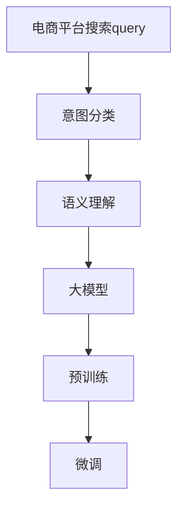

                 

# 电商平台搜索query意图分类：AI大模型的语义理解

> 关键词：电商平台,搜索query,意图分类,语义理解,大模型

## 1. 背景介绍

在数字化时代，电商平台已成为用户获取商品信息、完成购物的主要渠道。面对海量商品，如何高效、精准地匹配用户搜索query，优化用户体验，提升交易转化率，成为电商平台亟待解决的关键问题。

**意图分类**（Intent Classification）指的是对用户查询意图进行自动识别和分类的过程。通过了解用户查询的真正意图，电商平台能够提供更加贴合需求的结果，如精准推荐、产品排序、自动补全等。因此，意图分类在提升用户满意度、增加销售转化等方面具有重要意义。

近年来，随着深度学习技术的发展，基于大模型（如BERT、GPT等）的语义理解能力在NLP领域取得了巨大突破，显著提升了意图分类的精度。本文将详细探讨利用大模型进行意图分类的原理、技术和实践，以期为电商平台的搜索query优化提供理论和技术指导。

## 2. 核心概念与联系

### 2.1 核心概念概述

在进行意图分类前，首先需要理解以下几个核心概念：

- **电商平台搜索query**：用户通过电商平台搜索框输入的文本，旨在获取特定商品或信息。
- **意图分类**：对用户查询的意图进行自动识别和分类，如查找产品、了解信息、售后服务等。
- **大模型**：以自回归(如GPT)或自编码(如BERT)为代表的大规模预训练语言模型，通过在大规模无标签文本数据上进行预训练，学习通用的语言表示。
- **语义理解**：大模型能够自动理解查询中的语言语义，提取关键信息，进行意图判断。

这些概念之间的逻辑关系可以通过以下Mermaid流程图来展示：



这个流程图展示了大模型在电商平台搜索query意图分类中的核心作用：

1. **预训练**：通过大规模无标签文本数据对大模型进行训练，学习通用的语言表示。
2. **微调**：根据特定电商平台的业务需求，对预训练模型进行微调，提升其在电商场景中的意图分类能力。
3. **语义理解**：利用微调后的模型，对搜索query进行语义理解，提取关键信息。
4. **意图分类**：根据语义理解结果，对查询意图进行分类，输出分类结果。

通过这些步骤，电商平台的搜索query意图分类能力得到了显著提升。

## 3. 核心算法原理 & 具体操作步骤
### 3.1 算法原理概述

大模型进行意图分类的基本原理如下：

1. **预训练**：利用大规模无标签文本数据对大模型进行预训练，学习通用的语言表示和语义理解能力。
2. **微调**：根据电商平台的业务需求，对预训练模型进行微调，使其在特定电商场景中具备良好的意图分类能力。
3. **语义理解**：在微调后的模型基础上，对搜索query进行语义理解，提取关键信息，如商品名称、属性、类别等。
4. **意图分类**：基于语义理解结果，使用分类算法对查询意图进行自动识别和分类。

### 3.2 算法步骤详解

基于大模型的意图分类通常包括以下几个关键步骤：

**Step 1: 准备预训练模型和数据集**
- 选择合适的预训练语言模型，如BERT、GPT等。
- 准备电商平台的搜索query数据集，包含不同场景下的查询样本。

**Step 2: 添加任务适配层**
- 根据电商平台的业务需求，设计适当的任务适配层，如添加多分类器、自定义损失函数等。
- 将预训练模型顶层与适配层连接，构成完整的模型。

**Step 3: 设置微调超参数**
- 选择合适的优化算法及其参数，如AdamW、SGD等，设置学习率、批大小、迭代轮数等。
- 设置正则化技术及强度，包括权重衰减、Dropout、Early Stopping等。
- 确定冻结预训练参数的策略，如仅微调顶层，或全部参数都参与微调。

**Step 4: 执行梯度训练**
- 将训练集数据分批次输入模型，前向传播计算损失函数。
- 反向传播计算参数梯度，根据设定的优化算法和学习率更新模型参数。
- 周期性在验证集上评估模型性能，根据性能指标决定是否触发 Early Stopping。
- 重复上述步骤直到满足预设的迭代轮数或 Early Stopping 条件。

**Step 5: 测试和部署**
- 在测试集上评估微调后模型在电商平台的意图分类效果。
- 使用微调后的模型对新用户搜索query进行意图分类，集成到实际的应用系统中。
- 持续收集新的数据，定期重新微调模型，以适应数据分布的变化。

### 3.3 算法优缺点

利用大模型进行意图分类的优势在于：

- **语义理解能力强**：大模型能够自动理解查询中的语言语义，提取关键信息，如商品名称、属性、类别等。
- **泛化能力强**：由于预训练模型在大规模数据上进行训练，具有较强的泛化能力，能够适应不同电商平台的业务需求。
- **可扩展性强**：利用现有大模型，可以快速部署意图分类应用，无需从头开始训练。

同时，该方法也存在一定的局限性：

- **依赖数据质量**：微调效果很大程度上取决于训练数据的数量和质量，电商平台的搜索query数据量有限，难以覆盖所有场景。
- **计算资源需求高**：大规模预训练模型对计算资源有较高要求，微调过程计算开销大。
- **过拟合风险**：模型在特定电商场景下进行微调，可能对其他场景的泛化能力有所牺牲。

尽管存在这些局限性，但就目前而言，基于大模型的意图分类方法仍是电商平台搜索query优化的重要手段。未来相关研究的重点在于如何进一步降低计算资源需求，提高模型泛化能力，同时兼顾准确性和实时性等因素。

### 3.4 算法应用领域

基于大模型的意图分类方法在电商平台的搜索query优化中得到了广泛应用，覆盖了如下几个核心场景：

- **精准推荐**：根据用户查询意图，推荐相关商品，提升用户体验。
- **自动补全**：自动补全用户输入的查询内容，帮助用户快速完成搜索。
- **搜索结果排序**：根据查询意图，优化搜索结果的排序，提升相关性。
- **用户行为分析**：分析用户查询行为，了解用户需求，指导后续的优化和改进。

除了上述这些经典应用外，大模型还可用于情感分析、用户画像构建、市场趋势预测等多个电商运营场景，为电商平台的智能化转型提供有力支持。

## 4. 数学模型和公式 & 详细讲解  
### 4.1 数学模型构建

假设预训练语言模型为 $M_{\theta}$，其中 $\theta$ 为预训练得到的模型参数。电商平台的搜索query为 $q \in \mathcal{Q}$，意图分类结果为 $y \in \{0,1\}$，表示查询意图为购买或浏览。

定义模型 $M_{\theta}$ 在输入 $q$ 上的输出为 $\hat{y}=M_{\theta}(q) \in [0,1]$，表示模型预测查询意图为购买的概率。在电商平台的意图分类任务中，常用的目标函数为二分类交叉熵损失函数：

$$
\ell(M_{\theta}(q),y) = -y\log \hat{y} - (1-y)\log (1-\hat{y})
$$

在训练过程中，我们通过最小化平均损失函数 $\mathcal{L}(\theta)$ 进行模型优化：

$$
\mathcal{L}(\theta) = \frac{1}{N}\sum_{i=1}^N \ell(M_{\theta}(q_i),y_i)
$$

其中 $N$ 为训练样本数量，$q_i$ 和 $y_i$ 分别表示第 $i$ 个训练样本的查询和意图标签。

### 4.2 公式推导过程

对于电商平台的搜索query $q$，通过微调后的模型 $M_{\theta}$ 计算其意图分类概率 $\hat{y}$。将二分类交叉熵损失函数代入目标函数，得到：

$$
\mathcal{L}(\theta) = -\frac{1}{N}\sum_{i=1}^N [y_i\log \hat{y}_i+(1-y_i)\log(1-\hat{y}_i)]
$$

其中 $y_i$ 表示第 $i$ 个训练样本的真实意图标签。

在优化过程中，我们通过反向传播算法计算损失函数 $\mathcal{L}(\theta)$ 对参数 $\theta$ 的梯度，并使用优化算法（如AdamW）更新模型参数。具体计算步骤如下：

1. 前向传播：将查询 $q$ 输入模型，计算输出 $\hat{y}$。
2. 损失计算：计算当前输入的查询对应的损失 $\ell(M_{\theta}(q),y)$。
3. 反向传播：计算梯度 $\frac{\partial \mathcal{L}(\theta)}{\partial \theta}$。
4. 参数更新：使用优化算法更新模型参数 $\theta$。

### 4.3 案例分析与讲解

以电商平台常见的商品搜索query为例，分析意图分类的具体过程。

假设电商平台的商品信息为 $\{商品1, 商品2, \cdots, 商品N\}$，用户查询为 $q$。我们首先需要将查询 $q$ 进行预处理，包括分词、去除停用词、词性标注等。然后，将预处理后的查询输入到微调后的模型 $M_{\theta}$，得到模型预测的意图概率 $\hat{y}$。

根据 $\hat{y}$ 的大小，可以确定查询的意图。例如，当 $\hat{y} > 0.5$ 时，认为用户查询意图为购买；当 $\hat{y} < 0.5$ 时，认为用户查询意图为浏览。具体来说，可以设定阈值 $\tau$，当 $\hat{y} > \tau$ 时，输出意图购买；当 $\hat{y} < \tau$ 时，输出意图浏览。

例如，对于查询 $q = "T恤衫" + "价格" + "北京"，通过模型预测得到 $\hat{y} = 0.8$，高于设定的阈值 $\tau = 0.5$，因此判断用户查询意图为购买。进一步，可以根据 $\hat{y}$ 的值进行商品推荐、搜索结果排序等优化操作。

## 5. 项目实践：代码实例和详细解释说明
### 5.1 开发环境搭建

在进行意图分类项目实践前，我们需要准备好开发环境。以下是使用Python进行PyTorch开发的环境配置流程：

1. 安装Anaconda：从官网下载并安装Anaconda，用于创建独立的Python环境。

2. 创建并激活虚拟环境：
```bash
conda create -n intent-classification python=3.8 
conda activate intent-classification
```

3. 安装PyTorch：根据CUDA版本，从官网获取对应的安装命令。例如：
```bash
conda install pytorch torchvision torchaudio cudatoolkit=11.1 -c pytorch -c conda-forge
```

4. 安装TensorFlow：由Google主导开发的开源深度学习框架，生产部署方便，适合大规模工程应用。同样有丰富的预训练语言模型资源。

5. 安装Transformers库：HuggingFace开发的NLP工具库，集成了众多SOTA语言模型，支持PyTorch和TensorFlow，是进行意图分类开发的利器。

6. 安装各类工具包：
```bash
pip install numpy pandas scikit-learn matplotlib tqdm jupyter notebook ipython
```

完成上述步骤后，即可在`intent-classification`环境中开始意图分类实践。

### 5.2 源代码详细实现

这里我们以基于BERT的意图分类模型为例，给出使用PyTorch的代码实现。

首先，定义意图分类的数据处理函数：

```python
from transformers import BertTokenizer
from torch.utils.data import Dataset, DataLoader
import torch

class IntentDataset(Dataset):
    def __init__(self, texts, labels, tokenizer):
        self.texts = texts
        self.labels = labels
        self.tokenizer = tokenizer
        
    def __len__(self):
        return len(self.texts)
    
    def __getitem__(self, item):
        text = self.texts[item]
        label = self.labels[item]
        
        encoding = self.tokenizer(text, return_tensors='pt', max_length=512, padding='max_length', truncation=True)
        input_ids = encoding['input_ids'][0]
        attention_mask = encoding['attention_mask'][0]
        
        return {'input_ids': input_ids, 
                'attention_mask': attention_mask,
                'labels': torch.tensor(label, dtype=torch.long)}
```

然后，定义模型和优化器：

```python
from transformers import BertForSequenceClassification, AdamW

model = BertForSequenceClassification.from_pretrained('bert-base-cased', num_labels=2)

optimizer = AdamW(model.parameters(), lr=2e-5)
```

接着，定义训练和评估函数：

```python
from tqdm import tqdm
from sklearn.metrics import classification_report

device = torch.device('cuda') if torch.cuda.is_available() else torch.device('cpu')
model.to(device)

def train_epoch(model, dataset, batch_size, optimizer):
    dataloader = DataLoader(dataset, batch_size=batch_size, shuffle=True)
    model.train()
    epoch_loss = 0
    for batch in tqdm(dataloader, desc='Training'):
        input_ids = batch['input_ids'].to(device)
        attention_mask = batch['attention_mask'].to(device)
        labels = batch['labels'].to(device)
        model.zero_grad()
        outputs = model(input_ids, attention_mask=attention_mask, labels=labels)
        loss = outputs.loss
        epoch_loss += loss.item()
        loss.backward()
        optimizer.step()
    return epoch_loss / len(dataloader)

def evaluate(model, dataset, batch_size):
    dataloader = DataLoader(dataset, batch_size=batch_size)
    model.eval()
    preds, labels = [], []
    with torch.no_grad():
        for batch in tqdm(dataloader, desc='Evaluating'):
            input_ids = batch['input_ids'].to(device)
            attention_mask = batch['attention_mask'].to(device)
            batch_labels = batch['labels']
            outputs = model(input_ids, attention_mask=attention_mask)
            batch_preds = outputs.logits.argmax(dim=2).to('cpu').tolist()
            batch_labels = batch_labels.to('cpu').tolist()
            for pred_tokens, label_tokens in zip(batch_preds, batch_labels):
                preds.append(pred_tokens[0])
                labels.append(label_tokens[0])
                
    print(classification_report(labels, preds))
```

最后，启动训练流程并在测试集上评估：

```python
epochs = 5
batch_size = 16

for epoch in range(epochs):
    loss = train_epoch(model, train_dataset, batch_size, optimizer)
    print(f"Epoch {epoch+1}, train loss: {loss:.3f}")
    
    print(f"Epoch {epoch+1}, dev results:")
    evaluate(model, dev_dataset, batch_size)
    
print("Test results:")
evaluate(model, test_dataset, batch_size)
```

以上就是使用PyTorch对BERT进行意图分类的完整代码实现。可以看到，得益于Transformers库的强大封装，我们能够用相对简洁的代码完成BERT模型的加载和意图分类。

### 5.3 代码解读与分析

让我们再详细解读一下关键代码的实现细节：

**IntentDataset类**：
- `__init__`方法：初始化文本、标签、分词器等关键组件。
- `__len__`方法：返回数据集的样本数量。
- `__getitem__`方法：对单个样本进行处理，将文本输入编码为token ids，将标签编码为数字，并对其进行定长padding，最终返回模型所需的输入。

**模型和优化器定义**：
- 使用`BertForSequenceClassification`类加载预训练的BERT模型，并设置输出层为二分类。
- 选择合适的优化器，如AdamW，设置学习率。

**训练和评估函数**：
- 使用PyTorch的DataLoader对数据集进行批次化加载，供模型训练和推理使用。
- 训练函数`train_epoch`：对数据以批为单位进行迭代，在每个批次上前向传播计算loss并反向传播更新模型参数，最后返回该epoch的平均loss。
- 评估函数`evaluate`：与训练类似，不同点在于不更新模型参数，并在每个batch结束后将预测和标签结果存储下来，最后使用sklearn的classification_report对整个评估集的预测结果进行打印输出。

**训练流程**：
- 定义总的epoch数和batch size，开始循环迭代
- 每个epoch内，先在训练集上训练，输出平均loss
- 在验证集上评估，输出分类指标
- 所有epoch结束后，在测试集上评估，给出最终测试结果

可以看到，PyTorch配合Transformers库使得BERT意图分类的代码实现变得简洁高效。开发者可以将更多精力放在数据处理、模型改进等高层逻辑上，而不必过多关注底层的实现细节。

当然，工业级的系统实现还需考虑更多因素，如模型的保存和部署、超参数的自动搜索、更灵活的任务适配层等。但核心的意图分类范式基本与此类似。

## 6. 实际应用场景
### 6.1 智能客服系统

基于大模型的意图分类技术，可以广泛应用于智能客服系统的构建。传统客服往往需要配备大量人力，高峰期响应缓慢，且一致性和专业性难以保证。而使用意图分类的对话模型，可以7x24小时不间断服务，快速响应客户咨询，用自然流畅的语言解答各类常见问题。

在技术实现上，可以收集企业内部的历史客服对话记录，将问题和最佳答复构建成监督数据，在此基础上对预训练模型进行意图分类微调。微调后的对话模型能够自动理解用户意图，匹配最合适的答案模板进行回复。对于客户提出的新问题，还可以接入检索系统实时搜索相关内容，动态组织生成回答。如此构建的智能客服系统，能大幅提升客户咨询体验和问题解决效率。

### 6.2 金融舆情监测

金融机构需要实时监测市场舆论动向，以便及时应对负面信息传播，规避金融风险。传统的人工监测方式成本高、效率低，难以应对网络时代海量信息爆发的挑战。基于大模型意图分类的文本分类和情感分析技术，为金融舆情监测提供了新的解决方案。

具体而言，可以收集金融领域相关的新闻、报道、评论等文本数据，并对其进行主题标注和情感标注。在此基础上对预训练语言模型进行意图分类微调，使其能够自动判断文本属于何种主题，情感倾向是正面、中性还是负面。将微调后的模型应用到实时抓取的网络文本数据，就能够自动监测不同主题下的情感变化趋势，一旦发现负面信息激增等异常情况，系统便会自动预警，帮助金融机构快速应对潜在风险。

### 6.3 个性化推荐系统

当前的推荐系统往往只依赖用户的历史行为数据进行物品推荐，无法深入理解用户的真实兴趣偏好。基于大模型意图分类的个性化推荐系统可以更好地挖掘用户行为背后的语义信息，从而提供更精准、多样的推荐内容。

在实践中，可以收集用户浏览、点击、评论、分享等行为数据，提取和用户交互的物品标题、描述、标签等文本内容。将文本内容作为模型输入，用户的后续行为（如是否点击、购买等）作为监督信号，在此基础上微调预训练语言模型。微调后的模型能够从文本内容中准确把握用户的兴趣点。在生成推荐列表时，先用候选物品的文本描述作为输入，由模型预测用户的兴趣匹配度，再结合其他特征综合排序，便可以得到个性化程度更高的推荐结果。

### 6.4 未来应用展望

随着大模型和意图分类的不断发展，基于意图分类的技术将在更多领域得到应用，为传统行业数字化转型升级提供新的技术路径。

在智慧医疗领域，基于意图分类的医疗问答、病历分析、药物研发等应用将提升医疗服务的智能化水平，辅助医生诊疗，加速新药开发进程。

在智能教育领域，意图分类技术可用于作业批改、学情分析、知识推荐等方面，因材施教，促进教育公平，提高教学质量。

在智慧城市治理中，意图分类技术可用于城市事件监测、舆情分析、应急指挥等环节，提高城市管理的自动化和智能化水平，构建更安全、高效的未来城市。

此外，在企业生产、社会治理、文娱传媒等众多领域，基于大模型意图分类的应用也将不断涌现，为NLP技术带来全新的突破。相信随着预训练语言模型和意图分类方法的持续演进，意图分类技术必将在构建人机协同的智能系统中扮演越来越重要的角色。

## 7. 工具和资源推荐
### 7.1 学习资源推荐

为了帮助开发者系统掌握意图分类的理论基础和实践技巧，这里推荐一些优质的学习资源：

1. 《Transformers from Scratch》系列博文：由大模型技术专家撰写，深入浅出地介绍了Transformer原理、BERT模型、意图分类等前沿话题。

2. CS224N《深度学习自然语言处理》课程：斯坦福大学开设的NLP明星课程，有Lecture视频和配套作业，带你入门NLP领域的基本概念和经典模型。

3. 《Natural Language Processing with Transformers》书籍：Transformers库的作者所著，全面介绍了如何使用Transformers库进行NLP任务开发，包括意图分类在内的诸多范式。

4. HuggingFace官方文档：Transformers库的官方文档，提供了海量预训练模型和完整的意图分类样例代码，是上手实践的必备资料。

5. CLUE开源项目：中文语言理解测评基准，涵盖大量不同类型的中文NLP数据集，并提供了基于意图分类的baseline模型，助力中文NLP技术发展。

通过对这些资源的学习实践，相信你一定能够快速掌握大模型意图分类的精髓，并用于解决实际的NLP问题。

### 7.2 开发工具推荐

高效的开发离不开优秀的工具支持。以下是几款用于意图分类开发的常用工具：

1. PyTorch：基于Python的开源深度学习框架，灵活动态的计算图，适合快速迭代研究。大部分预训练语言模型都有PyTorch版本的实现。

2. TensorFlow：由Google主导开发的开源深度学习框架，生产部署方便，适合大规模工程应用。同样有丰富的预训练语言模型资源。

3. Transformers库：HuggingFace开发的NLP工具库，集成了众多SOTA语言模型，支持PyTorch和TensorFlow，是进行意图分类开发的利器。

4. Weights & Biases：模型训练的实验跟踪工具，可以记录和可视化模型训练过程中的各项指标，方便对比和调优。与主流深度学习框架无缝集成。

5. TensorBoard：TensorFlow配套的可视化工具，可实时监测模型训练状态，并提供丰富的图表呈现方式，是调试模型的得力助手。

6. Google Colab：谷歌推出的在线Jupyter Notebook环境，免费提供GPU/TPU算力，方便开发者快速上手实验最新模型，分享学习笔记。

合理利用这些工具，可以显著提升意图分类任务的开发效率，加快创新迭代的步伐。

### 7.3 相关论文推荐

意图分类的发展源于学界的持续研究。以下是几篇奠基性的相关论文，推荐阅读：

1. Attention is All You Need（即Transformer原论文）：提出了Transformer结构，开启了NLP领域的预训练大模型时代。

2. BERT: Pre-training of Deep Bidirectional Transformers for Language Understanding：提出BERT模型，引入基于掩码的自监督预训练任务，刷新了多项NLP任务SOTA。

3. Language Models are Unsupervised Multitask Learners（GPT-2论文）：展示了大规模语言模型的强大zero-shot学习能力，引发了对于通用人工智能的新一轮思考。

4. Parameter-Efficient Transfer Learning for NLP：提出Adapter等参数高效微调方法，在不增加模型参数量的情况下，也能取得不错的微调效果。

5. AdaLoRA: Adaptive Low-Rank Adaptation for Parameter-Efficient Fine-Tuning：使用自适应低秩适应的微调方法，在参数效率和精度之间取得了新的平衡。

这些论文代表了大模型意图分类的发展脉络。通过学习这些前沿成果，可以帮助研究者把握学科前进方向，激发更多的创新灵感。

## 8. 总结：未来发展趋势与挑战
### 8.1 总结

本文对基于大模型的电商平台搜索query意图分类方法进行了全面系统的介绍。首先阐述了意图分类的背景和重要性，明确了意图分类在提升用户体验、增加销售转化等方面的价值。其次，从原理到实践，详细讲解了意图分类的数学模型和算法步骤，给出了意图分类任务开发的完整代码实例。同时，本文还广泛探讨了意图分类在电商、金融、个性化推荐等多个领域的应用前景，展示了意图分类的巨大潜力。

通过本文的系统梳理，可以看到，基于大模型的意图分类方法在电商平台的搜索query优化中具有广泛的应用前景，能够显著提升用户查询的精度和效率，带来更好的用户体验。未来，伴随大模型和意图分类的持续演进，意图分类技术必将在更多领域得到应用，为各行各业的智能化转型提供新动力。

### 8.2 未来发展趋势

展望未来，意图分类技术的发展趋势如下：

1. **模型规模持续增大**：随着算力成本的下降和数据规模的扩张，预训练语言模型的参数量还将持续增长。超大规模语言模型蕴含的丰富语言知识，有望支撑更加复杂多变的意图分类任务。

2. **意图分类范式多样化**：除了传统的基于监督学习的分类方法，未来将出现更多参数高效的意图分类方法，如Prefix-Tuning、LoRA等，在减小计算资源消耗的同时也能保证分类精度。

3. **跨领域意图分类**：传统的意图分类任务集中在特定领域，未来意图分类技术将逐步拓展到更多跨领域任务中，如情感分析、新闻分类、信息抽取等，提升NLP技术的多样性和通用性。

4. **模型轻量化**：大模型虽然在精度上占据优势，但在实际部署时面临计算资源和存储资源的限制。未来的意图分类模型将更加注重轻量化，降低计算和存储成本。

5. **实时意图分类**：实时性在智能客服、智能推荐等场景中具有重要意义。未来的意图分类模型将更加注重实时性，通过模型压缩、优化等手段，提高推理速度。

6. **用户意图理解**：传统的意图分类往往只关注单一的分类结果，未来的意图分类技术将更多地考虑用户的真实意图和上下文语境，提升交互体验。

这些趋势凸显了意图分类技术的广阔前景。随着技术的不断演进，意图分类技术将在更多场景中得到应用，为各行各业带来变革性影响。

### 8.3 面临的挑战

尽管意图分类技术已经取得了一定的进展，但在迈向更加智能化、普适化应用的过程中，它仍面临诸多挑战：

1. **数据质量瓶颈**：意图分类依赖于高质量的标注数据，电商平台的搜索query数据量有限，难以覆盖所有场景，导致模型泛化能力不足。如何获取更多高质量标注数据，是未来研究的重要方向。

2. **计算资源需求高**：大规模预训练模型对计算资源有较高要求，微调过程计算开销大。如何降低计算资源需求，提高模型推理速度，仍是未来的研究方向。

3. **模型鲁棒性不足**：意图分类模型面对域外数据时，泛化性能往往大打折扣。如何提高模型的鲁棒性，避免灾难性遗忘，还需要更多理论和实践的积累。

4. **可解释性不足**：意图分类模型通常缺乏可解释性，难以对其推理逻辑进行分析和调试。对于医疗、金融等高风险应用，算法的可解释性和可审计性尤为重要。如何赋予意图分类模型更强的可解释性，将是亟待攻克的难题。

5. **安全性有待保障**：意图分类模型可能学习到有偏见、有害的信息，通过意图分类传递到实际应用，产生误导性、歧视性的输出，给实际应用带来安全隐患。如何从数据和算法层面消除模型偏见，避免恶意用途，确保输出的安全性，也将是重要的研究课题。

6. **知识整合能力不足**：现有的意图分类模型往往局限于任务内数据，难以灵活吸收和运用更广泛的先验知识。如何让意图分类过程更好地与外部知识库、规则库等专家知识结合，形成更加全面、准确的信息整合能力，还有很大的想象空间。

正视意图分类面临的这些挑战，积极应对并寻求突破，将是大模型意图分类技术走向成熟的必由之路。相信随着学界和产业界的共同努力，这些挑战终将一一被克服，意图分类技术必将在构建安全、可靠、可解释、可控的智能系统中发挥更大的作用。

### 8.4 研究展望

面向未来，意图分类技术需要在以下几个方面寻求新的突破：

1. **无监督和半监督意图分类**：探索无监督和半监督意图分类方法，摆脱对大规模标注数据的依赖，利用自监督学习、主动学习等无监督和半监督范式，最大限度利用非结构化数据，实现更加灵活高效的意图分类。

2. **参数高效和计算高效的意图分类方法**：开发更加参数高效的意图分类方法，在固定大部分预训练参数的同时，只更新极少量的任务相关参数。同时优化意图分类的计算图，减少前向传播和反向传播的资源消耗，实现更加轻量级、实时性的部署。

3. **因果分析和博弈论工具**：将因果分析方法引入意图分类模型，识别出模型决策的关键特征，增强输出解释的因果性和逻辑性。借助博弈论工具刻画人机交互过程，主动探索并规避模型的脆弱点，提高系统稳定性。

4. **引入更多先验知识**：将符号化的先验知识，如知识图谱、逻辑规则等，与神经网络模型进行巧妙融合，引导意图分类过程学习更准确、合理的语言模型。同时加强不同模态数据的整合，实现视觉、语音等多模态信息与文本信息的协同建模。

5. **纳入伦理道德约束**：在模型训练目标中引入伦理导向的评估指标，过滤和惩罚有偏见、有害的输出倾向。同时加强人工干预和审核，建立模型行为的监管机制，确保输出符合人类价值观和伦理道德。

这些研究方向的探索，必将引领意图分类技术迈向更高的台阶，为构建安全、可靠、可解释、可控的智能系统铺平道路。面向未来，意图分类技术还需要与其他人工智能技术进行更深入的融合，如知识表示、因果推理、强化学习等，多路径协同发力，共同推动自然语言理解和智能交互系统的进步。只有勇于创新、敢于突破，才能不断拓展意图分类的边界，让智能技术更好地造福人类社会。

## 9. 附录：常见问题与解答

**Q1：大模型在意图分类中是否适用于所有场景？**

A: 大模型在电商平台搜索query意图分类中具有较高的适用性，但对于一些特定领域，如医疗、法律等，仅仅依靠通用语料预训练的模型可能难以很好地适应。此时需要在特定领域语料上进一步预训练，再进行微调，才能获得理想效果。此外，对于一些需要时效性、个性化很强的任务，如对话、推荐等，意图分类方法也需要针对性的改进优化。

**Q2：如何选择合适的学习率？**

A: 意图分类的学习率一般要比预训练时小1-2个数量级，如果使用过大的学习率，容易破坏预训练权重，导致过拟合。一般建议从1e-5开始调参，逐步减小学习率，直至收敛。也可以使用warmup策略，在开始阶段使用较小的学习率，再逐渐过渡到预设值。需要注意的是，不同的优化器(如AdamW、Adafactor等)以及不同的学习率调度策略，可能需要设置不同的学习率阈值。

**Q3：意图分类过程中如何缓解过拟合问题？**

A: 过拟合是意图分类面临的主要挑战，尤其是在标注数据不足的情况下。常见的缓解策略包括：
1. 数据增强：通过回译、近义替换等方式扩充训练集
2. 正则化：使用L2正则、Dropout、Early Stopping等避免过拟合
3. 对抗训练：引入对抗样本，提高模型鲁棒性
4. 参数高效微调：只调整少量参数(如Adapter、Prefix等)，减小过拟合风险
5. 多模型集成：训练多个意图分类模型，取平均输出，抑制过拟合

这些策略往往需要根据具体任务和数据特点进行灵活组合。只有在数据、模型、训练、推理等各环节进行全面优化，才能最大限度地发挥大模型意图分类的威力。

**Q4：意图分类模型在落地部署时需要注意哪些问题？**

A: 将意图分类模型转化为实际应用，还需要考虑以下因素：
1. 模型裁剪：去除不必要的层和参数，减小模型尺寸，加快推理速度
2. 量化加速：将浮点模型转为定点模型，压缩存储空间，提高计算效率
3. 服务化封装：将模型封装为标准化服务接口，便于集成调用
4. 弹性伸缩：根据请求流量动态调整资源配置，平衡服务质量和成本
5. 监控告警：实时采集系统指标，设置异常告警阈值，确保服务稳定性
6. 安全防护：采用访问鉴权、数据脱敏等措施，保障数据和模型安全

大模型意图分类为电商平台搜索query优化提供了强大的支持，但如何将强大的性能转化为稳定、高效、安全的业务价值，还需要工程实践的不断打磨。唯有从数据、算法、工程、业务等多个维度协同发力，才能真正实现人工智能技术在电商平台的规模化落地。

总之，意图分类需要开发者根据具体任务，不断迭代和优化模型、数据和算法，方能得到理想的效果。通过本文的系统梳理，相信你一定能够快速掌握大模型意图分类的精髓，并用于解决实际的NLP问题。

---

作者：禅与计算机程序设计艺术 / Zen and the Art of Computer Programming

