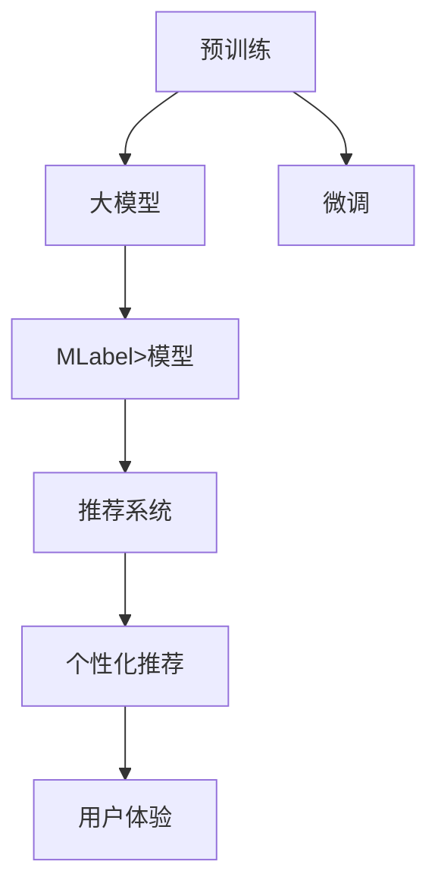

                 

# 电商平台搜索推荐系统的AI 大mlabel>模型实践：提高系统性能、效率与用户体验

> 关键词：电商推荐系统,搜索算法,深度学习,大模型,MLabel>模型,产品推荐,用户行为分析,个性化推荐,性能优化,用户满意度

## 1. 背景介绍

### 1.1 问题由来
在现代电商平台上，用户能够通过搜索功能快速找到他们所需的产品，但如何提高搜索推荐系统的精准度、效率以及用户体验，是一个日益严峻的挑战。传统基于规则的推荐系统往往过于简略，而全连接的深度学习模型虽然效果好，但计算量巨大，难以满足实时要求。

近年来，大模型（Large Models），如BERT、GPT、BERT等，因其强大的语言理解和生成能力，在电商平台中逐渐被用于搜索推荐系统的构建。例如，Google的Bidirectional Encoder Representations from Transformers (BERT)模型通过在庞大的语料库上进行预训练，能够有效地捕获文本中的语义信息。

然而，在电商平台中，用户与商品的交互数据是动态且复杂的，仅依靠文本数据进行推荐难以全面覆盖用户需求。因此，本文旨在介绍一种基于大模型的推荐系统MLabel>，结合用户行为数据，利用深度学习技术对用户和商品进行建模，从而提升推荐效果和用户体验。

### 1.2 问题核心关键点
MLabel>模型是一种深度学习推荐系统，采用大模型作为核心技术，通过大量的无标签数据进行预训练，然后利用监督学习的方式对商品与用户的交互数据进行微调，从而学习到用户和商品的隐性语义特征。

其核心思想包括：
1. **预训练**：在大规模语料上对模型进行无监督学习，获取通用的语言表示。
2. **微调**：利用电商平台的用户与商品交互数据进行监督学习，对模型进行微调，学习特定场景下的商品与用户语义关系。
3. **多模态融合**：将用户行为数据和文本数据进行融合，得到更加全面和准确的推荐结果。

本文将从核心算法原理、具体操作步骤、数学模型、项目实践、实际应用场景等方面，深入探讨MLabel>模型在电商推荐系统中的应用。

## 2. 核心概念与联系

### 2.1 核心概念概述

为便于理解，本文先介绍一些核心概念：

- **大模型（Large Models）**：指在大量无标签数据上进行预训练的深度学习模型，如BERT、GPT等。其特点是参数规模大，语言表示能力强。
- **预训练（Pre-training）**：在无标签数据上训练模型，使其学习到通用的语言表示。
- **微调（Fine-tuning）**：在预训练模型的基础上，利用有标签数据进行监督学习，优化模型特定任务的效果。
- **多模态融合（Multi-modal Fusion）**：结合文本数据和用户行为数据，提升推荐系统的全面性和准确性。
- **MLabel>模型**：一种基于大模型的推荐系统，通过预训练和微调技术，对商品与用户进行建模，并提供更加个性化的推荐。

这些核心概念之间的关系可以通过以下Mermaid流程图来展示：



该流程图展示了从预训练到MLabel>模型构建，再到个性化推荐和用户体验的流程。预训练和大模型构建是基础，微调则是核心，多模态融合是提升推荐准确性的关键，最终的目标是实现个性化推荐和提升用户体验。

## 3. 核心算法原理 & 具体操作步骤

### 3.1 算法原理概述
MLabel>模型的核心原理是结合预训练和大模型的微调技术，利用用户行为数据和商品信息，对模型进行多层次建模，最终生成个性化的推荐结果。

具体步骤如下：

1. **预训练阶段**：在大规模语料上对大模型进行无监督学习，学习到通用的语言表示。
2. **微调阶段**：利用电商平台的用户行为数据和商品信息，对预训练后的模型进行监督学习，微调特定任务的模型参数。
3. **多模态融合**：将用户行为数据和文本数据进行融合，提升推荐系统的全面性和准确性。
4. **推荐系统构建**：利用微调后的MLabel>模型，构建搜索推荐系统，提供个性化推荐结果。

### 3.2 算法步骤详解
以商品推荐为例，MLabel>模型的具体实现步骤如下：

**Step 1: 准备数据集**

- **文本数据**：从电商平台上收集用户对商品的书评、标题、描述等信息，作为文本数据。
- **行为数据**：从电商平台上的订单、浏览、收藏、评价等信息中，提取用户对商品的操作数据。

**Step 2: 数据预处理**

- **文本数据**：对文本进行分词、去停用词、词向量化等预处理操作。
- **行为数据**：对用户行为数据进行归一化、去噪等处理。

**Step 3: 预训练阶段**

- **模型选择**：选择BERT、GPT等大模型作为预训练模型。
- **预训练数据**：使用大规模语料库（如Common Crawl数据集）进行预训练。
- **预训练任务**：使用语言模型任务（如掩码语言模型）进行预训练，学习到通用的语言表示。

**Step 4: 微调阶段**

- **模型初始化**：将预训练后的模型参数作为初始值。
- **微调数据**：使用电商平台上的用户行为数据和商品信息，生成监督学习数据。
- **微调任务**：对商品与用户的交互数据进行分类、排序等任务，优化模型参数。
- **超参数设置**：设置学习率、迭代次数、批大小等超参数。

**Step 5: 多模态融合**

- **特征提取**：对用户行为数据和文本数据进行特征提取。
- **融合策略**：利用加权、拼接、注意力机制等方式，将用户行为特征和文本特征进行融合。

**Step 6: 推荐系统构建**

- **推荐模型**：利用微调后的MLabel>模型构建搜索推荐系统。
- **评估指标**：使用NDCG、Recall、Click-Through Rate等指标，评估推荐系统的效果。
- **优化迭代**：根据评估结果，调整模型参数，提升推荐系统效果。

### 3.3 算法优缺点

**优点**：
1. **强大的语言理解能力**：通过预训练，模型能够学习到丰富的语言表示，提升推荐的语义匹配度。
2. **灵活的微调机制**：根据特定任务和数据，通过微调快速适应新的推荐场景。
3. **多模态融合**：结合用户行为数据和文本数据，提升推荐系统的全面性和准确性。

**缺点**：
1. **计算资源消耗大**：大模型需要大量的计算资源进行预训练和微调。
2. **数据依赖性高**：模型性能依赖于高质量的标注数据和预训练语料。
3. **解释性不足**：由于模型复杂，其内部决策逻辑难以解释。

### 3.4 算法应用领域

MLabel>模型主要应用于电商平台的推荐系统，提供个性化推荐结果，提升用户体验。具体应用包括：

- **商品推荐**：根据用户历史行为和浏览记录，推荐相关商品。
- **个性化展示**：根据用户兴趣，在搜索结果中展示个性化商品。
- **促销活动推荐**：根据用户行为数据，推荐相关促销活动。

此外，MLabel>模型还适用于社交媒体、在线广告等领域，通过分析用户行为和生成推荐内容，提高用户互动率和广告效果。

## 4. 数学模型和公式 & 详细讲解 & 举例说明

### 4.1 数学模型构建

MLabel>模型的核心数学模型包括预训练模型、微调模型和多模态融合模型。这里以商品推荐为例，介绍相关数学模型。

**预训练模型**：

假设预训练模型为$M_{\text{pre}}$，其参数为$\theta_{\text{pre}}$。

预训练任务为掩码语言模型（Masked Language Modeling, MLM），其目标是在掩码位置预测缺失的单词。设训练数据为$D=\{(x_i, y_i)\}_{i=1}^N$，其中$x_i$为输入文本，$y_i$为掩码位置预测的单词。预训练损失函数为：

$$
\mathcal{L}_{\text{pre}} = -\frac{1}{N} \sum_{i=1}^N \log P(y_i | x_i, \theta_{\text{pre}})
$$

**微调模型**：

在预训练模型的基础上，进行微调，优化商品与用户的交互数据。假设微调任务为分类任务，输入为商品描述$x$和用户行为$y$，输出为分类标签$z$。微调模型的损失函数为：

$$
\mathcal{L}_{\text{fin}} = -\frac{1}{N} \sum_{i=1}^N [y_i \log P(z_i | x_i, \theta_{\text{fin}}) + (1-y_i) \log P(1-z_i | x_i, \theta_{\text{fin}})]
$$

其中$P(z_i | x_i, \theta_{\text{fin}})$为微调模型在输入$x_i$上的分类概率。

**多模态融合模型**：

在预训练模型和微调模型的基础上，结合用户行为数据进行多模态融合。假设用户行为数据为$z$，其特征向量为$\boldsymbol{h}_{\text{user}}$。多模态融合模型为：

$$
\boldsymbol{h}_{\text{fusion}} = f(\boldsymbol{h}_{\text{text}}, \boldsymbol{h}_{\text{user}})
$$

其中$f$为融合策略，可以是加权、拼接、注意力机制等。

### 4.2 公式推导过程

**预训练阶段**：

以BERT模型为例，其预训练任务为掩码语言模型。假设输入文本为$x$，掩码位置为$M$，掩码位置预测的单词为$y$。预训练损失函数为：

$$
\mathcal{L}_{\text{pre}} = -\frac{1}{N} \sum_{i=1}^N \sum_{j \in M_i} \log P(y_j | x_i, \theta_{\text{pre}})
$$

其中$M_i$为输入$x_i$的掩码位置集合。

**微调阶段**：

以分类任务为例，假设商品描述为$x$，用户行为为$y$，分类标签为$z$。微调损失函数为：

$$
\mathcal{L}_{\text{fin}} = -\frac{1}{N} \sum_{i=1}^N [y_i \log P(z_i | x_i, \theta_{\text{fin}}) + (1-y_i) \log P(1-z_i | x_i, \theta_{\text{fin}})]
$$

其中$P(z_i | x_i, \theta_{\text{fin}})$为微调模型在输入$x_i$上的分类概率。

**多模态融合**：

以加权融合为例，假设用户行为特征向量为$\boldsymbol{h}_{\text{user}}$，文本特征向量为$\boldsymbol{h}_{\text{text}}$。融合后的特征向量为：

$$
\boldsymbol{h}_{\text{fusion}} = (1-\alpha) \boldsymbol{h}_{\text{text}} + \alpha \boldsymbol{h}_{\text{user}}
$$

其中$\alpha$为融合权重，通常需要根据具体任务进行调整。

### 4.3 案例分析与讲解

假设有一个电商平台，收集了用户对商品的书评、标题、描述等信息，以及用户对商品的操作数据。其目标是推荐用户可能感兴趣的商品。

**预训练阶段**：

1. 选择BERT模型作为预训练模型。
2. 使用大规模语料库（如Common Crawl数据集）进行预训练，学习到通用的语言表示。

**微调阶段**：

1. 准备电商平台的用户行为数据和商品信息，生成监督学习数据。
2. 选择分类任务作为微调目标，利用微调数据对预训练后的BERT模型进行监督学习，优化模型参数。

**多模态融合**：

1. 对用户行为数据和文本数据进行特征提取。
2. 利用加权融合策略，将用户行为特征和文本特征进行融合，生成融合后的特征向量。

**推荐系统构建**：

1. 利用微调后的BERT模型和融合后的特征向量，构建搜索推荐系统。
2. 使用NDCG、Recall、Click-Through Rate等指标，评估推荐系统的效果。
3. 根据评估结果，调整模型参数，提升推荐系统效果。

## 5. 项目实践：代码实例和详细解释说明

### 5.1 开发环境搭建

在进行项目实践前，需要准备好开发环境。以下是使用Python进行PyTorch开发的环境配置流程：

1. 安装Anaconda：从官网下载并安装Anaconda，用于创建独立的Python环境。

2. 创建并激活虚拟环境：
```bash
conda create -n pytorch-env python=3.8 
conda activate pytorch-env
```

3. 安装PyTorch：根据CUDA版本，从官网获取对应的安装命令。例如：
```bash
conda install pytorch torchvision torchaudio cudatoolkit=11.1 -c pytorch -c conda-forge
```

4. 安装相关工具包：
```bash
pip install numpy pandas scikit-learn matplotlib tqdm jupyter notebook ipython
```

5. 安装Transformer库：
```bash
pip install transformers
```

完成上述步骤后，即可在`pytorch-env`环境中开始项目实践。

### 5.2 源代码详细实现

下面我们以商品推荐为例，给出使用Transformer库对BERT模型进行微调的PyTorch代码实现。

首先，定义商品推荐的数据处理函数：

```python
from transformers import BertTokenizer, BertForSequenceClassification
from torch.utils.data import Dataset
import torch

class ProductRecommendationDataset(Dataset):
    def __init__(self, texts, tags, tokenizer, max_len=128):
        self.texts = texts
        self.tags = tags
        self.tokenizer = tokenizer
        self.max_len = max_len
        
    def __len__(self):
        return len(self.texts)
    
    def __getitem__(self, item):
        text = self.texts[item]
        tag = self.tags[item]
        
        encoding = self.tokenizer(text, return_tensors='pt', max_length=self.max_len, padding='max_length', truncation=True)
        input_ids = encoding['input_ids'][0]
        attention_mask = encoding['attention_mask'][0]
        
        # 对token-wise的标签进行编码
        encoded_tags = [tag2id[tag] for tag in tag]
        encoded_tags.extend([tag2id['O']] * (self.max_len - len(encoded_tags)))
        labels = torch.tensor(encoded_tags, dtype=torch.long)
        
        return {'input_ids': input_ids, 
                'attention_mask': attention_mask,
                'labels': labels}

# 标签与id的映射
tag2id = {'O': 0, 'Product_A': 1, 'Product_B': 2, 'Product_C': 3}
id2tag = {v: k for k, v in tag2id.items()}

# 创建dataset
tokenizer = BertTokenizer.from_pretrained('bert-base-cased')

train_dataset = ProductRecommendationDataset(train_texts, train_tags, tokenizer)
dev_dataset = ProductRecommendationDataset(dev_texts, dev_tags, tokenizer)
test_dataset = ProductRecommendationDataset(test_texts, test_tags, tokenizer)
```

然后，定义模型和优化器：

```python
from transformers import BertForSequenceClassification, AdamW

model = BertForSequenceClassification.from_pretrained('bert-base-cased', num_labels=len(tag2id))

optimizer = AdamW(model.parameters(), lr=2e-5)
```

接着，定义训练和评估函数：

```python
from torch.utils.data import DataLoader
from tqdm import tqdm
from sklearn.metrics import classification_report

device = torch.device('cuda') if torch.cuda.is_available() else torch.device('cpu')
model.to(device)

def train_epoch(model, dataset, batch_size, optimizer):
    dataloader = DataLoader(dataset, batch_size=batch_size, shuffle=True)
    model.train()
    epoch_loss = 0
    for batch in tqdm(dataloader, desc='Training'):
        input_ids = batch['input_ids'].to(device)
        attention_mask = batch['attention_mask'].to(device)
        labels = batch['labels'].to(device)
        model.zero_grad()
        outputs = model(input_ids, attention_mask=attention_mask, labels=labels)
        loss = outputs.loss
        epoch_loss += loss.item()
        loss.backward()
        optimizer.step()
    return epoch_loss / len(dataloader)

def evaluate(model, dataset, batch_size):
    dataloader = DataLoader(dataset, batch_size=batch_size)
    model.eval()
    preds, labels = [], []
    with torch.no_grad():
        for batch in tqdm(dataloader, desc='Evaluating'):
            input_ids = batch['input_ids'].to(device)
            attention_mask = batch['attention_mask'].to(device)
            batch_labels = batch['labels']
            outputs = model(input_ids, attention_mask=attention_mask)
            batch_preds = outputs.logits.argmax(dim=2).to('cpu').tolist()
            batch_labels = batch_labels.to('cpu').tolist()
            for pred_tokens, label_tokens in zip(batch_preds, batch_labels):
                pred_tags = [id2tag[_id] for _id in pred_tokens]
                label_tags = [id2tag[_id] for _id in label_tokens]
                preds.append(pred_tags[:len(label_tokens)])
                labels.append(label_tags)
                
    print(classification_report(labels, preds))
```

最后，启动训练流程并在测试集上评估：

```python
epochs = 5
batch_size = 16

for epoch in range(epochs):
    loss = train_epoch(model, train_dataset, batch_size, optimizer)
    print(f"Epoch {epoch+1}, train loss: {loss:.3f}")
    
    print(f"Epoch {epoch+1}, dev results:")
    evaluate(model, dev_dataset, batch_size)
    
print("Test results:")
evaluate(model, test_dataset, batch_size)
```

以上就是使用PyTorch对BERT进行商品推荐任务微调的完整代码实现。可以看到，得益于Transformer库的强大封装，我们可以用相对简洁的代码完成BERT模型的加载和微调。

### 5.3 代码解读与分析

让我们再详细解读一下关键代码的实现细节：

**ProductRecommendationDataset类**：
- `__init__`方法：初始化文本、标签、分词器等关键组件。
- `__len__`方法：返回数据集的样本数量。
- `__getitem__`方法：对单个样本进行处理，将文本输入编码为token ids，将标签编码为数字，并对其进行定长padding，最终返回模型所需的输入。

**tag2id和id2tag字典**：
- 定义了标签与数字id之间的映射关系，用于将token-wise的预测结果解码回真实的标签。

**训练和评估函数**：
- 使用PyTorch的DataLoader对数据集进行批次化加载，供模型训练和推理使用。
- 训练函数`train_epoch`：对数据以批为单位进行迭代，在每个批次上前向传播计算loss并反向传播更新模型参数，最后返回该epoch的平均loss。
- 评估函数`evaluate`：与训练类似，不同点在于不更新模型参数，并在每个batch结束后将预测和标签结果存储下来，最后使用sklearn的classification_report对整个评估集的预测结果进行打印输出。

**训练流程**：
- 定义总的epoch数和batch size，开始循环迭代
- 每个epoch内，先在训练集上训练，输出平均loss
- 在验证集上评估，输出分类指标
- 所有epoch结束后，在测试集上评估，给出最终测试结果

可以看到，PyTorch配合Transformer库使得BERT微调的代码实现变得简洁高效。开发者可以将更多精力放在数据处理、模型改进等高层逻辑上，而不必过多关注底层的实现细节。

当然，工业级的系统实现还需考虑更多因素，如模型的保存和部署、超参数的自动搜索、更灵活的任务适配层等。但核心的微调范式基本与此类似。

## 6. 实际应用场景

### 6.1 智能客服系统

基于大模型微调的对话技术，可以广泛应用于智能客服系统的构建。传统客服往往需要配备大量人力，高峰期响应缓慢，且一致性和专业性难以保证。而使用微调后的对话模型，可以7x24小时不间断服务，快速响应客户咨询，用自然流畅的语言解答各类常见问题。

在技术实现上，可以收集企业内部的历史客服对话记录，将问题和最佳答复构建成监督数据，在此基础上对预训练对话模型进行微调。微调后的对话模型能够自动理解用户意图，匹配最合适的答案模板进行回复。对于客户提出的新问题，还可以接入检索系统实时搜索相关内容，动态组织生成回答。如此构建的智能客服系统，能大幅提升客户咨询体验和问题解决效率。

### 6.2 金融舆情监测

金融机构需要实时监测市场舆论动向，以便及时应对负面信息传播，规避金融风险。传统的人工监测方式成本高、效率低，难以应对网络时代海量信息爆发的挑战。基于大语言模型微调的文本分类和情感分析技术，为金融舆情监测提供了新的解决方案。

具体而言，可以收集金融领域相关的新闻、报道、评论等文本数据，并对其进行主题标注和情感标注。在此基础上对预训练语言模型进行微调，使其能够自动判断文本属于何种主题，情感倾向是正面、中性还是负面。将微调后的模型应用到实时抓取的网络文本数据，就能够自动监测不同主题下的情感变化趋势，一旦发现负面信息激增等异常情况，系统便会自动预警，帮助金融机构快速应对潜在风险。

### 6.3 个性化推荐系统

当前的推荐系统往往只依赖用户的历史行为数据进行物品推荐，无法深入理解用户的真实兴趣偏好。基于大语言模型微调技术，个性化推荐系统可以更好地挖掘用户行为背后的语义信息，从而提供更精准、多样的推荐内容。

在实践中，可以收集用户浏览、点击、评论、分享等行为数据，提取和用户交互的物品标题、描述、标签等文本内容。将文本内容作为模型输入，用户的后续行为（如是否点击、购买等）作为监督信号，在此基础上微调预训练语言模型。微调后的模型能够从文本内容中准确把握用户的兴趣点。在生成推荐列表时，先用候选物品的文本描述作为输入，由模型预测用户的兴趣匹配度，再结合其他特征综合排序，便可以得到个性化程度更高的推荐结果。

### 6.4 未来应用展望

随着大语言模型微调技术的发展，其在更多领域的应用前景将不断拓展。

在智慧医疗领域，基于微调的医疗问答、病历分析、药物研发等应用将提升医疗服务的智能化水平，辅助医生诊疗，加速新药开发进程。

在智能教育领域，微调技术可应用于作业批改、学情分析、知识推荐等方面，因材施教，促进教育公平，提高教学质量。

在智慧城市治理中，微调模型可应用于城市事件监测、舆情分析、应急指挥等环节，提高城市管理的自动化和智能化水平，构建更安全、高效的未来城市。

此外，在企业生产、社会治理、文娱传媒等众多领域，基于大模型微调的人工智能应用也将不断涌现，为经济社会发展注入新的动力。相信随着技术的日益成熟，微调方法将成为人工智能落地应用的重要范式，推动人工智能技术在各个垂直行业的应用和创新。

## 7. 工具和资源推荐

### 7.1 学习资源推荐

为了帮助开发者系统掌握大语言模型微调的理论基础和实践技巧，这里推荐一些优质的学习资源：

1. 《Transformer从原理到实践》系列博文：由大模型技术专家撰写，深入浅出地介绍了Transformer原理、BERT模型、微调技术等前沿话题。

2. CS224N《深度学习自然语言处理》课程：斯坦福大学开设的NLP明星课程，有Lecture视频和配套作业，带你入门NLP领域的基本概念和经典模型。

3. 《Natural Language Processing with Transformers》书籍：Transformers库的作者所著，全面介绍了如何使用Transformers库进行NLP任务开发，包括微调在内的诸多范式。

4. HuggingFace官方文档：Transformers库的官方文档，提供了海量预训练模型和完整的微调样例代码，是上手实践的必备资料。

5. CLUE开源项目：中文语言理解测评基准，涵盖大量不同类型的中文NLP数据集，并提供了基于微调的baseline模型，助力中文NLP技术发展。

通过对这些资源的学习实践，相信你一定能够快速掌握大语言模型微调的精髓，并用于解决实际的NLP问题。
###  7.2 开发工具推荐

高效的开发离不开优秀的工具支持。以下是几款用于大语言模型微调开发的常用工具：

1. PyTorch：基于Python的开源深度学习框架，灵活动态的计算图，适合快速迭代研究。大部分预训练语言模型都有PyTorch版本的实现。

2. TensorFlow：由Google主导开发的开源深度学习框架，生产部署方便，适合大规模工程应用。同样有丰富的预训练语言模型资源。

3. Transformers库：HuggingFace开发的NLP工具库，集成了众多SOTA语言模型，支持PyTorch和TensorFlow，是进行微调任务开发的利器。

4. Weights & Biases：模型训练的实验跟踪工具，可以记录和可视化模型训练过程中的各项指标，方便对比和调优。与主流深度学习框架无缝集成。

5. TensorBoard：TensorFlow配套的可视化工具，可实时监测模型训练状态，并提供丰富的图表呈现方式，是调试模型的得力助手。

6. Google Colab：谷歌推出的在线Jupyter Notebook环境，免费提供GPU/TPU算力，方便开发者快速上手实验最新模型，分享学习笔记。

合理利用这些工具，可以显著提升大语言模型微调任务的开发效率，加快创新迭代的步伐。

### 7.3 相关论文推荐

大语言模型和微调技术的发展源于学界的持续研究。以下是几篇奠基性的相关论文，推荐阅读：

1. Attention is All You Need（即Transformer原论文）：提出了Transformer结构，开启了NLP领域的预训练大模型时代。

2. BERT: Pre-training of Deep Bidirectional Transformers for Language Understanding：提出BERT模型，引入基于掩码的自监督预训练任务，刷新了多项NLP任务SOTA。

3. Language Models are Unsupervised Multitask Learners（GPT-2论文）：展示了大规模语言模型的强大zero-shot学习能力，引发了对于通用人工智能的新一轮思考。

4. Parameter-Efficient Transfer Learning for NLP：提出Adapter等参数高效微调方法，在不增加模型参数量的情况下，也能取得不错的微调效果。

5. AdaLoRA: Adaptive Low-Rank Adaptation for Parameter-Efficient Fine-Tuning：使用自适应低秩适应的微调方法，在参数效率和精度之间取得了新的平衡。

这些论文代表了大语言模型微调技术的发展脉络。通过学习这些前沿成果，可以帮助研究者把握学科前进方向，激发更多的创新灵感。

## 8. 总结：未来发展趋势与挑战

### 8.1 总结

本文对基于大模型的推荐系统MLabel>进行了全面系统的介绍。首先阐述了MLabel>模型的研究背景和意义，明确了其在电商推荐系统中的应用价值。其次，从核心算法原理、具体操作步骤、数学模型、项目实践等方面，详细讲解了MLabel>模型的实现细节。同时，本文还探讨了MLabel>模型在多个领域的应用场景，展示了其广泛的应用前景。

通过本文的系统梳理，可以看到，基于大模型的推荐系统MLabel>正在成为电商推荐系统的重要范式，极大地拓展了推荐系统的性能和应用范围，催生了更多的落地场景。受益于大规模语料的预训练和微调技术的不断演进，MLabel>模型能够在保持高效的同时，提升推荐的精准度和用户体验。未来，伴随预训练语言模型和微调方法的持续演进，MLabel>模型必将在更多的应用领域发挥重要作用，推动人工智能技术在电商行业及其他领域的发展。

### 8.2 未来发展趋势

展望未来，MLabel>模型将呈现以下几个发展趋势：

1. **模型规模持续增大**：随着算力成本的下降和数据规模的扩张，预训练语言模型的参数量还将持续增长。超大规模语言模型蕴含的丰富语言知识，有望支撑更加复杂多变的推荐场景。

2. **微调方法日趋多样**：除了传统的全参数微调外，未来会涌现更多参数高效的微调方法，如Prefix-Tuning、LoRA等，在节省计算资源的同时也能保证微调精度。

3. **持续学习成为常态**：随着数据分布的不断变化，MLabel>模型也需要持续学习新知识以保持性能。如何在不遗忘原有知识的同时，高效吸收新样本信息，将成为重要的研究课题。

4. **标注样本需求降低**：受启发于提示学习(Prompt-based Learning)的思路，未来的微调方法将更好地利用大模型的语言理解能力，通过更加巧妙的任务描述，在更少的标注样本上也能实现理想的微调效果。

5. **多模态微调崛起**：当前的微调主要聚焦于纯文本数据，未来会进一步拓展到图像、视频、语音等多模态数据微调。多模态信息的融合，将显著提升语言模型对现实世界的理解和建模能力。

6. **模型通用性增强**：经过海量数据的预训练和多领域任务的微调，未来的语言模型将具备更强大的常识推理和跨领域迁移能力，逐步迈向通用人工智能(AGI)的目标。

以上趋势凸显了MLabel>模型的广阔前景。这些方向的探索发展，必将进一步提升推荐系统的性能和应用范围，为电商行业及其他领域带来变革性影响。

### 8.3 面临的挑战

尽管MLabel>模型已经取得了瞩目成就，但在迈向更加智能化、普适化应用的过程中，它仍面临诸多挑战：

1. **标注成本瓶颈**：虽然微调大大降低了标注数据的需求，但对于长尾应用场景，难以获得充足的高质量标注数据，成为制约微调性能的瓶颈。如何进一步降低微调对标注样本的依赖，将是一大难题。

2. **模型鲁棒性不足**：当前微调模型面对域外数据时，泛化性能往往大打折扣。对于测试样本的微小扰动，微调模型的预测也容易发生波动。如何提高微调模型的鲁棒性，避免灾难性遗忘，还需要更多理论和实践的积累。

3. **推理效率有待提高**：大规模语言模型虽然精度高，但在实际部署时往往面临推理速度慢、内存占用大等效率问题。如何在保证性能的同时，简化模型结构，提升推理速度，优化资源占用，将是重要的优化方向。

4. **可解释性亟需加强**：当前微调模型更像是"黑盒"系统，难以解释其内部工作机制和决策逻辑。对于医疗、金融等高风险应用，算法的可解释性和可审计性尤为重要。如何赋予微调模型更强的可解释性，将是亟待攻克的难题。

5. **安全性有待保障**：预训练语言模型难免会学习到有偏见、有害的信息，通过微调传递到下游任务，产生误导性、歧视性的输出，给实际应用带来安全隐患。如何从数据和算法层面消除模型偏见，避免恶意用途，确保输出的安全性，也将是重要的研究课题。

6. **知识整合能力不足**：现有的微调模型往往局限于任务内数据，难以灵活吸收和运用更广泛的先验知识。如何让微调过程更好地与外部知识库、规则库等专家知识结合，形成更加全面、准确的信息整合能力，还有很大的想象空间。

正视MLabel>模型面临的这些挑战，积极应对并寻求突破，将是大规模语言模型微调技术走向成熟的必由之路。相信随着学界和产业界的共同努力，这些挑战终将一一被克服，MLabel>模型必将在构建人机协同的智能时代中扮演越来越重要的角色。

### 8.4 研究展望

面对MLabel>模型所面临的种种挑战，未来的研究需要在以下几个方面寻求新的突破：

1. **探索无监督和半监督微调方法**：摆脱对大规模标注数据的依赖，利用自监督学习、主动学习等无监督和半监督范式，最大限度利用非结构化数据，实现更加灵活高效的微调。

2. **研究参数高效和计算高效的微调范式**：开发更加参数高效的微调方法，在固定大部分预训练参数的同时，只更新极少量的任务相关参数。同时优化微调模型的计算图，减少前向传播和反向传播的资源消耗，实现更加轻量级、实时性的部署。

3. **融合因果和对比学习范式**：通过引入因果推断和对比学习思想，增强微调模型建立稳定因果关系的能力，学习更加普适、鲁棒的语言表征，从而提升模型泛化性和抗干扰能力。

4. **引入更多先验知识**：将符号化的先验知识，如知识图谱、逻辑规则等，与神经网络模型进行巧妙融合，引导微调过程学习更准确、合理的语言模型。同时加强不同模态数据的整合，实现视觉、语音等多模态信息与文本信息的协同建模。

5. **结合因果分析和博弈论工具**：将因果分析方法引入微调模型，识别出模型决策的关键特征，增强输出解释的因果性和逻辑性。借助博弈论工具刻画人机交互过程，主动探索并规避模型的脆弱点，提高系统稳定性。

6. **纳入伦理道德约束**：在模型训练目标中引入伦理导向的评估指标，过滤和惩罚有偏见、有害的输出倾向。同时加强人工干预和审核，建立模型行为的监管机制，确保输出符合人类价值观和伦理道德。

这些研究方向的探索，必将引领MLabel>模型迈向更高的台阶，为构建安全、可靠、可解释、可控的智能系统铺平道路。面向未来，MLabel>模型还需要与其他人工智能技术进行更深入的融合，如知识表示、因果推理、强化学习等，多路径协同发力，共同推动自然语言理解和智能交互系统的进步。只有勇于创新、敢于突破，才能不断拓展语言模型的边界，让智能技术更好地造福人类社会。

## 9. 附录：常见问题与解答

**Q1：MLabel>模型是否适用于所有电商推荐场景？**

A: MLabel>模型在大多数电商推荐场景中都能取得不错的效果，特别是对于数据量较小的任务。但对于一些特定领域的任务，如生鲜食品、高端定制等，仅仅依靠通用语料预训练的模型可能难以很好地适应。此时需要在特定领域语料上进一步预训练，再进行微调，才能获得理想效果。

**Q2：如何选择合适的学习率？**

A: 微调的学习率一般要比预训练时小1-2个数量级，如果使用过大的学习率，容易破坏预训练权重，导致过拟合。一般建议从1e-5开始调参，逐步减小学习率，直至收敛。也可以使用warmup策略，在开始阶段使用较小的学习率，再逐渐过渡到预设值。需要注意的是，不同的优化器(如AdamW、Adafactor等)以及不同的学习率调度策略，可能需要设置不同的学习率阈值。

**Q3：采用MLabel>模型时会面临哪些资源瓶颈？**

A: 目前主流的预训练大模型动辄以亿计的参数规模，对算力、内存、存储都提出了很高的要求。GPU/TPU等高性能设备是必不可少的，但即便如此，超大批次的训练和推理也可能遇到显存不足的问题。因此需要采用一些资源优化技术，如梯度积累、混合精度训练、模型并行等，来突破硬件瓶颈。同时，模型的存储和读取也可能占用大量时间和空间，需要采用模型压缩、稀疏化存储等方法进行优化。

**Q4：如何缓解MLabel>模型在微调过程中面临的过拟合问题？**

A: 过拟合是MLabel>模型微调面临的主要挑战，尤其是在标注数据不足的情况下。常见的缓解策略包括：
1. 数据增强：通过回译、近义替换等方式扩充训练集
2. 正则化：使用L2正则、Dropout、Early Stopping等防止模型过度适应小规模训练集
3. 对抗训练：引入对抗样本，提高模型鲁棒性
4. 参数高效微调：只调整少量参数(如Adapter、Prefix等)，减小过拟合风险
5. 多模型集成：训练多个MLabel>模型，取平均输出，抑制过拟合

这些策略往往需要根据具体任务和数据特点进行灵活组合。只有在数据、模型、训练、推理等各环节进行全面优化，才能最大限度地发挥MLabel>模型的威力。

**Q5：在MLabel>模型微调过程中，如何利用大模型的语言理解能力？**

A: 在MLabel>模型微调过程中，可以引入预训练语言模型的语言理解能力，通过更巧妙的任务描述，在更少的标注样本上也能实现理想的微调效果。例如，可以使用提示学习(Prompt-based Learning)，将商品描述和用户行为描述作为输入，引导MLabel>模型生成推荐的商品列表。这样可以利用大模型的语言表示能力，在标注数据不足的情况下，提升微调的准确性和泛化能力。

**Q6：MLabel>模型在实际部署时需要注意哪些问题？**

A: 将MLabel>模型转化为实际应用，还需要考虑以下因素：
1. 模型裁剪：去除不必要的层和参数，减小模型尺寸，加快推理速度
2. 量化加速：将浮点模型转为定点模型，压缩存储空间，提高计算效率
3. 服务化封装：将MLabel>模型封装为标准化服务接口，便于集成调用
4. 弹性伸缩：根据请求流量动态调整资源配置，平衡服务质量和成本
5. 监控告警：实时采集系统指标，设置异常告警阈值，确保服务稳定性
6. 安全防护：采用访问鉴权、数据脱敏等措施，保障数据和模型安全

MLabel>模型虽然强大，但在实际部署时也需要进行合理的优化和保护，确保其在实际应用中的稳定性和安全性。

---

作者：禅与计算机程序设计艺术 / Zen and the Art of Computer Programming

