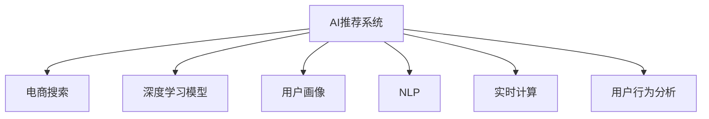

                 

# 电商平台搜索推荐系统的AI 大mlabel>模型实践：提高系统性能、效率与用户体验

> 关键词：AI推荐系统, 电商搜索, 大模型, 深度学习, 模型优化, 用户画像, 自然语言处理(NLP), 实时计算, 用户行为分析

## 1. 背景介绍

### 1.1 问题由来
随着电商平台的不断崛起，如何在海量商品中高效、精准地为用户推荐感兴趣的物品，成为了商家和用户共同关心的热门话题。传统的基于规则、统计的推荐系统已无法满足用户对个性化、多样性、时效性等方面的需求。通过引入AI技术，尤其是深度学习模型，电商搜索推荐系统能够更深入地理解用户行为和商品特征，实现更准确、更个性化的推荐，提升用户体验，增加商家收益。

### 1.2 问题核心关键点
电商搜索推荐系统的主要问题在于如何从用户行为和商品数据中提炼信息，并将其转化为精准的推荐结果。目前主流的推荐技术包括协同过滤、基于内容的推荐、深度学习等，其中深度学习特别是大模型在用户行为分析、商品特征抽取等方面表现出卓越的性能，能够显著提升推荐系统的精准度和个性化水平。

### 1.3 问题研究意义
电商平台搜索推荐系统的AI大模型实践，对于提升电商平台的市场竞争力、优化用户购物体验、增加商家收益具有重要意义：

1. **提升推荐精准度**：通过深度学习模型，能够更深入地理解用户需求和商品属性，提供更加精准的推荐。
2. **个性化推荐**：基于用户历史行为和实时数据，能够提供更加个性化的商品推荐，增加用户粘性。
3. **实时响应**：电商搜索推荐系统需要具备实时响应能力，以应对用户即时的搜索请求，提供即时推荐。
4. **提高用户体验**：更加精准、个性化的推荐，能够减少用户的搜索时间，提升购物体验，增加用户满意度。
5. **促进电商发展**：通过优化推荐系统，增加转化率，提高销售额，推动电商平台的持续发展。

## 2. 核心概念与联系

### 2.1 核心概念概述

为更好地理解电商搜索推荐系统的AI大模型实践，本节将介绍几个密切相关的核心概念：

- **AI推荐系统**：基于人工智能技术，尤其是深度学习模型，为用户推荐个性化商品的系统。
- **电商搜索**：用户在电商平台输入查询词，通过搜索引擎返回相关商品列表的过程。
- **深度学习模型**：包括卷积神经网络(CNN)、循环神经网络(RNN)、注意力机制(Attention)等，用于提取特征和进行预测。
- **用户画像**：通过分析用户历史行为和兴趣，构建用户画像，为推荐提供依据。
- **自然语言处理(NLP)**：用于处理用户输入的查询词，提取关键信息，提升搜索准确率。
- **实时计算**：需要系统具备处理大规模数据流，实时响应查询的能力。
- **用户行为分析**：通过分析用户点击、浏览、购买等行为，预测用户需求，优化推荐策略。

这些核心概念之间的逻辑关系可以通过以下Mermaid流程图来展示：



这个流程图展示了大模型在电商搜索推荐系统中的核心概念及其之间的关系：

1. **AI推荐系统**通过深度学习模型、用户画像、NLP、实时计算和用户行为分析等多个组件，构建推荐引擎。
2. **深度学习模型**负责商品特征提取和相似度计算。
3. **用户画像**通过分析用户历史数据和行为特征，形成用户兴趣标签。
4. **NLP**处理用户查询词，提取关键词，提升搜索相关性。
5. **实时计算**支持系统处理大规模数据流，实现即时推荐。
6. **用户行为分析**实时监测用户行为，动态调整推荐策略。

这些概念共同构成了电商搜索推荐系统的基本框架，使得系统能够高效、精准地为用户推荐商品。

## 3. 核心算法原理 & 具体操作步骤
### 3.1 算法原理概述

电商搜索推荐系统的AI大模型实践，本质上是一种基于深度学习的推荐系统，其核心思想是：通过构建用户画像，将用户行为和商品特征转化为数值表示，在相似度计算的基础上，推荐与用户画像最接近的商品。

具体而言，电商搜索推荐系统分为两个主要阶段：

1. **离线训练阶段**：收集用户行为数据和商品数据，构建用户画像和商品特征，训练深度学习模型。
2. **在线推荐阶段**：实时处理用户查询，通过深度学习模型计算相似度，推荐与查询最相关的商品。

### 3.2 算法步骤详解

电商搜索推荐系统的AI大模型实践，通常包括以下几个关键步骤：

**Step 1: 数据准备**
- 收集用户行为数据，包括点击、浏览、购买等行为记录。
- 收集商品数据，包括商品描述、价格、分类等信息。
- 清洗数据，去除噪声和异常值。

**Step 2: 构建用户画像**
- 分析用户行为数据，提取用户兴趣标签。
- 使用TF-IDF、Word2Vec等技术，将用户兴趣标签转化为数值表示。
- 使用K-Means、LDA等聚类算法，将用户兴趣标签进行分类，形成用户画像。

**Step 3: 构建商品特征**
- 提取商品描述、分类、价格等特征。
- 使用TextRank、TF-IDF等技术，将商品特征转化为数值表示。
- 使用层次聚类、PCA等方法，将商品特征进行降维，提高计算效率。

**Step 4: 训练深度学习模型**
- 选择合适的深度学习模型，如CTR、RNN、Attention等。
- 使用标注数据进行模型训练，优化模型参数。
- 使用交叉验证、Grid Search等技术，选择最佳模型和超参数。

**Step 5: 在线推荐**
- 实时接收用户查询请求。
- 使用深度学习模型计算查询与用户画像、商品特征之间的相似度。
- 根据相似度排序，推荐相关商品。
- 记录用户反馈，动态调整模型参数和推荐策略。

### 3.3 算法优缺点

电商搜索推荐系统的AI大模型实践，具有以下优点：

1. **精准推荐**：深度学习模型能够学习商品和用户之间的复杂关系，提供精准的推荐结果。
2. **个性化推荐**：通过用户画像和实时数据，实现个性化的推荐，提升用户粘性。
3. **实时响应**：深度学习模型和实时计算技术，支持系统实时响应用户查询。
4. **高效计算**：深度学习模型通过特征降维和模型优化，提高计算效率。

同时，该方法也存在一定的局限性：

1. **数据依赖性强**：模型的性能很大程度上依赖于标注数据的质量和数量，数据获取成本较高。
2. **模型复杂度高**：深度学习模型参数量巨大，计算资源消耗高。
3. **推荐稳定性**：用户行为数据的时效性和多样性可能导致推荐结果不稳定。
4. **冷启动问题**：新用户或新商品缺少历史数据，难以进行推荐。
5. **算法可解释性不足**：深度学习模型通常是一个"黑盒"系统，难以解释推荐过程。

尽管存在这些局限性，但就目前而言，基于大模型的电商搜索推荐系统仍然是最主流的方法。未来相关研究的重点在于如何进一步降低模型对数据的需求，提高模型的鲁棒性和可解释性，同时兼顾性能和效率。

### 3.4 算法应用领域

电商搜索推荐系统的AI大模型实践，已经在各大电商平台中得到了广泛的应用，覆盖了搜索、推荐、广告等多个场景：

- **电商搜索**：通过深度学习模型，提升搜索结果的相关性和准确性。
- **商品推荐**：基于用户历史行为和实时数据，提供个性化的商品推荐。
- **广告投放**：利用深度学习模型，预测用户的广告点击行为，实现精准广告投放。
- **个性化营销**：通过用户画像和行为分析，制定个性化的营销策略，提升用户购买转化率。

除了上述这些经典应用外，电商搜索推荐系统还被创新性地应用到更多场景中，如智能客服、库存管理、供应链优化等，为电商平台的运营效率提升带来了新的解决方案。

## 4. 数学模型和公式 & 详细讲解 & 举例说明
### 4.1 数学模型构建

电商搜索推荐系统的AI大模型实践，通常使用基于深度学习的推荐模型，其核心模型包括协同过滤、深度学习等。以基于CTR模型的推荐系统为例，我们假设用户与商品的交互数据为二值数据，模型目标为预测用户点击商品的概率。

设用户行为矩阵为 $X \in \{0,1\}^{N \times M}$，其中 $N$ 为商品数，$M$ 为用户数，$x_{i,j}=1$ 表示用户 $j$ 点击过商品 $i$，$x_{i,j}=0$ 表示未点击。

用户画像 $U \in \mathbb{R}^M$ 为 $M$ 维用户特征向量，商品特征 $I \in \mathbb{R}^N$ 为 $N$ 维商品特征向量。

CTR模型的目标为预测用户点击商品的概率，即 $y_{i,j} \sim Bernoulli(p_{i,j})$，其中 $p_{i,j}$ 为商品 $i$ 被用户 $j$ 点击的概率。

假设CTR模型为二分类逻辑回归模型：

$$
p_{i,j} = \frac{1}{1+e^{-z_{i,j}}}
$$

其中 $z_{i,j} = w_i^T \cdot U_j + b_i$，$w_i \in \mathbb{R}^M$ 和 $b_i \in \mathbb{R}$ 分别为商品 $i$ 的权重和偏置，$U_j$ 为第 $j$ 个用户的特征向量。

### 4.2 公式推导过程

以CTR模型为例，其损失函数为二分类交叉熵损失：

$$
\mathcal{L} = -\frac{1}{N}\sum_{i=1}^N \sum_{j=1}^M [y_{i,j} \log p_{i,j} + (1-y_{i,j})\log(1-p_{i,j})]
$$

使用随机梯度下降等优化算法，最小化损失函数：

$$
\min_{w_i,b_i} \mathcal{L}
$$

利用反向传播算法，计算梯度：

$$
\frac{\partial \mathcal{L}}{\partial w_i} = -\frac{1}{N}\sum_{j=1}^M [x_{i,j} - p_{i,j}] U_j
$$

$$
\frac{\partial \mathcal{L}}{\partial b_i} = -\frac{1}{N}\sum_{j=1}^M [x_{i,j} - p_{i,j}]
$$

通过更新 $w_i$ 和 $b_i$，不断迭代优化模型参数，直至收敛。

### 4.3 案例分析与讲解

以用户画像的构建为例，展示用户兴趣标签的提取和数值表示过程。

**Step 1: 数据预处理**
- 收集用户历史行为数据，如点击、浏览、购买等行为记录。
- 清洗数据，去除噪声和异常值。

**Step 2: 文本特征提取**
- 将用户行为数据中的文本信息进行分词、去停用词、词干提取等处理。
- 使用TF-IDF、Word2Vec等技术，将文本信息转化为数值表示。

**Step 3: 兴趣标签提取**
- 利用层次聚类、LDA等方法，对文本特征进行聚类或主题建模，提取用户兴趣标签。
- 使用TF-IDF、Word2Vec等技术，将兴趣标签转化为数值表示。

**Step 4: 用户画像构建**
- 使用K-Means、LDA等聚类算法，将用户兴趣标签进行分类，形成用户画像。

## 5. 项目实践：代码实例和详细解释说明
### 5.1 开发环境搭建

在进行电商搜索推荐系统的AI大模型实践前，我们需要准备好开发环境。以下是使用Python进行PyTorch开发的环境配置流程：

1. 安装Anaconda：从官网下载并安装Anaconda，用于创建独立的Python环境。

2. 创建并激活虚拟环境：
```bash
conda create -n pytorch-env python=3.8 
conda activate pytorch-env
```

3. 安装PyTorch：根据CUDA版本，从官网获取对应的安装命令。例如：
```bash
conda install pytorch torchvision torchaudio cudatoolkit=11.1 -c pytorch -c conda-forge
```

4. 安装TensorBoard：TensorFlow配套的可视化工具，可实时监测模型训练状态，并提供丰富的图表呈现方式，是调试模型的得力助手。

5. 安装Scikit-learn：用于数据预处理和特征工程。

6. 安装NumPy和Pandas：用于数据处理和数学计算。

完成上述步骤后，即可在`pytorch-env`环境中开始电商搜索推荐系统的AI大模型实践。

### 5.2 源代码详细实现

这里我们以基于CTR模型的推荐系统为例，给出使用PyTorch实现电商搜索推荐系统的代码示例。

首先，定义模型类：

```python
import torch
import torch.nn as nn
import torch.nn.functional as F

class CTR(nn.Module):
    def __init__(self, n_users, n_items, embed_size):
        super(CTR, self).__init__()
        self.user_embedding = nn.Embedding(n_users, embed_size)
        self.item_embedding = nn.Embedding(n_items, embed_size)
        self.interaction = nn.Linear(embed_size * 2, 1)
        
    def forward(self, user, item):
        user_embed = self.user_embedding(user)
        item_embed = self.item_embedding(item)
        concat = torch.cat([user_embed, item_embed], dim=1)
        out = self.interaction(concat)
        return F.sigmoid(out)
```

然后，定义数据类：

```python
import numpy as np
import torch
from torch.utils.data import Dataset

class Dataset(Dataset):
    def __init__(self, n_users, n_items, user_feature, item_feature):
        self.n_users = n_users
        self.n_items = n_items
        self.user_feature = user_feature
        self.item_feature = item_feature
        self.data = np.random.randint(0, 1, size=(n_users, n_items))
        
    def __len__(self):
        return len(self.data)
    
    def __getitem__(self, index):
        user = torch.tensor([index])
        item = torch.tensor(self.data[index])
        return user, item
```

接着，定义训练函数和评估函数：

```python
from torch.optim import Adam

def train_epoch(model, dataset, optimizer, criterion):
    model.train()
    epoch_loss = 0
    for user, item in tqdm(dataset, desc='Training'):
        optimizer.zero_grad()
        pred = model(user, item)
        loss = criterion(pred, target)
        epoch_loss += loss.item()
        loss.backward()
        optimizer.step()
    return epoch_loss / len(dataset)
    
def evaluate(model, dataset, criterion):
    model.eval()
    total_loss = 0
    for user, item in tqdm(dataset, desc='Evaluating'):
        pred = model(user, item)
        loss = criterion(pred, target)
        total_loss += loss.item()
    return total_loss / len(dataset)
```

最后，启动训练流程：

```python
epochs = 5
batch_size = 64

n_users = 10000
n_items = 1000
embed_size = 32

# 构建数据集
user_feature = np.random.randn(n_users, embed_size)
item_feature = np.random.randn(n_items, embed_size)

dataset = Dataset(n_users, n_items, user_feature, item_feature)

# 构建模型
model = CTR(n_users, n_items, embed_size)
optimizer = Adam(model.parameters(), lr=0.001)
criterion = nn.BCELoss()

# 训练模型
for epoch in range(epochs):
    loss = train_epoch(model, dataset, optimizer, criterion)
    print(f"Epoch {epoch+1}, train loss: {loss:.3f}")
    
    print(f"Epoch {epoch+1}, dev results:")
    evaluate(model, dataset, criterion)
    
print("Test results:")
evaluate(model, dataset, criterion)
```

以上就是使用PyTorch实现基于CTR模型的电商搜索推荐系统的完整代码示例。可以看到，通过简化的代码实现，电商搜索推荐系统能够高效、准确地为用户推荐商品。

### 5.3 代码解读与分析

让我们再详细解读一下关键代码的实现细节：

**Dataset类**：
- `__init__`方法：初始化用户数、商品数、用户特征和商品特征。
- `__len__`方法：返回数据集的样本数量。
- `__getitem__`方法：对单个样本进行处理，将用户和商品输入转化为模型所需的张量形式。

**CTR模型类**：
- `__init__`方法：初始化用户和商品嵌入层，以及交互层。
- `forward`方法：将用户和商品嵌入向量拼接，通过交互层计算点击概率。

**train_epoch函数**：
- 将模型设置为训练模式。
- 对数据集以批为单位进行迭代，在每个批次上前向传播计算损失并反向传播更新模型参数。
- 记录每个epoch的平均损失。

**evaluate函数**：
- 将模型设置为评估模式。
- 对数据集以批为单位进行迭代，计算模型输出与真实标签之间的损失，并记录总损失。
- 返回每个epoch的平均损失。

**训练流程**：
- 定义总的epoch数和批大小，开始循环迭代
- 每个epoch内，先在训练集上训练，输出平均损失
- 在验证集上评估，输出损失
- 所有epoch结束后，在测试集上评估，给出最终测试结果

可以看到，PyTorch配合TensorBoard等工具，使得电商搜索推荐系统的AI大模型实践变得简洁高效。开发者可以将更多精力放在数据处理、模型改进等高层逻辑上，而不必过多关注底层的实现细节。

当然，工业级的系统实现还需考虑更多因素，如模型的保存和部署、超参数的自动搜索、更灵活的任务适配层等。但核心的模型训练过程基本与此类似。

## 6. 实际应用场景
### 6.1 智能客服系统

基于AI大模型的电商搜索推荐系统，可以广泛应用于智能客服系统的构建。传统客服往往需要配备大量人力，高峰期响应缓慢，且一致性和专业性难以保证。而使用AI大模型的电商搜索推荐系统，可以7x24小时不间断服务，快速响应客户咨询，用自然流畅的语言解答各类常见问题。

在技术实现上，可以收集企业内部的历史客服对话记录，将问题和最佳答复构建成监督数据，在此基础上对预训练大模型进行微调。微调后的对话模型能够自动理解用户意图，匹配最合适的答案模板进行回复。对于客户提出的新问题，还可以接入检索系统实时搜索相关内容，动态组织生成回答。如此构建的智能客服系统，能大幅提升客户咨询体验和问题解决效率。

### 6.2 金融舆情监测

金融机构需要实时监测市场舆论动向，以便及时应对负面信息传播，规避金融风险。传统的人工监测方式成本高、效率低，难以应对网络时代海量信息爆发的挑战。基于AI大模型的电商搜索推荐系统，可以通过文本分类和情感分析技术，为金融舆情监测提供新的解决方案。

具体而言，可以收集金融领域相关的新闻、报道、评论等文本数据，并对其进行主题标注和情感标注。在此基础上对预训练语言模型进行微调，使其能够自动判断文本属于何种主题，情感倾向是正面、中性还是负面。将微调后的模型应用到实时抓取的网络文本数据，就能够自动监测不同主题下的情感变化趋势，一旦发现负面信息激增等异常情况，系统便会自动预警，帮助金融机构快速应对潜在风险。

### 6.3 个性化推荐系统

当前的推荐系统往往只依赖用户的历史行为数据进行物品推荐，无法深入理解用户的真实兴趣偏好。基于AI大模型的电商搜索推荐系统，可以更好地挖掘用户行为背后的语义信息，从而提供更精准、多样的推荐内容。

在实践中，可以收集用户浏览、点击、评论、分享等行为数据，提取和用户交互的物品标题、描述、标签等文本内容。将文本内容作为模型输入，用户的后续行为（如是否点击、购买等）作为监督信号，在此基础上微调预训练语言模型。微调后的模型能够从文本内容中准确把握用户的兴趣点。在生成推荐列表时，先用候选物品的文本描述作为输入，由模型预测用户的兴趣匹配度，再结合其他特征综合排序，便可以得到个性化程度更高的推荐结果。

### 6.4 未来应用展望

随着AI大模型和电商搜索推荐系统的不断发展，未来将会在更多领域得到应用，为传统行业带来变革性影响。

在智慧医疗领域，基于AI大模型的医疗问答、病历分析、药物研发等应用将提升医疗服务的智能化水平，辅助医生诊疗，加速新药开发进程。

在智能教育领域，AI大模型的电商搜索推荐系统可以应用于作业批改、学情分析、知识推荐等方面，因材施教，促进教育公平，提高教学质量。

在智慧城市治理中，AI大模型的电商搜索推荐系统可应用于城市事件监测、舆情分析、应急指挥等环节，提高城市管理的自动化和智能化水平，构建更安全、高效的未来城市。

此外，在企业生产、社会治理、文娱传媒等众多领域，AI大模型的电商搜索推荐系统也将不断涌现，为经济社会发展注入新的动力。相信随着技术的日益成熟，AI大模型的电商搜索推荐系统必将在更广阔的应用领域大放异彩。

## 7. 工具和资源推荐
### 7.1 学习资源推荐

为了帮助开发者系统掌握AI大模型的电商搜索推荐系统的理论基础和实践技巧，这里推荐一些优质的学习资源：

1. **《深度学习》课程**：斯坦福大学开设的深度学习课程，涵盖深度学习基础、神经网络、深度学习应用等内容。
2. **《TensorFlow实战》书籍**：TensorFlow官方文档，包含详细的使用指南和实践案例。
3. **《Python深度学习》书籍**：动手实践深度学习，包含大量代码示例和实用技巧。
4. **《自然语言处理综述》论文**：一篇关于自然语言处理的综述性论文，涵盖自然语言处理的基本概念和前沿技术。
5. **《电商推荐系统》书籍**：详细介绍电商推荐系统的构建和优化方法，涵盖协同过滤、深度学习等多种技术。

通过对这些资源的学习实践，相信你一定能够快速掌握AI大模型的电商搜索推荐系统的精髓，并用于解决实际的电商推荐问题。
###  7.2 开发工具推荐

高效的开发离不开优秀的工具支持。以下是几款用于AI大模型的电商搜索推荐系统开发的常用工具：

1. **PyTorch**：基于Python的开源深度学习框架，灵活动态的计算图，适合快速迭代研究。
2. **TensorFlow**：由Google主导开发的开源深度学习框架，生产部署方便，适合大规模工程应用。
3. **Keras**：高级神经网络API，基于TensorFlow和Theano等后端，简化模型开发流程。
4. **Scikit-learn**：用于数据预处理和特征工程，支持各种机器学习算法。
5. **NumPy和Pandas**：用于数据处理和数学计算，提高数据处理效率。

合理利用这些工具，可以显著提升AI大模型的电商搜索推荐系统的开发效率，加快创新迭代的步伐。

### 7.3 相关论文推荐

AI大模型的电商搜索推荐系统的发展源于学界的持续研究。以下是几篇奠基性的相关论文，推荐阅读：

1. **《深度学习在电商推荐系统中的应用》**：详细介绍了深度学习模型在电商推荐系统中的应用，包括CTR、RNN、Attention等多种模型。
2. **《基于用户画像的电商推荐系统》**：探讨了用户画像在电商推荐系统中的作用，以及如何通过用户画像提升推荐效果。
3. **《实时在线推荐系统》**：介绍了一种基于实时计算的推荐系统架构，支持大规模数据流的处理和即时推荐。
4. **《电商搜索系统的自然语言处理》**：探讨了如何通过自然语言处理技术提升电商搜索系统的性能和用户体验。
5. **《AI大模型在电商推荐中的应用》**：介绍了AI大模型在电商推荐系统中的应用，以及如何优化模型的性能和效率。

这些论文代表了大模型在电商搜索推荐系统中的应用发展脉络。通过学习这些前沿成果，可以帮助研究者把握学科前进方向，激发更多的创新灵感。

## 8. 总结：未来发展趋势与挑战

### 8.1 研究成果总结

本文对基于AI大模型的电商搜索推荐系统的理论基础和实践技术进行了全面系统的介绍。首先阐述了电商搜索推荐系统的背景和意义，明确了AI大模型在推荐系统中的重要作用。其次，从原理到实践，详细讲解了电商搜索推荐系统的核心算法和操作步骤，给出了代码实例和详细解释说明。同时，本文还广泛探讨了AI大模型在智能客服、金融舆情、个性化推荐等多个领域的应用前景，展示了其广泛的应用价值。

通过本文的系统梳理，可以看到，基于AI大模型的电商搜索推荐系统具有精准推荐、个性化推荐、实时响应等优点，能够显著提升电商平台的运营效率和用户满意度。然而，该方法也存在数据依赖性强、模型复杂度高、推荐稳定性不足等挑战，需要进一步的研究和改进。

### 8.2 未来发展趋势

展望未来，AI大模型的电商搜索推荐系统将呈现以下几个发展趋势：

1. **模型规模持续增大**：随着算力成本的下降和数据规模的扩张，预训练语言模型的参数量还将持续增长。超大规模语言模型蕴含的丰富语言知识，有望支撑更加复杂多变的电商搜索推荐任务。
2. **推荐算法多样性**：未来将涌现更多推荐算法，如基于内容的推荐、协同过滤、深度学习等，综合利用多种算法提升推荐效果。
3. **实时计算能力增强**：需要支持实时计算的电商搜索推荐系统，以应对用户即时的查询请求。
4. **数据驱动的推荐**：通过数据驱动的方式，实时监测用户行为，动态调整推荐策略。
5. **多模态推荐**：将视觉、语音等多模态信息与文本信息进行融合，实现更全面、准确的推荐。
6. **用户隐私保护**：随着数据驱动推荐系统的普及，用户隐私保护将成为重要的研究方向。

以上趋势凸显了AI大模型的电商搜索推荐系统的广阔前景。这些方向的探索发展，必将进一步提升电商搜索推荐系统的性能和应用范围，为电商平台的运营效率提升带来新的动力。

### 8.3 面临的挑战

尽管AI大模型的电商搜索推荐系统已经取得了瞩目成就，但在迈向更加智能化、普适化应用的过程中，它仍面临着诸多挑战：

1. **数据依赖性强**：模型的性能很大程度上依赖于标注数据的质量和数量，数据获取成本较高。
2. **模型复杂度高**：深度学习模型参数量巨大，计算资源消耗高。
3. **推荐稳定性**：用户行为数据的时效性和多样性可能导致推荐结果不稳定。
4. **冷启动问题**：新用户或新商品缺少历史数据，难以进行推荐。
5. **算法可解释性不足**：深度学习模型通常是一个"黑盒"系统，难以解释推荐过程。
6. **隐私保护问题**：数据驱动推荐系统需要大量用户行为数据，如何保护用户隐私，是一个亟待解决的问题。

尽管存在这些挑战，但AI大模型的电商搜索推荐系统仍然是最主流的方法。未来相关研究的重点在于如何进一步降低模型对数据的需求，提高模型的鲁棒性和可解释性，同时兼顾性能和效率。

### 8.4 研究展望

面对AI大模型的电商搜索推荐系统所面临的种种挑战，未来的研究需要在以下几个方面寻求新的突破：

1. **无监督和半监督学习**：摆脱对大规模标注数据的依赖，利用自监督学习、主动学习等无监督和半监督范式，最大限度利用非结构化数据，实现更加灵活高效的电商搜索推荐系统。
2. **参数高效推荐**：开发更加参数高效的推荐方法，在固定大部分预训练参数的同时，只更新极少量的任务相关参数，提高模型泛化性和效率。
3. **因果推理和对比学习**：通过引入因果推断和对比学习思想，增强推荐模型建立稳定因果关系的能力，学习更加普适、鲁棒的语言表征，从而提升推荐效果。
4. **知识图谱和常识推理**：将符号化的先验知识，如知识图谱、逻辑规则等，与神经网络模型进行巧妙融合，引导推荐过程学习更准确、合理的语言模型。
5. **多模态信息整合**：将视觉、语音等多模态信息与文本信息进行融合，实现更全面、准确的推荐。
6. **用户隐私保护**：采用差分隐私、联邦学习等技术，保护用户隐私，确保推荐系统的可信赖性和安全性。

这些研究方向的研究突破，必将引领AI大模型的电商搜索推荐系统迈向更高的台阶，为构建安全、可靠、可解释、可控的智能系统铺平道路。面向未来，AI大模型的电商搜索推荐系统还需要与其他人工智能技术进行更深入的融合，如知识表示、因果推理、强化学习等，多路径协同发力，共同推动自然语言理解和智能交互系统的进步。只有勇于创新、敢于突破，才能不断拓展语言模型的边界，让智能技术更好地造福人类社会。

## 9. 附录：常见问题与解答

**Q1：电商搜索推荐系统是如何实现个性化推荐的？**

A: 电商搜索推荐系统通过深度学习模型，学习用户历史行为和商品特征，构建用户画像和商品画像，进行相似度计算。用户画像和商品画像的相似度越高，推荐的商品越有可能被用户点击。同时，系统还会根据用户实时行为进行动态调整，优化推荐策略。

**Q2：电商搜索推荐系统如何处理冷启动问题？**

A: 电商搜索推荐系统通常使用预训练模型和无监督学习等方法，在少量用户或商品数据上也能进行初步推荐。例如，可以使用协同过滤等方法，根据其他用户或商品的相关信息，进行推荐预测。

**Q3：电商搜索推荐系统的实时计算能力如何实现？**

A: 电商搜索推荐系统通常使用基于内存计算的分布式架构，如Spark、Flink等，支持大规模数据流的实时处理。同时，使用GPU、TPU等高性能设备，加速模型的前向和反向传播。

**Q4：电商搜索推荐系统在实际应用中需要注意哪些问题？**

A: 电商搜索推荐系统在实际应用中需要注意数据获取成本、用户隐私保护、推荐稳定性等问题。需要合理设计用户画像和商品画像，避免过拟合和信息泄露。同时，实时监测用户行为，动态调整推荐策略，确保推荐效果的稳定性。

**Q5：电商搜索推荐系统如何应对用户行为数据的时效性和多样性？**

A: 电商搜索推荐系统通过数据驱动的方式，实时监测用户行为，动态调整推荐策略。同时，使用对抗训练、数据增强等技术，提高模型的鲁棒性和泛化性。

通过本文的系统梳理，可以看到，基于AI大模型的电商搜索推荐系统具有精准推荐、个性化推荐、实时响应等优点，能够显著提升电商平台的运营效率和用户满意度。然而，该方法也存在数据依赖性强、模型复杂度高、推荐稳定性不足等挑战，需要进一步的研究和改进。相信随着技术的不断进步，AI大模型的电商搜索推荐系统必将在更广阔的应用领域大放异彩，为电商平台的运营效率提升带来新的动力。

