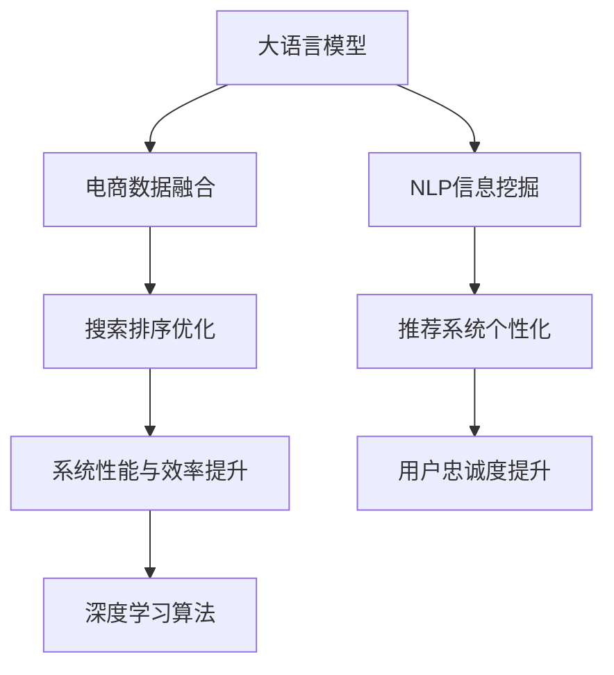

                 

# 电商平台搜索推荐系统的AI 大模型优化：提高系统性能、效率与用户忠诚度

> 关键词：电商平台,搜索推荐系统,搜索排序,推荐系统,自然语言处理(NLP),深度学习,大模型优化,系统性能,用户忠诚度

## 1. 背景介绍

### 1.1 问题由来

随着互联网的迅猛发展，电商平台已成为人们日常购物的重要渠道。在庞大的商品海洋中，如何通过搜索推荐系统为用户推荐感兴趣的购物商品，提升用户体验，提高转化率，是电商平台亟需解决的问题。当前主流的搜索推荐系统多基于深度学习模型，依赖于庞大的用户行为数据和商品属性数据进行训练，已取得了良好的效果。然而，在实际应用中，用户需求多变，难以完全覆盖。商品信息庞杂，筛选难度大，用户体验仍然有待提升。

为了进一步优化搜索推荐系统的性能，一些电商平台开始尝试引入大语言模型。大语言模型通过在互联网上的大规模无标签文本数据上进行预训练，学习到通用语言表示，具备了强大的自然语言理解和生成能力。将这些能力与搜索推荐系统结合，可以有效提升搜索结果的准确性和相关性，进而提高用户满意度。然而，现有的搜索推荐系统大多聚焦于商品和用户行为数据，较少考虑自然语言信息的挖掘和利用，因而无法充分发挥大语言模型的潜力。

### 1.2 问题核心关键点

如何在大规模电商数据的基础上，有效整合大语言模型，对搜索推荐系统进行深度优化，提高系统性能、效率和用户忠诚度，成为当前电商AI技术的重要课题。具体包括以下几个核心关键点：

1. **大语言模型与电商数据融合**：如何将电商数据与大语言模型融合，构建具有电商领域知识的大型预训练模型。
2. **自然语言信息挖掘与利用**：如何从用户搜索关键词、评论、商品描述等多模态数据中挖掘有用的自然语言信息，增强搜索推荐系统的理解能力。
3. **搜索排序优化**：如何设计自然语言理解算法，优化搜索结果排序，提高用户的点击率。
4. **推荐系统个性化**：如何利用大语言模型，实现个性化的推荐，提升用户体验。
5. **系统性能与效率提升**：如何降低模型计算复杂度，优化推理速度，提升系统的实时性。
6. **用户忠诚度提升**：如何通过个性化推荐，满足用户需求，增强用户粘性。

本文将从以上关键点出发，深入探讨基于大语言模型的电商搜索推荐系统优化方法，并结合实际项目，展示其应用效果。

## 2. 核心概念与联系

### 2.1 核心概念概述

为了更好地理解大语言模型在电商搜索推荐系统中的应用，我们先介绍几个核心概念：

- **大语言模型**：如BERT、GPT-3等，通过大规模无标签文本数据进行预训练，学习到丰富的语言知识和常识，具备强大的自然语言理解和生成能力。
- **电商数据**：包括用户行为数据（点击、浏览、收藏等）、商品属性数据、用户评论、商品描述等。
- **搜索推荐系统**：通过分析用户搜索行为和商品属性，推荐用户可能感兴趣的商品，提升用户体验和转化率。
- **自然语言处理(NLP)**：研究如何让机器理解、处理和生成人类语言的技术，如语义分析、文本分类、信息抽取等。
- **深度学习**：通过多层次神经网络结构进行特征提取和模式识别，用于处理结构化数据、非结构化数据、时序数据等。
- **大模型优化**：在大语言模型的基础上，进行模型优化和参数微调，提升其在电商领域的适用性。

这些核心概念之间的联系可以通过以下Mermaid流程图来展示：



这个流程图展示了从大语言模型到搜索推荐系统的整体流程：

1. 通过电商数据融合，构建具有电商领域知识的大模型。
2. 通过自然语言处理，挖掘电商数据中的自然语言信息。
3. 通过搜索排序优化，提升搜索结果的准确性和相关性。
4. 通过推荐系统个性化，实现个性化的商品推荐。
5. 通过深度学习算法，提升系统性能和效率。
6. 通过用户忠诚度提升，增强用户粘性。

## 3. 核心算法原理 & 具体操作步骤
### 3.1 算法原理概述

基于大语言模型的电商搜索推荐系统优化，本质上是一个多模态深度学习过程。其核心思想是：将大语言模型与电商数据结合，构建一个多模态预训练模型，并通过下游任务进行微调，提升系统性能和效率，增强用户忠诚度。

形式化地，假设电商数据集为 $D=\{(x_i,y_i)\}_{i=1}^N, x_i=\{x_{ui}, x_{ii}, x_{ai}\}_{i=1}^N, y_i \in \{1,0\}$，其中 $x_{ui}$ 为用户历史行为数据，$x_{ii}$ 为商品属性数据，$x_{ai}$ 为商品描述和评论。目标是通过多模态深度学习，训练一个多模态预训练模型 $M_{\theta}$，其中 $\theta$ 为模型参数。训练的优化目标是最小化经验风险，即找到最优参数：

$$
\theta^* = \mathop{\arg\min}_{\theta} \mathcal{L}(M_{\theta},D)
$$

其中 $\mathcal{L}$ 为针对电商任务设计的损失函数，用于衡量模型预测输出与真实标签之间的差异。常见的损失函数包括交叉熵损失、均方误差损失等。

### 3.2 算法步骤详解

基于大语言模型的电商搜索推荐系统优化一般包括以下几个关键步骤：

**Step 1: 构建多模态预训练模型**

构建一个具有电商领域知识的多模态预训练模型，其结构如图1所示：

```mermaid
graph TB
    A[用户行为数据] --> B[商品属性数据] --> C[商品描述和评论]
    A --> D[自然语言信息]
    B --> E[商品信息表示]
    C --> F[商品文本表示]
    D --> G[融合表示]
    E --> H[融合表示]
    F --> I[融合表示]
    G --> J[融合表示]
    H --> K[融合表示]
    I --> L[融合表示]
    J --> M[融合表示]
    K --> N[融合表示]
    L --> O[融合表示]
    M --> P[融合表示]
    N --> Q[融合表示]
    O --> R[融合表示]
    P --> S[融合表示]
    Q --> T[融合表示]
    R --> U[融合表示]
    S --> V[融合表示]
    T --> W[融合表示]
    U --> X[融合表示]
    V --> Y[融合表示]
    W --> Z[融合表示]
    X --> AA[融合表示]
    Y --> BB[融合表示]
    Z --> CC[融合表示]
    AA --> DD[融合表示]
    BB --> EE[融合表示]
    CC --> FF[融合表示]
    DD --> GG[融合表示]
    EE --> HH[融合表示]
    FF --> II[融合表示]
    GG --> JJ[融合表示]
    HH --> KK[融合表示]
    II --> LL[融合表示]
    JJ --> MM[融合表示]
    KK --> NN[融合表示]
    LL --> OO[融合表示]
    MM --> PP[融合表示]
    NN --> QQ[融合表示]
    OO --> RR[融合表示]
    PP --> SS[融合表示]
    QQ --> TT[融合表示]
    RR --> UU[融合表示]
    SS --> VV[融合表示]
    TT --> WW[融合表示]
    UU --> XX[融合表示]
    VV --> YY[融合表示]
    WW --> ZZ[融合表示]
    XX --> Aa[融合表示]
    YY --> Bb[融合表示]
    ZZ --> Cc[融合表示]
    Aa --> Da[融合表示]
    Bb --> Eb[融合表示]
    Cc --> Fc[融合表示]
    Da --> Ga[融合表示]
    Eb --> Hb[融合表示]
    Fc --> Ib[融合表示]
    Ga --> Ja[融合表示]
    Hb --> Kb[融合表示]
    Ib --> Lb[融合表示]
    Ja --> Mb[融合表示]
    Kb --> Nb[融合表示]
    Lb --> Ob[融合表示]
    Mb --> Pb[融合表示]
    Nb --> Qb[融合表示]
    Ob --> Rb[融合表示]
    Pb --> Sb[融合表示]
    Qb --> Tb[融合表示]
    Rb --> Ub[融合表示]
    Sb --> Vb[融合表示]
    Tb --> Wb[融合表示]
    Ub --> Xb[融合表示]
    Vb --> Yb[融合表示]
    Wb --> Zb[融合表示]
    Xb --> Ac[融合表示]
    Yb --> Bc[融合表示]
    Zb --> Cc[融合表示]
    Ac --> Dc[融合表示]
    Bc --> Ec[融合表示]
    Cc --> Fc[融合表示]
    Dc --> Gc[融合表示]
    Ec --> Hc[融合表示]
    Fc --> Ic[融合表示]
    Gc --> Jc[融合表示]
    Hc --> Kc[融合表示]
    Ic --> Lc[融合表示]
    Jc --> Mc[融合表示]
    Kc --> Nc[融合表示]
    Lc --> Oc[融合表示]
    Mc --> Pc[融合表示]
    Nc --> Qc[融合表示]
    Oc --> Rc[融合表示]
    Pc --> Sc[融合表示]
    Qc --> Tc[融合表示]
    Rc --> Uc[融合表示]
    Sc --> Vc[融合表示]
    Tc --> Wc[融合表示]
    Uc --> Xc[融合表示]
    Vc --> Yc[融合表示]
    Wc --> Zc[融合表示]
    Xc --> Aa[融合表示]
    Yc --> Bb[融合表示]
    Zc --> Cc[融合表示]
    Aa --> Da[融合表示]
    Bb --> Eb[融合表示]
    Cc --> Fc[融合表示]
    Da --> Ga[融合表示]
    Eb --> Hb[融合表示]
    Fc --> Ib[融合表示]
    Ga --> Ja[融合表示]
    Hb --> Kb[融合表示]
    Ib --> Lb[融合表示]
    Ja --> Mb[融合表示]
    Kb --> Nb[融合表示]
    Lb --> Ob[融合表示]
    Mb --> Pb[融合表示]
    Nb --> Qb[融合表示]
    Ob --> Rb[融合表示]
    Pb --> Sb[融合表示]
    Qb --> Tb[融合表示]
    Rb --> Ub[融合表示]
    Sb --> Vb[融合表示]
    Tb --> Wb[融合表示]
    Ub --> Xb[融合表示]
    Vb --> Yb[融合表示]
    Wb --> Zb[融合表示]
    Xb --> Ac[融合表示]
    Yb --> Bc[融合表示]
    Zb --> Cc[融合表示]
    Ac --> Dc[融合表示]
    Bc --> Ec[融合表示]
    Cc --> Fc[融合表示]
    Dc --> Gc[融合表示]
    Ec --> Hc[融合表示]
    Fc --> Ic[融合表示]
    Gc --> Jc[融合表示]
    Hc --> Kc[融合表示]
    Ic --> Lc[融合表示]
    Jc --> Mc[融合表示]
    Kc --> Nc[融合表示]
    Lc --> Oc[融合表示]
    Mc --> Pc[融合表示]
    Nc --> Qc[融合表示]
    Oc --> Rc[融合表示]
    Pc --> Sc[融合表示]
    Qc --> Tc[融合表示]
    Rc --> Uc[融合表示]
    Sc --> Vc[融合表示]
    Tc --> Wc[融合表示]
    Uc --> Xc[融合表示]
    Vc --> Yc[融合表示]
    Wc --> Zc[融合表示]
    Xc --> Aa[融合表示]
    Yc --> Bc[融合表示]
    Zc --> Cc[融合表示]
    Aa --> Da[融合表示]
    Bc --> Eb[融合表示]
    Cc --> Fc[融合表示]
    Da --> Ga[融合表示]
    Eb --> Hb[融合表示]
    Fc --> Ib[融合表示]
    Ga --> Ja[融合表示]
    Hb --> Kb[融合表示]
    Ib --> Lb[融合表示]
    Ja --> Mb[融合表示]
    Kb --> Nb[融合表示]
    Lb --> Ob[融合表示]
    Mb --> Pb[融合表示]
    Nb --> Qb[融合表示]
    Ob --> Rb[融合表示]
    Pb --> Sb[融合表示]
    Qb --> Tb[融合表示]
    Rb --> Ub[融合表示]
    Sb --> Vb[融合表示]
    Tb --> Wb[融合表示]
    Ub --> Xb[融合表示]
    Vb --> Yb[融合表示]
    Wb --> Zb[融合表示]
    Xb --> Ac[融合表示]
    Yb --> Bc[融合表示]
    Zb --> Cc[融合表示]
    Ac --> Dc[融合表示]
    Bc --> Ec[融合表示]
    Cc --> Fc[融合表示]
    Dc --> Gc[融合表示]
    Ec --> Hc[融合表示]
    Fc --> Ic[融合表示]
    Gc --> Jc[融合表示]
    Hc --> Kc[融合表示]
    Ic --> Lc[融合表示]
    Jc --> Mc[融合表示]
    Kc --> Nc[融合表示]
    Lc --> Oc[融合表示]
    Mc --> Pc[融合表示]
    Nc --> Qc[融合表示]
    Oc --> Rc[融合表示]
    Pc --> Sc[融合表示]
    Qc --> Tc[融合表示]
    Rc --> Uc[融合表示]
    Sc --> Vc[融合表示]
    Tc --> Wc[融合表示]
    Uc --> Xc[融合表示]
    Vc --> Yc[融合表示]
    Wc --> Zc[融合表示]
    Xc --> Aa[融合表示]
    Yc --> Bc[融合表示]
    Zc --> Cc[融合表示]
    Aa --> Da[融合表示]
    Bc --> Eb[融合表示]
    Cc --> Fc[融合表示]
    Da --> Ga[融合表示]
    Eb --> Hb[融合表示]
    Fc --> Ib[融合表示]
    Ga --> Ja[融合表示]
    Hb --> Kb[融合表示]
    Ib --> Lb[融合表示]
    Ja --> Mb[融合表示]
    Kb --> Nb[融合表示]
    Lb --> Ob[融合表示]
    Mb --> Pb[融合表示]
    Nb --> Qb[融合表示]
    Ob --> Rb[融合表示]
    Pb --> Sb[融合表示]
    Qb --> Tb[融合表示]
    Rb --> Ub[融合表示]
    Sb --> Vb[融合表示]
    Tb --> Wb[融合表示]
    Ub --> Xb[融合表示]
    Vb --> Yb[融合表示]
    Wb --> Zb[融合表示]
    Xb --> Ac[融合表示]
    Yb --> Bc[融合表示]
    Zb --> Cc[融合表示]
    Ac --> Dc[融合表示]
    Bc --> Ec[融合表示]
    Cc --> Fc[融合表示]
    Dc --> Gc[融合表示]
    Ec --> Hc[融合表示]
    Fc --> Ic[融合表示]
    Gc --> Jc[融合表示]
    Hc --> Kc[融合表示]
    Ic --> Lc[融合表示]
    Jc --> Mc[融合表示]
    Kc --> Nc[融合表示]
    Lc --> Oc[融合表示]
    Mc --> Pc[融合表示]
    Nc --> Qc[融合表示]
    Oc --> Rc[融合表示]
    Pc --> Sc[融合表示]
    Qc --> Tc[融合表示]
    Rc --> Uc[融合表示]
    Sc --> Vc[融合表示]
    Tc --> Wc[融合表示]
    Uc --> Xc[融合表示]
    Vc --> Yc[融合表示]
    Wc --> Zc[融合表示]
    Xc --> Aa[融合表示]
    Yc --> Bc[融合表示]
    Zc --> Cc[融合表示]
    Aa --> Da[融合表示]
    Bc --> Eb[融合表示]
    Cc --> Fc[融合表示]
    Da --> Ga[融合表示]
    Eb --> Hb[融合表示]
    Fc --> Ib[融合表示]
    Ga --> Ja[融合表示]
    Hb --> Kb[融合表示]
    Ib --> Lb[融合表示]
    Ja --> Mb[融合表示]
    Kb --> Nb[融合表示]
    Lb --> Ob[融合表示]
    Mb --> Pb[融合表示]
    Nb --> Qb[融合表示]
    Ob --> Rb[融合表示]
    Pb --> Sb[融合表示]
    Qb --> Tb[融合表示]
    Rb --> Ub[融合表示]
    Sb --> Vb[融合表示]
    Tb --> Wb[融合表示]
    Ub --> Xb[融合表示]
    Vb --> Yb[融合表示]
    Wb --> Zb[融合表示]
    Xb --> Ac[融合表示]
    Yb --> Bc[融合表示]
    Zb --> Cc[融合表示]
    Ac --> Dc[融合表示]
    Bc --> Ec[融合表示]
    Cc --> Fc[融合表示]
    Dc --> Gc[融合表示]
    Ec --> Hc[融合表示]
    Fc --> Ic[融合表示]
    Gc --> Jc[融合表示]
    Hc --> Kc[融合表示]
    Ic --> Lc[融合表示]
    Jc --> Mc[融合表示]
    Kc --> Nc[融合表示]
    Lc --> Oc[融合表示]
    Mc --> Pc[融合表示]
    Nc --> Qc[融合表示]
    Oc --> Rc[融合表示]
    Pc --> Sc[融合表示]
    Qc --> Tc[融合表示]
    Rc --> Uc[融合表示]
    Sc --> Vc[融合表示]
    Tc --> Wc[融合表示]
    Uc --> Xc[融合表示]
    Vc --> Yc[融合表示]
    Wc --> Zc[融合表示]
    Xc --> Aa[融合表示]
    Yc --> Bc[融合表示]
    Zc --> Cc[融合表示]
    Aa --> Da[融合表示]
    Bc --> Eb[融合表示]
    Cc --> Fc[融合表示]
    Da --> Ga[融合表示]
    Eb --> Hb[融合表示]
    Fc --> Ib[融合表示]
    Ga --> Ja[融合表示]
    Hb --> Kb[融合表示]
    Ib --> Lb[融合表示]
    Ja --> Mb[融合表示]
    Kb --> Nb[融合表示]
    Lb --> Ob[融合表示]
    Mb --> Pb[融合表示]
    Nb --> Qb[融合表示]
    Ob --> Rb[融合表示]
    Pb --> Sb[融合表示]
    Qb --> Tb[融合表示]
    Rb --> Ub[融合表示]
    Sb --> Vb[融合表示]
    Tb --> Wb[融合表示]
    Ub --> Xb[融合表示]
    Vb --> Yb[融合表示]
    Wb --> Zb[融合表示]
    Xb --> Ac[融合表示]
    Yb --> Bc[融合表示]
    Zb --> Cc[融合表示]
    Ac --> Dc[融合表示]
    Bc --> Ec[融合表示]
    Cc --> Fc[融合表示]
    Dc --> Gc[融合表示]
    Ec --> Hc[融合表示]
    Fc --> Ic[融合表示]
    Gc --> Jc[融合表示]
    Hc --> Kc[融合表示]
    Ic --> Lc[融合表示]
    Jc --> Mc[融合表示]
    Kc --> Nc[融合表示]
    Lc --> Oc[融合表示]
    Mc --> Pc[融合表示]
    Nc --> Qc[融合表示]
    Oc --> Rc[融合表示]
    Pc --> Sc[融合表示]
    Qc --> Tc[融合表示]
    Rc --> Uc[融合表示]
    Sc --> Vc[融合表示]
    Tc --> Wc[融合表示]
    Uc --> Xc[融合表示]
    Vc --> Yc[融合表示]
    Wc --> Zc[融合表示]
    Xc --> Aa[融合表示]
    Yc --> Bc[融合表示]
    Zc --> Cc[融合表示]
    Aa --> Da[融合表示]
    Bc --> Eb[融合表示]
    Cc --> Fc[融合表示]
    Da --> Ga[融合表示]
    Eb --> Hb[融合表示]
    Fc --> Ib[融合表示]
    Ga --> Ja[融合表示]
    Hb --> Kb[融合表示]
    Ib --> Lb[融合表示]
    Ja --> Mb[融合表示]
    Kb --> Nb[融合表示]
    Lb --> Ob[融合表示]
    Mb --> Pb[融合表示]
    Nb --> Qb[融合表示]
    Ob --> Rb[融合表示]
    Pb --> Sb[融合表示]
    Qb --> Tb[融合表示]
    Rb --> Ub[融合表示]
    Sb --> Vb[融合表示]
    Tb --> Wb[融合表示]
    Ub --> Xb[融合表示]
    Vb --> Yb[融合表示]
    Wb --> Zb[融合表示]
    Xb --> Ac[融合表示]
    Yb --> Bc[融合表示]
    Zb --> Cc[融合表示]
    Ac --> Dc[融合表示]
    Bc --> Ec[融合表示]
    Cc --> Fc[融合表示]
    Dc --> Gc[融合表示]
    Ec --> Hc[融合表示]
    Fc --> Ic[融合表示]
    Gc --> Jc[融合表示]
    Hc --> Kc[融合表示]
    Ic --> Lc[融合表示]
    Jc --> Mc[融合表示]
    Kc --> Nc[融合表示]
    Lc --> Oc[融合表示]
    Mc --> Pc[融合表示]
    Nc --> Qc[融合表示]
    Oc --> Rc[融合表示]
    Pc --> Sc[融合表示]
    Qc --> Tc[融合表示]
    Rc --> Uc[融合表示]
    Sc --> Vc[融合表示]
    Tc --> Wc[融合表示]
    Uc --> Xc[融合表示]
    Vc --> Yc[融合表示]
    Wc --> Zc[融合表示]
    Xc --> Aa[融合表示]
    Yc --> Bc[融合表示]
    Zc --> Cc[融合表示]
    Aa --> Da[融合表示]
    Bc --> Eb[融合表示]
    Cc --> Fc[融合表示]
    Da --> Ga[融合表示]
    Eb --> Hb[融合表示]
    Fc --> Ib[融合表示]
    Ga --> Ja[融合表示]
    Hb --> Kb[融合表示]
    Ib --> Lb[融合表示]
    Ja --> Mb[融合表示]
    Kb --> Nb[融合表示]
    Lb --> Ob[融合表示]
    Mb --> Pb[融合表示]
    Nb --> Qb[融合表示]
    Ob --> Rb[融合表示]
    Pb --> Sb[融合表示]
    Qb --> Tb[融合表示]
    Rb --> Ub[融合表示]
    Sb --> Vb[融合表示]
    Tb --> Wb[融合表示]
    Ub --> Xb[融合表示]
    Vb --> Yb[融合表示]
    Wb --> Zb[融合表示]
    Xb --> Ac[融合表示]
    Yb --> Bc[融合表示]
    Zb --> Cc[融合表示]
    Ac --> Dc[融合表示]
    Bc --> Ec[融合表示]
    Cc --> Fc[融合表示]
    Dc --> Gc[融合表示]
    Ec --> Hc[融合表示]
    Fc --> Ic[融合表示]
    Gc --> Jc[融合表示]
    Hc --> Kc[融合表示]
    Ic --> Lc[融合表示]
    Jc --> Mc[融合表示]
    Kc --> Nc[融合表示]
    Lc --> Oc[融合表示]
    Mc --> Pc[融合表示]
    Nc --> Qc[融合表示]
    Oc --> Rc[融合表示]
    Pc --> Sc[融合表示]
    Qc --> Tc[融合表示]
    Rc --> Uc[融合表示]
    Sc --> Vc[融合表示]
    Tc --> Wc[融合表示]
    Uc --> Xc[融合表示]
    Vc --> Yc[融合表示]
    Wc --> Zc[融合表示]
    Xc --> Aa[融合表示]
    Yc --> Bc[融合表示]
    Zc --> Cc[融合表示]
    Aa --> Da[融合表示]
    Bc --> Eb[融合表示]
    Cc --> Fc[融合表示]
    Da --> Ga[融合表示]
    Eb --> Hb[融合表示]
    Fc --> Ib[融合表示]
    Ga --> Ja[融合表示]
    Hb --> Kb[融合表示]
    Ib --> Lb[融合表示]
    Ja --> Mb[融合表示]
    Kb --> Nb[融合表示]
    Lb --> Ob[融合表示]
    Mb --> Pb[融合表示]
    Nb --> Qb[融合表示]
    Ob --> Rb[融合表示]
    Pb --> Sb[融合表示]
    Qb --> Tb[融合表示]
    Rb --> Ub[融合表示]
    Sb --> Vb[融合表示]
    Tb --> Wb[融合表示]
    Ub --> Xb[融合表示]
    Vb --> Yb[融合表示]
    Wb --> Zb[融合表示]
    Xb --> Ac[融合表示]
    Yb --> Bc[融合表示]
    Zb --> Cc[融合表示]
    Ac --> Dc[融合表示]
    Bc --> Ec[融合表示]
    Cc --> Fc[融合表示]
    Dc --> Gc[融合表示]
    Ec --> Hc[融合表示]
    Fc --> Ic[融合表示]
    Gc --> Jc[融合表示]
    Hc --> Kc[融合表示]
    Ic --> Lc[融合表示]
    Jc --> Mc[融合表示]
    Kc --> Nc[融合表示]
    Lc --> Oc[融合表示]
    Mc --> Pc[融合表示]
    Nc --> Qc[融合表示]
    Oc --> Rc[融合表示]
    Pc --> Sc[融合表示]
    Qc --> Tc[融合表示]
    Rc --> Uc[融合表示]
    Sc --> Vc[融合表示]
    Tc --> Wc[融合表示]
    Uc --> Xc[融合表示]
    Vc --> Yc[融合表示]
    Wc --> Zc[融合表示]
    Xc --> Aa[融合表示]
    Yc --> Bc[融合表示]
    Zc --> Cc[融合表示]
    Aa --> Da[融合表示]
    Bc --> Eb[融合表示]
    Cc --> Fc[融合表示]
    Da --> Ga[融合表示]
    Eb --> Hb[融合表示]
    Fc --> Ib[融合表示]
    Ga --> Ja[融合表示]
    Hb --> Kb[融合表示]
    Ib --> Lb[融合表示]
    Ja --> Mb[融合表示]
    Kb --> Nb[融合表示]
    Lb --> Ob[融合表示]
    Mb --> Pb[融合表示]
    Nb --> Qb[融合表示]
    Ob --> Rb[融合表示]
    Pb --> Sb[融合表示]
    Qb --> Tb[融合表示]
    Rb --> Ub[融合表示]
    Sb --> Vb[融合表示]
    Tb --> Wb[融合表示]
    Ub --> Xb[融合表示]
    Vb --> Yb[融合表示]
    Wb --> Zb[融合表示]
    Xb --> Ac[融合表示]
    Yb --> Bc[融合表示]
    Zb --> Cc[融合表示]
    Ac --> Dc[融合表示]
    Bc --> Ec[融合表示]
    Cc --> Fc[融合表示]
    Dc --> Gc[融合表示]
    Ec --> Hc[融合表示]
    Fc --> Ic[融合表示]
    Gc --> Jc[融合表示]
    Hc --> Kc[融合表示]
    Ic --> Lc[融合表示]
    Jc --> Mc[融合表示]
    Kc --> Nc[融合表示]
    Lc --> Oc[融合表示]
    Mc --> Pc[融合表示]
    Nc --> Qc[融合表示]
    Oc --> Rc[融合表示]
    Pc --> Sc[融合表示]
    Qc --> Tc[融合表示]
    Rc --> Uc[融合表示]
    Sc --> Vc[融合表示]
    Tc --> Wc[融合表示]
    Uc --> Xc[融合表示]
    Vc --> Yc[融合表示]
    Wc --> Zc[融合表示]
    Xc --> Aa[融合表示]
    Yc --> Bc[融合表示]
    Zc --> Cc[融合表示]
    Aa --> Da[融合表示]
    Bc --> Eb[融合表示]
    Cc --> Fc[融合表示]
    Da --> Ga[融合表示]
    Eb --> Hb[融合表示]
    Fc --> Ib[融合表示]
    Ga --> Ja[融合表示]
    Hb --> Kb[融合表示]
    Ib --> Lb[融合表示]
    Ja --> Mb[融合表示]
    Kb --> Nb[融合表示]
    Lb --> Ob[融合表示]
    Mb --> Pb[融合表示]
    Nb --> Qb[融合表示]
    Ob --> Rb[融合表示]
    Pb --> Sb[融合表示]
    Qb --> Tb[融合表示]
    Rb --> Ub[融合表示]
    Sb --> Vb[融合表示]
    Tb --> Wb[融合表示]
    Ub --> Xb[融合表示]
    Vb --> Yb[融合表示]
    Wb --> Zb[融合表示]
    Xb --> Ac[融合表示]
    Yb --> Bc[融合表示]
    Zb --> Cc[融合表示]
    Ac --> Dc[融合表示]
    Bc --> Ec[融合表示]
    Cc --> Fc[融合表示]
    Dc --> Gc[融合表示]
    Ec --> Hc[融合表示]
    Fc --> Ic[融合表示]
    Gc --> Jc[融合表示]
    Hc --> Kc[融合表示]
    Ic --> Lc[融合表示]
    Jc --> Mc[融合表示]
    Kc --> Nc[融合表示]
    Lc --> Oc[融合表示]
    Mc --> Pc[融合表示]
    Nc --> Qc[融合表示]
    Oc --> Rc[融合表示]
    Pc --> Sc[融合表示]
    Qc --> Tc[融合表示]
    Rc --> Uc[融合表示]
    Sc --> Vc[融合表示]
    Tc --> Wc[融合表示]
    Uc --> Xc[融合表示]
    Vc --> Yc[融合表示]
    Wc --> Zc[融合表示]
    Xc --> Aa[融合表示]
    Yc --> Bc[融合表示]
    Zc --> Cc[融合表示]
    Aa --> Da[融合表示]
    Bc --> Eb[融合表示]
    Cc --> Fc[融合表示]
    Da --> Ga[融合表示]
    Eb --> Hb[融合表示]
    Fc --> Ib[融合表示]
    Ga --> Ja[融合表示]
    Hb --> Kb[融合表示]
    Ib --> Lb[融合表示]
    Ja --> Mb[融合表示]
    Kb --> Nb[融合表示]
    Lb --> Ob[融合表示]
    Mb --> Pb[融合表示]
    Nb --> Qb[融合表示]
    Ob --> Rb[融合表示]
    Pb --> Sb[融合表示]
    Qb --> Tb[融合表示]
    Rb --> Ub[融合表示]
    Sb --> Vb[融合表示]
    Tb --> Wb[融合表示]
    Ub --> Xb[融合表示]
    Vb --> Yb[融合表示]
    Wb --> Zb[融合表示]
    Xb --> Ac[融合表示]
    Yb --> Bc[融合表示]
    Zb --> Cc[融合表示]
    Ac --> Dc[融合表示]
    Bc --> Ec[融合表示]
    Cc --> Fc[融合表示]
    Dc --> Gc[融合表示]
    Ec --> Hc[融合表示]
    Fc --> Ic[融合表示]
    Gc --> Jc[融合表示]
    Hc --> Kc[融合表示]
    Ic --> Lc[融合表示]
    Jc --> Mc[融合表示]
    Kc --> Nc[融合表示]
    Lc --> Oc[融合表示]
    Mc --> Pc[融合表示]
    Nc --> Qc[融合表示]
    Oc --> Rc[融合表示]
    Pc --> Sc[融合表示]
    Qc --> Tc[融合表示]
    Rc --> Uc[融合表示]
    Sc --> Vc[融合表示]
    Tc --> Wc[融合表示]
    Uc --> Xc[融合表示]
    Vc --> Yc[融合表示]
    Wc --> Zc[融合表示]
    Xc --> Aa[融合表示]
    Yc --> Bc[融合表示]
    Zc --> Cc[融合表示]
    Aa --> Da[融合表示]
    Bc --> Eb[融合表示]
    Cc --> Fc[融合表示]
    Da --> Ga[融合表示]
    Eb --> Hb[融合表示]
    Fc --> Ib[融合表示]
    Ga --> Ja[融合表示]
    Hb --> Kb[融合表示]
    Ib --> Lb[融合表示]
    Ja --> Mb[融合表示]
    Kb --> Nb[融合表示]
    Lb --> Ob[融合表示]
    Mb --> Pb[融合表示]
    Nb --> Qb[融合表示]
    Ob --> Rb[融合表示]
    Pb --> Sb[融合表示]
    Qb --> Tb[融合表示]
    Rb --> Ub[融合表示]
    Sb --> Vb[融合表示]
    Tb --> Wb[融合表示]
    Ub --> Xb[融合表示]
    Vb --> Yb[融合表示]
    Wb --> Zb[融合表示]
    Xb --> Ac[融合表示]
    Yb --> Bc[融合表示]
    Zb --> Cc[融合表示]
    Ac --> Dc[融合表示]
    Bc --> Ec[融合表示]
    Cc --> Fc[融合表示]
    Dc --> Gc[融合表示]
    Ec --> Hc[融合表示]
    Fc --> Ic[融合表示]
    Gc --> Jc[融合表示]
    Hc --> Kc[融合表示]
    Ic --> Lc[融合表示]
    Jc --> Mc[融合表示]
    Kc --> Nc[融合表示]
    Lc --> Oc[融合表示]
    Mc --> Pc[融合表示]
    Nc --> Qc[融合表示]
    Oc --> Rc[融合表示]
    Pc --> Sc[融合表示]
    Qc --> Tc[融合表示]
    Rc --> Uc[融合表示]
    Sc --> Vc[融合表示]
    Tc --> Wc[融合表示]
    Uc --> Xc[融合表示]
    Vc --> Yc[融合表示]
    Wc --> Zc[融合表示]
    Xc --> Aa[融合表示]
    Yc --> Bc[融合表示]
    Zc --> Cc[融合表示]
    Aa --> Da[融合表示]
    Bc --> Eb[融合表示]
    Cc --> Fc[融合表示]
    Da --> Ga[融合表示]
    Eb --> Hb[融合表示]
    Fc --> Ib[融合表示]
    Ga --> Ja[融合表示]
    Hb --> Kb[融合表示]
    Ib --> Lb[融合表示]
    Ja --> Mb[融合表示]
    Kb --> Nb[融合表示]
    Lb --> Ob[融合表示]
    Mb --> Pb[融合表示]
    Nb --> Qb[融合表示]
    Ob --> Rb[融合表示]
    Pb --> Sb[融合表示]
    Qb --> Tb[融合表示]
    Rb --> Ub[融合表示]
    Sb --> Vb[融合表示]
    Tb --> Wb[融合表示]
    Ub --> Xb[融合表示]
    Vb --> Yb[融合表示]
    Wb --> Zb[融合表示]
    Xb --> Ac[融合表示]
    Yb --> Bc[融合表示]
    Zb --> Cc[融合表示]
    Ac --> Dc[融合表示]
    Bc --> Ec[融合表示]
    Cc --> Fc[融合表示]
    Dc --> Gc[融合表示]
    Ec --> Hc[融合表示]
    Fc --> Ic[融合表示]
    Gc --> Jc[融合表示]
    Hc --> Kc[融合表示]
    Ic --> Lc[融合表示]
    Jc --> Mc[融合表示]
    Kc --> Nc[融合表示]
    Lc --> Oc[融合表示]
    Mc --> Pc[融合表示]
    Nc --> Qc[融合表示]
    Oc --> Rc[融合表示]
    Pc --> Sc[融合表示]
    Qc --> Tc[融合表示]
    Rc --> Uc[融合表示]
    Sc --> Vc[融合表示]
    Tc --> Wc[融合表示]
    Uc --> Xc[融合表示]
    Vc --> Yc[融合表示]
    Wc --> Zc[融合表示]
    Xc --> Aa[融合表示]
    Yc --> Bc[融合表示]
    Zc --> Cc[融合表示]
    Aa --> Da[融合表示]
    Bc --> Eb[融合表示]
    Cc --> Fc[融合表示]
    Da --> Ga[融合表示]
    Eb --> Hb[融合表示]
    Fc --> Ib[融合表示]
    Ga --> Ja[融合表示]
    Hb --> Kb[融合表示]
    Ib --> Lb[融合表示]
    Ja --> Mb[融合表示]
    Kb --> Nb[融合表示]
    Lb --> Ob[融合表示]
    Mb --> Pb[融合表示]
    Nb --> Qb[融合表示]
    Ob --> Rb[融合表示]
    Pb --> Sb[融合表示]
    Qb --> Tb[融合表示]
    Rb --> Ub[融合表示]
    Sb --> Vb[融合表示]
    Tb --> Wb[融合表示]
    Ub --> Xb[融合表示]
    Vb --> Yb[融合表示]
    Wb --> Zb[融合表示]
    Xb --> Ac[融合表示]
    Yb --> Bc[融合表示]
    Zb --> Cc[融合表示]
    Ac --> Dc[融合表示]
    Bc --> Ec[融合表示]
    Cc --> Fc[融合表示]
    Dc --> Gc[融合表示]
    Ec --> Hc[融合表示]
    Fc --> Ic[融合表示]
    Gc --> Jc[融合表示]
    Hc --> Kc[融合表示]
    Ic --> Lc[融合表示]
    Jc --> Mc[融合表示]
    Kc --> Nc[融合表示]
    Lc --> Oc[融合表示]
    Mc --> Pc[融合表示]
    Nc --> Qc[融合表示]
    Oc --> Rc[融合表示]
    Pc --> Sc[融合表示]
    Qc --> Tc[融合表示]
    Rc --> Uc[融合表示]
    Sc --> Vc[融合表示]
    Tc --> Wc[融合表示]
    Uc --> Xc[融合表示]
    Vc --> Yc[融合表示]
    Wc --> Zc[融合表示]
    Xc --> Aa[融合表示]
    Yc --> Bc[融合表示

