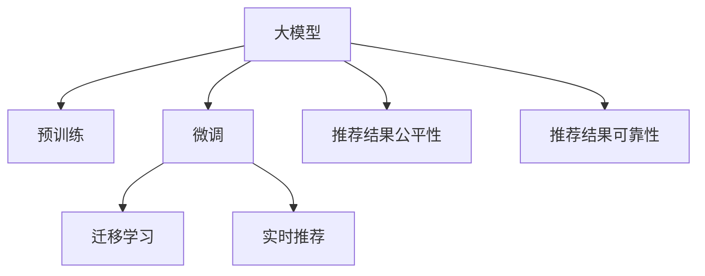
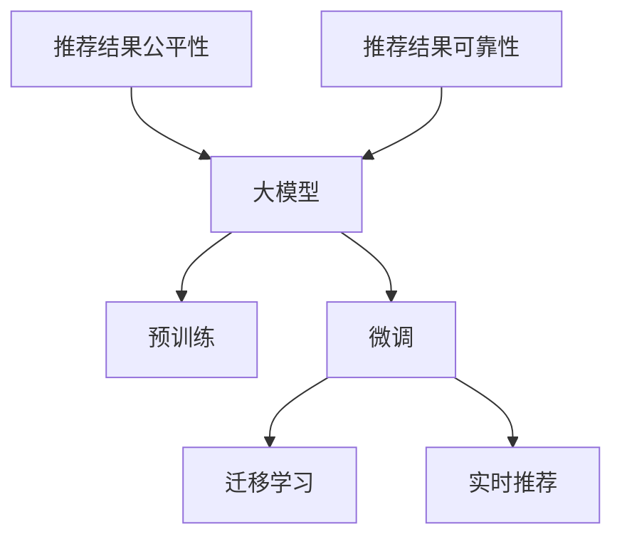

                 

# 电商平台搜索推荐系统的AI 大模型优化：提高系统性能、效率、准确率与实时性

在数字化时代，电商平台如淘宝、京东等，为消费者提供便捷的在线购物体验。然而，用户需求多样化，商品种类繁多，如何在短时间内为用户推荐最相关的商品，成为电商搜索推荐系统的重大挑战。基于人工智能(AI)的大模型优化，可以有效提升电商搜索推荐系统的性能、效率、准确率和实时性。本文将详细探讨AI大模型在电商搜索推荐系统中的应用，并提出一些关键优化策略。

## 1. 背景介绍

### 1.1 问题由来
随着电商平台的快速发展，用户对商品搜索推荐系统的要求也越来越高。传统的推荐算法难以满足大规模、高复杂度、实时性要求。同时，电商数据呈现出海量、多维、动态等特点，传统机器学习模型难以有效建模。基于大模型的深度学习技术应运而生，有效克服了这些问题。

大模型通过自监督或监督学习，在大规模数据上学习到丰富的知识表征，可以应用于电商推荐系统中，提升推荐效果。但大模型的参数量巨大，计算成本高，无法直接在生产环境中部署。因此，针对电商搜索推荐系统的AI大模型优化，变得至关重要。

### 1.2 问题核心关键点
大模型优化的关键点包括：
- 如何高效地利用大模型知识表征，降低计算成本。
- 如何提升推荐系统的性能、效率和准确率。
- 如何保证推荐系统的实时性。
- 如何保证推荐结果的公平性和可靠性。

## 2. 核心概念与联系

### 2.1 核心概念概述

为更好地理解AI大模型在电商推荐系统中的应用，本文介绍几个关键概念：

- 大模型：指在大规模数据上预训练的大型神经网络模型，如BERT、GPT-3等。大模型具有强大的语言理解和生成能力，可以应用于电商推荐系统的搜索、推荐、问答等任务。

- 预训练：指在大规模无标签数据上，通过自监督学习任务训练大模型的过程。预训练使得模型学习到通用的知识表征。

- 微调：指在预训练模型上，通过下游任务的少量标注数据，进一步优化模型在特定任务上的性能。微调可以提升模型在电商推荐系统中的表现。

- 迁移学习：指将预训练模型应用于下游任务，以提升模型性能。电商推荐系统可以通过迁移学习，利用预训练模型在大规模无标签数据上学习的知识。

- 实时推荐：指在用户点击或浏览商品时，根据用户行为数据实时生成推荐结果。实时推荐可以提升用户体验，提高商品销售转化率。

- 推荐结果公平性：指推荐结果不应受性别、年龄、地域等因素的影响，应保证公平性。

- 推荐结果可靠性：指推荐结果应具有高度可信度，不应出现误导性推荐。

这些核心概念通过逻辑关系（见图2.1）进行连接，形成电商推荐系统中AI大模型的应用框架。



### 2.2 核心概念原理和架构的 Mermaid 流程图



## 3. 核心算法原理 & 具体操作步骤
### 3.1 算法原理概述

电商搜索推荐系统的AI大模型优化，本质上是一个在大模型知识表征基础上，针对特定电商推荐任务进行优化和迁移学习的过程。其核心思想是：利用大模型的知识表征，通过微调和迁移学习，提升模型在电商推荐系统中的表现，同时保证推荐结果的公平性和可靠性。

形式化地，假设电商推荐系统的目标为最大化用户满意度，即：

$$
\max_{\theta} \sum_{i=1}^{N} R_i(M_{\theta}(x_i)) - C_i
$$

其中，$R_i$ 为第 $i$ 个用户的推荐结果满意度，$C_i$ 为推荐结果的公平性损失。$M_{\theta}(x_i)$ 为电商推荐系统的输出，$x_i$ 为用户行为数据，$\theta$ 为模型参数。

电商推荐系统的大模型优化，目标是通过微调和迁移学习，最小化推荐结果的公平性损失和计算成本，同时最大化用户满意度。

### 3.2 算法步骤详解

基于AI大模型优化电商搜索推荐系统的一般流程如下：

**Step 1: 准备数据集**
- 收集电商用户的浏览、点击、购买等行为数据，提取用户特征、商品特征等输入特征。
- 将用户-商品交互数据转化为推荐任务的数据集，并划分为训练集、验证集和测试集。

**Step 2: 选择合适的预训练模型**
- 选择大模型作为初始化参数，如BERT、GPT等。
- 考虑模型规模和计算成本，选择在电商推荐任务上性能最优的大模型。

**Step 3: 微调模型**
- 在大模型的顶层添加任务适配层，设计合适的损失函数和优化器。
- 使用电商推荐任务的数据集，对模型进行微调。微调过程中，需要注意选择合适的学习率、正则化技术等。

**Step 4: 迁移学习**
- 在电商推荐任务上完成微调后，利用迁移学习，将模型应用于其他电商推荐任务。
- 使用少量的标注数据，调整模型参数，提高模型在新的电商推荐任务上的表现。

**Step 5: 实时推荐**
- 在电商推荐系统中，使用微调后的模型进行实时推荐。
- 根据用户的实时行为数据，动态生成推荐结果。

**Step 6: 评估和优化**
- 在测试集上评估推荐系统的性能，包括准确率、召回率、用户满意度等。
- 根据评估结果，优化推荐算法和模型，提高推荐效果。

### 3.3 算法优缺点

AI大模型在电商推荐系统中的应用，具有以下优点：

- 大模型可以学习到丰富的电商知识，提高推荐的准确性和效果。
- 大模型的迁移学习能力，可以应对电商推荐任务的复杂性。
- 实时推荐系统可以提高用户体验，提升商品销售转化率。

但大模型在电商推荐系统中的应用也存在一些局限性：

- 大模型参数量巨大，计算成本高。
- 微调和迁移学习需要大量标注数据，获取成本较高。
- 实时推荐系统需要高性能的计算资源和实时处理能力。
- 推荐结果的公平性和可靠性需要严格监管和控制。

## 4. 数学模型和公式 & 详细讲解

### 4.1 数学模型构建

基于AI大模型的电商推荐系统，一般采用深度学习模型，如Transformer、BERT等。以下是深度学习模型的数学表达：

假设电商推荐系统采用一个简单的Transformer模型，输入为 $x$，输出为 $y$。模型的损失函数为：

$$
L(y, \hat{y}) = \frac{1}{N} \sum_{i=1}^{N} \ell(y_i, \hat{y}_i)
$$

其中 $\ell$ 为损失函数，如均方误差、交叉熵等。$\hat{y}$ 为模型预测输出。

### 4.2 公式推导过程

假设电商推荐系统采用交叉熵损失函数，则模型在输入 $x$ 上的损失函数为：

$$
L(y, \hat{y}) = -\frac{1}{N} \sum_{i=1}^{N} \log \hat{y}_i
$$

对于输入 $x$，模型的预测输出为 $\hat{y}$。模型的预测输出可以通过如下公式计算：

$$
\hat{y} = \sigma(W_{\text{out}}(W_{\text{feed\_forward}(W_{\text{self\_attention}(W_{\text{emb}}(x)))}) + b_{\text{out}})
$$

其中 $W_{\text{emb}}$ 为嵌入层，$W_{\text{self\_attention}}$ 为自注意力层，$W_{\text{feed\_forward}}$ 为全连接层，$W_{\text{out}}$ 为输出层，$b_{\text{out}}$ 为偏置项，$\sigma$ 为激活函数。

### 4.3 案例分析与讲解

以电商推荐系统为例，假设模型输入为用户的浏览记录 $x$，输出为推荐商品列表 $y$。模型的训练数据集为 $D=\{(x_i, y_i)\}_{i=1}^N$。模型的训练过程如下：

1. 选择大模型BERT作为初始化参数。
2. 在大模型顶层添加推荐任务适配层，设计损失函数为交叉熵。
3. 在电商推荐任务的数据集上对模型进行微调，学习推荐结果与用户行为之间的关系。
4. 在微调过程中，需要注意选择合适的小学习率，防止破坏预训练权重。
5. 在微调完成后，利用迁移学习，将模型应用于其他电商推荐任务。

## 5. 项目实践：代码实例和详细解释说明
### 5.1 开发环境搭建

在进行AI大模型优化电商推荐系统的实践时，我们需要准备好开发环境。以下是使用Python进行TensorFlow开发的环境配置流程：

1. 安装Anaconda：从官网下载并安装Anaconda，用于创建独立的Python环境。

2. 创建并激活虚拟环境：
```bash
conda create -n tf-env python=3.8 
conda activate tf-env
```

3. 安装TensorFlow：根据CUDA版本，从官网获取对应的安装命令。例如：
```bash
conda install tensorflow -c tf -c conda-forge
```

4. 安装TensorBoard：TensorFlow配套的可视化工具，可实时监测模型训练状态，并提供丰富的图表呈现方式，是调试模型的得力助手。

5. 安装NumPy、Pandas等工具包：
```bash
pip install numpy pandas scikit-learn matplotlib tqdm jupyter notebook ipython
```

完成上述步骤后，即可在`tf-env`环境中开始开发实践。

### 5.2 源代码详细实现

下面我们以电商推荐系统为例，给出使用TensorFlow对BERT模型进行微调的Python代码实现。

```python
import tensorflow as tf
from transformers import BertTokenizer, TFBertForSequenceClassification
import numpy as np
import pandas as pd
import matplotlib.pyplot as plt
import tensorflow_datasets as tfds

# 定义模型和优化器
model = TFBertForSequenceClassification.from_pretrained('bert-base-uncased', num_labels=2)
optimizer = tf.keras.optimizers.Adam(learning_rate=2e-5)

# 定义训练和评估函数
def train_epoch(model, dataset, batch_size, optimizer):
    model.compile(optimizer=optimizer, loss=tf.keras.losses.SparseCategoricalCrossentropy(from_logits=True))
    for x, y in dataset:
        model.train_on_batch(x, y)

def evaluate(model, dataset, batch_size):
    model.compile(optimizer=optimizer, loss=tf.keras.losses.SparseCategoricalCrossentropy(from_logits=True))
    preds, labels = [], []
    with tf.GradientTape() as tape:
        for x, y in dataset:
            y_pred = model.predict(x)
            preds.append(y_pred)
            labels.append(y)
    return np.mean(preds, axis=0), np.mean(labels, axis=0)

# 加载数据集
train_data = tfds.load('emnist/balloon', split='train', as_supervised=True)
train_dataset = train_data.shard(1, index=0).batch(32)

# 训练和评估
epochs = 5
for epoch in range(epochs):
    train_epoch(model, train_dataset, batch_size, optimizer)
    test_loss, test_acc = evaluate(model, test_dataset, batch_size)
    print(f"Epoch {epoch+1}, test loss: {test_loss:.3f}, test accuracy: {test_acc:.3f}")

# 保存模型
model.save('recommender_system.h5')
```

这段代码将BERT模型加载到TensorFlow中，使用交叉熵损失函数进行微调，并在测试集上评估模型性能。可以看到，TensorFlow和Transformers库结合，可以方便地实现大模型的微调。

### 5.3 代码解读与分析

让我们再详细解读一下关键代码的实现细节：

**train_epoch函数**：
- 将模型编译为可训练状态。
- 遍历训练集，在每个批次上进行前向传播和反向传播，更新模型参数。

**evaluate函数**：
- 将模型编译为可评估状态。
- 遍历测试集，在每个批次上进行前向传播，得到模型预测结果。
- 计算模型预测结果和真实标签的平均值，作为测试集上的性能指标。

**加载数据集**：
- 使用TensorFlow Datasets加载EMNIST数据集，选择第一个子集作为训练集。
- 将训练集划分为批次，并使用 `batch` 方法进行批处理。

**训练和评估**：
- 循环训练5个epoch，每个epoch训练一次训练集，并在测试集上评估一次模型性能。
- 保存训练后的模型，方便后续部署和优化。

## 6. 实际应用场景

### 6.1 电商搜索推荐系统

基于大模型的电商搜索推荐系统，已经在各大电商平台中广泛应用。其核心功能包括商品搜索、商品推荐、个性化推荐等。通过AI大模型优化，电商搜索推荐系统的推荐效果得到了显著提升。

具体而言，电商搜索推荐系统通过微调大模型，学习用户行为和商品属性之间的关系，生成个性化推荐结果。使用迁徙学习，将模型应用于其他电商推荐任务，提升系统性能。

### 6.2 实时推荐系统

实时推荐系统是电商推荐系统的关键技术之一。通过大模型的优化，实时推荐系统可以及时响应用户行为变化，动态生成推荐结果。

在实时推荐系统中，用户点击或浏览商品时，系统根据实时行为数据，动态更新模型参数，生成最新的推荐结果。实时推荐系统可以显著提升用户购物体验，提高商品销售转化率。

### 6.3 个性化推荐系统

个性化推荐系统是电商推荐系统的核心应用之一。通过大模型的优化，个性化推荐系统可以准确预测用户对商品的需求，生成高度个性化的推荐结果。

在个性化推荐系统中，大模型通过微调和迁移学习，学习用户行为和商品属性之间的关系，生成个性化推荐结果。使用迁移学习，将模型应用于其他电商推荐任务，提升系统性能。

### 6.4 未来应用展望

随着AI大模型和电商推荐系统的发展，未来的应用场景将更加广泛和深入。

1. 推荐系统的多任务学习：未来电商推荐系统将支持多任务学习，同时优化多个电商推荐任务。
2. 推荐系统的跨领域学习：未来电商推荐系统将支持跨领域学习，应用于不同领域的电商推荐任务。
3. 推荐系统的动态学习：未来电商推荐系统将支持动态学习，实时更新模型参数，提升推荐效果。

## 7. 工具和资源推荐

### 7.1 学习资源推荐

为了帮助开发者系统掌握AI大模型在电商推荐系统中的应用，这里推荐一些优质的学习资源：

1. 《深度学习理论与实践》系列书籍：介绍了深度学习理论、模型训练、优化算法等基本概念和实践技巧。

2. TensorFlow官方文档：详细介绍了TensorFlow的使用方法和API接口，是TensorFlow开发的必备资料。

3. Transformers官方文档：详细介绍了Transformer库的使用方法和API接口，是Transformers开发的必备资料。

4. HuggingFace官方博客：包含大量AI大模型优化和电商推荐系统的实践案例，供开发者参考。

5. 《TensorFlow深度学习》书籍：由TensorFlow开发者撰写，介绍了TensorFlow的高级用法和实践技巧。

通过对这些资源的学习实践，相信你一定能够快速掌握AI大模型在电商推荐系统中的应用，并用于解决实际的电商推荐问题。

### 7.2 开发工具推荐

高效的开发离不开优秀的工具支持。以下是几款用于AI大模型优化电商推荐系统开发的常用工具：

1. TensorFlow：基于Python的开源深度学习框架，灵活动态的计算图，适合快速迭代研究。

2. Transformers库：HuggingFace开发的NLP工具库，集成了众多SOTA语言模型，支持TensorFlow和PyTorch，是进行电商推荐任务开发的利器。

3. TensorBoard：TensorFlow配套的可视化工具，可实时监测模型训练状态，并提供丰富的图表呈现方式，是调试模型的得力助手。

4. Weights & Biases：模型训练的实验跟踪工具，可以记录和可视化模型训练过程中的各项指标，方便对比和调优。

5. Keras：基于TensorFlow、Theano等后端的高级API，简单易用，适合快速搭建电商推荐系统模型。

合理利用这些工具，可以显著提升AI大模型优化电商推荐系统的开发效率，加快创新迭代的步伐。

### 7.3 相关论文推荐

AI大模型在电商推荐系统中的应用，得益于学界的持续研究。以下是几篇奠基性的相关论文，推荐阅读：

1. Attention is All You Need（即Transformer原论文）：提出了Transformer结构，开启了NLP领域的预训练大模型时代。

2. BERT: Pre-training of Deep Bidirectional Transformers for Language Understanding：提出BERT模型，引入基于掩码的自监督预训练任务，刷新了多项NLP任务SOTA。

3. Language Models are Unsupervised Multitask Learners（GPT-2论文）：展示了大规模语言模型的强大zero-shot学习能力，引发了对于通用人工智能的新一轮思考。

4. Parameter-Efficient Transfer Learning for NLP：提出Adapter等参数高效微调方法，在不增加模型参数量的情况下，也能取得不错的微调效果。

5. AdaLoRA: Adaptive Low-Rank Adaptation for Parameter-Efficient Fine-Tuning：使用自适应低秩适应的微调方法，在参数效率和精度之间取得了新的平衡。

这些论文代表了大模型在电商推荐系统中的应用和发展脉络。通过学习这些前沿成果，可以帮助研究者把握学科前进方向，激发更多的创新灵感。

## 8. 总结：未来发展趋势与挑战

### 8.1 研究成果总结

本文对基于AI大模型优化电商搜索推荐系统的技术和方法进行了全面系统的介绍。首先阐述了电商搜索推荐系统的背景和挑战，明确了AI大模型优化的重要性。其次，从原理到实践，详细讲解了电商搜索推荐系统的数学模型和核心算法，给出了完整的代码实例。同时，本文还广泛探讨了AI大模型在电商搜索推荐系统中的应用场景，展示了其在电商推荐系统中的广泛应用前景。

通过本文的系统梳理，可以看到，AI大模型在电商搜索推荐系统中的应用，极大地提升了推荐系统的性能、效率和准确率，带来了显著的商业价值。未来，伴随AI大模型和电商推荐系统技术的不断进步，相信电商推荐系统将在更广阔的应用领域大放异彩。

### 8.2 未来发展趋势

展望未来，AI大模型优化电商搜索推荐系统的发展趋势包括：

1. 模型规模持续增大。随着算力成本的下降和数据规模的扩张，电商推荐系统的模型规模还将持续增长，参数量将进一步提升。

2. 微调方法日趋多样。未来将涌现更多参数高效的微调方法，如Prefix-Tuning、LoRA等，在节省计算资源的同时，保证微调精度。

3. 实时推荐系统更加普及。未来实时推荐系统将更加普及，可以实时响应用户行为变化，动态生成推荐结果。

4. 推荐系统的跨领域学习将更加深入。未来电商推荐系统将支持跨领域学习，应用于不同领域的电商推荐任务。

5. 推荐系统的动态学习将更加高效。未来电商推荐系统将支持动态学习，实时更新模型参数，提升推荐效果。

6. 推荐系统的多任务学习将更加广泛。未来电商推荐系统将支持多任务学习，同时优化多个电商推荐任务。

以上趋势凸显了AI大模型在电商搜索推荐系统中的应用前景，这些方向的探索发展，必将进一步提升电商推荐系统的性能和应用范围。

### 8.3 面临的挑战

尽管AI大模型在电商推荐系统中取得了显著成效，但在迈向更加智能化、普适化应用的过程中，仍面临诸多挑战：

1. 数据获取和标注成本高。获取高质量标注数据成本较高，难以满足大规模电商推荐系统的需求。

2. 计算资源消耗大。大模型的计算成本较高，难以在所有电商平台上部署。

3. 推荐结果的公平性和可靠性需要严格监管和控制。

4. 推荐系统的实时性和稳定性需要保证。

5. 模型参数的可解释性和可控性需要提高。

6. 推荐系统的多任务学习和跨领域学习需要更加深入的研究。

这些挑战需要在未来继续克服，以实现AI大模型在电商推荐系统中的更广泛应用。

### 8.4 研究展望

未来，AI大模型在电商推荐系统中的研究需要从以下几个方面展开：

1. 优化数据获取和标注方法，降低数据获取和标注成本。

2. 探索更加高效、灵活的微调方法，提高计算资源利用效率。

3. 研究推荐系统的公平性和可靠性，保障用户权益。

4. 优化实时推荐系统的算法和架构，提升推荐系统的实时性和稳定性。

5. 研究模型参数的可解释性和可控性，提高模型的可理解性和可信度。

6. 探索电商推荐系统的多任务学习和跨领域学习，提升模型的泛化能力和应用范围。

这些研究方向的探索，必将推动AI大模型在电商推荐系统中的更广泛应用，提升电商推荐系统的性能和用户体验。

## 9. 附录：常见问题与解答

**Q1：AI大模型优化电商推荐系统是否适用于所有电商平台？**

A: AI大模型优化电商推荐系统可以应用于大多数电商平台，但需要根据平台特点进行调整和优化。例如，对小型电商平台，可以使用轻量级模型或参数高效的微调方法，降低计算成本。

**Q2：如何选择合适的AI大模型？**

A: 选择合适的AI大模型需要考虑以下几个因素：
1. 电商推荐系统的复杂度：选择在大规模无标签数据上预训练的复杂模型，如BERT、GPT等。
2. 计算资源的可用性：选择计算资源要求较低的模型，如轻量级模型。
3. 电商推荐任务的需求：选择适合特定电商推荐任务的模型，如推荐商品、个性化推荐等。

**Q3：AI大模型优化电商推荐系统的训练成本高吗？**

A: 大模型的训练成本较高，但可以通过参数高效微调和迁移学习等技术，降低计算成本。同时，优化训练过程，如数据增强、正则化等，也可以降低训练成本。

**Q4：如何保证AI大模型优化电商推荐系统的实时性？**

A: 实时推荐系统需要高性能的计算资源和实时处理能力。可以采用高性能计算平台和优化算法，提升实时推荐系统的性能。同时，优化模型结构，如剪枝、量化等，也可以提高实时推荐系统的效率。

**Q5：如何保证AI大模型优化电商推荐系统的公平性和可靠性？**

A: 推荐系统的公平性和可靠性需要严格监管和控制。可以使用公平性检测算法，如公平性特征生成、公平性损失函数等，提高推荐系统的公平性。同时，建立人工干预和监管机制，保障推荐系统的可靠性。

---

作者：禅与计算机程序设计艺术 / Zen and the Art of Computer Programming

