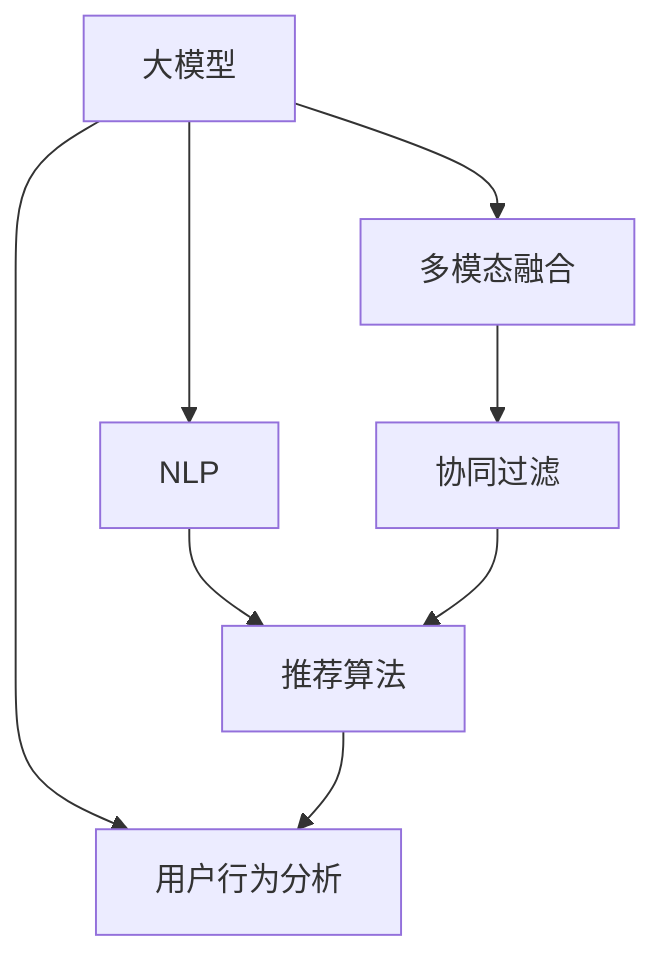

                 

# 电商平台搜索推荐系统的AI 大模型实践：提高系统性能、效率、准确率与多样性

> 关键词：电商平台,搜索推荐系统,大模型,自然语言处理,NLP,深度学习,多模态融合,用户行为分析,推荐算法,数据工程

## 1. 背景介绍

### 1.1 问题由来
随着互联网和电子商务的迅猛发展，电商平台已经成为了人们日常生活和工作中不可或缺的一部分。在线购物的便捷性和多样性使得用户数量和交易量持续增长，电商平台面临的数据量和用户需求的复杂性也在不断增加。为了满足用户日益增长的个性化需求，提高购物体验，电商平台需要构建一个高效、准确、多样化的搜索推荐系统。

传统的搜索推荐系统主要是基于规则或统计方法的，依赖于手工设计的特征和复杂的规则系统，难以适应个性化和动态变化的场景。随着深度学习和自然语言处理（NLP）技术的兴起，基于大模型的AI搜索推荐系统成为了行业新趋势。

### 1.2 问题核心关键点
本文聚焦于在电商平台搜索推荐系统中，如何利用大模型提高系统的性能、效率、准确率和多样性。具体来说，将从以下几个方面入手：

- 使用大模型进行自然语言处理，以提升搜索和推荐的相关性和个性化程度。
- 探索多模态融合技术，整合用户行为数据、商品信息等多样化的信息源。
- 设计高效的推荐算法，结合协同过滤、深度学习等方法，提升推荐效果。
- 采用数据工程方法，构建高质量的数据库和数据管道，支撑模型的训练和部署。

### 1.3 问题研究意义
利用大模型和AI技术优化电商平台搜索推荐系统，对于提升用户体验、增加用户粘性、提高转化率具有重要意义。具体来说：

- 用户搜索的精准性更高。大模型可以理解自然语言，帮助用户快速找到符合其需求的商品。
- 推荐的多样性和个性化更强。大模型能够捕捉用户兴趣和行为模式，提供更加多样化和个性化的商品推荐。
- 系统响应速度更快。大模型的高效计算和优化算法提高了推荐的实时性。
- 推荐结果的准确性更高。大模型结合深度学习算法，能够更准确地预测用户行为。

因此，探索基于大模型的AI搜索推荐系统，对于电商平台来说，是实现差异化竞争和持续发展的关键。

## 2. 核心概念与联系

### 2.1 核心概念概述

在讨论基于大模型的AI搜索推荐系统前，首先需要明确一些核心概念：

- **大模型**：指采用大规模神经网络结构和海量数据预训练得到的模型，如GPT、BERT等，具有强大的语言理解能力和泛化能力。
- **自然语言处理(NLP)**：涉及语言文字的自动化处理，包括文本分析、语义理解、情感分析等。
- **多模态融合**：将不同类型的数据（如文本、图像、音频等）融合在一起，进行综合分析。
- **协同过滤**：一种基于用户历史行为进行推荐的方法，通过相似性匹配找出潜在的相似用户或物品，进行推荐。
- **深度学习**：一种基于神经网络的机器学习技术，能够自动学习特征，适用于复杂的数据处理任务。
- **用户行为分析**：通过对用户浏览、点击、购买等行为数据的分析，了解用户偏好和需求，进行精准推荐。

这些概念之间的逻辑关系可以通过以下Mermaid流程图来展示：



这个流程图展示了各个概念之间的联系：

1. 大模型提供语言理解和特征提取能力。
2. 多模态融合整合多种数据源。
3. 协同过滤结合用户行为分析，进行个性化推荐。
4. 推荐算法利用模型和用户行为数据，生成推荐结果。

这些概念共同构成了AI搜索推荐系统的核心技术框架，使得系统能够实现高效、准确和个性化的推荐。

## 3. 核心算法原理 & 具体操作步骤
### 3.1 算法原理概述

基于大模型的AI搜索推荐系统的核心算法原理是结合NLP技术、多模态融合和推荐算法，对用户行为和商品信息进行处理和分析，最终生成推荐结果。其基本流程如下：

1. 数据预处理：清洗、标准化和分词等步骤，以便后续处理。
2. 特征提取：利用大模型对用户搜索查询、商品描述、用户行为等数据进行向量表示。
3. 多模态融合：将文本、图像、音频等多类型的数据进行综合分析，提升特征表示的全面性和准确性。
4. 协同过滤：通过用户历史行为和商品属性，进行相似性匹配，找出潜在的相似用户或商品。
5. 推荐算法：结合深度学习算法，如DNN、CNN、RNN等，对用户行为和商品数据进行建模，预测用户对商品的需求。
6. 结果生成：根据用户行为数据和推荐算法结果，生成个性化的搜索结果和推荐列表。

### 3.2 算法步骤详解

具体算法步骤如下：

#### 步骤1：数据预处理
1. **数据清洗**：去除无关数据，如特殊字符、停用词等。
2. **标准化处理**：统一字符编码，如小写、去除标点等。
3. **分词**：将文本分解为单个词语，方便后续处理。

#### 步骤2：特征提取
1. **使用大模型编码文本数据**：将用户搜索查询、商品描述等文本数据输入大模型，生成向量表示。
2. **提取关键特征**：利用大模型的注意力机制，提取文本中的关键信息，如关键词、情感等。

#### 步骤3：多模态融合
1. **整合用户行为数据**：收集用户浏览、点击、购买等行为数据，进行整合和处理。
2. **整合商品信息**：将商品图片、描述、评分等信息进行编码，形成向量表示。
3. **融合多种数据**：将文本特征、用户行为和商品信息进行融合，生成综合特征向量。

#### 步骤4：协同过滤
1. **构建用户-商品矩阵**：根据用户历史行为和商品属性，构建用户-商品矩阵。
2. **计算相似性**：使用余弦相似度、皮尔逊相关系数等方法，计算用户和商品之间的相似性。
3. **生成推荐列表**：根据相似性，找到与目标用户相似的其他用户或商品，进行推荐。

#### 步骤5：推荐算法
1. **构建用户模型**：根据用户历史行为和特征表示，构建用户模型。
2. **构建商品模型**：根据商品属性和特征表示，构建商品模型。
3. **生成推荐结果**：使用深度学习算法，如DNN、CNN等，对用户和商品模型进行训练，生成推荐结果。

#### 步骤6：结果生成
1. **排序与筛选**：根据推荐算法结果，对推荐商品进行排序和筛选。
2. **呈现结果**：将搜索结果和推荐列表展示给用户，方便其进行浏览和选择。

### 3.3 算法优缺点

基于大模型的AI搜索推荐系统具有以下优点：

1. **强大的语言理解能力**：大模型能够理解自然语言，进行精准的搜索和推荐。
2. **泛化能力强**：通过海量数据预训练，大模型具有较好的泛化能力，能够适应各种场景和数据分布。
3. **个性化推荐**：结合用户行为分析，能够提供更加个性化和多样化的推荐结果。
4. **实时响应**：结合优化算法，推荐系统能够快速响应用户需求，提供实时推荐。

同时，也存在一些局限性：

1. **数据需求量大**：需要大量高质量的数据进行预训练和微调，数据获取成本较高。
2. **计算资源需求高**：大模型参数量大，需要高性能计算资源支撑。
3. **解释性不足**：推荐结果的生成过程较复杂，难以解释推荐依据。
4. **用户隐私问题**：需要处理大量的用户行为数据，涉及用户隐私保护问题。

### 3.4 算法应用领域

基于大模型的AI搜索推荐系统在电商领域有广泛的应用，具体包括：

1. **商品搜索**：通过大模型进行自然语言处理，提升搜索相关性。
2. **个性化推荐**：结合用户行为分析和多模态融合，提供个性化的商品推荐。
3. **用户画像构建**：利用大模型对用户行为数据进行分析和建模，构建用户画像。
4. **广告投放**：通过分析用户行为和兴趣，进行精准的广告投放。
5. **库存管理**：根据推荐结果，优化库存管理，提升销售效率。

## 4. 数学模型和公式 & 详细讲解  
### 4.1 数学模型构建

本文使用数学语言对基于大模型的AI搜索推荐系统进行更严格的刻画。

设用户数为 $U$，商品数为 $I$，用户与商品之间的交互数据为 $D$。用户的历史行为数据为 $X=\{x_i\}_{i=1}^U$，商品的属性和描述数据为 $Y=\{y_j\}_{j=1}^I$。搜索查询和商品描述文本数据为 $Z=\{z_k\}_{k=1}^K$，其中 $K$ 为文本数据量。

假设用户-商品相似度矩阵为 $A\in \mathbb{R}^{U\times I}$，用户历史行为向量为 $X'\in \mathbb{R}^{U\times D}$，商品属性向量为 $Y'\in \mathbb{R}^{I\times M}$，其中 $D$ 和 $M$ 分别为用户行为维度和商品属性维度。

定义用户行为向量 $x_u\in \mathbb{R}^D$，商品属性向量 $y_i\in \mathbb{R}^M$，搜索查询向量 $z_k\in \mathbb{R}^N$，其中 $N$ 为搜索查询的维度。

推荐系统的目标是通过学习用户行为和商品属性，生成推荐结果。具体模型构建如下：

1. **用户行为模型**：根据用户历史行为数据 $X$，构建用户行为向量 $x_u$。
2. **商品属性模型**：根据商品属性和描述数据 $Y$，构建商品属性向量 $y_i$。
3. **搜索查询模型**：根据搜索查询数据 $Z$，生成搜索查询向量 $z_k$。
4. **相似度矩阵**：根据用户行为向量 $x_u$ 和商品属性向量 $y_i$，计算用户和商品的相似度 $A_{ui}$。
5. **推荐模型**：根据用户行为向量 $x_u$、商品属性向量 $y_i$ 和相似度矩阵 $A$，生成推荐结果 $r_{ui}$。

### 4.2 公式推导过程

以下是基于大模型的AI搜索推荐系统的核心公式推导。

#### 用户行为模型
用户行为向量 $x_u$ 可通过以下公式计算：
$$
x_u = f(X_u, W_u)
$$
其中 $f$ 为非线性映射函数，$W_u$ 为可训练的用户行为模型参数。

#### 商品属性模型
商品属性向量 $y_i$ 可通过以下公式计算：
$$
y_i = f(Y_i, W_y)
$$
其中 $W_y$ 为可训练的商品属性模型参数。

#### 搜索查询模型
搜索查询向量 $z_k$ 可通过以下公式计算：
$$
z_k = f(z_k, W_z)
$$
其中 $W_z$ 为可训练的搜索查询模型参数。

#### 相似度矩阵
用户和商品的相似度 $A_{ui}$ 可通过以下公式计算：
$$
A_{ui} = g(x_u, y_i)
$$
其中 $g$ 为相似度计算函数，如余弦相似度、皮尔逊相关系数等。

#### 推荐模型
推荐结果 $r_{ui}$ 可通过以下公式计算：
$$
r_{ui} = h(x_u, y_i, A)
$$
其中 $h$ 为推荐函数，结合用户行为向量、商品属性向量和相似度矩阵，生成推荐结果。

### 4.3 案例分析与讲解

以下以基于大模型的电商搜索推荐系统为例，对以上公式进行具体分析。

假设用户 $u$ 浏览了5个商品 $i_1, i_2, i_3, i_4, i_5$，购买了商品 $i_3$。搜索查询为“羊毛衫”。

1. **用户行为模型**：根据用户浏览和购买历史，生成用户行为向量 $x_u$。
2. **商品属性模型**：根据商品的属性和描述数据，生成商品属性向量 $y_{i_1}, y_{i_2}, y_{i_3}, y_{i_4}, y_{i_5}$。
3. **搜索查询模型**：根据搜索查询“羊毛衫”，生成搜索查询向量 $z_k$。
4. **相似度矩阵**：计算用户 $u$ 与每个商品 $i_1, i_2, i_3, i_4, i_5$ 之间的相似度 $A_{ui_1}, A_{ui_2}, A_{ui_3}, A_{ui_4}, A_{ui_5}$。
5. **推荐模型**：根据用户行为向量 $x_u$、商品属性向量 $y_{i_1}, y_{i_2}, y_{i_3}, y_{i_4}, y_{i_5}$ 和相似度矩阵 $A_{ui_1}, A_{ui_2}, A_{ui_3}, A_{ui_4}, A_{ui_5}$，生成推荐结果 $r_{ui_1}, r_{ui_2}, r_{ui_3}, r_{ui_4}, r_{ui_5}$。

最终，系统将生成推荐列表 $r_{ui_1}, r_{ui_2}, r_{ui_3}, r_{ui_4}, r_{ui_5}$，推荐给用户 $u$，供其选择。

## 5. 项目实践：代码实例和详细解释说明
### 5.1 开发环境搭建

在进行基于大模型的AI搜索推荐系统开发前，需要准备好开发环境。以下是使用Python进行PyTorch开发的环境配置流程：

1. 安装Anaconda：从官网下载并安装Anaconda，用于创建独立的Python环境。
2. 创建并激活虚拟环境：
```bash
conda create -n pytorch-env python=3.8 
conda activate pytorch-env
```
3. 安装PyTorch：根据CUDA版本，从官网获取对应的安装命令。例如：
```bash
conda install pytorch torchvision torchaudio cudatoolkit=11.1 -c pytorch -c conda-forge
```
4. 安装Transformers库：
```bash
pip install transformers
```
5. 安装各类工具包：
```bash
pip install numpy pandas scikit-learn matplotlib tqdm jupyter notebook ipython
```
完成上述步骤后，即可在`pytorch-env`环境中开始开发。

### 5.2 源代码详细实现

下面我们以电商搜索推荐系统为例，给出使用Transformers库对BERT模型进行搜索推荐任务开发的PyTorch代码实现。

首先，定义搜索推荐任务的数据处理函数：

```python
from transformers import BertTokenizer
from torch.utils.data import Dataset
import torch

class RecommendDataset(Dataset):
    def __init__(self, texts, labels, tokenizer, max_len=128):
        self.texts = texts
        self.labels = labels
        self.tokenizer = tokenizer
        self.max_len = max_len
        
    def __len__(self):
        return len(self.texts)
    
    def __getitem__(self, item):
        text = self.texts[item]
        label = self.labels[item]
        
        encoding = self.tokenizer(text, return_tensors='pt', max_length=self.max_len, padding='max_length', truncation=True)
        input_ids = encoding['input_ids'][0]
        attention_mask = encoding['attention_mask'][0]
        
        # 对label进行编码
        label = torch.tensor(label, dtype=torch.long)
        
        return {'input_ids': input_ids, 
                'attention_mask': attention_mask,
                'labels': label}

# 标签编码
label2id = {0: 'unrelated', 1: 'relevant'}
id2label = {v: k for k, v in label2id.items()}

# 创建dataset
tokenizer = BertTokenizer.from_pretrained('bert-base-cased')

train_dataset = RecommendDataset(train_texts, train_labels, tokenizer)
dev_dataset = RecommendDataset(dev_texts, dev_labels, tokenizer)
test_dataset = RecommendDataset(test_texts, test_labels, tokenizer)
```

然后，定义模型和优化器：

```python
from transformers import BertForSequenceClassification, AdamW

model = BertForSequenceClassification.from_pretrained('bert-base-cased', num_labels=2)

optimizer = AdamW(model.parameters(), lr=2e-5)
```

接着，定义训练和评估函数：

```python
from torch.utils.data import DataLoader
from tqdm import tqdm
from sklearn.metrics import classification_report

device = torch.device('cuda') if torch.cuda.is_available() else torch.device('cpu')
model.to(device)

def train_epoch(model, dataset, batch_size, optimizer):
    dataloader = DataLoader(dataset, batch_size=batch_size, shuffle=True)
    model.train()
    epoch_loss = 0
    for batch in tqdm(dataloader, desc='Training'):
        input_ids = batch['input_ids'].to(device)
        attention_mask = batch['attention_mask'].to(device)
        labels = batch['labels'].to(device)
        model.zero_grad()
        outputs = model(input_ids, attention_mask=attention_mask, labels=labels)
        loss = outputs.loss
        epoch_loss += loss.item()
        loss.backward()
        optimizer.step()
    return epoch_loss / len(dataloader)

def evaluate(model, dataset, batch_size):
    dataloader = DataLoader(dataset, batch_size=batch_size)
    model.eval()
    preds, labels = [], []
    with torch.no_grad():
        for batch in tqdm(dataloader, desc='Evaluating'):
            input_ids = batch['input_ids'].to(device)
            attention_mask = batch['attention_mask'].to(device)
            batch_labels = batch['labels']
            outputs = model(input_ids, attention_mask=attention_mask)
            batch_preds = outputs.logits.argmax(dim=2).to('cpu').tolist()
            batch_labels = batch_labels.to('cpu').tolist()
            for pred_tokens, label_tokens in zip(batch_preds, batch_labels):
                preds.append(pred_tokens[:len(label_tokens)])
                labels.append(label_tokens)
                
    print(classification_report(labels, preds))
```

最后，启动训练流程并在测试集上评估：

```python
epochs = 5
batch_size = 16

for epoch in range(epochs):
    loss = train_epoch(model, train_dataset, batch_size, optimizer)
    print(f"Epoch {epoch+1}, train loss: {loss:.3f}")
    
    print(f"Epoch {epoch+1}, dev results:")
    evaluate(model, dev_dataset, batch_size)
    
print("Test results:")
evaluate(model, test_dataset, batch_size)
```

以上就是使用PyTorch对BERT进行电商搜索推荐任务开发的完整代码实现。可以看到，得益于Transformers库的强大封装，我们可以用相对简洁的代码完成BERT模型的加载和微调。

### 5.3 代码解读与分析

让我们再详细解读一下关键代码的实现细节：

**RecommendDataset类**：
- `__init__`方法：初始化文本、标签、分词器等关键组件。
- `__len__`方法：返回数据集的样本数量。
- `__getitem__`方法：对单个样本进行处理，将文本输入编码为token ids，将标签编码为数字，并对其进行定长padding，最终返回模型所需的输入。

**label2id和id2label字典**：
- 定义了标签与数字id之间的映射关系，用于将预测结果解码回真实的标签。

**训练和评估函数**：
- 使用PyTorch的DataLoader对数据集进行批次化加载，供模型训练和推理使用。
- 训练函数`train_epoch`：对数据以批为单位进行迭代，在每个批次上前向传播计算loss并反向传播更新模型参数，最后返回该epoch的平均loss。
- 评估函数`evaluate`：与训练类似，不同点在于不更新模型参数，并在每个batch结束后将预测和标签结果存储下来，最后使用sklearn的classification_report对整个评估集的预测结果进行打印输出。

**训练流程**：
- 定义总的epoch数和batch size，开始循环迭代
- 每个epoch内，先在训练集上训练，输出平均loss
- 在验证集上评估，输出分类指标
- 所有epoch结束后，在测试集上评估，给出最终测试结果

可以看到，PyTorch配合Transformers库使得BERT微调的代码实现变得简洁高效。开发者可以将更多精力放在数据处理、模型改进等高层逻辑上，而不必过多关注底层的实现细节。

当然，工业级的系统实现还需考虑更多因素，如模型的保存和部署、超参数的自动搜索、更灵活的任务适配层等。但核心的微调范式基本与此类似。

## 6. 实际应用场景
### 6.1 智能客服系统

基于大模型的AI搜索推荐系统，可以广泛应用于智能客服系统的构建。传统客服往往需要配备大量人力，高峰期响应缓慢，且一致性和专业性难以保证。而使用基于大模型的推荐系统，可以7x24小时不间断服务，快速响应客户咨询，用自然流畅的语言解答各类常见问题。

在技术实现上，可以收集企业内部的历史客服对话记录，将问题和最佳答复构建成监督数据，在此基础上对预训练推荐模型进行微调。微调后的推荐系统能够自动理解用户意图，匹配最合适的答复模板进行回复。对于客户提出的新问题，还可以接入检索系统实时搜索相关内容，动态组织生成回答。如此构建的智能客服系统，能大幅提升客户咨询体验和问题解决效率。

### 6.2 金融舆情监测

金融机构需要实时监测市场舆论动向，以便及时应对负面信息传播，规避金融风险。传统的人工监测方式成本高、效率低，难以应对网络时代海量信息爆发的挑战。基于大模型的文本分类和情感分析技术，为金融舆情监测提供了新的解决方案。

具体而言，可以收集金融领域相关的新闻、报道、评论等文本数据，并对其进行主题标注和情感标注。在此基础上对预训练语言模型进行微调，使其能够自动判断文本属于何种主题，情感倾向是正面、中性还是负面。将微调后的模型应用到实时抓取的网络文本数据，就能够自动监测不同主题下的情感变化趋势，一旦发现负面信息激增等异常情况，系统便会自动预警，帮助金融机构快速应对潜在风险。

### 6.3 个性化推荐系统

当前的推荐系统往往只依赖用户的历史行为数据进行物品推荐，无法深入理解用户的真实兴趣偏好。基于大模型微调技术，个性化推荐系统可以更好地挖掘用户行为背后的语义信息，从而提供更精准、多样的推荐内容。

在实践中，可以收集用户浏览、点击、评论、分享等行为数据，提取和用户交互的物品标题、描述、标签等文本内容。将文本内容作为模型输入，用户的后续行为（如是否点击、购买等）作为监督信号，在此基础上微调预训练语言模型。微调后的模型能够从文本内容中准确把握用户的兴趣点。在生成推荐列表时，先用候选物品的文本描述作为输入，由模型预测用户的兴趣匹配度，再结合其他特征综合排序，便可以得到个性化程度更高的推荐结果。

### 6.4 未来应用展望

随着大模型和微调方法的不断发展，基于微调范式将在更多领域得到应用，为传统行业带来变革性影响。

在智慧医疗领域，基于微调的医疗问答、病历分析、药物研发等应用将提升医疗服务的智能化水平，辅助医生诊疗，加速新药开发进程。

在智能教育领域，微调技术可应用于作业批改、学情分析、知识推荐等方面，因材施教，促进教育公平，提高教学质量。

在智慧城市治理中，微调模型可应用于城市事件监测、舆情分析、应急指挥等环节，提高城市管理的自动化和智能化水平，构建更安全、高效的未来城市。

此外，在企业生产、社会治理、文娱传媒等众多领域，基于大模型微调的人工智能应用也将不断涌现，为经济社会发展注入新的动力。相信随着技术的日益成熟，微调方法将成为人工智能落地应用的重要范式，推动人工智能技术向更广阔的领域加速渗透。

## 7. 工具和资源推荐
### 7.1 学习资源推荐

为了帮助开发者系统掌握基于大模型的AI搜索推荐系统的理论基础和实践技巧，这里推荐一些优质的学习资源：

1. 《Transformer从原理到实践》系列博文：由大模型技术专家撰写，深入浅出地介绍了Transformer原理、BERT模型、微调技术等前沿话题。

2. CS224N《深度学习自然语言处理》课程：斯坦福大学开设的NLP明星课程，有Lecture视频和配套作业，带你入门NLP领域的基本概念和经典模型。

3. 《Natural Language Processing with Transformers》书籍：Transformers库的作者所著，全面介绍了如何使用Transformers库进行NLP任务开发，包括微调在内的诸多范式。

4. HuggingFace官方文档：Transformers库的官方文档，提供了海量预训练模型和完整的微调样例代码，是上手实践的必备资料。

5. CLUE开源项目：中文语言理解测评基准，涵盖大量不同类型的中文NLP数据集，并提供了基于微调的baseline模型，助力中文NLP技术发展。

通过对这些资源的学习实践，相信你一定能够快速掌握基于大模型的AI搜索推荐系统的精髓，并用于解决实际的NLP问题。
###  7.2 开发工具推荐

高效的开发离不开优秀的工具支持。以下是几款用于大模型微调开发的常用工具：

1. PyTorch：基于Python的开源深度学习框架，灵活动态的计算图，适合快速迭代研究。大部分预训练语言模型都有PyTorch版本的实现。

2. TensorFlow：由Google主导开发的开源深度学习框架，生产部署方便，适合大规模工程应用。同样有丰富的预训练语言模型资源。

3. Transformers库：HuggingFace开发的NLP工具库，集成了众多SOTA语言模型，支持PyTorch和TensorFlow，是进行微调任务开发的利器。

4. Weights & Biases：模型训练的实验跟踪工具，可以记录和可视化模型训练过程中的各项指标，方便对比和调优。与主流深度学习框架无缝集成。

5. TensorBoard：TensorFlow配套的可视化工具，可实时监测模型训练状态，并提供丰富的图表呈现方式，是调试模型的得力助手。

6. Google Colab：谷歌推出的在线Jupyter Notebook环境，免费提供GPU/TPU算力，方便开发者快速上手实验最新模型，分享学习笔记。

合理利用这些工具，可以显著提升基于大模型的AI搜索推荐系统的开发效率，加快创新迭代的步伐。

### 7.3 相关论文推荐

大模型和微调技术的发展源于学界的持续研究。以下是几篇奠基性的相关论文，推荐阅读：

1. Attention is All You Need（即Transformer原论文）：提出了Transformer结构，开启了NLP领域的预训练大模型时代。

2. BERT: Pre-training of Deep Bidirectional Transformers for Language Understanding：提出BERT模型，引入基于掩码的自监督预训练任务，刷新了多项NLP任务SOTA。

3. Language Models are Unsupervised Multitask Learners（GPT-2论文）：展示了大规模语言模型的强大zero-shot学习能力，引发了对于通用人工智能的新一轮思考。

4. Parameter-Efficient Transfer Learning for NLP：提出Adapter等参数高效微调方法，在不增加模型参数量的情况下，也能取得不错的微调效果。

5. Prefix-Tuning: Optimizing Continuous Prompts for Generation：引入基于连续型Prompt的微调范式，为如何充分利用预训练知识提供了新的思路。

6. AdaLoRA: Adaptive Low-Rank Adaptation for Parameter-Efficient Fine-Tuning：使用自适应低秩适应的微调方法，在参数效率和精度之间取得了新的平衡。

这些论文代表了大模型微调技术的发展脉络。通过学习这些前沿成果，可以帮助研究者把握学科前进方向，激发更多的创新灵感。

## 8. 总结：未来发展趋势与挑战
### 8.1 总结

本文对基于大模型的AI搜索推荐系统进行了全面系统的介绍。首先阐述了电商搜索推荐系统中的大模型应用背景和研究意义，明确了基于大模型的搜索推荐系统的核心技术框架和关键算法步骤。其次，从原理到实践，详细讲解了系统的数学模型和核心算法，给出了微调任务开发的完整代码实例。同时，本文还广泛探讨了微调方法在智能客服、金融舆情、个性化推荐等多个行业领域的应用前景，展示了微调范式的巨大潜力。此外，本文精选了微调技术的各类学习资源，力求为读者提供全方位的技术指引。

通过本文的系统梳理，可以看到，基于大模型的AI搜索推荐系统在电商领域有广泛的应用，能够提升用户体验、增加用户粘性、提高转化率。未来，随着大模型和微调方法的不断发展，基于微调范式将在更多领域得到应用，为传统行业带来变革性影响。

### 8.2 未来发展趋势

展望未来，基于大模型的AI搜索推荐系统将呈现以下几个发展趋势：

1. **模型的规模将持续增大**：随着算力成本的下降和数据规模的扩张，预训练语言模型的参数量还将持续增长。超大规模语言模型蕴含的丰富语言知识，有望支撑更加复杂多变的搜索推荐任务。

2. **微调方法将日趋多样**：除了传统的全参数微调外，未来会涌现更多参数高效的微调方法，如Prefix-Tuning、LoRA等，在节省计算资源的同时也能保证微调精度。

3. **多模态融合技术将快速发展**：将文本、图像、音频等多类型的数据融合在一起，进行综合分析，提升特征表示的全面性和准确性。

4. **推荐算法将进一步优化**：结合协同过滤、深度学习等方法，提升推荐效果。同时，探索更复杂的推荐算法，如图神经网络、自适应推荐等，实现更精确和高效的推荐。

5. **数据工程将成为重要组成部分**：构建高质量的数据库和数据管道，支撑模型的训练和部署。数据清洗、数据增强、数据存储等技术将不断发展，成为搜索推荐系统的核心竞争力。

6. **系统架构将更加灵活**：构建可扩展、可维护的系统架构，支持多模态数据融合、多任务学习等复杂场景。

以上趋势凸显了大模型搜索推荐系统的广阔前景。这些方向的探索发展，必将进一步提升系统的性能和应用范围，为电商平台的智能化转型提供坚实的基础。

### 8.3 面临的挑战

尽管基于大模型的AI搜索推荐系统已经取得了瞩目成就，但在迈向更加智能化、普适化应用的过程中，它仍面临着诸多挑战：

1. **数据需求量大**：需要大量高质量的数据进行预训练和微调，数据获取成本较高。

2. **计算资源需求高**：大模型参数量大，需要高性能计算资源支撑。

3. **解释性不足**：推荐结果的生成过程较复杂，难以解释推荐依据。

4. **用户隐私问题**：需要处理大量的用户行为数据，涉及用户隐私保护问题。

5. **推荐效果的不稳定性**：不同时间段和用户群体可能存在变化，导致推荐效果不稳定。

6. **模型的鲁棒性问题**：在处理异常数据和对抗攻击时，模型的鲁棒性需要进一步提升。

7. **算法复杂性问题**：推荐的算法模型复杂，需要更高效、更可解释的算法框架。

8. **系统可扩展性问题**：在大规模用户访问时，系统需要具备可扩展性。

正视这些挑战，积极应对并寻求突破，将是大模型搜索推荐系统走向成熟的必由之路。相信随着学界和产业界的共同努力，这些挑战终将一一被克服，大模型搜索推荐系统必将在构建人机协同的智能电商平台上扮演越来越重要的角色。

### 8.4 研究展望

面对大模型搜索推荐系统所面临的种种挑战，未来的研究需要在以下几个方面寻求新的突破：

1. **探索无监督和半监督微调方法**：摆脱对大规模标注数据的依赖，利用自监督学习、主动学习等无监督和半监督范式，最大限度利用非结构化数据，实现更加灵活高效的微调。

2. **研究参数高效和计算高效的微调范式**：开发更加参数高效的微调方法，在固定大部分预训练参数的同时，只更新极少量的任务相关参数。同时优化微调模型的计算图，减少前向传播和反向传播的资源消耗，实现更加轻量级、实时性的部署。

3. **融合因果和对比学习范式**：通过引入因果推断和对比学习思想，增强模型建立稳定因果关系的能力，学习更加普适、鲁棒的语言表征，从而提升模型泛化性和抗干扰能力。

4. **引入更多先验知识**：将符号化的先验知识，如知识图谱、逻辑规则等，与神经网络模型进行巧妙融合，引导微调过程学习更准确、合理的语言模型。同时加强不同模态数据的整合，实现视觉、语音等多模态信息与文本信息的协同建模。

5. **结合因果分析和博弈论工具**：将因果分析方法引入微调模型，识别出模型决策的关键特征，增强输出解释的因果性和逻辑性。借助博弈论工具刻画人机交互过程，主动探索并规避模型的脆弱点，提高系统稳定性。

6. **纳入伦理道德约束**：在模型训练目标中引入伦理导向的评估指标，过滤和惩罚有偏见、有害的输出倾向。同时加强人工干预和审核，建立模型行为的监管机制，确保输出符合人类价值观和伦理道德。

这些研究方向的探索，必将引领大模型搜索推荐技术迈向更高的台阶，为构建安全、可靠、可解释、可控的智能系统铺平道路。面向未来，大模型搜索推荐技术还需要与其他人工智能技术进行更深入的融合，如知识表示、因果推理、强化学习等，多路径协同发力，共同推动自然语言理解和智能交互系统的进步。只有勇于创新、敢于突破，才能不断拓展语言模型的边界，让智能技术更好地造福人类社会。

## 9. 附录：常见问题与解答

**Q1：大模型搜索推荐系统是否适用于所有电商领域？**

A: 大模型搜索推荐系统在大多数电商领域都能取得不错的效果，特别是对于数据量较大的领域。但对于一些特殊领域，如生鲜电商、二手市场等，由于数据特性和用户需求特殊，可能需要结合领域特定的知识进行微调。

**Q2：如何平衡搜索推荐的多样性和相关性？**

A: 搜索推荐的多样性和相关性是一对矛盾，需要通过优化模型和调整算法来平衡。通常可以使用多样性损失函数（如F1-score）来引导模型生成更多样化的推荐结果。同时，通过调整相似度计算方式和推荐算法，可以在保证相关性的同时，提升多样性。

**Q3：大模型搜索推荐系统面临哪些技术挑战？**

A: 大模型搜索推荐系统面临的技术挑战包括：
1. 数据获取成本高，需要大量高质量的标注数据进行微调。
2. 计算资源需求大，大模型的训练和推理需要高性能的GPU或TPU。
3. 推荐结果的可解释性不足，难以解释模型决策依据。
4. 用户隐私保护问题，需要确保用户数据的安全和隐私。
5. 推荐效果的不稳定性，不同时间段和用户群体可能存在变化。
6. 模型的鲁棒性问题，在处理异常数据和对抗攻击时，模型的鲁棒性需要进一步提升。

**Q4：如何将大模型与电商领域的数据特点相结合？**

A: 电商领域的数据特点包括用户行为数据、商品属性数据、商品描述数据等。结合大模型，可以通过以下方式进行优化：
1. 对用户行为数据进行清洗、标准化和分词处理，生成用户行为向量。
2. 对商品属性数据进行编码，生成商品属性向量。
3. 对商品描述数据进行文本处理，生成商品描述向量。
4. 整合多种数据源，进行多模态融合，生成综合特征向量。
5. 结合协同过滤和深度学习算法，进行推荐。

**Q5：如何优化大模型搜索推荐系统的性能？**

A: 优化大模型搜索推荐系统的性能可以从以下几个方面入手：
1. 数据预处理：清洗、标准化和分词等步骤，以便后续处理。
2. 特征提取：利用大模型对用户行为和商品信息进行向量表示。
3. 多模态融合：将用户行为数据、商品属性数据、商品描述数据等多类型的数据进行综合分析，提升特征表示的全面性和准确性。
4. 协同过滤：通过用户历史行为和商品属性，进行相似性匹配，找出潜在的相似用户或商品。
5. 推荐算法：结合深度学习算法，对用户行为和商品数据进行建模，预测用户对商品的需求。
6. 结果生成：根据用户行为数据和推荐算法结果，生成个性化的搜索结果和推荐列表。

通过以上优化措施，可以显著提升大模型搜索推荐系统的性能和用户体验。

---

作者：禅与计算机程序设计艺术 / Zen and the Art of Computer Programming

