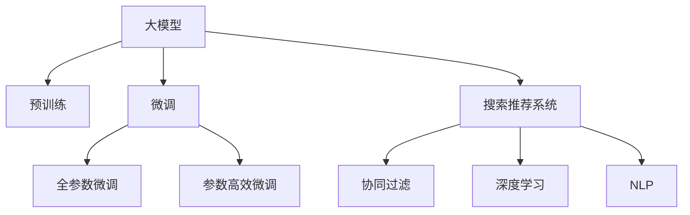

                 

# 电商平台的AI 大模型应用：搜索推荐系统性能与效率的双重提升

## 1. 背景介绍

随着互联网技术的飞速发展和电子商务平台的兴起，搜索引擎推荐系统成为了电商平台的核心竞争力之一。用户在电商平台的搜索和浏览行为背后，蕴含着庞大的用户偏好和需求信息，如何高效地提取、理解和匹配这些信息，直接关系到平台的运营效率和用户体验。搜索引擎推荐系统通过对用户行为数据的建模，精准预测用户的购买意愿，帮助用户快速找到所需商品，大大提升了电商平台的转化率和用户满意度。

近年来，深度学习技术和大语言模型的发展，为搜索引擎推荐系统带来了新的突破。大模型具备强大的知识表示和理解能力，能够在海量用户行为数据中自动学习出潜在规律，大幅提升推荐系统的性能。大模型的这一优势在电商平台上得到了充分体现，从搜索匹配到商品推荐，大模型通过其先进的推理和生成能力，显著提升了搜索推荐系统的效果和效率。

然而，电商平台的实际应用场景高度复杂，用户需求多样化，搜索推荐系统需要在准确性和效率之间做出权衡。如何在大模型和电商平台的实际业务需求之间找到最佳平衡点，是当下研究者面临的一项重要课题。本文将从大模型的原理与优化、搜索引擎推荐系统的工作机制，以及其在电商平台的实际应用效果三个方面，深入探讨大模型在电商平台搜索推荐系统中的应用。

## 2. 核心概念与联系

### 2.1 核心概念概述

为更好地理解大模型在电商平台搜索推荐系统中的应用，本节将介绍几个核心概念：

- **大模型(Large Model)**：以Transformer等架构为代表的大规模预训练语言模型。通过在大规模无标签文本语料上进行预训练，学习通用的语言表示，具备强大的语言理解和生成能力。
- **预训练(Pre-training)**：指在大规模无标签文本语料上，通过自监督学习任务训练通用语言模型的过程。常见的预训练任务包括掩码语言模型、文本分类等。
- **微调(Fine-tuning)**：指在预训练模型的基础上，使用特定任务的数据，通过有监督地训练优化模型在该任务上的性能。
- **搜索推荐系统(Search & Recommendation System)**：指利用用户历史行为和商品特征，通过算法推荐用户可能感兴趣的商品的系统。包括搜索和推荐两大模块。
- **协同过滤(Collaborative Filtering)**：一种基于用户历史行为和商品特征的推荐算法，通过计算用户间的相似度或物品间的相似度，进行推荐。
- **深度学习(Deep Learning)**：利用神经网络模型，通过多层非线性变换，从数据中自动学习出高维表示，用于分类、回归、推荐等任务。
- **自然语言处理(Natural Language Processing, NLP)**：研究如何通过计算机处理和理解人类语言，涉及文本分类、情感分析、命名实体识别等任务。

这些核心概念之间的逻辑关系可以通过以下Mermaid流程图来展示：



这个流程图展示了大模型的核心概念及其之间的关系：

1. 大模型通过预训练获得基础能力。
2. 微调是对预训练模型进行任务特定的优化，可以分为全参数微调和参数高效微调（PEFT）。
3. 搜索推荐系统利用微调后的模型进行推荐。
4. 协同过滤和深度学习是搜索推荐系统的重要组件。
5. 自然语言处理技术帮助理解用户意图和商品描述。

这些概念共同构成了搜索推荐系统的基础，使得大模型能够在实际业务场景中发挥强大的语言理解和生成能力。

## 3. 核心算法原理 & 具体操作步骤
### 3.1 算法原理概述

基于大模型的搜索推荐系统，通过将大模型的语言理解和生成能力与业务数据融合，显著提升了推荐系统的性能和效率。其核心思想是：

1. **预训练大模型的语义表示能力**：大模型通过在大规模无标签文本语料上进行预训练，学习到了丰富的语言知识。这些知识在大模型的语义空间中编码成高维向量表示，能够有效地捕捉文本语义信息，为推荐系统提供强大的特征表示能力。

2. **基于微调的推荐模型训练**：在预训练大模型的基础上，通过微调学习特定任务的推荐模型。微调过程通常利用用户行为数据和商品特征，调整模型的参数，使得推荐模型能够准确地预测用户可能感兴趣的商品。

3. **实时搜索匹配与个性化推荐**：微调后的模型通过实时处理用户输入的查询，快速搜索出与查询语义相似的商品，并通过计算用户与商品之间的相似度，进行个性化推荐。

### 3.2 算法步骤详解

基于大模型的搜索推荐系统通常包括以下几个关键步骤：

**Step 1: 准备预训练模型和数据集**
- 选择合适的预训练语言模型，如BERT、GPT等。
- 收集电商平台的搜索和购买行为数据，划分为训练集、验证集和测试集。

**Step 2: 添加推荐模型适配层**
- 根据任务需求，在预训练模型的顶层设计推荐模型的适配层，如全连接层、注意力机制等。
- 根据推荐任务，选择合适的损失函数，如交叉熵损失、均方误差损失等。

**Step 3: 设置微调超参数**
- 选择合适的优化算法及其参数，如AdamW、SGD等，设置学习率、批大小、迭代轮数等。
- 设置正则化技术及强度，包括权重衰减、Dropout、Early Stopping等。
- 确定冻结预训练参数的策略，如仅微调顶层，或全部参数都参与微调。

**Step 4: 执行梯度训练**
- 将训练集数据分批次输入模型，前向传播计算损失函数。
- 反向传播计算参数梯度，根据设定的优化算法和学习率更新模型参数。
- 周期性在验证集上评估模型性能，根据性能指标决定是否触发Early Stopping。
- 重复上述步骤直到满足预设的迭代轮数或Early Stopping条件。

**Step 5: 测试和部署**
- 在测试集上评估微调后模型的推荐效果，对比微调前后的推荐精度提升。
- 使用微调后的模型对新商品进行推荐，集成到实际的应用系统中。

### 3.3 算法优缺点

基于大模型的搜索推荐系统具有以下优点：

1. **强大的语义表示能力**：大模型能够从自然语言中学习丰富的语言知识，能够更好地理解用户查询和商品描述的语义信息，提高推荐的相关性和精准度。
2. **高效的推荐过程**：利用大模型的推理能力，可以快速处理查询请求，实时匹配商品并生成推荐结果。
3. **自适应能力强**：大模型具备强大的迁移学习能力，能够适应不同领域和不同场景的推荐任务。

同时，该方法也存在一定的局限性：

1. **数据依赖性强**：微调效果很大程度上取决于标注数据的质量和数量，获取高质量标注数据的成本较高。
2. **计算资源需求大**：大模型的参数量庞大，微调过程需要较大的计算资源。
3. **模型复杂度高**：大模型的复杂结构增加了训练和推理的难度，需要高性能计算设备支持。
4. **可解释性不足**：微调后的模型通常缺乏可解释性，难以对其推理逻辑进行分析和调试。

尽管存在这些局限性，但就目前而言，基于大模型的推荐方法仍是最主流范式。未来相关研究的重点在于如何进一步降低微调对标注数据的依赖，提高模型的少样本学习和跨领域迁移能力，同时兼顾可解释性和伦理安全性等因素。

### 3.4 算法应用领域

基于大模型的搜索推荐系统已经在电子商务领域得到了广泛的应用，涵盖了搜索匹配、商品推荐、个性化营销等多个环节，为电商平台的运营效率和用户体验带来了显著提升。

- **搜索匹配**：利用预训练语言模型的语义表示能力，自动理解用户查询，匹配最相关的商品。
- **商品推荐**：通过微调学习用户对商品的态度和偏好，生成个性化推荐结果，提升用户满意度。
- **个性化营销**：结合用户行为数据和商品信息，定制个性化的广告和推荐，增强用户体验。

除了上述这些经典应用外，大模型在电商平台的创新应用也在不断涌现，如智能客服、产品搭配推荐、供应链优化等，为电商平台带来了新的业务价值和增长点。

## 4. 数学模型和公式 & 详细讲解 & 举例说明

### 4.1 数学模型构建

基于大模型的搜索推荐系统通常使用Transformer作为预训练模型，通过在大规模文本数据上进行预训练，学习通用的语言表示。在微调过程中，通过添加推荐模型适配层和特定任务损失函数，对模型进行训练，使得模型能够生成推荐结果。

假设预训练语言模型为 $M_{\theta}$，其中 $\theta$ 为预训练得到的模型参数。假设推荐任务为 $T$，训练集为 $D=\{(x_i,y_i)\}_{i=1}^N$，其中 $x_i$ 为输入的查询或商品描述，$y_i$ 为对应的推荐结果。

定义模型 $M_{\theta}$ 在输入 $x_i$ 上的输出为 $\hat{y}=M_{\theta}(x_i) \in \mathcal{Y}$，其中 $\mathcal{Y}$ 为推荐结果的集合。推荐任务 $T$ 的损失函数为 $\ell(M_{\theta}(x_i),y_i)$，在数据集 $D$ 上的经验风险为：

$$
\mathcal{L}(\theta) = \frac{1}{N} \sum_{i=1}^N \ell(M_{\theta}(x_i),y_i)
$$

在微调过程中，我们通过优化算法（如AdamW、SGD等），最小化经验风险 $\mathcal{L}(\theta)$，使得推荐模型 $M_{\theta}$ 能够生成高质量的推荐结果。

### 4.2 公式推导过程

以下我们以电商平台的商品推荐任务为例，推导推荐模型 $M_{\theta}$ 的微调公式。

假设推荐任务 $T$ 为二分类任务，即预测用户是否会购买某件商品。模型输出为 $\hat{y} \in \{0,1\}$，表示用户是否会购买该商品。真实标签 $y_i \in \{0,1\}$。则二分类交叉熵损失函数定义为：

$$
\ell(M_{\theta}(x_i),y_i) = -[y_i\log \hat{y}_i + (1-y_i)\log (1-\hat{y}_i)]
$$

将其代入经验风险公式，得：

$$
\mathcal{L}(\theta) = -\frac{1}{N}\sum_{i=1}^N [y_i\log M_{\theta}(x_i)+(1-y_i)\log(1-M_{\theta}(x_i))]
$$

根据链式法则，损失函数对参数 $\theta_k$ 的梯度为：

$$
\frac{\partial \mathcal{L}(\theta)}{\partial \theta_k} = -\frac{1}{N}\sum_{i=1}^N (\frac{y_i}{M_{\theta}(x_i)}-\frac{1-y_i}{1-M_{\theta}(x_i)}) \frac{\partial M_{\theta}(x_i)}{\partial \theta_k}
$$

其中 $\frac{\partial M_{\theta}(x_i)}{\partial \theta_k}$ 可进一步递归展开，利用自动微分技术完成计算。

在得到损失函数的梯度后，即可带入参数更新公式，完成模型的迭代优化。重复上述过程直至收敛，最终得到适应推荐任务的最优模型参数 $\theta^*$。

## 5. 项目实践：代码实例和详细解释说明

### 5.1 开发环境搭建

在进行搜索推荐系统开发前，我们需要准备好开发环境。以下是使用Python进行PyTorch开发的环境配置流程：

1. 安装Anaconda：从官网下载并安装Anaconda，用于创建独立的Python环境。

2. 创建并激活虚拟环境：
```bash
conda create -n search_rec_env python=3.8 
conda activate search_rec_env
```

3. 安装PyTorch：根据CUDA版本，从官网获取对应的安装命令。例如：
```bash
conda install pytorch torchvision torchaudio cudatoolkit=11.1 -c pytorch -c conda-forge
```

4. 安装各类工具包：
```bash
pip install numpy pandas scikit-learn matplotlib tqdm jupyter notebook ipython
```

完成上述步骤后，即可在`search_rec_env`环境中开始开发。

### 5.2 源代码详细实现

下面我们以电商平台商品推荐任务为例，给出使用Transformers库对BERT模型进行微调的PyTorch代码实现。

首先，定义推荐任务的数据处理函数：

```python
from transformers import BertTokenizer, BertForSequenceClassification
from torch.utils.data import Dataset, DataLoader
import torch

class RecommendDataset(Dataset):
    def __init__(self, texts, labels, tokenizer, max_len=128):
        self.texts = texts
        self.labels = labels
        self.tokenizer = tokenizer
        self.max_len = max_len
        
    def __len__(self):
        return len(self.texts)
    
    def __getitem__(self, item):
        text = self.texts[item]
        label = self.labels[item]
        
        encoding = self.tokenizer(text, return_tensors='pt', max_length=self.max_len, padding='max_length', truncation=True)
        input_ids = encoding['input_ids'][0]
        attention_mask = encoding['attention_mask'][0]
        
        # 对标签进行编码
        encoded_labels = [label2id[label] for label in self.labels] 
        encoded_labels.extend([label2id['O']] * (self.max_len - len(encoded_labels)))
        labels = torch.tensor(encoded_labels, dtype=torch.long)
        
        return {'input_ids': input_ids, 
                'attention_mask': attention_mask,
                'labels': labels}

# 标签与id的映射
label2id = {'O': 0, 'buy': 1}
id2label = {v: k for k, v in label2id.items()}

# 创建dataset
tokenizer = BertTokenizer.from_pretrained('bert-base-cased')

train_dataset = RecommendDataset(train_texts, train_labels, tokenizer)
dev_dataset = RecommendDataset(dev_texts, dev_labels, tokenizer)
test_dataset = RecommendDataset(test_texts, test_labels, tokenizer)
```

然后，定义模型和优化器：

```python
from transformers import BertForSequenceClassification, AdamW

model = BertForSequenceClassification.from_pretrained('bert-base-cased', num_labels=len(label2id))

optimizer = AdamW(model.parameters(), lr=2e-5)
```

接着，定义训练和评估函数：

```python
from tqdm import tqdm

device = torch.device('cuda') if torch.cuda.is_available() else torch.device('cpu')
model.to(device)

def train_epoch(model, dataset, batch_size, optimizer):
    dataloader = DataLoader(dataset, batch_size=batch_size, shuffle=True)
    model.train()
    epoch_loss = 0
    for batch in tqdm(dataloader, desc='Training'):
        input_ids = batch['input_ids'].to(device)
        attention_mask = batch['attention_mask'].to(device)
        labels = batch['labels'].to(device)
        model.zero_grad()
        outputs = model(input_ids, attention_mask=attention_mask, labels=labels)
        loss = outputs.loss
        epoch_loss += loss.item()
        loss.backward()
        optimizer.step()
    return epoch_loss / len(dataloader)

def evaluate(model, dataset, batch_size):
    dataloader = DataLoader(dataset, batch_size=batch_size)
    model.eval()
    preds, labels = [], []
    with torch.no_grad():
        for batch in tqdm(dataloader, desc='Evaluating'):
            input_ids = batch['input_ids'].to(device)
            attention_mask = batch['attention_mask'].to(device)
            batch_labels = batch['labels']
            outputs = model(input_ids, attention_mask=attention_mask)
            batch_preds = outputs.logits.argmax(dim=2).to('cpu').tolist()
            batch_labels = batch_labels.to('cpu').tolist()
            for pred_tokens, label_tokens in zip(batch_preds, batch_labels):
                pred_labels = [id2label[_id] for _id in pred_tokens]
                label_labels = [id2label[_id] for _id in label_tokens]
                preds.append(pred_labels[:len(label_labels)])
                labels.append(label_labels)
                
    print(classification_report(labels, preds))
```

最后，启动训练流程并在测试集上评估：

```python
epochs = 5
batch_size = 16

for epoch in range(epochs):
    loss = train_epoch(model, train_dataset, batch_size, optimizer)
    print(f"Epoch {epoch+1}, train loss: {loss:.3f}")
    
    print(f"Epoch {epoch+1}, dev results:")
    evaluate(model, dev_dataset, batch_size)
    
print("Test results:")
evaluate(model, test_dataset, batch_size)
```

以上就是使用PyTorch对BERT进行商品推荐任务微调的完整代码实现。可以看到，得益于Transformers库的强大封装，我们可以用相对简洁的代码完成BERT模型的加载和微调。

### 5.3 代码解读与分析

让我们再详细解读一下关键代码的实现细节：

**RecommendDataset类**：
- `__init__`方法：初始化文本、标签、分词器等关键组件。
- `__len__`方法：返回数据集的样本数量。
- `__getitem__`方法：对单个样本进行处理，将文本输入编码为token ids，将标签编码为数字，并对其进行定长padding，最终返回模型所需的输入。

**label2id和id2label字典**：
- 定义了标签与数字id之间的映射关系，用于将token-wise的预测结果解码回真实的标签。

**训练和评估函数**：
- 使用PyTorch的DataLoader对数据集进行批次化加载，供模型训练和推理使用。
- 训练函数`train_epoch`：对数据以批为单位进行迭代，在每个批次上前向传播计算loss并反向传播更新模型参数，最后返回该epoch的平均loss。
- 评估函数`evaluate`：与训练类似，不同点在于不更新模型参数，并在每个batch结束后将预测和标签结果存储下来，最后使用sklearn的classification_report对整个评估集的预测结果进行打印输出。

**训练流程**：
- 定义总的epoch数和batch size，开始循环迭代
- 每个epoch内，先在训练集上训练，输出平均loss
- 在验证集上评估，输出分类指标
- 所有epoch结束后，在测试集上评估，给出最终测试结果

可以看到，PyTorch配合Transformers库使得BERT微调的代码实现变得简洁高效。开发者可以将更多精力放在数据处理、模型改进等高层逻辑上，而不必过多关注底层的实现细节。

当然，工业级的系统实现还需考虑更多因素，如模型的保存和部署、超参数的自动搜索、更灵活的任务适配层等。但核心的微调范式基本与此类似。

## 6. 实际应用场景

### 6.1 实时搜索匹配

电商平台中，用户通常通过关键词搜索商品，系统需要快速匹配出与查询语义相关的商品。传统的搜索匹配方法如TF-IDF、词袋模型等，难以有效理解查询的语义信息，无法实现精准匹配。利用大模型进行搜索匹配，可以显著提升匹配的相关性和准确性。

具体而言，可以通过大模型对用户查询和商品描述进行语义编码，计算查询与商品的相似度，返回相关度最高的商品列表。例如，可以设计一个查询-商品对损失函数，训练模型学习如何匹配相关度，从而实现实时搜索匹配。在实践中，大模型可以根据查询特征，动态生成商品的上下文描述，提高匹配的相关性。

### 6.2 个性化商品推荐

推荐系统通过分析用户的历史行为数据，预测用户可能感兴趣的商品。大模型在推荐系统中的应用，可以提升推荐的个性化和多样性，进一步提升用户体验。

在推荐过程中，大模型可以通过多轮交互的方式，逐步了解用户的多样化需求。例如，可以设计一个多轮对话推荐模型，通过用户的多轮回复，动态调整推荐策略，生成个性化的商品推荐。同时，大模型可以融合用户的行为数据、商品特征、用户画像等信息，进行综合推荐，增强推荐的个性化和多样性。

### 6.3 实时竞价广告推荐

电商平台中的广告推荐，是提升流量转化率的重要手段。通过大模型进行实时竞价广告推荐，可以显著提升广告的点击率和转化率。

具体而言，大模型可以根据用户的实时行为数据，动态计算广告与用户的匹配度，进行实时竞价推荐。例如，可以设计一个基于点击率预测的推荐模型，通过学习广告特征和用户特征的匹配度，生成广告推荐结果。同时，大模型可以根据广告的实际效果，进行实时调整，优化广告推荐策略。

## 7. 工具和资源推荐

### 7.1 学习资源推荐

为了帮助开发者系统掌握大模型在电商平台搜索推荐系统中的应用，这里推荐一些优质的学习资源：

1. 《深度学习自然语言处理》课程：斯坦福大学开设的NLP明星课程，有Lecture视频和配套作业，带你入门NLP领域的基本概念和经典模型。
2. 《Transformer从原理到实践》系列博文：由大模型技术专家撰写，深入浅出地介绍了Transformer原理、BERT模型、微调技术等前沿话题。
3. 《Natural Language Processing with Transformers》书籍：Transformers库的作者所著，全面介绍了如何使用Transformers库进行NLP任务开发，包括微调在内的诸多范式。
4. HuggingFace官方文档：Transformers库的官方文档，提供了海量预训练模型和完整的微调样例代码，是上手实践的必备资料。
5. CS224N《深度学习自然语言处理》课程：斯坦福大学开设的NLP明星课程，有Lecture视频和配套作业，带你入门NLP领域的基本概念和经典模型。

通过对这些资源的学习实践，相信你一定能够快速掌握大模型在电商平台搜索推荐系统中的应用。

### 7.2 开发工具推荐

高效的开发离不开优秀的工具支持。以下是几款用于大模型在电商平台搜索推荐系统开发中常用的工具：

1. PyTorch：基于Python的开源深度学习框架，灵活动态的计算图，适合快速迭代研究。大部分预训练语言模型都有PyTorch版本的实现。
2. TensorFlow：由Google主导开发的开源深度学习框架，生产部署方便，适合大规模工程应用。同样有丰富的预训练语言模型资源。
3. Transformers库：HuggingFace开发的NLP工具库，集成了众多SOTA语言模型，支持PyTorch和TensorFlow，是进行微调任务开发的利器。
4. Weights & Biases：模型训练的实验跟踪工具，可以记录和可视化模型训练过程中的各项指标，方便对比和调优。与主流深度学习框架无缝集成。
5. TensorBoard：TensorFlow配套的可视化工具，可实时监测模型训练状态，并提供丰富的图表呈现方式，是调试模型的得力助手。

合理利用这些工具，可以显著提升大模型在电商平台搜索推荐系统中的开发效率，加快创新迭代的步伐。

### 7.3 相关论文推荐

大语言模型和搜索推荐系统的发展源于学界的持续研究。以下是几篇奠基性的相关论文，推荐阅读：

1. Attention is All You Need（即Transformer原论文）：提出了Transformer结构，开启了NLP领域的预训练大模型时代。
2. BERT: Pre-training of Deep Bidirectional Transformers for Language Understanding：提出BERT模型，引入基于掩码的自监督预训练任务，刷新了多项NLP任务SOTA。
3. Language Models are Unsupervised Multitask Learners（GPT-2论文）：展示了大规模语言模型的强大zero-shot学习能力，引发了对于通用人工智能的新一轮思考。
4. Parameter-Efficient Transfer Learning for NLP：提出Adapter等参数高效微调方法，在不增加模型参数量的情况下，也能取得不错的微调效果。
5. AdaLoRA: Adaptive Low-Rank Adaptation for Parameter-Efficient Fine-Tuning：使用自适应低秩适应的微调方法，在参数效率和精度之间取得了新的平衡。

这些论文代表了大语言模型和搜索推荐系统的发展脉络。通过学习这些前沿成果，可以帮助研究者把握学科前进方向，激发更多的创新灵感。

## 8. 总结：未来发展趋势与挑战

### 8.1 总结

本文对基于大模型的电商平台搜索推荐系统进行了全面系统的介绍。首先阐述了大模型的原理与优化、搜索推荐系统的工作机制，以及其在电商平台的具体应用场景。通过这些分析，可以看出大模型在提升推荐系统的性能和效率方面，具有显著的优势。

### 8.2 未来发展趋势

展望未来，大模型在电商平台搜索推荐系统中的应用将呈现以下几个发展趋势：

1. **更高效的数据处理方式**：大模型将能够更好地理解复杂的文本语义，实现更高效的文本处理和信息提取。例如，通过多轮对话的方式，可以更准确地理解用户的意图，从而生成更加个性化和多样化的推荐。
2. **更智能的推荐算法**：大模型可以融合多源数据，实现跨模态的协同推荐。例如，结合用户的行为数据、商品特征、社交网络信息等，生成更全面的推荐策略。
3. **更灵活的模型架构**：未来的大模型将具备更灵活的架构设计，能够动态调整模型结构和参数，适应不同场景的推荐需求。例如，可以通过模块化的设计，实现更高效的模型压缩和推理加速。
4. **更广泛的应用场景**：随着大模型的不断演进，其应用场景将更加丰富多样，覆盖电商平台的搜索匹配、商品推荐、广告竞价、智能客服等多个环节。
5. **更强大的业务决策支持**：大模型将能够提供更丰富的数据分析和业务洞察，帮助电商平台进行更精准的市场预测和业务决策。

这些趋势将推动大模型在电商平台中的深度应用，进一步提升电商平台的运营效率和用户体验。

### 8.3 面临的挑战

尽管大模型在电商平台中的应用前景广阔，但在实际落地过程中，仍面临一些挑战：

1. **计算资源需求大**：大模型需要大量的计算资源进行训练和推理，对硬件设备提出了较高的要求。如何降低计算成本，提高模型效率，是未来研究的重点。
2. **数据隐私保护**：电商平台上涉及大量用户的个人隐私数据，如何在保证隐私保护的前提下，进行数据采集和使用，是亟待解决的问题。
3. **模型的公平性和透明性**：大模型可能会学习到数据中的偏见和有害信息，导致推荐结果的不公平和不透明。如何确保模型的公平性和透明性，增强用户信任，是未来的研究方向。
4. **用户接受度**：用户对于AI推荐系统的接受度仍然存在疑虑，如何通过合理的用户交互设计和推荐策略，提高用户的接受度和满意度，是未来需要考虑的重要因素。
5. **模型的稳定性和可靠性**：大模型在复杂的业务环境中，可能会受到噪声数据的干扰，导致推荐结果的不稳定性。如何提高模型的稳定性和可靠性，是未来研究的重点。

这些挑战需要我们在技术、伦理、用户接受度等多个维度进行全面考量，才能真正实现大模型在电商平台中的应用。

### 8.4 研究展望

面对大模型在电商平台中的应用挑战，未来的研究需要在以下几个方面寻求新的突破：

1. **计算效率的提升**：开发更高效的模型架构和算法，降低计算成本，提高模型推理速度，使其能够适应大规模电商平台的业务需求。
2. **数据隐私保护**：研究如何在保护用户隐私的前提下，高效利用电商平台的业务数据，提升模型的训练效果。
3. **模型的公平性和透明性**：设计公平、透明的推荐算法，减少模型的偏见和有害信息，增强用户信任。
4. **用户交互设计的优化**：通过合理的用户交互设计和推荐策略，提高用户的接受度和满意度，增强系统的用户体验。
5. **跨模态信息融合**：结合文本、图像、视频等多模态数据，实现更全面的推荐，提升推荐系统的效果和效率。

这些研究方向将推动大模型在电商平台中的深度应用，进一步提升电商平台的运营效率和用户体验，实现智能化的业务创新和增长。总之，大模型在电商平台中的应用前景广阔，但其在实际落地过程中仍需面对诸多挑战，需要我们在技术、伦理、用户体验等多个维度进行全面优化和提升。

