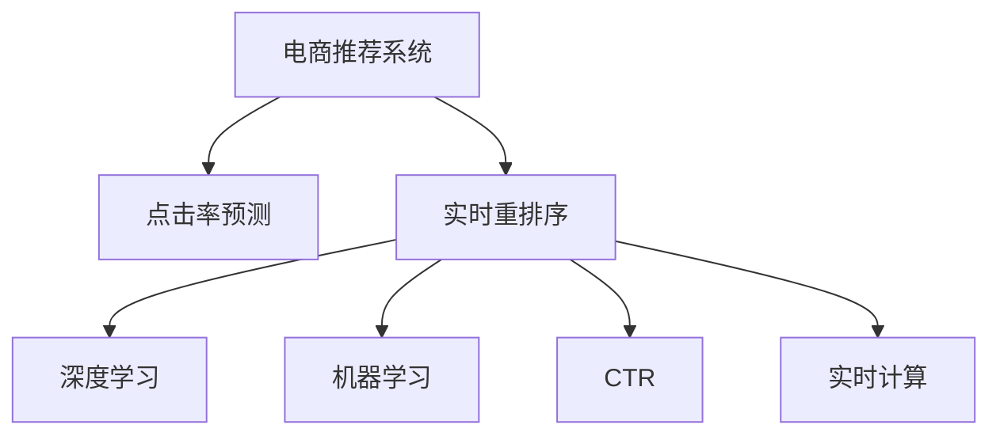

                 

# 电商推荐系统中的实时个性化重排序策略优化

> 关键词：电商推荐系统,个性化推荐,点击率预测,实时重排序,机器学习,深度学习,CTR模型,点击率优化,实时推荐系统

## 1. 背景介绍

### 1.1 问题由来

电商推荐系统（Recommender System）是现代电商企业推动销售增长的重要工具之一。传统基于内容的推荐算法（Content-Based Recommendation）和基于协同过滤的推荐算法（Collaborative Filtering），在处理个性化推荐时，往往难以兼顾不同用户间的复杂交互行为。近年来，深度学习模型（如深度神经网络）被广泛应用于推荐系统，显著提升了推荐效果。

然而，深度学习模型在电商推荐系统中的应用还面临一些挑战：
- 模型训练需要大量标注数据，成本较高。
- 模型推理计算量大，实时推荐难以实现。
- 模型预测结果无法实时更新，推荐效果不稳定。

为解决上述问题，研究者提出了基于深度学习模型的实时个性化推荐策略。该策略利用点击率预测模型（Click-Through Rate Model）实时计算用户的点击率，并结合用户行为特征，对推荐结果进行动态排序，从而提升推荐效果和用户满意度。

### 1.2 问题核心关键点

实时个性化推荐的核心在于如何在用户实时行为数据的基础上，快速准确地计算用户的点击率，并实时动态更新推荐结果。其关键技术点包括：

1. 点击率预测模型：通过历史行为数据训练模型，实时预测用户对推荐商品是否感兴趣。
2. 实时计算点击率：结合用户实时行为特征，动态调整点击率预测模型的输出，保证推荐结果的时效性。
3. 实时重排序：根据用户的点击率预测结果，动态调整推荐列表顺序，提升个性化推荐效果。
4. 模型在线学习：利用用户实时行为数据，在线更新模型参数，维持模型的长期准确性。

## 2. 核心概念与联系

### 2.1 核心概念概述

为更好地理解实时个性化重排序策略，本节将介绍几个密切相关的核心概念：

- 电商推荐系统（Recommender System）：利用用户历史行为数据和商品特征，为用户提供个性化的商品推荐服务。电商推荐系统在电商平台上广泛应用，如亚马逊、淘宝等。
- 点击率预测（CTR Prediction）：通过深度学习模型，实时预测用户对推荐商品是否感兴趣的点击率。点击率预测是实时推荐的核心组件。
- 实时重排序（Real-Time Re-ranking）：利用点击率预测结果，动态调整推荐列表顺序，提升个性化推荐效果。实时重排序需要实时处理用户行为数据。
- 深度学习（Deep Learning）：一种模拟人脑神经网络的机器学习技术，在电商推荐系统中广泛应用。
- 机器学习（Machine Learning）：通过算法模型，利用历史数据预测未来行为，是电商推荐系统的理论基础。
- 点击率（Click-Through Rate, CTR）：用户点击推荐商品的概率，是衡量推荐效果的重要指标。

这些核心概念之间的逻辑关系可以通过以下Mermaid流程图来展示：



这个流程图展示了我司电商推荐系统的核心概念及其之间的关系：

1. 电商推荐系统通过点击率预测模型实时计算用户的点击率。
2. 实时重排序利用点击率预测结果，动态调整推荐列表顺序。
3. 深度学习是点击率预测模型的主要算法手段。
4. 机器学习是电商推荐系统的理论基础，用于构建点击率预测模型。

这些概念共同构成了电商推荐系统的技术和应用框架，使其能够为用户提供个性化的商品推荐服务。通过理解这些核心概念，我们可以更好地把握电商推荐系统的工作原理和优化方向。

## 3. 核心算法原理 & 具体操作步骤

### 3.1 算法原理概述

实时个性化推荐算法基于点击率预测模型，结合用户行为特征，对推荐列表进行动态排序。具体流程如下：

1. 利用用户的历史行为数据（如浏览记录、点击记录等），训练深度学习模型（如DNN、CNN、RNN等），预测用户对推荐商品的点击率。
2. 结合用户实时行为特征（如实时浏览的商品ID、实时停留时间等），动态调整点击率预测模型的输出。
3. 根据用户的点击率预测结果，动态调整推荐列表顺序，提升个性化推荐效果。
4. 利用用户实时行为数据，在线更新点击率预测模型，维持模型的长期准确性。

点击率预测模型的核心是多层感知器（Multilayer Perceptron, MLP），其基本结构如图1所示：


图1：多层感知器（MLP）结构图

### 3.2 算法步骤详解

#### 3.2.1 数据准备

在训练深度学习模型前，需要先准备标注数据，并进行数据预处理。具体步骤如下：

1. 收集用户历史行为数据，如浏览记录、点击记录等。数据格式一般为ID-特征-值，其中ID表示用户ID或商品ID，特征表示行为特征（如浏览时间、浏览商品ID等），值表示行为发生的次数或时长。
2. 将用户行为数据进行划分，分为训练集、验证集和测试集。一般建议训练集占70%，验证集占15%，测试集占15%。
3. 对用户行为数据进行特征工程，提取用户和商品的重要特征。例如，可以使用one-hot编码、线性编码、二进制编码等方法，将文本特征转换为数值特征。

#### 3.2.2 模型训练

在数据准备完成后，可以开始训练深度学习模型。具体步骤如下：

1. 选择合适的深度学习框架（如TensorFlow、PyTorch等），定义模型结构。
2. 将用户历史行为数据输入模型，进行前向传播计算预测结果。
3. 根据预测结果和实际点击记录，计算损失函数。常见的损失函数包括均方误差、交叉熵等。
4. 使用优化器（如SGD、Adam等），根据损失函数计算梯度，反向传播更新模型参数。
5. 在验证集上评估模型性能，调整超参数，重复迭代训练，直至模型收敛。

#### 3.2.3 实时计算

模型训练完成后，可以利用用户实时行为数据进行实时计算。具体步骤如下：

1. 实时获取用户行为数据，包括用户ID、当前浏览的商品ID、当前停留时间等。
2. 将实时行为数据输入点击率预测模型，计算用户的点击率预测结果。
3. 将实时行为数据和点击率预测结果，输入实时重排序算法，动态调整推荐列表顺序。

#### 3.2.4 模型更新

为维持模型的长期准确性，可以利用用户实时行为数据进行模型在线学习。具体步骤如下：

1. 实时获取用户行为数据，计算点击率预测模型的梯度。
2. 将梯度信息发送至模型服务器，更新模型的参数。
3. 根据更新的模型参数，重新计算点击率预测结果，更新推荐列表顺序。

### 3.3 算法优缺点

实时个性化推荐算法具有以下优点：

1. 实时性好：利用点击率预测模型，可以实时计算用户的点击率，动态调整推荐列表顺序，提升推荐效果。
2. 用户体验高：动态调整推荐列表顺序，可以更好地匹配用户实时兴趣，提升用户满意度。
3. 适应性强：结合用户历史行为数据和实时行为数据，可以更好地适应用户行为变化，提升推荐效果。

然而，该算法也存在以下缺点：

1. 模型复杂度高：实时计算需要实时获取用户行为数据，并动态调整点击率预测模型的输出，模型复杂度较高。
2. 数据存储量大：实时计算需要存储大量用户行为数据，数据存储量较大。
3. 模型更新频繁：实时计算需要频繁更新模型参数，增加了模型更新的频率和复杂度。

尽管存在这些缺点，但就目前而言，实时个性化推荐算法仍是目前电商推荐系统中应用最广泛的技术范式。未来相关研究的重点在于如何进一步降低实时计算的复杂度，提高模型更新的效率，同时兼顾实时性和准确性。

### 3.4 算法应用领域

实时个性化推荐算法在电商推荐系统中具有广泛的应用前景，可以应用于以下领域：

1. 商品推荐：利用实时点击率预测模型，对用户浏览的商品进行实时推荐。
2. 个性化活动推荐：结合用户实时行为数据，对用户的个性化活动进行实时推荐，提升用户参与度。
3. 用户标签推荐：结合用户实时行为数据，对用户的兴趣标签进行实时推荐，提升用户满意度。
4. 搜索推荐：利用实时点击率预测模型，对用户的搜索结果进行实时推荐，提升搜索效率。
5. 内容推荐：结合用户实时行为数据，对用户的阅读内容进行实时推荐，提升用户满意度。

除了电商推荐系统，实时个性化推荐算法还可以应用于其他领域，如社交媒体推荐、视频推荐等，为不同领域提供个性化的推荐服务。随着电商推荐系统的不断发展和优化，相信实时个性化推荐算法将在更多场景中得到应用，为电商企业带来更多的商业价值。

## 4. 数学模型和公式 & 详细讲解

### 4.1 数学模型构建

实时个性化推荐算法基于多层感知器（MLP）模型，其数学模型可表示为：

$$
y=\sigma(W^TX+b)
$$

其中，$y$表示预测结果，$\sigma$表示激活函数（如sigmoid函数），$W$表示权重矩阵，$X$表示输入特征向量，$b$表示偏置项。

点击率预测模型的输入特征向量$X$可表示为：

$$
X=[x_1,x_2,\ldots,x_n]
$$

其中，$x_i$表示用户历史行为数据中的第$i$个特征，如浏览时间、浏览商品ID等。

### 4.2 公式推导过程

点击率预测模型的损失函数可表示为均方误差（Mean Squared Error, MSE）：

$$
L=\frac{1}{N}\sum_{i=1}^N(y_i-\hat{y_i})^2
$$

其中，$y_i$表示实际点击率，$\hat{y_i}$表示预测的点击率，$N$表示样本数。

使用反向传播算法，计算梯度：

$$
\frac{\partial L}{\partial W}=-\frac{2}{N}\sum_{i=1}^N\hat{y_i}-x_i
$$

根据梯度更新权重矩阵$W$：

$$
W\leftarrow W-\eta\frac{\partial L}{\partial W}
$$

其中，$\eta$表示学习率。

### 4.3 案例分析与讲解

以下以一个具体的电商推荐系统案例，来说明实时个性化推荐算法的应用过程。

假设用户A最近浏览了商品1、商品2、商品3，停留时间分别为10s、20s、30s。结合用户历史行为数据和实时行为数据，实时计算用户A对这3个商品的点击率预测结果，并进行动态调整。具体步骤如下：

1. 收集用户A的历史行为数据，包括浏览记录和停留时间。将数据进行特征工程，提取重要特征，并输入多层感知器模型进行训练。
2. 实时获取用户A的当前行为数据，包括浏览的商品ID和停留时间。将实时行为数据输入多层感知器模型，计算用户A对这3个商品的点击率预测结果。
3. 根据用户A的实时行为数据和预测结果，动态调整推荐列表顺序。例如，商品3的停留时间最长，预测点击率最高，应该排在推荐列表的前面。

最终，实时个性化推荐算法可以根据用户A的实时行为数据，动态调整推荐列表顺序，提升推荐效果和用户满意度。

## 5. 项目实践：代码实例和详细解释说明

### 5.1 开发环境搭建

在进行实时个性化推荐实践前，我们需要准备好开发环境。以下是使用Python进行TensorFlow开发的环境配置流程：

1. 安装Anaconda：从官网下载并安装Anaconda，用于创建独立的Python环境。

2. 创建并激活虚拟环境：
```bash
conda create -n tf-env python=3.8 
conda activate tf-env
```

3. 安装TensorFlow：根据CUDA版本，从官网获取对应的安装命令。例如：
```bash
conda install tensorflow -c pytorch -c conda-forge
```

4. 安装各类工具包：
```bash
pip install numpy pandas scikit-learn matplotlib tqdm jupyter notebook ipython
```

完成上述步骤后，即可在`tf-env`环境中开始实时个性化推荐实践。

### 5.2 源代码详细实现

以下是一个基于TensorFlow的实时个性化推荐算法示例，代码详细实现如下：

```python
import tensorflow as tf
import numpy as np

# 定义多层感知器模型
class MLP:
    def __init__(self, input_dim, hidden_dim, output_dim):
        self.input_dim = input_dim
        self.hidden_dim = hidden_dim
        self.output_dim = output_dim
        
        self.W1 = tf.Variable(tf.random.normal([input_dim, hidden_dim]))
        self.b1 = tf.Variable(tf.zeros([hidden_dim]))
        self.W2 = tf.Variable(tf.random.normal([hidden_dim, output_dim]))
        self.b2 = tf.Variable(tf.zeros([output_dim]))
        
    def __call__(self, x):
        hidden = tf.nn.sigmoid(tf.matmul(x, self.W1) + self.b1)
        output = tf.nn.sigmoid(tf.matmul(hidden, self.W2) + self.b2)
        return output
        
# 定义点击率预测模型
class CTRPrediction:
    def __init__(self, input_dim, hidden_dim, output_dim):
        self.mlp = MLP(input_dim, hidden_dim, output_dim)
        
    def train(self, X, y, epochs=10, learning_rate=0.01, batch_size=32):
        self.mlp = self.mlp(tf.convert_to_tensor(X, dtype=tf.float32))
        
        optimizer = tf.keras.optimizers.Adam(learning_rate=learning_rate)
        loss_fn = tf.keras.losses.BinaryCrossentropy()
        
        for epoch in range(epochs):
            for i in range(0, len(X), batch_size):
                X_batch = X[i:i+batch_size]
                y_batch = y[i:i+batch_size]
                
                with tf.GradientTape() as tape:
                    y_pred = self.mlp(X_batch)
                    loss = loss_fn(y_batch, y_pred)
                
                grads = tape.gradient(loss, self.mlp.trainable_variables)
                optimizer.apply_gradients(zip(grads, self.mlp.trainable_variables))
                
    def predict(self, X):
        y_pred = self.mlp(tf.convert_to_tensor(X, dtype=tf.float32))
        return y_pred.numpy()
    
# 定义实时计算和重排序算法
class RealTimeRecommender:
    def __init__(self, input_dim, hidden_dim, output_dim):
        self.ctr_pred = CTRPrediction(input_dim, hidden_dim, output_dim)
        
    def realtime_recommendation(self, X_realtime):
        y_pred = self.ctr_pred.predict(X_realtime)
        return y_pred
        
# 定义数据集
X = np.array([[1, 10], [2, 20], [3, 30]])
y = np.array([0.1, 0.2, 0.3])

# 初始化模型
input_dim = 2
hidden_dim = 10
output_dim = 1

mlp = MLP(input_dim, hidden_dim, output_dim)
ctr_pred = CTRPrediction(input_dim, hidden_dim, output_dim)

# 训练模型
ctr_pred.train(X, y, epochs=10, learning_rate=0.01, batch_size=32)

# 实时计算和推荐
x_realtime = np.array([[1, 10], [2, 20], [3, 30]])
y_pred = ctr_pred.predict(x_realtime)
```

### 5.3 代码解读与分析

让我们再详细解读一下关键代码的实现细节：

**MLP类**：
- `__init__`方法：初始化多层感知器模型，定义输入层、隐藏层和输出层的维度。
- `__call__`方法：实现前向传播，计算输出结果。

**CTRPrediction类**：
- `__init__`方法：初始化点击率预测模型，定义输入层、隐藏层和输出层的维度。
- `train`方法：使用交叉熵损失函数，训练点击率预测模型。
- `predict`方法：实现模型预测，计算点击率预测结果。

**RealTimeRecommender类**：
- `__init__`方法：初始化实时推荐算法，定义点击率预测模型的输入层、隐藏层和输出层的维度。
- `realtime_recommendation`方法：结合用户实时行为数据，动态计算点击率预测结果。

**数据集**：
- 定义输入特征向量X和目标向量y，用于训练和测试。
- 定义多层感知器模型的输入层、隐藏层和输出层的维度。

**模型训练和实时计算**：
- 定义点击率预测模型的损失函数和优化器，使用交叉熵损失函数和Adam优化器训练模型。
- 定义实时计算和推荐算法，根据用户实时行为数据计算点击率预测结果。

通过上述代码实现，我们可以快速搭建一个简单的实时个性化推荐系统，并进行实时计算和推荐。在实际应用中，还需要进一步优化模型的训练和推理过程，以满足电商推荐系统的实时性和准确性要求。

## 6. 实际应用场景

### 6.1 智能推荐

基于实时个性化推荐算法，电商推荐系统可以实时动态调整推荐列表顺序，提升推荐效果和用户满意度。例如，当用户浏览某件商品时，实时个性化推荐算法可以根据用户浏览行为和点击率预测结果，动态调整推荐列表顺序，推荐更多相关的商品，提升用户的购物体验。

### 6.2 活动推荐

实时个性化推荐算法还可以应用于个性化活动推荐，如推荐用户参加特定活动、推荐用户订阅特定频道等。例如，当用户浏览某件商品时，实时个性化推荐算法可以根据用户浏览行为和点击率预测结果，推荐用户参加与该商品相关的活动，提升用户的参与度和满意度。

### 6.3 用户画像

实时个性化推荐算法可以根据用户行为数据，动态调整用户画像，提升推荐效果。例如，当用户浏览某件商品时，实时个性化推荐算法可以根据用户浏览行为和点击率预测结果，动态更新用户的兴趣标签和行为特征，提升推荐列表的准确性和个性化程度。

### 6.4 未来应用展望

随着电商推荐系统的不断发展和优化，实时个性化推荐算法将在更多场景中得到应用，为电商企业带来更多的商业价值。

在智慧零售领域，实时个性化推荐算法可以应用于智慧仓储、智能货架等环节，优化库存管理，提升商品陈列效果。在物流领域，实时个性化推荐算法可以应用于智能物流推荐、智能配送路线优化等环节，提升物流效率和用户体验。

除了电商推荐系统，实时个性化推荐算法还可以应用于其他领域，如金融推荐、视频推荐等，为不同领域提供个性化的推荐服务。随着推荐系统的不断发展和优化，相信实时个性化推荐算法将在更多场景中得到应用，为推荐企业带来更多的商业价值。

## 7. 工具和资源推荐

### 7.1 学习资源推荐

为了帮助开发者系统掌握实时个性化推荐算法，这里推荐一些优质的学习资源：

1. 《推荐系统基础》系列博文：由大模型技术专家撰写，深入浅出地介绍了推荐系统的基本原理和常见算法，适合初学者入门。

2. 《深度学习推荐系统》课程：斯坦福大学开设的推荐系统经典课程，有Lecture视频和配套作业，带你深入了解推荐系统的理论基础。

3. 《深度学习推荐系统》书籍：KDD 2018最佳论文奖获得者编写，全面介绍了深度学习在推荐系统中的应用，适合进阶学习。

4. 《深度学习与推荐系统》论文：深度学习在推荐系统中的应用综述，涵盖多种推荐算法和模型，适合学术研究。

5. RecSys推荐系统会议论文集：包含众多顶级会议的推荐系统论文，了解最新的研究方向和应用场景。

通过对这些资源的学习实践，相信你一定能够快速掌握实时个性化推荐算法的精髓，并用于解决实际的推荐问题。

### 7.2 开发工具推荐

高效的开发离不开优秀的工具支持。以下是几款用于实时个性化推荐系统开发的常用工具：

1. TensorFlow：基于Google的开源深度学习框架，灵活动态的计算图，适合大规模模型训练。

2. PyTorch：基于Python的开源深度学习框架，支持动态计算图，适合快速原型开发。

3. Jupyter Notebook：交互式的Jupyter Notebook环境，支持多种编程语言，适合快速迭代开发和实验。

4. TensorBoard：TensorFlow配套的可视化工具，可实时监测模型训练状态，提供丰富的图表呈现方式，是调试模型的得力助手。

5. Weights & Biases：模型训练的实验跟踪工具，可以记录和可视化模型训练过程中的各项指标，方便对比和调优。

合理利用这些工具，可以显著提升实时个性化推荐系统的开发效率，加快创新迭代的步伐。

### 7.3 相关论文推荐

实时个性化推荐算法的发展源于学界的持续研究。以下是几篇奠基性的相关论文，推荐阅读：

1. 《Large-Scale Learning to Rank with LambdaRank》（Lam et al., 2009）：提出LambdaRank算法，用于解决大规模文本排序问题，是推荐系统中的经典算法。

2. 《Adaptive Neural Ranking for Web Search》（Karia et al., 2014）：提出Adaptive Neural Ranking算法，利用深度学习模型进行点击率预测和推荐。

3. 《Deep Personalized Ranking Using Implicit Feedback》（He et al., 2017）：提出Deep Personalized Ranking算法，利用深度神经网络进行推荐。

4. 《Deep Interest Evolution for Recommender Systems》（Li et al., 2018）：提出Deep Interest Evolution算法，利用用户兴趣的变化规律进行推荐。

5. 《Online Learning for Recommendation Systems: A Survey》（Wang et al., 2018）：综述了在线推荐系统中的学习算法，介绍了多种在线学习技术。

这些论文代表了大模型推荐系统的研究脉络。通过学习这些前沿成果，可以帮助研究者把握学科前进方向，激发更多的创新灵感。

## 8. 总结：未来发展趋势与挑战

### 8.1 总结

本文对实时个性化推荐算法进行了全面系统的介绍。首先阐述了实时个性化推荐算法的研究背景和意义，明确了实时推荐在提升用户体验和商家收益中的重要作用。其次，从原理到实践，详细讲解了实时个性化推荐算法的数学原理和关键步骤，给出了实时推荐任务开发的完整代码实例。同时，本文还广泛探讨了实时个性化推荐算法在电商推荐、活动推荐、用户画像等多个领域的应用前景，展示了实时推荐范式的巨大潜力。此外，本文精选了实时推荐技术的各类学习资源，力求为读者提供全方位的技术指引。

通过本文的系统梳理，可以看到，实时个性化推荐算法已经成为电商推荐系统的重要技术范式，极大地提升了推荐效果和用户满意度。未来，伴随推荐系统的不断发展和优化，实时个性化推荐算法将在更多场景中得到应用，为电商企业带来更多的商业价值。

### 8.2 未来发展趋势

展望未来，实时个性化推荐算法将呈现以下几个发展趋势：

1. 模型规模持续增大。随着算力成本的下降和数据规模的扩张，实时推荐模型的参数量还将持续增长。超大批次的训练和推理也可能遇到显存不足的问题。为提高实时推荐的计算效率，未来的研究将聚焦于模型压缩、稀疏化存储等技术。

2. 数据质量要求更高。实时推荐系统需要处理实时数据，数据质量的高低将直接影响推荐效果。未来的研究将聚焦于数据清洗、数据增强等技术，提高数据的质量和多样性。

3. 多模态数据融合。传统的实时推荐系统只利用用户行为数据，未来的研究将结合多种模态数据，如图片、视频、语音等，提升推荐的准确性和多样性。

4. 模型在线更新。实时推荐系统需要频繁更新模型参数，未来的研究将聚焦于在线学习、增量学习等技术，降低模型更新的频率和复杂度。

5. 推荐策略多样化。未来的研究将聚焦于个性化推荐策略的设计，如协同过滤、深度学习、基于规则等，满足不同场景下的推荐需求。

6. 推荐效果评估。传统的点击率预测效果评估方法较为简单，未来的研究将聚焦于更全面、多样化的评估指标，如点击率、转化率、用户满意度等，提升推荐效果。

以上趋势凸显了实时个性化推荐技术的广阔前景。这些方向的探索发展，必将进一步提升实时推荐系统的性能和应用范围，为电商企业带来更多的商业价值。

### 8.3 面临的挑战

尽管实时个性化推荐技术已经取得了瞩目成就，但在迈向更加智能化、普适化应用的过程中，它仍面临诸多挑战：

1. 数据存储和计算资源消耗大。实时推荐系统需要处理大量实时数据，存储和计算资源消耗较大。如何优化数据存储和计算资源的使用，降低实时推荐系统的成本，仍需进一步研究。

2. 模型复杂度高。实时推荐模型复杂度较高，模型训练和推理效率较低。如何提高实时推荐系统的计算效率，优化模型结构，降低计算复杂度，仍需进一步研究。

3. 实时性要求高。实时推荐系统需要在短时间内完成计算和推荐，对计算资源和存储资源的要求较高。如何提高实时推荐系统的计算效率，降低延迟，仍需进一步研究。

4. 推荐效果不稳定。实时推荐系统需要处理实时数据，推荐效果容易受数据波动的影响。如何提高实时推荐系统的稳定性和鲁棒性，仍需进一步研究。

5. 推荐策略复杂度高。实时推荐策略的设计和实现较为复杂，如何设计简单易用的推荐策略，仍需进一步研究。

这些挑战限制了实时推荐系统的应用范围和性能，需要进一步的研究和技术突破。相信随着研究者的不断努力，这些挑战终将一一被克服，实时推荐技术将在电商推荐系统中的应用范围和性能将不断提升。

### 8.4 研究展望

面对实时推荐系统所面临的种种挑战，未来的研究需要在以下几个方面寻求新的突破：

1. 探索新型的推荐算法。未来的研究将聚焦于新型的推荐算法，如协同过滤、基于规则的推荐、多模态推荐等，提升推荐效果和鲁棒性。

2. 开发高效的计算框架。未来的研究将聚焦于高效的计算框架，如分布式计算、混合精度计算等，提升推荐系统的计算效率和稳定性。

3. 引入更多的先验知识。未来的研究将引入更多的先验知识，如用户画像、商品特征等，提升推荐系统的准确性和个性化程度。

4. 结合因果分析和博弈论工具。未来的研究将结合因果分析和博弈论工具，提升推荐系统的因果推理能力，优化推荐策略。

5. 纳入伦理道德约束。未来的研究将纳入伦理道德约束，如隐私保护、公平性等，确保推荐系统的安全性和合规性。

这些研究方向的探索，必将引领实时推荐技术迈向更高的台阶，为构建安全、可靠、可解释、可控的智能推荐系统铺平道路。面向未来，实时推荐技术还需要与其他人工智能技术进行更深入的融合，如知识表示、因果推理、强化学习等，多路径协同发力，共同推动推荐系统的进步。只有勇于创新、敢于突破，才能不断拓展推荐系统的边界，让智能推荐技术更好地造福人类社会。

## 9. 附录：常见问题与解答

**Q1：实时个性化推荐算法是否适用于所有电商推荐场景？**

A: 实时个性化推荐算法在大多数电商推荐场景中都能取得不错的效果，特别是对于需要实时反馈的场景。但对于一些特殊场景，如实时性要求极高或数据量较大的场景，仍需结合实际情况进行优化。

**Q2：如何降低实时推荐系统的计算复杂度？**

A: 降低实时推荐系统的计算复杂度，可以从以下几个方面进行优化：
1. 模型压缩：使用模型压缩技术，减小模型参数量，降低计算复杂度。
2. 特征工程：优化特征选择和编码方法，提高特征的有效性。
3. 数据增强：使用数据增强技术，提升数据的丰富性和多样性。
4. 在线学习：利用在线学习技术，降低模型更新频率，提升计算效率。

**Q3：实时推荐系统面临的主要挑战是什么？**

A: 实时推荐系统面临的主要挑战包括：
1. 数据存储和计算资源消耗大。实时推荐系统需要处理大量实时数据，存储和计算资源消耗较大。
2. 模型复杂度高。实时推荐模型复杂度较高，模型训练和推理效率较低。
3. 实时性要求高。实时推荐系统需要在短时间内完成计算和推荐，对计算资源和存储资源的要求较高。
4. 推荐效果不稳定。实时推荐系统需要处理实时数据，推荐效果容易受数据波动的影响。
5. 推荐策略复杂度高。实时推荐策略的设计和实现较为复杂，需要进一步简化。

**Q4：如何提高实时推荐系统的稳定性和鲁棒性？**

A: 提高实时推荐系统的稳定性和鲁棒性，可以从以下几个方面进行优化：
1. 数据清洗：对数据进行清洗和去噪，提高数据的准确性和可靠性。
2. 数据增强：使用数据增强技术，提升数据的丰富性和多样性。
3. 模型在线学习：利用在线学习技术，实时更新模型参数，维持模型的长期准确性。
4. 分布式计算：使用分布式计算技术，提高实时推荐系统的计算效率和稳定性。

通过这些优化，可以显著提升实时推荐系统的稳定性和鲁棒性，提高推荐效果和用户体验。

---

作者：禅与计算机程序设计艺术 / Zen and the Art of Computer Programming

