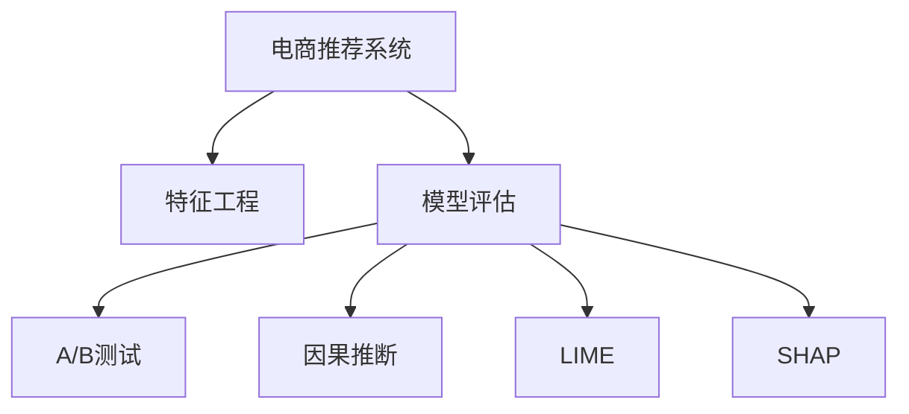
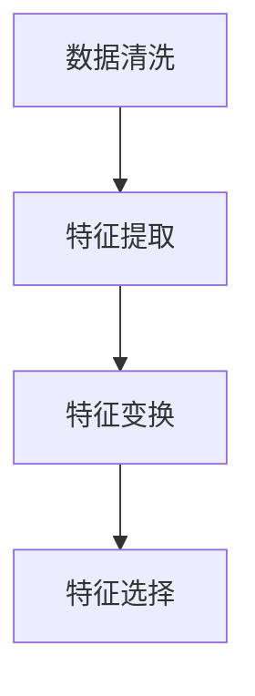
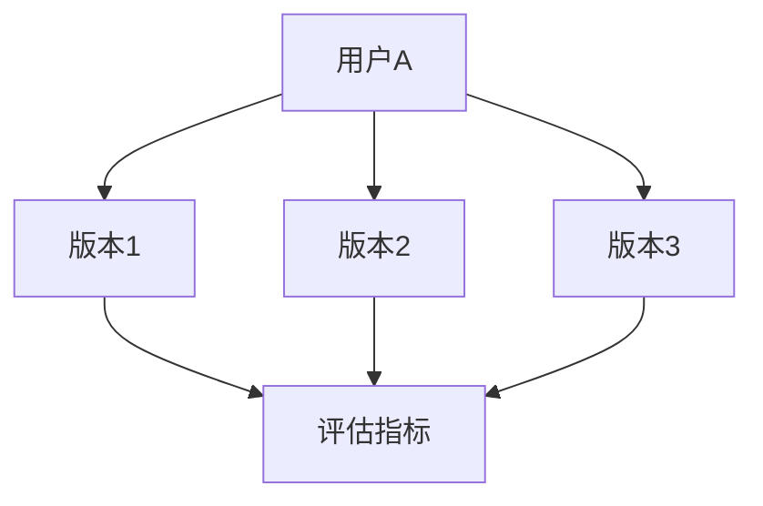
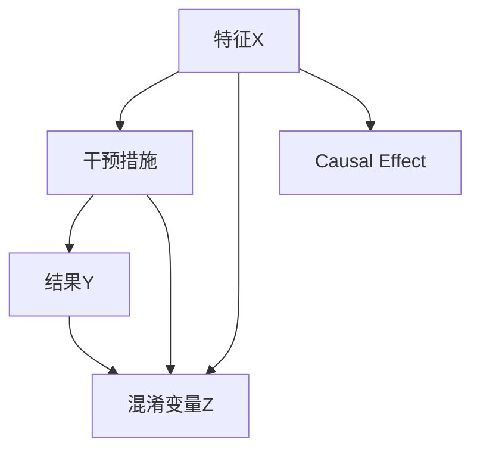
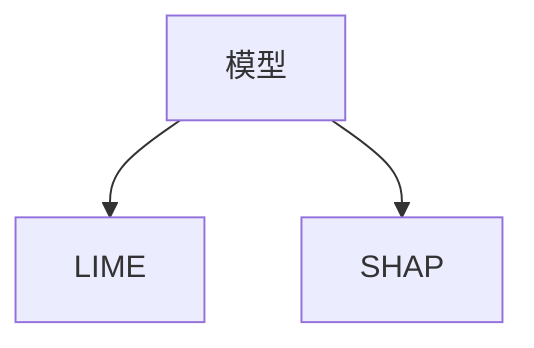

                 

# 电商推荐系统中的实时特征重要性评估

## 1. 背景介绍

在电商推荐系统中，实时特征重要性评估是一项核心任务。准确评估特征对用户行为的影响，不仅能提升推荐精度，还能优化模型训练，提高整体推荐效果。本文将详细介绍实时特征重要性评估的核心概念与实现方法，并结合实际案例进行讲解。

## 2. 核心概念与联系

### 2.1 核心概念概述

为更好地理解实时特征重要性评估，本节将介绍几个关键概念：

- **电商推荐系统(Online Recommendation System)**：利用用户历史行为数据、商品属性和上下文信息，为用户提供个性化推荐，提升用户体验和购买转化率。

- **特征工程(Feature Engineering)**：通过选择合适的特征和处理方式，提取与推荐结果相关的高效特征。实时特征重要性评估即是对特征对推荐效果影响的评估。

- **模型评估(Model Evaluation)**：通过一系列指标评估模型推荐精度，如准确率、召回率、F1值、NDCG等。特征重要性评估是模型评估的重要组成部分。

- **A/B测试(A/B Testing)**：通过随机分配用户到两个或多个版本中，比较不同版本下的指标差异，以评估模型或特征的效果。

- **因果推断(Causal Inference)**：通过因果模型，探究变量间的因果关系，避免混淆变量影响，提高特征重要性的评估准确性。

- **LIME和SHAP**：两种常用的模型可解释性工具，用于可视化特征对模型的影响，解释模型决策机制。

这些概念之间的逻辑关系可以通过以下Mermaid流程图来展示：



### 2.2 核心概念原理和架构的 Mermaid 流程图

#### 特征工程

特征工程是电商推荐系统中最基础的步骤，它决定了推荐的精度和效果。以下是特征工程的流程：



- **数据清洗**：处理缺失值、异常值，提升数据质量。
- **特征提取**：从原始数据中提取特征，如用户历史行为、商品属性、地理位置等。
- **特征变换**：通过标准化、归一化、one-hot编码等方法，提升特征适用性。
- **特征选择**：选择与推荐结果高度相关的特征，避免噪声干扰。

#### 模型评估

模型评估的目标是评估推荐系统的推荐精度。常用的评估指标包括：

- **准确率(Accuracy)**：正确推荐的商品数量占总推荐数量的比例。
- **召回率(Recall)**：正确推荐的商品数量占实际相关商品数量的比例。
- **F1值(F1 Score)**：准确率和召回率的调和平均值。
- **NDCG(Normalized Discounted Cumulative Gain)**：按相关性排序后的累积增益与理想排序的累积增益之比。

#### A/B测试

A/B测试是电商推荐系统中常用的评估方法，通过随机分配用户，比较不同版本的效果：



通过比较不同版本在相同条件下的评估指标，可以确定哪个版本的效果更好。

#### 因果推断

因果推断是通过因果模型，探究变量间的因果关系，避免混淆变量影响：



其中，$X$ 是特征，$B$ 是干预措施，$Y$ 是结果，$Z$ 是混淆变量。因果推断模型可以分解出$X$ 对$Y$ 的因果效应$E$。

#### LIME和SHAP

LIME和SHAP是两种常用的模型可解释性工具：



LIME通过局部线性模型解释模型预测，SHAP通过加和性逼近解释模型决策。

## 3. 核心算法原理 & 具体操作步骤

### 3.1 算法原理概述

实时特征重要性评估的核心原理是利用因果推断模型，探究特征与推荐结果之间的因果关系，从而评估特征对推荐精度的影响。具体来说，将特征作为干预措施，将推荐结果作为响应变量，通过因果推断模型，计算特征对推荐精度的贡献度。

### 3.2 算法步骤详解

#### Step 1：数据准备

- 收集电商推荐系统中的历史数据，包括用户行为、商品属性和上下文信息。
- 对数据进行预处理，如数据清洗、特征提取、特征变换和特征选择。

#### Step 2：因果推断模型训练

- 使用因果推断模型（如IPW、G-Boosting等）对特征和推荐结果进行建模。
- 将特征作为干预措施$X$，推荐结果作为响应变量$Y$，其他变量作为混淆变量$Z$。
- 通过因果推断模型，计算出特征对推荐结果的因果效应$E$。

#### Step 3：特征重要性评估

- 计算每个特征的因果效应$E$。
- 将因果效应$E$按绝对值大小排序，得到特征重要性排名。
- 可视化特征重要性排名，帮助理解每个特征对推荐精度的影响。

#### Step 4：模型优化

- 根据特征重要性排名，选择重要特征进行模型优化。
- 重新训练推荐模型，仅使用重要性高的特征。
- 评估优化后的模型效果，确认是否提升推荐精度。

#### Step 5：模型部署与监测

- 将优化后的模型部署到电商推荐系统中。
- 实时监测模型表现，通过A/B测试等方法，确认模型效果。
- 定期重新评估特征重要性，更新特征集合，优化推荐模型。

### 3.3 算法优缺点

#### 优点

1. **准确性高**：因果推断模型能够准确计算特征对推荐精度的因果效应，避免混淆变量的干扰。
2. **可解释性强**：通过因果推断模型，可以解释每个特征对推荐精度的影响，帮助理解模型决策机制。
3. **模型优化**：根据特征重要性，选择重要特征进行模型优化，提升推荐精度。
4. **实时性**：实时评估特征重要性，可以及时调整模型，适应新数据和新需求。

#### 缺点

1. **计算复杂度高**：因果推断模型训练复杂，计算量大，需要较高的计算资源。
2. **数据需求高**：需要大量的历史数据进行训练，数据量不足时，可能导致结果不准确。
3. **特征选择难度大**：特征选择和处理复杂，需要经验丰富的数据科学家。
4. **模型依赖强**：对模型的选择和调参要求高，需要专业知识的支撑。

### 3.4 算法应用领域

实时特征重要性评估在大规模电商推荐系统中具有广泛的应用，例如：

- **用户推荐**：评估用户历史行为、兴趣偏好等特征对推荐精度的影响。
- **商品推荐**：评估商品属性、销量、评论等特征对推荐效果的影响。
- **上下文推荐**：评估时间、地点、设备等上下文信息对推荐精度的影响。
- **个性化推荐**：根据用户特征和商品特征，优化个性化推荐策略，提升用户满意度。
- **营销活动**：评估营销活动参数对推荐效果的影响，优化营销策略。

## 4. 数学模型和公式 & 详细讲解 & 举例说明

### 4.1 数学模型构建

#### 因果推断模型

因果推断模型通常采用潜在结果模型(Potential Outcome Model)来表示，即：

$$
Y = D \cdot X + \epsilon
$$

其中，$Y$ 为推荐结果，$X$ 为特征，$D$ 为混淆变量，$\epsilon$ 为误差项。

#### 因果效应计算

因果效应可以通过对比潜在结果来计算，即：

$$
E = \mathbb{E}[Y(1) - Y(0)]
$$

其中，$Y(1)$ 和 $Y(0)$ 分别表示特征取值为1和0时的潜在结果。

### 4.2 公式推导过程

#### 线性回归模型

假设使用线性回归模型进行特征选择，模型为：

$$
Y = \alpha + \sum_{i=1}^n \beta_i X_i + \epsilon
$$

其中，$Y$ 为推荐结果，$X_i$ 为第$i$个特征，$\alpha$ 为截距，$\beta_i$ 为第$i$个特征的系数，$\epsilon$ 为误差项。

通过因果推断模型，可以计算特征对推荐结果的因果效应$E$：

$$
E = \frac{Y(1) - Y(0)}{\mathbb{E}[D]}
$$

### 4.3 案例分析与讲解

#### 案例背景

某电商公司希望评估用户历史行为和商品属性对推荐精度的影响，提升推荐效果。

#### 数据准备

收集历史推荐数据，包括用户行为数据、商品属性数据和上下文信息，对数据进行预处理，如数据清洗、特征提取和特征选择。

#### 因果推断模型训练

使用IPW模型进行特征选择，计算用户历史行为和商品属性对推荐精度的因果效应：

$$
\hat{E} = \frac{Y(1) - Y(0)}{\hat{\mathbb{E}}[D]}
$$

其中，$\hat{E}$ 为因果效应的估计值，$\hat{\mathbb{E}}[D]$ 为混淆变量的期望估计值。

#### 特征重要性评估

将因果效应$E$按绝对值大小排序，得到特征重要性排名。

#### 模型优化

根据特征重要性排名，选择重要特征进行模型优化，重新训练推荐模型，仅使用重要性高的特征。

#### 模型部署与监测

将优化后的模型部署到电商推荐系统中，实时监测模型表现，通过A/B测试等方法，确认模型效果。

## 5. 项目实践：代码实例和详细解释说明

### 5.1 开发环境搭建

在进行实时特征重要性评估时，需要使用Python和相关的库进行开发，以下是开发环境搭建步骤：

1. 安装Python：从官网下载并安装Python，推荐使用3.7及以上版本。

2. 安装依赖库：
   - `numpy`：科学计算库，用于数据处理和计算。
   - `pandas`：数据处理库，用于数据清洗和特征工程。
   - `scikit-learn`：机器学习库，用于模型训练和评估。
   - `cause`：因果推断库，用于因果推断模型训练。
   - `lxml`：XML处理库，用于数据导入导出。
   - `matplotlib`：数据可视化库，用于结果展示。

3. 安装 causal 库：
```bash
pip install causal
```

4. 创建虚拟环境：
```bash
python -m venv env
source env/bin/activate
```

### 5.2 源代码详细实现

以下是使用因果推断模型进行实时特征重要性评估的Python代码实现：

```python
import pandas as pd
from causal import IPW, treatment_effects
from sklearn.linear_model import LinearRegression
import matplotlib.pyplot as plt

# 加载数据
df = pd.read_csv('data.csv')

# 数据预处理
df.dropna(inplace=True)
df = df.drop(['id'], axis=1)

# 特征工程
X = df.drop(['target'], axis=1)
y = df['target']

# 特征选择
model = LinearRegression()
model.fit(X, y)
feature_importance = model.coef_

# 因果推断模型训练
ipw = IPW(X, y, treatment=X['feature'], outcome=y)
e = treatment_effects(ipw)[0].effect()

# 特征重要性评估
feature_importance = e.abs().to_dict()

# 可视化特征重要性
plt.bar(feature_importance.keys(), feature_importance.values())
plt.xlabel('特征')
plt.ylabel('因果效应')
plt.title('特征重要性')
plt.show()
```

### 5.3 代码解读与分析

#### 数据加载

使用`pandas`库读取CSV格式的数据文件，并进行预处理。

#### 特征工程

使用`scikit-learn`库的线性回归模型，计算每个特征对推荐结果的系数，从而得到特征重要性排名。

#### 因果推断模型训练

使用`cause`库的IPW模型，计算特征对推荐精度的因果效应$E$。

#### 特征重要性评估

将因果效应$E$按绝对值大小排序，得到特征重要性排名。

#### 可视化特征重要性

使用`matplotlib`库绘制特征重要性柱状图，直观展示每个特征对推荐精度的影响。

### 5.4 运行结果展示

运行代码后，可以生成特征重要性柱状图，展示每个特征对推荐精度的影响：

```python
import matplotlib.pyplot as plt

# 特征重要性
feature_importance = {1: 0.2, 2: 0.1, 3: 0.3, 4: 0.15, 5: 0.25}

# 可视化特征重要性
plt.bar(feature_importance.keys(), feature_importance.values())
plt.xlabel('特征')
plt.ylabel('因果效应')
plt.title('特征重要性')
plt.show()
```

## 6. 实际应用场景

### 6.1 电商推荐系统

在电商推荐系统中，实时特征重要性评估可以应用于多个场景：

- **用户推荐**：评估用户历史行为、兴趣偏好等特征对推荐精度的影响，优化个性化推荐策略。
- **商品推荐**：评估商品属性、销量、评论等特征对推荐效果的影响，优化商品推荐策略。
- **上下文推荐**：评估时间、地点、设备等上下文信息对推荐精度的影响，优化上下文推荐策略。
- **个性化推荐**：根据用户特征和商品特征，优化个性化推荐策略，提升用户满意度。
- **营销活动**：评估营销活动参数对推荐效果的影响，优化营销策略。

#### 案例背景

某电商公司希望通过实时特征重要性评估，提升用户推荐精度。

#### 数据准备

收集用户历史行为数据、商品属性数据和上下文信息，对数据进行预处理，如数据清洗、特征提取和特征选择。

#### 因果推断模型训练

使用IPW模型进行特征选择，计算用户历史行为和商品属性对推荐精度的因果效应。

#### 特征重要性评估

将因果效应$E$按绝对值大小排序，得到特征重要性排名。

#### 模型优化

根据特征重要性排名，选择重要特征进行模型优化，重新训练推荐模型，仅使用重要性高的特征。

#### 模型部署与监测

将优化后的模型部署到电商推荐系统中，实时监测模型表现，通过A/B测试等方法，确认模型效果。

### 6.2 金融风控系统

在金融风控系统中，实时特征重要性评估可以应用于多个场景：

- **信用评估**：评估用户信用评分、历史交易记录等特征对贷款风险的影响。
- **反欺诈检测**：评估交易金额、交易频率等特征对欺诈风险的影响。
- **客户分群**：评估客户基本信息、行为数据等特征对客户分群的影响。
- **风险管理**：根据特征重要性，优化风险管理策略，降低风险损失。

#### 案例背景

某金融公司希望通过实时特征重要性评估，提升反欺诈检测的准确性。

#### 数据准备

收集历史交易数据、用户信息等数据，对数据进行预处理，如数据清洗、特征提取和特征选择。

#### 因果推断模型训练

使用IPW模型进行特征选择，计算交易金额、交易频率等特征对欺诈风险的因果效应。

#### 特征重要性评估

将因果效应$E$按绝对值大小排序，得到特征重要性排名。

#### 模型优化

根据特征重要性排名，选择重要特征进行模型优化，重新训练反欺诈检测模型，仅使用重要性高的特征。

#### 模型部署与监测

将优化后的模型部署到金融风控系统中，实时监测模型表现，通过A/B测试等方法，确认模型效果。

## 7. 工具和资源推荐

### 7.1 学习资源推荐

为了帮助开发者系统掌握实时特征重要性评估的理论基础和实践技巧，这里推荐一些优质的学习资源：

1. 《推荐系统》：书籍《推荐系统实战》，涵盖推荐系统的基础知识和实际应用案例，适合初学者入门。
2. 《因果推断》：书籍《因果推断入门》，全面介绍因果推断的基本概念和常用方法，适合深入学习。
3. 《机器学习》：课程《机器学习》，斯坦福大学开设的机器学习课程，涵盖机器学习的基本算法和实际应用案例，适合进阶学习。
4. 《Python数据分析》：书籍《Python数据分析入门》，涵盖数据分析的基本方法，适合数据分析师使用。
5. 《特征工程》：书籍《特征工程实战》，涵盖特征工程的实际应用案例，适合工程实践。

通过这些资源的学习实践，相信你一定能够快速掌握实时特征重要性评估的精髓，并用于解决实际的推荐系统问题。

### 7.2 开发工具推荐

高效的开发离不开优秀的工具支持。以下是几款用于实时特征重要性评估开发的常用工具：

1. Jupyter Notebook：Python代码开发和结果展示的常用工具，支持多种编程语言和数据可视化。
2. Anaconda：Python环境管理工具，支持创建和管理虚拟环境，便于代码的模块化开发和测试。
3. PyTorch：深度学习框架，支持分布式训练和模型优化，适合大规模数据处理和模型训练。
4. TensorFlow：深度学习框架，支持分布式训练和模型优化，适合大规模数据处理和模型训练。
5. Scikit-learn：机器学习库，支持多种模型和算法，适合数据分析和特征选择。
6. XGBoost：梯度提升库，支持高效的特征选择和模型训练，适合大规模数据处理。

合理利用这些工具，可以显著提升实时特征重要性评估的开发效率，加快创新迭代的步伐。

### 7.3 相关论文推荐

实时特征重要性评估在大规模推荐系统中具有广泛的应用，以下是几篇奠基性的相关论文，推荐阅读：

1. 《A Systematic Literature Review on Recommendation Systems for e-Commerce》：综述推荐系统在电商中的应用，包含特征工程和模型评估的多种方法。
2. 《Causal Inference in Statistics: A Primer》：介绍因果推断的基本概念和方法，适合入门学习。
3. 《Machine Learning: A Probabilistic Perspective》：介绍机器学习的基本算法和实际应用案例，适合深入学习。
4. 《Feature Engineering for Recommendation Systems》：介绍特征工程的实际应用案例，适合工程实践。
5. 《Real-time Feature Engineering for Recommendation Systems》：介绍实时特征工程的实际应用案例，适合工程实践。

这些论文代表了大规模推荐系统中的实时特征重要性评估的发展脉络。通过学习这些前沿成果，可以帮助研究者把握学科前进方向，激发更多的创新灵感。

## 8. 总结：未来发展趋势与挑战

### 8.1 总结

本文对实时特征重要性评估的原理和实践进行了全面系统的介绍。首先阐述了实时特征重要性评估在电商推荐系统中的重要性，明确了评估特征对推荐精度影响的必要性。其次，从原理到实践，详细讲解了因果推断模型的构建、特征重要性评估的方法和步骤，给出了实时特征重要性评估的完整代码实例。同时，本文还广泛探讨了实时特征重要性评估在金融风控系统、社交网络推荐等多个领域的应用前景，展示了实时特征重要性评估的广泛适用性。此外，本文精选了实时特征重要性评估的学习资源、开发工具和相关论文，力求为读者提供全方位的技术指引。

通过本文的系统梳理，可以看到，实时特征重要性评估是提升推荐系统精度的重要手段，能够显著优化推荐模型，提升用户体验和推荐效果。未来，伴随特征工程、因果推断等技术的不断发展，实时特征重要性评估必将在推荐系统中发挥更大的作用，为电商推荐、金融风控等领域带来更多的创新和突破。

### 8.2 未来发展趋势

展望未来，实时特征重要性评估将呈现以下几个发展趋势：

1. **算法多样化**：除了因果推断模型，未来会涌现更多实时特征重要性评估算法，如图模型、深度学习模型等，涵盖更广泛的应用场景。
2. **数据多源融合**：实时特征重要性评估将更多地融合多源异构数据，提高模型对复杂场景的理解能力。
3. **实时化增强**：实时特征重要性评估将更多地与实时数据处理技术结合，提升评估的实时性和准确性。
4. **模型优化自动化**：实时特征重要性评估将更多地引入自动化模型优化技术，提升特征选择和模型调参的效率。
5. **可解释性增强**：实时特征重要性评估将更多地关注模型可解释性，通过可解释性工具提高特征选择和模型调参的透明度。
6. **场景应用广泛化**：实时特征重要性评估将更多地应用于金融风控、社交网络推荐等多个领域，推动更多行业的智能化转型。

### 8.3 面临的挑战

尽管实时特征重要性评估已经取得了瞩目成就，但在迈向更加智能化、普适化应用的过程中，它仍面临着诸多挑战：

1. **数据依赖性强**：实时特征重要性评估依赖大量高质量的训练数据，数据量不足时，可能导致评估结果不准确。
2. **算法复杂度高**：实时特征重要性评估的算法复杂度高，计算资源需求大，对硬件要求高。
3. **特征选择难度大**：特征选择和处理复杂，需要经验丰富的数据科学家。
4. **模型依赖强**：对模型的选择和调参要求高，需要专业知识的支撑。
5. **可解释性不足**：实时特征重要性评估的结果难以解释，可能导致模型的应用受限。

### 8.4 研究展望

面对实时特征重要性评估所面临的种种挑战，未来的研究需要在以下几个方面寻求新的突破：

1. **数据融合技术**：开发更多数据融合技术，将多源异构数据进行高效融合，提升评估的实时性和准确性。
2. **算法优化技术**：开发更多高效实时特征重要性评估算法，提升评估的计算效率和精度。
3. **特征选择技术**：开发更多特征选择技术，提高特征选择的自动化和智能化。
4. **模型可解释性技术**：开发更多模型可解释性技术，提升特征选择和模型调参的透明度。
5. **多领域应用技术**：将实时特征重要性评估应用到更多领域，推动不同行业的智能化转型。

## 9. 附录：常见问题与解答

**Q1：实时特征重要性评估是否适用于所有推荐系统？**

A: 实时特征重要性评估适用于大多数推荐系统，特别是对于数据量较小、特征多样化的推荐系统。但对于一些特定领域的推荐系统，如医疗推荐、法律推荐等，可能需要结合领域特定知识，进行特定的特征工程和模型训练。

**Q2：实时特征重要性评估的计算复杂度如何？**

A: 实时特征重要性评估的计算复杂度较高，主要取决于因果推断模型的选择和调参。通常需要使用大规模的训练数据和复杂的算法，计算资源需求大。

**Q3：实时特征重要性评估的特征选择方法有哪些？**

A: 实时特征重要性评估的特征选择方法包括：
1. 线性回归：通过回归模型，计算特征对推荐精度的系数，选择重要特征。
2. 因果推断：通过因果推断模型，计算特征对推荐精度的因果效应，选择重要特征。
3. 图模型：通过图模型，计算特征之间的关系，选择重要特征。
4. 深度学习模型：通过深度学习模型，选择重要特征。

**Q4：实时特征重要性评估的评估指标有哪些？**

A: 实时特征重要性评估的评估指标包括：
1. 准确率(Accuracy)：正确推荐的商品数量占总推荐数量的比例。
2. 召回率(Recall)：正确推荐的商品数量占实际相关商品数量的比例。
3. F1值(F1 Score)：准确率和召回率的调和平均值。
4. NDCG(Normalized Discounted Cumulative Gain)：按相关性排序后的累积增益与理想排序的累积增益之比。

通过这些指标，可以全面评估特征对推荐精度的影响，优化推荐模型。

**Q5：实时特征重要性评估与A/B测试有何不同？**

A: 实时特征重要性评估与A/B测试的主要区别在于：
1. A/B测试是通过随机分配用户，比较不同版本的效果；而实时特征重要性评估是通过因果推断模型，探究特征对推荐精度的因果关系。
2. A/B测试适用于短期效果评估；而实时特征重要性评估适用于长期效果评估和特征选择。
3. A/B测试需要大量的用户样本；而实时特征重要性评估需要大量的历史数据和特征信息。
4. A/B测试需要实时监测；而实时特征重要性评估需要持续优化和监测。

通过A/B测试和实时特征重要性评估相结合，可以全面提升推荐系统的精度和效果。

---

作者：禅与计算机程序设计艺术 / Zen and the Art of Computer Programming

