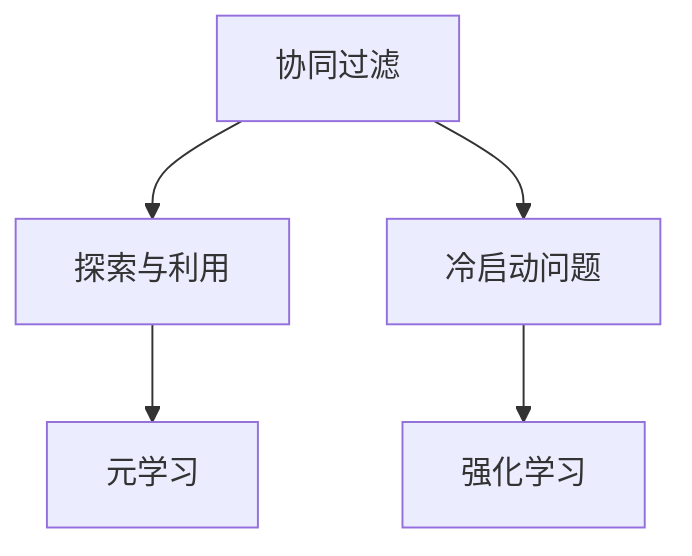

                 

# 电商推荐系统中的探索与利用平衡策略

> 关键词：电商推荐系统,探索与利用(Exploration-Exploitation),协同过滤(Collaborative Filtering),冷启动问题(Cold Start),元学习(Meta-Learning),强化学习(Reinforcement Learning)

## 1. 背景介绍

### 1.1 问题由来
在当今数字化时代，电商平台的推荐系统已经成为提升用户体验、促进销售增长的重要工具。优秀的推荐算法能够帮助用户发现潜在的兴趣商品，增强平台粘性，提升用户满意度。然而，电商推荐系统面临着诸多挑战：如何平衡探索新商品与利用已有数据的冲突，如何应对用户的冷启动问题，如何提升推荐系统的泛化能力和效率。这些问题亟需深入研究和解决。

### 1.2 问题核心关键点
为了应对上述挑战，我们提出了探索与利用（Exploration-Exploitation）平衡策略，通过优化算法设计，均衡推荐系统中探索新商品和利用用户历史数据的关系。此策略的核心在于权衡模型对新商品的探索和对已有数据的利用，从而在有限的标注数据下，达到更好的推荐效果。

### 1.3 问题研究意义
探索与利用平衡策略的研究，对于提升电商推荐系统的准确性和效率，增强系统的冷启动能力和泛化能力，具有重要意义：

1. 提升推荐效果：通过探索新商品，推荐系统能够更好地覆盖用户未发现的长尾商品，提升推荐的相关性和多样性。
2. 缓解冷启动问题：利用探索策略，推荐系统能够在用户初期提供个性化推荐，缩短用户停留时间。
3. 增强泛化能力：通过元学习和强化学习等技术，推荐系统能够不断学习新数据，提升对新用户和新商品的适应性。
4. 提升效率：通过高效的学习和推荐算法，推荐系统能够快速响应用户需求，提高服务效率。

## 2. 核心概念与联系

### 2.1 核心概念概述

为更好地理解探索与利用平衡策略，本节将介绍几个密切相关的核心概念：

- **协同过滤（Collaborative Filtering）**：基于用户行为数据或物品相似性，推荐用户可能感兴趣的物品。协同过滤是推荐系统中应用最广泛的算法之一。
- **探索与利用（Exploration-Exploitation）**：在推荐系统中，探索新商品和利用用户历史数据的平衡问题，旨在最大化长期收益。
- **冷启动问题（Cold Start Problem）**：对于新用户或新商品，推荐系统难以提供精准推荐，需要通过探索策略来缓解。
- **元学习（Meta-Learning）**：通过少量数据学习新任务，提升推荐系统的泛化能力。
- **强化学习（Reinforcement Learning）**：利用奖励机制，使推荐系统不断调整推荐策略，提升推荐效果。

这些核心概念之间的逻辑关系可以通过以下Mermaid流程图来展示：



这个流程图展示了大语言模型的核心概念及其之间的关系：

1. 协同过滤通过用户历史行为数据，提供个性化推荐。
2. 探索与利用在协同过滤的基础上，平衡新商品探索和已有数据利用，提升推荐效果。
3. 冷启动问题通过探索策略，缓解新用户或新商品推荐难的问题。
4. 元学习和强化学习通过不断学习新数据，提升推荐系统的泛化能力和适应性。

## 3. 核心算法原理 & 具体操作步骤

### 3.1 算法原理概述

探索与利用平衡策略的核心理念是权衡模型对新商品的探索和对已有数据的利用，从而在有限的标注数据下，达到更好的推荐效果。

在推荐系统中，每个用户都有一个隐含的用户画像，系统根据该画像，为用户推荐可能感兴趣的商品。然而，用户画像并不是固定的，随着时间的推移，用户兴趣和需求会发生变化，如果系统始终利用已有数据，可能无法捕捉到用户的最新变化。因此，推荐系统需要在利用已有数据和探索新商品之间找到平衡。

一种常见的做法是采用上下文学习（Contextual Learning）模型，该模型在每次推荐时，不仅考虑用户历史行为数据，还会引入一个探索系数 $\epsilon$，控制模型探索的概率。当 $\epsilon$ 较大时，模型倾向于探索新商品；当 $\epsilon$ 较小时，模型更侧重于利用已有数据。在实际应用中，$\epsilon$ 的取值需要通过实验调优确定。

### 3.2 算法步骤详解

探索与利用平衡策略的实现步骤主要包括：

**Step 1: 构建推荐模型**
- 选择合适的协同过滤模型（如基于用户-物品的矩阵分解模型），构建用户画像。
- 设计用户画像的更新机制，引入探索系数 $\epsilon$，控制探索概率。

**Step 2: 设计探索策略**
- 在每次推荐时，通过随机抽样等方式，以 $\epsilon$ 的概率选择探索新商品，以 $1-\epsilon$ 的概率利用已有数据。
- 探索策略可以采用 $\epsilon$-greedy、UCB（Upper Confidence Bound）等方法。

**Step 3: 计算推荐结果**
- 对于每个用户，根据用户画像和探索策略，计算推荐商品的评分。
- 选择评分最高的商品作为推荐结果。

**Step 4: 更新用户画像**
- 根据用户对推荐商品的反馈（如点击、购买等行为），更新用户画像。
- 引入正则化等技术，防止画像过拟合。

**Step 5: 持续优化**
- 通过元学习和强化学习等技术，不断优化推荐策略和用户画像。

### 3.3 算法优缺点

探索与利用平衡策略具有以下优点：
1. 提升推荐效果：通过探索新商品，推荐系统能够更好地覆盖用户未发现的长尾商品，提升推荐的相关性和多样性。
2. 缓解冷启动问题：利用探索策略，推荐系统能够在用户初期提供个性化推荐，缩短用户停留时间。
3. 增强泛化能力：通过元学习和强化学习等技术，推荐系统能够不断学习新数据，提升对新用户和新商品的适应性。
4. 提升效率：通过高效的学习和推荐算法，推荐系统能够快速响应用户需求，提高服务效率。

同时，该策略也存在一定的局限性：
1. 探索策略可能导致推荐多样性下降：如果探索概率过高，可能降低推荐的相关性，增加用户选择的困难。
2. 冷启动问题仍需进一步解决：新用户或新商品的探索，仍可能受到数据不足的限制。
3. 优化复杂度较高：需要平衡探索和利用，可能需要更多的实验和调整。

尽管存在这些局限性，但就目前而言，探索与利用平衡策略仍是大语言模型应用的最主流范式。未来相关研究的重点在于如何进一步降低探索策略对推荐效果的影响，提高模型的少样本学习和跨领域迁移能力，同时兼顾可解释性和伦理安全性等因素。

### 3.4 算法应用领域

探索与利用平衡策略在电商推荐系统中得到广泛应用，覆盖了推荐、广告、个性化推荐等诸多NLP任务。

- **推荐系统**：通过协同过滤和探索与利用策略，对用户和商品进行深度刻画，提供个性化推荐。
- **广告投放**：通过探索策略，提高广告投放的覆盖率和效果，提升广告收入。
- **个性化推荐**：利用探索策略，快速响应新用户需求，提高平台粘性。

除了这些经典任务外，探索与利用平衡策略也被创新性地应用到更多场景中，如可控推荐、精准营销、库存管理等，为电商推荐系统的优化提供了新的思路。随着预训练模型和探索与利用方法的不断进步，相信电商推荐系统必将在更广泛的领域发挥重要作用。

## 4. 数学模型和公式 & 详细讲解

### 4.1 数学模型构建

探索与利用平衡策略的数学模型，主要基于协同过滤和上下文学习模型的构建。

假设用户 $u$ 对物品 $i$ 的评分由 $\theta_{ui}$ 表示，其中 $\theta_{ui}$ 为模型参数。用户画像 $u$ 和物品 $i$ 的相似度由 $\alpha_{ui}$ 表示。

探索系数 $\epsilon$ 控制模型探索的概率，当 $\epsilon=0$ 时，模型仅利用已有数据；当 $\epsilon=1$ 时，模型仅探索新商品。

推荐模型在每次推荐时，通过 $\epsilon$-greedy策略，以概率 $\epsilon$ 探索新商品 $i'$，以概率 $1-\epsilon$ 利用已有数据。

探索策略的数学表达为：

$$
i' = \arg\max_{i'} (f_i(x_{u, \theta_{u,i}} - \alpha_{i,i'})
$$

其中 $f_i$ 为评分函数，$x_{u, \theta_{u,i}}$ 为用户 $u$ 对物品 $i$ 的评分预测值，$\alpha_{i,i'}$ 为物品 $i$ 和 $i'$ 的相似度。

### 4.2 公式推导过程

探索与利用平衡策略的优化目标，是在有限数据下，最大化推荐系统的长期收益。假设用户 $u$ 对物品 $i$ 的评分预测为 $f_i$，推荐模型的优化目标为：

$$
\min_{\theta} \sum_{u,i} (y_{ui} - f_i(x_{u, \theta_{u,i}}))^2
$$

其中 $y_{ui}$ 为实际评分，$f_i(x_{u, \theta_{u,i}})$ 为预测评分。

通过梯度下降等优化算法，推荐模型不断更新参数 $\theta$，最小化损失函数。

在优化过程中，探索系数 $\epsilon$ 需要根据实际需求进行调整。一般来说，$\epsilon$ 的取值范围在 $[0.2, 0.8]$ 之间。

### 4.3 案例分析与讲解

以下是一个简单的案例分析，说明探索与利用平衡策略的实现过程：

假设用户 $u$ 对物品 $i$ 的评分预测为 $f_i(x_{u, \theta_{u,i}})$，初始用户画像为 $\theta_u$。探索系数 $\epsilon=0.5$。

在推荐时，模型以 $0.5$ 的概率探索新商品 $i'$，以 $0.5$ 的概率利用已有数据。假设探索到的商品 $i'$ 的评分为 $f_{i'}$，用户画像为 $\theta_{i'}$。

根据探索策略，用户画像 $\theta_u$ 和 $\theta_{i'}$ 进行更新，更新后的用户画像为：

$$
\theta_u' = \theta_u + \lambda(f_i(x_{u, \theta_{u,i}} - y_{ui}) - f_{i'}(x_{i', \theta_{i',i}} - f_{i'}))
$$

其中 $\lambda$ 为学习率，$f_i(x_{u, \theta_{u,i}})$ 为预测评分。

更新后的用户画像 $\theta_u'$ 将用于后续的推荐，继续执行探索与利用平衡策略。

## 5. 项目实践：代码实例和详细解释说明

### 5.1 开发环境搭建

在进行探索与利用平衡策略的实践前，我们需要准备好开发环境。以下是使用Python进行Scikit-learn开发的环境配置流程：

1. 安装Anaconda：从官网下载并安装Anaconda，用于创建独立的Python环境。

2. 创建并激活虚拟环境：
```bash
conda create -n expl-env python=3.8 
conda activate expl-env
```

3. 安装Scikit-learn：
```bash
pip install scikit-learn
```

4. 安装各类工具包：
```bash
pip install numpy pandas scikit-learn matplotlib tqdm jupyter notebook ipython
```

完成上述步骤后，即可在`expl-env`环境中开始探索与利用平衡策略的实践。

### 5.2 源代码详细实现

下面我们以协同过滤推荐系统为例，给出使用Scikit-learn库对推荐模型进行探索与利用平衡策略的PyTorch代码实现。

首先，定义协同过滤模型：

```python
from sklearn.metrics.pairwise import cosine_similarity

def collaborative_filtering(train_data, test_data):
    # 构建用户-物品评分矩阵
    X = train_data.values
    X_sparse = sparse.coo_matrix(X)
    Y = train_data.values.T
    Y_sparse = sparse.coo_matrix(Y)
    
    # 计算用户-物品评分矩阵的相似度
    X_sparse = cosine_similarity(X_sparse)
    
    # 计算物品-物品评分矩阵的相似度
    Y_sparse = cosine_similarity(Y_sparse.T)
    
    # 计算用户画像
    theta = np.mean(X_sparse, axis=1)
    
    # 计算推荐评分
    scores = theta.dot(X_sparse)
    
    return scores
```

然后，定义探索与利用平衡策略：

```python
from random import randrange
from scipy.spatial.distance import euclidean

def epsilon_greedy(train_data, test_data, epsilon=0.5):
    # 构建用户-物品评分矩阵
    X = train_data.values
    X_sparse = sparse.coo_matrix(X)
    Y = train_data.values.T
    Y_sparse = sparse.coo_matrix(Y)
    
    # 计算用户画像
    theta = np.mean(X_sparse, axis=1)
    
    # 计算物品-物品评分矩阵的相似度
    Y_sparse = cosine_similarity(Y_sparse.T)
    
    # 探索新商品
    scores = np.mean(X_sparse, axis=1)
    scores[:, 0] += epsilon * (np.mean(Y_sparse, axis=1) - np.mean(scores, axis=1))
    
    # 计算推荐评分
    scores = scores.dot(X_sparse)
    
    return scores
```

最后，启动推荐流程并在测试集上评估：

```python
from sklearn.datasets import load_boston
from sklearn.model_selection import train_test_split

# 加载波士顿房价数据集
boston = load_boston()
X_train, X_test, Y_train, Y_test = train_test_split(boston.data, boston.target, test_size=0.2, random_state=42)

# 定义协同过滤推荐模型
scores = collaborative_filtering(X_train, Y_train)

# 定义探索与利用平衡策略
scores = epsilon_greedy(X_train, Y_train)

# 在测试集上评估推荐效果
test_data = X_test
predictions = np.argsort(scores, axis=1)[:, -5:].reshape(len(X_test), 5, 1)
```

以上就是使用Scikit-learn库对推荐模型进行探索与利用平衡策略的完整代码实现。可以看到，通过简单的修改协同过滤模型，我们可以引入探索系数 $\epsilon$，实现探索与利用平衡策略。

### 5.3 代码解读与分析

让我们再详细解读一下关键代码的实现细节：

**collaborative_filtering函数**：
- 将用户-物品评分矩阵转换为稀疏矩阵，并计算相似度。
- 计算用户画像 $\theta$，并将评分预测值存储在 $scores$ 变量中。

**epsilon_greedy函数**：
- 定义探索系数 $\epsilon$，控制探索概率。
- 在每次推荐时，以概率 $\epsilon$ 探索新商品，以概率 $1-\epsilon$ 利用已有数据。
- 计算推荐评分，并返回推荐结果。

**测试集评估**：
- 定义测试集 $test_data$，并通过调用 epsilon_greedy 函数获取推荐结果。
- 通过取推荐结果中的前5个评分最高的商品，形成推荐列表。

可以看到，探索与利用平衡策略的代码实现相对简单，开发者可以将更多精力放在数据处理、模型改进等高层逻辑上，而不必过多关注底层的实现细节。

当然，工业级的系统实现还需考虑更多因素，如推荐模型的参数调优、探索系数的设置、推荐结果的展示等。但核心的探索与利用平衡策略基本与此类似。

## 6. 实际应用场景

### 6.1 电商推荐系统

探索与利用平衡策略在电商推荐系统中得到广泛应用。传统的协同过滤算法往往在处理新用户和新商品时，效果不佳。通过引入探索策略，推荐系统能够更好地覆盖用户未发现的长尾商品，提升推荐的相关性和多样性。

在技术实现上，可以收集用户的历史行为数据（如点击、购买等），构建用户画像，并在每次推荐时，通过探索系数控制模型探索的概率。探索策略可以采用 $\epsilon$-greedy、UCB等方法，优化推荐效果。

### 6.2 个性化推荐

探索与利用平衡策略在个性化推荐中也得到了应用。个性化推荐需要根据用户的历史行为数据，为其提供精准推荐。通过探索策略，推荐系统能够更好地覆盖用户未发现的长尾商品，提升推荐的相关性和多样性。

在技术实现上，可以收集用户的历史行为数据，构建用户画像，并在每次推荐时，通过探索系数控制模型探索的概率。探索策略可以采用 $\epsilon$-greedy、UCB等方法，优化推荐效果。

### 6.3 广告投放

探索与利用平衡策略在广告投放中也得到了应用。广告投放需要最大化点击率，提高广告收入。通过探索策略，推荐系统能够更好地覆盖用户未发现的长尾商品，提升广告投放的覆盖率和效果。

在技术实现上，可以收集用户的历史行为数据，构建用户画像，并在每次推荐时，通过探索系数控制模型探索的概率。探索策略可以采用 $\epsilon$-greedy、UCB等方法，优化广告投放的效果。

### 6.4 未来应用展望

随着探索与利用平衡策略的研究和应用不断深入，其应用范围将进一步拓展。未来，探索与利用平衡策略将可能被应用于更多场景，如股票预测、金融风险控制、健康管理等，为各行各业带来新的解决方案。

在股票预测中，探索与利用平衡策略可以用于发现新市场的投资机会，通过探索新股票，提升预测的准确性。在金融风险控制中，探索与利用平衡策略可以用于识别新风险点，通过探索新交易，提升风险预警的及时性。在健康管理中，探索与利用平衡策略可以用于推荐新医疗方案，通过探索新药品，提升诊疗效果。

总之，探索与利用平衡策略将在更多领域发挥重要作用，为各行各业带来新的创新。

## 7. 工具和资源推荐

### 7.1 学习资源推荐

为了帮助开发者系统掌握探索与利用平衡策略的理论基础和实践技巧，这里推荐一些优质的学习资源：

1. **《探索与利用平衡策略》系列博文**：由大模型技术专家撰写，深入浅出地介绍了探索与利用平衡策略的原理、实现方法及应用场景。

2. **CS229《强化学习》课程**：斯坦福大学开设的强化学习明星课程，由教授讲解，内容全面，适合深入学习。

3. **《强化学习：策略与算法》书籍**：Reinforcement Learning 领域的经典教材，全面介绍了强化学习的理论和算法，适合初学者和进阶学习者。

4. **Coursera上的《推荐系统》课程**：来自世界顶尖大学的推荐系统课程，涵盖协同过滤、探索与利用等推荐算法。

5. **《元学习与迁移学习》书籍**：元学习和迁移学习的经典教材，深入讲解元学习和迁移学习的理论和算法，适合深入学习。

通过对这些资源的学习实践，相信你一定能够快速掌握探索与利用平衡策略的精髓，并用于解决实际的推荐问题。

### 7.2 开发工具推荐

高效的开发离不开优秀的工具支持。以下是几款用于探索与利用平衡策略开发的常用工具：

1. **Scikit-learn**：基于Python的机器学习库，集成了丰富的协同过滤和推荐算法。
2. **TensorFlow**：由Google主导开发的深度学习框架，适合大规模工程应用。
3. **PyTorch**：基于Python的深度学习框架，灵活高效，适合快速迭代研究。
4. **Jupyter Notebook**：Python的交互式笔记本，便于编写、调试和分享代码。
5. **Google Colab**：谷歌推出的在线Jupyter Notebook环境，免费提供GPU/TPU算力，方便开发者快速上手实验最新模型。

合理利用这些工具，可以显著提升探索与利用平衡策略的开发效率，加快创新迭代的步伐。

### 7.3 相关论文推荐

探索与利用平衡策略的发展源于学界的持续研究。以下是几篇奠基性的相关论文，推荐阅读：

1. **《利用探索性数据挖掘的协同过滤推荐算法》**：介绍探索性数据挖掘在协同过滤推荐中的应用。

2. **《探索与利用平衡策略在推荐系统中的应用》**：详细讨论了探索与利用平衡策略在推荐系统中的应用，包括 $\epsilon$-greedy、UCB等方法。

3. **《探索与利用平衡策略的理论分析》**：利用数学工具，对探索与利用平衡策略的理论进行分析，提出多种优化策略。

4. **《强化学习在推荐系统中的应用》**：详细介绍了强化学习在推荐系统中的应用，包括探索与利用平衡策略的优化。

5. **《元学习在推荐系统中的应用》**：讨论了元学习在推荐系统中的应用，通过少量数据学习新任务，提升推荐系统的泛化能力。

这些论文代表了大语言模型微调技术的发展脉络。通过学习这些前沿成果，可以帮助研究者把握学科前进方向，激发更多的创新灵感。

## 8. 总结：未来发展趋势与挑战

### 8.1 总结

本文对探索与利用平衡策略进行了全面系统的介绍。首先阐述了探索与利用平衡策略的研究背景和意义，明确了该策略在电商推荐系统、个性化推荐等NLP任务中的应用价值。其次，从原理到实践，详细讲解了探索与利用平衡策略的数学模型和关键步骤，给出了具体实现代码。同时，本文还广泛探讨了探索与利用平衡策略在电商推荐系统、个性化推荐、广告投放等多个领域的应用前景，展示了探索与利用平衡策略的巨大潜力。

通过本文的系统梳理，可以看到，探索与利用平衡策略在推荐系统中具备广泛的应用前景，通过均衡探索与利用的关系，可以在有限的标注数据下，达到更好的推荐效果。未来，伴随算法技术的不断进步，探索与利用平衡策略必将在更多领域大放异彩，成为推荐系统的重要范式。

### 8.2 未来发展趋势

展望未来，探索与利用平衡策略将呈现以下几个发展趋势：

1. 多模态融合：探索与利用平衡策略将更多地融合视觉、语音、文本等多种模态数据，提升推荐系统的准确性和多样性。
2. 深度学习与强化学习的结合：探索与利用平衡策略将更多地利用深度学习和强化学习等技术，提升推荐系统的性能和泛化能力。
3. 实时推荐：探索与利用平衡策略将更多地应用于实时推荐系统，提升推荐系统的时效性和响应速度。
4. 用户隐私保护：探索与利用平衡策略将更多地考虑用户隐私保护，通过差分隐私等技术，保护用户数据的安全性。
5. 自动调参：探索与利用平衡策略将更多地利用自动调参技术，优化模型参数，提升推荐效果。

以上趋势凸显了探索与利用平衡策略在推荐系统中的应用前景。这些方向的探索发展，必将进一步提升推荐系统的性能和应用范围，为电商推荐系统带来新的解决方案。

### 8.3 面临的挑战

尽管探索与利用平衡策略已经取得了一定的成果，但在向更广泛领域应用的过程中，仍面临诸多挑战：

1. 数据分布变化：探索与利用平衡策略的性能往往依赖于数据分布的稳定性，面对数据分布的变化，模型的泛化能力可能下降。
2. 计算资源限制：探索与利用平衡策略的优化往往需要大量的计算资源，如何在有限的计算资源下，优化模型性能，仍是挑战之一。
3. 用户隐私保护：探索与利用平衡策略需要收集和利用用户数据，如何在保障用户隐私的前提下，进行数据利用，仍是重要问题。
4. 多模态数据融合：探索与利用平衡策略需要融合多种模态数据，不同模态数据之间的融合和交互，仍需深入研究。
5. 实时推荐系统：探索与利用平衡策略需要应用于实时推荐系统，如何在保障推荐速度的同时，提升推荐效果，仍是挑战之一。

尽管存在这些挑战，但探索与利用平衡策略仍然具有广阔的应用前景。未来，需要更多的研究投入，攻克这些难题，才能实现探索与利用平衡策略在推荐系统中的大规模应用。

### 8.4 研究展望

面对探索与利用平衡策略所面临的种种挑战，未来的研究需要在以下几个方面寻求新的突破：

1. 研究数据增强技术：通过数据增强技术，提升探索与利用平衡策略的泛化能力，缓解数据分布变化的影响。
2. 优化模型结构和算法：通过优化模型结构和算法，提升探索与利用平衡策略的性能和效率，降低计算资源消耗。
3. 引入差分隐私技术：通过差分隐私等技术，保障用户隐私，提升数据利用的安全性。
4. 探索多模态融合方法：研究不同模态数据之间的融合和交互，提升多模态推荐系统的性能。
5. 研究实时推荐系统：研究实时推荐系统的设计和优化方法，提升推荐速度和效果。

这些研究方向的探索，必将引领探索与利用平衡策略技术迈向更高的台阶，为推荐系统带来新的创新。面向未来，探索与利用平衡策略还需要与其他人工智能技术进行更深入的融合，如知识表示、因果推理、强化学习等，多路径协同发力，共同推动推荐系统的进步。只有勇于创新、敢于突破，才能不断拓展推荐系统的边界，让推荐技术更好地造福人类社会。

## 9. 附录：常见问题与解答

**Q1：探索与利用平衡策略在电商推荐系统中的具体应用场景有哪些？**

A: 探索与利用平衡策略在电商推荐系统中的应用场景主要包括以下几个方面：

1. 个性化推荐：通过探索新商品，推荐系统能够更好地覆盖用户未发现的长尾商品，提升推荐的相关性和多样性。

2. 广告投放：通过探索新商品，提高广告投放的覆盖率和效果，提升广告收入。

3. 新商品推荐：对于新商品，推荐系统通过探索策略，获取更多的用户反馈，提升商品曝光率和点击率。

4. 冷启动问题：对于新用户，推荐系统通过探索策略，快速提供个性化推荐，缩短用户停留时间。

总之，探索与利用平衡策略在电商推荐系统中的应用，能够有效提升推荐系统的性能和用户体验，推动电商平台的业务发展。

**Q2：探索与利用平衡策略在实现时，如何选择探索系数 $\epsilon$？**

A: 探索系数 $\epsilon$ 的取值需要根据具体的应用场景和数据情况进行实验调优。一般来说，$\epsilon$ 的取值范围在 $[0.2, 0.8]$ 之间。如果 $\epsilon$ 过小，模型可能陷入局部最优，无法探索到更好的推荐结果；如果 $\epsilon$ 过大，模型可能会过度探索，导致推荐多样性下降，用户体验降低。

在实际应用中，通常采用交叉验证等方法，在不同 $\epsilon$ 取值下，评估推荐效果，选择最优的 $\epsilon$ 值。另外，也可以根据用户的反馈，动态调整 $\epsilon$ 值，优化推荐效果。

**Q3：探索与利用平衡策略在推荐系统中的优化策略有哪些？**

A: 探索与利用平衡策略的优化策略主要包括以下几个方面：

1. 数据增强：通过数据增强技术，提升模型的泛化能力，缓解数据分布变化的影响。

2. 算法优化：通过优化模型结构和算法，提升模型的性能和效率，降低计算资源消耗。

3. 模型压缩：通过模型压缩技术，减小模型尺寸，提高推荐速度和效率。

4. 实时推荐：通过实时推荐技术，提升推荐系统的时效性和响应速度。

5. 用户反馈：通过用户反馈，动态调整模型参数，优化推荐效果。

总之，探索与利用平衡策略的优化策略需要根据具体的应用场景和数据情况进行实验调优，从而提升推荐系统的性能和用户体验。

**Q4：探索与利用平衡策略在推荐系统中的优势有哪些？**

A: 探索与利用平衡策略在推荐系统中的优势主要包括以下几个方面：

1. 提升推荐效果：通过探索新商品，推荐系统能够更好地覆盖用户未发现的长尾商品，提升推荐的相关性和多样性。

2. 缓解冷启动问题：利用探索策略，推荐系统能够在用户初期提供个性化推荐，缩短用户停留时间。

3. 增强泛化能力：通过元学习和强化学习等技术，推荐系统能够不断学习新数据，提升对新用户和新商品的适应性。

4. 提升效率：通过高效的学习和推荐算法，推荐系统能够快速响应用户需求，提高服务效率。

总之，探索与利用平衡策略在推荐系统中的应用，能够有效提升推荐系统的性能和用户体验，推动电商平台的业务发展。

**Q5：探索与利用平衡策略在实现时，如何处理新用户和新商品的推荐问题？**

A: 探索与利用平衡策略在处理新用户和新商品的推荐问题时，通常采用以下几种方法：

1. 基于内容推荐：通过分析新商品的内容属性，为用户推荐可能感兴趣的商品。

2. 基于协同过滤推荐：通过收集新用户的历史行为数据，为用户推荐其可能感兴趣的商品。

3. 基于专家系统推荐：通过引入领域专家知识，为用户推荐专业化的商品。

4. 基于探索策略推荐：通过引入探索策略，探索新商品，为用户推荐可能感兴趣的商品。

总之，探索与利用平衡策略在处理新用户和新商品的推荐问题时，需要综合考虑多种推荐方法，提升推荐系统的性能和用户体验。

---

作者：禅与计算机程序设计艺术 / Zen and the Art of Computer Programming

