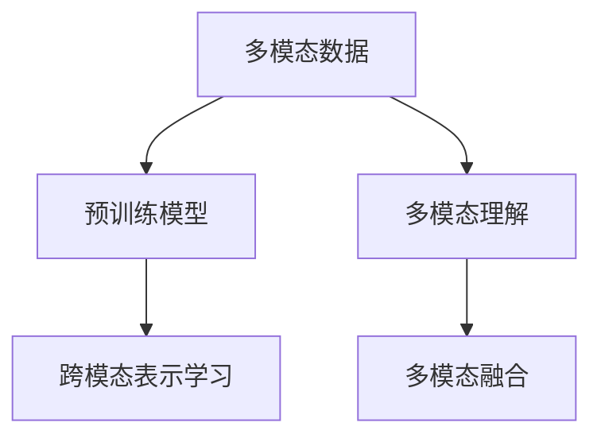

                 

# 电商搜索中的多模态理解：AI大模型方案

## 1. 背景介绍

### 1.1 问题由来

随着电商平台的蓬勃发展，搜索引擎成为用户获取商品信息的主要渠道。然而，传统的文本搜索模型往往难以应对海量的商品描述信息，无法充分展示商品的丰富特性。为了解决这个问题，需要引入多模态技术，充分利用图像、视频、音频等多种模态的信息，提升搜索引擎的感知能力。

近年来，人工智能大模型在多模态理解和生成方面取得了显著进展。通过在大规模无标签数据上进行的预训练，这些大模型能够学习到各种模态之间的协同关系，从而在多模态任务上表现出卓越的性能。将这些技术应用于电商搜索，可以极大地提升用户体验和平台转化率，推动电商产业的数字化转型。

### 1.2 问题核心关键点

大模型在电商搜索中的应用主要集中在以下几个方面：

- 图像理解：通过预训练图像模型，如CLIP、DALL·E等，理解商品图片中的内容，进行分类、标签和属性提取。
- 文本生成：利用预训练语言模型，如GPT、T5等，生成商品描述、用户评论和广告文案。
- 跨模态匹配：结合图像和文本数据，进行相似性度量和推荐。
- 多模态融合：利用多模态数据进行综合理解，提升搜索引擎的语义感知能力。

这些技术可以大幅提升电商搜索的精度和覆盖率，为用户推荐更精准的商品，提升平台的搜索体验和转化效果。

### 1.3 问题研究意义

多模态理解技术在电商搜索中的应用，对于提升用户体验和平台竞争力具有重要意义：

1. 提高搜索准确性：通过理解商品的多模态特性，搜索引擎可以更精准地匹配用户查询，提高搜索结果的相关性。
2. 增强商品展示：将图像、视频、音频等多模态数据融入搜索结果，可以更全面地展示商品信息，吸引用户的注意。
3. 提升用户体验：基于多模态数据的智能推荐，可以让用户获得更加个性化的购物体验，提高用户满意度和平台忠诚度。
4. 优化转化效果：通过精确的商品匹配和推荐，电商平台可以提升用户购买的转化率，增加营收。
5. 技术创新：多模态技术的引入，推动了搜索引擎和推荐系统技术的突破，为电商产业带来了新的创新机遇。

## 2. 核心概念与联系

### 2.1 核心概念概述

为更好地理解多模态搜索技术，本节将介绍几个关键概念：

- 多模态数据：同一物品同时包含图像、视频、音频、文本等多种信息模态。
- 多模态理解：利用深度学习模型处理多模态数据，提取出其中的语义信息，并进行跨模态的协同理解。
- 预训练模型：在大规模无标签数据上预训练的通用深度学习模型，具备强大的多模态感知能力。
- 跨模态表示学习：将不同模态的数据映射到同一低维空间中，以便于相似性度量和跨模态匹配。
- 多模态融合：将不同模态的信息融合在一起，生成更加全面、准确的商品表示。

这些核心概念之间的逻辑关系可以通过以下Mermaid流程图来展示：



这个流程图展示了多模态数据的处理流程：

1. 多模态数据被输入到预训练模型中。
2. 预训练模型通过跨模态表示学习，将不同模态的数据映射到同一低维空间中。
3. 不同模态的信息通过多模态理解得到融合，生成更全面、准确的商品表示。

## 3. 核心算法原理 & 具体操作步骤
### 3.1 算法原理概述

基于大模型的多模态搜索，本质上是一个多模态感知和语义理解的过程。其核心思想是：将预训练的大模型视作强大的"特征提取器"，通过多模态数据的输入和处理，提取其中的语义信息，并进行跨模态的协同理解。

具体来说，假设预训练模型为 $M$，输入的多模态数据为 $X = (x_i, x_j, ..., x_k)$，其中 $x_i$ 为图像，$x_j$ 为视频，$x_k$ 为文本等。模型的输出为一个向量 $Z$，表示多模态数据的语义表示。多模态理解的目标是通过 $Z$ 进行相似性度量，如文本匹配、图像分类、跨模态检索等。

形式化地，假设模型 $M$ 在多模态数据 $X$ 上的语义表示为 $Z = M(X)$。则多模态理解的任务可以表示为：

$$
\min_{Z} \mathcal{L}(X, Z)
$$

其中 $\mathcal{L}$ 为多模态语义表示的损失函数，用于衡量模型的输出 $Z$ 与真实标签 $Y$ 之间的差异。常见的损失函数包括交叉熵损失、均方误差损失等。

通过梯度下降等优化算法，多模态理解过程不断更新模型参数 $\theta$，最小化损失函数 $\mathcal{L}$，使得模型输出逼近真实标签。由于 $\theta$ 已经通过预训练获得了较好的初始化，因此即便在多模态数据集上微调，也能较快收敛到理想的模型参数 $\hat{\theta}$。

### 3.2 算法步骤详解

基于大模型的多模态搜索一般包括以下几个关键步骤：

**Step 1: 准备预训练模型和数据集**
- 选择合适的预训练图像、语言等模型 $M_{\theta}$ 作为初始化参数，如CLIP、DALL·E、GPT等。
- 准备电商搜索任务的多模态数据集，包括商品图片、视频、文本等，划分为训练集、验证集和测试集。一般要求标注数据与预训练数据的分布不要差异过大。

**Step 2: 添加任务适配层**
- 根据任务类型，在预训练模型顶层设计合适的输出层和损失函数。
- 对于图像分类任务，通常在顶层添加线性分类器和交叉熵损失函数。
- 对于文本生成任务，通常使用语言模型的解码器输出概率分布，并以负对数似然为损失函数。

**Step 3: 设置微调超参数**
- 选择合适的优化算法及其参数，如 AdamW、SGD 等，设置学习率、批大小、迭代轮数等。
- 设置正则化技术及强度，包括权重衰减、Dropout、Early Stopping等。
- 确定冻结预训练参数的策略，如仅微调顶层，或全部参数都参与微调。

**Step 4: 执行梯度训练**
- 将训练集数据分批次输入模型，前向传播计算损失函数。
- 反向传播计算参数梯度，根据设定的优化算法和学习率更新模型参数。
- 周期性在验证集上评估模型性能，根据性能指标决定是否触发 Early Stopping。
- 重复上述步骤直到满足预设的迭代轮数或 Early Stopping 条件。

**Step 5: 测试和部署**
- 在测试集上评估多模态理解模型 $M_{\hat{\theta}}$ 的性能，对比微调前后的精度提升。
- 使用多模态理解模型对新商品进行分类、标签和属性提取，集成到实际的应用系统中。
- 持续收集新的多模态数据，定期重新微调模型，以适应数据分布的变化。

以上是基于大模型的多模态搜索的一般流程。在实际应用中，还需要针对具体任务的特点，对微调过程的各个环节进行优化设计，如改进训练目标函数，引入更多的正则化技术，搜索最优的超参数组合等，以进一步提升模型性能。

### 3.3 算法优缺点

基于大模型的多模态搜索方法具有以下优点：

1. 高效融合多模态数据。通过预训练模型，可以高效地融合图像、视频、文本等多种模态的数据，生成更加全面、准确的商品表示。
2. 提升了搜索引擎的语义感知能力。多模态理解使得搜索引擎能够更深入地理解用户查询和商品信息，提高搜索结果的相关性。
3. 通用性强。不同的预训练模型可以应用于多种模态的任务，易于迁移和适配。
4. 性能提升显著。在电商搜索等实际任务上，基于大模型的多模态搜索方法已经刷新了多项性能指标，展示出了强大的潜力。

同时，该方法也存在一定的局限性：

1. 依赖标注数据。多模态理解的效果很大程度上取决于标注数据的质量和数量，获取高质量标注数据的成本较高。
2. 数据分布差异。当目标任务与预训练数据的分布差异较大时，多模态理解的性能提升有限。
3. 模型复杂度。大模型的计算和存储成本较高，需要较大的计算资源和存储空间。
4. 训练时间长。多模态数据的处理和融合增加了训练时间和计算开销。
5. 输出解释性不足。多模态理解模型的决策过程通常缺乏可解释性，难以对其推理逻辑进行分析和调试。

尽管存在这些局限性，但就目前而言，基于大模型的多模态搜索方法仍然是大规模数据驱动的电商搜索应用的重要范式。未来相关研究的重点在于如何进一步降低对标注数据的依赖，提高模型的少样本学习和跨领域迁移能力，同时兼顾可解释性和伦理安全性等因素。

### 3.4 算法应用领域

基于大模型的多模态搜索方法，在电商搜索中已经得到了广泛的应用，覆盖了以下几种常见任务：

- 商品分类和标签提取：将商品图片、视频、文本等多模态数据输入到模型中，生成商品的分类标签和属性信息。
- 图像检索和相似性度量：通过多模态理解模型，将用户查询与商品图片进行相似性度量，推荐最匹配的商品。
- 视频搜索和推荐：利用视频和文本信息，对用户的视频查询进行理解和匹配，推荐相关视频内容。
- 跨模态问答和对话：通过多模态理解模型，对用户的多模态查询进行理解和匹配，提供自然流畅的对话推荐。

除了上述这些经典任务外，多模态理解技术还被创新性地应用到更多场景中，如可控文本生成、常识推理、情感分析等，为电商搜索技术带来了全新的突破。随着预训练模型和理解方法的不断进步，相信电商搜索技术将在更广阔的应用领域大放异彩。

## 4. 数学模型和公式 & 详细讲解  
### 4.1 数学模型构建

本节将使用数学语言对基于大模型的多模态搜索过程进行更加严格的刻画。

记预训练模型为 $M_{\theta}$，输入的多模态数据为 $X = (x_i, x_j, ..., x_k)$。定义模型 $M_{\theta}$ 在多模态数据 $X$ 上的语义表示为 $Z = M_{\theta}(X)$，则多模态理解的目标可以表示为：

$$
\min_{Z} \mathcal{L}(X, Z)
$$

其中 $\mathcal{L}$ 为多模态语义表示的损失函数，用于衡量模型的输出 $Z$ 与真实标签 $Y$ 之间的差异。常见的损失函数包括交叉熵损失、均方误差损失等。

形式化地，假设模型 $M_{\theta}$ 在多模态数据 $X$ 上的输出为 $Z = M_{\theta}(X) \in \mathbb{R}^d$，表示多模态数据的语义表示。定义损失函数 $\ell(X, Z)$ 为：

$$
\ell(X, Z) = \frac{1}{N}\sum_{i=1}^N \ell_i(X_i, Z)
$$

其中 $N$ 为多模态数据的样本数，$\ell_i(X_i, Z)$ 为第 $i$ 个样本的损失函数，通常为交叉熵损失或均方误差损失。

在得到损失函数 $\ell(X, Z)$ 后，可以通过梯度下降等优化算法，最小化损失函数 $\mathcal{L}$，使得模型输出逼近真实标签。

### 4.2 公式推导过程

以下我们以图像分类任务为例，推导交叉熵损失函数及其梯度的计算公式。

假设模型 $M_{\theta}$ 在图像 $x$ 上的输出为 $\hat{y}=M_{\theta}(x) \in [0,1]$，表示该图像属于某一类别的概率。真实标签 $y \in \{0,1\}$。则二分类交叉熵损失函数定义为：

$$
\ell(M_{\theta}(x),y) = -[y\log \hat{y} + (1-y)\log (1-\hat{y})]
$$

将其代入多模态损失函数公式，得：

$$
\mathcal{L}(X, Z) = -\frac{1}{N}\sum_{i=1}^N [y_i\log M_{\theta}(x_i)+(1-y_i)\log(1-M_{\theta}(x_i))]
$$

根据链式法则，损失函数对参数 $\theta_k$ 的梯度为：

$$
\frac{\partial \mathcal{L}(X, Z)}{\partial \theta_k} = -\frac{1}{N}\sum_{i=1}^N (\frac{y_i}{M_{\theta}(x_i)}-\frac{1-y_i}{1-M_{\theta}(x_i)}) \frac{\partial M_{\theta}(x_i)}{\partial \theta_k}
$$

其中 $\frac{\partial M_{\theta}(x_i)}{\partial \theta_k}$ 可进一步递归展开，利用自动微分技术完成计算。

在得到损失函数的梯度后，即可带入参数更新公式，完成模型的迭代优化。重复上述过程直至收敛，最终得到适应多模态任务的最优模型参数 $\theta^*$。

## 5. 项目实践：代码实例和详细解释说明
### 5.1 开发环境搭建

在进行多模态搜索实践前，我们需要准备好开发环境。以下是使用Python进行PyTorch开发的环境配置流程：

1. 安装Anaconda：从官网下载并安装Anaconda，用于创建独立的Python环境。

2. 创建并激活虚拟环境：
```bash
conda create -n pytorch-env python=3.8 
conda activate pytorch-env
```

3. 安装PyTorch：根据CUDA版本，从官网获取对应的安装命令。例如：
```bash
conda install pytorch torchvision torchaudio cudatoolkit=11.1 -c pytorch -c conda-forge
```

4. 安装Transformers库：
```bash
pip install transformers
```

5. 安装各类工具包：
```bash
pip install numpy pandas scikit-learn matplotlib tqdm jupyter notebook ipython
```

完成上述步骤后，即可在`pytorch-env`环境中开始多模态搜索实践。

### 5.2 源代码详细实现

下面我们以商品分类任务为例，给出使用Transformers库对CLIP模型进行多模态搜索的PyTorch代码实现。

首先，定义多模态数据的处理函数：

```python
from transformers import CLIPModel, CLIPTokenizer
from torch.utils.data import Dataset
import torch

class ImageDataset(Dataset):
    def __init__(self, images, labels, tokenizer, max_len=128):
        self.images = images
        self.labels = labels
        self.tokenizer = tokenizer
        self.max_len = max_len
        
    def __len__(self):
        return len(self.images)
    
    def __getitem__(self, item):
        image = self.images[item]
        label = self.labels[item]
        
        encoding = self.tokenizer(image, return_tensors='pt', max_length=self.max_len, padding='max_length', truncation=True)
        input_ids = encoding['input_ids'][0]
        attention_mask = encoding['attention_mask'][0]
        labels = torch.tensor(label, dtype=torch.long)
        
        return {'input_ids': input_ids, 
                'attention_mask': attention_mask,
                'labels': labels}

# 加载预训练的CLIP模型和分词器
model = CLIPModel.from_pretrained('openai/clip-vit-base-patch32')
tokenizer = CLIPTokenizer.from_pretrained('openai/clip-vit-base-patch32')

# 创建数据集
train_dataset = ImageDataset(train_images, train_labels, tokenizer)
dev_dataset = ImageDataset(dev_images, dev_labels, tokenizer)
test_dataset = ImageDataset(test_images, test_labels, tokenizer)
```

然后，定义模型和优化器：

```python
from transformers import AdamW

model = CLIPModel.from_pretrained('openai/clip-vit-base-patch32', pad_token_id=1)
model.to('cuda')
optimizer = AdamW(model.parameters(), lr=2e-5)
```

接着，定义训练和评估函数：

```python
from torch.utils.data import DataLoader
from tqdm import tqdm
from sklearn.metrics import classification_report

device = torch.device('cuda') if torch.cuda.is_available() else torch.device('cpu')
model.to(device)

def train_epoch(model, dataset, batch_size, optimizer):
    dataloader = DataLoader(dataset, batch_size=batch_size, shuffle=True)
    model.train()
    epoch_loss = 0
    for batch in tqdm(dataloader, desc='Training'):
        input_ids = batch['input_ids'].to(device)
        attention_mask = batch['attention_mask'].to(device)
        labels = batch['labels'].to(device)
        model.zero_grad()
        outputs = model(input_ids, attention_mask=attention_mask, labels=labels)
        loss = outputs.loss
        epoch_loss += loss.item()
        loss.backward()
        optimizer.step()
    return epoch_loss / len(dataloader)

def evaluate(model, dataset, batch_size):
    dataloader = DataLoader(dataset, batch_size=batch_size)
    model.eval()
    preds, labels = [], []
    with torch.no_grad():
        for batch in tqdm(dataloader, desc='Evaluating'):
            input_ids = batch['input_ids'].to(device)
            attention_mask = batch['attention_mask'].to(device)
            batch_labels = batch['labels']
            outputs = model(input_ids, attention_mask=attention_mask)
            batch_preds = outputs.logits.argmax(dim=2).to('cpu').tolist()
            batch_labels = batch_labels.to('cpu').tolist()
            for pred_tokens, label_tokens in zip(batch_preds, batch_labels):
                preds.append(pred_tokens[:len(label_tokens)])
                labels.append(label_tokens)
                
    print(classification_report(labels, preds))
```

最后，启动训练流程并在测试集上评估：

```python
epochs = 5
batch_size = 16

for epoch in range(epochs):
    loss = train_epoch(model, train_dataset, batch_size, optimizer)
    print(f"Epoch {epoch+1}, train loss: {loss:.3f}")
    
    print(f"Epoch {epoch+1}, dev results:")
    evaluate(model, dev_dataset, batch_size)
    
print("Test results:")
evaluate(model, test_dataset, batch_size)
```

以上就是使用PyTorch对CLIP模型进行多模态商品分类任务微调的完整代码实现。可以看到，得益于Transformers库的强大封装，我们可以用相对简洁的代码完成CLIP模型的加载和微调。

### 5.3 代码解读与分析

让我们再详细解读一下关键代码的实现细节：

**ImageDataset类**：
- `__init__`方法：初始化图像、标签、分词器等关键组件。
- `__len__`方法：返回数据集的样本数量。
- `__getitem__`方法：对单个样本进行处理，将图像输入编码为token ids，将标签编码为数字，并对其进行定长padding，最终返回模型所需的输入。

**CLIP模型和分词器**：
- 使用CLIP库中的预训练模型和分词器，进行多模态数据的处理和理解。
- 模型在预训练时已经掌握了多模态数据的语义表示能力，通过微调可以进一步提升其在特定任务上的性能。

**训练和评估函数**：
- 使用PyTorch的DataLoader对数据集进行批次化加载，供模型训练和推理使用。
- 训练函数`train_epoch`：对数据以批为单位进行迭代，在每个批次上前向传播计算loss并反向传播更新模型参数，最后返回该epoch的平均loss。
- 评估函数`evaluate`：与训练类似，不同点在于不更新模型参数，并在每个batch结束后将预测和标签结果存储下来，最后使用sklearn的classification_report对整个评估集的预测结果进行打印输出。

**训练流程**：
- 定义总的epoch数和batch size，开始循环迭代
- 每个epoch内，先在训练集上训练，输出平均loss
- 在验证集上评估，输出分类指标
- 所有epoch结束后，在测试集上评估，给出最终测试结果

可以看到，PyTorch配合Transformers库使得CLIP模型的微调代码实现变得简洁高效。开发者可以将更多精力放在数据处理、模型改进等高层逻辑上，而不必过多关注底层的实现细节。

当然，工业级的系统实现还需考虑更多因素，如模型的保存和部署、超参数的自动搜索、更灵活的任务适配层等。但核心的微调范式基本与此类似。

## 6. 实际应用场景
### 6.1 智能推荐系统

基于大模型的多模态理解，可以构建智能推荐系统，为用户推荐更加个性化、精准的商品。通过多模态理解技术，商品图片、视频、文本等数据可以被深度融合，生成更加全面的商品表示，从而提升推荐的精度和覆盖率。

在技术实现上，可以收集用户浏览、点击、评价等行为数据，提取和商品交互的视频、图片、文本等信息。将这些信息输入到预训练模型中，微调生成商品的分类标签和属性信息，再结合用户画像和行为数据，进行综合推荐排序。如此构建的智能推荐系统，可以大幅提升用户购物体验，增加平台转化率。

### 6.2 搜索广告

多模态理解技术还可以应用于电商平台的搜索广告。通过多模态理解模型，平台可以对用户的查询进行语义理解，匹配最相关、最吸引人的广告。广告图片和文案可以与用户的查询进行相似性度量，自动推荐最匹配的广告，提高广告的点击率和转化率。

在实际应用中，可以设计多模态广告模板，包含图片、视频、文本等元素。通过微调多模态理解模型，可以根据用户的查询自动生成匹配的广告，并动态调整广告内容，提高广告的点击率和转化率。

### 6.3 用户情感分析

多模态理解技术还可以用于电商平台的用户情感分析。通过收集用户的文本评价、视频评论等数据，使用多模态理解模型进行情感分类。平台可以根据用户的情感分析结果，提供更加个性化的购物推荐和客服服务，提升用户满意度。

在技术实现上，可以收集用户的评价文本和视频，使用多模态理解模型进行情感分类。根据情感分类结果，平台可以提供相应的购物推荐和客服服务，提高用户粘性和忠诚度。

### 6.4 未来应用展望

随着多模态理解技术的不断发展，其在电商搜索中的应用将变得更加广泛和深入。未来，我们可以期待以下趋势：

1. 多模态数据融合更加全面。将商品图片、视频、文本、声音等多种模态数据进行深度融合，生成更加丰富、准确的商品表示。
2. 智能推荐系统更加个性化。通过多模态理解技术，构建更加智能、精准的推荐系统，提升用户体验和平台转化率。
3. 搜索广告更加精准。通过多模态理解模型，自动匹配用户查询和广告，提升广告的点击率和转化率。
4. 用户情感分析更加深入。通过多模态理解技术，深入理解用户的情感和需求，提供更加个性化的购物推荐和客服服务。
5. 多模态搜索更加智能。通过多模态理解技术，实现自然流畅的搜索和对话，提升用户搜索体验。

以上趋势将推动电商搜索技术的不断进步，带来更加智能、个性化的购物体验，提升电商平台的用户粘性和转化率。相信随着技术的不断演进，多模态理解技术将在电商搜索中发挥更加重要的作用。

## 7. 工具和资源推荐
### 7.1 学习资源推荐

为了帮助开发者系统掌握大模型在电商搜索中的应用，这里推荐一些优质的学习资源：

1. 《Transformer从原理到实践》系列博文：由大模型技术专家撰写，深入浅出地介绍了Transformer原理、CLIP模型、多模态理解等前沿话题。

2. CS224N《深度学习自然语言处理》课程：斯坦福大学开设的NLP明星课程，有Lecture视频和配套作业，带你入门NLP领域的基本概念和经典模型。

3. 《Natural Language Processing with Transformers》书籍：Transformers库的作者所著，全面介绍了如何使用Transformers库进行NLP任务开发，包括多模态理解在内的诸多范式。

4. CLUE开源项目：中文语言理解测评基准，涵盖大量不同类型的中文NLP数据集，并提供了基于多模态理解的baseline模型，助力中文NLP技术发展。

通过对这些资源的学习实践，相信你一定能够快速掌握多模态理解技术在电商搜索中的应用，并用于解决实际的NLP问题。
###  7.2 开发工具推荐

高效的开发离不开优秀的工具支持。以下是几款用于多模态搜索开发的常用工具：

1. PyTorch：基于Python的开源深度学习框架，灵活动态的计算图，适合快速迭代研究。大部分预训练语言模型都有PyTorch版本的实现。

2. TensorFlow：由Google主导开发的开源深度学习框架，生产部署方便，适合大规模工程应用。同样有丰富的预训练语言模型资源。

3. Transformers库：HuggingFace开发的NLP工具库，集成了众多SOTA语言模型，支持PyTorch和TensorFlow，是进行多模态理解任务的开发利器。

4. Weights & Biases：模型训练的实验跟踪工具，可以记录和可视化模型训练过程中的各项指标，方便对比和调优。与主流深度学习框架无缝集成。

5. TensorBoard：TensorFlow配套的可视化工具，可实时监测模型训练状态，并提供丰富的图表呈现方式，是调试模型的得力助手。

6. Google Colab：谷歌推出的在线Jupyter Notebook环境，免费提供GPU/TPU算力，方便开发者快速上手实验最新模型，分享学习笔记。

合理利用这些工具，可以显著提升多模态搜索任务的开发效率，加快创新迭代的步伐。

### 7.3 相关论文推荐

多模态理解技术的发展源于学界的持续研究。以下是几篇奠基性的相关论文，推荐阅读：

1. CLIP: A Simple yet Effective Text-Image Pre-Training Procedure：提出CLIP模型，利用大尺度无标签文本和图像数据进行预训练，实现文本和图像的跨模态理解。

2. DALL·E: A Scalable Vision-Text Pre-Training Approach：提出DALL·E模型，利用大规模文本和图像数据进行预训练，实现文本到图像的生成和理解。

3. Multimodal Graph Neural Network for User Embedding in Multi-view Recommendation Systems：提出基于图神经网络的推荐系统，实现用户画像和商品的多模态理解，提高推荐精度。

4. SOSLNet: A General Framework for Multimodal User Representation in Recommendation Systems：提出SOSLNet框架，实现用户画像和商品的多模态理解，提升推荐效果。

5. Audio-Visual Multimodal Image Question Answering：提出基于音频和视频的多模态问答系统，实现自然流畅的问答交互。

这些论文代表了大模型在多模态理解技术的发展脉络。通过学习这些前沿成果，可以帮助研究者把握学科前进方向，激发更多的创新灵感。

## 8. 总结：未来发展趋势与挑战

### 8.1 总结

本文对基于大模型的多模态理解方法进行了全面系统的介绍。首先阐述了多模态搜索技术的研究背景和意义，明确了多模态理解在提升电商搜索精度和用户体验方面的独特价值。其次，从原理到实践，详细讲解了多模态理解的数学原理和关键步骤，给出了多模态理解任务开发的完整代码实例。同时，本文还广泛探讨了多模态理解方法在智能推荐、搜索广告、用户情感分析等多个电商应用场景中的应用前景，展示了多模态理解技术的巨大潜力。此外，本文精选了多模态理解技术的各类学习资源，力求为读者提供全方位的技术指引。

通过本文的系统梳理，可以看到，基于大模型的多模态理解技术正在成为电商搜索应用的重要范式，极大地提升了电商搜索的精度和用户体验，推动了电商产业的数字化转型。未来，伴随多模态理解技术的不断演进，相信多模态理解技术将在更广阔的应用领域大放异彩，深刻影响电商用户的购物体验。

### 8.2 未来发展趋势

展望未来，多模态理解技术将呈现以下几个发展趋势：

1. 多模态数据更加丰富。随着技术的发展，商品图片、视频、文本等数据将更加全面、多样，多模态理解技术可以进一步提升商品表示的全面性和准确性。
2. 智能推荐系统更加精准。多模态理解技术可以深度融合商品信息，构建更加智能、精准的推荐系统，提升用户体验和平台转化率。
3. 搜索广告更加个性化。通过多模态理解技术，自动匹配用户查询和广告，提升广告的点击率和转化率。
4. 用户情感分析更加深入。多模态理解技术可以深入理解用户的情感和需求，提供更加个性化的购物推荐和客服服务。
5. 多模态搜索更加智能。通过多模态理解技术，实现自然流畅的搜索和对话，提升用户搜索体验。

以上趋势凸显了多模态理解技术的广阔前景。这些方向的探索发展，必将进一步提升电商搜索系统的性能和应用范围，为电商产业带来新的创新机遇。

### 8.3 面临的挑战

尽管多模态理解技术已经取得了显著成果，但在迈向更加智能化、普适化应用的过程中，它仍面临诸多挑战：

1. 数据成本高昂。多模态理解技术需要大量的标注数据和预训练数据，成本较高。如何高效利用现有数据，提高模型性能，是一个重要问题。
2. 计算资源需求大。大模型的计算和存储成本较高，需要较大的计算资源和存储空间。如何在保证性能的同时，优化资源消耗，是一个亟需解决的难题。
3. 模型鲁棒性不足。多模态理解模型面对域外数据时，泛化性能往往大打折扣。如何提高模型的鲁棒性，避免灾难性遗忘，还需要更多理论和实践的积累。
4. 输出解释性不足。多模态理解模型的决策过程通常缺乏可解释性，难以对其推理逻辑进行分析和调试。对于高风险应用，算法的可解释性和可审计性尤为重要。
5. 安全性有待保障。多模态理解模型难免会学习到有偏见、有害的信息，如何过滤和消除模型偏见，避免恶意用途，确保输出的安全性，也是一个重要研究方向。

尽管存在这些挑战，但随着学界和产业界的共同努力，这些问题终将逐步解决。相信未来，多模态理解技术将在大规模电商搜索中发挥重要作用，推动电商产业的智能化、数字化进程。

### 8.4 研究展望

面对多模态理解技术所面临的挑战，未来的研究需要在以下几个方面寻求新的突破：

1. 探索少样本学习和自监督学习技术。摆脱对大规模标注数据的依赖，利用自监督学习、主动学习等无监督范式，最大限度利用非结构化数据，实现更加灵活高效的微调。
2. 研究参数高效和计算高效的微调范式。开发更加参数高效的微调方法，在固定大部分预训练参数的同时，只更新极少量的任务相关参数。同时优化微调模型的计算图，减少前向传播和反向传播的资源消耗，实现更加轻量级、实时性的部署。
3. 融合因果和对比学习范式。通过引入因果推断和对比学习思想，增强多模态理解模型的泛化能力和抗干扰能力。
4. 引入更多先验知识。将符号化的先验知识，如知识图谱、逻辑规则等，与神经网络模型进行巧妙融合，引导多模态理解过程学习更准确、合理的语义表示。
5. 结合因果分析和博弈论工具。将因果分析方法引入多模态理解模型，识别出模型决策的关键特征，增强输出解释的因果性和逻辑性。借助博弈论工具刻画人机交互过程，主动探索并规避模型的脆弱点，提高系统稳定性。
6. 纳入伦理道德约束。在模型训练目标中引入伦理导向的评估指标，过滤和惩罚有偏见、有害的输出倾向。同时加强人工干预和审核，建立模型行为的监管机制，确保输出符合人类价值观和伦理道德。

这些研究方向的探索，必将引领多模态理解技术迈向更高的台阶，为构建安全、可靠、可解释、可控的智能系统铺平道路。面向未来，多模态理解技术还需要与其他人工智能技术进行更深入的融合，如知识表示、因果推理、强化学习等，多路径协同发力，共同推动自然语言理解和智能交互系统的进步。只有勇于创新、敢于突破，才能不断拓展多模态理解技术的边界，让智能技术更好地造福人类社会。

## 9. 附录：常见问题与解答

**Q1：多模态理解是否适用于所有电商搜索任务？**

A: 多模态理解技术在大多数电商搜索任务上都能取得不错的效果，特别是对于数据量较小的任务。但对于一些特定领域的任务，如医学、法律等，仅仅依靠通用语料预训练的模型可能难以很好地适应。此时需要在特定领域语料上进一步预训练，再进行微调，才能获得理想效果。此外，对于一些需要时效性、个性化很强的任务，如对话、推荐等，多模态理解方法也需要针对性的改进优化。

**Q2：多模态理解过程中如何选择合适的学习率？**

A: 多模态理解的学习率一般要比预训练时小1-2个数量级，如果使用过大的学习率，容易破坏预训练权重，导致过拟合。一般建议从1e-5开始调参，逐步减小学习率，直至收敛。也可以使用warmup策略，在开始阶段使用较小的学习率，再逐渐过渡到预设值。需要注意的是，不同的优化器(如AdamW、Adafactor等)以及不同的学习率调度策略，可能需要设置不同的学习率阈值。

**Q3：采用多模态理解技术时会面临哪些资源瓶颈？**

A: 目前主流的预训练大模型动辄以亿计的参数规模，对算力、内存、存储都提出了很高的要求。GPU/TPU等高性能设备是必不可少的，但即便如此，超大批次的训练和推理也可能遇到显存不足的问题。因此需要采用一些资源优化技术，如梯度积累、混合精度训练、模型并行等，来突破硬件瓶颈。同时，模型的存储和读取也可能占用大量时间和空间，需要采用模型压缩、稀疏化存储等方法进行优化。

**Q4：多模态理解在实际部署时需要注意哪些问题？**

A: 将多模态理解模型转化为实际应用，还需要考虑以下因素：
1. 模型裁剪：去除不必要的层和参数，减小模型尺寸，加快推理速度
2. 量化加速：将浮点模型转为定点模型，压缩存储空间，提高计算效率
3. 服务化封装：将模型封装为标准化服务接口，便于集成调用
4. 弹性伸缩：根据请求流量动态调整资源配置，平衡服务质量和成本
5. 监控告警：实时采集系统指标，设置异常告警阈值，确保服务稳定性
6. 安全防护：采用访问鉴权、数据脱敏等措施，保障数据和模型安全

多模态理解技术为电商搜索带来了新的突破，但如何将强大的性能转化为稳定、高效、安全的业务价值，还需要工程实践的不断打磨。唯有从数据、算法、工程、业务等多个维度协同发力，才能真正实现人工智能技术在垂直行业的规模化落地。总之，多模态理解需要开发者根据具体任务，不断迭代和优化模型、数据和算法，方能得到理想的效果。

---

作者：禅与计算机程序设计艺术 / Zen and the Art of Computer Programming

