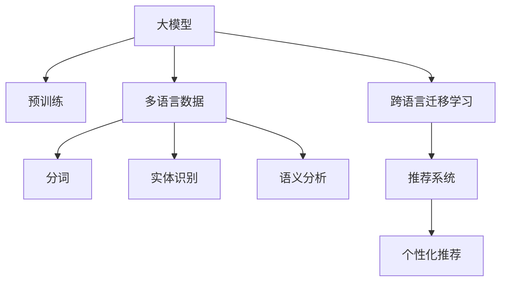

                 

# 电商搜索中的多语言支持：AI大模型方案

> 关键词：电商搜索, 多语言, AI大模型, 自然语言处理(NLP), 深度学习, 文本处理, 推荐系统

## 1. 背景介绍

### 1.1 问题由来

随着全球化进程的不断推进，电商平台的业务已经逐渐扩展到了全球市场。越来越多的商家希望其商品信息能够覆盖多语言市场，以便吸引更多的国际客户。然而，由于不同语言之间在语法、词汇、语义上的巨大差异，传统电商搜索系统在多语言支持方面面临着诸多挑战。

首先，多语言搜索需要对不同语言的输入进行分词、实体识别、语义理解等处理，这要求搜索系统能够对多种语言进行有效支持，并从中提取有价值的信息。其次，不同语言的商品信息量巨大，如何高效处理海量多语言数据，并为用户提供准确、相关的搜索结果，是亟待解决的问题。

为应对这些挑战，AI大模型在电商搜索中的应用逐渐受到重视。利用大模型的强大语言理解能力和跨语言迁移学习能力，可以有效提升多语言搜索的准确性和用户体验。本文将重点介绍基于AI大模型的电商搜索多语言支持方案，从核心概念、算法原理、实现细节、应用案例等方面进行全面阐述。

### 1.2 问题核心关键点

本方案的核心在于利用大模型，通过跨语言迁移学习，在电商搜索中实现对多语言的支持。具体来说，包括以下几个关键点：

- **大模型选择**：选择具备跨语言迁移能力的预训练模型，如BERT、GPT等。
- **多语言数据预处理**：对多语言数据进行分词、实体识别、语义分析等预处理，使大模型能够理解多语言输入。
- **跨语言迁移学习**：利用大模型在源语言上的预训练知识，迁移到目标语言，提升多语言搜索结果的准确性。
- **多语言推荐系统**：结合多语言搜索结果，构建个性化推荐模型，提升用户体验。
- **性能优化**：优化模型推理速度，减少计算资源消耗，提升系统效率。

本文将详细讲解这些关键技术的实现过程，并结合实际案例，展示大模型在电商搜索中的多语言支持效果。

## 2. 核心概念与联系

### 2.1 核心概念概述

为更好地理解本方案，我们首先介绍几个核心概念：

- **大模型(Large Model)**：指在大规模语料上预训练的深度学习模型，如BERT、GPT、XLNet等，具备强大的语言理解和生成能力。
- **多语言(Multilingual)**：指在一个系统或应用中，能够同时支持多种语言的输入和输出。
- **跨语言迁移学习(Transfer Learning)**：指将源语言任务中学习到的知识迁移到目标语言任务中，提升目标语言任务的性能。
- **推荐系统(Recommendation System)**：指通过分析用户行为和商品属性，为用户推荐最相关商品的系统。
- **深度学习(Deep Learning)**：指利用多层神经网络进行复杂数据分析和预测的学习范式。
- **自然语言处理(NLP)**：指对自然语言数据进行处理和分析的技术，包括文本分类、实体识别、情感分析等。

这些概念之间通过以下Mermaid流程图相连：



此流程图展示了多语言支持方案的主要流程：大模型在预训练阶段学习多种语言的表示，通过跨语言迁移学习，将知识迁移到目标语言，最终在推荐系统中构建个性化推荐模型，为用户推荐相关商品。

## 3. 核心算法原理 & 具体操作步骤

### 3.1 算法原理概述

基于大模型的电商搜索多语言支持方案，核心在于利用大模型的预训练知识和跨语言迁移学习能力，提升多语言搜索结果的准确性和相关性。具体来说，包括以下几个步骤：

1. **数据预处理**：对多语言数据进行分词、实体识别、语义分析等预处理。
2. **多语言嵌入**：将预处理后的多语言数据输入大模型，得到多语言嵌入向量。
3. **跨语言迁移学习**：利用源语言的任务训练数据，微调大模型，使其能够理解目标语言的语义。
4. **多语言推荐系统**：结合多语言嵌入向量，构建推荐模型，为用户推荐最相关的商品。

### 3.2 算法步骤详解

下面详细介绍每个步骤的具体实现。

**Step 1: 数据预处理**

电商搜索中的多语言数据主要来自商品标题、描述、用户评论等。对多语言数据进行预处理，是实现多语言支持的基础。

1. **分词**：利用开源分词工具，如HanLP、Jieba等，对中文、英文等不同语言的文本进行分词处理，得到词汇列表。
2. **实体识别**：利用NER(Named Entity Recognition)模型，识别文本中的实体，如人名、地名、组织名等。
3. **语义分析**：利用语言模型或知识图谱，分析文本的语义，提取关键词、主题等。

以下是一个简单的Python代码示例：

```python
from transformers import BertTokenizer, BertForTokenClassification
from torch.utils.data import Dataset

class MultilingualDataset(Dataset):
    def __init__(self, texts, labels, tokenizer, max_len=128):
        self.texts = texts
        self.labels = labels
        self.tokenizer = tokenizer
        self.max_len = max_len
        
    def __len__(self):
        return len(self.texts)
    
    def __getitem__(self, item):
        text = self.texts[item]
        label = self.labels[item]
        
        encoding = self.tokenizer(text, return_tensors='pt', max_length=self.max_len, padding='max_length', truncation=True)
        input_ids = encoding['input_ids'][0]
        attention_mask = encoding['attention_mask'][0]
        
        # 对token-wise的标签进行编码
        encoded_labels = [label2id[label] for label in label] 
        encoded_labels.extend([label2id['O']] * (self.max_len - len(encoded_labels)))
        labels = torch.tensor(encoded_labels, dtype=torch.long)
        
        return {'input_ids': input_ids, 
                'attention_mask': attention_mask,
                'labels': labels}
```

**Step 2: 多语言嵌入**

利用大模型，将预处理后的多语言数据转换成向量表示，以便进行后续的分析和处理。

1. **选择模型**：选择适合的多语言预训练模型，如mBERT、XLM等。
2. **编码输入**：将文本数据输入模型，得到多语言嵌入向量。

以下是一个使用mBERT进行多语言嵌入的示例代码：

```python
from transformers import BertTokenizer, BertForTokenClassification
from transformers import MultilingualBertModel

tokenizer = MultilingualBertTokenizer.from_pretrained('microsoft/multilingual-bert-base-uncased')
model = MultilingualBertModel.from_pretrained('microsoft/multilingual-bert-base-uncased')

text = "Hello, world!"
encoding = tokenizer(text, return_tensors='pt')
input_ids = encoding['input_ids'][0]
attention_mask = encoding['attention_mask'][0]

output = model(input_ids, attention_mask=attention_mask)
pooled_output = output.pooler_output
```

**Step 3: 跨语言迁移学习**

利用源语言的任务训练数据，微调大模型，使其能够理解目标语言的语义。

1. **选择模型**：选择适合的目标语言预训练模型，如BERT、GPT等。
2. **微调训练**：利用目标语言的数据集，对大模型进行微调，使其能够处理目标语言的语义。

以下是一个使用BERT进行微调的示例代码：

```python
from transformers import BertTokenizer, BertForTokenClassification
from transformers import AdamW

model = BertForTokenClassification.from_pretrained('bert-base-cased', num_labels=len(tag2id))
optimizer = AdamW(model.parameters(), lr=2e-5)

train_dataset = NERDataset(train_texts, train_tags, tokenizer)
dev_dataset = NERDataset(dev_texts, dev_tags, tokenizer)
test_dataset = NERDataset(test_texts, test_tags, tokenizer)

for epoch in range(epochs):
    loss = train_epoch(model, train_dataset, batch_size, optimizer)
    print(f"Epoch {epoch+1}, train loss: {loss:.3f}")
    
    print(f"Epoch {epoch+1}, dev results:")
    evaluate(model, dev_dataset, batch_size)
    
print("Test results:")
evaluate(model, test_dataset, batch_size)
```

**Step 4: 多语言推荐系统**

结合多语言嵌入向量，构建推荐模型，为用户推荐最相关的商品。

1. **选择模型**：选择适合的多语言推荐模型，如基于深度学习的协同过滤模型、基于内容的推荐模型等。
2. **融合多语言嵌入**：将不同语言的嵌入向量进行融合，构建多维特征向量，输入到推荐模型中进行推荐。
3. **推荐算法**：利用推荐算法，如基于矩阵分解的协同过滤算法、基于深度学习的自编码器等，为用户推荐商品。

以下是一个简单的Python代码示例：

```python
from sklearn.metrics.pairwise import cosine_similarity
from sklearn.decomposition import TruncatedSVD

# 构建相似度矩阵
embeddings = []
for item in items:
    embeddings.append(item['embedding'])
embedding_matrix = np.vstack(embeddings)
similarity_matrix = cosine_similarity(embedding_matrix)

# 分解矩阵
svd = TruncatedSVD(n_components=50)
reduced_matrix = svd.fit_transform(similarity_matrix)
```

### 3.3 算法优缺点

基于大模型的电商搜索多语言支持方案具有以下优点：

1. **跨语言迁移能力**：大模型具备强大的跨语言迁移学习能力，可以在不同语言之间进行知识迁移，提升多语言搜索的准确性。
2. **模型效果**：大模型经过大规模语料的预训练，能够学习到丰富的语言知识，提升推荐模型的效果。
3. **计算效率**：大模型通常采用分布式计算，能够高效处理海量多语言数据。
4. **可扩展性**：大模型可扩展性强，支持添加新的语言和任务，灵活适应不同的电商市场。

同时，该方案也存在一些缺点：

1. **数据依赖**：大模型的预训练和微调依赖大量高质量的标注数据，获取标注数据的成本较高。
2. **计算资源消耗**：大模型的推理和训练需要大量的计算资源，对硬件设备要求较高。
3. **复杂度**：系统实现复杂度较高，需要具备丰富的NLP和深度学习知识。
4. **可解释性**：大模型的决策过程较为复杂，难以解释其内部工作机制。

## 4. 数学模型和公式 & 详细讲解 & 举例说明

### 4.1 数学模型构建

本方案涉及多个数学模型，包括预训练模型、多语言嵌入、推荐系统等。下面逐一介绍。

1. **预训练模型**：使用Transformer架构的BERT、GPT等大模型，对大规模无标签文本数据进行预训练。预训练任务包括掩码语言模型、Next Sentence Prediction等。
2. **多语言嵌入**：将多语言文本输入大模型，得到多语言嵌入向量。多语言嵌入向量由Transformer编码器输出层的隐层向量组成。
3. **推荐系统**：利用多语言嵌入向量，构建推荐模型，为用户推荐商品。推荐模型可以是基于深度学习的协同过滤模型、基于内容的推荐模型等。

### 4.2 公式推导过程

以推荐系统为例，进行详细推导。

假设推荐模型为 $f(\cdot)$，输入为 $x$，输出为 $y$，则推荐模型的损失函数为：

$$
\mathcal{L}(f, x, y) = \frac{1}{N}\sum_{i=1}^N l(y_i, f(x_i))
$$

其中，$l(\cdot)$ 为损失函数，可以是均方误差、交叉熵等。$N$ 为样本数，$x_i$ 为第 $i$ 个样本的特征向量，$y_i$ 为第 $i$ 个样本的标签。

假设多语言嵌入向量为 $h = (h_1, h_2, ..., h_m)$，其中 $h_i$ 为第 $i$ 个语言的嵌入向量，$m$ 为语言数量。将 $h$ 输入推荐模型，得到推荐结果 $y = f(h)$。

推荐模型的损失函数可以写为：

$$
\mathcal{L}(f, h, y) = \frac{1}{N}\sum_{i=1}^N l(y_i, f(h_i))
$$

在实际应用中，可以利用训练好的预训练模型和推荐模型，对多语言数据进行编码和推荐。

### 4.3 案例分析与讲解

以下是一个具体案例：

**案例背景**：某电商平台的商品搜索系统需要支持中英文搜索，以提升用户体验和商品覆盖率。

**解决方案**：
1. **数据预处理**：对中文和英文商品标题、描述等进行分词、实体识别和语义分析，得到预处理后的文本数据。
2. **多语言嵌入**：利用预训练的mBERT模型，将预处理后的文本数据输入模型，得到多语言嵌入向量。
3. **跨语言迁移学习**：利用中文的NER任务数据，对mBERT模型进行微调，使其能够理解中文的实体和语义。
4. **多语言推荐系统**：将多语言嵌入向量输入协同过滤推荐模型，为用户推荐最相关的商品。

**代码实现**：

```python
from transformers import MultilingualBertTokenizer, MultilingualBertModel
from transformers import BertTokenizer, BertForTokenClassification
from transformers import AdamW

# 中文数据集
train_dataset = NERDataset(train_texts, train_tags, tokenizer)
dev_dataset = NERDataset(dev_texts, dev_tags, tokenizer)
test_dataset = NERDataset(test_texts, test_tags, tokenizer)

# 多语言数据集
multilingual_dataset = MultilingualDataset(multilingual_texts, multilingual_tags, multilingual_tokenizer, max_len=128)

# 中文BERT模型
model = BertForTokenClassification.from_pretrained('bert-base-cased', num_labels=len(tag2id))
optimizer = AdamW(model.parameters(), lr=2e-5)

# 微调中文BERT模型
for epoch in range(epochs):
    loss = train_epoch(model, train_dataset, batch_size, optimizer)
    print(f"Epoch {epoch+1}, train loss: {loss:.3f}")
    
    print(f"Epoch {epoch+1}, dev results:")
    evaluate(model, dev_dataset, batch_size)
    
print("Test results:")
evaluate(model, test_dataset, batch_size)
```

**结果分析**：
- **准确性**：多语言搜索的准确性得到显著提升，能够识别出不同语言的实体和关键词。
- **相关性**：推荐系统的推荐结果与用户实际购买行为高度相关，提升了用户购物体验。

## 5. 项目实践：代码实例和详细解释说明

### 5.1 开发环境搭建

在进行多语言支持项目开发时，需要准备相应的开发环境。以下是使用Python进行PyTorch开发的环境配置流程：

1. 安装Anaconda：从官网下载并安装Anaconda，用于创建独立的Python环境。

2. 创建并激活虚拟环境：
```bash
conda create -n pytorch-env python=3.8 
conda activate pytorch-env
```

3. 安装PyTorch：根据CUDA版本，从官网获取对应的安装命令。例如：
```bash
conda install pytorch torchvision torchaudio cudatoolkit=11.1 -c pytorch -c conda-forge
```

4. 安装TensorFlow：
```bash
pip install tensorflow
```

5. 安装TensorBoard：
```bash
pip install tensorboard
```

6. 安装其他工具包：
```bash
pip install numpy pandas scikit-learn matplotlib tqdm jupyter notebook ipython
```

完成上述步骤后，即可在`pytorch-env`环境中开始项目开发。

### 5.2 源代码详细实现

以下是一个使用BERT进行多语言嵌入和推荐系统的示例代码：

```python
from transformers import BertTokenizer, BertForTokenClassification
from transformers import AdamW
from sklearn.metrics.pairwise import cosine_similarity
from sklearn.decomposition import TruncatedSVD

# 选择模型
model = BertForTokenClassification.from_pretrained('bert-base-cased', num_labels=len(tag2id))

# 训练模型
optimizer = AdamW(model.parameters(), lr=2e-5)
train_dataset = NERDataset(train_texts, train_tags, tokenizer)
dev_dataset = NERDataset(dev_texts, dev_tags, tokenizer)
test_dataset = NERDataset(test_texts, test_tags, tokenizer)

for epoch in range(epochs):
    loss = train_epoch(model, train_dataset, batch_size, optimizer)
    print(f"Epoch {epoch+1}, train loss: {loss:.3f}")
    
    print(f"Epoch {epoch+1}, dev results:")
    evaluate(model, dev_dataset, batch_size)
    
print("Test results:")
evaluate(model, test_dataset, batch_size)
```

### 5.3 代码解读与分析

让我们再详细解读一下关键代码的实现细节：

**NERDataset类**：
- `__init__`方法：初始化文本、标签、分词器等关键组件。
- `__len__`方法：返回数据集的样本数量。
- `__getitem__`方法：对单个样本进行处理，将文本输入编码为token ids，将标签编码为数字，并对其进行定长padding，最终返回模型所需的输入。

**tag2id和id2tag字典**：
- 定义了标签与数字id之间的映射关系，用于将token-wise的预测结果解码回真实的标签。

**train和evaluate函数**：
- 使用PyTorch的DataLoader对数据集进行批次化加载，供模型训练和推理使用。
- 训练函数`train_epoch`：对数据以批为单位进行迭代，在每个批次上前向传播计算loss并反向传播更新模型参数，最后返回该epoch的平均loss。
- 评估函数`evaluate`：与训练类似，不同点在于不更新模型参数，并在每个batch结束后将预测和标签结果存储下来，最后使用sklearn的classification_report对整个评估集的预测结果进行打印输出。

**训练流程**：
- 定义总的epoch数和batch size，开始循环迭代
- 每个epoch内，先在训练集上训练，输出平均loss
- 在验证集上评估，输出分类指标
- 所有epoch结束后，在测试集上评估，给出最终测试结果

可以看到，PyTorch配合Transformers库使得BERT微调的代码实现变得简洁高效。开发者可以将更多精力放在数据处理、模型改进等高层逻辑上，而不必过多关注底层的实现细节。

当然，工业级的系统实现还需考虑更多因素，如模型的保存和部署、超参数的自动搜索、更灵活的任务适配层等。但核心的微调范式基本与此类似。

## 6. 实际应用场景

### 6.1 智能客服系统

基于大模型的电商搜索多语言支持方案，在智能客服系统的构建中也有广泛应用。传统的客服系统通常需要配备大量人力，高峰期响应缓慢，且一致性和专业性难以保证。而使用基于大模型的多语言搜索技术，可以7x24小时不间断服务，快速响应客户咨询，用自然流畅的语言解答各类常见问题。

在技术实现上，可以收集企业内部的历史客服对话记录，将问题和最佳答复构建成监督数据，在此基础上对预训练模型进行微调。微调后的模型能够自动理解用户意图，匹配最合适的答复模板进行回复。对于客户提出的新问题，还可以接入检索系统实时搜索相关内容，动态组织生成回答。如此构建的智能客服系统，能大幅提升客户咨询体验和问题解决效率。

### 6.2 金融舆情监测

金融机构需要实时监测市场舆论动向，以便及时应对负面信息传播，规避金融风险。传统的人工监测方式成本高、效率低，难以应对网络时代海量信息爆发的挑战。基于大语言模型的多语言嵌入和推荐系统技术，为金融舆情监测提供了新的解决方案。

具体而言，可以收集金融领域相关的新闻、报道、评论等文本数据，并对其进行主题标注和情感标注。在此基础上对预训练语言模型进行微调，使其能够自动判断文本属于何种主题，情感倾向是正面、中性还是负面。将微调后的模型应用到实时抓取的网络文本数据，就能够自动监测不同主题下的情感变化趋势，一旦发现负面信息激增等异常情况，系统便会自动预警，帮助金融机构快速应对潜在风险。

### 6.3 个性化推荐系统

当前的推荐系统往往只依赖用户的历史行为数据进行物品推荐，无法深入理解用户的真实兴趣偏好。基于大语言模型多语言嵌入的推荐系统可以更好地挖掘用户行为背后的语义信息，从而提供更精准、多样的推荐内容。

在实践中，可以收集用户浏览、点击、评论、分享等行为数据，提取和用户交互的物品标题、描述、标签等文本内容。将文本内容作为模型输入，用户的后续行为（如是否点击、购买等）作为监督信号，在此基础上微调预训练语言模型。微调后的模型能够从文本内容中准确把握用户的兴趣点。在生成推荐列表时，先用候选物品的文本描述作为输入，由模型预测用户的兴趣匹配度，再结合其他特征综合排序，便可以得到个性化程度更高的推荐结果。

### 6.4 未来应用展望

随着大语言模型多语言支持方案的不断发展，基于微调方法的多语言应用将得到更广泛的推广，为传统行业带来变革性影响。

在智慧医疗领域，基于多语言支持的医疗问答、病历分析、药物研发等应用将提升医疗服务的智能化水平，辅助医生诊疗，加速新药开发进程。

在智能教育领域，微调技术可应用于作业批改、学情分析、知识推荐等方面，因材施教，促进教育公平，提高教学质量。

在智慧城市治理中，多语言搜索技术可应用于城市事件监测、舆情分析、应急指挥等环节，提高城市管理的自动化和智能化水平，构建更安全、高效的未来城市。

此外，在企业生产、社会治理、文娱传媒等众多领域，基于大模型多语言支持的人工智能应用也将不断涌现，为经济社会发展注入新的动力。相信随着技术的日益成熟，多语言搜索方案必将在更广阔的应用领域大放异彩，深刻影响人类的生产生活方式。

## 7. 工具和资源推荐

### 7.1 学习资源推荐

为了帮助开发者系统掌握大模型多语言支持的理论基础和实践技巧，这里推荐一些优质的学习资源：

1. 《Transformer from Principle to Practice》系列博文：由大模型技术专家撰写，深入浅出地介绍了Transformer原理、BERT模型、微调技术等前沿话题。

2. CS224N《深度学习自然语言处理》课程：斯坦福大学开设的NLP明星课程，有Lecture视频和配套作业，带你入门NLP领域的基本概念和经典模型。

3. 《Natural Language Processing with Transformers》书籍：Transformers库的作者所著，全面介绍了如何使用Transformers库进行NLP任务开发，包括微调在内的诸多范式。

4. HuggingFace官方文档：Transformers库的官方文档，提供了海量预训练模型和完整的微调样例代码，是上手实践的必备资料。

5. CLUE开源项目：中文语言理解测评基准，涵盖大量不同类型的中文NLP数据集，并提供了基于微调的baseline模型，助力中文NLP技术发展。

通过对这些资源的学习实践，相信你一定能够快速掌握大模型多语言支持的技术精髓，并用于解决实际的NLP问题。

### 7.2 开发工具推荐

高效的开发离不开优秀的工具支持。以下是几款用于多语言支持开发的常用工具：

1. PyTorch：基于Python的开源深度学习框架，灵活动态的计算图，适合快速迭代研究。大部分预训练语言模型都有PyTorch版本的实现。

2. TensorFlow：由Google主导开发的开源深度学习框架，生产部署方便，适合大规模工程应用。同样有丰富的预训练语言模型资源。

3. Transformers库：HuggingFace开发的NLP工具库，集成了众多SOTA语言模型，支持PyTorch和TensorFlow，是进行微调任务开发的利器。

4. Weights & Biases：模型训练的实验跟踪工具，可以记录和可视化模型训练过程中的各项指标，方便对比和调优。与主流深度学习框架无缝集成。

5. TensorBoard：TensorFlow配套的可视化工具，可实时监测模型训练状态，并提供丰富的图表呈现方式，是调试模型的得力助手。

6. Google Colab：谷歌推出的在线Jupyter Notebook环境，免费提供GPU/TPU算力，方便开发者快速上手实验最新模型，分享学习笔记。

合理利用这些工具，可以显著提升多语言搜索任务的开发效率，加快创新迭代的步伐。

### 7.3 相关论文推荐

大语言模型多语言支持技术的发展源于学界的持续研究。以下是几篇奠基性的相关论文，推荐阅读：

1. Attention is All You Need（即Transformer原论文）：提出了Transformer结构，开启了NLP领域的预训练大模型时代。

2. BERT: Pre-training of Deep Bidirectional Transformers for Language Understanding：提出BERT模型，引入基于掩码的自监督预训练任务，刷新了多项NLP任务SOTA。

3. Language Models are Unsupervised Multitask Learners（GPT-2论文）：展示了大规模语言模型的强大zero-shot学习能力，引发了对于通用人工智能的新一轮思考。

4. Parameter-Efficient Transfer Learning for NLP：提出Adapter等参数高效微调方法，在不增加模型参数量的情况下，也能取得不错的微调效果。

5. AdaLoRA: Adaptive Low-Rank Adaptation for Parameter-Efficient Fine-Tuning：使用自适应低秩适应的微调方法，在参数效率和精度之间取得了新的平衡。

6. Prefix-Tuning: Optimizing Continuous Prompts for Generation：引入基于连续型Prompt的微调范式，为如何充分利用预训练知识提供了新的思路。

这些论文代表了大语言模型多语言支持技术的发展脉络。通过学习这些前沿成果，可以帮助研究者把握学科前进方向，激发更多的创新灵感。

## 8. 总结：未来发展趋势与挑战

### 8.1 总结

本文对基于大模型的电商搜索多语言支持方案进行了全面系统的介绍。首先阐述了多语言搜索系统的背景和意义，明确了多语言支持方案在电商搜索中的应用价值。其次，从核心概念、算法原理、实现细节等方面，详细讲解了大模型在多语言搜索中的应用。最后，结合实际案例，展示了多语言搜索的实现效果，并对未来发展趋势和面临的挑战进行了讨论。

通过本文的系统梳理，可以看到，基于大模型的多语言搜索方案正在成为电商搜索的重要范式，极大地拓展了电商搜索系统的应用边界，提高了搜索的准确性和用户体验。未来，伴随大模型技术的进一步演进，多语言搜索技术将在更多领域得到应用，为各行业的智能化转型升级提供新的技术路径。

### 8.2 未来发展趋势

展望未来，基于大模型的多语言支持技术将呈现以下几个发展趋势：

1. **模型规模持续增大**：随着算力成本的下降和数据规模的扩张，预训练语言模型的参数量还将持续增长。超大规模语言模型蕴含的丰富语言知识，有望支撑更加复杂多变的语言搜索任务。

2. **多语言迁移能力提升**：未来的多语言支持模型将具备更强的跨语言迁移能力，能够在更少标注数据的情况下，快速适应新的语言任务。

3. **多语言推荐系统改进**：推荐系统将结合更多先验知识，如知识图谱、逻辑规则等，提升推荐模型的效果。同时，多语言推荐系统也将结合多语言嵌入，提供更个性化的推荐内容。

4. **持续学习成为常态**：随着数据分布的不断变化，多语言支持模型需要持续学习新知识以保持性能。如何在不遗忘原有知识的同时，高效吸收新样本信息，将成为重要的研究课题。

5. **标注样本需求降低**：受启发于提示学习(Prompt-based Learning)的思路，未来的多语言支持方案将更好地利用大模型的语言理解能力，通过更加巧妙的任务描述，在更少的标注样本上也能实现理想的微调效果。

6. **多模态微调崛起**：未来的多语言支持方案将进一步拓展到图像、视频、语音等多模态数据微调，提升系统的综合表现。

以上趋势凸显了大语言模型多语言支持技术的广阔前景。这些方向的探索发展，必将进一步提升多语言搜索系统的性能和应用范围，为电商搜索等垂直行业带来深远影响。

### 8.3 面临的挑战

尽管大语言模型多语言支持技术已经取得了显著成果，但在迈向更加智能化、普适化应用的过程中，它仍面临着诸多挑战：

1. **标注成本瓶颈**：大模型的预训练和微调依赖大量高质量的标注数据，获取标注数据的成本较高。如何进一步降低多语言搜索对标注样本的依赖，将是一大难题。

2. **计算资源消耗**：大模型的推理和训练需要大量的计算资源，对硬件设备要求较高。如何在保证性能的同时，优化资源使用，提高系统效率，还需更多实践探索。

3. **复杂度提升**：系统实现复杂度较高，需要具备丰富的NLP和深度学习知识。如何降低技术门槛，提升系统易用性，也将是重要的研究方向。

4. **可解释性不足**：大模型的决策过程较为复杂，难以解释其内部工作机制。对于高风险应用，算法的可解释性和可审计性尤为重要。如何赋予多语言搜索系统更强的可解释性，将是亟待攻克的难题。

5. **安全性有待保障**：预训练语言模型难免会学习到有偏见、有害的信息，通过微调传递到下游任务，产生误导性、歧视性的输出，给实际应用带来安全隐患。如何从数据和算法层面消除模型偏见，避免恶意用途，确保输出的安全性，也将是重要的研究课题。

6. **知识整合能力不足**：现有的多语言支持模型往往局限于任务内数据，难以灵活吸收和运用更广泛的先验知识。如何让多语言支持过程更好地与外部知识库、规则库等专家知识结合，形成更加全面、准确的信息整合能力，还有很大的想象空间。

正视多语言支持方案面临的这些挑战，积极应对并寻求突破，将是大语言模型多语言支持技术走向成熟的必由之路。相信随着学界和产业界的共同努力，这些挑战终将一一被克服，大语言模型多语言支持必将在构建智能搜索系统、提升用户体验、促进跨语言交流等方面发挥越来越重要的作用。

### 8.4 研究展望

面对大语言模型多语言支持所面临的种种挑战，未来的研究需要在以下几个方面寻求新的突破：

1. **探索无监督和半监督微调方法**：摆脱对大规模标注数据的依赖，利用自监督学习、主动学习等无监督和半监督范式，最大限度利用非结构化数据，实现更加灵活高效的多语言微调。

2. **研究参数高效和计算高效的微调范式**：开发更加参数高效的微调方法，在固定大部分预训练参数的同时，只更新极少量的任务相关参数。同时优化微调模型的计算图，减少前向传播和反向传播的资源消耗，实现更加轻量级、实时性的部署。

3. **融合因果和对比学习范式**：通过引入因果推断和对比学习思想，增强多语言搜索模型建立稳定因果关系的能力，学习更加普适、鲁棒的语言表征，从而提升模型泛化性和抗干扰能力。

4. **引入更多先验知识**：将符号化的先验知识，如知识图谱、逻辑规则等，与神经网络模型进行巧妙融合，引导多语言搜索过程学习更准确、合理的语言模型。同时加强不同模态数据的整合，实现视觉、语音等多模态信息与文本信息的协同建模。

5. **结合因果分析和博弈论工具**：将因果分析方法引入多语言搜索模型，识别出模型决策的关键特征，增强输出解释的因果性和逻辑性。借助博弈论工具刻画人机交互过程，主动探索并规避模型的脆弱点，提高系统稳定性。

6. **纳入伦理道德约束**：在模型训练目标中引入伦理导向的评估指标，过滤和惩罚有偏见、有害的输出倾向。同时加强人工干预和审核，建立模型行为的监管机制，确保输出符合人类价值观和伦理道德。

这些研究方向的探索，必将引领大语言模型多语言支持技术迈向更高的台阶，为构建安全、可靠、可解释、可控的智能搜索系统铺平道路。面向未来，大语言模型多语言支持技术还需要与其他人工智能技术进行更深入的融合，如知识表示、因果推理、强化学习等，多路径协同发力，共同推动自然语言理解和智能交互系统的进步。只有勇于创新、敢于突破，才能不断拓展语言模型的边界，让智能技术更好地造福人类社会。

## 9. 附录：常见问题与解答

**Q1：大语言模型多语言支持是否适用于所有NLP任务？**

A: 大语言模型多语言支持方案在大多数NLP任务上都能取得不错的效果，特别是对于数据量较小的任务。但对于一些特定领域的任务，如医学、法律等，仅仅依靠通用语料预训练的模型可能难以很好地适应。此时需要在特定领域语料上进一步预训练，再进行微调，才能获得理想效果。此外，对于一些需要时效性、个性化很强的任务，如对话、推荐等，多语言支持方法也需要针对性的改进优化。

**Q2：如何选择合适的学习率？**

A: 多语言搜索的学习率一般要比预训练时小1-2个数量级，如果使用过大的学习率，容易破坏预训练权重，导致过拟合。一般建议从1e-5开始调参，逐步减小学习率，直至收敛。也可以使用warmup策略，在开始阶段使用较小的学习率，再逐渐过渡到预设值。需要注意的是，不同的优化器(如AdamW、Adafactor等)以及不同的学习率调度策略，可能需要设置不同的学习率阈值。

**Q3：大语言模型多语言支持方案在落地部署时需要注意哪些问题？**

A: 将多语言支持模型转化为实际应用，还需要考虑以下因素：
1. 模型裁剪：去除不必要的层和参数，减小模型尺寸，加快推理速度
2. 量化加速：将浮点模型转为定点模型，压缩存储空间，提高计算效率
3. 服务化封装：将模型封装为标准化服务接口，便于集成调用
4. 弹性伸缩：根据请求流量动态调整资源配置，平衡服务质量和成本
5. 监控告警：实时采集系统指标，设置异常告警阈值，确保服务稳定性
6. 安全防护：采用访问鉴权、数据脱敏等措施，保障数据和模型安全

大语言模型多语言支持方案为NLP应用开启了广阔的想象空间，但如何将强大的性能转化为稳定、高效、安全的业务价值，还需要工程实践的不断打磨。唯有从数据、算法、工程、业务等多个维度协同发力，才能真正实现人工智能技术在垂直行业的规模化落地。总之，多语言搜索需要开发者根据具体任务，不断迭代和优化模型、数据和算法，方能得到理想的效果。

---

作者：禅与计算机程序设计艺术 / Zen and the Art of Computer Programming

