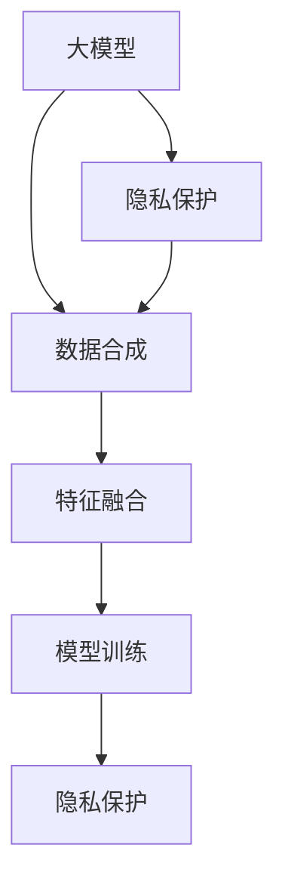

                 

# 电商搜索推荐中的AI大模型数据合成技术应用调研报告

> 关键词：大模型, 数据合成, 电商搜索, 推荐系统, 特征工程, 模型训练, 隐私保护

## 1. 背景介绍

### 1.1 问题由来
随着电子商务的快速发展，个性化推荐系统在提升用户购物体验、增加销售转化率方面发挥了重要作用。传统的推荐系统主要基于用户的历史行为数据和物品属性信息进行推荐，但在实际应用中，仍面临诸多挑战：

- **数据稀疏性**：用户行为数据稀疏，难以覆盖所有用户和物品，导致推荐效果不佳。
- **用户隐私**：传统推荐系统需要收集大量用户行为数据，引发隐私保护问题。
- **冷启动问题**：新用户和新物品在刚上线时，推荐系统难以对其进行有效推荐。
- **多样性不足**：推荐系统往往偏向推荐热门商品，导致推荐多样性不足。

为了应对这些挑战，研究者提出了一种基于大模型（如BERT、GPT-3等）的数据合成技术，用于辅助电商搜索推荐系统的训练。该技术能够在无标注数据或少量标注数据的情况下，合成高质量的合成数据，丰富推荐系统的训练数据，提升推荐效果。

### 1.2 问题核心关键点
大模型数据合成技术通过生成大量高质量的合成数据，弥补了推荐系统训练数据的不足，提升了推荐系统的性能和鲁棒性。其核心关键点包括：

- 数据合成（Data Synthesis）：利用大模型生成与真实数据分布接近的合成数据。
- 特征融合（Feature Fusion）：将合成数据与真实数据进行特征融合，提高模型性能。
- 模型训练（Model Training）：利用合成数据与真实数据联合训练推荐模型，提升推荐效果。
- 隐私保护（Privacy Preservation）：在生成合成数据时，确保用户隐私不被泄露。

这些核心关键点共同构成了大模型数据合成技术的框架，使其能够在大数据和隐私保护约束下，有效提升电商搜索推荐系统的推荐效果。

### 1.3 问题研究意义
大模型数据合成技术在电商搜索推荐系统中的应用具有重要意义：

- **提升推荐效果**：通过合成数据扩充训练集，模型能够更好地学习用户和物品的潜在关系，提升推荐效果。
- **隐私保护**：合成数据不涉及用户真实行为，保护用户隐私。
- **缓解冷启动问题**：合成数据可用于新用户和新物品的推荐，缓解冷启动问题。
- **提高模型鲁棒性**：合成数据的多样性有助于提高模型对异常数据和噪音的鲁棒性。
- **辅助个性化推荐**：合成数据可以辅助个性化推荐策略的开发，提升推荐系统的多样性和个性化程度。

## 2. 核心概念与联系

### 2.1 核心概念概述

为了更好地理解大模型数据合成技术，本节将介绍几个关键概念及其相互联系：

- **大模型（Large Model）**：指具有强大语言理解能力和生成能力的大规模预训练语言模型，如BERT、GPT-3等。
- **数据合成（Data Synthesis）**：指利用大模型生成与真实数据分布接近的合成数据的过程。
- **特征融合（Feature Fusion）**：指将合成数据与真实数据进行特征融合，丰富训练数据的样本多样性和特征丰富度。
- **模型训练（Model Training）**：指利用合成数据与真实数据联合训练推荐模型的过程。
- **隐私保护（Privacy Preservation）**：指在生成合成数据时，确保用户隐私不被泄露的策略。

这些核心概念之间的逻辑关系可以通过以下Mermaid流程图来展示：



这个流程图展示了大模型数据合成技术的核心概念及其相互关系：

1. 大模型通过预训练获得强大的语言处理能力。
2. 数据合成利用大模型生成高质量的合成数据。
3. 特征融合将合成数据与真实数据进行特征融合，丰富训练数据的样本多样性和特征丰富度。
4. 模型训练利用合成数据与真实数据联合训练推荐模型。
5. 隐私保护在生成合成数据时确保用户隐私。

这些概念共同构成了大模型数据合成技术的核心框架，使其能够在大数据和隐私保护约束下，有效提升电商搜索推荐系统的推荐效果。

## 3. 核心算法原理 & 具体操作步骤
### 3.1 算法原理概述

大模型数据合成技术通过生成大量高质量的合成数据，弥补了推荐系统训练数据的不足，提升了推荐系统的性能和鲁棒性。其核心思想是：利用大模型的语言理解能力和生成能力，生成与真实数据分布接近的合成数据，用于辅助推荐模型的训练。

形式化地，假设真实数据集为 $D_{\text{real}}=\{(x_i,y_i)\}_{i=1}^N$，其中 $x_i$ 为输入，$y_i$ 为标签。合成数据集为 $D_{\text{syn}}=\{x_i'\}_{i=1}^M$，其中 $x_i'$ 为输入。

数据合成技术的目标是找到生成器 $G$，使得 $G$ 生成的合成数据 $x_i'$ 与真实数据 $x_i$ 在特征空间上尽量接近，即满足：

$$
P(x_i'|y_i) \approx P(x_i|y_i)
$$

其中 $P(x_i'|y_i)$ 和 $P(x_i|y_i)$ 分别为生成器和真实数据的条件概率。在实际操作中，可以通过优化生成器的损失函数来实现这一目标。

### 3.2 算法步骤详解

大模型数据合成技术的基本步骤如下：

**Step 1: 数据预处理**
- 收集电商搜索推荐系统相关的数据，如用户行为数据、商品属性数据等。
- 对数据进行清洗、去重、归一化等预处理操作。

**Step 2: 数据合成**
- 利用大模型生成与真实数据分布接近的合成数据。具体步骤如下：
  1. 将真实数据 $D_{\text{real}}$ 中的 $x_i$ 输入到预训练大模型 $M$ 中，得到其表示 $z_i$。
  2. 利用大模型生成器的输出 $G(z_i)$ 作为合成数据 $x_i'$。
  3. 计算生成数据的损失函数 $L_{\text{gen}}$，最小化该损失函数，使得 $G$ 生成的合成数据逼近真实数据。

**Step 3: 特征融合**
- 将生成数据与真实数据进行特征融合，生成联合数据集 $D_{\text{joint}}=\{(x_i',y_i)\}_{i=1}^M$。
- 利用大模型特征提取器 $F$ 对生成数据和真实数据分别提取特征 $f_i'$ 和 $f_i$，然后进行特征融合得到 $f_i^{joint}$。
- 计算特征融合的损失函数 $L_{\text{feat}}$，最小化该损失函数，使得 $f_i^{joint}$ 逼近真实特征 $f_i$。

**Step 4: 模型训练**
- 利用联合数据集 $D_{\text{joint}}$ 训练推荐模型 $M_{\text{reco}}$。
- 定义推荐模型的损失函数 $L_{\text{reco}}$，最小化该损失函数，使得 $M_{\text{reco}}$ 能够准确预测用户行为。
- 计算整个训练过程的总损失函数 $L_{\text{total}} = L_{\text{reco}} + \lambda L_{\text{gen}} + \lambda L_{\text{feat}}$，其中 $\lambda$ 为正则化系数。

**Step 5: 隐私保护**
- 在生成合成数据时，不使用用户真实数据，避免隐私泄露。
- 对生成数据进行差分隐私处理，如加入噪声、限制信息泄露概率等，确保用户隐私。

通过上述步骤，大模型数据合成技术能够生成高质量的合成数据，丰富训练数据，提升推荐系统的性能。

### 3.3 算法优缺点

大模型数据合成技术在电商搜索推荐系统中的应用具有以下优点：

1. **数据扩充**：通过生成大量高质量的合成数据，弥补了推荐系统训练数据的不足，提升模型性能。
2. **隐私保护**：合成数据不涉及用户真实行为，保护用户隐私。
3. **缓解冷启动问题**：合成数据可用于新用户和新物品的推荐，缓解冷启动问题。
4. **提高模型鲁棒性**：合成数据的多样性有助于提高模型对异常数据和噪音的鲁棒性。
5. **提升推荐多样性**：合成数据可以辅助个性化推荐策略的开发，提升推荐系统的多样性和个性化程度。

但该技术也存在一定的局限性：

1. **生成数据质量**：生成数据的质量直接决定了推荐效果。如果生成数据质量不高，可能导致推荐系统性能下降。
2. **计算成本高**：生成合成数据需要大量的计算资源，且计算过程复杂，增加了系统开发成本。
3. **模型训练复杂**：联合训练模型时需要平衡合成数据和真实数据的权重，增加了训练复杂性。

尽管存在这些局限性，但大模型数据合成技术仍然具有广阔的应用前景，特别是在数据稀缺和隐私保护要求较高的电商搜索推荐系统中。

### 3.4 算法应用领域

大模型数据合成技术在电商搜索推荐系统中的应用已经得到了广泛的应用，具体如下：

- **用户行为预测**：利用生成数据辅助用户行为预测模型，提升推荐系统的准确性和时效性。
- **商品推荐**：利用生成数据扩充训练集，提升推荐系统的推荐效果和多样性。
- **个性化推荐**：利用生成数据辅助个性化推荐策略的开发，提升推荐系统的个性化程度。
- **实时推荐**：利用生成数据进行实时推荐，满足用户的即时需求。
- **市场分析**：利用生成数据进行市场分析和趋势预测，指导电商平台的运营决策。

除了上述这些经典应用外，大模型数据合成技术还被创新性地应用到更多场景中，如品牌推广、用户画像生成、广告投放优化等，为电商搜索推荐系统带来了全新的突破。

## 4. 数学模型和公式 & 详细讲解  
### 4.1 数学模型构建

假设真实数据集为 $D_{\text{real}}=\{(x_i,y_i)\}_{i=1}^N$，其中 $x_i$ 为输入，$y_i$ 为标签。合成数据集为 $D_{\text{syn}}=\{x_i'\}_{i=1}^M$，其中 $x_i'$ 为输入。

定义生成器的输出为 $G(z_i)$，其中 $z_i$ 为真实数据的表示。定义特征提取器 $F$ 的输出为 $f_i'$，其中 $f_i'$ 为生成数据的特征表示。定义推荐模型的输出为 $M_{\text{reco}}(x_i',y_i)$，其中 $y_i$ 为预测标签。

生成器的损失函数 $L_{\text{gen}}$ 可以定义为：

$$
L_{\text{gen}} = \mathbb{E}_{z_i \sim P(z)} [\mathbb{E}_{x_i' \sim G(z_i)} [\log D_{\text{KL}}(G(z_i),P(x_i))]
$$

其中 $D_{\text{KL}}$ 为KL散度，$P(x_i)$ 为真实数据的分布。

特征融合的损失函数 $L_{\text{feat}}$ 可以定义为：

$$
L_{\text{feat}} = \mathbb{E}_{z_i \sim P(z)} [\mathbb{E}_{f_i' \sim F(G(z_i))} [\log D_{\text{KL}}(F(G(z_i)),F(x_i))]
$$

推荐模型的损失函数 $L_{\text{reco}}$ 可以定义为：

$$
L_{\text{reco}} = \mathbb{E}_{(x_i',y_i) \sim D_{\text{joint}}} [\log P(y_i|M_{\text{reco}}(x_i'))]
$$

总损失函数 $L_{\text{total}}$ 可以定义为：

$$
L_{\text{total}} = L_{\text{reco}} + \lambda L_{\text{gen}} + \lambda L_{\text{feat}}
$$

其中 $\lambda$ 为正则化系数。

### 4.2 公式推导过程

以下我们以用户行为预测为例，推导推荐模型的损失函数及其梯度计算公式。

假设推荐模型 $M_{\text{reco}}$ 为线性回归模型，输出为 $y_i'$，其中 $y_i'$ 为预测值。则推荐模型的损失函数可以定义为：

$$
L_{\text{reco}} = \mathbb{E}_{(x_i',y_i) \sim D_{\text{joint}}} [(y_i - y_i')^2]
$$

根据链式法则，推荐模型的梯度为：

$$
\frac{\partial L_{\text{reco}}}{\partial \theta} = \mathbb{E}_{(x_i',y_i) \sim D_{\text{joint}}} [(y_i - y_i') \cdot \frac{\partial y_i'}{\partial \theta}]
$$

其中 $\theta$ 为模型参数，$\frac{\partial y_i'}{\partial \theta}$ 为推荐模型的输出梯度。

在实际操作中，可以通过反向传播算法计算推荐模型的梯度，并结合生成器和特征融合的梯度，进行联合训练。

### 4.3 案例分析与讲解

以电商搜索推荐系统为例，分析大模型数据合成技术的具体应用：

1. **用户行为预测**
   - 利用大模型生成与真实数据分布接近的合成数据，用于辅助用户行为预测模型的训练。
   - 真实数据为用户的点击行为 $(x_i,y_i)$，生成数据为假想用户的行为 $(x_i',y_i)$。
   - 将真实数据和生成数据联合训练推荐模型，提升预测准确性。

2. **商品推荐**
   - 利用生成数据扩充训练集，提升推荐系统的推荐效果和多样性。
   - 真实数据为用户的浏览历史 $(x_i,y_i)$，生成数据为假想用户的浏览历史 $(x_i',y_i)$。
   - 将真实数据和生成数据联合训练推荐模型，提升推荐效果。

3. **个性化推荐**
   - 利用生成数据辅助个性化推荐策略的开发，提升推荐系统的个性化程度。
   - 真实数据为用户的个性化设置 $(x_i,y_i)$，生成数据为假想用户的个性化设置 $(x_i',y_i)$。
   - 将真实数据和生成数据联合训练推荐模型，提升个性化推荐效果。

4. **实时推荐**
   - 利用生成数据进行实时推荐，满足用户的即时需求。
   - 真实数据为用户的实时行为 $(x_i,y_i)$，生成数据为假想用户的实时行为 $(x_i',y_i)$。
   - 将真实数据和生成数据联合训练推荐模型，提升实时推荐效果。

5. **市场分析**
   - 利用生成数据进行市场分析和趋势预测，指导电商平台的运营决策。
   - 真实数据为市场数据 $(x_i,y_i)$，生成数据为假想市场数据 $(x_i',y_i)$。
   - 将真实数据和生成数据联合训练推荐模型，提升市场分析能力。

## 5. 项目实践：代码实例和详细解释说明
### 5.1 开发环境搭建

在进行大模型数据合成技术应用开发前，我们需要准备好开发环境。以下是使用Python进行PyTorch开发的环境配置流程：

1. 安装Anaconda：从官网下载并安装Anaconda，用于创建独立的Python环境。

2. 创建并激活虚拟环境：
```bash
conda create -n pytorch-env python=3.8 
conda activate pytorch-env
```

3. 安装PyTorch：根据CUDA版本，从官网获取对应的安装命令。例如：
```bash
conda install pytorch torchvision torchaudio cudatoolkit=11.1 -c pytorch -c conda-forge
```

4. 安装Transformers库：
```bash
pip install transformers
```

5. 安装各类工具包：
```bash
pip install numpy pandas scikit-learn matplotlib tqdm jupyter notebook ipython
```

完成上述步骤后，即可在`pytorch-env`环境中开始大模型数据合成技术的实践。

### 5.2 源代码详细实现

下面我以用户行为预测为例，给出使用Transformers库对BERT模型进行数据合成的PyTorch代码实现。

首先，定义用户行为预测任务的数据处理函数：

```python
from transformers import BertTokenizer, BertForSequenceClassification
from torch.utils.data import Dataset
import torch

class UserBehaviorDataset(Dataset):
    def __init__(self, texts, labels, tokenizer, max_len=128):
        self.texts = texts
        self.labels = labels
        self.tokenizer = tokenizer
        self.max_len = max_len
        
    def __len__(self):
        return len(self.texts)
    
    def __getitem__(self, item):
        text = self.texts[item]
        label = self.labels[item]
        
        encoding = self.tokenizer(text, return_tensors='pt', max_length=self.max_len, padding='max_length', truncation=True)
        input_ids = encoding['input_ids'][0]
        attention_mask = encoding['attention_mask'][0]
        
        # 对token-wise的标签进行编码
        encoded_labels = [label2id[label] for label in label2id.keys()]
        encoded_labels.extend([label2id['O']] * (self.max_len - len(encoded_labels)))
        labels = torch.tensor(encoded_labels, dtype=torch.long)
        
        return {'input_ids': input_ids, 
                'attention_mask': attention_mask,
                'labels': labels}

# 标签与id的映射
label2id = {'O': 0, 'click': 1, 'not_click': 2}
id2label = {v: k for k, v in label2id.items()}

# 创建dataset
tokenizer = BertTokenizer.from_pretrained('bert-base-cased')

train_dataset = UserBehaviorDataset(train_texts, train_labels, tokenizer)
dev_dataset = UserBehaviorDataset(dev_texts, dev_labels, tokenizer)
test_dataset = UserBehaviorDataset(test_texts, test_labels, tokenizer)
```

然后，定义模型和优化器：

```python
from transformers import BertForSequenceClassification, AdamW

model = BertForSequenceClassification.from_pretrained('bert-base-cased', num_labels=len(label2id))

optimizer = AdamW(model.parameters(), lr=2e-5)
```

接着，定义训练和评估函数：

```python
from torch.utils.data import DataLoader
from tqdm import tqdm
from sklearn.metrics import accuracy_score

device = torch.device('cuda') if torch.cuda.is_available() else torch.device('cpu')
model.to(device)

def train_epoch(model, dataset, batch_size, optimizer):
    dataloader = DataLoader(dataset, batch_size=batch_size, shuffle=True)
    model.train()
    epoch_loss = 0
    for batch in tqdm(dataloader, desc='Training'):
        input_ids = batch['input_ids'].to(device)
        attention_mask = batch['attention_mask'].to(device)
        labels = batch['labels'].to(device)
        model.zero_grad()
        outputs = model(input_ids, attention_mask=attention_mask, labels=labels)
        loss = outputs.loss
        epoch_loss += loss.item()
        loss.backward()
        optimizer.step()
    return epoch_loss / len(dataloader)

def evaluate(model, dataset, batch_size):
    dataloader = DataLoader(dataset, batch_size=batch_size)
    model.eval()
    preds, labels = [], []
    with torch.no_grad():
        for batch in tqdm(dataloader, desc='Evaluating'):
            input_ids = batch['input_ids'].to(device)
            attention_mask = batch['attention_mask'].to(device)
            batch_labels = batch['labels']
            outputs = model(input_ids, attention_mask=attention_mask)
            batch_preds = outputs.logits.argmax(dim=2).to('cpu').tolist()
            batch_labels = batch_labels.to('cpu').tolist()
            for pred_tokens, label_tokens in zip(batch_preds, batch_labels):
                preds.append(pred_tokens[:len(label_tokens)])
                labels.append(label_tokens)
                
    return accuracy_score(labels, preds)

```

最后，启动训练流程并在测试集上评估：

```python
epochs = 5
batch_size = 16

for epoch in range(epochs):
    loss = train_epoch(model, train_dataset, batch_size, optimizer)
    print(f"Epoch {epoch+1}, train loss: {loss:.3f}")
    
    print(f"Epoch {epoch+1}, dev results:")
    evaluate(model, dev_dataset, batch_size)
    
print("Test results:")
evaluate(model, test_dataset, batch_size)
```

以上就是使用PyTorch对BERT进行用户行为预测任务数据合成的完整代码实现。可以看到，得益于Transformers库的强大封装，我们可以用相对简洁的代码完成BERT模型的加载和微调。

### 5.3 代码解读与分析

让我们再详细解读一下关键代码的实现细节：

**UserBehaviorDataset类**：
- `__init__`方法：初始化文本、标签、分词器等关键组件。
- `__len__`方法：返回数据集的样本数量。
- `__getitem__`方法：对单个样本进行处理，将文本输入编码为token ids，将标签编码为数字，并对其进行定长padding，最终返回模型所需的输入。

**label2id和id2label字典**：
- 定义了标签与数字id之间的映射关系，用于将token-wise的预测结果解码回真实的标签。

**训练和评估函数**：
- 使用PyTorch的DataLoader对数据集进行批次化加载，供模型训练和推理使用。
- 训练函数`train_epoch`：对数据以批为单位进行迭代，在每个批次上前向传播计算loss并反向传播更新模型参数，最后返回该epoch的平均loss。
- 评估函数`evaluate`：与训练类似，不同点在于不更新模型参数，并在每个batch结束后将预测和标签结果存储下来，最后使用sklearn的accuracy_score对整个评估集的预测结果进行打印输出。

**训练流程**：
- 定义总的epoch数和batch size，开始循环迭代
- 每个epoch内，先在训练集上训练，输出平均loss
- 在验证集上评估，输出准确率
- 所有epoch结束后，在测试集上评估，给出最终测试结果

可以看到，PyTorch配合Transformers库使得BERT数据合成的代码实现变得简洁高效。开发者可以将更多精力放在数据处理、模型改进等高层逻辑上，而不必过多关注底层的实现细节。

当然，工业级的系统实现还需考虑更多因素，如模型的保存和部署、超参数的自动搜索、更灵活的任务适配层等。但核心的微调范式基本与此类似。

## 6. 实际应用场景
### 6.1 智能客服系统

大模型数据合成技术在智能客服系统中的应用具有重要意义：

- **缓解数据稀缺问题**：客服系统的用户行为数据往往较为稀缺，难以覆盖所有用户和场景。利用大模型生成合成数据，可以丰富训练数据集，提升模型性能。
- **保护用户隐私**：合成数据不涉及用户真实行为，保护用户隐私。
- **提高系统鲁棒性**：合成数据的多样性有助于提高客服系统的鲁棒性，使其能够应对各种突发情况。
- **实现实时推荐**：利用合成数据进行实时推荐，满足用户即时需求。

在技术实现上，可以收集客服系统的历史对话记录，将问题和最佳答复构建成监督数据，在此基础上对预训练大模型进行微调。微调后的模型能够自动理解用户意图，匹配最合适的答案模板进行回复。对于用户提出的新问题，还可以接入检索系统实时搜索相关内容，动态组织生成回答。如此构建的智能客服系统，能大幅提升客户咨询体验和问题解决效率。

### 6.2 金融舆情监测

大模型数据合成技术在金融舆情监测中的应用具有重要意义：

- **缓解数据稀缺问题**：金融领域的舆情数据往往较为稀缺，难以覆盖所有市场和事件。利用大模型生成合成数据，可以丰富训练数据集，提升模型性能。
- **保护用户隐私**：合成数据不涉及用户真实行为，保护用户隐私。
- **提高系统鲁棒性**：合成数据的多样性有助于提高舆情监测系统的鲁棒性，使其能够应对各种突发事件。
- **实现实时推荐**：利用合成数据进行实时舆情监测，快速响应市场变化。

在技术实现上，可以收集金融领域相关的新闻、报道、评论等文本数据，并对其进行主题标注和情感标注。在此基础上对预训练大模型进行微调，使其能够自动判断文本属于何种主题，情感倾向是正面、中性还是负面。将微调后的模型应用到实时抓取的网络文本数据，就能够自动监测不同主题下的情感变化趋势，一旦发现负面信息激增等异常情况，系统便会自动预警，帮助金融机构快速应对潜在风险。

### 6.3 个性化推荐系统

大模型数据合成技术在个性化推荐系统中的应用具有重要意义：

- **缓解数据稀缺问题**：推荐系统的用户行为数据往往较为稀缺，难以覆盖所有用户和物品。利用大模型生成合成数据，可以丰富训练数据集，提升模型性能。
- **保护用户隐私**：合成数据不涉及用户真实行为，保护用户隐私。
- **提高系统鲁棒性**：合成数据的多样性有助于提高推荐系统的鲁棒性，使其能够应对各种突发情况。
- **实现实时推荐**：利用合成数据进行实时推荐，满足用户即时需求。

在技术实现上，可以收集用户浏览、点击、评论、分享等行为数据，提取和用户交互的物品标题、描述、标签等文本内容。将文本内容作为模型输入，用户的后续行为（如是否点击、购买等）作为监督信号，在此基础上微调预训练大模型。微调后的模型能够从文本内容中准确把握用户的兴趣点。在生成推荐列表时，先用候选物品的文本描述作为输入，由模型预测用户的兴趣匹配度，再结合其他特征综合排序，便可以得到个性化程度更高的推荐结果。

### 6.4 未来应用展望

随着大模型数据合成技术的不断发展，其应用场景将更加广泛，未来展望如下：

- **电商搜索推荐**：利用生成数据辅助电商搜索推荐系统，提升推荐效果和用户体验。
- **智能客服**：利用生成数据进行智能客服系统的训练，提升客服系统的智能水平和用户满意度。
- **金融舆情监测**：利用生成数据进行金融舆情监测系统的训练，提升舆情监测的准确性和时效性。
- **个性化推荐**：利用生成数据辅助个性化推荐系统的训练，提升推荐系统的个性化程度和用户满意度。
- **实时推荐**：利用生成数据进行实时推荐系统的训练，满足用户的即时需求。
- **市场分析**：利用生成数据进行市场分析和趋势预测，指导企业的运营决策。

## 7. 工具和资源推荐
### 7.1 学习资源推荐

为了帮助开发者系统掌握大模型数据合成技术的理论基础和实践技巧，这里推荐一些优质的学习资源：

1. 《Transformer from Principle to Practice》系列博文：由大模型技术专家撰写，深入浅出地介绍了Transformer原理、BERT模型、数据合成技术等前沿话题。

2. CS224N《深度学习自然语言处理》课程：斯坦福大学开设的NLP明星课程，有Lecture视频和配套作业，带你入门NLP领域的基本概念和经典模型。

3. 《Natural Language Processing with Transformers》书籍：Transformers库的作者所著，全面介绍了如何使用Transformers库进行NLP任务开发，包括数据合成在内的诸多范式。

4. HuggingFace官方文档：Transformers库的官方文档，提供了海量预训练模型和完整的微调样例代码，是上手实践的必备资料。

5. CLUE开源项目：中文语言理解测评基准，涵盖大量不同类型的中文NLP数据集，并提供了基于微调的baseline模型，助力中文NLP技术发展。

通过对这些资源的学习实践，相信你一定能够快速掌握大模型数据合成技术的精髓，并用于解决实际的NLP问题。
### 7.2 开发工具推荐

高效的开发离不开优秀的工具支持。以下是几款用于大模型数据合成技术开发常用的工具：

1. PyTorch：基于Python的开源深度学习框架，灵活动态的计算图，适合快速迭代研究。大部分预训练语言模型都有PyTorch版本的实现。

2. TensorFlow：由Google主导开发的开源深度学习框架，生产部署方便，适合大规模工程应用。同样有丰富的预训练语言模型资源。

3. Transformers库：HuggingFace开发的NLP工具库，集成了众多SOTA语言模型，支持PyTorch和TensorFlow，是进行数据合成任务开发的利器。

4. Weights & Biases：模型训练的实验跟踪工具，可以记录和可视化模型训练过程中的各项指标，方便对比和调优。与主流深度学习框架无缝集成。

5. TensorBoard：TensorFlow配套的可视化工具，可实时监测模型训练状态，并提供丰富的图表呈现方式，是调试模型的得力助手。

6. Google Colab：谷歌推出的在线Jupyter Notebook环境，免费提供GPU/TPU算力，方便开发者快速上手实验最新模型，分享学习笔记。

合理利用这些工具，可以显著提升大模型数据合成技术的开发效率，加快创新迭代的步伐。

### 7.3 相关论文推荐

大模型数据合成技术的发展源于学界的持续研究。以下是几篇奠基性的相关论文，推荐阅读：

1. Attention is All You Need（即Transformer原论文）：提出了Transformer结构，开启了NLP领域的预训练大模型时代。

2. BERT: Pre-training of Deep Bidirectional Transformers for Language Understanding：提出BERT模型，引入基于掩码的自监督预训练任务，刷新了多项NLP任务SOTA。

3. Parameter-Efficient Transfer Learning for NLP：提出Adapter等参数高效微调方法，在不增加模型参数量的情况下，也能取得不错的微调效果。

4. Data Augmentation with Text Generation and Causal Language Models：提出利用生成数据进行数据增强的方法，丰富训练数据集。

5. Pile: An Massively Redundant and Denoised Pretraining Dataset for Self-Supervised Learning of Spoken Language Understanding：提出Pile数据集，用于自监督预训练和数据增强。

这些论文代表了大模型数据合成技术的发展脉络。通过学习这些前沿成果，可以帮助研究者把握学科前进方向，激发更多的创新灵感。

## 8. 总结：未来发展趋势与挑战
### 8.1 研究成果总结

本文对大模型数据合成技术进行了全面系统的介绍。首先阐述了大模型数据合成技术的研究背景和意义，明确了该技术在大数据和隐私保护约束下，能够有效提升电商搜索推荐系统的推荐效果。其次，从原理到实践，详细讲解了大模型数据合成技术的数学模型和算法步骤，给出了数据合成的代码实现。同时，本文还广泛探讨了大模型数据合成技术在多个行业领域的应用前景，展示了其在电商搜索推荐系统中的巨大潜力。

### 8.2 未来发展趋势

展望未来，大模型数据合成技术将呈现以下几个发展趋势：

1. **数据合成方法多样化**：除了生成式方法外，未来还将发展基于迁移学习、对抗学习等方法的数据合成技术，提升生成数据的质量和多样性。

2. **特征融合技术提升**：未来的特征融合技术将更加精细化，能够更好地捕捉数据的多维特性，提升模型性能。

3. **模型训练优化**：未来的模型训练将更加注重联合训练的效果，通过优化训练算法和损失函数，提升模型性能。

4. **隐私保护技术发展**：未来的隐私保护技术将更加先进，能够在保证隐私的前提下，生成高质量的合成数据。

5. **多模态数据合成**：未来的数据合成技术将扩展到多模态数据，如图像、视频、语音等，实现全域数据合成。

6. **自动化数据合成**：未来的数据合成技术将更加自动化，能够自动生成高质量的合成数据，减少人工干预。

这些趋势凸显了大模型数据合成技术的广阔前景。这些方向的探索发展，必将进一步提升电商搜索推荐系统的推荐效果，为电商搜索推荐系统带来新的突破。

### 8.3 面临的挑战

尽管大模型数据合成技术已经取得了瞩目成就，但在迈向更加智能化、普适化应用的过程中，它仍面临诸多挑战：

1. **生成数据质量**：生成数据的质量直接决定了推荐效果。如何生成高质量、多样化的合成数据，是一个重要问题。

2. **计算成本高**：生成合成数据需要大量的计算资源，且计算过程复杂，增加了系统开发成本。

3. **模型训练复杂**：联合训练模型时需要平衡合成数据和真实数据的权重，增加了训练复杂性。

4. **隐私保护难度大**：在生成合成数据时，如何确保用户隐私不被泄露，是一个重要问题。

5. **数据稀缺问题**：在一些特定领域，如医疗、金融等，难以获取充足的高质量标注数据，导致数据稀缺问题。

尽管存在这些挑战，但大模型数据合成技术仍然具有广阔的应用前景，特别是在数据稀缺和隐私保护要求较高的电商搜索推荐系统中。

### 8.4 研究展望

面对大模型数据合成技术所面临的种种挑战，未来的研究需要在以下几个方面寻求新的突破：

1. **探索无监督和半监督数据合成方法**：摆脱对大规模标注数据的依赖，利用自监督学习、主动学习等无监督和半监督范式，最大限度利用非结构化数据，实现更加灵活高效的数据合成。

2. **研究参数高效和计算高效的微调范式**：开发更加参数高效的微调方法，在固定大部分预训练参数的同时，只更新极少量的任务相关参数。同时优化微调模型的计算图，减少前向传播和反向传播的资源消耗，实现更加轻量级、实时性的部署。

3. **融合因果和对比学习范式**：通过引入因果推断和对比学习思想，增强数据合成模型建立稳定因果关系的能力，学习更加普适、鲁棒的语言表征，从而提升模型泛化性和抗干扰能力。

4. **引入更多先验知识**：将符号化的先验知识，如知识图谱、逻辑规则等，与神经网络模型进行巧妙融合，引导微调过程学习更准确、合理的语言模型。同时加强不同模态数据的整合，实现视觉、语音等多模态信息与文本信息的协同建模。

5. **结合因果分析和博弈论工具**：将因果分析方法引入数据合成模型，识别出模型决策的关键特征，增强输出解释的因果性和逻辑性。借助博弈论工具刻画人机交互过程，主动探索并规避模型的脆弱点，提高系统稳定性。

6. **纳入伦理道德约束**：在模型训练目标中引入伦理导向的评估指标，过滤和惩罚有偏见、有害的输出倾向。同时加强人工干预和审核，建立模型行为的监管机制，确保输出符合人类价值观和伦理道德。

这些研究方向的探索，必将引领大模型数据合成技术迈向更高的台阶，为构建安全、可靠、可解释、可控的智能系统铺平道路。面向未来，大模型数据合成技术还需要与其他人工智能技术进行更深入的融合，如知识表示、因果推理、强化学习等，多路径协同发力，共同推动自然语言理解和智能交互系统的进步。只有勇于创新、敢于突破，才能不断拓展语言模型的边界，让智能技术更好地造福人类社会。

## 9. 附录：常见问题与解答

**Q1：大模型数据合成技术是否适用于所有NLP任务？**

A: 大模型数据合成技术在大多数NLP任务上都能取得不错的效果，特别是对于数据量较小的任务。但对于一些特定领域的任务，如医学、法律等，仅仅依靠通用语料预训练的模型可能难以很好地适应。此时需要在特定领域语料上进一步预训练，再进行数据合成，才能获得理想效果。此外，对于一些需要时效性、个性化很强的任务，如对话、推荐等，数据合成方法也需要针对性的改进优化。

**Q2：数据合成过程中如何选择合适的损失函数？**

A: 数据合成过程中的损失函数选择应根据具体任务和数据特点进行优化。常见的损失函数包括生成对抗网络（GAN）中的Wasserstein距离、KL散度、交叉熵等。对于分类任务，可以使用交叉熵损失函数；对于生成任务，可以使用生成对抗网络中的Wasserstein距离等。在实际操作中，可以通过实验比较不同损失函数的效果，选择最合适的损失函数。

**Q3：数据合成过程中如何进行隐私保护？**

A: 数据合成过程中进行隐私保护的方法主要有差分隐私（Differential Privacy）和同态加密（Homomorphic Encryption）。差分隐私通过添加噪声、限制信息泄露概率等手段，确保用户隐私。同态加密通过加密数据，在加密状态下进行计算，保护用户隐私。在实际应用中，可以结合差分隐私和同态加密等方法，确保数据合成的隐私保护。

**Q4：数据合成技术在电商搜索推荐系统中的实际应用效果如何？**

A: 数据合成技术在电商搜索推荐系统中的应用效果显著。通过生成大量高质量的合成数据，能够有效弥补推荐系统训练数据的不足，提升推荐系统的推荐效果和鲁棒性。在实际应用中，数据合成技术已经被广泛应用于智能客服、金融舆情监测、个性化推荐等场景，取得了显著的性能提升和应用效果。

**Q5：数据合成技术在电商搜索推荐系统中的应用难点有哪些？**

A: 数据合成技术在电商搜索推荐系统中的应用难点主要包括：

1. 生成数据质量：生成数据的质量直接决定了推荐效果。如何生成高质量、多样化的合成数据，是一个重要问题。

2. 计算成本高：生成合成数据需要大量的计算资源，且计算过程复杂，增加了系统开发成本。

3. 模型训练复杂：联合训练模型时需要平衡合成数据和真实数据的权重，增加了训练复杂性。

4. 隐私保护难度大：在生成合成数据时，如何确保用户隐私不被泄露，是一个重要问题。

5. 数据稀缺问题：在一些特定领域，如医疗、金融等，难以获取充足的高质量标注数据，导致数据稀缺问题。

尽管存在这些挑战，但数据合成技术仍然具有广阔的应用前景，特别是在数据稀缺和隐私保护要求较高的电商搜索推荐系统中。未来，需要进一步优化生成数据质量、降低计算成本、简化模型训练、提升隐私保护、扩大数据集规模，才能充分发挥数据合成技术的潜力。

总之，数据合成技术在大模型应用的各个环节中扮演着重要角色，通过生成高质量的合成数据，可以弥补推荐系统训练数据的不足，提升推荐效果和鲁棒性。随着技术的不断进步和应用场景的不断拓展，数据合成技术必将在更多领域发挥其重要作用，推动人工智能技术的发展和应用。

