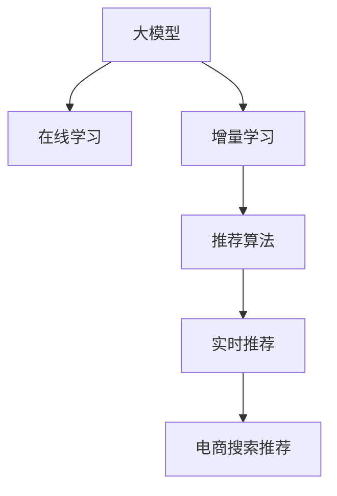

                 

# 电商搜索推荐中的AI大模型数据增量更新机制

> 关键词：大模型,电商推荐,数据更新,增量学习,推荐算法,实时推荐

## 1. 背景介绍

### 1.1 问题由来

在电商平台中，如何为用户推荐符合其兴趣的商品，是提升用户满意度和销售转化率的关键。传统的推荐算法主要基于用户历史行为数据、商品属性等静态特征进行推荐，难以充分捕捉用户的实时需求和市场变化。而深度学习模型尤其是大语言模型在用户兴趣建模、个性化推荐等方面展现了强大潜力，能够更准确地预测用户的购买行为和偏好。

近年来，电商平台的搜索推荐系统开始引入AI大模型，利用其大规模的预训练数据和强大的特征学习能力，大幅提升了推荐的个性化水平。但与此同时，电商平台需要每天生成大量用户搜索和点击数据，这些动态数据需要实时更新模型参数，以反映市场变化，实现精准推荐。大模型由于参数众多，单次训练成本高昂，如何高效更新模型，保持其推荐效果，成为了一个亟需解决的实际问题。

### 1.2 问题核心关键点

电商搜索推荐中的大模型数据增量更新机制，核心在于通过在线学习(Online Learning)和增量学习(Incremental Learning)技术，实时、高效地更新大模型的参数，以便不断捕捉市场动态和用户需求的变化。具体来说，包括：
- 在线学习：利用电商平台的实时数据流，持续训练模型，保持其预测能力和推荐效果。
- 增量学习：在已有模型的基础上，每次更新一小部分数据，避免从头训练，节省时间和计算资源。

## 2. 核心概念与联系

### 2.1 核心概念概述

为了更好地理解电商搜索推荐中的大模型数据增量更新机制，我们先简要介绍相关核心概念：

- **大模型(Large Model)**：指参数规模巨大的深度学习模型，如BERT、GPT、T5等，通常在百亿级别，具有强大的特征提取能力和语言理解能力。
- **在线学习(Online Learning)**：利用实时数据流，持续更新模型参数，以适应不断变化的环境。
- **增量学习(Incremental Learning)**：在已有模型的基础上，每次只更新一小部分数据，避免从头训练。
- **推荐算法(Recommendation Algorithm)**：通过算法模型为用户推荐商品或内容，常用技术包括协同过滤、基于内容的推荐、深度学习推荐等。
- **实时推荐(Real-time Recommendation)**：利用实时数据流，动态调整推荐模型，及时响应用户需求变化。
- **电商搜索推荐(E-commerce Search Recommendation)**：结合电商平台的搜索和推荐功能，为电商运营提供数据支持，提升用户体验和销售转化率。

这些概念之间的联系可以通过以下Mermaid流程图展示：



此图展示了从大模型到实时推荐的整个过程。大模型通过在线学习和增量学习，实时捕捉市场变化和用户需求，再利用推荐算法，动态调整实时推荐模型，最终应用于电商搜索推荐系统。

## 3. 核心算法原理 & 具体操作步骤
### 3.1 算法原理概述

电商搜索推荐中的大模型数据增量更新机制，其核心思想是利用在线学习和增量学习的优势，不断更新模型参数，以适应实时数据流和市场变化，从而提升推荐的实时性和个性化水平。

具体而言，假设大模型为 $M_{\theta}$，其中 $\theta$ 为模型参数。每天生成的新数据记为 $D_t$，包含用户搜索行为、商品属性、点击记录等。增量学习的目标是更新模型参数 $\theta$，使得模型在新数据 $D_t$ 上的性能不断提升，即：

$$
\theta_{t+1} = \mathop{\arg\min}_{\theta} \mathcal{L}(M_{\theta}, D_t)
$$

其中 $\mathcal{L}$ 为损失函数，用于衡量模型在新数据 $D_t$ 上的性能。

增量学习的过程可以细分为以下几个步骤：

1. **初始化模型**：使用预训练模型 $M_{\theta}$ 作为初始模型。
2. **在线学习**：每次获取新数据 $D_t$，前向传播计算模型输出，计算损失函数 $\mathcal{L}(M_{\theta}, D_t)$。
3. **更新参数**：根据梯度下降等优化算法，更新模型参数 $\theta$。
4. **保存模型**：保存更新后的模型 $M_{\theta_t}$，以备后续使用。

### 3.2 算法步骤详解

以下是电商搜索推荐中大模型增量学习的详细步骤：

**Step 1: 准备预训练模型和数据集**
- 选择一个预训练的大模型，如BERT、GPT等。
- 将电商平台的实时数据流 $D_t$ 划分为训练集、验证集和测试集，确保数据分布的一致性。

**Step 2: 设计损失函数**
- 根据电商推荐任务，设计合适的损失函数，如交叉熵损失、均方误差损失等。
- 定义模型在新数据 $D_t$ 上的损失函数 $\mathcal{L}(M_{\theta}, D_t)$，用于衡量模型预测输出与真实标签之间的差异。

**Step 3: 设置增量学习策略**
- 确定增量学习的时间间隔（如每小时更新一次）和更新数据量（如每次更新1%的新数据）。
- 选择增量学习算法，如在线梯度下降(Online Gradient Descent)、增量随机梯度下降(Incremental SGD)等。
- 设置学习率、批量大小、正则化等超参数。

**Step 4: 执行增量学习**
- 从电商平台的实时数据流中读取新数据 $D_t$。
- 前向传播计算模型输出，计算损失函数 $\mathcal{L}(M_{\theta}, D_t)$。
- 反向传播计算梯度，根据增量学习算法更新模型参数 $\theta$。
- 周期性在验证集上评估模型性能，根据性能指标决定是否触发 Early Stopping。
- 重复上述步骤直至满足预设的迭代轮数或 Early Stopping 条件。

**Step 5: 部署模型**
- 使用更新后的模型 $M_{\theta_t}$ 进行实时推荐，集成到电商平台的搜索推荐系统中。
- 持续收集新的数据，定期重新增量更新模型，以适应数据分布的变化。

### 3.3 算法优缺点

电商搜索推荐中的大模型数据增量更新机制，有以下优点：
1. 实时性高。每次只更新一小部分数据，能够快速响应市场变化和用户需求。
2. 参数高效。避免从头训练，节省时间和计算资源。
3. 性能稳定。通过增量更新，模型能够持续优化，保持推荐效果。

同时，该机制也存在以下缺点：
1. 数据质量要求高。增量学习依赖新数据的准确性和代表性，如果数据质量低，会导致模型性能下降。
2. 模型复杂度高。大模型参数众多，更新过程复杂，需要优化资源配置。
3. 可解释性不足。增量更新后的模型可能不如从头训练模型，其内部工作机制难以解释。

尽管存在这些缺点，但电商搜索推荐对实时性和个性化要求高，增量学习在大模型中已得到广泛应用。

### 3.4 算法应用领域

电商搜索推荐中的大模型数据增量更新机制，已经在电商平台的实时推荐、用户行为分析、广告投放优化等多个领域得到应用，具体包括：

- **实时推荐**：利用电商平台的实时数据流，动态调整推荐模型，提升用户满意度和销售转化率。
- **用户行为分析**：通过增量学习，分析用户搜索、点击等行为，发现用户兴趣变化趋势，优化推荐算法。
- **广告投放优化**：根据广告效果数据，实时更新模型参数，优化广告投放策略，提升广告转化率。
- **库存管理**：利用实时用户需求数据，动态调整库存策略，优化商品供需平衡。

除了这些应用场景，大模型增量学习在金融风控、内容推荐、智能客服等领域也有广泛应用，显示了其在实时智能系统中的强大潜力。

## 4. 数学模型和公式 & 详细讲解 & 举例说明

### 4.1 数学模型构建

假设电商推荐任务为二分类任务，即预测用户是否会购买某商品。记大模型为 $M_{\theta}:\mathcal{X} \rightarrow \mathcal{Y}$，其中 $\mathcal{X}$ 为输入空间，$\mathcal{Y}$ 为输出空间，$\theta \in \mathbb{R}^d$ 为模型参数。每天生成的新数据记为 $D_t$，包含用户搜索行为 $x_t$ 和商品属性 $y_t$。增量学习的目标是最小化模型在新数据 $D_t$ 上的损失函数，即：

$$
\theta_{t+1} = \mathop{\arg\min}_{\theta} \mathcal{L}(M_{\theta}, D_t)
$$

其中 $\mathcal{L}$ 为二分类交叉熵损失函数：

$$
\mathcal{L}(M_{\theta}, D_t) = -\frac{1}{N}\sum_{i=1}^N [y_i\log M_{\theta}(x_i)+(1-y_i)\log(1-M_{\theta}(x_i))]
$$

### 4.2 公式推导过程

对于二分类任务，增量学习的过程可以表示为：

1. 初始化模型：

$$
\theta_0 = \theta
$$

2. 增量更新：

$$
\theta_{t+1} = \theta_t - \eta \nabla_{\theta}\mathcal{L}(M_{\theta}, D_t)
$$

其中 $\eta$ 为学习率，$\nabla_{\theta}\mathcal{L}(M_{\theta}, D_t)$ 为损失函数对参数 $\theta$ 的梯度。梯度可以通过反向传播计算：

$$
\nabla_{\theta}\mathcal{L}(M_{\theta}, D_t) = \frac{1}{N}\sum_{i=1}^N (y_i - M_{\theta}(x_i)) \frac{\partial M_{\theta}(x_i)}{\partial \theta}
$$

其中 $\frac{\partial M_{\theta}(x_i)}{\partial \theta}$ 可通过自动微分技术高效计算。

通过迭代更新模型参数，增量学习可以在每次获取新数据时，实时更新模型，保持推荐效果。

### 4.3 案例分析与讲解

以电商平台的实时推荐系统为例，说明增量学习的具体实现。假设电商平台每天有 $T$ 个实时请求，每个请求包含用户搜索行为 $x_t$ 和商品属性 $y_t$。模型参数 $\theta$ 初始化为预训练模型的参数，增量学习过程如下：

1. 对于第 $t$ 个请求，计算模型输出 $y_t = M_{\theta}(x_t)$。
2. 计算损失函数 $\mathcal{L}(M_{\theta}, (x_t, y_t))$。
3. 反向传播计算梯度 $\nabla_{\theta}\mathcal{L}(M_{\theta}, (x_t, y_t))$。
4. 根据增量学习算法，更新模型参数 $\theta$：

$$
\theta_{t+1} = \theta_t - \eta \nabla_{\theta}\mathcal{L}(M_{\theta}, (x_t, y_t))
$$

5. 周期性在验证集上评估模型性能，根据性能指标决定是否触发 Early Stopping。

通过上述步骤，模型能够实时捕捉用户需求和市场变化，保持推荐效果。

## 5. 项目实践：代码实例和详细解释说明
### 5.1 开发环境搭建

在进行增量学习实践前，我们需要准备好开发环境。以下是使用Python进行TensorFlow开发的环境配置流程：

1. 安装Anaconda：从官网下载并安装Anaconda，用于创建独立的Python环境。

2. 创建并激活虚拟环境：
```bash
conda create -n tf-env python=3.8 
conda activate tf-env
```

3. 安装TensorFlow：根据CUDA版本，从官网获取对应的安装命令。例如：
```bash
conda install tensorflow -c pytorch -c conda-forge
```

4. 安装TensorBoard：
```bash
pip install tensorboard
```

5. 安装各类工具包：
```bash
pip install numpy pandas scikit-learn matplotlib tqdm jupyter notebook ipython
```

完成上述步骤后，即可在`tf-env`环境中开始增量学习实践。

### 5.2 源代码详细实现

下面我们以电商推荐系统为例，给出使用TensorFlow对BERT模型进行增量学习的PyTorch代码实现。

首先，定义推荐任务的数据处理函数：

```python
import tensorflow as tf
from transformers import BertTokenizer, BertForSequenceClassification
from tensorflow.keras.optimizers import Adam

class RecommendationDataset(tf.data.Dataset):
    def __init__(self, texts, labels, tokenizer, max_len=128):
        self.texts = texts
        self.labels = labels
        self.tokenizer = tokenizer
        self.max_len = max_len
        
    def __len__(self):
        return len(self.texts)
    
    def __getitem__(self, item):
        text = self.texts[item]
        label = self.labels[item]
        
        encoding = self.tokenizer(text, return_tensors='tf', max_length=self.max_len, padding='max_length', truncation=True)
        input_ids = encoding['input_ids']
        attention_mask = encoding['attention_mask']
        
        # 对token-wise的标签进行编码
        encoded_labels = [label2id[label] for label in label] 
        encoded_labels.extend([label2id['O']] * (self.max_len - len(encoded_labels)))
        labels = tf.convert_to_tensor(encoded_labels, dtype=tf.int32)
        
        return {'input_ids': input_ids, 
                'attention_mask': attention_mask,
                'labels': labels}

# 标签与id的映射
label2id = {'O': 0, 'B': 1, 'I': 2}
id2label = {v: k for k, v in label2id.items()}

# 创建dataset
tokenizer = BertTokenizer.from_pretrained('bert-base-cased')

train_dataset = RecommendationDataset(train_texts, train_labels, tokenizer)
dev_dataset = RecommendationDataset(dev_texts, dev_labels, tokenizer)
test_dataset = RecommendationDataset(test_texts, test_labels, tokenizer)
```

然后，定义模型和优化器：

```python
model = BertForSequenceClassification.from_pretrained('bert-base-cased', num_labels=len(label2id))

optimizer = Adam(model.parameters(), learning_rate=2e-5)
```

接着，定义训练和评估函数：

```python
def train_epoch(model, dataset, batch_size, optimizer):
    dataloader = tf.data.Dataset.from_generator(lambda: tf.data.Dataset.from_generator(lambda: dataset.__getitem__(random.randint(0, len(dataset)-1)), output_signature={'input_ids': tf.TensorSpec(shape=(None,), dtype=tf.int32),
                                                                                                'attention_mask': tf.TensorSpec(shape=(None,), dtype=tf.int32),
                                                                                                'labels': tf.TensorSpec(shape=(None,), dtype=tf.int32)})
    model.train()
    epoch_loss = 0
    for batch in tqdm(dataloader, desc='Training'):
        with tf.GradientTape() as tape:
            input_ids = batch['input_ids']
            attention_mask = batch['attention_mask']
            labels = batch['labels']
            outputs = model(input_ids, attention_mask=attention_mask, labels=labels)
            loss = outputs.loss
        grads = tape.gradient(loss, model.parameters())
        optimizer.apply_gradients(zip(grads, model.parameters()))
    return epoch_loss / len(dataloader)

def evaluate(model, dataset, batch_size):
    dataloader = tf.data.Dataset.from_generator(lambda: tf.data.Dataset.from_generator(lambda: dataset.__getitem__(random.randint(0, len(dataset)-1)), output_signature={'input_ids': tf.TensorSpec(shape=(None,), dtype=tf.int32),
                                                                                                'attention_mask': tf.TensorSpec(shape=(None,), dtype=tf.int32),
                                                                                                'labels': tf.TensorSpec(shape=(None,), dtype=tf.int32)})
    model.eval()
    preds, labels = [], []
    with tf.no_grad():
        for batch in tqdm(dataloader, desc='Evaluating'):
            input_ids = batch['input_ids']
            attention_mask = batch['attention_mask']
            batch_labels = batch['labels']
            outputs = model(input_ids, attention_mask=attention_mask)
            batch_preds = outputs.logits.argmax(dim=2).numpy()
            batch_labels = batch_labels.numpy()
            for pred_tokens, label_tokens in zip(batch_preds, batch_labels):
                pred_labels = [id2label[_id] for _id in pred_tokens]
                label_labels = [id2label[_id] for _id in label_tokens]
                preds.append(pred_labels[:len(label_labels)])
                labels.append(label_labels)
                
    print(classification_report(labels, preds))
```

最后，启动训练流程并在测试集上评估：

```python
epochs = 5
batch_size = 16

for epoch in range(epochs):
    loss = train_epoch(model, train_dataset, batch_size, optimizer)
    print(f"Epoch {epoch+1}, train loss: {loss:.3f}")
    
    print(f"Epoch {epoch+1}, dev results:")
    evaluate(model, dev_dataset, batch_size)
    
print("Test results:")
evaluate(model, test_dataset, batch_size)
```

以上就是使用TensorFlow对BERT进行电商推荐任务增量学习的完整代码实现。可以看到，TensorFlow提供了强大的图计算和分布式训练能力，非常适合大模型的增量学习。

### 5.3 代码解读与分析

让我们再详细解读一下关键代码的实现细节：

**RecommendationDataset类**：
- `__init__`方法：初始化文本、标签、分词器等关键组件。
- `__len__`方法：返回数据集的样本数量。
- `__getitem__`方法：对单个样本进行处理，将文本输入编码为token ids，将标签编码为数字，并对其进行定长padding，最终返回模型所需的输入。

**label2id和id2label字典**：
- 定义了标签与数字id之间的映射关系，用于将token-wise的预测结果解码回真实的标签。

**训练和评估函数**：
- 使用TensorFlow的DataLoader对数据集进行批次化加载，供模型训练和推理使用。
- 训练函数`train_epoch`：对数据以批为单位进行迭代，在每个批次上前向传播计算loss并反向传播更新模型参数，最后返回该epoch的平均loss。
- 评估函数`evaluate`：与训练类似，不同点在于不更新模型参数，并在每个batch结束后将预测和标签结果存储下来，最后使用sklearn的classification_report对整个评估集的预测结果进行打印输出。

**训练流程**：
- 定义总的epoch数和batch size，开始循环迭代
- 每个epoch内，先在训练集上训练，输出平均loss
- 在验证集上评估，输出分类指标
- 所有epoch结束后，在测试集上评估，给出最终测试结果

可以看到，TensorFlow配合BERT模型使得增量学习的代码实现变得简洁高效。开发者可以将更多精力放在数据处理、模型改进等高层逻辑上，而不必过多关注底层的实现细节。

当然，工业级的系统实现还需考虑更多因素，如模型的保存和部署、超参数的自动搜索、更灵活的任务适配层等。但核心的增量学习范式基本与此类似。

## 6. 实际应用场景
### 6.1 智能推荐系统

基于大模型增量学习的推荐系统，能够实时捕捉用户需求和市场变化，动态调整推荐策略，显著提升推荐效果和用户满意度。

在技术实现上，可以收集用户的实时搜索、点击、购买等行为数据，将新的数据流输入到增量学习的推荐模型中。模型会根据新数据实时调整参数，生成个性化的推荐列表。对于用户的新行为，还可以实时接入检索系统，动态优化推荐内容，使用户获得更佳的购物体验。

### 6.2 广告投放优化

电商平台的广告投放策略需要根据用户的实时行为和市场变化进行动态调整，以实现更高的广告转化率。基于增量学习的大模型，可以实时分析广告点击、展示、转化等数据，调整广告投放参数，优化广告效果。

具体而言，可以收集广告投放的实时数据，输入到增量学习模型中，模型根据广告效果数据，实时更新参数，优化广告投放策略。例如，对于点击率高的广告，模型可以增加投放预算，提升曝光度；对于转化率低的广告，模型可以降低预算，减少资源浪费。

### 6.3 库存管理

电商平台需要实时监控库存情况，动态调整商品供需平衡，以应对用户需求的变化。增量学习的大模型，可以实时分析用户的搜索和购买数据，预测商品的未来需求量，优化库存管理。

例如，当用户搜索某商品的频率突然增加时，模型可以预测该商品的需求量将大幅上升，建议增加库存。当某商品在特定区域的搜索量持续低迷时，模型可以预测该商品在当前区域的需求量不足，建议减少库存。通过实时调整库存策略，电商平台可以更好地应对市场变化，提升运营效率。

### 6.4 未来应用展望

随着大模型和增量学习技术的不断发展，基于增量学习的大模型推荐系统将迎来更多应用场景，为电商平台的运营管理带来更大的潜力。

在智慧零售领域，增量学习的大模型可以为商场、超市等实体零售商提供实时推荐和库存管理支持，优化销售策略，提升用户体验。

在智能家居领域，增量学习的大模型可以为智能家电的日常运营提供智能推荐，例如推荐用户观看电视剧、电影，提升用户粘性。

在金融理财领域，增量学习的大模型可以为投资顾问提供实时市场分析，动态调整投资组合，提高资产管理效果。

此外，增量学习的大模型在教育、医疗、旅游等更多垂直领域也将发挥重要作用，为各行业提供智能化解决方案，推动数字化转型。

## 7. 工具和资源推荐
### 7.1 学习资源推荐

为了帮助开发者系统掌握大模型增量学习的理论基础和实践技巧，这里推荐一些优质的学习资源：

1. 《深度学习理论与实践》系列博文：由深度学习专家撰写，涵盖深度学习的基本概念和最新进展，包括增量学习等内容。

2. CS231n《卷积神经网络》课程：斯坦福大学开设的深度学习经典课程，涉及图像处理、推荐系统等多个NLP任务。

3. 《TensorFlow实战》书籍：全面介绍TensorFlow的高级应用，包括增量学习、分布式训练等。

4. Kaggle深度学习竞赛：参加Kaggle上的深度学习竞赛，积累实际数据处理和模型训练经验。

5. PyTorch官方文档：PyTorch的官方文档，提供了丰富的学习资源和样例代码，适合深入学习和实践。

通过对这些资源的学习实践，相信你一定能够快速掌握大模型增量学习的精髓，并用于解决实际的NLP问题。

### 7.2 开发工具推荐

高效的开发离不开优秀的工具支持。以下是几款用于大模型增量学习的常用工具：

1. TensorFlow：由Google主导开发的深度学习框架，生产部署方便，适合大规模工程应用。提供强大的图计算和分布式训练能力。

2. PyTorch：基于Python的开源深度学习框架，灵活动态的计算图，适合快速迭代研究。提供了丰富的预训练语言模型资源。

3. Weights & Biases：模型训练的实验跟踪工具，可以记录和可视化模型训练过程中的各项指标，方便对比和调优。与主流深度学习框架无缝集成。

4. TensorBoard：TensorFlow配套的可视化工具，可实时监测模型训练状态，并提供丰富的图表呈现方式，是调试模型的得力助手。

5. HuggingFace Transformers库：HuggingFace开发的NLP工具库，集成了众多SOTA语言模型，支持TensorFlow和PyTorch，适合大模型的增量学习。

合理利用这些工具，可以显著提升大模型增量学习的开发效率，加快创新迭代的步伐。

### 7.3 相关论文推荐

大模型增量学习的研究源于学界的持续研究。以下是几篇奠基性的相关论文，推荐阅读：

1. Online Passive Aggressive Algorithms（增量学习的经典算法）：提出了在线随机梯度下降(Online Randomized Gradient Descent)等增量学习算法，为增量学习提供了理论基础。

2. Incremental Deep Learning（增量深度学习）：介绍了增量学习在深度学习中的应用，如增量训练(Incremental Training)、增量微调(Incremental Fine-tuning)等。

3. An Online Gradient Update Rule for Incremental Training of Multilayer Neural Networks（在线增量训练）：提出了一种适用于增量训练的在线梯度更新规则，用于更新大模型参数。

4. Incremental Deep Learning for Large-Scale Recommendation Systems（增量学习在大规模推荐系统中的应用）：介绍了增量学习在电商推荐系统中的应用，提升了推荐效果和系统效率。

5. Adaptive Incremental Stochastic Learning Algorithms（自适应增量学习算法）：提出了一种自适应增量学习算法，用于处理动态数据流，优化模型更新效率。

这些论文代表了大模型增量学习的发展脉络。通过学习这些前沿成果，可以帮助研究者把握学科前进方向，激发更多的创新灵感。

## 8. 总结：未来发展趋势与挑战
### 8.1 总结

本文对电商搜索推荐中的大模型增量学习机制进行了全面系统的介绍。首先阐述了增量学习在电商平台实时推荐中的重要性，明确了增量学习在实时数据流和市场变化中的应用价值。其次，从原理到实践，详细讲解了增量学习在大模型中的应用方法，给出了增量学习任务开发的完整代码实例。同时，本文还广泛探讨了增量学习在电商推荐、广告优化、库存管理等多个电商运营场景中的应用前景，展示了增量学习的巨大潜力。此外，本文精选了增量学习的各类学习资源，力求为读者提供全方位的技术指引。

通过本文的系统梳理，可以看到，基于大模型的增量学习机制正在成为电商推荐系统的关键技术，显著提升了推荐的实时性和个性化水平。得益于大规模数据流的实时输入和强大深度学习模型的支持，电商推荐系统能够快速响应市场变化和用户需求，为用户提供精准推荐，提升了用户体验和销售转化率。未来，伴随增量学习技术的不断发展，电商推荐系统必将进一步优化，实现更加高效、智能的运营管理。

### 8.2 未来发展趋势

展望未来，大模型增量学习技术将呈现以下几个发展趋势：

1. 数据处理能力增强。增量学习依赖实时数据流，如何高效处理大规模数据流，提取有用信息，将是大模型增量学习的重要研究方向。

2. 增量算法多样化。未来将涌现更多增量学习算法，如在线学习、增量微调、自适应增量学习等，以应对不同应用场景的需求。

3. 实时性提升。增量学习需要实时处理大规模数据流，如何优化算法和系统架构，提升实时性，将是大模型增量学习的关键挑战。

4. 跨模态数据融合。增量学习不仅处理文本数据，还将更多地涉及图像、音频等多模态数据的融合，提高模型的泛化能力和适应性。

5. 自监督学习引入。增量学习可以利用自监督学习任务，进一步增强模型对新数据的适应性，提高推荐效果。

6. 联邦学习推广。通过联邦学习(Federated Learning)技术，在保护用户隐私的前提下，多用户数据协同训练模型，提升推荐效果。

以上趋势凸显了大模型增量学习技术的广阔前景。这些方向的探索发展，必将进一步提升电商推荐系统的性能和应用范围，为电商平台的运营管理提供新的思路和方向。

### 8.3 面临的挑战

尽管大模型增量学习技术已经取得了一定的应用成效，但在迈向更加智能化、普适化应用的过程中，它仍面临诸多挑战：

1. 数据质量要求高。增量学习依赖新数据的准确性和代表性，如果数据质量低，会导致模型性能下降。如何从海量数据流中筛选出高质量数据，是增量学习面临的主要问题。

2. 模型复杂度高。大模型参数众多，更新过程复杂，需要优化资源配置。如何高效地更新模型参数，降低计算资源消耗，是增量学习的重要挑战。

3. 模型稳定性和鲁棒性不足。增量学习过程中，模型容易受到噪声和异常数据的影响，导致推荐效果不稳定。如何设计鲁棒性强的增量学习算法，保证模型性能稳定，是未来研究的重要方向。

4. 可解释性不足。增量学习模型往往是一个"黑盒"系统，难以解释其内部工作机制和决策逻辑。如何赋予模型更强的可解释性，提高用户信任度，是增量学习的重要课题。

5. 数据隐私和伦理问题。增量学习需要获取用户实时行为数据，如何保护用户隐私，防止数据泄露和滥用，是增量学习的重要挑战。

6. 计算资源限制。大规模数据流的实时处理需要大量计算资源，如何优化算法和系统架构，提升资源利用效率，是增量学习的重要挑战。

这些挑战需要学术界和工业界的共同努力，不断优化算法和系统，提升增量学习的效果和应用价值。相信随着研究的不断深入，增量学习必将在更多场景中得到应用，为电商平台的运营管理提供新的解决方案。

### 8.4 研究展望

未来，大模型增量学习技术需要在以下几个方向进行进一步研究：

1. 探索更多增量学习算法。如自适应增量学习、在线学习、增量微调等，为不同应用场景提供灵活的增量学习方案。

2. 优化增量学习模型架构。如引入自监督学习任务，提升模型对新数据的适应性；利用联邦学习，多用户数据协同训练模型，提高推荐效果。

3. 提升数据处理能力。如使用分布式训练、异步更新等技术，高效处理大规模数据流，提取有用信息。

4. 增强模型稳定性和鲁棒性。如引入正则化、对抗训练等技术，提升模型的鲁棒性和泛化能力。

5. 增强模型的可解释性。如通过特征可视化、因果推理等方法，增强模型的可解释性，提高用户信任度。

6. 保护数据隐私和伦理。如使用差分隐私技术，保护用户隐私，防止数据泄露和滥用。

这些研究方向将为增量学习技术带来新的突破，提升其应用价值和稳定性，推动电商平台的智能化管理。

## 9. 附录：常见问题与解答

**Q1：什么是增量学习？**

A: 增量学习是一种基于已有模型，每次只更新一小部分参数的学习方法。通过不断累积新数据，更新模型参数，逐渐提升模型的性能。增量学习可以在不从头训练模型的情况下，快速适应新数据，提升推荐效果。

**Q2：增量学习是否适用于所有应用场景？**

A: 增量学习在大数据流的应用场景中表现优异，如电商推荐、广告优化等，但在静态数据或小规模数据集上，增量学习的优势不明显。因此，增量学习的选择应根据具体应用场景和数据特点来确定。

**Q3：增量学习需要哪些硬件资源？**

A: 增量学习需要高性能计算资源，如GPU/TPU等。每次更新模型参数需要前向传播和反向传播，计算量大，对硬件资源的要求较高。

**Q4：增量学习如何处理噪声数据？**

A: 增量学习中，噪声数据会严重影响模型性能。可以引入去噪技术，如平滑滤波、噪声抑制等，去除噪声，提高模型的鲁棒性。

**Q5：增量学习如何平衡模型更新和数据流处理？**

A: 增量学习需要在模型更新和数据流处理之间找到平衡点，保证模型能够实时响应新数据流。可以使用异步更新、分布式训练等技术，优化模型更新过程，提高系统效率。

这些问题的解答帮助读者更好地理解增量学习的基本概念和应用挑战，能够更加灵活地应用增量学习技术，提升电商平台的运营效率。

