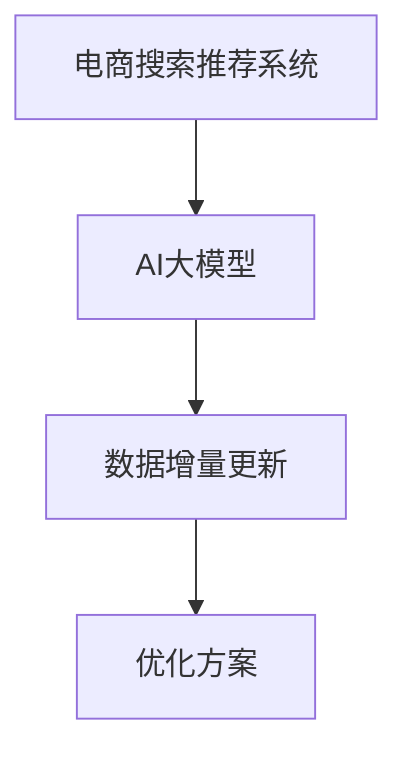

                 

# 电商搜索推荐中的AI大模型数据增量更新机制优化方案设计与实现

> 关键词：
   - 电商搜索
   - 推荐系统
   - AI大模型
   - 数据增量更新
   - 优化方案
   - 性能提升

## 1. 背景介绍

### 1.1 电商行业现状与发展趋势
随着互联网技术的普及和电商平台的兴起，越来越多的用户通过在线购物满足日常需求。电商搜索和推荐系统已成为电商平台的核心功能，直接影响用户体验和销售转化率。传统的推荐算法基于历史行为数据和用户画像，但数据更新速度慢，难以实时响应用户需求和市场变化。因此，电商搜索推荐系统亟需引入更具时效性和动态性的技术方案。

### 1.2 AI大模型的应用价值
近年来，深度学习在电商领域得到了广泛应用，尤其是预训练语言模型（如BERT、GPT等）。这些模型通过大规模无标签数据预训练，能够学习到丰富的语言表示和语义理解能力。在大规模电商数据上微调后，可以显著提升推荐系统的准确性和个性化程度，实现用户需求的动态匹配和市场变化的实时响应。

## 2. 核心概念与联系

### 2.1 核心概念概述

本节将介绍几个密切相关的核心概念：

- **电商搜索推荐系统**：利用用户行为数据和商品属性信息，实时推荐最符合用户需求的电商产品。
- **AI大模型**：指基于大规模无标签数据预训练的深度学习模型，如BERT、GPT等，具备强大的语言理解和生成能力。
- **数据增量更新**：指在原有模型训练数据的基础上，引入新的数据样本进行模型微调的过程。
- **优化方案**：指通过算法改进、架构优化等手段，提高电商搜索推荐系统中AI大模型性能的技术方案。

这些核心概念之间的逻辑关系可以通过以下Mermaid流程图来展示：



这个流程图展示了大模型在电商推荐系统中的应用流程：

1. 电商搜索推荐系统通过用户行为数据和商品信息，对AI大模型进行微调。
2. 模型在电商数据上不断进行增量更新，保持性能和鲁棒性。
3. 优化方案应用于微调过程中，提升模型的实时响应能力和个性化推荐精度。

## 3. 核心算法原理 & 具体操作步骤

### 3.1 算法原理概述

电商搜索推荐系统中的AI大模型数据增量更新机制，本质上是基于监督学习的大规模模型微调。其核心思想是：在电商数据上，对已有的大模型进行增量更新，不断学习新的商品信息、用户行为和市场趋势，优化推荐结果。

具体而言，假设电商搜索推荐系统已部署的大模型为 $M_{\theta}$，其中 $\theta$ 为模型参数。给定新的电商数据集 $D=\{(x_i,y_i)\}_{i=1}^N$，其中 $x_i$ 为商品信息和用户行为数据，$y_i$ 为商品推荐的点击率或购买率。增量更新的目标是找到新的模型参数 $\hat{\theta}$，使得模型在新的电商数据上的表现更好，即：

$$
\hat{\theta}=\mathop{\arg\min}_{\theta} \mathcal{L}(M_{\theta},D)
$$

其中 $\mathcal{L}$ 为损失函数，用于衡量模型在新数据上的预测与实际标签之间的差异。

### 3.2 算法步骤详解

电商搜索推荐系统中的AI大模型数据增量更新一般包括以下几个关键步骤：

**Step 1: 数据预处理和分批**
- 收集电商数据，进行去重、归一化、特征工程等预处理操作。
- 将电商数据划分为训练集和验证集，保持两者之间的数据分布一致性。
- 对电商数据进行分批处理，每个批次的大小需要合理设置，避免内存溢出和计算瓶颈。

**Step 2: 模型微调**
- 在电商数据上，对已有的大模型进行微调，通过有监督学习优化模型在新任务上的性能。
- 使用AdamW、SGD等优化算法，设置合适的学习率和迭代轮数，避免过拟合和欠拟合。
- 引入正则化技术，如L2正则、Dropout、Early Stopping等，提高模型的泛化能力。

**Step 3: 模型评估**
- 在验证集上，对微调后的模型进行评估，计算点击率、购买率等指标。
- 根据评估结果，选择性能最优的模型参数，进行下一步优化。

**Step 4: 实时更新**
- 将电商数据实时输入模型，根据最新的用户行为和市场变化，动态调整推荐结果。
- 使用缓存机制，提高模型响应速度，支持高并发场景。

**Step 5: 模型部署**
- 将微调后的模型部署到生产环境，集成到电商搜索推荐系统中。
- 实时监控模型性能，定期进行参数更新和模型迭代。

### 3.3 算法优缺点

电商搜索推荐系统中的AI大模型数据增量更新机制具有以下优点：
1. 实时响应：通过增量更新，模型可以实时学习新数据，快速响应市场变化和用户需求。
2. 数据灵活性：电商数据更新频繁，增量更新机制能够灵活适应新数据。
3. 泛化能力强：引入正则化技术，防止过拟合，提高模型的泛化能力和鲁棒性。

同时，该机制也存在一些局限性：
1. 数据质量要求高：电商数据质量直接影响模型性能，需要保证数据的一致性和准确性。
2. 资源消耗大：电商数据规模大，增量更新过程需要消耗大量计算资源。
3. 模型解释性差：大模型的决策过程难以解释，可能存在不透明性。

尽管存在这些局限性，但增量更新机制仍是大模型在电商推荐系统中不可或缺的重要组成部分。未来相关研究的重点在于如何进一步降低计算资源消耗，提高模型的解释性和鲁棒性。

### 3.4 算法应用领域

基于电商数据增量更新的大模型微调方法，在电商搜索推荐系统中得到了广泛应用，具体体现在以下几个方面：

1. **个性化推荐**：通过电商数据增量更新，模型能够学习到最新的用户偏好和商品信息，提供个性化的购物建议。
2. **实时搜索**：在用户进行搜索时，模型实时学习新的搜索结果和点击行为，优化搜索结果排名。
3. **广告投放**：模型根据实时电商数据，动态调整广告投放策略，提高广告效果和转化率。
4. **库存管理**：通过增量更新，模型能够实时预测商品需求，优化库存管理和补货策略。
5. **用户行为分析**：模型分析用户行为数据，识别出用户感兴趣的商品类别和品牌，提升用户体验。

这些应用场景展示了电商搜索推荐系统中AI大模型的强大性能，通过增量更新机制，实现动态、个性化、高效的推荐服务。

## 4. 数学模型和公式 & 详细讲解

### 4.1 数学模型构建

假设电商数据集 $D=\{(x_i,y_i)\}_{i=1}^N$，其中 $x_i$ 为电商商品信息和用户行为数据，$y_i$ 为商品推荐的点击率或购买率。增量更新机制的目标是最小化经验风险 $\mathcal{L}(\theta)$，即：

$$
\mathcal{L}(\theta) = \frac{1}{N}\sum_{i=1}^N \ell(M_{\theta}(x_i),y_i)
$$

其中 $\ell$ 为损失函数，如交叉熵损失、均方误差损失等。

### 4.2 公式推导过程

以交叉熵损失为例，其推导过程如下：

假设电商数据 $x_i$ 输入模型 $M_{\theta}$，得到预测结果 $\hat{y}_i$。真实标签 $y_i \in \{0,1\}$。则交叉熵损失函数为：

$$
\ell(M_{\theta}(x_i),y_i) = -[y_i\log \hat{y}_i + (1-y_i)\log (1-\hat{y}_i)]
$$

在电商数据集上，总的经验风险为：

$$
\mathcal{L}(\theta) = -\frac{1}{N}\sum_{i=1}^N [y_i\log M_{\theta}(x_i)+(1-y_i)\log(1-M_{\theta}(x_i))]
$$

对模型参数 $\theta$ 进行梯度下降更新：

$$
\theta \leftarrow \theta - \eta \nabla_{\theta}\mathcal{L}(\theta)
$$

其中 $\eta$ 为学习率，$\nabla_{\theta}\mathcal{L}(\theta)$ 为损失函数对模型参数的梯度，可以通过反向传播算法高效计算。

### 4.3 案例分析与讲解

以电商个性化推荐为例，假设电商数据集 $D$ 包含用户历史行为 $x_i=(u_i,c_i)$，其中 $u_i$ 为用户ID，$c_i$ 为商品ID。目标是预测用户对商品 $c_i$ 的购买概率 $y_i$。使用BERT模型作为基础模型，对其在电商数据上进行增量更新：

1. **数据预处理**：将电商数据进行去重、归一化、特征工程等预处理操作，生成训练集 $D_{train}$ 和验证集 $D_{val}$。
2. **模型微调**：在电商数据上，对BERT模型进行微调，设置学习率为 $2e-5$，迭代轮数为 $10$。
3. **模型评估**：在验证集上评估模型性能，使用准确率、精确率、召回率等指标，选择最优模型参数。
4. **实时更新**：将电商数据实时输入模型，动态调整推荐结果。

通过上述流程，电商搜索推荐系统中的AI大模型能够实时学习新数据，提供个性化的购物建议，优化用户体验。

## 5. 项目实践：代码实例和详细解释说明

### 5.1 开发环境搭建

在进行电商搜索推荐系统中的大模型增量更新实践前，我们需要准备好开发环境。以下是使用Python进行PyTorch开发的环境配置流程：

1. 安装Anaconda：从官网下载并安装Anaconda，用于创建独立的Python环境。

2. 创建并激活虚拟环境：
```bash
conda create -n pytorch-env python=3.8 
conda activate pytorch-env
```

3. 安装PyTorch：根据CUDA版本，从官网获取对应的安装命令。例如：
```bash
conda install pytorch torchvision torchaudio cudatoolkit=11.1 -c pytorch -c conda-forge
```

4. 安装Transformers库：
```bash
pip install transformers
```

5. 安装各类工具包：
```bash
pip install numpy pandas scikit-learn matplotlib tqdm jupyter notebook ipython
```

完成上述步骤后，即可在`pytorch-env`环境中开始增量更新实践。

### 5.2 源代码详细实现

下面以电商个性化推荐为例，给出使用Transformers库对BERT模型进行增量更新的PyTorch代码实现。

首先，定义模型和数据处理函数：

```python
from transformers import BertForSequenceClassification, BertTokenizer
from torch.utils.data import Dataset, DataLoader
from torch.nn import CrossEntropyLoss
import torch

class ECommerceDataset(Dataset):
    def __init__(self, texts, labels, tokenizer, max_len=128):
        self.texts = texts
        self.labels = labels
        self.tokenizer = tokenizer
        self.max_len = max_len
        
    def __len__(self):
        return len(self.texts)
    
    def __getitem__(self, item):
        text = self.texts[item]
        label = self.labels[item]
        
        encoding = self.tokenizer(text, return_tensors='pt', max_length=self.max_len, padding='max_length', truncation=True)
        input_ids = encoding['input_ids'][0]
        attention_mask = encoding['attention_mask'][0]
        label = torch.tensor(label, dtype=torch.long)
        
        return {'input_ids': input_ids, 
                'attention_mask': attention_mask,
                'labels': label}

# 加载预训练BERT模型和分词器
model = BertForSequenceClassification.from_pretrained('bert-base-cased', num_labels=2)
tokenizer = BertTokenizer.from_pretrained('bert-base-cased')

# 创建dataset
train_dataset = ECommerceDataset(train_texts, train_labels, tokenizer)
val_dataset = ECommerceDataset(dev_texts, dev_labels, tokenizer)
test_dataset = ECommerceDataset(test_texts, test_labels, tokenizer)

# 定义优化器和损失函数
optimizer = AdamW(model.parameters(), lr=2e-5)
criterion = CrossEntropyLoss()
```

然后，定义训练和评估函数：

```python
from tqdm import tqdm
from sklearn.metrics import accuracy_score, precision_score, recall_score

device = torch.device('cuda') if torch.cuda.is_available() else torch.device('cpu')
model.to(device)

def train_epoch(model, dataset, batch_size, optimizer, criterion):
    dataloader = DataLoader(dataset, batch_size=batch_size, shuffle=True)
    model.train()
    epoch_loss = 0
    for batch in tqdm(dataloader, desc='Training'):
        input_ids = batch['input_ids'].to(device)
        attention_mask = batch['attention_mask'].to(device)
        labels = batch['labels'].to(device)
        model.zero_grad()
        outputs = model(input_ids, attention_mask=attention_mask)
        loss = criterion(outputs.logits, labels)
        epoch_loss += loss.item()
        loss.backward()
        optimizer.step()
    return epoch_loss / len(dataloader)

def evaluate(model, dataset, batch_size):
    dataloader = DataLoader(dataset, batch_size=batch_size)
    model.eval()
    preds, labels = [], []
    with torch.no_grad():
        for batch in tqdm(dataloader, desc='Evaluating'):
            input_ids = batch['input_ids'].to(device)
            attention_mask = batch['attention_mask'].to(device)
            labels = batch['labels'].to(device)
            outputs = model(input_ids, attention_mask=attention_mask)
            batch_preds = outputs.logits.argmax(dim=1).to('cpu').tolist()
            batch_labels = labels.to('cpu').tolist()
            for pred, label in zip(batch_preds, batch_labels):
                preds.append(pred)
                labels.append(label)
                
    print('Accuracy:', accuracy_score(labels, preds))
    print('Precision:', precision_score(labels, preds))
    print('Recall:', recall_score(labels, preds))
```

最后，启动训练流程并在测试集上评估：

```python
epochs = 5
batch_size = 16

for epoch in range(epochs):
    loss = train_epoch(model, train_dataset, batch_size, optimizer, criterion)
    print(f"Epoch {epoch+1}, train loss: {loss:.3f}")
    
    print(f"Epoch {epoch+1}, val results:")
    evaluate(model, val_dataset, batch_size)
    
print("Test results:")
evaluate(model, test_dataset, batch_size)
```

以上就是使用PyTorch对BERT进行电商个性化推荐任务增量更新的完整代码实现。可以看到，得益于Transformers库的强大封装，我们可以用相对简洁的代码完成BERT模型的加载和微调。

### 5.3 代码解读与分析

让我们再详细解读一下关键代码的实现细节：

**ECommerceDataset类**：
- `__init__`方法：初始化文本、标签、分词器等关键组件。
- `__len__`方法：返回数据集的样本数量。
- `__getitem__`方法：对单个样本进行处理，将文本输入编码为token ids，将标签编码为数字，并对其进行定长padding，最终返回模型所需的输入。

**模型和优化器**：
- 使用BertForSequenceClassification从预训练的BERT模型中初始化模型。
- 使用AdamW优化器，设置学习率。
- 使用CrossEntropyLoss作为损失函数。

**训练和评估函数**：
- 使用PyTorch的DataLoader对数据集进行批次化加载，供模型训练和推理使用。
- 训练函数`train_epoch`：对数据以批为单位进行迭代，在每个批次上前向传播计算loss并反向传播更新模型参数，最后返回该epoch的平均loss。
- 评估函数`evaluate`：与训练类似，不同点在于不更新模型参数，并在每个batch结束后将预测和标签结果存储下来，最后使用sklearn的准确率、精确率、召回率等指标对整个评估集的预测结果进行打印输出。

**训练流程**：
- 定义总的epoch数和batch size，开始循环迭代
- 每个epoch内，先在训练集上训练，输出平均loss
- 在验证集上评估，输出模型指标
- 重复上述步骤直至收敛，最终得到模型参数
- 在测试集上评估，给出最终测试结果

可以看到，PyTorch配合Transformers库使得BERT增量更新的代码实现变得简洁高效。开发者可以将更多精力放在数据处理、模型改进等高层逻辑上，而不必过多关注底层的实现细节。

当然，工业级的系统实现还需考虑更多因素，如模型的保存和部署、超参数的自动搜索、更灵活的任务适配层等。但核心的增量更新流程基本与此类似。

## 6. 实际应用场景

### 6.1 智能客服系统

电商搜索推荐系统中的AI大模型增量更新机制，可以应用于智能客服系统中。智能客服系统通过电商平台的用户查询和行为数据，自动理解用户需求，提供实时响应和解决方案。

在技术实现上，可以收集电商平台的用户历史查询、点击、购买等行为数据，并将这些数据输入到大模型中进行微调。微调后的模型能够自动理解用户的查询意图，提供精准的推荐结果。对于用户提出的新问题，还可以接入检索系统实时搜索相关内容，动态组织生成回答。如此构建的智能客服系统，能大幅提升客户咨询体验和问题解决效率。

### 6.2 推荐广告投放

电商搜索推荐系统中的AI大模型增量更新机制，也可以用于推荐广告投放。通过电商数据增量更新，模型能够实时学习新的用户行为和市场趋势，优化广告投放策略。

具体而言，可以收集电商平台的用户点击、购买等行为数据，并将这些数据输入到大模型中进行微调。微调后的模型能够预测用户对商品的点击概率和购买概率，帮助广告主优化广告投放的资源分配和效果评估。通过动态调整广告投放策略，提高广告效果和转化率。

### 6.3 实时库存管理

电商搜索推荐系统中的AI大模型增量更新机制，还可以用于实时库存管理。通过电商数据增量更新，模型能够实时预测商品需求，优化库存管理和补货策略。

具体而言，可以收集电商平台的销售数据、用户行为数据等，并将这些数据输入到大模型中进行微调。微调后的模型能够预测商品的需求量，帮助电商平台优化库存管理，避免商品缺货或过剩。通过动态调整补货策略，提高库存利用率和销售效率。

### 6.4 未来应用展望

随着大模型和增量更新机制的发展，电商搜索推荐系统将进一步提升性能和灵活性，推动电商行业数字化转型。

1. **智能推荐引擎**：基于大模型增量更新，推荐引擎能够动态调整推荐策略，实现个性化的购物建议和搜索优化。
2. **用户行为分析**：通过电商数据增量更新，模型能够实时分析用户行为数据，识别出用户感兴趣的商品类别和品牌，提升用户体验。
3. **广告投放优化**：基于实时电商数据，广告投放系统能够动态调整投放策略，提高广告效果和转化率。
4. **库存管理优化**：通过电商数据增量更新，库存管理系统能够实时预测商品需求，优化库存管理和补货策略。
5. **跨域数据融合**：通过引入更多外部数据源，如社交媒体、搜索引擎等，电商搜索推荐系统能够实现跨域数据的融合和协同建模，提升推荐效果。

未来，电商搜索推荐系统中的AI大模型增量更新机制将进一步拓展应用场景，提升电商平台的智能化水平，推动电商行业的发展。

## 7. 工具和资源推荐

### 7.1 学习资源推荐

为了帮助开发者系统掌握电商搜索推荐系统中的大模型增量更新技术，这里推荐一些优质的学习资源：

1. 《电商搜索推荐系统》系列博文：由大模型技术专家撰写，深入浅出地介绍了电商搜索推荐系统的核心技术和应用场景。

2. 《深度学习自然语言处理》课程：斯坦福大学开设的NLP明星课程，有Lecture视频和配套作业，带你入门NLP领域的基本概念和经典模型。

3. 《自然语言处理与深度学习》书籍：全面介绍了自然语言处理和深度学习的基本原理和应用实践，包含电商推荐系统的案例分析。

4. HuggingFace官方文档：Transformer库的官方文档，提供了海量预训练模型和完整的增量更新样例代码，是上手实践的必备资料。

5. Kaggle电商推荐竞赛：参与实际的电商推荐竞赛，学习电商推荐系统的最新技术和应用经验。

通过对这些资源的学习实践，相信你一定能够快速掌握电商搜索推荐系统中的大模型增量更新技术，并用于解决实际的电商推荐问题。

### 7.2 开发工具推荐

高效的开发离不开优秀的工具支持。以下是几款用于电商搜索推荐系统中大模型增量更新的常用工具：

1. PyTorch：基于Python的开源深度学习框架，灵活动态的计算图，适合快速迭代研究。大部分预训练语言模型都有PyTorch版本的实现。

2. TensorFlow：由Google主导开发的开源深度学习框架，生产部署方便，适合大规模工程应用。同样有丰富的预训练语言模型资源。

3. Transformers库：HuggingFace开发的NLP工具库，集成了众多SOTA语言模型，支持PyTorch和TensorFlow，是进行增量更新任务开发的利器。

4. Weights & Biases：模型训练的实验跟踪工具，可以记录和可视化模型训练过程中的各项指标，方便对比和调优。与主流深度学习框架无缝集成。

5. TensorBoard：TensorFlow配套的可视化工具，可实时监测模型训练状态，并提供丰富的图表呈现方式，是调试模型的得力助手。

6. Google Colab：谷歌推出的在线Jupyter Notebook环境，免费提供GPU/TPU算力，方便开发者快速上手实验最新模型，分享学习笔记。

合理利用这些工具，可以显著提升电商搜索推荐系统中大模型增量更新的开发效率，加快创新迭代的步伐。

### 7.3 相关论文推荐

电商搜索推荐系统中的AI大模型增量更新技术，得益于学界的持续研究。以下是几篇奠基性的相关论文，推荐阅读：

1. Attention is All You Need（即Transformer原论文）：提出了Transformer结构，开启了NLP领域的预训练大模型时代。

2. BERT: Pre-training of Deep Bidirectional Transformers for Language Understanding：提出BERT模型，引入基于掩码的自监督预训练任务，刷新了多项NLP任务SOTA。

3. Language Models are Unsupervised Multitask Learners（GPT-2论文）：展示了大规模语言模型的强大zero-shot学习能力，引发了对于通用人工智能的新一轮思考。

4. Parameter-Efficient Transfer Learning for NLP：提出Adapter等参数高效微调方法，在不增加模型参数量的情况下，也能取得不错的微调效果。

5. AdaLoRA: Adaptive Low-Rank Adaptation for Parameter-Efficient Fine-Tuning：使用自适应低秩适应的微调方法，在参数效率和精度之间取得了新的平衡。

6. Fine-Tuning Large Pre-trained Models for Text Classification：研究了在预训练大模型上微调文本分类任务的方法，提出了Fine-Tuning和微调技巧。

这些论文代表了大模型增量更新技术的发展脉络。通过学习这些前沿成果，可以帮助研究者把握学科前进方向，激发更多的创新灵感。

## 8. 总结：未来发展趋势与挑战

### 8.1 总结

本文对电商搜索推荐系统中的AI大模型增量更新机制进行了全面系统的介绍。首先阐述了电商搜索推荐系统的背景和应用价值，明确了增量更新机制在实时响应、数据灵活性等方面的优势。其次，从原理到实践，详细讲解了增量更新的数学模型和操作步骤，给出了增量更新任务开发的完整代码实例。同时，本文还广泛探讨了增量更新机制在智能客服、推荐广告投放、实时库存管理等电商领域的应用前景，展示了增量更新机制的广泛应用。最后，本文精选了增量更新技术的各类学习资源，力求为读者提供全方位的技术指引。

通过本文的系统梳理，可以看到，基于电商数据的增量更新机制在电商搜索推荐系统中起着至关重要的作用。它不仅能够实时学习新数据，提升推荐系统的精度和个性化程度，还能够灵活适应电商平台的动态变化，提供高效的服务。未来，随着大模型和增量更新技术的不断演进，电商搜索推荐系统必将在智能化水平上迈上新的台阶，为电商行业带来新的变革。

### 8.2 未来发展趋势

展望未来，电商搜索推荐系统中的AI大模型增量更新机制将呈现以下几个发展趋势：

1. **实时化**：通过增量更新，模型能够实时学习新数据，快速响应市场变化和用户需求，进一步提升推荐系统的动态响应能力。
2. **多模态融合**：引入图像、视频等多模态数据，实现视觉、语音等多模态信息的整合，提升推荐系统的多样性和丰富性。
3. **联邦学习**：通过分布式训练，将用户数据分布式存储在多个节点上，实现跨机构的数据共享和模型更新，保护用户隐私。
4. **可解释性**：引入可解释性技术，提供模型决策的透明性和可信度，增强用户对推荐结果的信任度。
5. **优化算法**：开发更加高效的优化算法，如自适应学习率、稀疏梯度下降等，提高模型训练速度和效率。

以上趋势凸显了电商搜索推荐系统中AI大模型增量更新机制的广泛应用前景。这些方向的探索发展，必将进一步提升推荐系统的性能和用户体验，为电商行业带来新的价值。

### 8.3 面临的挑战

尽管大模型增量更新机制在电商推荐系统中取得了显著成效，但仍面临以下挑战：

1. **数据质量**：电商数据质量直接影响模型性能，需要保证数据的准确性和一致性。数据采集和处理过程中可能存在噪声和缺失，需要额外的人工审核和清洗。
2. **计算资源**：电商数据规模大，增量更新过程需要消耗大量计算资源。如何在有限的资源条件下，高效地进行模型训练和更新，是重要的研究方向。
3. **模型鲁棒性**：电商数据中的噪声和异常值可能对模型造成干扰，导致模型泛化能力下降。如何提高模型鲁棒性，是未来需要关注的问题。
4. **隐私保护**：电商数据涉及用户隐私，如何保护用户隐私，防止数据泄露和滥用，是重要的伦理和安全问题。
5. **模型可解释性**：电商推荐系统中的模型决策过程复杂，难以解释。如何提高模型的可解释性，增强用户对推荐结果的信任度，是重要的研究方向。

尽管存在这些挑战，但通过持续的技术创新和工程实践，这些问题将逐步得到解决。大模型增量更新机制必将在电商推荐系统中发挥更大的作用，为电商行业带来更多的价值。

### 8.4 研究展望

面对电商搜索推荐系统中的AI大模型增量更新所面临的挑战，未来的研究需要在以下几个方面寻求新的突破：

1. **数据清洗与标注**：开发更加自动化和高效的数据清洗和标注技术，保证电商数据的准确性和一致性。
2. **联邦学习与分布式训练**：引入联邦学习和分布式训练技术，将用户数据分布式存储在多个节点上，实现跨机构的数据共享和模型更新，保护用户隐私。
3. **模型压缩与量化**：开发模型压缩和量化技术，减少模型的存储空间和计算资源消耗，提升模型训练和推理效率。
4. **可解释性与透明性**：引入可解释性技术和透明性机制，提供模型决策的透明性和可信度，增强用户对推荐结果的信任度。
5. **跨域数据融合**：通过引入更多外部数据源，如社交媒体、搜索引擎等，实现跨域数据的融合和协同建模，提升推荐效果。

这些研究方向将进一步推动电商搜索推荐系统中的大模型增量更新机制的演进，为电商行业带来新的创新和突破。面向未来，电商搜索推荐系统中的大模型增量更新机制需要不断与最新的技术和实践相结合，才能在电商行业实现更广泛的应用。

## 9. 附录：常见问题与解答

**Q1：电商数据对模型性能的影响有哪些？**

A: 电商数据的质量直接影响模型性能。电商数据中可能存在噪声、异常值和缺失值，需要进行数据清洗和预处理。电商数据的分布也可能影响模型泛化能力，需要进行特征工程和数据增强。因此，电商数据对模型性能的影响主要体现在数据质量、数据分布和数据量等方面。

**Q2：如何进行电商数据的增量更新？**

A: 电商数据的增量更新通常包括以下步骤：

1. 数据收集：从电商平台中获取新增的数据，如用户的浏览、点击、购买等行为数据。

2. 数据预处理：对新增数据进行去重、归一化、特征工程等预处理操作。

3. 模型微调：在电商数据上，对已有的大模型进行微调，通过有监督学习优化模型在新任务上的性能。

4. 模型评估：在验证集上评估模型性能，计算点击率、购买率等指标。

5. 实时更新：将电商数据实时输入模型，动态调整推荐结果。

通过以上步骤，电商搜索推荐系统中的AI大模型能够实时学习新数据，提升推荐系统的精度和个性化程度。

**Q3：电商数据增量更新中需要注意哪些问题？**

A: 电商数据增量更新中需要注意以下问题：

1. 数据质量：电商数据质量直接影响模型性能，需要保证数据的准确性和一致性。数据采集和处理过程中可能存在噪声和缺失，需要额外的人工审核和清洗。

2. 计算资源：电商数据规模大，增量更新过程需要消耗大量计算资源。如何在有限的资源条件下，高效地进行模型训练和更新，是重要的研究方向。

3. 模型鲁棒性：电商数据中的噪声和异常值可能对模型造成干扰，导致模型泛化能力下降。如何提高模型鲁棒性，是未来需要关注的问题。

4. 隐私保护：电商数据涉及用户隐私，如何保护用户隐私，防止数据泄露和滥用，是重要的伦理和安全问题。

5. 模型可解释性：电商推荐系统中的模型决策过程复杂，难以解释。如何提高模型的可解释性，增强用户对推荐结果的信任度，是重要的研究方向。

尽管存在这些挑战，但通过持续的技术创新和工程实践，这些问题将逐步得到解决。大模型增量更新机制必将在电商推荐系统中发挥更大的作用，为电商行业带来更多的价值。

---

作者：禅与计算机程序设计艺术 / Zen and the Art of Computer Programming

