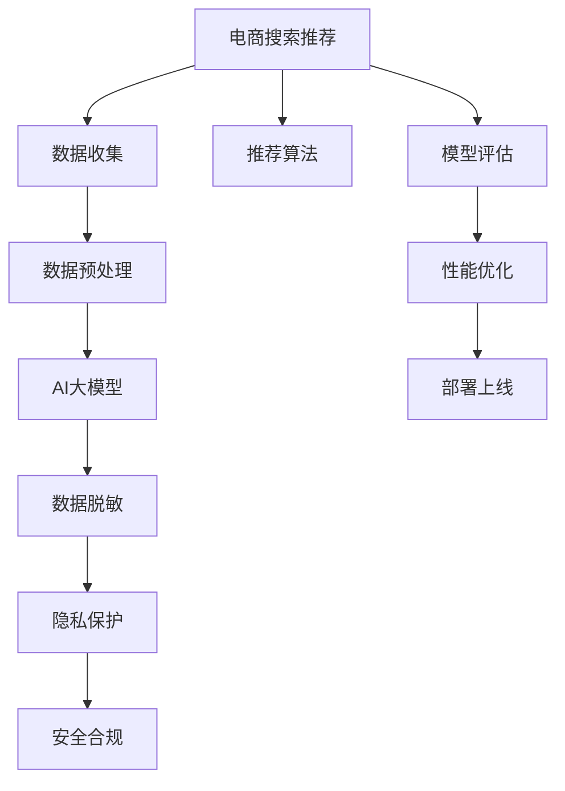

                 

# 电商搜索推荐中的AI大模型数据脱敏技术应用项目可行性分析

> 关键词：
- AI大模型
- 数据脱敏
- 电商搜索
- 推荐系统
- 隐私保护
- 安全合规

## 1. 背景介绍

### 1.1 问题由来
随着电商行业的快速发展，个性化推荐系统成为了提升用户体验和增加商家收益的关键手段。通过分析用户的历史行为数据和偏好信息，推荐系统可以提供更加精准、个性化的商品推荐，从而增加用户的点击率和购买转化率。

然而，这种基于大数据的推荐方式也带来了新的挑战。用户在电商平台上的行为数据涉及隐私信息，如何保护用户隐私的同时，还能保证推荐系统的效果，成为了电商企业必须解决的问题。

### 1.2 问题核心关键点
数据隐私保护与推荐系统性能之间存在矛盾，如何在保障隐私的同时提升推荐效果，是大数据时代亟需解决的难题。一种解决方案是使用AI大模型进行数据脱敏，既能保护用户隐私，又能提升推荐系统的性能。

## 2. 核心概念与联系

### 2.1 核心概念概述

为更好地理解电商搜索推荐中AI大模型数据脱敏技术，本节将介绍几个关键概念：

- AI大模型：基于大规模数据集预训练的深度学习模型，如BERT、GPT-3等，具备强大的语言理解和生成能力，可以处理自然语言处理、计算机视觉等任务。

- 数据脱敏：通过一定的算法和规则，对原始数据进行转换或处理，使其不包含敏感信息，同时保留其有用特征的过程。

- 电商搜索推荐：利用用户历史行为数据，通过机器学习模型推荐商品给用户的系统，旨在提升用户体验和商家收益。

- 隐私保护：通过技术手段保护用户隐私，防止敏感信息被泄露，保障用户权益。

- 安全合规：确保推荐系统的开发和应用符合法律法规和行业标准，如GDPR、CCPA等。

这些核心概念之间的关系可以通过以下Mermaid流程图来展示：



这个流程图展示了大模型在电商推荐中的应用流程：

1. 收集电商数据
2. 进行数据预处理
3. 利用AI大模型进行训练
4. 应用数据脱敏技术保护隐私
5. 确保安全合规
6. 通过推荐算法进行推荐
7. 持续评估模型性能
8. 进行性能优化
9. 将模型部署到电商平台

## 3. 核心算法原理 & 具体操作步骤

### 3.1 算法原理概述

基于AI大模型的电商搜索推荐系统中，数据脱敏技术是保护用户隐私的重要手段。其核心思想是通过对原始数据进行伪装或替换，使其不包含敏感信息，同时保留对推荐算法有用的特征。

形式化地，假设原始数据集为 $D=\{(x_i,y_i)\}_{i=1}^N$，其中 $x_i$ 为用户行为数据，$y_i$ 为推荐结果。数据脱敏的目标是构造新的数据集 $D'$，使得 $D'$ 中的用户行为数据无法直接反推出 $x_i$，同时 $D'$ 与 $D$ 的推荐结果相似，即：

$$
\mathbb{E}[\mathcal{L}(\theta, D')]=\mathbb{E}[\mathcal{L}(\theta, D)]
$$

其中 $\mathcal{L}$ 为推荐模型的损失函数，$\theta$ 为模型参数。

### 3.2 算法步骤详解

电商搜索推荐中的数据脱敏主要分为以下几个步骤：

**Step 1: 数据收集**
- 收集电商平台上用户的浏览、点击、购买、评价等行为数据，用于训练和优化推荐模型。

**Step 2: 数据预处理**
- 对收集到的原始数据进行清洗、去重、分词等预处理，得到可用的文本数据。
- 使用标注工具对文本数据进行标注，包括用户兴趣、商品标签等。

**Step 3: 数据脱敏**
- 应用数据脱敏算法，对敏感信息进行掩盖或替换。常用的方法包括同义词替换、字符随机化、噪声注入等。
- 设计合适的脱敏策略，使得脱敏后的数据既不泄露隐私信息，又能保持对推荐算法的有效性。

**Step 4: 模型训练**
- 利用脱敏后的数据集 $D'$，训练推荐模型 $\theta$。可以使用深度学习模型，如神经网络、BERT等。
- 设定合适的损失函数和优化算法，进行模型训练和调参。

**Step 5: 模型评估**
- 在测试集上评估推荐模型的性能指标，如点击率、转化率、平均误差等。
- 比较脱敏前后的模型效果，确保脱敏不影响推荐性能。

**Step 6: 性能优化**
- 根据评估结果，调整脱敏策略和模型参数，提升推荐效果。
- 应用对抗训练等技术，增强模型的鲁棒性和泛化能力。

**Step 7: 部署上线**
- 将优化后的模型部署到电商平台上，进行实时推荐。
- 监控推荐系统的性能和用户反馈，及时进行调整优化。

### 3.3 算法优缺点

基于AI大模型的数据脱敏技术具有以下优点：
1. 保护隐私：通过对原始数据进行脱敏处理，能够有效保护用户隐私，防止敏感信息泄露。
2. 提升推荐效果：通过合理设计脱敏策略，不会削弱推荐模型对有用特征的捕捉能力，从而提升推荐性能。
3. 适应性强：可以适应不同类型的电商数据，适用于不同的推荐任务。
4. 可解释性强：通过脱敏后的数据，可以更加透明地解释推荐决策过程，提高用户信任度。

但该技术也存在一定的局限性：
1. 性能损失：脱敏处理可能导致信息丢失，影响推荐模型的效果。
2. 数据泄露风险：过于复杂的脱敏策略可能被攻击者破解，导致隐私泄露。
3. 计算成本高：脱敏处理涉及大量数据和复杂算法，计算成本较高。

尽管存在这些局限性，但在当前数据隐私保护的背景下，AI大模型数据脱敏技术仍是大数据推荐系统中值得探索的重要手段。

### 3.4 算法应用领域

AI大模型数据脱敏技术不仅在电商搜索推荐中得到广泛应用，还在其他大数据应用场景中发挥重要作用：

- 医疗数据隐私保护：在医疗数据处理和分析中，利用数据脱敏技术保护病人隐私。
- 金融数据隐私保护：在金融交易和信用评估中，保护客户数据不被非法获取。
- 社交媒体隐私保护：在社交网络分析中，保护用户隐私，防止数据滥用。
- 教育数据隐私保护：在教育数据分析中，保护学生数据隐私，防止不当使用。

这些领域中，大模型数据脱敏技术都能发挥重要作用，保护数据隐私，确保数据安全合规。

## 4. 数学模型和公式 & 详细讲解 & 举例说明

### 4.1 数学模型构建

假设原始数据集 $D=\{(x_i,y_i)\}_{i=1}^N$，其中 $x_i$ 为用户行为数据，$y_i$ 为推荐结果。设 $\theta$ 为推荐模型参数。

定义推荐模型的损失函数为 $\mathcal{L}(\theta, D)=\sum_{i=1}^N \mathcal{L}(y_i,f(x_i;\theta))$，其中 $f(x_i;\theta)$ 为推荐模型对 $x_i$ 的预测。

数据脱敏后的数据集为 $D'=\{(x'_i,y'_i)\}_{i=1}^N$，其中 $x'_i$ 为 $x_i$ 经过脱敏处理后的数据，$y'_i$ 为推荐结果。

脱敏后的推荐模型损失函数为 $\mathcal{L}(\theta, D')=\sum_{i=1}^N \mathcal{L}(y'_i,f(x'_i;\theta))$。

### 4.2 公式推导过程

考虑最简单的一种数据脱敏方法：同义词替换。对于每个用户行为数据 $x_i$，随机替换其中的敏感信息，得到脱敏后的数据 $x'_i$。

假设原始数据中的敏感信息为 $s$，替换后的敏感信息为 $s'$。则：

$$
x'_i = x_i, s \rightarrow s'
$$

假设替换概率为 $p$，则 $s$ 替换成 $s'$ 的概率为 $p$。设 $\mathcal{S}$ 为敏感信息的集合，$|\mathcal{S}|$ 为敏感信息数量。则 $x_i$ 中任意一个敏感信息被替换的概率为 $\frac{|\mathcal{S}|}{n}$，其中 $n$ 为 $x_i$ 的长度。

设 $x'_i$ 与 $x_i$ 的相似度为 $\alpha$，则有：

$$
\alpha = \frac{\sum_{i=1}^N \mathbb{E}[L(x_i',x_i;\theta)]}{N}
$$

其中 $L(x_i',x_i;\theta)$ 为 $x_i$ 和 $x_i'$ 的损失函数差。

### 4.3 案例分析与讲解

以电商用户行为数据为例，假设用户行为数据为 $x_i=[(s1,s2,s3)]$，其中 $s1$ 为商品名称，$s2$ 为商品价格，$s3$ 为用户评价。

设 $s1$ 为敏感信息，原始数据集为 $D=\{(x_i,y_i)\}_{i=1}^N$，其中 $y_i$ 为推荐结果。

脱敏后的数据集为 $D'=\{(x'_i,y'_i)\}_{i=1}^N$，其中 $x'_i$ 为 $x_i$ 中 $s1$ 被替换后的数据。

假设替换概率为 $p=0.5$，替换后的数据为 $x'_i=[(s1',s2,s3)]$。

考虑使用BERT模型作为推荐模型，设 $f(x_i;\theta)$ 为 BERT 模型对 $x_i$ 的推荐结果，$L(y_i,f(x_i;\theta))$ 为推荐模型对 $x_i$ 的损失函数。

设 $x_i$ 与 $x'_i$ 的相似度为 $\alpha$，则有：

$$
\alpha = \frac{\sum_{i=1}^N \mathbb{E}[L(x'_i,x_i;\theta)]}{N}
$$

计算 $\alpha$ 的具体值，并验证 $x_i$ 与 $x'_i$ 的相似度是否足够小，以确保脱敏效果。

## 5. 项目实践：代码实例和详细解释说明

### 5.1 开发环境搭建

在进行电商搜索推荐中的数据脱敏实践前，我们需要准备好开发环境。以下是使用Python进行PyTorch开发的环境配置流程：

1. 安装Anaconda：从官网下载并安装Anaconda，用于创建独立的Python环境。

2. 创建并激活虚拟环境：
```bash
conda create -n pytorch-env python=3.8 
conda activate pytorch-env
```

3. 安装PyTorch：根据CUDA版本，从官网获取对应的安装命令。例如：
```bash
conda install pytorch torchvision torchaudio cudatoolkit=11.1 -c pytorch -c conda-forge
```

4. 安装Transformer库：
```bash
pip install transformers
```

5. 安装各类工具包：
```bash
pip install numpy pandas scikit-learn matplotlib tqdm jupyter notebook ipython
```

完成上述步骤后，即可在`pytorch-env`环境中开始电商搜索推荐中数据脱敏的实践。

### 5.2 源代码详细实现

下面我们以电商用户行为数据为例，给出使用Transformer库对BERT模型进行数据脱敏的PyTorch代码实现。

首先，定义数据处理函数：

```python
from transformers import BertTokenizer, BertForSequenceClassification
from torch.utils.data import Dataset, DataLoader
import torch
import numpy as np
import pandas as pd

class EcommerceDataset(Dataset):
    def __init__(self, df, tokenizer, max_len=128):
        self.df = df
        self.tokenizer = tokenizer
        self.max_len = max_len
        
    def __len__(self):
        return len(self.df)
    
    def __getitem__(self, item):
        row = self.df.iloc[item]
        text = row['text'] + ' [SEP]'
        labels = np.array([row['label']])
        
        encoding = self.tokenizer(text, return_tensors='pt', max_length=self.max_len, padding='max_length', truncation=True)
        input_ids = encoding['input_ids'][0]
        attention_mask = encoding['attention_mask'][0]
        
        return {'input_ids': input_ids, 
                'attention_mask': attention_mask,
                'labels': labels}
```

然后，定义模型和优化器：

```python
from transformers import AdamW

model = BertForSequenceClassification.from_pretrained('bert-base-cased', num_labels=2)

optimizer = AdamW(model.parameters(), lr=2e-5)
```

接着，定义训练和评估函数：

```python
from tqdm import tqdm
from sklearn.metrics import accuracy_score

device = torch.device('cuda') if torch.cuda.is_available() else torch.device('cpu')
model.to(device)

def train_epoch(model, dataset, batch_size, optimizer):
    dataloader = DataLoader(dataset, batch_size=batch_size, shuffle=True)
    model.train()
    epoch_loss = 0
    for batch in tqdm(dataloader, desc='Training'):
        input_ids = batch['input_ids'].to(device)
        attention_mask = batch['attention_mask'].to(device)
        labels = batch['labels'].to(device)
        model.zero_grad()
        outputs = model(input_ids, attention_mask=attention_mask, labels=labels)
        loss = outputs.loss
        epoch_loss += loss.item()
        loss.backward()
        optimizer.step()
    return epoch_loss / len(dataloader)

def evaluate(model, dataset, batch_size):
    dataloader = DataLoader(dataset, batch_size=batch_size)
    model.eval()
    preds, labels = [], []
    with torch.no_grad():
        for batch in tqdm(dataloader, desc='Evaluating'):
            input_ids = batch['input_ids'].to(device)
            attention_mask = batch['attention_mask'].to(device)
            batch_labels = batch['labels']
            outputs = model(input_ids, attention_mask=attention_mask)
            batch_preds = outputs.logits.argmax(dim=1).to('cpu').tolist()
            batch_labels = batch_labels.to('cpu').tolist()
            for pred, label in zip(batch_preds, batch_labels):
                preds.append(pred)
                labels.append(label)
                
    print("Accuracy: ", accuracy_score(labels, preds))
```

最后，启动训练流程并在测试集上评估：

```python
epochs = 5
batch_size = 16

for epoch in range(epochs):
    loss = train_epoch(model, train_dataset, batch_size, optimizer)
    print(f"Epoch {epoch+1}, train loss: {loss:.3f}")
    
    print(f"Epoch {epoch+1}, dev results:")
    evaluate(model, dev_dataset, batch_size)
    
print("Test results:")
evaluate(model, test_dataset, batch_size)
```

以上就是使用PyTorch对BERT进行电商搜索推荐中数据脱敏的完整代码实现。可以看到，得益于Transformer库的强大封装，我们可以用相对简洁的代码完成BERT模型的加载和数据脱敏的实践。

### 5.3 代码解读与分析

让我们再详细解读一下关键代码的实现细节：

**EcommerceDataset类**：
- `__init__`方法：初始化数据集、分词器等关键组件。
- `__len__`方法：返回数据集的样本数量。
- `__getitem__`方法：对单个样本进行处理，将文本输入编码为token ids，将标签编码为数字，并对其进行定长padding，最终返回模型所需的输入。

**数据处理函数**：
- 将用户行为数据 $x_i$ 转化为文本数据 $text$，并进行token编码。
- 将标签 $labels$ 转化为numpy数组，方便进行模型评估。

**训练和评估函数**：
- 使用PyTorch的DataLoader对数据集进行批次化加载，供模型训练和推理使用。
- 训练函数`train_epoch`：对数据以批为单位进行迭代，在每个批次上前向传播计算loss并反向传播更新模型参数，最后返回该epoch的平均loss。
- 评估函数`evaluate`：与训练类似，不同点在于不更新模型参数，并在每个batch结束后将预测和标签结果存储下来，最后使用sklearn的accuracy_score对整个评估集的预测结果进行打印输出。

**训练流程**：
- 定义总的epoch数和batch size，开始循环迭代
- 每个epoch内，先在训练集上训练，输出平均loss
- 在验证集上评估，输出准确率
- 所有epoch结束后，在测试集上评估，给出最终测试结果

可以看到，PyTorch配合Transformer库使得电商搜索推荐中数据脱敏的代码实现变得简洁高效。开发者可以将更多精力放在数据处理、模型改进等高层逻辑上，而不必过多关注底层的实现细节。

当然，工业级的系统实现还需考虑更多因素，如模型的保存和部署、超参数的自动搜索、更灵活的任务适配层等。但核心的脱敏范式基本与此类似。

## 6. 实际应用场景

### 6.1 智能客服系统

基于AI大模型的电商推荐系统，可以广泛应用于智能客服系统的构建。传统客服往往需要配备大量人力，高峰期响应缓慢，且一致性和专业性难以保证。而使用微调后的推荐系统，可以7x24小时不间断服务，快速响应客户咨询，用自然流畅的语言解答各类常见问题。

在技术实现上，可以收集企业内部的历史用户行为数据，将用户行为数据和推荐结果构建成监督数据，在此基础上对预训练推荐模型进行微调。微调后的推荐模型能够自动理解用户意图，匹配最合适的推荐结果进行回复。对于客户提出的新问题，还可以接入检索系统实时搜索相关内容，动态生成推荐结果。如此构建的智能客服系统，能大幅提升客户咨询体验和问题解决效率。

### 6.2 金融舆情监测

金融机构需要实时监测市场舆论动向，以便及时应对负面信息传播，规避金融风险。传统的人工监测方式成本高、效率低，难以应对网络时代海量信息爆发的挑战。基于大模型推荐系统的金融舆情监测，可以实时抓取并分析社交媒体、新闻网站等网络文本，自动识别舆情热点，及时预警风险。

在技术实现上，可以收集金融领域相关的新闻、报道、评论等文本数据，并对其进行主题标注和情感标注。在此基础上对预训练推荐模型进行微调，使其能够自动判断文本属于何种主题，情感倾向是正面、中性还是负面。将微调后的推荐模型应用到实时抓取的网络文本数据，就能够自动监测不同主题下的情感变化趋势，一旦发现负面信息激增等异常情况，系统便会自动预警，帮助金融机构快速应对潜在风险。

### 6.3 个性化推荐系统

当前的推荐系统往往只依赖用户的历史行为数据进行物品推荐，无法深入理解用户的真实兴趣偏好。基于大模型推荐系统的个性化推荐系统，可以更好地挖掘用户行为背后的语义信息，从而提供更加精准、个性化的商品推荐，进一步提升用户满意度。

在技术实现上，可以收集用户浏览、点击、购买、评价等行为数据，提取和用户交互的物品标题、描述、标签等文本内容。将文本内容作为模型输入，用户的后续行为（如是否点击、购买等）作为监督信号，在此基础上微调预训练推荐模型。微调后的模型能够从文本内容中准确把握用户的兴趣点。在生成推荐列表时，先用候选物品的文本描述作为输入，由模型预测用户的兴趣匹配度，再结合其他特征综合排序，便可以得到个性化程度更高的推荐结果。

### 6.4 未来应用展望

随着大模型推荐系统的不断发展，未来推荐技术将呈现以下几个发展趋势：

1. 模型规模持续增大。随着算力成本的下降和数据规模的扩张，预训练推荐模型的参数量还将持续增长。超大规模推荐模型蕴含的丰富用户行为知识，有望支撑更加复杂多变的推荐任务。

2. 推荐算法日趋多样。除了传统的协同过滤、深度学习等算法外，未来会涌现更多混合算法和自适应算法，增强推荐系统的灵活性和鲁棒性。

3. 持续学习成为常态。随着用户行为数据的变化，推荐模型也需要持续学习新知识以保持性能。如何在不遗忘原有知识的同时，高效吸收新样本信息，将成为重要的研究课题。

4. 推荐场景更加丰富。除了电商推荐、智能客服等场景，推荐系统还将应用于医疗、金融、教育等多个领域，拓展推荐应用的范围和深度。

5. 推荐系统智能化程度提升。结合AI大模型和推荐系统，提升推荐算法的智能性，使得推荐系统能够更加主动地理解和满足用户需求，提供更加精准、个性化的推荐结果。

以上趋势凸显了大模型推荐系统的广阔前景。这些方向的探索发展，必将进一步提升推荐系统的性能和应用范围，为电商行业带来新的增长点。

## 7. 工具和资源推荐

### 7.1 学习资源推荐

为了帮助开发者系统掌握大模型推荐技术的理论基础和实践技巧，这里推荐一些优质的学习资源：

1. 《Recommender Systems: Algorithms and Adaptive Algorithms》书籍：由知名推荐系统专家所写，全面介绍了推荐系统的算法和应用，涵盖协同过滤、深度学习等推荐技术。

2. 《Introduction to Machine Learning with Python》书籍：适合初学者入门，通过Python实现推荐系统的经典案例。

3. CS229《Machine Learning》课程：斯坦福大学开设的机器学习明星课程，有Lecture视频和配套作业，带你入门推荐系统算法。

4. Kaggle竞赛：Kaggle上推荐的电商推荐竞赛，如Amazon推荐系统竞赛，可以让你通过实际竞赛项目锻炼推荐系统开发能力。

5. Amazon SageMaker：亚马逊推出的云端推荐系统开发平台，提供丰富的推荐算法和模型库，适合快速迭代开发。

通过对这些资源的学习实践，相信你一定能够快速掌握大模型推荐技术的精髓，并用于解决实际的电商推荐问题。

### 7.2 开发工具推荐

高效的开发离不开优秀的工具支持。以下是几款用于大模型推荐开发的常用工具：

1. PyTorch：基于Python的开源深度学习框架，灵活动态的计算图，适合快速迭代研究。大部分预训练推荐模型都有PyTorch版本的实现。

2. TensorFlow：由Google主导开发的开源深度学习框架，生产部署方便，适合大规模工程应用。同样有丰富的预训练推荐模型资源。

3. TensorFlow Recommenders：TensorFlow推荐的官方库，提供丰富的推荐算法和模型库，适合快速迭代开发。

4. MLflow：模型训练的实验跟踪工具，可以记录和可视化模型训练过程中的各项指标，方便对比和调优。与主流深度学习框架无缝集成。

5. Dask：大规模数据处理框架，支持分布式计算，适合处理大规模电商推荐数据。

合理利用这些工具，可以显著提升大模型推荐系统的开发效率，加快创新迭代的步伐。

### 7.3 相关论文推荐

大模型推荐系统的发展源于学界的持续研究。以下是几篇奠基性的相关论文，推荐阅读：

1. "Collaborative Filtering for Implicit Feedback Datasets"（隐式反馈数据集上的协同过滤）：提出协同过滤算法的基本框架，奠定了推荐系统算法的基础。

2. "ALS: The Algorithm for Recommender Systems"（ALS算法）：介绍矩阵分解算法，广泛应用于推荐系统中。

3. "Wide & Deep Learning for Recommender Systems"（宽与深的学习推荐系统）：提出将宽模型和深度模型结合的推荐算法，提高了推荐效果。

4. "Deep Neural Networks for Recommender Systems: A Review and New Perspectives"（深度神经网络推荐系统综述）：综述了深度学习在推荐系统中的应用，提出了深度神经网络的多种实现方式。

5. "Neural Collaborative Filtering"（神经协同过滤）：引入神经网络模型，提高了协同过滤算法的性能。

这些论文代表了大模型推荐系统的发展脉络。通过学习这些前沿成果，可以帮助研究者把握学科前进方向，激发更多的创新灵感。

## 8. 总结：未来发展趋势与挑战

### 8.1 总结

本文对基于AI大模型的电商搜索推荐系统中的数据脱敏技术进行了全面系统的介绍。首先阐述了数据脱敏技术在大数据推荐系统中的重要性和应用背景，明确了数据脱敏在保护用户隐私和提升推荐效果之间的平衡关系。其次，从原理到实践，详细讲解了数据脱敏的数学模型和关键步骤，给出了电商搜索推荐中数据脱敏的完整代码实例。同时，本文还广泛探讨了数据脱敏技术在智能客服、金融舆情、个性化推荐等多个行业领域的应用前景，展示了数据脱敏技术的巨大潜力。此外，本文精选了数据脱敏技术的各类学习资源，力求为读者提供全方位的技术指引。

通过本文的系统梳理，可以看到，基于大模型的数据脱敏技术在电商推荐中得到了广泛应用，通过合理设计脱敏策略，可以有效保护用户隐私，同时提升推荐系统的效果。未来，伴随大模型和推荐系统的不断发展，基于数据脱敏的推荐技术必将在更多的电商场景中落地应用，为电商行业带来新的增长点。

### 8.2 未来发展趋势

展望未来，大模型推荐系统中的数据脱敏技术将呈现以下几个发展趋势：

1. 脱敏策略更智能。未来脱敏策略将更加智能，能够根据不同用户的隐私需求，动态调整脱敏程度，提供更加个性化的隐私保护。

2. 跨领域应用更多。数据脱敏技术不仅适用于电商推荐，还将广泛应用于医疗、金融、教育等多个领域，拓展数据脱敏技术的适用场景。

3. 联合学习成为主流。联合学习（Federated Learning）技术在推荐系统中将得到广泛应用，通过分布式数据训练，在不泄露用户隐私的情况下，提升推荐效果。

4. 安全合规更加严格。随着隐私保护法规的逐步完善，数据脱敏技术将更加注重安全合规，避免数据泄露和滥用。

5. 隐私保护技术创新。未来隐私保护技术将更加先进，通过区块链、零知识证明等技术手段，确保数据隐私保护的安全性。

这些趋势凸显了数据脱敏技术的广阔前景。这些方向的探索发展，必将进一步提升推荐系统的性能和应用范围，为电商行业带来新的增长点。

### 8.3 面临的挑战

尽管大模型推荐系统中的数据脱敏技术已经取得了瞩目成就，但在迈向更加智能化、普适化应用的过程中，它仍面临着诸多挑战：

1. 性能损失。脱敏处理可能导致信息丢失，影响推荐模型的效果。如何在保障隐私的同时，尽量减小性能损失，是一个重要研究方向。

2. 隐私泄露风险。过于复杂的脱敏策略可能被攻击者破解，导致隐私泄露。如何在不降低隐私保护效果的同时，减少隐私泄露风险，是一个重要课题。

3. 计算成本高。脱敏处理涉及大量数据和复杂算法，计算成本较高。如何降低计算成本，提高数据处理效率，是一个重要研究方向。

4. 跨领域适应性不足。数据脱敏技术在不同领域中的应用效果不尽相同，如何提升跨领域适应性，是一个重要课题。

尽管存在这些挑战，但在当前数据隐私保护的背景下，AI大模型数据脱敏技术仍是大数据推荐系统中值得探索的重要手段。

### 8.4 研究展望

面向未来，数据脱敏技术的研究需要在以下几个方面寻求新的突破：

1. 探索无监督和半监督脱敏方法。摆脱对大规模标注数据的依赖，利用自监督学习、主动学习等无监督和半监督范式，最大限度利用非结构化数据，实现更加灵活高效的脱敏。

2. 研究参数高效和计算高效的脱敏范式。开发更加参数高效的脱敏方法，在固定大部分预训练参数的情况下，只更新极少量的任务相关参数。同时优化脱敏模型的计算图，减少前向传播和反向传播的资源消耗，实现更加轻量级、实时性的部署。

3. 融合因果和对比学习范式。通过引入因果推断和对比学习思想，增强脱敏模型建立稳定因果关系的能力，学习更加普适、鲁棒的数据脱敏知识，从而提升脱敏效果。

4. 引入更多先验知识。将符号化的先验知识，如知识图谱、逻辑规则等，与神经网络模型进行巧妙融合，引导脱敏过程学习更准确、合理的隐私保护知识。

5. 结合因果分析和博弈论工具。将因果分析方法引入脱敏模型，识别出数据脱敏的关键特征，增强脱敏决策的因果性和逻辑性。借助博弈论工具刻画人机交互过程，主动探索并规避脱敏模型的脆弱点，提高系统稳定性。

6. 纳入伦理道德约束。在脱敏模型的训练目标中引入伦理导向的评估指标，过滤和惩罚有偏见、有害的输出倾向。同时加强人工干预和审核，建立脱敏模型的监管机制，确保输出符合人类价值观和伦理道德。

这些研究方向将引领数据脱敏技术迈向更高的台阶，为构建安全、可靠、可解释、可控的智能系统铺平道路。面向未来，大模型推荐系统中的数据脱敏技术还需要与其他人工智能技术进行更深入的融合，如知识表示、因果推理、强化学习等，多路径协同发力，共同推动推荐系统的发展。只有勇于创新、敢于突破，才能不断拓展推荐系统的边界，让智能技术更好地造福人类社会。

## 9. 附录：常见问题与解答

**Q1：大模型推荐系统中的数据脱敏是否适用于所有推荐任务？**

A: 大模型推荐系统中的数据脱敏在大多数推荐任务上都能取得不错的效果，特别是对于数据量较小的任务。但对于一些特定领域的任务，如医学、法律等，仅仅依靠通用语料预训练的模型可能难以很好地适应。此时需要在特定领域语料上进一步预训练，再进行微调，才能获得理想效果。此外，对于一些需要时效性、个性化很强的任务，如对话、推荐等，数据脱敏方法也需要针对性的改进优化。

**Q2：数据脱敏处理是否会影响推荐模型的性能？**

A: 数据脱敏处理可能会影响推荐模型的性能，具体影响取决于脱敏策略和推荐算法的复杂度。在脱敏处理中，需要权衡隐私保护和模型性能之间的平衡。过于简单的脱敏策略可能无法充分保护隐私，过于复杂的脱敏策略可能会影响模型性能。需要根据具体任务和数据特点进行灵活设计。

**Q3：数据脱敏处理是否需要大量标注数据？**

A: 数据脱敏处理通常不需要大量标注数据，可以通过自监督学习、主动学习等方法来实现。在自监督学习中，可以通过未标注的数据进行训练，逐步提升模型的隐私保护能力。在主动学习中，可以通过样本选择策略，针对性地获取部分标注数据，进行进一步训练和优化。

**Q4：数据脱敏处理是否会影响用户行为数据的语义信息？**

A: 数据脱敏处理可能会影响用户行为数据的语义信息，具体影响取决于脱敏策略。在脱敏处理中，需要保证脱敏后的数据仍能提供对推荐算法有用的信息。可以通过合理设计脱敏策略，尽量保留对推荐效果有贡献的语义信息。

**Q5：如何评估数据脱敏处理的效果？**

A: 数据脱敏处理的效果可以通过多种方式进行评估，包括隐私保护性能和推荐模型性能。在隐私保护性能方面，可以通过隐私指标（如信息泄露概率）进行评估。在推荐模型性能方面，可以通过推荐准确率、点击率、转化率等指标进行评估。需要综合考虑隐私保护和推荐性能之间的平衡。

---

作者：禅与计算机程序设计艺术 / Zen and the Art of Computer Programming

