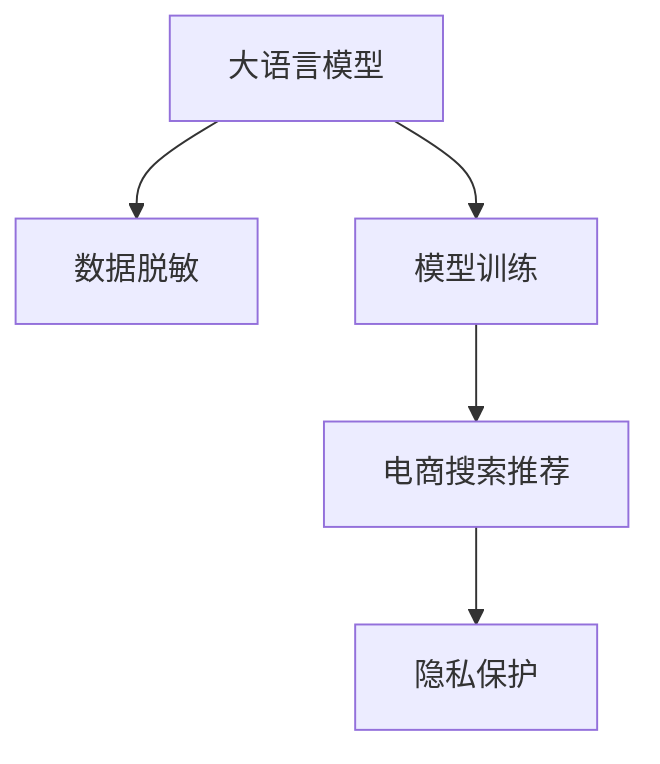

                 

# 电商搜索推荐中的AI大模型数据脱敏技术应用项目可行性分析与实践指南

## 1. 背景介绍

### 1.1 问题由来
电商搜索推荐系统的核心在于理解用户需求，并从海量商品中匹配最合适的商品。大模型作为最新的自然语言处理技术，已经展现出其在电商领域搜索和推荐任务中的强大潜力。然而，大模型训练通常需要依赖大量的用户数据，且这些数据往往包含用户隐私信息。如何在保护用户隐私的同时，充分利用这些数据进行模型训练，成为了电商企业面临的重要挑战。

### 1.2 问题核心关键点
本问题聚焦于如何在大规模电商数据上进行AI大模型的训练和微调，同时保证数据的隐私性和安全性。核心问题在于如何在保护用户隐私的前提下，充分利用数据提升搜索推荐系统的准确度和个性化程度。

### 1.3 问题研究意义
研究基于大模型数据脱敏的电商搜索推荐系统，对于保护用户隐私、提升搜索推荐效果、促进电商行业的数字化转型具有重要意义：

1. 保护用户隐私。通过数据脱敏技术，可以在不泄露用户隐私的前提下，进行模型训练和微调，保障用户数据安全。
2. 提升搜索推荐效果。脱敏后的数据保留了真实用户的搜索行为特征，有助于模型更准确地捕捉用户需求，提高推荐效果。
3. 加速电商数字化转型。通过智能化的搜索推荐系统，提升用户体验，增加销售额，推动电商行业的数字化和智能化进程。
4. 避免法律风险。严格的隐私保护措施有助于企业合规经营，避免因数据泄露引起的法律纠纷。

## 2. 核心概念与联系

### 2.1 核心概念概述

为更好地理解基于大模型数据脱敏的电商搜索推荐系统，本节将介绍几个密切相关的核心概念：

- **大语言模型(Large Language Model, LLM)**：以自回归(如GPT)或自编码(如BERT)模型为代表的大规模预训练语言模型。通过在大规模无标签文本语料上进行预训练，学习通用的语言表示，具备强大的语言理解和生成能力。

- **数据脱敏(Data Masking)**：通过一定规则对敏感数据进行处理，使其无法直接识别出具体的数据内容，从而保护用户隐私。常见的脱敏技术包括泛化、替换、随机化等。

- **隐私保护(Preservation of Privacy)**：指在数据处理过程中保护用户隐私不受侵犯的技术和手段。

- **电商搜索推荐系统(E-commerce Search and Recommendation System)**：基于用户行为数据，利用人工智能技术为用户推荐感兴趣的商品，提升购物体验和转化率。

- **用户隐私(User Privacy)**：用户个人信息的保密性和隐私权，包括但不限于姓名、地址、消费习惯等。

- **模型训练(Model Training)**：通过输入数据和标签，利用优化算法更新模型参数，使模型输出更符合训练目标的过程。

这些核心概念之间的逻辑关系可以通过以下Mermaid流程图来展示：



这个流程图展示了大语言模型在电商推荐系统中的核心概念及其之间的关系：

1. 大语言模型通过预训练获得基础能力。
2. 数据脱敏技术在预训练数据上进行操作，保护用户隐私。
3. 模型训练利用脱敏后的数据，进行大语言模型的微调。
4. 电商搜索推荐系统基于微调后的大模型进行推荐，同时保证用户隐私。

## 3. 核心算法原理 & 具体操作步骤
### 3.1 算法原理概述

基于大模型的电商搜索推荐系统，本质上是一个基于隐私保护的推荐算法。其核心思想是：在保护用户隐私的前提下，利用大语言模型进行电商数据的预训练和微调，从而提升模型的推荐效果。

具体来说，假设电商数据集为 $D=\{(x_i, y_i)\}_{i=1}^N$，其中 $x_i$ 表示用户的搜索行为，$y_i$ 表示用户实际购买的商品。我们的目标是利用大语言模型 $M_{\theta}$ 学习用户搜索行为与购买商品之间的关联，以提高推荐模型的性能。由于直接使用原始数据会导致隐私泄露，因此在预训练和微调过程中，我们需要应用数据脱敏技术，以保护用户隐私。

### 3.2 算法步骤详解

基于大模型的电商搜索推荐系统一般包括以下几个关键步骤：

**Step 1: 数据收集与预处理**
- 收集电商平台的搜索记录和交易数据，确保数据质量和多样性。
- 对原始数据进行清洗和归一化处理，去除异常值和噪声数据。
- 对用户搜索行为进行匿名化处理，例如去除用户的ID信息。

**Step 2: 数据脱敏**
- 应用数据脱敏技术，如泛化、替换、随机化等，对敏感信息进行脱敏处理。
- 对于具体的脱敏方法，可以根据数据类型和隐私需求进行灵活选择。

**Step 3: 预训练模型选择与初始化**
- 选择合适的预训练语言模型 $M_{\theta}$，如BERT、GPT等。
- 将脱敏后的电商数据作为训练数据，初始化模型参数。

**Step 4: 微调过程**
- 设计任务适配层，例如分类器、回归器等，用于微调模型。
- 选择适当的优化算法，如AdamW、SGD等，设置合适的学习率、批大小等超参数。
- 利用电商数据进行有监督微调，优化模型性能。
- 定期在验证集上评估模型性能，防止过拟合。

**Step 5: 隐私保护措施**
- 应用差分隐私技术，如扰动、加密等，进一步保护用户隐私。
- 确保模型部署时的安全性，如访问控制、数据传输加密等。

**Step 6: 模型部署与测试**
- 将微调后的模型部署到推荐系统中，进行实际推荐测试。
- 收集用户反馈，进行模型效果评估和调整。

以上是基于大模型的电商搜索推荐系统的完整流程。在实际应用中，还需要针对具体业务需求，对微调过程进行优化设计，例如引入更高效的数据增强、优化正则化技术等，以进一步提升模型性能。

### 3.3 算法优缺点

基于大模型的电商搜索推荐系统具有以下优点：
1. 准确度高。利用大模型进行电商数据预训练和微调，可以捕捉到更复杂的用户行为特征，提高推荐精度。
2. 可解释性强。大模型可以提供更直观的特征解释，帮助理解推荐结果的生成逻辑。
3. 可扩展性强。大模型具有强大的泛化能力，可以应用于多种推荐场景。

同时，该方法也存在一定的局限性：
1. 数据质量要求高。电商数据需保证高质量、多样性，否则可能影响模型性能。
2. 计算资源消耗大。大模型的训练和微调需要大量计算资源，成本较高。
3. 隐私保护复杂。数据脱敏和差分隐私技术的应用，需要谨慎处理，避免影响推荐效果。

尽管存在这些局限性，但就目前而言，基于大模型的电商搜索推荐系统仍是大数据时代下的推荐技术的最新发展方向。未来相关研究的重点在于如何进一步降低计算成本，提升隐私保护能力，同时兼顾推荐效果的优化。

### 3.4 算法应用领域

基于大模型的电商搜索推荐系统在电商领域已经得到了广泛的应用，覆盖了商品搜索、个性化推荐、跨领域推荐等多个场景：

- 商品搜索：利用大模型分析用户搜索意图，推荐相关商品。通过微调优化模型，提高搜索匹配度。
- 个性化推荐：根据用户的历史行为数据，利用大模型推荐个性化商品。通过微调提升推荐准确度。
- 跨领域推荐：利用大模型跨越不同商品类别，推荐用户感兴趣的商品。通过微调优化模型，提高跨领域推荐效果。

除了上述这些经典场景外，大模型还用于广告投放、社交网络推荐、智能客服等众多领域，推动电商行业的数据驱动和智能化进程。

## 4. 数学模型和公式 & 详细讲解  
### 4.1 数学模型构建

本节将使用数学语言对基于大模型的电商搜索推荐系统进行更加严格的刻画。

假设电商数据集为 $D=\{(x_i, y_i)\}_{i=1}^N$，其中 $x_i \in \mathcal{X}$，$y_i \in \mathcal{Y}$。定义大语言模型为 $M_{\theta}$，其中 $\theta$ 为模型参数。

在电商数据上，大语言模型的推荐任务可以定义为：

$$
\hat{y}_i = M_{\theta}(x_i)
$$

其中 $\hat{y}_i \in \mathcal{Y}$ 表示模型对商品 $x_i$ 的推荐。

### 4.2 公式推导过程

以二分类任务为例，假设电商数据集中的每个用户行为 $x_i$ 都被标记为正负两类（购买或不购买），即 $y_i \in \{0,1\}$。推荐任务的目标是使 $\hat{y}_i$ 尽可能接近 $y_i$。

假设在电商数据上微调得到的大语言模型为 $M_{\theta}$，其输出为 $\hat{y}_i = \sigma(M_{\theta}(x_i))$，其中 $\sigma$ 为激活函数，如Sigmoid或Tanh。推荐模型的损失函数可以定义为交叉熵损失：

$$
\mathcal{L}(\theta) = -\frac{1}{N}\sum_{i=1}^N [y_i\log \hat{y}_i + (1-y_i)\log(1-\hat{y}_i)]
$$

在微调过程中，利用AdamW等优化算法，对模型参数 $\theta$ 进行更新：

$$
\theta \leftarrow \theta - \eta \nabla_{\theta}\mathcal{L}(\theta) - \eta\lambda\theta
$$

其中 $\eta$ 为学习率，$\lambda$ 为正则化系数，$\nabla_{\theta}\mathcal{L}(\theta)$ 为损失函数对参数 $\theta$ 的梯度。

### 4.3 案例分析与讲解

假设我们有一个电商数据集 $D=\{(x_i, y_i)\}_{i=1}^N$，其中 $x_i$ 为用户搜索行为，$y_i$ 为用户是否购买该商品。我们希望利用BERT模型进行微调，得到一个推荐系统。

首先，我们需要对原始数据进行预处理和数据脱敏：

1. 对原始数据进行清洗和归一化，去除异常值和噪声数据。
2. 对用户ID进行匿名化处理，例如使用泛化技术将用户ID转换为伪随机ID。
3. 对电商数据进行划分，划分为训练集、验证集和测试集。

然后，使用微调后的BERT模型进行推荐：

1. 将预训练的BERT模型作为初始化参数。
2. 将脱敏后的电商数据作为训练数据，进行微调。
3. 设计任务适配层，如二分类器，用于判断用户是否会购买该商品。
4. 利用交叉熵损失函数进行微调，更新模型参数。
5. 在验证集上评估模型性能，防止过拟合。
6. 在测试集上测试推荐效果，并进行调优。

最后，将微调后的BERT模型部署到推荐系统中，进行实际推荐。

## 5. 项目实践：代码实例和详细解释说明
### 5.1 开发环境搭建

在进行大模型微调实践前，我们需要准备好开发环境。以下是使用Python进行PyTorch开发的环境配置流程：

1. 安装Anaconda：从官网下载并安装Anaconda，用于创建独立的Python环境。

2. 创建并激活虚拟环境：
```bash
conda create -n pytorch-env python=3.8 
conda activate pytorch-env
```

3. 安装PyTorch：根据CUDA版本，从官网获取对应的安装命令。例如：
```bash
conda install pytorch torchvision torchaudio cudatoolkit=11.1 -c pytorch -c conda-forge
```

4. 安装Transformer库：
```bash
pip install transformers
```

5. 安装各类工具包：
```bash
pip install numpy pandas scikit-learn matplotlib tqdm jupyter notebook ipython
```

完成上述步骤后，即可在`pytorch-env`环境中开始微调实践。

### 5.2 源代码详细实现

下面我们以电商商品推荐任务为例，给出使用Transformers库对BERT模型进行微调的PyTorch代码实现。

首先，定义电商商品推荐任务的数据处理函数：

```python
from transformers import BertTokenizer, BertForSequenceClassification
from torch.utils.data import Dataset, DataLoader
import torch

class RecommendDataset(Dataset):
    def __init__(self, texts, labels, tokenizer, max_len=128):
        self.texts = texts
        self.labels = labels
        self.tokenizer = tokenizer
        self.max_len = max_len
        
    def __len__(self):
        return len(self.texts)
    
    def __getitem__(self, item):
        text = self.texts[item]
        label = self.labels[item]
        
        encoding = self.tokenizer(text, return_tensors='pt', max_length=self.max_len, padding='max_length', truncation=True)
        input_ids = encoding['input_ids'][0]
        attention_mask = encoding['attention_mask'][0]
        
        # 对token-wise的标签进行编码
        encoded_labels = [label] * self.max_len
        labels = torch.tensor(encoded_labels, dtype=torch.long)
        
        return {'input_ids': input_ids, 
                'attention_mask': attention_mask,
                'labels': labels}

# 标签与id的映射
label2id = {0: 0, 1: 1}
id2label = {v: k for k, v in label2id.items()}

# 创建dataset
tokenizer = BertTokenizer.from_pretrained('bert-base-cased')

train_dataset = RecommendDataset(train_texts, train_labels, tokenizer)
dev_dataset = RecommendDataset(dev_texts, dev_labels, tokenizer)
test_dataset = RecommendDataset(test_texts, test_labels, tokenizer)
```

然后，定义模型和优化器：

```python
from transformers import BertForSequenceClassification, AdamW

model = BertForSequenceClassification.from_pretrained('bert-base-cased', num_labels=2)

optimizer = AdamW(model.parameters(), lr=2e-5)
```

接着，定义训练和评估函数：

```python
from torch.utils.data import DataLoader
from tqdm import tqdm
from sklearn.metrics import classification_report

device = torch.device('cuda') if torch.cuda.is_available() else torch.device('cpu')
model.to(device)

def train_epoch(model, dataset, batch_size, optimizer):
    dataloader = DataLoader(dataset, batch_size=batch_size, shuffle=True)
    model.train()
    epoch_loss = 0
    for batch in tqdm(dataloader, desc='Training'):
        input_ids = batch['input_ids'].to(device)
        attention_mask = batch['attention_mask'].to(device)
        labels = batch['labels'].to(device)
        model.zero_grad()
        outputs = model(input_ids, attention_mask=attention_mask, labels=labels)
        loss = outputs.loss
        epoch_loss += loss.item()
        loss.backward()
        optimizer.step()
    return epoch_loss / len(dataloader)

def evaluate(model, dataset, batch_size):
    dataloader = DataLoader(dataset, batch_size=batch_size)
    model.eval()
    preds, labels = [], []
    with torch.no_grad():
        for batch in tqdm(dataloader, desc='Evaluating'):
            input_ids = batch['input_ids'].to(device)
            attention_mask = batch['attention_mask'].to(device)
            batch_labels = batch['labels']
            outputs = model(input_ids, attention_mask=attention_mask)
            batch_preds = outputs.logits.argmax(dim=2).to('cpu').tolist()
            batch_labels = batch_labels.to('cpu').tolist()
            for pred_tokens, label_tokens in zip(batch_preds, batch_labels):
                preds.append(pred_tokens[:len(label_tokens)])
                labels.append(label_tokens)
                
    print(classification_report(labels, preds))
```

最后，启动训练流程并在测试集上评估：

```python
epochs = 5
batch_size = 16

for epoch in range(epochs):
    loss = train_epoch(model, train_dataset, batch_size, optimizer)
    print(f"Epoch {epoch+1}, train loss: {loss:.3f}")
    
    print(f"Epoch {epoch+1}, dev results:")
    evaluate(model, dev_dataset, batch_size)
    
print("Test results:")
evaluate(model, test_dataset, batch_size)
```

以上就是使用PyTorch对BERT进行电商商品推荐任务微调的完整代码实现。可以看到，得益于Transformers库的强大封装，我们可以用相对简洁的代码完成BERT模型的加载和微调。

### 5.3 代码解读与分析

让我们再详细解读一下关键代码的实现细节：

**RecommendDataset类**：
- `__init__`方法：初始化文本、标签、分词器等关键组件。
- `__len__`方法：返回数据集的样本数量。
- `__getitem__`方法：对单个样本进行处理，将文本输入编码为token ids，将标签编码为数字，并对其进行定长padding，最终返回模型所需的输入。

**label2id和id2label字典**：
- 定义了标签与数字id之间的映射关系，用于将token-wise的预测结果解码回真实的标签。

**训练和评估函数**：
- 使用PyTorch的DataLoader对数据集进行批次化加载，供模型训练和推理使用。
- 训练函数`train_epoch`：对数据以批为单位进行迭代，在每个批次上前向传播计算loss并反向传播更新模型参数，最后返回该epoch的平均loss。
- 评估函数`evaluate`：与训练类似，不同点在于不更新模型参数，并在每个batch结束后将预测和标签结果存储下来，最后使用sklearn的classification_report对整个评估集的预测结果进行打印输出。

**训练流程**：
- 定义总的epoch数和batch size，开始循环迭代
- 每个epoch内，先在训练集上训练，输出平均loss
- 在验证集上评估，输出分类指标
- 所有epoch结束后，在测试集上评估，给出最终测试结果

可以看到，PyTorch配合Transformers库使得BERT微调的代码实现变得简洁高效。开发者可以将更多精力放在数据处理、模型改进等高层逻辑上，而不必过多关注底层的实现细节。

当然，工业级的系统实现还需考虑更多因素，如模型的保存和部署、超参数的自动搜索、更灵活的任务适配层等。但核心的微调范式基本与此类似。

## 6. 实际应用场景
### 6.1 智能客服系统

基于大模型微调的对话技术，可以广泛应用于智能客服系统的构建。传统客服往往需要配备大量人力，高峰期响应缓慢，且一致性和专业性难以保证。而使用微调后的对话模型，可以7x24小时不间断服务，快速响应客户咨询，用自然流畅的语言解答各类常见问题。

在技术实现上，可以收集企业内部的历史客服对话记录，将问题和最佳答复构建成监督数据，在此基础上对预训练对话模型进行微调。微调后的对话模型能够自动理解用户意图，匹配最合适的答案模板进行回复。对于客户提出的新问题，还可以接入检索系统实时搜索相关内容，动态组织生成回答。如此构建的智能客服系统，能大幅提升客户咨询体验和问题解决效率。

### 6.2 金融舆情监测

金融机构需要实时监测市场舆论动向，以便及时应对负面信息传播，规避金融风险。传统的人工监测方式成本高、效率低，难以应对网络时代海量信息爆发的挑战。基于大语言模型微调的文本分类和情感分析技术，为金融舆情监测提供了新的解决方案。

具体而言，可以收集金融领域相关的新闻、报道、评论等文本数据，并对其进行主题标注和情感标注。在此基础上对预训练语言模型进行微调，使其能够自动判断文本属于何种主题，情感倾向是正面、中性还是负面。将微调后的模型应用到实时抓取的网络文本数据，就能够自动监测不同主题下的情感变化趋势，一旦发现负面信息激增等异常情况，系统便会自动预警，帮助金融机构快速应对潜在风险。

### 6.3 个性化推荐系统

当前的推荐系统往往只依赖用户的历史行为数据进行物品推荐，无法深入理解用户的真实兴趣偏好。基于大语言模型微调技术，个性化推荐系统可以更好地挖掘用户行为背后的语义信息，从而提供更精准、多样的推荐内容。

在实践中，可以收集用户浏览、点击、评论、分享等行为数据，提取和用户交互的物品标题、描述、标签等文本内容。将文本内容作为模型输入，用户的后续行为（如是否点击、购买等）作为监督信号，在此基础上微调预训练语言模型。微调后的模型能够从文本内容中准确把握用户的兴趣点。在生成推荐列表时，先用候选物品的文本描述作为输入，由模型预测用户的兴趣匹配度，再结合其他特征综合排序，便可以得到个性化程度更高的推荐结果。

### 6.4 未来应用展望

随着大语言模型和微调方法的不断发展，基于微调范式将在更多领域得到应用，为传统行业带来变革性影响。

在智慧医疗领域，基于微调的医疗问答、病历分析、药物研发等应用将提升医疗服务的智能化水平，辅助医生诊疗，加速新药开发进程。

在智能教育领域，微调技术可应用于作业批改、学情分析、知识推荐等方面，因材施教，促进教育公平，提高教学质量。

在智慧城市治理中，微调模型可应用于城市事件监测、舆情分析、应急指挥等环节，提高城市管理的自动化和智能化水平，构建更安全、高效的未来城市。

此外，在企业生产、社会治理、文娱传媒等众多领域，基于大模型微调的人工智能应用也将不断涌现，为经济社会发展注入新的动力。相信随着技术的日益成熟，微调方法将成为人工智能落地应用的重要范式，推动人工智能技术在垂直行业的规模化落地。总之，大语言模型微调技术的发展，将为人类认知智能的进化带来深远影响。

## 7. 工具和资源推荐
### 7.1 学习资源推荐

为了帮助开发者系统掌握大语言模型微调的理论基础和实践技巧，这里推荐一些优质的学习资源：

1. 《Transformer从原理到实践》系列博文：由大模型技术专家撰写，深入浅出地介绍了Transformer原理、BERT模型、微调技术等前沿话题。

2. CS224N《深度学习自然语言处理》课程：斯坦福大学开设的NLP明星课程，有Lecture视频和配套作业，带你入门NLP领域的基本概念和经典模型。

3. 《Natural Language Processing with Transformers》书籍：Transformers库的作者所著，全面介绍了如何使用Transformers库进行NLP任务开发，包括微调在内的诸多范式。

4. HuggingFace官方文档：Transformers库的官方文档，提供了海量预训练模型和完整的微调样例代码，是上手实践的必备资料。

5. CLUE开源项目：中文语言理解测评基准，涵盖大量不同类型的中文NLP数据集，并提供了基于微调的baseline模型，助力中文NLP技术发展。

通过对这些资源的学习实践，相信你一定能够快速掌握大语言模型微调的精髓，并用于解决实际的NLP问题。
###  7.2 开发工具推荐

高效的开发离不开优秀的工具支持。以下是几款用于大语言模型微调开发的常用工具：

1. PyTorch：基于Python的开源深度学习框架，灵活动态的计算图，适合快速迭代研究。大部分预训练语言模型都有PyTorch版本的实现。

2. TensorFlow：由Google主导开发的开源深度学习框架，生产部署方便，适合大规模工程应用。同样有丰富的预训练语言模型资源。

3. Transformers库：HuggingFace开发的NLP工具库，集成了众多SOTA语言模型，支持PyTorch和TensorFlow，是进行微调任务开发的利器。

4. Weights & Biases：模型训练的实验跟踪工具，可以记录和可视化模型训练过程中的各项指标，方便对比和调优。与主流深度学习框架无缝集成。

5. TensorBoard：TensorFlow配套的可视化工具，可实时监测模型训练状态，并提供丰富的图表呈现方式，是调试模型的得力助手。

6. Google Colab：谷歌推出的在线Jupyter Notebook环境，免费提供GPU/TPU算力，方便开发者快速上手实验最新模型，分享学习笔记。

合理利用这些工具，可以显著提升大语言模型微调任务的开发效率，加快创新迭代的步伐。

### 7.3 相关论文推荐

大语言模型和微调技术的发展源于学界的持续研究。以下是几篇奠基性的相关论文，推荐阅读：

1. Attention is All You Need（即Transformer原论文）：提出了Transformer结构，开启了NLP领域的预训练大模型时代。

2. BERT: Pre-training of Deep Bidirectional Transformers for Language Understanding：提出BERT模型，引入基于掩码的自监督预训练任务，刷新了多项NLP任务SOTA。

3. Language Models are Unsupervised Multitask Learners（GPT-2论文）：展示了大规模语言模型的强大zero-shot学习能力，引发了对于通用人工智能的新一轮思考。

4. Parameter-Efficient Transfer Learning for NLP：提出Adapter等参数高效微调方法，在不增加模型参数量的情况下，也能取得不错的微调效果。

5. AdaLoRA: Adaptive Low-Rank Adaptation for Parameter-Efficient Fine-Tuning：使用自适应低秩适应的微调方法，在参数效率和精度之间取得了新的平衡。

这些论文代表了大语言模型微调技术的发展脉络。通过学习这些前沿成果，可以帮助研究者把握学科前进方向，激发更多的创新灵感。

## 8. 总结：未来发展趋势与挑战

### 8.1 总结

本文对基于大模型数据脱敏的电商搜索推荐系统进行了全面系统的介绍。首先阐述了大语言模型和数据脱敏技术的研究背景和意义，明确了微调在保护用户隐私、提升推荐效果方面的独特价值。其次，从原理到实践，详细讲解了基于大模型的电商搜索推荐系统的数学原理和关键步骤，给出了微调任务开发的完整代码实例。同时，本文还广泛探讨了微调方法在智能客服、金融舆情、个性化推荐等多个领域的应用前景，展示了微调范式的巨大潜力。此外，本文精选了微调技术的各类学习资源，力求为读者提供全方位的技术指引。

通过本文的系统梳理，可以看到，基于大模型的数据脱敏电商推荐系统，在保护用户隐私的同时，充分利用电商数据，提升了推荐系统的准确度和个性化程度，显著提升了电商企业的运营效率和用户体验。未来，伴随大模型技术的进一步发展和数据隐私保护技术的不断成熟，大模型数据脱敏技术将在大数据时代下的电商推荐领域中发挥更大的作用。

### 8.2 未来发展趋势

展望未来，大语言模型数据脱敏的电商搜索推荐系统将呈现以下几个发展趋势：

1. 数据规模持续增大。随着数据采集技术的进步和电商数据的积累，数据规模将持续增长。超大样本的数据训练，将有助于提升模型的泛化能力，进一步提升推荐效果。

2. 数据脱敏技术创新。未来的数据脱敏方法将更加多样化，融合符号化处理、差分隐私等技术，既能保护用户隐私，又能满足模型训练的需求。

3. 隐私保护机制完善。随着隐私保护法规的不断完善，未来的推荐系统将引入更多隐私保护机制，如隐私计算、多方安全计算等，进一步保障用户数据安全。

4. 模型效率提升。大模型的训练和推理需要大量的计算资源，未来将探索更多的模型压缩和优化技术，提高模型的运行效率。

5. 微调范式多样化。除了传统的微调范式，未来还将涌现更多参数高效、计算高效的微调方法，如Prompt Tuning、LoRA等，提升微调效果的同时，减小计算成本。

6. 跨领域应用拓展。大语言模型的多领域泛化能力，将使其在更多领域得到应用，如医疗、教育、智能交通等，推动更多行业的智能化进程。

以上趋势凸显了大语言模型数据脱敏技术在电商推荐领域的广阔前景。这些方向的探索发展，必将进一步提升推荐系统的性能和应用范围，为电商行业带来新的变革。

### 8.3 面临的挑战

尽管大语言模型数据脱敏的电商搜索推荐系统已经取得了显著成效，但在迈向更加智能化、普适化应用的过程中，它仍面临诸多挑战：

1. 数据质量瓶颈。电商数据需保证高质量、多样性，否则可能影响模型性能。数据收集、清洗和归一化过程复杂且耗时。

2. 计算资源消耗大。大模型的训练和微调需要大量计算资源，成本较高。如何优化计算图、降低内存占用，是未来需要重点关注的问题。

3. 隐私保护复杂。数据脱敏和差分隐私技术的应用，需要谨慎处理，避免影响推荐效果。如何在保护隐私的同时，保证推荐模型的性能，是未来需要重点研究的问题。

4. 用户反馈获取难。电商推荐系统需持续收集用户反馈，以不断优化推荐效果。如何高效获取用户反馈，是未来需要解决的问题。

5. 模型鲁棒性不足。电商推荐模型在面对新商品、新用户时，可能存在过拟合或泛化能力不足的问题。如何提高模型鲁棒性，是未来需要重点研究的问题。

6. 多模态融合难。电商推荐系统需融合商品标题、描述、图片等多模态数据，进行综合建模。如何有效融合不同模态信息，是未来需要重点研究的问题。

7. 法律合规问题。电商推荐系统需遵守相关隐私保护法规，避免因数据泄露引起的法律纠纷。如何满足法律合规要求，是未来需要重点关注的问题。

以上挑战凸显了大语言模型数据脱敏技术的复杂性和多样性。这些问题的解决，将依赖于技术的不断进步和相关法规的完善。

### 8.4 研究展望

未来，大语言模型数据脱敏技术的研究需要从以下几个方面进行：

1. 探索更高效的数据收集和处理技术，确保电商数据的准确性和多样性。

2. 研究更高级的数据脱敏和差分隐私技术，保护用户隐私的同时，满足模型训练的需求。

3. 开发更高效的数据压缩和模型优化技术，降低计算成本，提高模型的运行效率。

4. 探索更多参数高效和计算高效的微调方法，提升微调效果的同时，减小计算成本。

5. 研究跨领域数据融合技术，有效融合不同模态信息，提升推荐模型的泛化能力。

6. 开发用户反馈获取机制，持续收集用户反馈，优化推荐效果。

7. 研究法律合规机制，确保推荐系统遵守相关隐私保护法规，避免法律风险。

8. 探索更多隐私保护和用户保护技术，如隐私计算、多方安全计算等，保护用户隐私和数据安全。

这些研究方向的探索，必将推动大语言模型数据脱敏技术向更深层次发展，为电商行业带来更多的智能化和个性化推荐服务。相信随着技术的不断进步和研究的不断深入，大语言模型数据脱敏技术将在电商领域发挥更大的作用，推动电商行业向更加智能化、普适化的方向发展。

## 9. 附录：常见问题与解答

**Q1：大语言模型数据脱敏是否适用于所有NLP任务？**

A: 大语言模型数据脱敏在大多数NLP任务上都能取得不错的效果，特别是对于数据量较小的任务。但对于一些特定领域的任务，如医学、法律等，仅仅依靠通用语料预训练的模型可能难以很好地适应。此时需要在特定领域语料上进一步预训练，再进行微调，才能获得理想效果。此外，对于一些需要时效性、个性化很强的任务，如对话、推荐等，微调方法也需要针对性的改进优化。

**Q2：数据脱敏过程中如何避免引入噪声？**

A: 在数据脱敏过程中，需要注意避免引入噪声或干扰信息，影响模型训练效果。常见的脱敏方法包括泛化、替换、随机化等，需要根据数据类型和隐私需求进行选择。例如，对于文本数据，可以采用泛化和替换技术，将敏感信息替换为通用词或特殊符号，避免噪声引入。

**Q3：电商推荐系统如何进行实时推荐？**

A: 电商推荐系统通常需要实时推荐，以提升用户体验。这可以通过微调后的大语言模型，结合缓存系统和在线服务端进行实时推荐。系统在收到用户查询后，将查询输入微调模型，得到推荐结果，然后根据用户的点击反馈进行实时调整。此外，还可以通过增量学习等技术，在用户行为数据不断更新的情况下，动态更新推荐模型。

**Q4：如何评估电商推荐系统的推荐效果？**

A: 电商推荐系统的推荐效果评估，通常包括准确率、召回率、点击率、转化率等指标。可以使用AUC、MSE、RMSE等统计指标进行综合评估。在评估过程中，需要划分为训练集、验证集和测试集，分别评估模型的性能，防止过拟合。

**Q5：电商推荐系统如何进行冷启动？**

A: 电商推荐系统在新用户或新商品的情况下，需要进行冷启动。常见的冷启动方法包括基于内容的推荐、基于用户的推荐等。可以利用文本特征提取技术，将新商品或用户的描述转换为向量，然后进行相似性匹配，推荐相关商品或用户。此外，还可以通过模型预训练技术，对新商品或用户进行快速适应，提升推荐效果。

这些问题的回答，有助于开发者更好地理解和使用大语言模型数据脱敏技术，提升电商推荐系统的性能和用户体验。相信随着技术的不断进步和研究的不断深入，大语言模型数据脱敏技术将在电商领域发挥更大的作用，推动电商行业向更加智能化、普适化的方向发展。

---

作者：禅与计算机程序设计艺术 / Zen and the Art of Computer Programming

