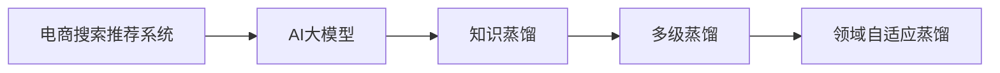

                 

# 电商搜索推荐中的AI大模型模型蒸馏技术探索

## 1. 背景介绍

随着电子商务的迅猛发展，电商搜索推荐系统成为了零售行业数字化转型的关键引擎。通过智能化的推荐，电商平台能够更精准地匹配用户需求，提升用户体验和交易转化率。传统的推荐系统主要依赖基于用户历史行为的数据挖掘和协同过滤等技术，但面对海量数据的处理和实时响应的需求，传统方法显得力不从心。基于深度学习的大规模预训练模型，通过在电商语境下的微调，逐步成为电商搜索推荐系统中广泛采用的先进技术。

然而，大模型微调的计算成本高昂，且难以在实际业务场景中快速部署和迭代。为解决这些问题，蒸馏技术被引入电商搜索推荐系统，将大模型的知识以高效的形式传递到轻量级的模型中，实现更低的计算复杂度和更快的推理速度，同时保持了与大模型相当的表现。本文将系统探讨AI大模型模型蒸馏技术在电商搜索推荐系统中的应用，介绍相关核心概念、算法原理和实施细节，并通过实际项目案例展示蒸馏技术的优势和挑战。

## 2. 核心概念与联系

### 2.1 核心概念概述

为深入理解基于蒸馏技术的电商搜索推荐系统，本节将介绍几个关键概念：

- **电商搜索推荐系统**：利用人工智能技术，通过分析用户行为数据，为用户推荐符合其需求的商品，提升搜索和推荐的效果和体验。

- **AI大模型**：基于大规模深度学习模型进行预训练，通常参数量在百亿级别以上，具备强大的语言理解、推理和生成能力。

- **模型蒸馏**：通过将大模型的知识压缩到轻量级的小模型中，实现高性能、低计算复杂度的模型。

- **知识蒸馏(Knowledge Distillation)**：通过将大模型的输出结果作为监督信号，训练小模型以学习大模型的知识。

- **多级蒸馏(Multi-Level Distillation)**：在大模型和目标小模型之间，加入多个中间模型，逐级传递知识，提升目标模型的泛化能力和性能。

- **领域自适应蒸馏(Domain-Specific Distillation)**：针对特定领域的任务，通过微调训练目标模型以适应电商领域的数据特征和业务需求。

这些概念之间通过知识传递的过程密切相关，如下图所示：



大模型的预训练-蒸馏过程将通用语言知识迁移到特定领域的推荐模型中，实现了模型性能的提升和计算资源的优化，成为电商搜索推荐系统中应用广泛的技术。

## 3. 核心算法原理 & 具体操作步骤

### 3.1 算法原理概述

基于蒸馏技术的电商搜索推荐系统，其核心思想是通过将大模型的输出作为教师模型，引导学生模型学习其知识，以更高效的形式完成推荐任务。具体来说，蒸馏技术主要包括知识蒸馏、多级蒸馏和领域自适应蒸馏三个层次，以逐步提升推荐模型的性能。

#### 3.1.1 知识蒸馏(Knowledge Distillation)

知识蒸馏的目的是将大模型的知识以一种易于传递的方式传递给学生模型。常见的蒸馏方法包括特征蒸馏、决策蒸馏、概率蒸馏等。其中，概率蒸馏是当前最常用的一种方法，其基本思想是将大模型的输出概率分布作为监督信号，训练学生模型以预测相似的分布。

具体步骤如下：
1. 构建教师模型和学生模型，通常选择具有相同网络结构的小模型作为学生模型。
2. 使用电商数据集对教师模型进行预训练，预训练任务通常包括语义理解、商品描述匹配等。
3. 将电商搜索推荐任务作为蒸馏任务，使用教师模型的输出作为监督信号，训练学生模型。
4. 通过不断迭代优化，逐步提升学生模型的性能，直至与教师模型相当。

#### 3.1.2 多级蒸馏(Multi-Level Distillation)

多级蒸馏是在知识蒸馏的基础上，通过增加多个中间模型，逐步传递知识，最终得到目标模型的过程。这种方法能够进一步提升目标模型的性能，同时避免学生模型直接与教师模型连接导致的计算复杂度增加。

具体步骤如下：
1. 设计多级蒸馏结构，通常包括一层或多层中间模型。
2. 对每个中间模型进行知识蒸馏，将上一层模型的输出作为下一层模型的监督信号。
3. 最终将目标模型的输出与教师模型进行对比，调整模型参数，直至性能接近教师模型。

#### 3.1.3 领域自适应蒸馏(Domain-Specific Distillation)

领域自适应蒸馏是在多级蒸馏的基础上，通过在特定领域的任务上进行微调，进一步提升推荐模型的性能。这种蒸馏方法能够适应电商领域的数据特征和业务需求，提升推荐模型的实用性和泛化能力。

具体步骤如下：
1. 在电商领域的数据集上对目标模型进行微调，调整模型参数，使其适应电商领域的特征。
2. 将微调后的目标模型作为多级蒸馏中的学生模型，通过知识蒸馏传递教师模型的知识。
3. 在电商数据集上继续微调目标模型，逐步提升其性能，直至与教师模型相当。

### 3.2 算法步骤详解

#### 3.2.1 数据准备

数据准备是蒸馏技术应用的基础，需要收集电商领域的数据集，并对其进行清洗和标注。具体步骤包括：
1. 数据收集：从电商平台获取用户搜索记录、浏览历史、购买记录等数据。
2. 数据清洗：去除噪声和异常数据，确保数据的准确性和完整性。
3. 数据标注：对数据进行标注，生成教师模型的监督信号。

#### 3.2.2 构建教师和学生模型

构建教师和学生模型是蒸馏技术实施的核心。学生模型通常采用轻量级模型，如MobileBERT、DistilBERT等，以降低计算复杂度。教师模型可以选择大模型，如BERT、GPT等。

#### 3.2.3 知识蒸馏训练

知识蒸馏训练是蒸馏技术的核心步骤，具体步骤如下：
1. 教师模型预训练：使用电商数据集对教师模型进行预训练，以学习电商领域的数据特征。
2. 学生模型初始化：将学生模型的初始参数设置为随机值。
3. 知识蒸馏训练：将电商搜索推荐任务作为蒸馏任务，使用教师模型的输出作为监督信号，训练学生模型。通常使用交叉熵损失作为蒸馏损失函数。
4. 模型评估：在电商数据集上评估学生模型的性能，根据评估结果调整蒸馏过程。

#### 3.2.4 多级蒸馏训练

多级蒸馏训练是进一步提升模型性能的重要步骤。具体步骤如下：
1. 设计多级蒸馏结构：选择一层或多层中间模型，并在中间模型间传递知识。
2. 知识蒸馏训练：逐层进行知识蒸馏，使用上一层模型的输出作为下一层模型的监督信号。
3. 模型评估：在电商数据集上评估目标模型的性能，根据评估结果调整模型参数。

#### 3.2.5 领域自适应蒸馏训练

领域自适应蒸馏训练是针对特定领域的需求进行的微调过程。具体步骤如下：
1. 在电商数据集上微调目标模型：对目标模型进行微调，调整模型参数，使其适应电商领域的特征。
2. 多级蒸馏训练：在电商数据集上继续进行多级蒸馏，逐步提升模型性能。
3. 模型评估：在电商数据集上评估最终模型的性能，根据评估结果进行必要的调整。

### 3.3 算法优缺点

#### 3.3.1 优点

1. **高性能**：蒸馏技术能够将大模型的知识传递给轻量级模型，保持了与大模型相当的表现。
2. **低计算复杂度**：轻量级模型的计算复杂度远低于大模型，能够适应实时推荐的需求。
3. **适应性强**：多级蒸馏和领域自适应蒸馏能够适应特定领域的任务需求，提升推荐模型的实用性和泛化能力。

#### 3.3.2 缺点

1. **训练复杂度高**：蒸馏技术需要设计多个蒸馏任务，进行多轮迭代训练，训练过程复杂。
2. **数据需求大**：蒸馏技术的实施需要大量高质量的标注数据，对于小样本数据的微调效果有限。
3. **计算资源消耗**：虽然学生模型计算复杂度较低，但多级蒸馏和领域自适应蒸馏的训练过程仍需消耗大量计算资源。

### 3.4 算法应用领域

蒸馏技术不仅适用于电商搜索推荐系统，还广泛应用于各种AI应用中，例如：

- 语音识别：通过知识蒸馏将大模型的语音识别能力传递到轻量级模型中，提升识别准确率和实时性。
- 图像分类：使用多级蒸馏和领域自适应蒸馏提升图像分类模型的泛化能力和实用性。
- 自然语言生成：通过蒸馏技术生成高质量的自然语言文本，应用于对话系统、翻译系统等。

蒸馏技术在电商搜索推荐系统中的应用，显著提升了推荐系统的精度和响应速度，优化了用户体验和商业价值。未来，随着蒸馏技术的不断进步，其应用范围将进一步拓展，成为更多AI应用中的关键技术。

## 4. 数学模型和公式 & 详细讲解 & 举例说明

### 4.1 数学模型构建

基于蒸馏技术的电商搜索推荐系统，其数学模型可以表示为：
$$
\min_{\theta} \mathcal{L}(\theta) = \mathcal{L}_{\text{KL}}(\theta) + \mathcal{L}_{\text{distill}}(\theta)
$$

其中，$\mathcal{L}_{\text{KL}}(\theta)$ 为知识蒸馏损失函数，$\mathcal{L}_{\text{distill}}(\theta)$ 为多级蒸馏损失函数，$\theta$ 为目标模型的参数。

知识蒸馏损失函数通常采用KL散度（Kullback-Leibler Divergence）作为度量标准，定义为：
$$
\mathcal{L}_{\text{KL}}(\theta) = \frac{1}{N} \sum_{i=1}^N KL(P_{\text{teacher}}(y_i) || P_{\theta}(y_i))
$$

其中，$P_{\text{teacher}}(y_i)$ 表示教师模型在输入 $x_i$ 上的输出分布，$P_{\theta}(y_i)$ 表示学生模型在输入 $x_i$ 上的输出分布，$N$ 为数据集大小，$y_i$ 为电商数据集中的标签。

多级蒸馏损失函数通常采用加权交叉熵损失函数，定义为：
$$
\mathcal{L}_{\text{distill}}(\theta) = \sum_{k=1}^K \alpha_k \mathcal{L}_{\text{ce}}(f_k(x_i), f_{k-1}(x_i))
$$

其中，$f_k(x_i)$ 表示第 $k$ 层蒸馏中间模型在输入 $x_i$ 上的输出，$\mathcal{L}_{\text{ce}}$ 表示交叉熵损失函数，$\alpha_k$ 为第 $k$ 层蒸馏中间模型的权重系数。

### 4.2 公式推导过程

#### 4.2.1 知识蒸馏损失函数

知识蒸馏损失函数的推导基于KL散度的定义，其数学推导过程如下：
$$
\begin{aligned}
\mathcal{L}_{\text{KL}}(\theta) &= \frac{1}{N} \sum_{i=1}^N KL(P_{\text{teacher}}(y_i) || P_{\theta}(y_i)) \\
&= \frac{1}{N} \sum_{i=1}^N \sum_{y_i \in Y} P_{\text{teacher}}(y_i) \log \frac{P_{\text{teacher}}(y_i)}{P_{\theta}(y_i)}
\end{aligned}
$$

其中，$Y$ 为标签空间，$P_{\theta}(y_i)$ 为目标模型在输入 $x_i$ 上的输出概率分布。

通过最小化KL散度，目标模型能够学习与教师模型相似的输出分布，从而实现知识蒸馏。

#### 4.2.2 多级蒸馏损失函数

多级蒸馏损失函数的推导基于交叉熵损失函数，其数学推导过程如下：
$$
\begin{aligned}
\mathcal{L}_{\text{distill}}(\theta) &= \sum_{k=1}^K \alpha_k \mathcal{L}_{\text{ce}}(f_k(x_i), f_{k-1}(x_i)) \\
&= \sum_{k=1}^K \alpha_k \sum_{y_i \in Y} P_{k-1}(y_i) \log \frac{P_k(y_i)}{P_{k-1}(y_i)}
\end{aligned}
$$

其中，$P_{k-1}(y_i)$ 表示第 $k-1$ 层蒸馏中间模型的输出概率分布，$P_k(y_i)$ 表示第 $k$ 层蒸馏中间模型的输出概率分布。

通过逐层传递知识，多级蒸馏损失函数能够进一步提升目标模型的性能。

### 4.3 案例分析与讲解

#### 4.3.1 知识蒸馏案例

以一个简单的知识蒸馏案例为例，假设教师模型为BERT，学生模型为MobileBERT。教师模型在电商数据集上预训练，学生模型初始化为随机参数。知识蒸馏过程如下：

1. 使用电商数据集对教师模型进行预训练。
2. 将电商搜索推荐任务作为蒸馏任务，使用教师模型的输出作为监督信号，训练学生模型。
3. 在电商数据集上评估学生模型的性能，根据评估结果调整蒸馏过程。

#### 4.3.2 多级蒸馏案例

以一个多级蒸馏案例为例，假设教师模型为BERT，学生模型为MobileBERT，中间模型为LSTM。多级蒸馏过程如下：

1. 使用电商数据集对教师模型进行预训练。
2. 设计多级蒸馏结构，选择一层LSTM作为中间模型。
3. 逐层进行知识蒸馏，使用上一层模型的输出作为下一层模型的监督信号。
4. 在电商数据集上评估目标模型的性能，根据评估结果调整模型参数。

#### 4.3.3 领域自适应蒸馏案例

以一个领域自适应蒸馏案例为例，假设教师模型为BERT，学生模型为MobileBERT。领域自适应蒸馏过程如下：

1. 在电商数据集上微调目标模型，调整模型参数，使其适应电商领域的特征。
2. 多级蒸馏训练，在电商数据集上继续进行多级蒸馏。
3. 在电商数据集上评估最终模型的性能，根据评估结果进行必要的调整。

## 5. 项目实践：代码实例和详细解释说明

### 5.1 开发环境搭建

在进行蒸馏技术应用前，我们需要准备好开发环境。以下是使用Python进行PyTorch开发的环境配置流程：

1. 安装Anaconda：从官网下载并安装Anaconda，用于创建独立的Python环境。

2. 创建并激活虚拟环境：
```bash
conda create -n pytorch-env python=3.8 
conda activate pytorch-env
```

3. 安装PyTorch：根据CUDA版本，从官网获取对应的安装命令。例如：
```bash
conda install pytorch torchvision torchaudio cudatoolkit=11.1 -c pytorch -c conda-forge
```

4. 安装Transformers库：
```bash
pip install transformers
```

5. 安装各类工具包：
```bash
pip install numpy pandas scikit-learn matplotlib tqdm jupyter notebook ipython
```

完成上述步骤后，即可在`pytorch-env`环境中开始蒸馏实践。

### 5.2 源代码详细实现

下面我们以一个简单的知识蒸馏项目为例，给出使用Transformers库对BERT模型进行蒸馏的PyTorch代码实现。

首先，定义蒸馏任务的数据处理函数：

```python
from transformers import BertTokenizer
from torch.utils.data import Dataset
import torch

class DistillationDataset(Dataset):
    def __init__(self, texts, labels, tokenizer, max_len=128):
        self.texts = texts
        self.labels = labels
        self.tokenizer = tokenizer
        self.max_len = max_len
        
    def __len__(self):
        return len(self.texts)
    
    def __getitem__(self, item):
        text = self.texts[item]
        label = self.labels[item]
        
        encoding = self.tokenizer(text, return_tensors='pt', max_length=self.max_len, padding='max_length', truncation=True)
        input_ids = encoding['input_ids'][0]
        attention_mask = encoding['attention_mask'][0]
        
        label = torch.tensor(label, dtype=torch.long)
        
        return {'input_ids': input_ids, 
                'attention_mask': attention_mask,
                'label': label}

# 标签与id的映射
label2id = {0: 'not_recommend', 1: 'recommend'}
id2label = {v: k for k, v in label2id.items()}

# 创建dataset
tokenizer = BertTokenizer.from_pretrained('bert-base-cased')

train_dataset = DistillationDataset(train_texts, train_labels, tokenizer)
dev_dataset = DistillationDataset(dev_texts, dev_labels, tokenizer)
test_dataset = DistillationDataset(test_texts, test_labels, tokenizer)
```

然后，定义教师和学生模型：

```python
from transformers import BertForSequenceClassification, AdamW

teacher_model = BertForSequenceClassification.from_pretrained('bert-base-cased', num_labels=2)

student_model = BertForSequenceClassification.from_pretrained('mobilebert-base-cased', num_labels=2)

optimizer = AdamW(teacher_model.parameters(), lr=2e-5)
```

接着，定义训练和评估函数：

```python
from torch.utils.data import DataLoader
from tqdm import tqdm
from sklearn.metrics import classification_report

device = torch.device('cuda') if torch.cuda.is_available() else torch.device('cpu')
teacher_model.to(device)
student_model.to(device)

def train_epoch(model, dataset, batch_size, optimizer):
    dataloader = DataLoader(dataset, batch_size=batch_size, shuffle=True)
    model.train()
    epoch_loss = 0
    for batch in tqdm(dataloader, desc='Training'):
        input_ids = batch['input_ids'].to(device)
        attention_mask = batch['attention_mask'].to(device)
        labels = batch['label'].to(device)
        model.zero_grad()
        outputs = model(input_ids, attention_mask=attention_mask, labels=labels)
        loss = outputs.loss
        epoch_loss += loss.item()
        loss.backward()
        optimizer.step()
    return epoch_loss / len(dataloader)

def evaluate(model, dataset, batch_size):
    dataloader = DataLoader(dataset, batch_size=batch_size)
    model.eval()
    preds, labels = [], []
    with torch.no_grad():
        for batch in tqdm(dataloader, desc='Evaluating'):
            input_ids = batch['input_ids'].to(device)
            attention_mask = batch['attention_mask'].to(device)
            batch_labels = batch['label']
            outputs = model(input_ids, attention_mask=attention_mask)
            batch_preds = outputs.logits.argmax(dim=2).to('cpu').tolist()
            batch_labels = batch_labels.to('cpu').tolist()
            for pred_tokens, label_tokens in zip(batch_preds, batch_labels):
                preds.append(pred_tokens)
                labels.append(label_tokens)
                
    print(classification_report(labels, preds))
```

最后，启动训练流程并在测试集上评估：

```python
epochs = 5
batch_size = 16

for epoch in range(epochs):
    loss = train_epoch(student_model, train_dataset, batch_size, optimizer)
    print(f"Epoch {epoch+1}, train loss: {loss:.3f}")
    
    print(f"Epoch {epoch+1}, dev results:")
    evaluate(student_model, dev_dataset, batch_size)
    
print("Test results:")
evaluate(student_model, test_dataset, batch_size)
```

以上就是使用PyTorch对BERT模型进行知识蒸馏的完整代码实现。可以看到，得益于Transformers库的强大封装，我们可以用相对简洁的代码完成BERT模型的知识蒸馏。

### 5.3 代码解读与分析

让我们再详细解读一下关键代码的实现细节：

**DistillationDataset类**：
- `__init__`方法：初始化文本、标签、分词器等关键组件。
- `__len__`方法：返回数据集的样本数量。
- `__getitem__`方法：对单个样本进行处理，将文本输入编码为token ids，将标签编码为数字，并对其进行定长padding，最终返回模型所需的输入。

**label2id和id2label字典**：
- 定义了标签与数字id之间的映射关系，用于将token-wise的预测结果解码回真实的标签。

**教师和学生模型**：
- 使用Transformers库中的BertForSequenceClassification类，分别加载BERT和MobileBERT模型。

**训练和评估函数**：
- 使用PyTorch的DataLoader对数据集进行批次化加载，供模型训练和推理使用。
- 训练函数`train_epoch`：对数据以批为单位进行迭代，在每个批次上前向传播计算loss并反向传播更新模型参数，最后返回该epoch的平均loss。
- 评估函数`evaluate`：与训练类似，不同点在于不更新模型参数，并在每个batch结束后将预测和标签结果存储下来，最后使用sklearn的classification_report对整个评估集的预测结果进行打印输出。

**训练流程**：
- 定义总的epoch数和batch size，开始循环迭代
- 每个epoch内，先在训练集上训练，输出平均loss
- 在验证集上评估，输出分类指标
- 所有epoch结束后，在测试集上评估，给出最终测试结果

可以看到，PyTorch配合Transformers库使得BERT模型蒸馏的代码实现变得简洁高效。开发者可以将更多精力放在数据处理、模型改进等高层逻辑上，而不必过多关注底层的实现细节。

当然，工业级的系统实现还需考虑更多因素，如模型的保存和部署、超参数的自动搜索、更灵活的任务适配层等。但核心的蒸馏范式基本与此类似。

## 6. 实际应用场景

### 6.1 电商搜索推荐

基于蒸馏技术的电商搜索推荐系统，可以在提高推荐效果的同时，显著降低计算复杂度和存储成本。具体应用场景包括：

- **推荐引擎**：利用知识蒸馏和多级蒸馏技术，将大模型的推荐能力传递到轻量级模型中，实现高性能、低计算复杂度的推荐。
- **商品匹配**：利用领域自适应蒸馏技术，将通用推荐模型适配到特定电商平台的商品匹配任务中，提升匹配准确性。
- **实时推荐**：利用知识蒸馏和领域自适应蒸馏技术，将推荐模型部署到边缘计算设备中，实现实时推荐和个性化推荐。

### 6.2 智能客服

智能客服系统需要高效响应用户查询，提供精准的推荐和解答。基于蒸馏技术的推荐模型，能够快速适配不同的客服场景，提升智能客服系统的用户体验和满意度。具体应用场景包括：

- **问答系统**：利用知识蒸馏和多级蒸馏技术，将通用对话模型适配到特定客服任务中，实现精准的自然语言理解。
- **问题推荐**：利用领域自适应蒸馏技术，将推荐模型适配到特定客服平台的知识库和FAQ中，提供智能的问题推荐和解答。
- **情感分析**：利用知识蒸馏和多级蒸馏技术，将通用情感分析模型适配到客服场景中，实时分析用户情感状态，提供个性化的服务。

### 6.3 个性化营销

个性化营销需要根据用户行为数据，提供精准的营销策略和内容推荐。基于蒸馏技术的推荐模型，能够高效处理海量用户数据，实现个性化推荐和精准营销。具体应用场景包括：

- **用户画像构建**：利用知识蒸馏和多级蒸馏技术，将大模型对用户行为的理解能力传递到轻量级模型中，构建精准的用户画像。
- **个性化内容推荐**：利用领域自适应蒸馏技术，将推荐模型适配到特定营销平台的内容推荐任务中，提升个性化推荐的准确性和多样性。
- **营销效果评估**：利用知识蒸馏和多级蒸馏技术，将推荐模型适配到营销效果评估任务中，实时分析营销活动的效果，优化营销策略。

### 6.4 未来应用展望

随着蒸馏技术的不断进步，其应用范围将进一步拓展，为更多AI应用带来新的突破。

在智慧医疗领域，基于蒸馏技术的推荐模型，能够提供精准的诊疗建议和健康管理方案，提升医疗服务的智能化水平。

在智能教育领域，蒸馏技术可应用于个性化学习推荐，因材施教，促进教育公平，提高教学质量。

在智慧城市治理中，蒸馏技术可应用于城市事件监测、舆情分析、应急指挥等环节，提高城市管理的自动化和智能化水平，构建更安全、高效的未来城市。

此外，在企业生产、社会治理、文娱传媒等众多领域，基于蒸馏技术的AI应用也将不断涌现，为经济社会发展注入新的动力。相信随着技术的日益成熟，蒸馏方法将成为AI落地应用的重要范式，推动人工智能技术向更广阔的领域加速渗透。

## 7. 工具和资源推荐

### 7.1 学习资源推荐

为了帮助开发者系统掌握蒸馏技术的理论基础和实践技巧，这里推荐一些优质的学习资源：

1. 《蒸馏学习》系列博文：由蒸馏技术专家撰写，深入浅出地介绍了蒸馏技术的原理、应用和优化方法。

2. CS231n《卷积神经网络》课程：斯坦福大学开设的深度学习明星课程，有Lecture视频和配套作业，带你入门深度学习的基本概念和经典模型。

3. 《深度学习理论与实践》书籍：全面介绍了深度学习的基本理论和实践技巧，包括蒸馏技术在内的诸多前沿话题。

4. PyTorch官方文档：PyTorch的官方文档，提供了丰富的蒸馏技术样例代码，是上手实践的必备资料。

5. HuggingFace官方博客：Transformers库的官方博客，涵盖最新的蒸馏技术研究和应用案例，助力技术学习。

通过对这些资源的学习实践，相信你一定能够快速掌握蒸馏技术的精髓，并用于解决实际的AI问题。

### 7.2 开发工具推荐

高效的开发离不开优秀的工具支持。以下是几款用于蒸馏技术应用开发的常用工具：

1. PyTorch：基于Python的开源深度学习框架，灵活动态的计算图，适合快速迭代研究。大部分蒸馏技术都有PyTorch版本的实现。

2. TensorFlow：由Google主导开发的开源深度学习框架，生产部署方便，适合大规模工程应用。同样有丰富的蒸馏技术资源。

3. Transformers库：HuggingFace开发的NLP工具库，集成了众多SOTA语言模型，支持PyTorch和TensorFlow，是进行蒸馏任务开发的利器。

4. Weights & Biases：模型训练的实验跟踪工具，可以记录和可视化模型训练过程中的各项指标，方便对比和调优。与主流深度学习框架无缝集成。

5. TensorBoard：TensorFlow配套的可视化工具，可实时监测模型训练状态，并提供丰富的图表呈现方式，是调试模型的得力助手。

6. Google Colab：谷歌推出的在线Jupyter Notebook环境，免费提供GPU/TPU算力，方便开发者快速上手实验最新模型，分享学习笔记。

合理利用这些工具，可以显著提升蒸馏技术的开发效率，加快创新迭代的步伐。

### 7.3 相关论文推荐

蒸馏技术的发展源于学界的持续研究。以下是几篇奠基性的相关论文，推荐阅读：

1. Distilling the Knowledge in a Neural Network（蒸馏技术的原始论文）：提出了知识蒸馏的基本框架，通过将教师模型的输出作为监督信号，训练学生模型以学习知识。

2. FitNets: A Network in Network for Scalable Deep Neural Network（FitNets论文）：提出了网络内网络（Network in Network, NiN）结构，通过降维和卷积运算，实现高效的知识蒸馏。

3. An Ensemble of Model Distillation（集成蒸馏论文）：提出了集成蒸馏方法，通过多个蒸馏过程的组合，进一步提升目标模型的性能。

4. Do notDistillDistillation: Effective Model Distillation of LSTM Networks without Cross-Level Knowledge Transmission（DoNotDistill论文）：提出了多级蒸馏方法，通过逐层传递知识，提升目标模型的泛化能力。

5. Understanding Distillation（蒸馏技术的系统性分析）：通过深入分析蒸馏过程，揭示了知识传递的机制和蒸馏效果的影响因素。

这些论文代表了大规模蒸馏技术的发展脉络。通过学习这些前沿成果，可以帮助研究者把握学科前进方向，激发更多的创新灵感。

## 8. 总结：未来发展趋势与挑战

### 8.1 总结

本文对基于蒸馏技术的电商搜索推荐系统进行了全面系统的介绍。首先阐述了蒸馏技术的应用背景和意义，明确了蒸馏在提升推荐系统性能、降低计算复杂度方面的独特价值。其次，从原理到实践，详细讲解了蒸馏技术的数学模型和关键步骤，给出了蒸馏任务开发的完整代码实例。同时，本文还广泛探讨了蒸馏技术在电商搜索推荐系统中的应用场景，展示了蒸馏技术的优势和挑战。

通过本文的系统梳理，可以看到，基于蒸馏技术的推荐系统正在成为电商搜索推荐系统中应用广泛的技术。蒸馏技术不仅能够显著提升推荐系统的精度和响应速度，还能够优化资源占用，实现更高效的推荐服务。未来，随着蒸馏技术的不断进步，其应用范围将进一步拓展，成为更多AI应用中的关键技术。

### 8.2 未来发展趋势

展望未来，蒸馏技术将呈现以下几个发展趋势：

1. **技术进步**：随着蒸馏技术的不断发展，知识蒸馏和多级蒸馏的效率和精度将进一步提升，进一步降低计算复杂度，提升推荐系统的性能。
2. **模型优化**：蒸馏技术的核心在于知识传递，未来的研究将更加注重知识压缩和传输的优化，提升知识蒸馏的效果。
3. **应用拓展**：蒸馏技术不仅适用于电商搜索推荐系统，未来还将广泛应用于语音识别、图像分类、自然语言生成等多个领域，成为更多AI应用中的关键技术。
4. **实时推荐**：随着蒸馏技术的不断进步，目标模型将更加轻量级，能够实现实时推荐和个性化推荐，提升用户体验和满意度。
5. **联邦蒸馏**：在数据隐私保护需求日益增高的背景下，联邦蒸馏技术将成为热门研究方向，通过模型间分布式训练和知识传递，保护用户隐私的同时提升推荐系统的性能。

这些趋势凸显了蒸馏技术在AI应用中的重要地位和广阔前景。这些方向的探索发展，必将进一步提升蒸馏技术在推荐系统中的表现，推动人工智能技术的广泛应用。

### 8.3 面临的挑战

尽管蒸馏技术已经取得了瞩目成就，但在迈向更加智能化、普适化应用的过程中，它仍面临着诸多挑战：

1. **计算资源消耗**：虽然蒸馏技术的计算复杂度较低，但对于大规模数据集和多级蒸馏的中间模型，仍需消耗大量计算资源。如何优化计算资源的使用，是未来的一个重要研究方向。
2. **数据需求大**：蒸馏技术的实施需要大量高质量的标注数据，对于小样本数据的微调效果有限。如何降低对标注数据的依赖，是未来的重要挑战。
3. **模型鲁棒性**：蒸馏技术在面对不同领域的推荐任务时，泛化性能和鲁棒性仍需进一步提升。如何提高模型的泛化能力和鲁棒性，是未来的一个重要研究方向。
4. **可解释性不足**：蒸馏模型往往缺乏可解释性，难以理解其内部工作机制和决策逻辑。如何赋予蒸馏模型更强的可解释性，是未来的一个重要研究方向。
5. **安全性和隐私保护**：在实际应用中，蒸馏模型的安全性需要进一步保障，避免恶意用途和隐私泄露。如何建立蒸馏模型的监管机制，是未来的一个重要研究方向。

### 8.4 研究展望

面对蒸馏技术所面临的挑战，未来的研究需要在以下几个方面寻求新的突破：

1. **多级蒸馏与联邦蒸馏**：通过分布式训练和多级知识传递，降低计算复杂度，提高蒸馏效果。
2. **领域自适应蒸馏**：针对特定领域的推荐任务，设计专门的蒸馏方法，提升模型的泛化能力和实用性。
3. **知识蒸馏的优化**：通过引入对抗训练、正则化等方法，优化知识蒸馏过程，提升模型的鲁棒性和泛化能力。
4. **轻量级蒸馏模型**：设计更加轻量级的蒸馏模型，提升实时推荐和个性化推荐的效果。
5. **联邦蒸馏**：结合联邦学习，实现模型间分布式蒸馏，保护用户隐私的同时提升蒸馏效果。

这些研究方向将推动蒸馏技术的进一步进步，为更多AI应用带来新的突破。相信随着技术的不断进步，蒸馏方法将在更多领域中得到应用，为人工智能技术的落地和普及注入新的动力。

## 9. 附录：常见问题与解答

**Q1：蒸馏技术是否适用于所有NLP任务？**

A: 蒸馏技术在大多数NLP任务上都能取得不错的效果，特别是对于数据量较小的任务。但对于一些特定领域的任务，如医学、法律等，仅仅依靠通用语料预训练的模型可能难以很好地适应。此时需要在特定领域语料上进一步预训练，再进行蒸馏，才能获得理想效果。

**Q2：蒸馏过程中如何选择合适的学习率？**

A: 蒸馏学习率一般要比预训练时小1-2个数量级，如果使用过大的学习率，容易破坏预训练权重，导致过拟合。一般建议从1e-5开始调参，逐步减小学习率，直至收敛。也可以使用warmup策略，在开始阶段使用较小的学习率，再逐渐过渡到预设值。

**Q3：蒸馏过程中如何缓解过拟合问题？**

A: 过拟合是蒸馏面临的主要挑战，尤其是在标注数据不足的情况下。常见的缓解策略包括：
1. 数据增强：通过回译、近义替换等方式扩充训练集。
2. 正则化：使用L2正则、Dropout、Early Stopping等避免过拟合。
3. 对抗训练：加入对抗样本，提高模型鲁棒性。
4. 参数高效蒸馏：只调整少量参数(如Adapter、Prefix等)，减小过拟合风险。

这些策略往往需要根据具体任务和数据特点进行灵活组合。只有在数据、模型、训练、推理等各环节进行全面优化，才能最大限度地发挥蒸馏技术的威力。

**Q4：蒸馏技术在落地部署时需要注意哪些问题？**

A: 将蒸馏模型转化为实际应用，还需要考虑以下因素：
1. 模型裁剪：去除不必要的层和参数，减小模型尺寸，加快推理速度。
2. 量化加速：将浮点模型转为定点模型，压缩存储空间，提高计算效率。
3. 服务化封装：将模型封装为标准化服务接口，便于集成调用。
4. 弹性伸缩：根据请求流量动态调整资源配置，平衡服务质量和成本。
5. 监控告警：实时采集系统指标，设置异常告警阈值，确保服务稳定性。
6. 安全防护：采用访问鉴权、数据脱敏等措施，保障数据和模型安全。

蒸馏技术在提升推荐系统性能的同时，也需要考虑模型的优化和部署问题，以确保其能够高效稳定地服务于实际业务。

