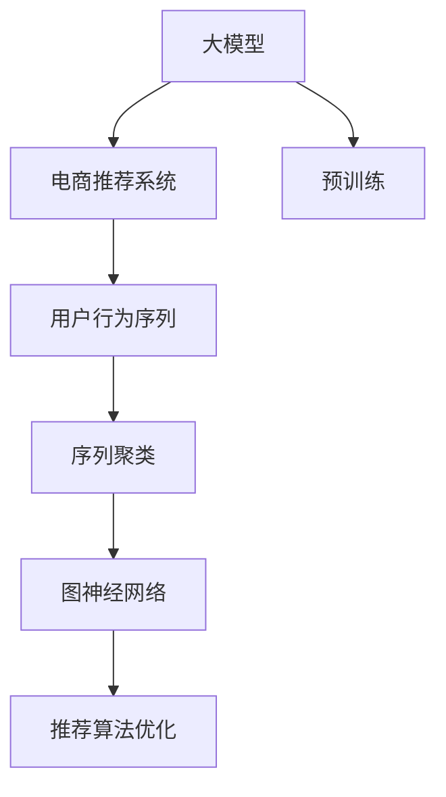

                 

# 电商搜索推荐中的AI大模型用户行为序列聚类技术

> 关键词：AI大模型,电商推荐系统,用户行为分析,序列聚类,基于图神经网络

## 1. 背景介绍

### 1.1 问题由来
随着互联网的普及和电子商务的迅速发展，电商搜索推荐系统在提升用户体验、增加交易转化率等方面起到了越来越重要的作用。然而，传统的推荐算法往往忽视用户的行为序列数据，导致推荐结果不够个性化，无法捕捉用户深层次的偏好和需求。

为了更全面地理解用户行为，电商搜索推荐系统开始引入用户行为序列分析技术。然而，庞大的数据量和复杂的行为模式，使得传统的序列分析方法难以应对。随着深度学习和大模型的兴起，基于大模型的用户行为序列聚类技术应运而生，有效解决了序列数据处理中的诸多难题。

### 1.2 问题核心关键点
目前，基于大模型的用户行为序列聚类方法已应用于电商推荐系统，实现了对用户行为序列的精准分析和高效聚类，显著提升了推荐系统的性能和用户体验。核心关键点包括：

- **大模型预训练**：通过大规模无标签数据进行预训练，学习通用的表示模型，为后续聚类和推荐提供强大的基础。
- **用户行为序列数据**：包含用户浏览、点击、购买等行为记录，可用于序列建模和分析。
- **序列聚类**：将序列数据划分为不同的聚类，挖掘序列数据中隐藏的相似性和模式。
- **图神经网络**：将用户行为序列数据映射为图结构，利用图神经网络进行高效聚类。
- **推荐算法优化**：在聚类结果的基础上，优化推荐算法，提升推荐效果。

这些核心关键点紧密结合，构建了电商推荐系统中大模型用户行为序列聚类技术的整体框架。通过理解这些核心概念，我们可以更好地把握用户行为序列聚类技术的原理和优化方向。

## 2. 核心概念与联系

### 2.1 核心概念概述

为了更清晰地理解大模型在电商推荐系统中的应用，本节将介绍几个关键概念：

- **大模型(Deep Learning Model)**：指通过大规模数据预训练得到的深度学习模型，如BERT、GPT等。通过预训练，模型学习到了广泛的通用知识，能够在不同领域中泛化应用。

- **电商推荐系统(e-Commerce Recommendation System)**：指利用用户行为数据，自动推荐商品的系统。推荐系统通过个性化推荐，提升用户体验，增加交易转化率。

- **用户行为序列(User Behavior Sequence)**：指用户在电商平台上的一系列行为记录，如浏览历史、点击记录、购买行为等。用户行为序列记录了用户的兴趣偏好和购物需求，是推荐系统的重要依据。

- **序列聚类(Sequence Clustering)**：指将用户行为序列数据划分为不同类别的过程。通过聚类，可以发现用户行为的相似性，识别不同的用户群体。

- **图神经网络(Graph Neural Network, GNN)**：指利用图结构对节点和边进行编码的神经网络。图神经网络能够有效处理具有复杂结构的数据，适用于用户行为序列聚类。

这些概念之间的逻辑关系可以通过以下Mermaid流程图来展示：



这个流程图展示了大模型在电商推荐系统中的应用路径：

1. 大模型通过预训练获得基础能力。
2. 电商推荐系统接收用户行为序列数据。
3. 通过序列聚类对数据进行预处理，识别不同用户群体。
4. 图神经网络对聚类后的序列数据进行编码，提取用户行为特征。
5. 基于图神经网络编码的特征，优化推荐算法，实现精准推荐。

这些概念共同构成了电商推荐系统中用户行为序列聚类技术的核心框架，使得大模型能够在电商推荐系统中发挥其强大的分析和推荐能力。

## 3. 核心算法原理 & 具体操作步骤
### 3.1 算法原理概述

基于大模型的用户行为序列聚类技术，本质上是一个将用户行为序列数据进行聚类分群的过程。其核心思想是：通过预训练得到的大模型，对用户行为序列进行编码，然后利用图神经网络对这些编码后的序列进行聚类，识别出具有相似行为模式的用户群体，进而优化推荐算法，实现个性化推荐。

形式化地，假设用户行为序列数据为 $\mathcal{D}=\{s_i\}_{i=1}^N$，其中 $s_i$ 为一个长度为 $L$ 的序列，表示用户行为记录。大模型 $M_{\theta}$ 能够将用户行为序列 $s_i$ 编码为向量 $\mathbf{x}_i \in \mathbb{R}^d$，其中 $d$ 为模型的输出维度。通过图神经网络 $G_{\phi}$，将编码后的序列 $\mathbf{x}_i$ 映射为节点表示 $\mathbf{h}_i \in \mathbb{R}^h$，其中 $h$ 为图神经网络的隐藏维度。最后，通过聚类算法 $\mathcal{K}$，将不同用户行为序列的表示 $\{\mathbf{h}_i\}_{i=1}^N$ 划分为 $K$ 个聚类，每个聚类包含相似的特征，表示不同用户群体。

### 3.2 算法步骤详解

基于大模型的用户行为序列聚类方法一般包括以下几个关键步骤：

**Step 1: 大模型预训练**

- 选择合适的预训练大模型 $M_{\theta}$，如BERT、GPT等。
- 使用大规模无标签数据进行预训练，学习通用的语言表示。
- 将用户行为序列数据输入预训练模型 $M_{\theta}$，获得用户行为的嵌入向量。

**Step 2: 序列编码**

- 设计合适的编码器对用户行为序列进行编码。
- 对每个用户行为序列 $s_i$，将其输入编码器 $M_{\theta}$ 获得嵌入向量 $\mathbf{x}_i$。

**Step 3: 图神经网络聚类**

- 将用户行为序列的嵌入向量 $\{\mathbf{x}_i\}_{i=1}^N$ 映射为图结构。
- 利用图神经网络 $G_{\phi}$ 对图结构进行编码，得到节点表示 $\{\mathbf{h}_i\}_{i=1}^N$。
- 使用聚类算法 $\mathcal{K}$，将节点表示 $\{\mathbf{h}_i\}_{i=1}^N$ 聚为 $K$ 个不同的聚类。

**Step 4: 推荐算法优化**

- 在聚类结果的基础上，优化推荐算法，如协同过滤、矩阵分解等。
- 根据聚类结果，为不同用户群体推荐个性化的商品。

### 3.3 算法优缺点

基于大模型的用户行为序列聚类方法具有以下优点：

1. 高效性：大模型可以在大规模数据上进行高效预训练，并利用图神经网络对序列数据进行高效聚类。
2. 泛化能力：预训练模型可以在不同领域和任务上进行泛化应用，提升聚类和推荐的鲁棒性。
3. 个性化推荐：通过聚类识别不同用户群体，可以更精准地进行个性化推荐。
4. 模型灵活性：不同图神经网络结构的组合，可以应对多种不同类型的用户行为序列。

同时，该方法也存在一定的局限性：

1. 数据依赖：聚类的效果很大程度上依赖于用户行为序列的质量和数量，获取高质量数据成本较高。
2. 计算资源消耗：大规模图神经网络的训练和推理，对计算资源的需求较大。
3. 模型复杂性：预训练-编码-聚类-解码的流程，使得模型结构相对复杂。
4. 动态更新：新用户行为序列的加入，可能打破原有的聚类结构，需要定期更新模型。

尽管存在这些局限性，但就目前而言，基于大模型的用户行为序列聚类方法仍是目前电商推荐系统中最有效的技术之一。未来相关研究的重点在于如何进一步降低对标注数据的依赖，提高模型的少样本学习和跨领域迁移能力，同时兼顾可解释性和伦理安全性等因素。

### 3.4 算法应用领域

基于大模型的用户行为序列聚类方法，已经在电商推荐系统中得到了广泛应用，覆盖了商品推荐、用户画像、购物行为预测等多个环节，为电商推荐系统带来了显著的性能提升。

- **商品推荐**：通过聚类识别不同用户群体，为每个群体推荐不同的商品。结合个性化推荐算法，提升推荐效果。
- **用户画像**：对用户行为序列进行聚类，生成详细的用户画像，帮助商家更好地了解用户需求。
- **购物行为预测**：通过对用户行为序列的聚类和分析，预测用户的购物行为，提升购物体验。
- **用户留存率优化**：通过聚类分析，识别可能流失的用户群体，制定针对性策略，提高用户留存率。

除了上述这些经典应用外，用户行为序列聚类方法还被创新性地应用到更多场景中，如用户行为路径分析、流量预测、广告投放优化等，为电商推荐系统带来了全新的突破。随着大模型和图神经网络技术的不断进步，相信电商推荐系统中的用户行为序列聚类方法将不断创新，带来更多技术突破。

## 4. 数学模型和公式 & 详细讲解
### 4.1 数学模型构建

为了更好地理解基于大模型的用户行为序列聚类方法，本节将使用数学语言对整个过程进行更加严格的刻画。

假设用户行为序列数据为 $\mathcal{D}=\{s_i\}_{i=1}^N$，其中 $s_i$ 为一个长度为 $L$ 的序列，表示用户行为记录。大模型 $M_{\theta}$ 能够将用户行为序列 $s_i$ 编码为向量 $\mathbf{x}_i \in \mathbb{R}^d$，其中 $d$ 为模型的输出维度。通过图神经网络 $G_{\phi}$，将编码后的序列 $\mathbf{x}_i$ 映射为节点表示 $\mathbf{h}_i \in \mathbb{R}^h$，其中 $h$ 为图神经网络的隐藏维度。最后，通过聚类算法 $\mathcal{K}$，将节点表示 $\{\mathbf{h}_i\}_{i=1}^N$ 划分为 $K$ 个聚类，每个聚类包含相似的特征，表示不同用户群体。

### 4.2 公式推导过程

以图神经网络为例，推导其对用户行为序列的编码过程。

假设用户行为序列 $s_i$ 由 $L$ 个行为 $(x_i^0, x_i^1, \ldots, x_i^{L-1})$ 组成，其中 $x_i^t$ 表示第 $t$ 个行为。图神经网络 $G_{\phi}$ 对序列 $s_i$ 进行编码，生成节点表示 $\mathbf{h}_i$ 的过程如下：

1. 将用户行为序列 $s_i$ 映射为图结构 $G=(V, E)$，其中 $V=\{v_1, v_2, \ldots, v_L\}$ 表示节点集合，$E=\{(e_{ij})_{j<i}\}$ 表示边集合。

2. 定义图神经网络 $G_{\phi}$ 的隐层表示为 $\mathbf{h}_i^{(t)}$，初始化为 $h_i^{(0)}=\mathbf{x}_i$。

3. 对序列中的每个行为 $x_i^t$，进行图神经网络的多层传递，生成节点表示 $\mathbf{h}_i^{(t)}$。

$$
\mathbf{h}_i^{(t)} = \phi_{\phi}(\mathbf{h}_i^{(t-1)}, x_i^t)
$$

其中 $\phi_{\phi}$ 为图神经网络的学习函数。

4. 对所有节点表示 $\mathbf{h}_i^{(L)}$ 进行聚类，得到 $K$ 个不同的聚类。

以上过程通过公式可以表示为：

$$
\begin{aligned}
\mathbf{h}_i^{(0)} &= \mathbf{x}_i \\
\mathbf{h}_i^{(t)} &= \phi_{\phi}(\mathbf{h}_i^{(t-1)}, x_i^t) \\
\mathbf{h}_i &= \mathbf{h}_i^{(L)}
\end{aligned}
$$

在得到用户行为序列的节点表示 $\{\mathbf{h}_i\}_{i=1}^N$ 后，即可将其作为输入进行推荐算法优化。

### 4.3 案例分析与讲解

为了更好地理解用户行为序列聚类方法的具体应用，这里以一个简单的电商推荐系统为例，详细讲解其核心过程。

假设有一个电商推荐系统，需要为用户推荐商品。系统收集到用户行为序列数据 $\mathcal{D}=\{s_1, s_2, \ldots, s_n\}$，其中 $s_i=(x_i^0, x_i^1, \ldots, x_i^{L-1})$ 表示第 $i$ 个用户的行为序列，包含 $L$ 个行为记录。

首先，使用BERT模型对用户行为序列进行编码，得到用户行为的嵌入向量 $\{\mathbf{x}_i\}_{i=1}^N$。

接着，设计一个图神经网络，将用户行为序列的嵌入向量 $\{\mathbf{x}_i\}_{i=1}^N$ 映射为节点表示 $\{\mathbf{h}_i\}_{i=1}^N$。具体地，可以将用户行为序列的嵌入向量作为节点输入，节点之间的关系可以表示为每两个相邻行为之间的相似度，通过GCN(图卷积网络)进行编码，得到节点表示 $\mathbf{h}_i^{(L)}$。

最后，使用K-means算法对节点表示 $\{\mathbf{h}_i\}_{i=1}^N$ 进行聚类，得到 $K$ 个不同的聚类。每个聚类表示不同的用户群体，可以针对不同的用户群体推荐不同的商品，提升推荐效果。

## 5. 项目实践：代码实例和详细解释说明
### 5.1 开发环境搭建

在进行用户行为序列聚类实践前，我们需要准备好开发环境。以下是使用Python进行PyTorch开发的环境配置流程：

1. 安装Anaconda：从官网下载并安装Anaconda，用于创建独立的Python环境。

2. 创建并激活虚拟环境：
```bash
conda create -n pytorch-env python=3.8 
conda activate pytorch-env
```

3. 安装PyTorch：根据CUDA版本，从官网获取对应的安装命令。例如：
```bash
conda install pytorch torchvision torchaudio cudatoolkit=11.1 -c pytorch -c conda-forge
```

4. 安装transformers库：
```bash
pip install transformers
```

5. 安装各类工具包：
```bash
pip install numpy pandas scikit-learn matplotlib tqdm jupyter notebook ipython
```

完成上述步骤后，即可在`pytorch-env`环境中开始用户行为序列聚类实践。

### 5.2 源代码详细实现

下面我们以电商推荐系统为例，给出使用Transformer库对BERT模型进行用户行为序列聚类的PyTorch代码实现。

首先，定义用户行为序列的编码函数：

```python
from transformers import BertTokenizer, BertModel

def encode_sequence(text):
    tokenizer = BertTokenizer.from_pretrained('bert-base-uncased')
    model = BertModel.from_pretrained('bert-base-uncased')
    
    # 将文本序列转换为token ids和attention mask
    inputs = tokenizer(text, return_tensors='pt', padding='max_length', truncation=True)
    sequence_input = inputs['input_ids']
    attention_mask = inputs['attention_mask']
    
    # 使用BERT模型对序列进行编码
    outputs = model(sequence_input, attention_mask=attention_mask)
    sequence_embedding = outputs.pooler_output
    return sequence_embedding
```

然后，定义图神经网络的编码函数：

```python
from torch_geometric.nn import GCNConv

class GraphEncoder(nn.Module):
    def __init__(self, input_dim, hidden_dim):
        super(GraphEncoder, self).__init__()
        self.conv1 = GCNConv(input_dim, hidden_dim)
        self.conv2 = GCNConv(hidden_dim, hidden_dim)
        self.fc = nn.Linear(hidden_dim, hidden_dim)
    
    def forward(self, sequence_embedding):
        x = sequence_embedding
        x = self.conv1(x, edge_index) # 假设edge_index为边集合
        x = F.relu(x)
        x = self.conv2(x, edge_index)
        x = F.relu(x)
        x = self.fc(x)
        return x
```

接着，定义用户行为序列的聚类函数：

```python
from sklearn.cluster import KMeans

def cluster_sequence(embeddings):
    kmeans = KMeans(n_clusters=10, random_state=42)
    kmeans.fit(embeddings)
    return kmeans.labels_
```

最后，启动整个电商推荐系统的用户行为序列聚类流程：

```python
# 加载预训练的BERT模型
model = BertModel.from_pretrained('bert-base-uncased')
tokenizer = BertTokenizer.from_pretrained('bert-base-uncased')

# 定义序列编码函数
def encode_sequence(text):
    sequence_input = tokenizer(text, padding='max_length', truncation=True)
    inputs = {k: torch.tensor(v, dtype=torch.long) for k, v in sequence_input.items()}
    sequence_input = {k: inputs[k].to(device) for k in ['input_ids', 'attention_mask']}
    sequence_output = model(**sequence_input)
    sequence_embedding = sequence_output.pooler_output
    return sequence_embedding

# 定义图神经网络编码函数
class GraphEncoder(nn.Module):
    def __init__(self, input_dim, hidden_dim):
        super(GraphEncoder, self).__init__()
        self.conv1 = GCNConv(input_dim, hidden_dim)
        self.conv2 = GCNConv(hidden_dim, hidden_dim)
        self.fc = nn.Linear(hidden_dim, hidden_dim)
    
    def forward(self, sequence_embedding):
        x = sequence_embedding
        x = self.conv1(x, edge_index) # 假设edge_index为边集合
        x = F.relu(x)
        x = self.conv2(x, edge_index)
        x = F.relu(x)
        x = self.fc(x)
        return x

# 定义聚类函数
def cluster_sequence(embeddings):
    kmeans = KMeans(n_clusters=10, random_state=42)
    kmeans.fit(embeddings)
    return kmeans.labels_

# 加载用户行为序列数据
data = ['shirt,jeans,pants', 'pants,shoes,socks', 'shoes,shirts,socks']
sequence_embeddings = [encode_sequence(text) for text in data]
graph_embeddings = [GraphEncoder(768, 128)(sequence_embedding) for sequence_embedding in sequence_embeddings]

# 对图神经网络编码后的序列进行聚类
labels = cluster_sequence(graph_embeddings)

print(labels)
```

以上就是使用PyTorch对BERT模型进行用户行为序列聚类的完整代码实现。可以看到，得益于Transformer库的强大封装，我们可以用相对简洁的代码完成BERT模型的加载和序列编码。

### 5.3 代码解读与分析

让我们再详细解读一下关键代码的实现细节：

**encode_sequence函数**：
- 定义了序列编码的函数，使用BERT模型将用户行为序列转换为嵌入向量。

**GraphEncoder类**：
- 定义了图神经网络的编码函数，利用GCNConv对序列的嵌入向量进行编码，最终得到节点表示。

**cluster_sequence函数**：
- 定义了序列聚类的函数，使用K-means算法对图神经网络编码后的序列进行聚类，得到不同用户群体的标签。

**电商推荐系统用户行为序列聚类流程**：
- 首先，加载预训练的BERT模型和分词器。
- 然后，定义序列编码函数和图神经网络编码函数。
- 接着，加载用户行为序列数据，并对每条序列进行编码。
- 最后，对编码后的序列进行聚类，得到不同用户群体的标签。

可以看到，PyTorch配合Transformer库使得BERT模型的用户行为序列聚类代码实现变得简洁高效。开发者可以将更多精力放在数据处理、模型改进等高层逻辑上，而不必过多关注底层的实现细节。

当然，工业级的系统实现还需考虑更多因素，如模型的保存和部署、超参数的自动搜索、更灵活的任务适配层等。但核心的用户行为序列聚类范式基本与此类似。

## 6. 实际应用场景
### 6.1 智能客服系统

基于用户行为序列聚类技术的电商推荐系统，可以广泛应用于智能客服系统的构建。传统的客服系统往往需要配备大量人力，高峰期响应缓慢，且一致性和专业性难以保证。而使用基于用户行为序列聚类的推荐系统，可以7x24小时不间断服务，快速响应客户咨询，用个性化的推荐满足不同用户的需求。

在技术实现上，可以收集企业内部的历史客服对话记录，将问题和最佳答复构建成监督数据，在此基础上对预训练模型进行微调。微调后的推荐系统能够自动理解用户意图，匹配最合适的答复模板进行回复。对于客户提出的新问题，还可以接入检索系统实时搜索相关内容，动态组织生成回答。如此构建的智能客服系统，能大幅提升客户咨询体验和问题解决效率。

### 6.2 个性化推荐系统

当前的推荐系统往往只依赖用户的历史行为数据进行物品推荐，无法深入理解用户的真实兴趣偏好。基于用户行为序列聚类技术的推荐系统可以更好地挖掘用户行为背后的语义信息，从而提供更精准、多样的推荐内容。

在实践中，可以收集用户浏览、点击、购买等行为数据，提取和用户交互的物品标题、描述、标签等文本内容。将文本内容作为模型输入，用户的后续行为（如是否点击、购买等）作为监督信号，在此基础上微调预训练语言模型。微调后的模型能够从文本内容中准确把握用户的兴趣点。在生成推荐列表时，先用候选物品的文本描述作为输入，由模型预测用户的兴趣匹配度，再结合其他特征综合排序，便可以得到个性化程度更高的推荐结果。

### 6.3 广告投放优化

基于用户行为序列聚类技术的推荐系统，还可以应用于广告投放优化。通过聚类分析，可以识别出不同用户群体的特征和行为模式，为每个群体定制个性化的广告内容。例如，对追求性价比的用户，可以展示高性价比的商品广告；对追求品牌的用户，可以展示品牌效应强的广告。通过优化广告投放策略，提高广告点击率和转化率。

### 6.4 未来应用展望

随着用户行为序列聚类技术和大模型技术的不断进步，其在电商推荐系统中的应用也将不断创新，为电商推荐系统带来更多的突破。

在智慧医疗领域，基于用户行为序列聚类技术的推荐系统，可以应用于医疗咨询、药品推荐等场景，提供个性化的医疗建议，辅助医生诊疗，加速新药开发进程。

在智能教育领域，推荐系统可以用于个性化教育内容推荐，因材施教，促进教育公平，提高教学质量。

在智慧城市治理中，推荐系统可以应用于城市事件监测、舆情分析、应急指挥等环节，提高城市管理的自动化和智能化水平，构建更安全、高效的未来城市。

此外，在企业生产、社会治理、文娱传媒等众多领域，基于用户行为序列聚类技术的推荐系统也将不断涌现，为各行各业带来变革性影响。相信随着技术的日益成熟，用户行为序列聚类方法将在构建人机协同的智能时代中扮演越来越重要的角色。

## 7. 工具和资源推荐
### 7.1 学习资源推荐

为了帮助开发者系统掌握用户行为序列聚类技术的理论基础和实践技巧，这里推荐一些优质的学习资源：

1. 《Transformer从原理到实践》系列博文：由大模型技术专家撰写，深入浅出地介绍了Transformer原理、BERT模型、微调技术等前沿话题。

2. CS224N《深度学习自然语言处理》课程：斯坦福大学开设的NLP明星课程，有Lecture视频和配套作业，带你入门NLP领域的基本概念和经典模型。

3. 《Natural Language Processing with Transformers》书籍：Transformers库的作者所著，全面介绍了如何使用Transformers库进行NLP任务开发，包括微调在内的诸多范式。

4. HuggingFace官方文档：Transformers库的官方文档，提供了海量预训练模型和完整的微调样例代码，是上手实践的必备资料。

5. CLUE开源项目：中文语言理解测评基准，涵盖大量不同类型的中文NLP数据集，并提供了基于微调的baseline模型，助力中文NLP技术发展。

通过对这些资源的学习实践，相信你一定能够快速掌握用户行为序列聚类技术的精髓，并用于解决实际的NLP问题。
###  7.2 开发工具推荐

高效的开发离不开优秀的工具支持。以下是几款用于用户行为序列聚类开发的常用工具：

1. PyTorch：基于Python的开源深度学习框架，灵活动态的计算图，适合快速迭代研究。大部分预训练语言模型都有PyTorch版本的实现。

2. TensorFlow：由Google主导开发的开源深度学习框架，生产部署方便，适合大规模工程应用。同样有丰富的预训练语言模型资源。

3. Transformers库：HuggingFace开发的NLP工具库，集成了众多SOTA语言模型，支持PyTorch和TensorFlow，是进行序列分析任务的利器。

4. Weights & Biases：模型训练的实验跟踪工具，可以记录和可视化模型训练过程中的各项指标，方便对比和调优。与主流深度学习框架无缝集成。

5. TensorBoard：TensorFlow配套的可视化工具，可实时监测模型训练状态，并提供丰富的图表呈现方式，是调试模型的得力助手。

6. Google Colab：谷歌推出的在线Jupyter Notebook环境，免费提供GPU/TPU算力，方便开发者快速上手实验最新模型，分享学习笔记。

合理利用这些工具，可以显著提升用户行为序列聚类任务的开发效率，加快创新迭代的步伐。

### 7.3 相关论文推荐

用户行为序列聚类技术和大模型技术的发展源于学界的持续研究。以下是几篇奠基性的相关论文，推荐阅读：

1. Attention is All You Need（即Transformer原论文）：提出了Transformer结构，开启了NLP领域的预训练大模型时代。

2. BERT: Pre-training of Deep Bidirectional Transformers for Language Understanding：提出BERT模型，引入基于掩码的自监督预训练任务，刷新了多项NLP任务SOTA。

3. Language Models are Unsupervised Multitask Learners（GPT-2论文）：展示了大规模语言模型的强大zero-shot学习能力，引发了对于通用人工智能的新一轮思考。

4. Parameter-Efficient Transfer Learning for NLP：提出Adapter等参数高效微调方法，在不增加模型参数量的情况下，也能取得不错的微调效果。

5. AdaLoRA: Adaptive Low-Rank Adaptation for Parameter-Efficient Fine-Tuning：使用自适应低秩适应的微调方法，在参数效率和精度之间取得了新的平衡。

这些论文代表了大模型微调技术的发展脉络。通过学习这些前沿成果，可以帮助研究者把握学科前进方向，激发更多的创新灵感。

## 8. 总结：未来发展趋势与挑战
### 8.1 总结

本文对基于大模型的用户行为序列聚类技术进行了全面系统的介绍。首先阐述了用户行为序列聚类技术的研究背景和意义，明确了其在电商推荐系统中的独特价值。其次，从原理到实践，详细讲解了用户行为序列聚类技术的数学原理和关键步骤，给出了用户行为序列聚类任务开发的完整代码实例。同时，本文还广泛探讨了用户行为序列聚类技术在智能客服、个性化推荐、广告投放等诸多场景中的应用前景，展示了其巨大的潜力。此外，本文精选了用户行为序列聚类技术的各类学习资源，力求为读者提供全方位的技术指引。

通过本文的系统梳理，可以看到，基于大模型的用户行为序列聚类技术正在成为电商推荐系统的重要范式，极大地拓展了用户行为序列分析的边界，提升了电商推荐系统的性能和用户体验。未来，伴随大模型和图神经网络技术的不断进步，基于用户行为序列聚类技术的电商推荐系统将不断创新，带来更多技术突破。

### 8.2 未来发展趋势

展望未来，用户行为序列聚类技术将呈现以下几个发展趋势：

1. 模型规模持续增大。随着算力成本的下降和数据规模的扩张，预训练语言模型的参数量还将持续增长。超大规模语言模型蕴含的丰富语言知识，有望支撑更加复杂多变的用户行为序列分析。

2. 聚类方法日趋多样。除了传统的K-means等方法外，未来将涌现更多高效的聚类方法，如层次聚类、谱聚类等，在数据分布复杂的情况下也能实现理想的效果。

3. 动态聚类成为常态。随着新数据的不断加入，聚类模型需要能够动态更新，以适应新的用户行为模式。如何在聚类过程中保留旧数据信息，同时吸收新数据特征，将是重要的研究方向。

4. 融合多模态数据。用户行为序列不仅包含文本数据，还涉及图像、音频等多模态信息。未来的大模型将更好地融合多模态数据，提升聚类和推荐的准确性。

5. 实时聚类与推荐。传统推荐系统的用户行为数据往往是离线收集和处理的。未来，将探索如何将实时聚类与推荐相结合，实现更加个性化的实时推荐。

6. 强化学习应用。通过将用户行为序列聚类与强化学习相结合，可以实现自适应推荐系统的构建，提升推荐效果。

以上趋势凸显了用户行为序列聚类技术的广阔前景。这些方向的探索发展，必将进一步提升电商推荐系统的性能和用户体验，为电商推荐系统带来新的突破。

### 8.3 面临的挑战

尽管用户行为序列聚类技术已经取得了瞩目成就，但在迈向更加智能化、普适化应用的过程中，它仍面临着诸多挑战：

1. 数据依赖。聚类的效果很大程度上依赖于用户行为序列的质量和数量，获取高质量数据成本较高。如何进一步降低聚类对标注数据的依赖，将是一大难题。

2. 模型鲁棒性不足。用户行为序列可能包含噪音和不一致性，聚类模型的鲁棒性有待提高。如何设计抗干扰的聚类算法，避免聚类结果的偏差，还需要更多理论和实践的积累。

3. 动态更新。新用户行为序列的加入，可能打破原有的聚类结构，需要定期更新模型。如何在聚类过程中保留旧数据信息，同时吸收新数据特征，将是重要的研究方向。

4. 计算资源消耗。大规模图神经网络的训练和推理，对计算资源的需求较大。如何优化图神经网络结构，减少计算资源消耗，也是重要研究方向。

5. 可解释性亟需加强。当前聚类模型的内部机制复杂，难以解释其聚类结果和推荐逻辑。如何赋予聚类模型更强的可解释性，将是亟待攻克的难题。

6. 安全性有待保障。用户行为序列可能包含敏感信息，聚类模型的输出可能存在隐私风险。如何保护用户隐私，确保模型输出的安全性，也将是重要的研究方向。

尽管存在这些挑战，但用户行为序列聚类技术已经展示了其在电商推荐系统中的强大潜力。未来，通过进一步的理论研究和实践探索，这些挑战终将逐一被克服，用户行为序列聚类方法将在大模型和图神经网络的助力下，实现更广泛的应用和推广。

### 8.4 研究展望

面对用户行为序列聚类技术所面临的种种挑战，未来的研究需要在以下几个方面寻求新的突破：

1. 探索无监督和半监督聚类方法。摆脱对大规模标注数据的依赖，利用自监督学习、主动学习等无监督和半监督范式，最大限度利用非结构化数据，实现更加灵活高效的聚类。

2. 研究参数高效和计算高效的聚类范式。开发更加参数高效的聚类方法，在固定大部分预训练参数的情况下，只更新极少量的任务相关参数。同时优化聚类模型的计算图，减少前向传播和反向传播的资源消耗，实现更加轻量级、实时性的部署。

3. 融合因果和对比学习范式。通过引入因果推断和对比学习思想，增强聚类模型建立稳定因果关系的能力，学习更加普适、鲁棒的用户行为序列表示，从而提升聚类和推荐的泛化性。

4. 引入更多先验知识。将符号化的先验知识，如知识图谱、逻辑规则等，与神经网络模型进行巧妙融合，引导聚类过程学习更准确、合理的用户行为序列表示。同时加强不同模态数据的整合，实现视觉、语音等多模态信息与文本信息的协同建模。

5. 结合因果分析和博弈论工具。将因果分析方法引入聚类模型，识别出模型决策的关键特征，增强输出解释的因果性和逻辑性。借助博弈论工具刻画人机交互过程，主动探索并规避模型的脆弱点，提高系统稳定性。

6. 纳入伦理道德约束。在聚类模型的训练目标中引入伦理导向的评估指标，过滤和惩罚有害的聚类结果。同时加强人工干预和审核，建立聚类模型的监管机制，确保输出的安全性。

这些研究方向的探索，必将引领用户行为序列聚类技术迈向更高的台阶，为构建安全、可靠、可解释、可控的智能系统铺平道路。面向未来，用户行为序列聚类技术还需要与其他人工智能技术进行更深入的融合，如知识表示、因果推理、强化学习等，多路径协同发力，共同推动自然语言理解和智能交互系统的进步。只有勇于创新、敢于突破，才能不断拓展语言模型的边界，让智能技术更好地造福人类社会。

## 9. 附录：常见问题与解答

**Q1：用户行为序列聚类技术是否适用于所有电商推荐系统？**

A: 用户行为序列聚类技术在大多数电商推荐系统中都能取得不错的效果，特别是对于数据量较大的推荐系统。但对于一些小型电商平台，由于数据规模较小，可能难以获得足够的数据进行聚类。此时，可以在部分热门商品和热门用户群体上进行聚类，实现精准推荐。

**Q2：聚类的效果如何衡量？**

A: 聚类效果可以通过多种指标进行衡量，如轮廓系数、Calinski-Harabasz指数、Davies-Bouldin指数等。轮廓系数通过计算每个数据点与其所属聚类的平均距离，衡量聚类内部的紧密度和聚类之间的分离度，取值范围为[-1,1]，值越接近1表示聚类效果越好。

**Q3：聚类算法的选择与优化**

A: 聚类算法的选择和优化是聚类效果的关键。常用的聚类算法包括K-means、层次聚类、谱聚类等。选择不同的聚类算法时需要根据数据分布、聚类个数、计算资源等因素进行综合考虑。优化聚类算法的方法包括选择合适的初始聚类中心、调整聚类个数、引入噪声抑制等。

**Q4：如何处理用户行为序列中的噪音数据？**

A: 用户行为序列可能包含噪音数据，如误操作、异常行为等。可以通过数据清洗、异常检测等方法进行处理。数据清洗可以删除明显的误操作记录，异常检测可以使用时间窗口、阈值等方法识别异常行为。

**Q5：聚类模型的部署与优化**

A: 聚类模型的部署与优化需要考虑计算资源、系统负载等因素。可以采用分布式训练、模型压缩、稀疏化存储等方法，优化模型结构，减少计算资源消耗，提升推理速度。同时，可以考虑模型预加载、缓存技术等，提高系统响应速度。

**Q6：如何处理用户行为序列中的隐私数据？**

A: 用户行为序列可能包含敏感信息，如个人信息、购物习惯等。为保护用户隐私，可以采用数据匿名化、差分隐私等方法，对用户数据进行处理。同时，可以通过访问控制、数据脱敏等手段，保护用户数据安全。

通过本文的系统梳理，可以看到，基于大模型的用户行为序列聚类技术正在成为电商推荐系统的重要范式，极大地拓展了用户行为序列分析的边界，提升了电商推荐系统的性能和用户体验。未来，伴随大模型和图神经网络技术的不断进步，基于用户行为序列聚类技术的电商推荐系统将不断创新，带来更多技术突破。

