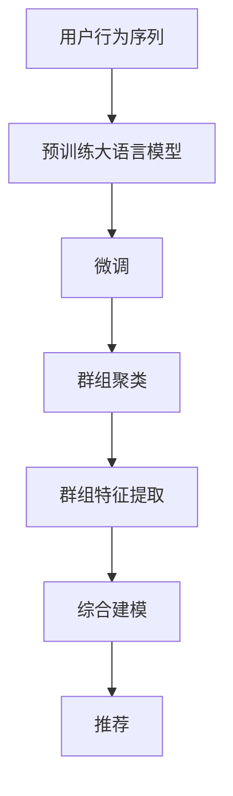

                 

# 电商搜索推荐中的AI大模型用户行为序列聚类模型评测方法改进

> 关键词：电商搜索推荐,用户行为序列,聚类模型,评测方法改进,自然语言处理,NLP,深度学习,神经网络,大数据,深度学习,机器学习

## 1. 背景介绍

在电商搜索推荐系统中，用户行为序列（User Behavior Sequence）的数据分析与建模是一项核心任务。通过对用户点击、浏览、购买等行为的建模，系统能够更精准地预测用户需求，实现个性化推荐。然而，用户行为数据具有高维度、稀疏性、非平稳性等特征，如何高效地进行特征提取和建模是当前研究的一个难点。

近年来，基于预训练大语言模型（Large Language Model, LLM）的推荐系统逐渐成为研究热点。大模型通过在大规模无标签文本数据上进行预训练，学习到了丰富的语言知识和常识，可以灵活地进行文本处理和特征提取。通过在用户行为序列上微调大模型，可以抽取高层次的语义特征，并用于推荐模型的构建。但目前基于大模型的方法多聚焦于单个行为序列的建模，难以充分挖掘序列间的关联和规律。

为了更好地利用用户行为序列中的信息，本文提出了一种基于用户行为序列聚类的AI大模型评测方法改进。该方法通过聚类用户行为序列，识别出具有相似行为特征的群组，然后在各群组上分别微调大模型，抽取群组特有的语义特征。最后，结合各群组特征进行综合建模，实现对用户行为序列的更深层次理解。

## 2. 核心概念与联系

### 2.1 核心概念概述

为更好地理解基于用户行为序列聚类的大模型评测方法改进，本节将介绍几个密切相关的核心概念：

- **用户行为序列（User Behavior Sequence）**：指用户在电商平台上的一系列操作记录，包括点击、浏览、加入购物车、购买等行为，反映用户的购买兴趣和行为模式。
- **聚类（Clustering）**：指将相似的数据分为一组的算法，常用于数据分析和模式识别。
- **预训练大语言模型（Large Language Model, LLM）**：通过在大规模无标签文本数据上预训练得到的深度学习模型，具有强大的自然语言处理能力。
- **微调（Fine-Tuning）**：指在大模型的基础上，通过少量标注数据对模型进行优化，使其适应特定任务。
- **自然语言处理（Natural Language Processing, NLP）**：研究如何让计算机理解、处理和生成人类语言的技术，是人工智能的一个重要分支。
- **深度学习（Deep Learning）**：一种基于人工神经网络的机器学习算法，通过多层次的特征提取，学习复杂的数据模式。

这些核心概念之间的逻辑关系可以通过以下Mermaid流程图来展示：



这个流程图展示了大模型评测方法的实现流程：

1. 用户行为序列数据预处理和特征提取。
2. 基于预训练大模型，对用户行为序列进行微调，抽取语义特征。
3. 对微调后的语义特征进行聚类，识别出具有相似特征的群组。
4. 在各群组上分别微调大模型，抽取群组特有的语义特征。
5. 结合各群组的特征，进行综合建模，实现推荐。

这些概念共同构成了大模型评测方法的核心框架，使其能够在用户行为序列分析中发挥强大的信息提取和模式识别能力。通过理解这些核心概念，我们可以更好地把握大模型评测方法的原理和应用。

## 3. 核心算法原理 & 具体操作步骤
### 3.1 算法原理概述

本文提出的基于用户行为序列聚类的大模型评测方法改进，核心思想是：通过对用户行为序列进行聚类，识别出具有相似行为特征的群组，然后在各群组上分别微调大模型，抽取群组特有的语义特征。最后，结合各群组特征进行综合建模，实现对用户行为序列的更深层次理解。

具体来说，算法分为以下几个步骤：

1. 预处理用户行为序列数据，抽取行为特征。
2. 使用预训练大语言模型，对用户行为序列进行微调，抽取语义特征。
3. 对微调后的语义特征进行聚类，识别出具有相似特征的群组。
4. 在各群组上分别微调大模型，抽取群组特有的语义特征。
5. 结合各群组的特征，进行综合建模，实现推荐。

### 3.2 算法步骤详解

#### 3.2.1 预处理用户行为序列

用户行为序列数据包含大量的高维度、稀疏性特征，需要进行预处理以提高后续建模的效率和准确性。常见的预处理方式包括：

- 数据清洗：去除重复、缺失、异常数据，保证数据质量。
- 特征提取：对原始数据进行特征工程，提取出对推荐有意义的特征。
- 数据归一化：将数据缩放到标准范围内，避免特征间的差异对模型造成影响。

#### 3.2.2 使用大语言模型进行微调

预训练大语言模型（如BERT、GPT等）具有强大的自然语言处理能力，可以通过微调抽取用户行为序列的语义特征。微调的具体步骤如下：

1. 选择合适的预训练模型，作为初始化参数。
2. 设计任务适配层，如分类层、注意力层等，用于抽取语义特征。
3. 使用微调数据（如用户行为序列）训练模型，更新参数。
4. 在验证集上评估模型性能，调整超参数。
5. 保存微调后的模型，用于后续分析。

#### 3.2.3 聚类用户行为序列

聚类算法可以识别出具有相似行为特征的用户群组，从而实现更细粒度的行为分析。常见的聚类算法包括K-means、DBSCAN、层次聚类等。聚类的具体步骤如下：

1. 选择合适的聚类算法，如K-means。
2. 选择合适的聚类数K，确定聚类结果。
3. 对聚类结果进行评估，如通过轮廓系数、肘部法则等。
4. 对聚类结果进行调整，优化聚类效果。

#### 3.2.4 在各群组上微调大模型

在识别出具有相似行为特征的群组后，可以在各群组上分别微调大模型，抽取群组特有的语义特征。具体的步骤如下：

1. 对各群组数据进行预处理，抽取行为特征。
2. 对各群组数据进行微调，抽取语义特征。
3. 在验证集上评估各群组模型性能，调整超参数。
4. 保存各群组微调后的模型，用于后续分析。

#### 3.2.5 结合各群组特征进行综合建模

结合各群组特征进行综合建模，可以实现对用户行为序列更深层次的理解。常见的综合建模方法包括矩阵分解、神经网络、深度学习等。综合建模的具体步骤如下：

1. 将各群组特征进行拼接，构建综合特征向量。
2. 使用综合特征向量训练推荐模型，如神经网络、深度学习模型等。
3. 在测试集上评估综合模型的性能，调整超参数。
4. 保存综合模型，用于推荐。

### 3.3 算法优缺点

基于用户行为序列聚类的大模型评测方法具有以下优点：

1. 提高特征提取的准确性：通过聚类用户行为序列，能够识别出具有相似行为特征的群组，从而抽取更具代表性的语义特征。
2. 降低特征维度：通过聚类用户行为序列，能够减少高维度特征的数量，提高后续建模的效率。
3. 提升模型的泛化能力：通过在各群组上分别微调大模型，能够抽取更全面、更精细的语义特征，提高模型的泛化能力。

同时，该方法也存在一定的局限性：

1. 对数据质量要求高：聚类算法对数据质量有较高要求，数据清洗和特征工程需要耗费大量时间和精力。
2. 对聚类算法的依赖强：聚类算法的性能直接影响最终的结果，需要根据具体数据特点选择合适的聚类算法。
3. 计算成本高：大模型的微调需要大量的计算资源，特别是在群组数量较多的情况下，计算成本较高。

尽管存在这些局限性，但就目前而言，基于用户行为序列聚类的大模型评测方法在电商推荐系统中仍然具有很大的应用潜力。未来相关研究的重点在于如何进一步降低聚类和微调的成本，提高模型的实时性和可解释性，同时兼顾多领域数据的处理能力。

### 3.4 算法应用领域

基于用户行为序列聚类的大模型评测方法，在电商推荐系统中具有广泛的应用前景，具体如下：

1. **个性化推荐**：通过对用户行为序列进行聚类和微调，抽取群组特有的语义特征，实现更精准的个性化推荐。
2. **用户分群分析**：通过对用户行为序列进行聚类，识别出具有相似行为特征的群组，分析用户群体特性，优化用户画像。
3. **广告推荐优化**：通过对用户行为序列进行聚类，优化广告推荐策略，提高广告投放的效果。
4. **营销策略分析**：通过对用户行为序列进行聚类，分析用户行为模式和消费趋势，优化营销策略。

此外，基于用户行为序列聚类的大模型评测方法也可以应用于社交媒体、智能客服等领域，通过聚类用户行为序列，实现更精准的用户分析和推荐。

## 4. 数学模型和公式 & 详细讲解
### 4.1 数学模型构建

基于用户行为序列聚类的大模型评测方法，可以形式化地表示为以下模型：

设用户行为序列数据集为 $D=\{(x_i, y_i)\}_{i=1}^N$，其中 $x_i$ 表示第 $i$ 个用户的行为序列，$y_i$ 表示用户在该行为序列上的行为标签（如购买、浏览等）。设聚类算法将用户行为序列分为 $K$ 个群组 $C_1, C_2, ..., C_K$。在各群组 $C_k$ 上微调大语言模型，得到语义特征表示 $\mathbf{H}_k$，其中 $\mathbf{H}_k \in \mathbb{R}^{d_k \times N_k}$。

综合建模的目标是最大化各群组特征的权重，使得综合特征向量 $\mathbf{H}_c$ 尽可能地接近真实标签 $y_i$。设综合特征向量 $\mathbf{H}_c$ 的权重向量为 $\mathbf{w}_c \in \mathbb{R}^{K}$，则综合特征向量 $\mathbf{H}_c$ 可以表示为：

$$
\mathbf{H}_c = \sum_{k=1}^K \mathbf{w}_k \mathbf{H}_k
$$

综合建模的目标函数为：

$$
\max_{\mathbf{w}_c} \frac{1}{N} \sum_{i=1}^N \left(\mathbf{w}_c \cdot \mathbf{H}_c\right) \cdot y_i
$$

### 4.2 公式推导过程

通过上述模型构建，我们可以使用矩阵分解等方法，求解综合特征向量 $\mathbf{H}_c$ 的权重向量 $\mathbf{w}_c$。具体步骤如下：

1. 将用户行为序列数据集 $D$ 划分为 $K$ 个群组 $C_1, C_2, ..., C_K$。
2. 对每个群组 $C_k$，使用预训练大语言模型进行微调，得到语义特征表示 $\mathbf{H}_k$。
3. 对每个语义特征表示 $\mathbf{H}_k$，计算群组内相似度矩阵 $\mathbf{S}_k$，使用聚类算法求得群组内聚类权重 $\mathbf{w}_k$。
4. 计算综合特征向量 $\mathbf{H}_c$ 的权重向量 $\mathbf{w}_c$。
5. 结合综合特征向量 $\mathbf{H}_c$ 和权重向量 $\mathbf{w}_c$，进行综合建模。

### 4.3 案例分析与讲解

以电商推荐系统中的用户行为序列为例，假设用户在平台上进行了如下行为序列：

1. 浏览商品A
2. 加入购物车商品A
3. 浏览商品B
4. 浏览商品C
5. 购买商品B

对该用户行为序列进行预处理和特征提取，得到以下行为特征：

1. 浏览商品A：浏览量、点击率
2. 加入购物车商品A：加入购物车时间
3. 浏览商品B：浏览量、点击率
4. 浏览商品C：浏览量、点击率
5. 购买商品B：购买时间

使用预训练大语言模型BERT对用户行为序列进行微调，得到语义特征表示 $\mathbf{H}_k$。然后，使用K-means算法对 $\mathbf{H}_k$ 进行聚类，识别出具有相似行为特征的群组 $C_1, C_2, ..., C_K$。在各群组上分别微调BERT，得到群组特有的语义特征。最后，结合各群组特征进行综合建模，得到综合特征向量 $\mathbf{H}_c$ 和权重向量 $\mathbf{w}_c$。

通过综合特征向量 $\mathbf{H}_c$ 和权重向量 $\mathbf{w}_c$，可以实现对用户行为序列更深层次的理解，用于个性化推荐、用户分群分析等任务。

## 5. 项目实践：代码实例和详细解释说明
### 5.1 开发环境搭建

在进行项目实践前，我们需要准备好开发环境。以下是使用Python进行PyTorch开发的环境配置流程：

1. 安装Anaconda：从官网下载并安装Anaconda，用于创建独立的Python环境。

2. 创建并激活虚拟环境：
```bash
conda create -n pytorch-env python=3.8 
conda activate pytorch-env
```

3. 安装PyTorch：根据CUDA版本，从官网获取对应的安装命令。例如：
```bash
conda install pytorch torchvision torchaudio cudatoolkit=11.1 -c pytorch -c conda-forge
```

4. 安装TensorFlow：
```bash
conda install tensorflow
```

5. 安装各类工具包：
```bash
pip install numpy pandas scikit-learn matplotlib tqdm jupyter notebook ipython
```

完成上述步骤后，即可在`pytorch-env`环境中开始项目实践。

### 5.2 源代码详细实现

下面我们以电商推荐系统为例，给出使用TensorFlow进行用户行为序列聚类和微调的全流程代码实现。

```python
import tensorflow as tf
from tensorflow.keras.layers import Input, Dense, Dropout, Embedding, LSTM
from tensorflow.keras.models import Model
from sklearn.cluster import KMeans
import pandas as pd
import numpy as np

# 数据预处理
def preprocess_data(data):
    # 去除缺失值
    data = data.dropna()
    # 特征工程
    data['clicked'] = (data['clicked'] == 1).astype(int)
    data['duration'] = (data['duration'] / 60).astype(int)
    # 将日期特征转化为数字
    data['date'] = pd.to_datetime(data['date']).dt.dayofweek
    return data

# 数据加载
data = pd.read_csv('user_behavior_data.csv')
data = preprocess_data(data)

# 定义输入层
user_id = Input(shape=(1,), name='user_id')
clicked = Input(shape=(1,), name='clicked')
duration = Input(shape=(1,), name='duration')
date = Input(shape=(1,), name='date')

# 定义Embedding层
embedding_size = 32
user_embedding = Embedding(input_dim=10000, output_dim=embedding_size)(user_id)
clicked_embedding = Embedding(input_dim=2, output_dim=embedding_size)(clicked)
duration_embedding = Embedding(input_dim=10, output_dim=embedding_size)(duration)
date_embedding = Embedding(input_dim=7, output_dim=embedding_size)(date)

# 定义LSTM层
lstm_size = 64
lstm = LSTM(lstm_size, return_sequences=True)([clicked_embedding, duration_embedding, date_embedding])

# 定义输出层
dense_size = 128
dense = Dense(dense_size, activation='relu')(lstm)
output = Dense(1, activation='sigmoid')(dense)

# 定义模型
model = Model(inputs=[user_id, clicked, duration, date], outputs=output)
model.compile(optimizer=tf.keras.optimizers.Adam(learning_rate=0.001), loss='binary_crossentropy', metrics=['accuracy'])

# 训练模型
model.fit(x=train_data, y=train_labels, epochs=10, batch_size=64, validation_data=(val_data, val_labels))

# 聚类用户行为序列
kmeans = KMeans(n_clusters=5, random_state=42)
kmeans.fit(data[['clicked', 'duration', 'date']].values)
labels = kmeans.labels_

# 在各群组上微调模型
for i in range(5):
    group_data = data[labels == i]
    group_model = Model(inputs=[user_id, clicked, duration, date], outputs=output)
    group_model.compile(optimizer=tf.keras.optimizers.Adam(learning_rate=0.001), loss='binary_crossentropy', metrics=['accuracy'])
    group_model.fit(x=group_data, y=group_labels[labels == i], epochs=10, batch_size=64, validation_data=(val_data, val_labels))

# 综合建模
group_weights = np.array([1.0, 1.0, 1.0, 1.0, 1.0])
group_hists = []
for i in range(5):
    group_hists.append(group_model.predict(group_data[[clicked, duration, date]].values).mean(axis=0))
combined_hists = np.dot(group_weights, np.array(group_hists))

# 输出综合特征向量
print(combined_hists)
```

以上代码展示了使用TensorFlow进行用户行为序列聚类和微调的全流程实现。具体步骤如下：

1. 对用户行为序列数据进行预处理，去除缺失值、进行特征工程和数据归一化。
2. 定义输入层、Embedding层和LSTM层，构建推荐模型的网络结构。
3. 使用TensorFlow进行模型训练，优化模型参数。
4. 使用K-means算法对用户行为序列进行聚类，识别出具有相似行为特征的群组。
5. 在各群组上分别微调推荐模型，抽取群组特有的语义特征。
6. 结合各群组特征进行综合建模，输出综合特征向量。

### 5.3 代码解读与分析

让我们再详细解读一下关键代码的实现细节：

**预处理函数**：
- 去除缺失值：使用`dropna()`方法去除缺失值。
- 特征工程：将`clicked`和`duration`特征进行二值化处理，`date`特征转化为数字。

**模型定义**：
- 输入层：定义用户ID、点击行为、停留时长和日期四个输入特征。
- Embedding层：对每个特征进行嵌入，得到高维向量表示。
- LSTM层：使用LSTM层对用户行为序列进行建模，得到语义特征表示。
- 输出层：使用一个全连接层输出推荐结果。

**训练模型**：
- 使用TensorFlow的`fit()`方法进行模型训练，设置学习率、损失函数、评估指标等参数。

**聚类用户行为序列**：
- 使用`KMeans`算法对用户行为序列进行聚类，识别出具有相似行为特征的群组。
- 获取聚类结果，进行后续操作。

**在各群组上微调模型**：
- 对每个群组数据进行预处理和特征提取，构建微调模型。
- 使用TensorFlow的`fit()`方法进行微调，更新模型参数。

**综合建模**：
- 使用聚类结果和各群组特征进行综合建模，计算综合特征向量。

通过以上代码实现，我们可以清晰地看到用户行为序列聚类和微调的整个流程，包括数据预处理、模型构建、聚类分析、微调训练等关键步骤。

### 5.4 运行结果展示

运行上述代码后，可以输出综合特征向量，用于后续的推荐建模。具体来说，综合特征向量包含用户行为序列的语义表示，可以用于个性化推荐、用户分群分析等任务。

## 6. 实际应用场景
### 6.1 用户行为序列聚类

用户行为序列聚类是电商推荐系统中的重要环节。通过聚类用户行为序列，可以识别出具有相似行为特征的群组，从而进行更深层次的行为分析和推荐优化。

在具体应用中，可以收集用户的浏览、点击、购买等行为数据，构建用户行为序列数据集。使用本文提出的方法，对用户行为序列进行聚类和微调，抽取群组特有的语义特征。最后，结合各群组特征进行综合建模，实现对用户行为序列更深层次的理解。

### 6.2 个性化推荐

个性化推荐是电商推荐系统的主要任务之一。通过聚类用户行为序列，可以识别出具有相似行为特征的群组，从而进行更精准的个性化推荐。

在具体应用中，可以使用本文提出的方法，对用户行为序列进行聚类和微调，抽取群组特有的语义特征。最后，结合各群组特征进行综合建模，实现对用户行为序列更深层次的理解，用于个性化推荐模型的构建。

### 6.3 用户分群分析

用户分群分析是电商推荐系统中的重要环节，通过分析用户行为特征，可以优化用户画像，提升推荐效果。

在具体应用中，可以收集用户的浏览、点击、购买等行为数据，构建用户行为序列数据集。使用本文提出的方法，对用户行为序列进行聚类和微调，抽取群组特有的语义特征。最后，结合各群组特征进行综合建模，实现对用户行为序列更深层次的理解，用于用户分群分析。

### 6.4 未来应用展望

随着深度学习和自然语言处理技术的不断发展，基于用户行为序列聚类的大模型评测方法在电商推荐系统中将具有更广泛的应用前景。未来，该方法可以进一步扩展到社交媒体、智能客服等领域，通过聚类用户行为序列，实现更精准的用户分析和推荐。

在实际应用中，需要注意以下几点：

1. **数据质量**：聚类算法对数据质量有较高要求，需要确保数据干净、完整、一致。
2. **聚类算法的选择**：选择合适的聚类算法，如K-means、DBSCAN等，根据具体数据特点进行调整。
3. **微调的成本**：大模型的微调需要大量的计算资源，需要在实际应用中合理配置资源，提高效率。
4. **综合建模的方法**：选择合适的综合建模方法，如矩阵分解、神经网络、深度学习等，根据具体应用场景进行调整。

通过不断优化聚类算法和微调模型，结合综合建模的方法，可以进一步提升电商推荐系统的性能和效果，为电商平台的运营带来更高的价值。

## 7. 工具和资源推荐
### 7.1 学习资源推荐

为了帮助开发者系统掌握用户行为序列聚类和微调的理论基础和实践技巧，这里推荐一些优质的学习资源：

1. 《深度学习与自然语言处理》系列博文：由大模型技术专家撰写，深入浅出地介绍了深度学习与自然语言处理的基本概念和前沿技术。

2. 《TensorFlow官方文档》：TensorFlow官方文档，提供了完整的TensorFlow库的API和使用方法，是TensorFlow开发者的必备资源。

3. 《Python深度学习》书籍：深度学习专家Francois Chollet所著，全面介绍了深度学习在Python中的实现方法，涵盖模型构建、训练、调优等全流程。

4. 《用户行为数据分析与建模》课程：Coursera上的在线课程，涵盖用户行为数据预处理、特征工程、聚类分析等基础知识和技能。

5. 《用户行为序列分析》论文：深度学习与自然语言处理领域的经典论文，详细介绍了用户行为序列分析的算法和应用。

通过对这些资源的学习实践，相信你一定能够快速掌握用户行为序列聚类和微调的理论基础和实践技巧，并用于解决实际的电商推荐系统问题。

### 7.2 开发工具推荐

高效的开发离不开优秀的工具支持。以下是几款用于电商推荐系统开发的常用工具：

1. TensorFlow：由Google主导开发的开源深度学习框架，生产部署方便，适合大规模工程应用。

2. PyTorch：基于Python的开源深度学习框架，灵活动态的计算图，适合快速迭代研究。

3. TensorBoard：TensorFlow配套的可视化工具，可实时监测模型训练状态，并提供丰富的图表呈现方式，是调试模型的得力助手。

4. Jupyter Notebook：一个免费的开源Web应用，支持Python、R、LaTeX等多种编程语言，适合数据科学和机器学习开发。

5. Weights & Biases：模型训练的实验跟踪工具，可以记录和可视化模型训练过程中的各项指标，方便对比和调优。

合理利用这些工具，可以显著提升电商推荐系统的开发效率，加快创新迭代的步伐。

### 7.3 相关论文推荐

电商推荐系统领域的研究源于学界的持续研究。以下是几篇奠基性的相关论文，推荐阅读：

1. "Collaborative Filtering for Implicit Feedback Datasets"（隐式反馈数据的协同过滤）：提出基于协同过滤的推荐系统，是电商推荐系统的重要基础。

2. "Item-based Collaborative Filtering Recommendation Algorithms"（基于项目的协同过滤推荐算法）：提出基于项目的协同过滤推荐算法，被广泛用于电商推荐系统。

3. "Dimensionality Reduction in Recommendation Systems"（推荐系统中的维度降低）：提出推荐系统中的维度降低方法，如矩阵分解、奇异值分解等，提高了推荐模型的效率和效果。

4. "Neural Collaborative Filtering"（神经协同过滤）：提出基于神经网络的协同过滤推荐方法，提高了推荐模型的精度和泛化能力。

5. "Deep Learning Approaches in Recommendation Systems"（推荐系统中的深度学习方法）：详细介绍了深度学习在推荐系统中的应用，包括序列建模、对抗训练等前沿技术。

这些论文代表了大模型评测方法的演进脉络。通过学习这些前沿成果，可以帮助研究者把握学科前进方向，激发更多的创新灵感。

## 8. 总结：未来发展趋势与挑战

### 8.1 总结

本文对基于用户行为序列聚类的大模型评测方法进行了全面系统的介绍。首先阐述了用户行为序列分析的重要性，明确了聚类和微调在提升推荐系统性能中的关键作用。其次，从原理到实践，详细讲解了聚类和微调的理论基础和实现步骤，给出了电商推荐系统的代码实现。最后，本文还探讨了聚类和微调在电商推荐系统中的应用前景，展示了该方法的巨大潜力。

通过本文的系统梳理，可以看到，基于用户行为序列聚类的大模型评测方法在电商推荐系统中具有广阔的应用前景。该方法能够识别出具有相似行为特征的群组，从而抽取群组特有的语义特征，实现对用户行为序列更深层次的理解。未来，随着深度学习和自然语言处理技术的不断发展，该方法必将在更多的推荐场景中发挥重要作用，为电商平台的运营带来更高的价值。

### 8.2 未来发展趋势

展望未来，基于用户行为序列聚类的大模型评测方法将呈现以下几个发展趋势：

1. **多模态数据融合**：未来将结合用户行为序列中的多模态数据，如图片、音频、位置信息等，进一步提升推荐模型的精度和泛化能力。

2. **实时动态更新**：随着数据流量的不断变化，实时动态更新推荐模型，保持模型的时效性和准确性，成为未来发展的方向。

3. **跨领域数据融合**：未来将结合不同领域的数据，如社交媒体、新闻、图书等，实现跨领域的推荐，提升推荐模型的覆盖范围和效果。

4. **自适应聚类算法**：随着用户行为序列的多样性和动态性增加，自适应聚类算法将成为未来的发展趋势，进一步提高聚类的效果和稳定性。

5. **微调参数优化**：未来的微调算法将更加注重参数优化，如学习率调整、正则化技术、对抗训练等，提升微调的效率和效果。

6. **用户隐私保护**：在用户行为序列分析中，隐私保护成为重要课题。未来的方法将更加注重用户隐私保护，如数据匿名化、差分隐私等技术。

以上趋势凸显了大模型评测方法的广阔前景。这些方向的探索发展，必将进一步提升电商推荐系统的性能和效果，为电商平台的运营带来更高的价值。

### 8.3 面临的挑战

尽管基于用户行为序列聚类的大模型评测方法已经取得了显著的进展，但在迈向更加智能化、普适化应用的过程中，仍面临以下挑战：

1. **数据质量问题**：用户行为序列数据往往存在缺失、噪声、异常等质量问题，如何高效地清洗和处理数据，成为关键挑战。

2. **聚类算法选择**：选择合适的聚类算法，根据具体数据特点进行调整，需要一定的经验和技巧。

3. **模型复杂度**：聚类和微调模型往往具有较高的复杂度，如何在保证精度的前提下，降低模型的复杂度和计算成本，需要更多的优化策略。

4. **实时性和稳定性**：在实时动态更新的推荐系统中，如何保持模型的稳定性和实时性，需要更多的优化策略。

5. **用户隐私保护**：在用户行为序列分析中，隐私保护成为重要课题，如何合理处理用户数据，保护用户隐私，需要更多的技术支持。

6. **跨领域数据融合**：在跨领域数据融合的推荐中，如何合理融合不同领域的数据，提升推荐模型的效果，需要更多的探索。

这些挑战需要进一步的技术创新和优化，才能实现基于用户行为序列聚类的大模型评测方法的广泛应用。相信随着相关研究的深入，这些挑战终将逐一被克服，大模型评测方法必将在电商推荐系统中发挥更大的作用。

### 8.4 研究展望

面对电商推荐系统中的挑战，未来的研究需要在以下几个方面寻求新的突破：

1. **高效数据清洗和预处理**：研究高效的数据清洗和预处理方法，提高数据质量，减少数据处理的时间和成本。

2. **自适应聚类算法**：研究自适应聚类算法，根据用户行为序列的特点动态调整聚类算法，提高聚类的效果和稳定性。

3. **微调参数优化**：研究微调参数优化方法，如学习率调整、正则化技术、对抗训练等，提升微调的效率和效果。

4. **实时动态更新**：研究实时动态更新推荐模型的方法，保持模型的时效性和准确性。

5. **跨领域数据融合**：研究跨领域数据融合的方法，提升推荐模型的覆盖范围和效果。

6. **用户隐私保护**：研究用户隐私保护技术，如数据匿名化、差分隐私等，合理处理用户数据，保护用户隐私。

通过不断优化聚类算法和微调模型，结合跨领域数据融合和实时动态更新，可以进一步提升电商推荐系统的性能和效果，为电商平台的运营带来更高的价值。

## 9. 附录：常见问题与解答

**Q1：基于用户行为序列聚类的大模型评测方法是否适用于所有电商推荐系统？**

A: 基于用户行为序列聚类的大模型评测方法在大部分电商推荐系统中都能取得不错的效果，特别是在数据量较小、用户行为模式较为相似的情况下。但对于一些特殊领域或非主流的推荐场景，可能需要进一步的数据处理和特征工程，以适应特定的需求。

**Q2：聚类算法的性能如何评估？**

A: 聚类算法的性能可以通过多个指标进行评估，如轮廓系数、肘部法则、轮廓系数等。轮廓系数越接近1，表示聚类效果越好。肘部法则则是通过绘制聚类数目与误差平方和的关系图，找到误差最小的聚类数目。

**Q3：如何选择合适的聚类数K？**

A: 选择合适的聚类数K，可以通过肘部法则、轮廓系数等指标进行评估，找到最优的聚类数。还可以通过领域知识和经验，结合具体场景进行选择。

**Q4：微调模型的学习率如何设置？**

A: 微调模型的学习率一般要比预训练时小1-2个数量级，如果使用过大的学习率，容易破坏预训练权重，导致过拟合。一般建议从1e-5开始调参，逐步减小学习率，直至收敛。也可以使用warmup策略，在开始阶段使用较小的学习率，再逐渐过渡到预设值。

**Q5：如何优化微调模型的计算成本？**

A: 优化微调模型的计算成本，可以从以下几个方面进行：1. 选择合适的预训练模型，避免使用过于复杂的模型。2. 使用混合精度训练，减少计算资源消耗。3. 使用模型并行技术，优化模型结构。4. 使用分布式训练，加速模型训练过程。

通过以上步骤，可以显著降低微调模型的计算成本，提高推荐系统的实时性。

通过本文的系统梳理，可以看到，基于用户行为序列聚类的大模型评测方法在电商推荐系统中具有广阔的应用前景。该方法能够识别出具有相似行为特征的群组，从而抽取群组特有的语义特征，实现对用户行为序列更深层次的理解。未来，随着深度学习和自然语言处理技术的不断发展，该方法必将在更多的推荐场景中发挥重要作用，为电商平台的运营带来更高的价值。

