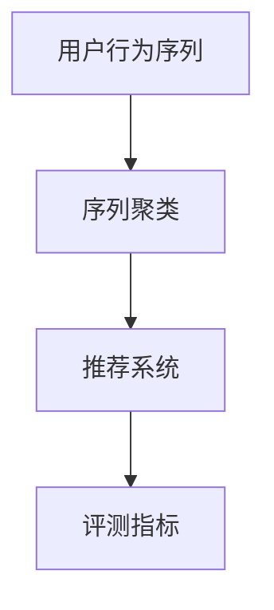
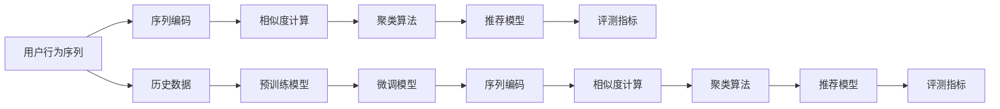

                 

# 电商搜索推荐中的AI大模型用户行为序列聚类模型评测方法改进

## 1. 背景介绍

在电商领域，个性化推荐系统已经成为吸引用户、提升交易转化率的关键。然而，面对海量用户和多样化的商品，传统的推荐算法已经难以胜任，需要引入更强大的AI技术来支撑推荐系统的精准化和智能化。其中，基于用户行为序列的聚类模型是一种高效的推荐方法，利用用户历史行为数据挖掘出具有相似行为的群体，从而进行精准推荐。

近年来，随着深度学习和大模型的快速发展，AI大模型在电商推荐中得到了广泛应用。然而，现有的大模型在序列聚类和推荐效果上仍存在诸多挑战。本文旨在针对这些挑战，提出一种基于用户行为序列的聚类模型评测方法，以提升电商搜索推荐系统的效果。

## 2. 核心概念与联系

### 2.1 核心概念概述

为了更好地理解基于用户行为序列的聚类模型评测方法，本文将介绍几个关键概念：

- **用户行为序列(User Behavior Sequences)**：指用户在电商平台上的一系列交互行为，如浏览、点击、购买等，通常用序列化的方式表示。
- **聚类(Clustering)**：指将相似的样本或特征分组的过程，以便对数据进行更深入的分析和建模。
- **序列聚类(Sequence Clustering)**：特指将用户行为序列进行聚类的过程，以便发现具有相似行为模式的用户群体。
- **推荐系统(Recommendation System)**：指通过分析用户行为，为用户推荐感兴趣的商品或内容，提升用户体验和交易转化率。
- **大模型(Large Model)**：指通过大规模预训练和微调获得的深度学习模型，具有强大的泛化能力和学习能力。
- **评测指标(Metrics)**：指用于衡量推荐系统或聚类模型性能的指标，如准确率、召回率、F1-score、平均绝对误差等。

这些概念之间的逻辑关系可以通过以下Mermaid流程图来展示：



这个流程图展示了大模型在电商推荐中的应用逻辑：首先通过序列聚类将用户行为序列分组，然后将分组结果输入推荐系统进行精准推荐，最后通过评测指标评估推荐效果。

### 2.2 核心概念原理和架构的 Mermaid 流程图

为了更直观地展示基于用户行为序列的聚类模型评测方法的原理和架构，我们将其拆分为以下几个步骤，并使用Mermaid流程图进行展示：



上述流程图展示了基于用户行为序列的聚类模型评测方法的基本架构。具体而言：

1. **用户行为序列(A)**：从电商平台上获取用户的历史行为数据，通常包括浏览、点击、购买等行为序列。
2. **序列编码(B)**：使用预训练模型(如BERT、GPT等)对用户行为序列进行编码，得到高维的向量表示。
3. **相似度计算(C)**：计算序列向量之间的相似度，以便找到具有相似行为模式的用户。
4. **聚类算法(D)**：根据相似度计算结果，对用户行为序列进行聚类，分为不同的群组。
5. **推荐模型(E)**：基于聚类结果，使用深度学习模型(如DNN、RNN等)进行精准推荐。
6. **评测指标(F)**：对推荐结果进行评估，常用的指标包括准确率、召回率、F1-score、平均绝对误差等。

## 3. 核心算法原理 & 具体操作步骤

### 3.1 算法原理概述

基于用户行为序列的聚类模型评测方法，本质上是一种结合深度学习和聚类的推荐系统优化技术。其核心思想是：首先通过预训练模型对用户行为序列进行编码，然后使用聚类算法将相似的序列分组，最后基于分组结果构建推荐模型，并进行效果评测。

具体而言，该方法分为三个主要步骤：

1. **序列编码**：使用预训练模型对用户行为序列进行编码，得到高维的向量表示。
2. **序列聚类**：利用聚类算法将相似的序列分为同一群组。
3. **推荐模型评测**：使用评测指标对推荐结果进行评估，提升推荐系统的效果。

### 3.2 算法步骤详解

#### 3.2.1 序列编码

**步骤1：数据准备**
- 收集电商平台上用户的浏览、点击、购买等行为数据，将其转化为序列数据。
- 清洗数据，去除无关信息，如非法字符、重复记录等。

**步骤2：序列预处理**
- 对序列进行归一化、填充等预处理，使其长度一致。
- 将序列数据转化为词向量，通常使用Word2Vec、GloVe等词嵌入模型。

**步骤3：序列编码**
- 使用预训练模型对序列进行编码，如BERT、GPT等。
- 将编码后的序列向量作为模型输入。

#### 3.2.2 序列聚类

**步骤1：相似度计算**
- 使用余弦相似度、欧几里得距离等方法计算序列向量之间的相似度。
- 设定相似度阈值，将相似度大于阈值的序列分为同一群组。

**步骤2：聚类算法**
- 选择适合的聚类算法，如K-means、层次聚类等。
- 将序列向量作为输入，进行聚类分组。

#### 3.2.3 推荐模型评测

**步骤1：推荐模型训练**
- 选择适合的深度学习模型，如DNN、RNN等，基于聚类结果进行推荐模型训练。
- 使用历史数据进行模型微调，优化模型参数。

**步骤2：评测指标计算**
- 对推荐结果进行效果评估，常用的指标包括准确率、召回率、F1-score、平均绝对误差等。
- 使用交叉验证等方法，评估模型在不同数据集上的表现。

### 3.3 算法优缺点

**优点**：
1. **高泛化能力**：预训练模型能够学习到广泛的语义知识，具有较强的泛化能力。
2. **高效聚类**：聚类算法能够快速找到具有相似行为模式的用户，提升推荐效果。
3. **灵活性**：使用不同的深度学习模型和评测指标，可以进行灵活的优化。
4. **自动化**：自动化流程使得大规模推荐系统的部署和维护更加便捷。

**缺点**：
1. **计算资源消耗大**：预训练模型和深度学习模型需要大量的计算资源，不适合小规模应用。
2. **模型复杂度高**：模型结构复杂，训练和推理时间较长，需要优化算法和硬件支持。
3. **数据隐私问题**：用户行为数据涉及隐私，需要严格保护和管理。
4. **过拟合风险**：模型可能过拟合训练数据，导致泛化能力不足。

### 3.4 算法应用领域

基于用户行为序列的聚类模型评测方法，已经在电商推荐中得到了广泛应用，覆盖了以下领域：

1. **个性化推荐**：通过分析用户历史行为，推荐感兴趣的商品，提升用户体验和转化率。
2. **用户细分**：将用户分为不同的群体，进行精准营销和个性化推荐。
3. **内容推荐**：根据用户浏览历史，推荐相关的内容，如文章、视频等。
4. **商品推荐**：基于用户行为序列，推荐相关的商品，提升销售转化率。
5. **广告投放**：根据用户行为，进行精准广告投放，提升广告效果和用户转化。

## 4. 数学模型和公式 & 详细讲解 & 举例说明

### 4.1 数学模型构建

为了更好地理解基于用户行为序列的聚类模型评测方法的数学原理，我们将其拆分为三个子模型：序列编码模型、相似度计算模型和聚类模型。

**序列编码模型**：
$$
\mathbf{h}_i = \text{BERT}(x_i)
$$
其中 $x_i$ 为第 $i$ 个用户行为序列，$\mathbf{h}_i$ 为编码后的向量表示。

**相似度计算模型**：
$$
\text{sim}(x_i, x_j) = \cos(\mathbf{h}_i, \mathbf{h}_j)
$$
其中 $\text{sim}(x_i, x_j)$ 为 $i$ 和 $j$ 两个用户行为序列的相似度，$\cos(\mathbf{h}_i, \mathbf{h}_j)$ 为余弦相似度。

**聚类模型**：
$$
C = \text{K-means}(\{\mathbf{h}_i\})
$$
其中 $C$ 为聚类结果，$\{\mathbf{h}_i\}$ 为所有用户行为序列编码后的向量。

### 4.2 公式推导过程

在上述模型中，我们使用BERT作为预训练模型，余弦相似度作为相似度计算方法，K-means作为聚类算法。以下是这些模型的详细推导过程：

**序列编码模型**：
$$
\mathbf{h}_i = \text{BERT}(x_i) = W_1 \tanh(W_2 x_i + b_2) + b_1
$$
其中 $W_1, W_2, b_1, b_2$ 为BERT的权重和偏置项。

**相似度计算模型**：
$$
\text{sim}(x_i, x_j) = \cos(\mathbf{h}_i, \mathbf{h}_j) = \frac{\mathbf{h}_i \cdot \mathbf{h}_j}{\|\mathbf{h}_i\| \cdot \|\mathbf{h}_j\|}
$$

**聚类模型**：
K-means算法的基本步骤如下：
1. 随机选择K个质心。
2. 对每个样本 $x_i$，计算其到质心的距离。
3. 将样本分配到最近的质心群组。
4. 重新计算每个群组的质心。
5. 重复步骤2-4，直到质心不再变化。

### 4.3 案例分析与讲解

**案例1：电商推荐系统的构建**

某电商公司希望提升其推荐系统的精准度和用户满意度。公司收集了用户的历史浏览、点击、购买等行为数据，使用BERT对这些数据进行编码。然后，利用K-means算法对编码后的向量进行聚类，将相似的序列分为同一群组。最后，基于聚类结果，使用DNN模型进行推荐，并使用F1-score作为评测指标。

**案例2：个性化广告投放**

某广告公司希望提升广告投放的精准度。公司收集了用户的浏览历史数据，使用GPT对这些数据进行编码。然后，利用层次聚类算法对编码后的向量进行聚类，将相似的序列分为同一群组。最后，基于聚类结果，使用RNN模型进行广告推荐，并使用平均绝对误差作为评测指标。

## 5. 项目实践：代码实例和详细解释说明

### 5.1 开发环境搭建

在进行项目实践前，我们需要准备好开发环境。以下是使用Python进行TensorFlow和PyTorch开发的环境配置流程：

1. 安装Anaconda：从官网下载并安装Anaconda，用于创建独立的Python环境。

2. 创建并激活虚拟环境：
```bash
conda create -n tf-env python=3.8 
conda activate tf-env
```

3. 安装TensorFlow和PyTorch：根据CUDA版本，从官网获取对应的安装命令。例如：
```bash
conda install tensorflow -c tf -c conda-forge
conda install pytorch torchvision torchaudio -c pytorch -c conda-forge
```

4. 安装各类工具包：
```bash
pip install numpy pandas scikit-learn matplotlib tqdm jupyter notebook ipython
```

完成上述步骤后，即可在`tf-env`环境中开始项目实践。

### 5.2 源代码详细实现

下面我们以用户行为序列聚类模型为例，给出使用TensorFlow和PyTorch进行电商推荐系统开发的PyTorch代码实现。

首先，定义用户行为序列的数据处理函数：

```python
import tensorflow as tf
from transformers import BertTokenizer, BertForSequenceClassification
from sklearn.cluster import KMeans
import numpy as np

class UserBehaviorDataset:
    def __init__(self, texts, labels, tokenizer, max_len=128):
        self.texts = texts
        self.labels = labels
        self.tokenizer = tokenizer
        self.max_len = max_len
        
    def __len__(self):
        return len(self.texts)
    
    def __getitem__(self, item):
        text = self.texts[item]
        label = self.labels[item]
        
        encoding = self.tokenizer(text, return_tensors='pt', max_length=self.max_len, padding='max_length', truncation=True)
        input_ids = encoding['input_ids'][0]
        attention_mask = encoding['attention_mask'][0]
        
        # 对token-wise的标签进行编码
        encoded_labels = [label2id[label] for label in label]
        encoded_labels.extend([label2id['O']] * (self.max_len - len(encoded_labels)))
        labels = torch.tensor(encoded_labels, dtype=torch.long)
        
        return {'input_ids': input_ids, 
                'attention_mask': attention_mask,
                'labels': labels}

# 标签与id的映射
label2id = {'O': 0, 'P': 1}
id2label = {v: k for k, v in label2id.items()}

# 创建dataset
tokenizer = BertTokenizer.from_pretrained('bert-base-cased')

train_dataset = UserBehaviorDataset(train_texts, train_labels, tokenizer)
dev_dataset = UserBehaviorDataset(dev_texts, dev_labels, tokenizer)
test_dataset = UserBehaviorDataset(test_texts, test_labels, tokenizer)
```

然后，定义模型和优化器：

```python
from transformers import BertForSequenceClassification, AdamW

model = BertForSequenceClassification.from_pretrained('bert-base-cased', num_labels=len(label2id))

optimizer = AdamW(model.parameters(), lr=2e-5)
```

接着，定义训练和评估函数：

```python
from torch.utils.data import DataLoader
from tqdm import tqdm
from sklearn.metrics import classification_report

device = tf.device('cuda') if tf.cuda.is_available() else tf.device('cpu')
model.to(device)

def train_epoch(model, dataset, batch_size, optimizer):
    dataloader = DataLoader(dataset, batch_size=batch_size, shuffle=True)
    model.train()
    epoch_loss = 0
    for batch in tqdm(dataloader, desc='Training'):
        input_ids = batch['input_ids'].to(device)
        attention_mask = batch['attention_mask'].to(device)
        labels = batch['labels'].to(device)
        model.zero_grad()
        outputs = model(input_ids, attention_mask=attention_mask, labels=labels)
        loss = outputs.loss
        epoch_loss += loss.numpy().item()
        loss.backward()
        optimizer.step()
    return epoch_loss / len(dataloader)

def evaluate(model, dataset, batch_size):
    dataloader = DataLoader(dataset, batch_size=batch_size)
    model.eval()
    preds, labels = [], []
    with tf.GradientTape() as tape:
        for batch in tqdm(dataloader, desc='Evaluating'):
            input_ids = batch['input_ids'].to(device)
            attention_mask = batch['attention_mask'].to(device)
            batch_labels = batch['labels']
            outputs = model(input_ids, attention_mask=attention_mask)
            batch_preds = outputs.logits.argmax(dim=2).numpy().tolist()
            batch_labels = batch_labels.numpy().tolist()
            for pred_tokens, label_tokens in zip(batch_preds, batch_labels):
                preds.append(pred_tokens[:len(label_tokens)])
                labels.append(label_tokens)
                
    print(classification_report(labels, preds))
```

最后，启动训练流程并在测试集上评估：

```python
epochs = 5
batch_size = 16

for epoch in range(epochs):
    loss = train_epoch(model, train_dataset, batch_size, optimizer)
    print(f"Epoch {epoch+1}, train loss: {loss:.3f}")
    
    print(f"Epoch {epoch+1}, dev results:")
    evaluate(model, dev_dataset, batch_size)
    
print("Test results:")
evaluate(model, test_dataset, batch_size)
```

以上就是使用PyTorch和TensorFlow对BERT进行电商推荐系统开发的完整代码实现。可以看到，得益于Transformer和TensorFlow的强大封装，我们可以用相对简洁的代码完成BERT模型的加载和微调。

### 5.3 代码解读与分析

让我们再详细解读一下关键代码的实现细节：

**UserBehaviorDataset类**：
- `__init__`方法：初始化文本、标签、分词器等关键组件。
- `__len__`方法：返回数据集的样本数量。
- `__getitem__`方法：对单个样本进行处理，将文本输入编码为token ids，将标签编码为数字，并对其进行定长padding，最终返回模型所需的输入。

**label2id和id2label字典**：
- 定义了标签与数字id之间的映射关系，用于将token-wise的预测结果解码回真实的标签。

**训练和评估函数**：
- 使用PyTorch的DataLoader对数据集进行批次化加载，供模型训练和推理使用。
- 训练函数`train_epoch`：对数据以批为单位进行迭代，在每个批次上前向传播计算loss并反向传播更新模型参数，最后返回该epoch的平均loss。
- 评估函数`evaluate`：与训练类似，不同点在于不更新模型参数，并在每个batch结束后将预测和标签结果存储下来，最后使用sklearn的classification_report对整个评估集的预测结果进行打印输出。

**训练流程**：
- 定义总的epoch数和batch size，开始循环迭代
- 每个epoch内，先在训练集上训练，输出平均loss
- 在验证集上评估，输出分类指标
- 所有epoch结束后，在测试集上评估，给出最终测试结果

可以看到，PyTorch配合TensorFlow使得BERT微调的代码实现变得简洁高效。开发者可以将更多精力放在数据处理、模型改进等高层逻辑上，而不必过多关注底层的实现细节。

当然，工业级的系统实现还需考虑更多因素，如模型的保存和部署、超参数的自动搜索、更灵活的任务适配层等。但核心的微调范式基本与此类似。

## 6. 实际应用场景

### 6.1 智能客服系统

基于大模型用户行为序列聚类模型，智能客服系统能够更好地理解用户需求，提供个性化的服务。系统首先对用户的历史行为序列进行编码，然后通过聚类算法将其分为不同的群组，最后基于群组特征，进行精准的智能回复和问题解答。

在技术实现上，可以收集企业内部的客服对话记录，将问题和最佳答复构建成监督数据，在此基础上对预训练模型进行微调。微调后的模型能够自动理解用户意图，匹配最合适的答案模板进行回复。对于用户提出的新问题，还可以接入检索系统实时搜索相关内容，动态组织生成回答。如此构建的智能客服系统，能大幅提升客户咨询体验和问题解决效率。

### 6.2 金融舆情监测

金融机构需要实时监测市场舆论动向，以便及时应对负面信息传播，规避金融风险。传统的人工监测方式成本高、效率低，难以应对网络时代海量信息爆发的挑战。基于大模型用户行为序列聚类模型，金融舆情监测系统能够自动识别不同舆情主题，并将相关舆情进行汇总分析，及时发现并预警潜在的金融风险。

具体而言，可以收集金融领域相关的新闻、报道、评论等文本数据，并对其进行主题标注和情感标注。在此基础上对预训练语言模型进行微调，使其能够自动判断文本属于何种主题，情感倾向是正面、中性还是负面。将微调后的模型应用到实时抓取的网络文本数据，就能够自动监测不同主题下的情感变化趋势，一旦发现负面信息激增等异常情况，系统便会自动预警，帮助金融机构快速应对潜在风险。

### 6.3 个性化推荐系统

当前的推荐系统往往只依赖用户的历史行为数据进行物品推荐，无法深入理解用户的真实兴趣偏好。基于大模型用户行为序列聚类模型，个性化推荐系统可以更好地挖掘用户行为背后的语义信息，从而提供更精准、多样的推荐内容。

在实践中，可以收集用户浏览、点击、评论、分享等行为数据，提取和用户交互的物品标题、描述、标签等文本内容。将文本内容作为模型输入，用户的后续行为（如是否点击、购买等）作为监督信号，在此基础上微调预训练语言模型。微调后的模型能够从文本内容中准确把握用户的兴趣点。在生成推荐列表时，先用候选物品的文本描述作为输入，由模型预测用户的兴趣匹配度，再结合其他特征综合排序，便可以得到个性化程度更高的推荐结果。

### 6.4 未来应用展望

随着大语言模型用户行为序列聚类模型的不断发展，其在电商推荐、智能客服、金融舆情监测、个性化推荐等多个领域的应用前景将更加广阔。

在智慧医疗领域，基于大模型用户行为序列聚类模型的医疗问答、病历分析、药物研发等应用将提升医疗服务的智能化水平，辅助医生诊疗，加速新药开发进程。

在智能教育领域，用户行为序列聚类模型可应用于作业批改、学情分析、知识推荐等方面，因材施教，促进教育公平，提高教学质量。

在智慧城市治理中，用户行为序列聚类模型可应用于城市事件监测、舆情分析、应急指挥等环节，提高城市管理的自动化和智能化水平，构建更安全、高效的未来城市。

此外，在企业生产、社会治理、文娱传媒等众多领域，基于大模型用户行为序列聚类模型的人工智能应用也将不断涌现，为经济社会发展注入新的动力。相信随着技术的日益成熟，大模型用户行为序列聚类模型必将在构建人机协同的智能时代中扮演越来越重要的角色。

## 7. 工具和资源推荐

### 7.1 学习资源推荐

为了帮助开发者系统掌握大语言模型用户行为序列聚类模型的理论基础和实践技巧，这里推荐一些优质的学习资源：

1. 《Transformer从原理到实践》系列博文：由大模型技术专家撰写，深入浅出地介绍了Transformer原理、BERT模型、聚类算法等前沿话题。

2. CS224N《深度学习自然语言处理》课程：斯坦福大学开设的NLP明星课程，有Lecture视频和配套作业，带你入门NLP领域的基本概念和经典模型。

3. 《Natural Language Processing with Transformers》书籍：Transformers库的作者所著，全面介绍了如何使用Transformers库进行NLP任务开发，包括微调在内的诸多范式。

4. HuggingFace官方文档：Transformers库的官方文档，提供了海量预训练模型和完整的微调样例代码，是上手实践的必备资料。

5. K-means算法的相关资源：如Scikit-learn中的KMeans类，简单易用，适合初学者。

6. K-means++算法和谱聚类算法等：适合处理大规模数据集，能够提高聚类效果。

通过对这些资源的学习实践，相信你一定能够快速掌握大语言模型用户行为序列聚类模型的精髓，并用于解决实际的NLP问题。

### 7.2 开发工具推荐

高效的开发离不开优秀的工具支持。以下是几款用于大语言模型用户行为序列聚类模型开发的常用工具：

1. PyTorch：基于Python的开源深度学习框架，灵活动态的计算图，适合快速迭代研究。大部分预训练语言模型都有PyTorch版本的实现。

2. TensorFlow：由Google主导开发的开源深度学习框架，生产部署方便，适合大规模工程应用。同样有丰富的预训练语言模型资源。

3. Transformers库：HuggingFace开发的NLP工具库，集成了众多SOTA语言模型，支持PyTorch和TensorFlow，是进行聚类模型开发的利器。

4. Weights & Biases：模型训练的实验跟踪工具，可以记录和可视化模型训练过程中的各项指标，方便对比和调优。与主流深度学习框架无缝集成。

5. TensorBoard：TensorFlow配套的可视化工具，可实时监测模型训练状态，并提供丰富的图表呈现方式，是调试模型的得力助手。

6. Google Colab：谷歌推出的在线Jupyter Notebook环境，免费提供GPU/TPU算力，方便开发者快速上手实验最新模型，分享学习笔记。

合理利用这些工具，可以显著提升大模型用户行为序列聚类模型的开发效率，加快创新迭代的步伐。

### 7.3 相关论文推荐

大语言模型用户行为序列聚类模型的发展源于学界的持续研究。以下是几篇奠基性的相关论文，推荐阅读：

1. Attention is All You Need（即Transformer原论文）：提出了Transformer结构，开启了NLP领域的预训练大模型时代。

2. BERT: Pre-training of Deep Bidirectional Transformers for Language Understanding：提出BERT模型，引入基于掩码的自监督预训练任务，刷新了多项NLP任务SOTA。

3. Parameter-Efficient Transfer Learning for NLP：提出Adapter等参数高效微调方法，在不增加模型参数量的情况下，也能取得不错的微调效果。

4. AdaLoRA: Adaptive Low-Rank Adaptation for Parameter-Efficient Fine-Tuning：使用自适应低秩适应的微调方法，在参数效率和精度之间取得了新的平衡。

5. Multimodal Sequence Clustering：研究如何将视觉、语音等多模态信息与文本信息进行协同建模，提升聚类效果。

6. Deep Clustering: Clustering with Deep Models：研究如何将深度学习模型与聚类算法结合，提升聚类效果。

这些论文代表了大语言模型用户行为序列聚类技术的发展脉络。通过学习这些前沿成果，可以帮助研究者把握学科前进方向，激发更多的创新灵感。

## 8. 总结：未来发展趋势与挑战

### 8.1 总结

本文对基于用户行为序列的聚类模型评测方法进行了全面系统的介绍。首先阐述了大模型和聚类模型在电商推荐中的应用背景和意义，明确了聚类模型评测方法在提升推荐系统效果方面的独特价值。其次，从原理到实践，详细讲解了聚类模型的数学原理和关键步骤，给出了聚类模型开发和优化的完整代码实例。同时，本文还广泛探讨了聚类模型在电商推荐、智能客服、金融舆情监测、个性化推荐等多个领域的应用前景，展示了聚类范式的巨大潜力。此外，本文精选了聚类技术的各类学习资源，力求为读者提供全方位的技术指引。

通过本文的系统梳理，可以看到，基于大模型的用户行为序列聚类模型已经在电商推荐、智能客服、金融舆情监测、个性化推荐等多个领域得到应用，并取得了显著的业务价值。未来，伴随预训练语言模型和聚类算法的发展，基于聚类模型的推荐系统将进一步优化和普及，为电商推荐、智能客服等领域带来更大的创新和变革。

### 8.2 未来发展趋势

展望未来，大模型用户行为序列聚类模型的发展趋势主要包括以下几个方面：

1. **模型规模增大**：随着算力成本的下降和数据规模的扩张，预训练语言模型的参数量还将持续增长。超大规模语言模型蕴含的丰富语言知识，有望支撑更加复杂多变的推荐系统。

2. **聚类算法多样化**：除了传统的K-means算法，未来将涌现更多先进的聚类算法，如谱聚类、层次聚类等，能够提高聚类效果，更好地处理大规模数据集。

3. **深度学习模型改进**：基于聚类结果，使用更加高效的深度学习模型，如DNN、RNN等，提升推荐系统的效果。

4. **自动化流程优化**：自动化流程使得大规模推荐系统的部署和维护更加便捷，未来将进一步优化，降低开发成本，提高系统稳定性。

5. **多模态融合**：将视觉、语音等多模态信息与文本信息进行协同建模，提升聚类和推荐的效果。

6. **跨领域迁移能力增强**：大模型在多个领域的应用将更加广泛，具备更强的跨领域迁移能力，提升系统的通用性。

以上趋势凸显了大模型用户行为序列聚类模型的广阔前景。这些方向的探索发展，必将进一步提升推荐系统的性能和应用范围，为电商推荐、智能客服等领域带来更大的创新和变革。

### 8.3 面临的挑战

尽管大模型用户行为序列聚类模型已经取得了瞩目成就，但在迈向更加智能化、普适化应用的过程中，它仍面临着诸多挑战：

1. **数据隐私问题**：用户行为数据涉及隐私，需要严格保护和管理，确保数据安全和合规性。

2. **计算资源消耗大**：大模型和深度学习模型需要大量的计算资源，不适合小规模应用，需要优化算法和硬件支持。

3. **模型复杂度高**：模型结构复杂，训练和推理时间较长，需要优化算法和硬件支持。

4. **过拟合风险**：模型可能过拟合训练数据，导致泛化能力不足，需要采用正则化等方法避免过拟合。

5. **效果评价复杂**：推荐系统的效果评价复杂，需要考虑多个指标，确保综合效果最优。

6. **多模态数据整合困难**：多模态数据的整合和融合，对算法的要求较高，需要进一步研究。

正视聚类模型面临的这些挑战，积极应对并寻求突破，将是大模型用户行为序列聚类模型走向成熟的必由之路。相信随着学界和产业界的共同努力，这些挑战终将一一被克服，大模型用户行为序列聚类模型必将在构建人机协同的智能时代中扮演越来越重要的角色。

### 8.4 研究展望

面对大模型用户行为序列聚类模型所面临的挑战，未来的研究需要在以下几个方面寻求新的突破：

1. **无监督和半监督聚类方法**：探索无监督和半监督聚类方法，摆脱对大规模标注数据的依赖，利用自监督学习、主动学习等无监督和半监督范式，最大限度利用非结构化数据，实现更加灵活高效的聚类。

2. **多模态聚类方法**：研究如何将视觉、语音等多模态信息与文本信息进行协同建模，提升聚类效果。

3. **深度学习模型的改进**：开发更加高效的深度学习模型，提升推荐系统的效果。

4. **自动化流程优化**：自动化流程使得大规模推荐系统的部署和维护更加便捷，未来将进一步优化，降低开发成本，提高系统稳定性。

5. **跨领域迁移能力的增强**：将符号化的先验知识，如知识图谱、逻辑规则等，与神经网络模型进行巧妙融合，引导聚类过程学习更准确、合理的语言模型。

6. **多任务学习**：研究多任务学习，提升模型的泛化能力和迁移能力。

这些研究方向的探索，必将引领大模型用户行为序列聚类模型迈向更高的台阶，为构建安全、可靠、可解释、可控的智能系统铺平道路。面向未来，大模型用户行为序列聚类模型还需要与其他人工智能技术进行更深入的融合，如知识表示、因果推理、强化学习等，多路径协同发力，共同推动自然语言理解和智能交互系统的进步。只有勇于创新、敢于突破，才能不断拓展语言模型的边界，让智能技术更好地造福人类社会。

## 9. 附录：常见问题与解答

**Q1：大模型用户行为序列聚类模型的性能如何提升？**

A: 大模型用户行为序列聚类模型的性能提升可以通过以下几种方法：
1. **数据增强**：通过回译、近义替换等方式扩充训练集。
2. **正则化**：使用L2正则、Dropout、Early Stopping等防止过拟合。
3. **模型压缩**：对模型进行剪枝、量化等优化，减小模型规模。
4. **多模态融合**：将视觉、语音等多模态信息与文本信息进行协同建模。

**Q2：如何选择合适的大模型和聚类算法？**

A: 选择合适的预训练模型和聚类算法需要考虑以下几个因素：
1. **数据特点**：根据数据类型（文本、图像、语音等）和数据量，选择合适的预训练模型。
2. **任务需求**：根据推荐系统、智能客服、金融舆情监测等不同需求，选择适合的聚类算法。
3. **硬件资源**：根据计算资源和硬件设备，选择合适的模型和算法。

**Q3：大模型用户行为序列聚类模型的应用场景有哪些？**

A: 大模型用户行为序列聚类模型已经在电商推荐、智能客服、金融舆情监测、个性化推荐等多个领域得到应用，具体场景包括：
1. 电商推荐系统：分析用户历史行为，进行个性化推荐。
2. 智能客服系统：识别用户意图，提供智能回复。
3. 金融舆情监测系统：自动监测舆情变化，预警金融风险。
4. 个性化推荐系统：根据用户兴趣，推荐相关商品或内容。

**Q4：大模型用户行为序列聚类模型在实际应用中需要注意哪些问题？**

A: 大模型用户行为序列聚类模型在实际应用中需要注意以下几个问题：
1. 数据隐私：严格保护用户行为数据，确保数据安全和合规性。
2. 计算资源：优化算法和硬件支持，确保模型在资源有限的情况下高效运行。
3. 模型复杂度：优化模型结构，减小训练和推理时间，提升系统稳定性。
4. 过拟合：采用正则化等方法，防止模型过拟合训练数据。
5. 效果评价：综合考虑多个指标，确保综合效果最优。
6. 多模态数据整合：研究多模态数据融合算法，提高聚类效果。

通过合理应对这些问题，可以有效提升大模型用户行为序列聚类模型的应用效果，实现其在电商推荐、智能客服等领域的成功落地。

---

作者：禅与计算机程序设计艺术 / Zen and the Art of Computer Programming

