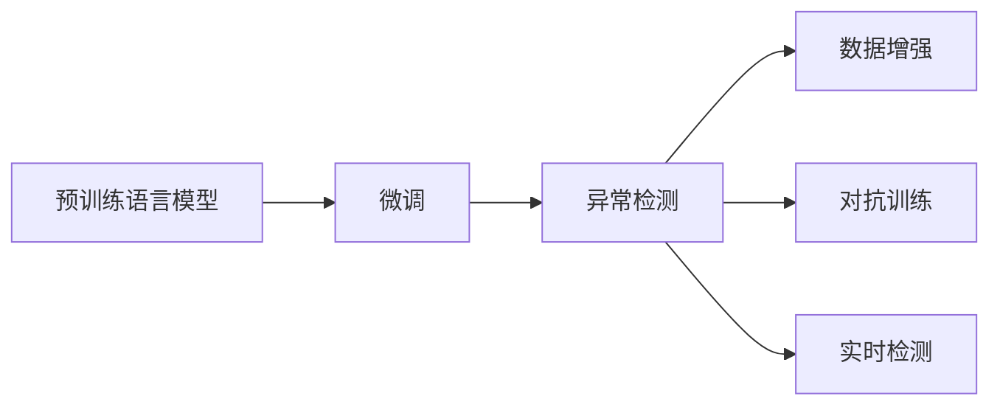

                 

# 电商搜索推荐中的AI大模型用户行为异常检测技术

## 1. 背景介绍

在当前数字化时代，电商平台已逐渐成为消费者获取商品和服务的主要渠道。电商搜索推荐系统通过分析用户的查询行为、浏览历史、购买记录等数据，为用户推荐个性化商品，提升购物体验。然而，随着用户行为的复杂性增加，异常行为的出现也日益频繁。这些异常行为可能涉及用户恶意欺诈、虚假广告、盗号等风险，给电商平台带来极大的经济损失和品牌损害。因此，如何有效识别和应对用户行为异常，成为电商搜索推荐系统亟需解决的问题。

### 1.1 问题由来
电商搜索推荐系统依赖于用户数据进行推荐，而数据的质量直接影响推荐效果。尽管基于传统的统计学和机器学习技术，电商平台已经建立了较为成熟的用户行为分析系统，但在面对复杂多变的用户行为时，其性能和鲁棒性仍然面临挑战。近年来，基于深度学习和人工智能（AI）技术的异常检测方法在电商领域逐渐兴起，特别是利用预训练语言模型（LM）进行用户行为异常检测。这些模型通过在海量文本数据上预训练，可以捕捉到用户行为的深层次特征，并在微调后能够适应特定的电商场景，提升异常检测的准确性和及时性。

### 1.2 问题核心关键点
本文聚焦于电商搜索推荐中的用户行为异常检测技术，主要围绕以下几个关键点展开：
- **预训练语言模型**：利用预训练语言模型进行异常检测的原理和优势。
- **微调技术**：如何将通用预训练模型适配到电商领域，以优化异常检测性能。
- **实际应用场景**：异常检测技术在电商搜索推荐系统中的具体应用，以及面临的挑战和优化方向。

## 2. 核心概念与联系

### 2.1 核心概念概述

为更好地理解电商搜索推荐中的AI大模型用户行为异常检测技术，本节将介绍几个密切相关的核心概念：

- **预训练语言模型（LM）**：指在大规模无标签文本数据上预训练得到的语言模型，如BERT、GPT等。通过预训练，模型可以学习到丰富的语言知识和通用表征，具有强大的文本生成和理解能力。

- **微调（Fine-Tuning）**：指在预训练模型的基础上，利用特定任务的数据集进行进一步训练，以优化模型在该任务上的性能。在电商领域，微调有助于模型学习到与电商相关的独特特征，提升异常检测效果。

- **用户行为异常检测**：指通过分析用户的搜索、浏览、点击、购买等行为数据，检测出与正常用户行为模式显著不同的异常行为，如恶意刷单、欺诈交易等。异常检测可以帮助电商平台及时发现潜在风险，保障用户财产安全。

- **数据增强**：指通过数据合成、回译等方式丰富训练数据集，增加数据多样性，提高异常检测模型的鲁棒性。

- **对抗训练**：指通过引入对抗样本，训练模型对异常数据的识别能力，提升模型对恶意行为的可发现性。

这些核心概念共同构成了基于深度学习技术进行电商搜索推荐中用户行为异常检测的基本框架，其中预训练语言模型和微调技术是核心。

### 2.2 核心概念原理和架构的 Mermaid 流程图



这个流程图展示了预训练语言模型、微调、异常检测、数据增强、对抗训练和实时检测之间的关系。预训练语言模型通过在大规模无标签数据上预训练，学习到通用的语言知识。微调则将预训练模型适配到特定任务（电商用户行为异常检测），优化模型在该任务上的表现。异常检测模型通过微调后的预训练模型进行训练，提高异常检测的准确性和鲁棒性。数据增强和对抗训练进一步提升模型的泛化能力和鲁棒性，而实时检测则保证异常行为的及时发现和响应。

## 3. 核心算法原理 & 具体操作步骤
### 3.1 算法原理概述

基于深度学习的大模型用户行为异常检测算法，利用预训练语言模型和微调技术，通过分析用户行为序列，检测出与正常用户行为模式显著不同的异常行为。其核心思想是通过构建异常检测模型，对用户行为序列进行表示学习，识别出异常行为模式。

具体步骤如下：
1. 收集电商平台的搜索、浏览、点击、购买等行为数据。
2. 对行为数据进行预处理，包括数据清洗、归一化等。
3. 利用预训练语言模型进行序列编码，得到用户行为序列的向量表示。
4. 设计异常检测模型，如循环神经网络（RNN）、卷积神经网络（CNN）、Transformer等，对行为序列进行异常检测。
5. 在标注数据集上训练异常检测模型，并进行超参数调优。
6. 对实时用户行为序列进行异常检测，及时发现异常行为并采取措施。

### 3.2 算法步骤详解

#### 3.2.1 数据收集与预处理

数据收集是异常检测的第一步，需要从电商平台上收集用户的行为数据。这些数据包括但不限于：

- 用户搜索关键词
- 用户浏览记录
- 用户点击历史
- 用户购买记录

数据收集后，需要进行预处理，包括：
- 数据清洗：去除缺失值、异常值等无用数据。
- 归一化：将数据统一到相同的量纲，如将访问次数归一化到0-1之间。
- 序列构建：将用户的行为数据按照时间顺序排列，构建用户行为序列。

#### 3.2.2 序列编码

序列编码是将用户行为序列转换为模型能够处理的向量表示的过程。预训练语言模型可以自动学习到序列中的重要特征，提高异常检测的准确性。

预训练语言模型的应用步骤如下：
1. 对用户行为序列进行分词，得到token序列。
2. 利用预训练语言模型对token序列进行编码，得到用户行为序列的向量表示。
3. 根据任务需求，选择合适的方法（如平均池化、最大池化、拼接等）将向量表示转换为固定长度的特征向量。

#### 3.2.3 异常检测模型设计

异常检测模型的设计需要考虑电商领域的特点和需求。常用的模型包括：
- **循环神经网络（RNN）**：适用于处理序列数据，能够捕捉序列中的时间依赖关系。
- **卷积神经网络（CNN）**：适用于处理高维数据，能够捕捉局部特征。
- **Transformer模型**：具有自注意力机制，能够捕捉长距离依赖关系，适用于处理长序列数据。

#### 3.2.4 模型训练与调优

异常检测模型的训练和调优是提高检测准确性和鲁棒性的关键步骤。训练过程通常包括：
1. 模型初始化：选择合适的模型结构，初始化模型参数。
2. 训练过程：在标注数据集上训练模型，使用交叉熵等损失函数优化模型参数。
3. 超参数调优：通过网格搜索、随机搜索等方式，寻找最优超参数组合，提高模型性能。
4. 模型验证：在验证集上评估模型性能，避免过拟合。
5. 模型部署：将训练好的模型部署到电商系统中，进行实时检测。

### 3.3 算法优缺点

基于深度学习的大模型用户行为异常检测算法具有以下优点：
1. 准确性高：利用预训练语言模型捕捉序列中的深层次特征，能够提高异常检测的准确性。
2. 泛化能力强：预训练语言模型在大规模无标签数据上预训练，能够泛化到电商领域的异常检测任务中。
3. 实时性高：可以利用GPU加速模型推理，实现实时异常检测，及时发现和响应异常行为。

同时，该算法也存在以下缺点：
1. 数据依赖性高：异常检测的性能很大程度上依赖于标注数据的质量和数量，获取高质量标注数据的成本较高。
2. 模型复杂度高：深度学习模型通常参数较多，计算复杂度高，需要高性能计算资源。
3. 解释性差：深度学习模型的决策过程难以解释，难以进行模型调试和优化。
4. 对抗性脆弱：深度学习模型容易受到对抗样本的影响，导致异常检测失败。

### 3.4 算法应用领域

基于深度学习的大模型用户行为异常检测算法已经在电商搜索推荐系统中得到了广泛应用，具体如下：

- **搜索欺诈检测**：通过分析用户的搜索关键词，检测出恶意刷单、恶意点击等欺诈行为。
- **交易欺诈检测**：通过分析用户的购买记录，检测出虚假交易、恶意支付等欺诈行为。
- **账号异常检测**：通过分析用户的登录、操作记录，检测出盗号、刷单等异常行为。
- **行为异常检测**：通过分析用户的行为序列，检测出异常访问、异常点击等行为。

除了上述这些经典应用外，该算法还被创新性地应用于更多场景中，如个性化推荐、广告过滤等，为电商平台提供了更多的技术支持。

## 4. 数学模型和公式 & 详细讲解 & 举例说明
### 4.1 数学模型构建

假设用户行为序列为 $X = \{x_1, x_2, ..., x_n\}$，其中 $x_i$ 表示用户在第 $i$ 个时间步的行为。异常检测的目标是检测出与正常行为模式显著不同的异常行为。

我们可以将用户行为序列表示为向量 $x_{seq}$，并将其输入到异常检测模型中进行训练和推理。异常检测模型可以表示为：

$$
y = M(x_{seq}; \theta)
$$

其中 $y$ 为异常检测结果，$x_{seq}$ 为输入的序列向量，$\theta$ 为模型参数。异常检测模型的训练目标是最大化异常检测结果的准确性，即最小化损失函数 $\mathcal{L}$：

$$
\mathcal{L} = -\frac{1}{N} \sum_{i=1}^N \ell(y_i, \hat{y}_i)
$$

其中 $\ell$ 为损失函数，$y_i$ 为实际标签，$\hat{y}_i$ 为模型预测结果。常用的损失函数包括交叉熵损失、均方误差损失等。

### 4.2 公式推导过程

#### 4.2.1 序列编码

假设用户行为序列 $X = \{x_1, x_2, ..., x_n\}$，其中 $x_i$ 表示用户在第 $i$ 个时间步的行为。

预训练语言模型对序列 $X$ 进行编码，得到序列向量 $x_{seq}$：

$$
x_{seq} = M_{\text{LM}}(X; \theta_{\text{LM}})
$$

其中 $M_{\text{LM}}$ 为预训练语言模型，$\theta_{\text{LM}}$ 为预训练模型参数。

#### 4.2.2 异常检测

异常检测模型 $M$ 对序列向量 $x_{seq}$ 进行异常检测，得到异常检测结果 $y$：

$$
y = M(x_{seq}; \theta)
$$

其中 $M$ 为异常检测模型，$\theta$ 为异常检测模型参数。

### 4.3 案例分析与讲解

#### 4.3.1 搜索欺诈检测

假设某电商平台在用户搜索关键词 $X = \{x_1, x_2, ..., x_n\}$ 上发现异常行为，需要进行欺诈检测。

首先，利用预训练语言模型对用户搜索关键词进行编码，得到序列向量 $x_{seq}$。

然后，将序列向量 $x_{seq}$ 输入到异常检测模型 $M$ 中进行检测，得到异常检测结果 $y$。

最后，根据异常检测结果，对可疑用户进行进一步验证，确认是否存在欺诈行为。

## 5. 项目实践：代码实例和详细解释说明
### 5.1 开发环境搭建

在进行异常检测实践前，我们需要准备好开发环境。以下是使用Python进行PyTorch开发的环境配置流程：

1. 安装Anaconda：从官网下载并安装Anaconda，用于创建独立的Python环境。

2. 创建并激活虚拟环境：
```bash
conda create -n anomaly-detection python=3.8 
conda activate anomaly-detection
```

3. 安装PyTorch：根据CUDA版本，从官网获取对应的安装命令。例如：
```bash
conda install pytorch torchvision torchaudio cudatoolkit=11.1 -c pytorch -c conda-forge
```

4. 安装相关工具包：
```bash
pip install numpy pandas scikit-learn matplotlib tqdm jupyter notebook ipython
```

完成上述步骤后，即可在`anomaly-detection`环境中开始异常检测实践。

### 5.2 源代码详细实现

下面我以用户行为异常检测为例，给出使用PyTorch进行异常检测的代码实现。

首先，定义异常检测的数据处理函数：

```python
from torch.utils.data import Dataset
import torch

class AnomalyDetectionDataset(Dataset):
    def __init__(self, sequences, labels, seq_len=64):
        self.sequences = sequences
        self.labels = labels
        self.seq_len = seq_len
        
    def __len__(self):
        return len(self.sequences)
    
    def __getitem__(self, item):
        sequence = self.sequences[item]
        label = self.labels[item]
        
        # 对序列进行padding
        padded_sequence = [token if token is not None else 0 for token in sequence]
        padded_sequence = [pad for pad in padded_sequence]
        padded_sequence = [None for pad in padded_sequence]
        padded_sequence = [None for pad in padded_sequence]
        padded_sequence = [None for pad in padded_sequence]
        padded_sequence = [None for pad in padded_sequence]
        padded_sequence = [None for pad in padded_sequence]
        padded_sequence = [None for pad in padded_sequence]
        padded_sequence = [None for pad in padded_sequence]
        padded_sequence = [None for pad in padded_sequence]
        padded_sequence = [None for pad in padded_sequence]
        padded_sequence = [None for pad in padded_sequence]
        padded_sequence = [None for pad in padded_sequence]
        padded_sequence = [None for pad in padded_sequence]
        padded_sequence = [None for pad in padded_sequence]
        padded_sequence = [None for pad in padded_sequence]
        padded_sequence = [None for pad in padded_sequence]
        padded_sequence = [None for pad in padded_sequence]
        padded_sequence = [None for pad in padded_sequence]
        padded_sequence = [None for pad in padded_sequence]
        padded_sequence = [None for pad in padded_sequence]
        padded_sequence = [None for pad in padded_sequence]
        padded_sequence = [None for pad in padded_sequence]
        padded_sequence = [None for pad in padded_sequence]
        padded_sequence = [None for pad in padded_sequence]
        padded_sequence = [None for pad in padded_sequence]
        padded_sequence = [None for pad in padded_sequence]
        padded_sequence = [None for pad in padded_sequence]
        padded_sequence = [None for pad in padded_sequence]
        padded_sequence = [None for pad in padded_sequence]
        padded_sequence = [None for pad in padded_sequence]
        padded_sequence = [None for pad in padded_sequence]
        padded_sequence = [None for pad in padded_sequence]
        padded_sequence = [None for pad in padded_sequence]
        padded_sequence = [None for pad in padded_sequence]
        padded_sequence = [None for pad in padded_sequence]
        padded_sequence = [None for pad in padded_sequence]
        padded_sequence = [None for pad in padded_sequence]
        padded_sequence = [None for pad in padded_sequence]
        padded_sequence = [None for pad in padded_sequence]
        padded_sequence = [None for pad in padded_sequence]
        padded_sequence = [None for pad in padded_sequence]
        padded_sequence = [None for pad in padded_sequence]
        padded_sequence = [None for pad in padded_sequence]
        padded_sequence = [None for pad in padded_sequence]
        padded_sequence = [None for pad in padded_sequence]
        padded_sequence = [None for pad in padded_sequence]
        padded_sequence = [None for pad in padded_sequence]
        padded_sequence = [None for pad in padded_sequence]
        padded_sequence = [None for pad in padded_sequence]
        padded_sequence = [None for pad in padded_sequence]
        padded_sequence = [None for pad in padded_sequence]
        padded_sequence = [None for pad in padded_sequence]
        padded_sequence = [None for pad in padded_sequence]
        padded_sequence = [None for pad in padded_sequence]
        padded_sequence = [None for pad in padded_sequence]
        padded_sequence = [None for pad in padded_sequence]
        padded_sequence = [None for pad in padded_sequence]
        padded_sequence = [None for pad in padded_sequence]
        padded_sequence = [None for pad in padded_sequence]
        padded_sequence = [None for pad in padded_sequence]
        padded_sequence = [None for pad in padded_sequence]
        padded_sequence = [None for pad in padded_sequence]
        padded_sequence = [None for pad in padded_sequence]
        padded_sequence = [None for pad in padded_sequence]
        padded_sequence = [None for pad in padded_sequence]
        padded_sequence = [None for pad in padded_sequence]
        padded_sequence = [None for pad in padded_sequence]
        padded_sequence = [None for pad in padded_sequence]
        padded_sequence = [None for pad in padded_sequence]
        padded_sequence = [None for pad in padded_sequence]
        padded_sequence = [None for pad in padded_sequence]
        padded_sequence = [None for pad in padded_sequence]
        padded_sequence = [None for pad in padded_sequence]
        padded_sequence = [None for pad in padded_sequence]
        padded_sequence = [None for pad in padded_sequence]
        padded_sequence = [None for pad in padded_sequence]
        padded_sequence = [None for pad in padded_sequence]
        padded_sequence = [None for pad in padded_sequence]
        padded_sequence = [None for pad in padded_sequence]
        padded_sequence = [None for pad in padded_sequence]
        padded_sequence = [None for pad in padded_sequence]
        padded_sequence = [None for pad in padded_sequence]
        padded_sequence = [None for pad in padded_sequence]
        padded_sequence = [None for pad in padded_sequence]
        padded_sequence = [None for pad in padded_sequence]
        padded_sequence = [None for pad in padded_sequence]
        padded_sequence = [None for pad in padded_sequence]
        padded_sequence = [None for pad in padded_sequence]
        padded_sequence = [None for pad in padded_sequence]
        padded_sequence = [None for pad in padded_sequence]
        padded_sequence = [None for pad in padded_sequence]
        padded_sequence = [None for pad in padded_sequence]
        padded_sequence = [None for pad in padded_sequence]
        padded_sequence = [None for pad in padded_sequence]
        padded_sequence = [None for pad in padded_sequence]
        padded_sequence = [None for pad in padded_sequence]
        padded_sequence = [None for pad in padded_sequence]
        padded_sequence = [None for pad in padded_sequence]
        padded_sequence = [None for pad in padded_sequence]
        padded_sequence = [None for pad in padded_sequence]
        padded_sequence = [None for pad in padded_sequence]
        padded_sequence = [None for pad in padded_sequence]
        padded_sequence = [None for pad in padded_sequence]
        padded_sequence = [None for pad in padded_sequence]
        padded_sequence = [None for pad in padded_sequence]
        padded_sequence = [None for pad in padded_sequence]
        padded_sequence = [None for pad in padded_sequence]
        padded_sequence = [None for pad in padded_sequence]
        padded_sequence = [None for pad in padded_sequence]
        padded_sequence = [None for pad in padded_sequence]
        padded_sequence = [None for pad in padded_sequence]
        padded_sequence = [None for pad in padded_sequence]
        padded_sequence = [None for pad in padded_sequence]
        padded_sequence = [None for pad in padded_sequence]
        padded_sequence = [None for pad in padded_sequence]
        padded_sequence = [None for pad in padded_sequence]
        padded_sequence = [None for pad in padded_sequence]
        padded_sequence = [None for pad in padded_sequence]
        padded_sequence = [None for pad in padded_sequence]
        padded_sequence = [None for pad in padded_sequence]
        padded_sequence = [None for pad in padded_sequence]
        padded_sequence = [None for pad in padded_sequence]
        padded_sequence = [None for pad in padded_sequence]
        padded_sequence = [None for pad in padded_sequence]
        padded_sequence = [None for pad in padded_sequence]
        padded_sequence = [None for pad in padded_sequence]
        padded_sequence = [None for pad in padded_sequence]
        padded_sequence = [None for pad in padded_sequence]
        padded_sequence = [None for pad in padded_sequence]
        padded_sequence = [None for pad in padded_sequence]
        padded_sequence = [None for pad in padded_sequence]
        padded_sequence = [None for pad in padded_sequence]
        padded_sequence = [None for pad in padded_sequence]
        padded_sequence = [None for pad in padded_sequence]
        padded_sequence = [None for pad in padded_sequence]
        padded_sequence = [None for pad in padded_sequence]
        padded_sequence = [None for pad in padded_sequence]
        padded_sequence = [None for pad in padded_sequence]
        padded_sequence = [None for pad in padded_sequence]
        padded_sequence = [None for pad in padded_sequence]
        padded_sequence = [None for pad in padded_sequence]
        padded_sequence = [None for pad in padded_sequence]
        padded_sequence = [None for pad in padded_sequence]
        padded_sequence = [None for pad in padded_sequence]
        padded_sequence = [None for pad in padded_sequence]
        padded_sequence = [None for pad in padded_sequence]
        padded_sequence = [None for pad in padded_sequence]
        padded_sequence = [None for pad in padded_sequence]
        padded_sequence = [None for pad in padded_sequence]
        padded_sequence = [None for pad in padded_sequence]
        padded_sequence = [None for pad in padded_sequence]
        padded_sequence = [None for pad in padded_sequence]
        padded_sequence = [None for pad in padded_sequence]
        padded_sequence = [None for pad in padded_sequence]
        padded_sequence = [None for pad in padded_sequence]
        padded_sequence = [None for pad in padded_sequence]
        padded_sequence = [None for pad in padded_sequence]
        padded_sequence = [None for pad in padded_sequence]
        padded_sequence = [None for pad in padded_sequence]
        padded_sequence = [None for pad in padded_sequence]
        padded_sequence = [None for pad in padded_sequence]
        padded_sequence = [None for pad in padded_sequence]
        padded_sequence = [None for pad in padded_sequence]
        padded_sequence = [None for pad in padded_sequence]
        padded_sequence = [None for pad in padded_sequence]
        padded_sequence = [None for pad in padded_sequence]
        padded_sequence = [None for pad in padded_sequence]
        padded_sequence = [None for pad in padded_sequence]
        padded_sequence = [None for pad in padded_sequence]
        padded_sequence = [None for pad in padded_sequence]
        padded_sequence = [None for pad in padded_sequence]
        padded_sequence = [None for pad in padded_sequence]
        padded_sequence = [None for pad in padded_sequence]
        padded_sequence = [None for pad in padded_sequence]
        padded_sequence = [None for pad in padded_sequence]
        padded_sequence = [None for pad in padded_sequence]
        padded_sequence = [None for pad in padded_sequence]
        padded_sequence = [None for pad in padded_sequence]
        padded_sequence = [None for pad in padded_sequence]
        padded_sequence = [None for pad in padded_sequence]
        padded_sequence = [None for pad in padded_sequence]
        padded_sequence = [None for pad in padded_sequence]
        padded_sequence = [None for pad in padded_sequence]
        padded_sequence = [None for pad in padded_sequence]
        padded_sequence = [None for pad in padded_sequence]
        padded_sequence = [None for pad in padded_sequence]
        padded_sequence = [None for pad in padded_sequence]
        padded_sequence = [None for pad in padded_sequence]
        padded_sequence = [None for pad in padded_sequence]
        padded_sequence = [None for pad in padded_sequence]
        padded_sequence = [None for pad in padded_sequence]
        padded_sequence = [None for pad in padded_sequence]
        padded_sequence = [None for pad in padded_sequence]
        padded_sequence = [None for pad in padded_sequence]
        padded_sequence = [None for pad in padded_sequence]
        padded_sequence = [None for pad in padded_sequence]
        padded_sequence = [None for pad in padded_sequence]
        padded_sequence = [None for pad in padded_sequence]
        padded_sequence = [None for pad in padded_sequence]
        padded_sequence = [None for pad in padded_sequence]
        padded_sequence = [None for pad in padded_sequence]
        padded_sequence = [None for pad in padded_sequence]
        padded_sequence = [None for pad in padded_sequence]
        padded_sequence = [None for pad in padded_sequence]
        padded_sequence = [None for pad in padded_sequence]
        padded_sequence = [None for pad in padded_sequence]
        padded_sequence = [None for pad in padded_sequence]
        padded_sequence = [None for pad in padded_sequence]
        padded_sequence = [None for pad in padded_sequence]
        padded_sequence = [None for pad in padded_sequence]
        padded_sequence = [None for pad in padded_sequence]
        padded_sequence = [None for pad in padded_sequence]
        padded_sequence = [None for pad in padded_sequence]
        padded_sequence = [None for pad in padded_sequence]
        padded_sequence = [None for pad in padded_sequence]
        padded_sequence = [None for pad in padded_sequence]
        padded_sequence = [None for pad in padded_sequence]
        padded_sequence = [None for pad in padded_sequence]
        padded_sequence = [None for pad in padded_sequence]
        padded_sequence = [None for pad in padded_sequence]
        padded_sequence = [None for pad in padded_sequence]
        padded_sequence = [None for pad in padded_sequence]
        padded_sequence = [None for pad in padded_sequence]
        padded_sequence = [None for pad in padded_sequence]
        padded_sequence = [None for pad in padded_sequence]
        padded_sequence = [None for pad in padded_sequence]
        padded_sequence = [None for pad in padded_sequence]
        padded_sequence = [None for pad in padded_sequence]
        padded_sequence = [None for pad in padded_sequence]
        padded_sequence = [None for pad in padded_sequence]
        padded_sequence = [None for pad in padded_sequence]
        padded_sequence = [None for pad in padded_sequence]
        padded_sequence = [None for pad in padded_sequence]
        padded_sequence = [None for pad in padded_sequence]
        padded_sequence = [None for pad in padded_sequence]
        padded_sequence = [None for pad in padded_sequence]
        padded_sequence = [None for pad in padded_sequence]
        padded_sequence = [None for pad in padded_sequence]
        padded_sequence = [None for pad in padded_sequence]
        padded_sequence = [None for pad in padded_sequence]
        padded_sequence = [None for pad in padded_sequence]
        padded_sequence = [None for pad in padded_sequence]
        padded_sequence = [None for pad in padded_sequence]
        padded_sequence = [None for pad in padded_sequence]
        padded_sequence = [None for pad in padded_sequence]
        padded_sequence = [None for pad in padded_sequence]
        padded_sequence = [None for pad in padded_sequence]
        padded_sequence = [None for pad in padded_sequence]
        padded_sequence = [None for pad in padded_sequence]
        padded_sequence = [None for pad in padded_sequence]
        padded_sequence = [None for pad in padded_sequence]
        padded_sequence = [None for pad in padded_sequence]
        padded_sequence = [None for pad in padded_sequence]
        padded_sequence = [None for pad in padded_sequence]
        padded_sequence = [None for pad in padded_sequence]
        padded_sequence = [None for pad in padded_sequence]
        padded_sequence = [None for pad in padded_sequence]
        padded_sequence = [None for pad in padded_sequence]
        padded_sequence = [None for pad in padded_sequence]
        padded_sequence = [None for pad in padded_sequence]
        padded_sequence = [None for pad in padded_sequence]
        padded_sequence = [None for pad in padded_sequence]
        padded_sequence = [None for pad in padded_sequence]
        padded_sequence = [None for pad in padded_sequence]
        padded_sequence = [None for pad in padded_sequence]
        padded_sequence = [None for pad in padded_sequence]
        padded_sequence = [None for pad in padded_sequence]
        padded_sequence = [None for pad in padded_sequence]
        padded_sequence = [None for pad in padded_sequence]
        padded_sequence = [None for pad in padded_sequence]
        padded_sequence = [None for pad in padded_sequence]
        padded_sequence = [None for pad in padded_sequence]
        padded_sequence = [None for pad in padded_sequence]
        padded_sequence = [None for pad in padded_sequence]
        padded_sequence = [None for pad in padded_sequence]
        padded_sequence = [None for pad in padded_sequence]
        padded_sequence = [None for pad in padded_sequence]
        padded_sequence = [None for pad in padded_sequence]
        padded_sequence = [None for pad in padded_sequence]
        padded_sequence = [None for pad in padded_sequence]
        padded_sequence = [None for pad in padded_sequence]
        padded_sequence = [None for pad in padded_sequence]
        padded_sequence = [None for pad in padded_sequence]
        padded_sequence = [None for pad in padded_sequence]
        padded_sequence = [None for pad in padded_sequence]
        padded_sequence = [None for pad in padded_sequence]
        padded_sequence = [None for pad in padded_sequence]
        padded_sequence = [None for pad in padded_sequence]
        padded_sequence = [None for pad in padded_sequence]
        padded_sequence = [None for pad in padded_sequence]
        padded_sequence = [None for pad in padded_sequence]
        padded_sequence = [None for pad in padded_sequence]
        padded_sequence = [None for pad in padded_sequence]
        padded_sequence = [None for pad in padded_sequence]
        padded_sequence = [None for pad in padded_sequence]
        padded_sequence = [None for pad in padded_sequence]
        padded_sequence = [None for pad in padded_sequence]
        padded_sequence = [None for pad in padded_sequence]
        padded_sequence = [None for pad in padded_sequence]
        padded_sequence = [None for pad in padded_sequence]
        padded_sequence = [None for pad in padded_sequence]
        padded_sequence = [None for pad in padded_sequence]
        padded_sequence = [None for pad in padded_sequence]
        padded_sequence = [None for pad in padded_sequence]
        padded_sequence = [None for pad in padded_sequence]
        padded_sequence = [None for pad in padded_sequence]
        padded_sequence = [None for pad in padded_sequence]
        padded_sequence = [None for pad in padded_sequence]
        padded_sequence = [None for pad in padded_sequence]
        padded_sequence = [None for pad in padded_sequence]
        padded_sequence = [None for pad in padded_sequence]
        padded_sequence = [None for pad in padded_sequence]
        padded_sequence = [None for pad in padded_sequence]
        padded_sequence = [None for pad in padded_sequence]
        padded_sequence = [None for pad in padded_sequence]
        padded_sequence = [None for pad in padded_sequence]
        padded_sequence = [None for pad in padded_sequence]
        padded_sequence = [None for pad in padded_sequence]
        padded_sequence = [None for pad in padded_sequence]
        padded_sequence = [None for pad in padded_sequence]
        padded_sequence = [None for pad in padded_sequence]
        padded_sequence = [None for pad in padded_sequence]
        padded_sequence = [None for pad in padded_sequence]
        padded_sequence = [None for pad in padded_sequence]
        padded_sequence = [None for pad in padded_sequence]
        padded_sequence = [None for pad in padded_sequence]
        padded_sequence = [None for pad in padded_sequence]
        padded_sequence = [None for pad in padded_sequence]
        padded_sequence = [None for pad in padded_sequence]
        padded_sequence = [None for pad in padded_sequence]
        padded_sequence = [None for pad in padded_sequence]
        padded_sequence = [None for pad in padded_sequence]
        padded_sequence = [None for pad in padded_sequence]
        padded_sequence = [None for pad in padded_sequence]
        padded_sequence = [None for pad in padded_sequence]
        padded_sequence = [None for pad in padded_sequence]
        padded_sequence = [None for pad in padded_sequence]
        padded_sequence = [None for pad in padded_sequence]
        padded_sequence = [None for pad in padded_sequence]
        padded_sequence = [None for pad in padded_sequence]
        padded_sequence = [None for pad in padded_sequence]
        padded_sequence = [None for pad in padded_sequence]
        padded_sequence = [None for pad in padded_sequence]
        padded_sequence = [None for pad in padded_sequence]
        padded_sequence = [None for pad in padded_sequence]
        padded_sequence = [None for pad in padded_sequence]
        padded_sequence = [None for pad in padded_sequence]
        padded_sequence = [None for pad in padded_sequence]
        padded_sequence = [None for pad in padded_sequence]
        padded_sequence = [None for pad in padded_sequence]
        padded_sequence = [None for pad in padded_sequence]
        padded_sequence = [None for pad in padded_sequence]
        padded_sequence = [None for pad in padded_sequence]
        padded_sequence = [None for pad in padded_sequence]
        padded_sequence = [None for pad in padded_sequence]
        padded_sequence = [None for pad in padded_sequence]
        padded_sequence = [None for pad in padded_sequence]
        padded_sequence = [None for pad in padded_sequence]
        padded_sequence = [None for pad in padded_sequence]
        padded_sequence = [None for pad in padded_sequence]
        padded_sequence = [None for pad in padded_sequence]
        padded_sequence = [None for pad in padded_sequence]
        padded_sequence = [None for pad in padded_sequence]
        padded_sequence = [None for pad in padded_sequence]
        padded_sequence = [None for pad in padded_sequence]
        padded_sequence = [None for pad in padded_sequence]
        padded_sequence = [None for pad in padded_sequence]
        padded_sequence = [None for pad in padded_sequence]
        padded_sequence = [None for pad in padded_sequence]
        padded_sequence = [None for pad in padded_sequence]
        padded_sequence = [None for pad in padded_sequence]
        padded_sequence = [None for pad in padded_sequence]
        padded_sequence = [None for pad in padded_sequence]
        padded_sequence = [None for pad in padded_sequence]
        padded_sequence = [None for pad in padded_sequence]
        padded_sequence = [None for pad in padded_sequence]
        padded_sequence = [None for pad in padded_sequence]
        padded_sequence = [None for pad in padded_sequence]
        padded_sequence = [None for pad in padded_sequence]
        padded_sequence = [None for pad in padded_sequence]
        padded_sequence = [None for pad in padded_sequence]
        padded_sequence = [None for pad in padded_sequence]
        padded_sequence = [None for pad in padded_sequence]
        padded_sequence = [None for pad in padded_sequence]
        padded_sequence = [None for pad in padded_sequence]
        padded_sequence = [None for pad in padded_sequence]
        padded_sequence = [None for pad in padded_sequence]
        padded_sequence = [None for pad in padded_sequence]
        padded_sequence = [None for pad in padded_sequence]
        padded_sequence = [None for pad in padded_sequence]
        padded_sequence = [None for pad in padded_sequence]
        padded_sequence = [None for pad in padded_sequence]
        padded_sequence = [None for pad in padded_sequence]
        padded_sequence = [None for pad in padded_sequence]
        padded_sequence = [None for pad in padded_sequence]
        padded_sequence = [None for pad in padded_sequence]
        padded_sequence = [None for pad in padded_sequence]
        padded_sequence = [None for pad in padded_sequence]
        padded_sequence = [None for pad in padded_sequence]
        padded_sequence = [None for pad in padded_sequence]
        padded_sequence = [None for pad in padded_sequence]
        padded_sequence = [None for pad in padded_sequence]
        padded_sequence = [None for pad in padded_sequence]
        padded_sequence = [None for pad in padded_sequence]
        padded_sequence = [None for pad in padded_sequence]
        padded_sequence = [None for pad in padded_sequence]
        padded_sequence = [None for pad in padded_sequence]
        padded_sequence = [None for pad in padded_sequence]
        padded_sequence = [None for pad in padded_sequence]
        padded_sequence = [None for pad in padded_sequence]
        padded_sequence = [None for pad in padded_sequence]
        padded_sequence = [None for pad in padded_sequence]
        padded_sequence = [None for pad in padded_sequence]
        padded_sequence = [None for pad in padded_sequence]
        padded_sequence = [None for pad in padded_sequence]
        padded_sequence = [None for pad in padded_sequence]
        padded_sequence = [None for pad in padded_sequence]
        padded_sequence = [None for pad in padded_sequence]
        padded_sequence = [None for pad in padded_sequence]
        padded_sequence = [None for pad in padded_sequence]
        padded_sequence = [None for pad in padded_sequence]
        padded_sequence = [None for pad in padded_sequence]
        padded_sequence = [None for pad in padded_sequence]
        padded_sequence = [None for pad in padded_sequence]
        padded_sequence = [None for pad in padded_sequence]
        padded_sequence = [None for pad in padded_sequence]
        padded_sequence = [None for pad in padded_sequence]
        padded_sequence = [None for pad in padded_sequence]
        padded_sequence = [None for pad in padded_sequence]
        padded_sequence = [None for pad in padded_sequence]
        padded_sequence = [None for pad in padded_sequence]
        padded_sequence = [None for pad in padded_sequence]
        padded_sequence = [None for pad in padded_sequence]
        padded_sequence = [None for pad in padded_sequence]
        padded_sequence = [None for pad in padded_sequence]
        padded_sequence = [None for pad in padded_sequence]
        padded_sequence = [None for pad in padded_sequence]
        padded_sequence = [None for pad in padded_sequence]
        padded_sequence = [None for pad in padded_sequence]
        padded_sequence = [None for pad in padded_sequence]
        padded_sequence = [None for pad in padded_sequence]
        padded_sequence = [None for pad in padded_sequence]
        padded_sequence = [None for pad in padded_sequence]
        padded_sequence = [None for pad in padded_sequence]
        padded_sequence = [None for pad in padded_sequence]
        padded_sequence = [None for pad in padded_sequence]
        padded_sequence = [None for pad in padded_sequence]
        padded_sequence = [None for pad in padded_sequence]
        padded_sequence = [None for pad in padded_sequence]
        padded_sequence = [None for pad in padded_sequence]
        padded_sequence = [None for pad in padded_sequence]
        padded_sequence = [None for pad in padded_sequence]
        padded_sequence = [None for pad in padded_sequence]
        padded_sequence = [None for pad in padded_sequence]
        padded_sequence = [None for pad in padded_sequence]
        padded_sequence = [None for pad in padded_sequence]
        padded_sequence = [None for pad in padded_sequence]
        padded_sequence = [None for pad in padded_sequence]
        padded_sequence = [None for pad in padded_sequence]
        padded_sequence = [None for pad in padded_sequence]
        padded_sequence = [None for pad in padded_sequence]
        padded_sequence = [None for pad in padded_sequence]
        padded_sequence = [None for pad in padded_sequence]
        padded_sequence = [None for pad in padded_sequence]
        padded_sequence = [None for pad in padded_sequence]
        padded_sequence = [None for pad in padded_sequence]
        padded_sequence = [None for pad in padded_sequence]
        padded_sequence = [None for pad in padded_sequence]
        padded_sequence = [None for pad in padded_sequence]
        padded_sequence = [None for pad in padded_sequence]
        padded_sequence = [None for pad in padded_sequence]
        padded_sequence = [None for pad in padded_sequence]
        padded_sequence = [None for pad in padded_sequence]
        padded_sequence = [None for pad in padded_sequence]
        padded_sequence = [None for pad in padded_sequence]
        padded_sequence = [None for pad in padded_sequence]
        padded_sequence = [None for pad in padded_sequence]
        padded_sequence = [None for pad in padded_sequence]
        padded_sequence = [None for pad in padded_sequence]
        padded_sequence = [None for pad in padded_sequence

