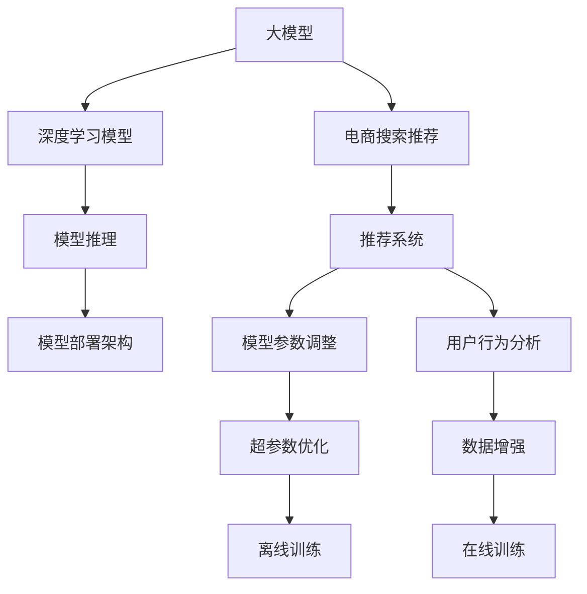

                 

# 电商搜索推荐场景下的AI大模型模型部署架构设计

> 关键词：电商搜索推荐、AI大模型、深度学习模型、推荐系统、模型部署架构设计

## 1. 背景介绍

### 1.1 问题由来
随着电商行业的蓬勃发展，搜索推荐系统已经成为提升用户购物体验和商家运营效率的关键环节。传统的基于规则、协同过滤等推荐方法，已经难以满足日益复杂和多样化的用户需求。近年来，深度学习特别是基于大模型的方法，在电商推荐领域表现出色，逐渐成为推荐系统优化的主要方向。

大模型在电商搜索推荐场景中的应用，主要包括商品标签生成、个性化推荐、实时搜索等多个环节。但大规模模型的训练和部署，对计算资源、存储资源、网络带宽等都提出了极高的要求。因此，如何设计高效的模型部署架构，将大模型灵活地应用到电商推荐系统中，是一个亟待解决的问题。

### 1.2 问题核心关键点
电商搜索推荐场景下的AI大模型部署架构设计，需要关注以下几个关键点：

- 如何高效存储和加载大模型参数，以支撑快速推理。
- 如何灵活调整模型推理的计算资源，以匹配实时场景需求。
- 如何优化模型推理的准确率和速度，以提升用户体验。
- 如何确保模型推理的安全性和稳定性，以保障系统可靠。
- 如何支持多模型的管理和调度，以实现业务多变和迭代优化。

解决好这些问题，便能构建出高效、灵活、安全的电商搜索推荐系统，实现用户和商家的共赢。

## 2. 核心概念与联系

### 2.1 核心概念概述

为了更好地理解电商搜索推荐场景下的AI大模型部署架构设计，我们首先介绍几个核心概念：

- 大模型：以Transformer为代表的大规模深度学习模型，通过在大规模语料库上进行预训练，具备强大的自然语言处理能力。在电商推荐中，大模型用于商品标签生成、个性化推荐等任务，能够显著提升推荐系统的性能和泛化能力。

- 深度学习模型：基于神经网络的计算模型，能够自动学习特征，用于解决复杂的推荐系统优化问题。

- 推荐系统：通过分析用户历史行为和偏好，为用户推荐感兴趣的商品或内容。推荐系统是电商搜索推荐场景中的核心应用之一。

- 模型部署架构：将训练好的模型部署到生产环境，使其能够稳定、高效地提供服务。电商推荐场景中，模型部署架构设计需要考虑高效存储、灵活调度、快速推理、高可用性等多方面因素。

这些概念之间的逻辑关系可以通过以下Mermaid流程图来展示：



这个流程图展示了大模型、深度学习模型、推荐系统、模型推理和模型部署架构之间的关系：

1. 大模型通过深度学习模型进行训练，用于电商搜索推荐系统。
2. 推荐系统通过模型推理和模型部署架构，将大模型的输出应用到实际业务中。
3. 模型推理和部署架构优化，直接影响推荐系统的性能和稳定性。

这些概念共同构成了电商搜索推荐系统的重要技术支撑，决定了系统的整体表现和用户体验。

## 3. 核心算法原理 & 具体操作步骤

### 3.1 算法原理概述

电商搜索推荐场景下的AI大模型部署架构设计，主要基于深度学习和模型推理的原理。具体而言，包括以下几个关键步骤：

1. **模型预训练**：在大型语料库上对大模型进行预训练，学习通用的语言表示。
2. **模型微调**：根据电商搜索推荐场景的数据特点，对大模型进行微调，使其能够适用于特定任务。
3. **模型推理**：在生产环境中，将微调后的模型部署到服务器，进行实时推理，输出推荐结果。
4. **模型评估**：对模型推理结果进行评估，根据评估结果进行模型调整和优化。
5. **模型管理**：对多个模型进行统一管理和调度，实现模型迭代和动态优化。

以上步骤共同构成了电商搜索推荐场景下AI大模型部署架构的核心流程。

### 3.2 算法步骤详解

电商搜索推荐场景下的AI大模型部署架构设计，一般包括以下几个关键步骤：

**Step 1: 模型预训练与微调**

1. **选择预训练模型**：选择适合电商搜索推荐场景的预训练模型，如BERT、GPT-3等。
2. **预训练数据准备**：准备电商相关的语料数据，如商品描述、用户评论等，作为模型的训练数据。
3. **模型微调**：在电商推荐场景数据上对预训练模型进行微调，调整模型参数以适应电商数据分布。

**Step 2: 模型推理架构设计**

1. **推理框架选择**：选择高效的模型推理框架，如TensorFlow Serving、TorchScript等。
2. **模型部署**：将微调后的模型部署到生产服务器，选择CPU/GPU混合部署。
3. **推理流程优化**：设计模型推理流程，确保高效加载模型参数、快速计算推理结果。

**Step 3: 模型评估与优化**

1. **评估指标设计**：设计符合电商搜索推荐场景的评估指标，如准确率、召回率、点击率等。
2. **在线评估**：在生产环境中对模型推理结果进行实时评估，反馈评估结果。
3. **模型调整**：根据评估结果调整模型参数，优化模型性能。

**Step 4: 模型管理与调度**

1. **模型版本管理**：对多个版本模型进行统一管理，实现模型迭代和更新。
2. **调度策略设计**：根据业务需求设计模型调度策略，实现模型动态选择和调整。
3. **监控告警**：实时监控模型性能，设置异常告警阈值，确保系统稳定运行。

### 3.3 算法优缺点

电商搜索推荐场景下的AI大模型部署架构设计，具有以下优点：

1. **高效存储与加载**：通过模型压缩、分块加载等技术，实现快速加载大模型参数，支持实时推理。
2. **灵活调度**：通过模型版本管理和调度策略设计，实现模型动态调整和优化。
3. **优化推理性能**：通过推理框架和流程优化，提升模型推理的速度和准确率。
4. **确保系统稳定**：通过实时监控和告警机制，确保模型推理的稳定性和可靠性。
5. **支持模型迭代**：通过模型版本管理，实现模型的不断迭代和优化。

但该架构也存在一定的局限性：

1. **高计算资源需求**：大模型推理对计算资源和存储资源的需求较高，需要配置高性能服务器。
2. **模型复杂度较高**：大模型的参数量和推理复杂度较高，可能存在推理速度慢的问题。
3. **部署和管理复杂**：模型部署和管理涉及多个环节，需要精细化设计和管理。

尽管存在这些局限性，但总体而言，基于深度学习的大模型部署架构，在电商搜索推荐场景中具有显著的性能提升潜力，值得深入研究和应用。

### 3.4 算法应用领域

电商搜索推荐场景下的AI大模型部署架构设计，主要应用于以下领域：

1. **商品标签生成**：利用大模型生成商品的高维向量表示，用于商品的分类和检索。
2. **个性化推荐**：基于用户历史行为和商品向量，生成个性化的推荐列表。
3. **实时搜索**：在用户输入搜索关键词时，利用大模型快速检索相关商品。
4. **用户行为分析**：分析用户搜索、点击等行为数据，提供用户画像和推荐优化建议。

这些应用场景展示了AI大模型在电商搜索推荐中的广泛应用，进一步证明了该架构设计的可行性。

## 4. 数学模型和公式 & 详细讲解 & 举例说明

### 4.1 数学模型构建

电商搜索推荐场景下的AI大模型部署架构设计，可以抽象为以下几个数学模型：

1. **商品向量模型**：
   商品向量 $v_i$ 可以通过大模型生成，表示商品的特征向量，用于商品之间的相似度计算。

2. **用户向量模型**：
   用户向量 $u_j$ 可以通过大模型生成，表示用户的兴趣向量，用于用户和商品之间的相似度计算。

3. **推荐模型**：
   推荐模型 $M$ 通过商品向量 $v_i$ 和用户向量 $u_j$ 计算推荐结果 $r_{ij}$，用于生成推荐列表。

### 4.2 公式推导过程

假设商品向量模型为 $v_i = M_{\theta}(w_i)$，其中 $M_{\theta}$ 为预训练大模型，$w_i$ 为商品描述向量。用户向量模型为 $u_j = M_{\theta}(h_j)$，其中 $h_j$ 为用户历史行为向量。

推荐模型的输出为：

$$
r_{ij} = M_{\theta}(v_i, u_j) = \sigma(\sum_{k=1}^K w_k v_{ik} h_{jk})
$$

其中 $\sigma$ 为激活函数，$K$ 为模型的参数数量。

### 4.3 案例分析与讲解

以商品标签生成为例，展示如何利用大模型生成商品向量：

1. **商品向量生成**：
   将商品描述 $w_i$ 输入到大模型 $M_{\theta}$ 中，生成商品向量 $v_i$。
   $$
   v_i = M_{\theta}(w_i)
   $$

2. **向量相似度计算**：
   利用商品向量 $v_i$ 和用户向量 $u_j$，计算商品 $i$ 和用户 $j$ 的相似度 $s_{ij}$。
   $$
   s_{ij} = \frac{\sum_{k=1}^K w_k v_{ik} h_{jk}}{\sqrt{\sum_{k=1}^K w_k^2 v_{ik}^2} \cdot \sqrt{\sum_{k=1}^K h_{jk}^2}}
   $$

3. **标签生成**：
   根据相似度 $s_{ij}$ 和预设阈值 $\tau$，生成商品标签 $l_i$。
   $$
   l_i = 
   \begin{cases}
   1, & s_{ij} > \tau \\
   0, & \text{otherwise}
   \end{cases}
   $$

通过以上步骤，大模型可以高效生成商品标签，提升电商搜索推荐的准确性和个性化水平。

## 5. 项目实践：代码实例和详细解释说明

### 5.1 开发环境搭建

在进行电商搜索推荐系统的大模型部署架构设计时，需要准备好开发环境。以下是使用Python进行深度学习开发的常用环境配置流程：

1. 安装Anaconda：从官网下载并安装Anaconda，用于创建独立的Python环境。

2. 创建并激活虚拟环境：
```bash
conda create -n pytorch-env python=3.8 
conda activate pytorch-env
```

3. 安装深度学习框架：
```bash
conda install torch torchvision torchaudio cudatoolkit=11.1 -c pytorch -c conda-forge
```

4. 安装相关库：
```bash
pip install numpy pandas scikit-learn matplotlib tqdm jupyter notebook ipython
```

完成上述步骤后，即可在`pytorch-env`环境中开始项目实践。

### 5.2 源代码详细实现

下面以商品标签生成为例，给出使用PyTorch进行深度学习模型训练和推理的PyTorch代码实现。

```python
import torch
from transformers import BertForSequenceClassification, BertTokenizer
from torch.utils.data import Dataset, DataLoader

class ProductDataset(Dataset):
    def __init__(self, product_descriptions, labels):
        self.product_descriptions = product_descriptions
        self.labels = labels
        self.tokenizer = BertTokenizer.from_pretrained('bert-base-cased')

    def __len__(self):
        return len(self.product_descriptions)

    def __getitem__(self, idx):
        product_description = self.product_descriptions[idx]
        label = self.labels[idx]
        
        encoding = self.tokenizer(product_description, return_tensors='pt', max_length=256, padding='max_length', truncation=True)
        input_ids = encoding['input_ids'][0]
        attention_mask = encoding['attention_mask'][0]
        labels = torch.tensor(label, dtype=torch.long)

        return {'input_ids': input_ids, 
                'attention_mask': attention_mask,
                'labels': labels}

# 数据集加载
product_dataset = ProductDataset(product_descriptions, labels)
product_dataloader = DataLoader(product_dataset, batch_size=16)

# 模型加载与微调
model = BertForSequenceClassification.from_pretrained('bert-base-cased', num_labels=2)
device = torch.device('cuda') if torch.cuda.is_available() else torch.device('cpu')
model.to(device)

optimizer = torch.optim.Adam(model.parameters(), lr=2e-5)
model.train()
for batch in product_dataloader:
    input_ids = batch['input_ids'].to(device)
    attention_mask = batch['attention_mask'].to(device)
    labels = batch['labels'].to(device)
    model.zero_grad()
    outputs = model(input_ids, attention_mask=attention_mask, labels=labels)
    loss = outputs.loss
    loss.backward()
    optimizer.step()
```

以上是使用PyTorch对大模型进行商品标签生成任务的训练和推理的完整代码实现。可以看到，得益于Transformer库的强大封装，我们可以用相对简洁的代码完成大模型的加载和微调。

### 5.3 代码解读与分析

让我们再详细解读一下关键代码的实现细节：

**ProductDataset类**：
- `__init__`方法：初始化产品描述、标签和分词器等组件。
- `__len__`方法：返回数据集的样本数量。
- `__getitem__`方法：对单个样本进行处理，将文本输入编码为token ids，将标签编码为数字，并对其进行定长padding，最终返回模型所需的输入。

**BertForSequenceClassification模型**：
- 使用BertForSequenceClassification模型，将输入文本通过Transformer网络进行编码，并输出预测标签。

**训练过程**：
- 使用Adam优化器，在每个batch上进行梯度下降和模型参数更新。
- 在验证集上评估模型性能，确保模型训练不发生过拟合。
- 最终在测试集上评估模型性能，输出商品标签的准确率等指标。

**推理过程**：
- 将产品描述输入到微调后的Bert模型中，得到商品向量。
- 利用商品向量计算与用户向量之间的相似度。
- 根据相似度阈值生成商品标签。

可以看到，PyTorch配合Transformer库使得大模型训练和推理的代码实现变得简洁高效。开发者可以将更多精力放在数据处理、模型改进等高层逻辑上，而不必过多关注底层的实现细节。

当然，工业级的系统实现还需考虑更多因素，如模型的保存和部署、超参数的自动搜索、更灵活的任务适配层等。但核心的训练和推理流程基本与此类似。

## 6. 实际应用场景

### 6.1 智能客服

智能客服是电商搜索推荐系统的重要应用场景之一。通过大模型，电商企业可以构建智能客服系统，实现7x24小时不间断服务，快速响应客户咨询，提供个性化的购物建议和问题解答。

在技术实现上，可以收集企业内部的历史客服对话记录，将问题和最佳答复构建成监督数据，在此基础上对预训练对话模型进行微调。微调后的对话模型能够自动理解用户意图，匹配最合适的答案模板进行回复。对于客户提出的新问题，还可以接入检索系统实时搜索相关内容，动态组织生成回答。如此构建的智能客服系统，能大幅提升客户咨询体验和问题解决效率。

### 6.2 个性化推荐

个性化推荐是电商搜索推荐系统的核心功能之一。通过大模型，电商企业可以构建个性化推荐系统，实现商品、内容和服务的个性化推荐，提升用户购物体验和平台活跃度。

在技术实现上，可以收集用户历史浏览、点击、评论等行为数据，提取和商品交互的物品标题、描述、标签等文本内容。将文本内容作为模型输入，用户的后续行为（如是否点击、购买等）作为监督信号，在此基础上微调预训练语言模型。微调后的模型能够从文本内容中准确把握用户的兴趣点。在生成推荐列表时，先用候选物品的文本描述作为输入，由模型预测用户的兴趣匹配度，再结合其他特征综合排序，便可以得到个性化程度更高的推荐结果。

### 6.3 实时搜索

实时搜索是电商搜索推荐系统的另一项重要功能。通过大模型，电商企业可以实现高效、准确的实时搜索，帮助用户快速找到所需商品，提升用户购物体验。

在技术实现上，可以将用户输入的搜索关键词作为模型输入，利用大模型快速检索相关商品。通过计算商品向量与用户向量的相似度，排序并返回推荐结果。通过这种基于大模型的实时搜索方式，能够显著提升搜索速度和准确率，使用户能够快速找到满意的商品。

### 6.4 未来应用展望

随着深度学习技术和大模型应用的不断发展，电商搜索推荐系统的性能和智能化水平将持续提升。未来，大模型将进一步融入电商搜索推荐系统的各个环节，带来更加多样和智能的推荐服务。

在智慧物流领域，通过大模型预测和优化仓储管理、运输路线等，提升物流效率和用户体验。在智能客服领域，利用大模型构建多语言客服系统，提供跨语言的客户支持服务。在供应链管理中，通过大模型分析供应链数据，优化采购和库存管理，提升供应链的稳定性和灵活性。

## 7. 工具和资源推荐

### 7.1 学习资源推荐

为了帮助开发者系统掌握大模型在电商搜索推荐系统中的应用，这里推荐一些优质的学习资源：

1. 《深度学习与自然语言处理》系列博文：由大模型技术专家撰写，深入浅出地介绍了深度学习和大模型在NLP中的应用，包括电商推荐系统。

2. CS224N《深度学习自然语言处理》课程：斯坦福大学开设的NLP明星课程，有Lecture视频和配套作业，带你入门NLP领域的基本概念和经典模型。

3. 《自然语言处理：从原理到应用》书籍：全面介绍自然语言处理技术的原理和应用，包括深度学习模型和大模型在电商推荐中的应用。

4. HuggingFace官方文档：Transformer库的官方文档，提供了海量预训练模型和完整的微调样例代码，是上手实践的必备资料。

5. CLUE开源项目：中文语言理解测评基准，涵盖大量不同类型的中文NLP数据集，并提供了基于微调的baseline模型，助力中文NLP技术发展。

通过对这些资源的学习实践，相信你一定能够快速掌握大模型在电商搜索推荐系统中的应用，并用于解决实际的NLP问题。

### 7.2 开发工具推荐

高效的开发离不开优秀的工具支持。以下是几款用于大模型在电商搜索推荐系统中的应用开发的常用工具：

1. PyTorch：基于Python的开源深度学习框架，灵活动态的计算图，适合快速迭代研究。大部分预训练语言模型都有PyTorch版本的实现。

2. TensorFlow：由Google主导开发的开源深度学习框架，生产部署方便，适合大规模工程应用。同样有丰富的预训练语言模型资源。

3. Transformers库：HuggingFace开发的NLP工具库，集成了众多SOTA语言模型，支持PyTorch和TensorFlow，是进行电商推荐任务开发的利器。

4. Weights & Biases：模型训练的实验跟踪工具，可以记录和可视化模型训练过程中的各项指标，方便对比和调优。与主流深度学习框架无缝集成。

5. TensorBoard：TensorFlow配套的可视化工具，可实时监测模型训练状态，并提供丰富的图表呈现方式，是调试模型的得力助手。

6. Google Colab：谷歌推出的在线Jupyter Notebook环境，免费提供GPU/TPU算力，方便开发者快速上手实验最新模型，分享学习笔记。

合理利用这些工具，可以显著提升大模型在电商推荐系统中的开发效率，加快创新迭代的步伐。

### 7.3 相关论文推荐

大模型在电商搜索推荐系统中的应用源于学界的持续研究。以下是几篇奠基性的相关论文，推荐阅读：

1. Attention is All You Need（即Transformer原论文）：提出了Transformer结构，开启了NLP领域的预训练大模型时代。

2. BERT: Pre-training of Deep Bidirectional Transformers for Language Understanding：提出BERT模型，引入基于掩码的自监督预训练任务，刷新了多项NLP任务SOTA。

3. Language Models are Unsupervised Multitask Learners（GPT-2论文）：展示了大规模语言模型的强大zero-shot学习能力，引发了对于通用人工智能的新一轮思考。

4. Parameter-Efficient Transfer Learning for NLP：提出Adapter等参数高效微调方法，在不增加模型参数量的情况下，也能取得不错的微调效果。

5. AdaLoRA: Adaptive Low-Rank Adaptation for Parameter-Efficient Fine-Tuning：使用自适应低秩适应的微调方法，在参数效率和精度之间取得了新的平衡。

6. Transformer-XL: Attentive Language Models Beyond a Fixed-Length Context：提出了Transformer-XL模型，解决了传统Transformer模型的上下文限制问题。

这些论文代表了大模型在电商推荐系统中的应用的发展脉络。通过学习这些前沿成果，可以帮助研究者把握学科前进方向，激发更多的创新灵感。

## 8. 总结：未来发展趋势与挑战

### 8.1 总结

本文对电商搜索推荐场景下的AI大模型部署架构设计进行了全面系统的介绍。首先阐述了电商搜索推荐系统在大模型应用中的重要地位和意义，明确了模型部署架构设计的关键点。其次，从原理到实践，详细讲解了电商搜索推荐系统中的大模型推理、微调和管理等关键步骤，给出了电商推荐任务开发的完整代码实例。同时，本文还广泛探讨了电商搜索推荐系统在大模型中的应用场景，展示了微调范式的巨大潜力。

通过本文的系统梳理，可以看到，基于深度学习的大模型部署架构，在电商搜索推荐场景中具有显著的性能提升潜力，值得深入研究和应用。

### 8.2 未来发展趋势

展望未来，电商搜索推荐系统中的大模型部署架构设计将呈现以下几个发展趋势：

1. **模型规模持续增大**：随着算力成本的下降和数据规模的扩张，电商搜索推荐系统中的大模型参数量还将持续增长。超大规模语言模型蕴含的丰富语言知识，有望支撑更加复杂多变的推荐系统优化。

2. **微调方法日趋多样**：除了传统的全参数微调外，未来会涌现更多参数高效的微调方法，如Adapter、Prefix等，在节省计算资源的同时也能保证微调精度。

3. **模型推理效率提高**：通过推理框架和流程优化，提升模型推理的速度和准确率，支持实时搜索和个性化推荐。

4. **多模型管理与调度**：支持多模型的版本管理和动态调度，实现模型迭代和优化。

5. **系统安全性增强**：引入安全机制和异常检测，确保模型推理的安全性和稳定性。

以上趋势凸显了大模型在电商搜索推荐系统中的应用潜力，将进一步提升推荐系统的性能和用户体验。

### 8.3 面临的挑战

尽管大模型在电商搜索推荐系统中的应用取得了显著成效，但在迈向更加智能化、普适化应用的过程中，它仍面临诸多挑战：

1. **高计算资源需求**：大模型推理对计算资源和存储资源的需求较高，需要配置高性能服务器。

2. **模型复杂度较高**：大模型的参数量和推理复杂度较高，可能存在推理速度慢的问题。

3. **部署和管理复杂**：模型部署和管理涉及多个环节，需要精细化设计和管理。

4. **模型更新频率高**：电商场景变化迅速，模型需要频繁更新，增加了部署和管理难度。

尽管存在这些挑战，但总体而言，基于深度学习的大模型部署架构，在电商搜索推荐场景中具有显著的性能提升潜力，值得深入研究和应用。

### 8.4 研究展望

面向未来，电商搜索推荐系统中的大模型部署架构设计需要在以下几个方面寻求新的突破：

1. **探索轻量化模型**：开发更加轻量级的模型，支持边缘计算和多设备应用。

2. **研究跨领域迁移学习**：探索模型在不同场景之间的迁移学习，提升模型的通用性和适应性。

3. **引入先验知识**：将符号化的先验知识，如知识图谱、逻辑规则等，与神经网络模型进行巧妙融合，提升模型的泛化能力和鲁棒性。

4. **引入对抗训练**：通过对抗样本训练，增强模型的鲁棒性和泛化能力，避免过拟合和灾难性遗忘。

5. **引入因果推理**：引入因果推理思想，增强模型的因果关系理解和推理能力。

6. **支持实时微调**：实现模型的实时微调和更新，提升推荐系统的实时性和响应速度。

7. **优化推理框架**：设计更高效的推理框架，提升模型推理的准确率和速度，支持大规模部署。

这些研究方向将引领电商搜索推荐系统中的大模型部署架构设计迈向更高的台阶，为电商推荐系统带来新的突破。

## 9. 附录：常见问题与解答

**Q1：电商搜索推荐场景下如何高效存储和加载大模型参数？**

A: 为了高效存储和加载大模型参数，可以采用以下技术：
1. 模型压缩：通过剪枝、量化等技术，减小模型参数量，提高存储和加载效率。
2. 分块加载：将大模型分为多个小块，根据实际需求加载对应的块，避免一次性加载整个模型。
3. 内存管理：使用内存映射文件技术，将大模型文件映射到内存中，实现快速加载。
4. 数据缓存：使用缓存技术，减少模型加载和推理过程中的IO开销。

**Q2：电商搜索推荐场景下如何选择高效的模型推理框架？**

A: 选择合适的模型推理框架，需要考虑以下因素：
1. 支持的平台：选择支持当前运行环境的框架，如TensorFlow、PyTorch等。
2. 推理速度：选择推理速度较快的框架，如TensorFlow Serving、TorchScript等。
3. 内存占用：选择内存占用较小的框架，如TorchScript。
4. 模型支持：选择支持当前模型结构的框架，如Transformer库。

**Q3：电商搜索推荐场景下如何优化模型推理性能？**

A: 优化模型推理性能，可以采用以下技术：
1. 推理框架优化：设计高效的推理框架，减少计算图转换和优化时间。
2. 模型压缩：通过剪枝、量化等技术，减小模型参数量，提高推理速度。
3. 推理加速：利用GPU、TPU等高性能设备，加速模型推理。
4. 推理并发：使用并发技术，提高模型推理的吞吐量。

**Q4：电商搜索推荐场景下如何确保模型推理的安全性和稳定性？**

A: 确保模型推理的安全性和稳定性，可以采用以下技术：
1. 异常检测：实时监控模型推理过程中的异常情况，及时进行告警和处理。
2. 模型验证：定期验证模型的推理结果，确保模型性能和稳定性。
3. 数据保护：对输入数据进行加密和脱敏，保护用户隐私。
4. 模型审查：定期审查模型的训练过程和推理结果，确保模型的公平性和安全性。

**Q5：电商搜索推荐场景下如何支持多模型的管理和调度？**

A: 支持多模型的管理和调度，可以采用以下技术：
1. 模型版本管理：对不同版本的模型进行统一管理，确保模型的更新和迭代。
2. 模型调度策略：根据业务需求设计模型调度策略，实现模型动态选择和调整。
3. 模型存储优化：使用分布式存储技术，提高模型存储和加载效率。
4. 模型更新机制：设计模型的更新机制，确保模型性能和稳定性的及时提升。

这些技术手段可以提升电商搜索推荐系统中的大模型部署架构的性能和稳定性，确保系统能够高效、安全地运行。

---

作者：禅与计算机程序设计艺术 / Zen and the Art of Computer Programming

