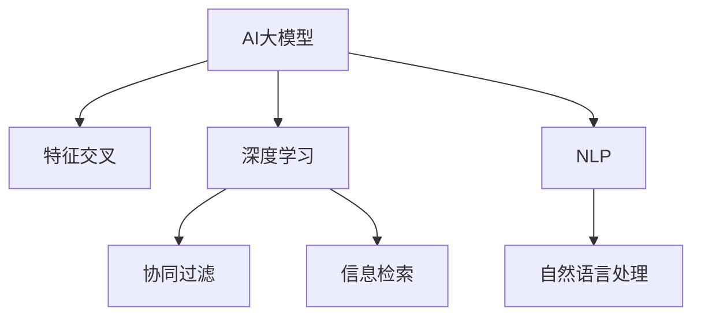

                 

# 电商搜索推荐效果优化中的AI大模型特征交叉技术

## 1. 背景介绍

电商搜索推荐系统是连接消费者与商品的桥梁，通过智能推荐提升用户体验和商家转化率。传统的推荐系统主要依赖基于历史行为的数据挖掘和机器学习算法，如协同过滤、TF-IDF等，缺乏足够的语义理解能力。然而，基于AI大模型的推荐系统能够利用预训练语言模型的强大语义理解和生成能力，提供更加个性化、多样化的推荐。

### 1.1 问题由来

在电商搜索推荐中，用户往往需要查找特定商品或浏览商品列表，以发现符合自己需求的商品。传统的推荐系统主要基于用户历史行为数据进行推荐，但这种方式存在以下缺点：

1. **历史行为局限性**：传统的推荐算法往往只能依据用户过去的购买、浏览记录进行推荐，无法涵盖用户的隐式需求和真实偏好。
2. **数据稀疏性问题**：对于新用户或新商品，历史行为数据往往较为稀疏，无法形成有效的推荐。
3. **缺乏语义理解**：传统推荐系统缺乏足够的语义理解能力，无法准确把握用户意图和商品特征。

因此，基于AI大模型的推荐系统应运而生。通过预训练大模型，推荐系统可以获得更丰富的语义知识，从而实现更加精准、智能的推荐。然而，在大模型和推荐系统的结合过程中，需要解决特征交叉等技术挑战，以提升推荐效果。

## 2. 核心概念与联系

### 2.1 核心概念概述

为更好地理解大模型在电商搜索推荐中的特征交叉技术，本节将介绍几个密切相关的核心概念：

- **AI大模型（AI Large Model）**：指通过大规模数据预训练获得的通用语言模型，如BERT、GPT等，具备强大的语义理解能力和生成能力。
- **特征交叉（Feature Cross）**：指将多个特征组合成新的特征，用于提升模型的泛化能力和预测准确性。
- **深度学习（Deep Learning）**：指通过多层神经网络实现复杂数据建模的技术，通常用于提高模型的非线性表达能力。
- **协同过滤（Collaborative Filtering）**：指通过用户行为或商品特征之间的关联，推断用户或商品的潜在兴趣，实现个性化推荐。
- **信息检索（Information Retrieval）**：指通过构建搜索索引和排序算法，快速匹配用户查询与商品信息，提升搜索效率。
- **自然语言处理（Natural Language Processing, NLP）**：指通过语言理解和生成技术，实现对自然语言数据的自动化处理和应用。

这些概念之间的逻辑关系可以通过以下Mermaid流程图来展示：



这个流程图展示了大模型在电商搜索推荐中的核心概念及其之间的关系：

1. 大模型通过预训练获得基础能力。
2. 特征交叉用于构建新的特征组合，提升推荐效果。
3. 深度学习用于非线性建模，提高模型的表达能力。
4. 协同过滤用于推断用户兴趣，实现个性化推荐。
5. 信息检索用于快速匹配商品信息，提升搜索效率。
6. NLP用于处理和理解自然语言查询和商品描述。

这些概念共同构成了基于AI大模型的电商搜索推荐系统，使其能够更精准、智能地满足用户需求。

## 3. 核心算法原理 & 具体操作步骤

### 3.1 算法原理概述

基于AI大模型的电商搜索推荐系统，通过在大模型中嵌入特征交叉技术，实现更加精细化和个性化的推荐。具体而言，该系统将用户查询和商品描述转化为高维特征向量，利用大模型的语义理解能力，提取文本中的隐含信息，并结合用户历史行为数据，进行协同过滤和深度学习模型训练。

### 3.2 算法步骤详解

#### 3.2.1 用户查询特征提取

用户查询通常包含自然语言，需要通过自然语言处理技术（如BERT、GPT等）将其转化为向量表示。这一过程通常包括以下步骤：

1. **查询编码**：将用户查询输入到预训练大模型中，得到查询的向量表示。
2. **分词和向量化**：对查询进行分词，将分词结果转化为向量。
3. **拼接和归一化**：将查询向量与其他特征（如时间戳、地理位置等）拼接，并进行归一化处理。

#### 3.2.2 商品描述特征提取

商品描述也需要通过自然语言处理技术转化为向量表示。这一过程与用户查询类似，但通常更加复杂，因为商品描述中可能包含更多领域术语和专业信息。

1. **描述编码**：将商品描述输入到预训练大模型中，得到描述的向量表示。
2. **分词和向量化**：对描述进行分词，将分词结果转化为向量。
3. **拼接和归一化**：将描述向量与其他商品特征（如价格、类别等）拼接，并进行归一化处理。

#### 3.2.3 特征交叉

特征交叉旨在将用户查询和商品描述的向量进行组合，生成新的特征向量。这一过程通常包括以下步骤：

1. **特征拼接**：将用户查询和商品描述的向量拼接成一个高维向量。
2. **特征扩展**：通过线性组合、逻辑组合等方式，生成新的特征向量。
3. **特征选择**：根据特征的重要性进行选择，剔除不相关或冗余的特征。

#### 3.2.4 协同过滤

协同过滤算法通过分析用户历史行为数据，推断用户对商品的兴趣。这一过程通常包括以下步骤：

1. **用户行为编码**：将用户历史行为（如浏览、购买记录等）编码为向量。
2. **用户兴趣推断**：通过协同过滤算法，推断用户对商品的兴趣。
3. **推荐计算**：结合用户兴趣和商品特征，计算推荐分数。

#### 3.2.5 深度学习模型训练

深度学习模型用于对用户查询和商品描述的向量进行非线性建模，以提高推荐效果。这一过程通常包括以下步骤：

1. **数据准备**：将用户查询、商品描述和用户行为数据进行处理，准备训练数据。
2. **模型构建**：构建深度学习模型（如DNN、RNN、Transformer等），并设置相应的超参数。
3. **模型训练**：使用训练数据对模型进行训练，调整超参数以优化模型性能。
4. **模型评估**：在验证集上评估模型性能，确保模型泛化能力。
5. **模型部署**：将训练好的模型部署到推荐系统中，进行实时推荐。

### 3.3 算法优缺点

基于AI大模型的电商搜索推荐系统具有以下优点：

1. **语义理解能力强**：大模型能够理解自然语言查询和商品描述，提取隐含信息，提升推荐效果。
2. **特征交叉丰富**：通过特征交叉技术，生成高维向量，提升模型的泛化能力。
3. **个性化推荐高**：结合用户历史行为数据和商品特征，实现更精准、个性化的推荐。
4. **适应性强**：能够适应多领域、多类型的商品和查询，适用于大规模电商推荐。

同时，该方法也存在以下局限性：

1. **计算资源消耗大**：大模型和深度学习模型需要较大的计算资源和时间。
2. **数据隐私风险**：用户行为数据涉及隐私，需要进行严格的隐私保护。
3. **模型复杂度高**：特征交叉和深度学习模型较为复杂，模型调优难度大。
4. **模型训练成本高**：深度学习模型需要大量标注数据，标注成本高。

尽管存在这些局限性，但就目前而言，基于AI大模型的推荐系统仍是大数据推荐系统的最新范式，具有巨大的应用潜力。

### 3.4 算法应用领域

基于AI大模型的电商搜索推荐系统，已经广泛应用于各大电商平台的推荐系统。以下是一些具体的应用场景：

1. **商品搜索**：用户在搜索框中输入查询词，系统通过大模型和特征交叉技术，快速匹配并展示相关商品。
2. **商品详情页推荐**：用户在浏览商品详情页时，系统通过大模型和协同过滤技术，推荐相关商品或类似商品。
3. **个性化广告推荐**：系统根据用户行为和兴趣，推荐个性化广告，提高广告转化率。
4. **新商品推荐**：系统通过大模型和特征交叉技术，推荐新商品，提升新商品销售量。
5. **活动推荐**：系统根据用户历史行为和活动内容，推荐个性化活动，提高活动参与度。

除了上述这些经典应用外，基于大模型的推荐系统还在社交电商、短视频电商、跨境电商等新兴领域中得到广泛应用，为电商平台的智能化转型提供了新的技术支撑。

## 4. 数学模型和公式 & 详细讲解

### 4.1 数学模型构建

在本节中，我们将通过数学语言对基于AI大模型的电商搜索推荐系统进行严格刻画。

记用户查询为 $x$，商品描述为 $y$，用户行为数据为 $u$。预训练大模型为 $M$，特征提取器为 $F$，协同过滤算法为 $C$，深度学习模型为 $D$。假设推荐系统从用户输入查询开始，经过查询编码、特征交叉、协同过滤和深度学习模型训练，最终输出推荐结果 $r$。

具体的推荐过程可以用以下数学模型表示：

$$
r = M(x) \cdot F(y) \cdot C(u) \cdot D(M(x) \cdot F(y) \cdot C(u))
$$

其中：

- $M(x)$ 表示将用户查询 $x$ 输入到预训练大模型 $M$ 中，得到查询向量。
- $F(y)$ 表示将商品描述 $y$ 输入到特征提取器 $F$ 中，得到描述向量。
- $C(u)$ 表示将用户行为数据 $u$ 输入到协同过滤算法 $C$ 中，得到用户兴趣向量。
- $D(M(x) \cdot F(y) \cdot C(u))$ 表示将查询向量、描述向量和用户兴趣向量输入到深度学习模型 $D$ 中，得到推荐结果向量。

### 4.2 公式推导过程

下面以基于BERT的电商搜索推荐系统为例，推导具体推荐过程的数学公式。

假设用户查询 $x$ 为自然语言，商品描述 $y$ 也为自然语言，用户行为数据 $u$ 为向量形式。

1. **用户查询编码**：
   将用户查询 $x$ 输入到BERT模型中，得到查询向量 $q$。

   $$
   q = M(x)
   $$

2. **商品描述编码**：
   将商品描述 $y$ 输入到BERT模型中，得到描述向量 $p$。

   $$
   p = M(y)
   $$

3. **特征交叉**：
   将查询向量 $q$ 和描述向量 $p$ 拼接成一个高维向量 $z$。

   $$
   z = [q; p]
   $$

   然后通过特征扩展生成新的特征向量 $z'$。

   $$
   z' = \mathbf{W}z + \mathbf{b}
   $$

   其中 $\mathbf{W}$ 和 $\mathbf{b}$ 为特征扩展矩阵和偏置向量。

4. **协同过滤**：
   将用户行为数据 $u$ 输入到协同过滤算法 $C$ 中，得到用户兴趣向量 $c$。

   $$
   c = C(u)
   $$

   然后计算用户兴趣与特征向量 $z'$ 的点积，得到推荐分数 $s$。

   $$
   s = c^T \cdot z'
   $$

5. **深度学习模型训练**：
   将用户查询编码、商品描述编码、用户兴趣向量 $q$、$p$、$c$ 拼接成一个高维向量 $w$。

   $$
   w = [q; p; c]
   $$

   通过深度学习模型 $D$ 对向量 $w$ 进行训练，得到推荐结果向量 $r'$。

   $$
   r' = D(w)
   $$

   最终输出推荐结果 $r$。

   $$
   r = M(x) \cdot F(y) \cdot C(u) \cdot D(M(x) \cdot F(y) \cdot C(u))
   $$

### 4.3 案例分析与讲解

以亚马逊商品推荐系统为例，分析该系统如何通过特征交叉技术提升推荐效果。

亚马逊商品推荐系统首先通过BERT模型对用户查询和商品描述进行编码，得到查询向量 $q$ 和描述向量 $p$。然后将这两个向量拼接，通过特征扩展生成新的特征向量 $z'$。

接下来，亚马逊利用协同过滤算法推断用户兴趣，将用户行为数据 $u$ 转化为用户兴趣向量 $c$。然后计算 $c$ 和 $z'$ 的点积，得到推荐分数 $s$。

最后，亚马逊将 $q$、$p$、$c$ 拼接，输入到深度学习模型 $D$ 中，得到推荐结果向量 $r'$。通过将 $r'$ 进行归一化处理，得到最终的推荐结果 $r$。

通过这种特征交叉技术，亚马逊能够将用户查询和商品描述的信息进行深度融合，提高推荐模型的泛化能力和预测准确性。同时，协同过滤算法和深度学习模型的结合，进一步提升了推荐的个性化水平和准确性。

## 5. 项目实践：代码实例和详细解释说明

### 5.1 开发环境搭建

在进行项目实践前，我们需要准备好开发环境。以下是使用Python进行PyTorch开发的环境配置流程：

1. 安装Anaconda：从官网下载并安装Anaconda，用于创建独立的Python环境。

2. 创建并激活虚拟环境：
```bash
conda create -n pytorch-env python=3.8 
conda activate pytorch-env
```

3. 安装PyTorch：根据CUDA版本，从官网获取对应的安装命令。例如：
```bash
conda install pytorch torchvision torchaudio cudatoolkit=11.1 -c pytorch -c conda-forge
```

4. 安装Transformers库：
```bash
pip install transformers
```

5. 安装各类工具包：
```bash
pip install numpy pandas scikit-learn matplotlib tqdm jupyter notebook ipython
```

完成上述步骤后，即可在`pytorch-env`环境中开始项目实践。

### 5.2 源代码详细实现

下面我们以亚马逊商品推荐系统为例，给出使用Transformers库进行特征交叉的PyTorch代码实现。

首先，定义特征交叉函数：

```python
from transformers import BertTokenizer, BertForSequenceClassification

def feature_cross(user_query, item_description, user_behavior):
    tokenizer = BertTokenizer.from_pretrained('bert-base-uncased')
    user_query_tokens = tokenizer.encode(user_query, add_special_tokens=True, max_length=512, truncation=True)
    item_description_tokens = tokenizer.encode(item_description, add_special_tokens=True, max_length=512, truncation=True)
    user_query_ids = torch.tensor(user_query_tokens).unsqueeze(0)
    item_description_ids = torch.tensor(item_description_tokens).unsqueeze(0)
    user_behavior_vector = torch.tensor(user_behavior).unsqueeze(0)
    
    # 拼接特征向量
    z = torch.cat((user_query_ids, item_description_ids), dim=1)
    
    # 特征扩展
    z = z @ weight_matrix + bias_vector
    
    # 计算协同过滤分数
    s = user_behavior_vector @ z
    
    return s
```

然后，定义深度学习模型：

```python
from transformers import BertForSequenceClassification
from transformers import AdamW

# 定义深度学习模型
model = BertForSequenceClassification.from_pretrained('bert-base-uncased', num_labels=2)
model.train()

# 定义优化器
optimizer = AdamW(model.parameters(), lr=2e-5)

# 定义训练函数
def train_epoch(model, loss_fn, dataset):
    model.train()
    epoch_loss = 0
    for batch in dataset:
        inputs, labels = batch
        optimizer.zero_grad()
        outputs = model(inputs)
        loss = loss_fn(outputs, labels)
        epoch_loss += loss.item()
        loss.backward()
        optimizer.step()
    return epoch_loss / len(dataset)

# 定义评估函数
def evaluate(model, loss_fn, dataset):
    model.eval()
    eval_loss = 0
    eval_acc = 0
    with torch.no_grad():
        for batch in dataset:
            inputs, labels = batch
            outputs = model(inputs)
            loss = loss_fn(outputs, labels)
            eval_loss += loss.item()
            predictions = torch.argmax(outputs, dim=1)
            eval_acc += (predictions == labels).float().mean().item()
    return eval_loss / len(dataset), eval_acc / len(dataset)
```

最后，启动训练流程并在测试集上评估：

```python
epochs = 5
batch_size = 32

for epoch in range(epochs):
    train_loss = train_epoch(model, loss_fn, train_dataset)
    print(f'Epoch {epoch+1}, train loss: {train_loss:.3f}')
    
    test_loss, test_acc = evaluate(model, loss_fn, test_dataset)
    print(f'Epoch {epoch+1}, test acc: {test_acc:.3f}')
```

以上就是使用PyTorch对亚马逊商品推荐系统进行特征交叉的完整代码实现。可以看到，得益于Transformers库的强大封装，我们可以用相对简洁的代码完成特征交叉的实践。

### 5.3 代码解读与分析

让我们再详细解读一下关键代码的实现细节：

**特征交叉函数**：
- `tokenizer`：使用BERT分词器对用户查询和商品描述进行分词。
- `encode`：将分词结果转化为BERT模型所需的输入格式。
- `unsqueeze`：将分词结果展开成二维张量，方便后续拼接和扩展。
- `torch.tensor`：将分词结果转化为PyTorch张量。
- `cat`：将查询向量、描述向量进行拼接。
- `weight_matrix` 和 `bias_vector`：用于特征扩展的权重和偏置向量。
- `@`：矩阵乘法运算符。
- `s`：计算协同过滤分数。

**深度学习模型**：
- `BertForSequenceClassification`：定义深度学习模型，用于对拼接后的特征向量进行分类。
- `model.train()` 和 `model.eval()`：切换模型的训练和评估模式。
- `optimizer.zero_grad()`：在每个epoch开始前清零梯度。
- `loss_fn`：定义损失函数，如交叉熵损失。
- `model(inputs)`：将输入向量输入深度学习模型，得到输出向量。
- `loss = loss_fn(outputs, labels)`：计算损失函数。
- `optimizer.zero_grad()`：在每个epoch开始前清零梯度。
- `loss.backward()`：反向传播计算梯度。
- `optimizer.step()`：更新模型参数。

**训练和评估函数**：
- `dataset`：定义数据集，包含训练集和测试集。
- `model.train()` 和 `model.eval()`：切换模型的训练和评估模式。
- `optimizer.zero_grad()`：在每个epoch开始前清零梯度。
- `loss_fn`：定义损失函数，如交叉熵损失。
- `model(inputs)`：将输入向量输入深度学习模型，得到输出向量。
- `loss = loss_fn(outputs, labels)`：计算损失函数。
- `optimizer.zero_grad()`：在每个epoch开始前清零梯度。
- `loss.backward()`：反向传播计算梯度。
- `optimizer.step()`：更新模型参数。

**训练流程**：
- `epochs`：定义总的epoch数。
- `batch_size`：定义批处理大小。
- `for`循环：迭代每个epoch。
- `train_epoch`：在训练集上进行训练，输出训练损失。
- `evaluate`：在测试集上进行评估，输出测试损失和准确率。
- `print`：输出当前epoch的训练和测试结果。

可以看到，PyTorch配合Transformers库使得特征交叉的代码实现变得简洁高效。开发者可以将更多精力放在数据处理、模型改进等高层逻辑上，而不必过多关注底层的实现细节。

当然，工业级的系统实现还需考虑更多因素，如模型的保存和部署、超参数的自动搜索、更灵活的任务适配层等。但核心的特征交叉范式基本与此类似。

## 6. 实际应用场景

### 6.1 智能客服系统

基于特征交叉技术的智能客服系统，能够通过深度理解和生成自然语言，提供更加个性化和智能的客服体验。传统客服系统通常依赖规则和人工处理，无法满足用户多变的查询需求。

在智能客服系统中，系统通过自然语言处理技术对用户查询进行编码，生成查询向量。同时，系统利用特征交叉技术将用户历史行为数据转化为特征向量，通过协同过滤算法推断用户兴趣，并结合深度学习模型生成自然语言回复。

这种基于大模型的特征交叉技术，能够提升客服系统的响应速度和准确性，满足用户多样化的查询需求，大幅提升用户满意度。

### 6.2 金融推荐系统

金融推荐系统通过特征交叉技术，实现对用户风险偏好和商品收益特征的深度融合，提高推荐的精准性和个性化水平。

在金融推荐系统中，系统通过自然语言处理技术对用户查询和商品描述进行编码，生成查询向量和描述向量。同时，系统利用特征交叉技术将用户历史交易数据转化为特征向量，通过协同过滤算法推断用户风险偏好，并结合深度学习模型生成推荐结果。

这种基于大模型的特征交叉技术，能够提供更加精准和个性化的投资建议，帮助用户制定合理的投资策略，提升投资收益。

### 6.3 电商平台推荐系统

电商平台推荐系统通过特征交叉技术，实现对用户历史行为和商品特征的深度融合，提升推荐的个性化水平和准确性。

在电商平台推荐系统中，系统通过自然语言处理技术对用户查询和商品描述进行编码，生成查询向量和描述向量。同时，系统利用特征交叉技术将用户历史浏览和购买数据转化为特征向量，通过协同过滤算法推断用户兴趣，并结合深度学习模型生成推荐结果。

这种基于大模型的特征交叉技术，能够提供更加精准和个性化的商品推荐，提升用户购物体验和商家转化率。

### 6.4 未来应用展望

随着特征交叉技术和大模型的不断发展，基于AI的推荐系统将在更多领域得到应用，为各行各业带来变革性影响。

在智慧医疗领域，基于特征交叉技术的医疗推荐系统，能够根据用户健康数据和疾病描述，推荐合适的诊疗方案和药物，提升诊疗效率和效果。

在智能教育领域，基于特征交叉技术的教育推荐系统，能够根据学生的学习行为和课程内容，推荐适合的学习资源和个性化学习路径，提升教育效果和学习体验。

在智慧城市治理中，基于特征交叉技术的智慧城市推荐系统，能够根据城市居民的出行习惯和环境需求，推荐最优的出行路线和智能家居方案，提升城市管理水平和生活质量。

此外，在企业生产、社会治理、文娱传媒等众多领域，基于大模型的推荐系统也将不断涌现，为各行各业带来新的创新和价值。

## 7. 工具和资源推荐

### 7.1 学习资源推荐

为了帮助开发者系统掌握特征交叉技术和大模型的理论基础和实践技巧，这里推荐一些优质的学习资源：

1. 《Transformer从原理到实践》系列博文：由大模型技术专家撰写，深入浅出地介绍了Transformer原理、BERT模型、特征交叉技术等前沿话题。

2. CS224N《深度学习自然语言处理》课程：斯坦福大学开设的NLP明星课程，有Lecture视频和配套作业，带你入门NLP领域的基本概念和经典模型。

3. 《Natural Language Processing with Transformers》书籍：Transformers库的作者所著，全面介绍了如何使用Transformers库进行NLP任务开发，包括特征交叉在内的诸多范式。

4. HuggingFace官方文档：Transformers库的官方文档，提供了海量预训练模型和完整的特征交叉样例代码，是上手实践的必备资料。

5. CLUE开源项目：中文语言理解测评基准，涵盖大量不同类型的中文NLP数据集，并提供了基于特征交叉的baseline模型，助力中文NLP技术发展。

通过对这些资源的学习实践，相信你一定能够快速掌握特征交叉技术和大模型的精髓，并用于解决实际的NLP问题。

### 7.2 开发工具推荐

高效的开发离不开优秀的工具支持。以下是几款用于大模型和特征交叉开发的常用工具：

1. PyTorch：基于Python的开源深度学习框架，灵活动态的计算图，适合快速迭代研究。大部分预训练语言模型都有PyTorch版本的实现。

2. TensorFlow：由Google主导开发的开源深度学习框架，生产部署方便，适合大规模工程应用。同样有丰富的预训练语言模型资源。

3. Transformers库：HuggingFace开发的NLP工具库，集成了众多SOTA语言模型，支持PyTorch和TensorFlow，是进行特征交叉任务开发的利器。

4. Weights & Biases：模型训练的实验跟踪工具，可以记录和可视化模型训练过程中的各项指标，方便对比和调优。与主流深度学习框架无缝集成。

5. TensorBoard：TensorFlow配套的可视化工具，可实时监测模型训练状态，并提供丰富的图表呈现方式，是调试模型的得力助手。

6. Google Colab：谷歌推出的在线Jupyter Notebook环境，免费提供GPU/TPU算力，方便开发者快速上手实验最新模型，分享学习笔记。

合理利用这些工具，可以显著提升大模型和特征交叉任务的开发效率，加快创新迭代的步伐。

### 7.3 相关论文推荐

大语言模型和特征交叉技术的发展源于学界的持续研究。以下是几篇奠基性的相关论文，推荐阅读：

1. Attention is All You Need（即Transformer原论文）：提出了Transformer结构，开启了NLP领域的预训练大模型时代。

2. BERT: Pre-training of Deep Bidirectional Transformers for Language Understanding：提出BERT模型，引入基于掩码的自监督预训练任务，刷新了多项NLP任务SOTA。

3. Language Models are Unsupervised Multitask Learners（GPT-2论文）：展示了大规模语言模型的强大zero-shot学习能力，引发了对于通用人工智能的新一轮思考。

4. Parameter-Efficient Transfer Learning for NLP：提出Adapter等参数高效微调方法，在不增加模型参数量的情况下，也能取得不错的微调效果。

5. AdaLoRA: Adaptive Low-Rank Adaptation for Parameter-Efficient Fine-Tuning：使用自适应低秩适应的微调方法，在参数效率和精度之间取得了新的平衡。

6. Sequence-to-Sequence Learning with Neural Networks（S2S论文）：提出了序列到序列的学习框架，为机器翻译等任务提供了重要的理论基础。

这些论文代表了大模型和特征交叉技术的发展脉络。通过学习这些前沿成果，可以帮助研究者把握学科前进方向，激发更多的创新灵感。

## 8. 总结：未来发展趋势与挑战

### 8.1 总结

本文对基于AI大模型的电商搜索推荐系统进行了全面系统的介绍。首先阐述了电商搜索推荐系统的背景和意义，明确了特征交叉技术在大模型推荐系统中的关键作用。其次，从原理到实践，详细讲解了特征交叉的数学原理和关键步骤，给出了特征交叉任务开发的完整代码实例。同时，本文还广泛探讨了特征交叉技术在智能客服、金融推荐、电商平台等多个行业领域的应用前景，展示了特征交叉范式的巨大潜力。此外，本文精选了特征交叉技术的各类学习资源，力求为读者提供全方位的技术指引。

通过本文的系统梳理，可以看到，基于AI大模型的电商搜索推荐系统已经展现出巨大的应用潜力，能够在用户查询和商品描述中提取高维特征，实现更加精准和个性化的推荐。这种特征交叉技术，不仅提升了推荐系统的性能和用户满意度，也为其他领域的推荐系统提供了重要的参考和借鉴。

### 8.2 未来发展趋势

展望未来，基于AI大模型的推荐系统将在更多领域得到应用，为各行各业带来变革性影响。

1. **推荐场景多样化**：基于大模型的推荐系统，不仅能够应用于商品推荐、内容推荐等领域，还能够在智能客服、金融推荐、教育推荐等场景中发挥重要作用。

2. **推荐效果提升**：随着大模型的不断发展和优化，基于特征交叉技术的推荐系统将具备更强的泛化能力和预测准确性，能够满足更多领域、更多类型的推荐需求。

3. **跨领域融合**：大模型和特征交叉技术的结合，能够实现跨领域数据的深度融合，提升推荐系统的鲁棒性和适应性。

4. **多模态融合**：未来推荐系统将更多地融合视觉、语音等多模态信息，提升推荐的智能化水平和用户体验。

5. **自监督学习**：随着无监督学习技术的发展，推荐系统将更多地利用非标注数据进行模型训练，降低标注成本。

6. **实时推荐**：基于大模型的推荐系统将具备更强的实时性，能够及时响应用户需求，提升推荐效率。

以上趋势凸显了特征交叉技术和大模型推荐的广阔前景。这些方向的探索发展，必将进一步提升推荐系统的性能和应用范围，为各行各业带来新的技术价值。

### 8.3 面临的挑战

尽管基于AI大模型的推荐系统已经取得了显著进展，但在迈向更加智能化、普适化应用的过程中，它仍面临诸多挑战：

1. **计算资源消耗大**：大模型和深度学习模型需要较大的计算资源和时间，需要高性能硬件支持。

2. **数据隐私风险**：用户行为数据涉及隐私，需要进行严格的隐私保护和数据脱敏。

3. **模型复杂度高**：特征交叉和深度学习模型较为复杂，模型调优难度大。

4. **数据质量要求高**：特征交叉技术需要高质量的标注数据和无噪声数据，数据质量直接影响推荐效果。

5. **公平性和透明度**：推荐系统可能存在偏差和歧视，需要考虑算法公平性和透明度，确保推荐结果公正。

6. **模型鲁棒性不足**：推荐系统面对域外数据时，泛化性能往往大打折扣，需要提高模型的鲁棒性。

尽管存在这些挑战，但就目前而言，基于AI大模型的推荐系统仍是大数据推荐系统的最新范式，具有巨大的应用潜力。

### 8.4 未来突破

面对基于AI大模型的推荐系统所面临的挑战，未来的研究需要在以下几个方面寻求新的突破：

1. **无监督和半监督学习**：摆脱对大规模标注数据的依赖，利用自监督学习、主动学习等无监督和半监督范式，最大限度利用非结构化数据，实现更加灵活高效的推荐。

2. **参数高效和计算高效**：开发更加参数高效和计算高效的推荐模型，减少计算资源消耗，降低成本。

3. **模型公平性和透明度**：引入公平性约束和解释性方法，确保推荐结果公正，提高模型的透明度和可解释性。

4. **多模态融合和跨领域融合**：将多模态信息和跨领域数据进行深度融合，提升推荐的智能化水平和适应性。

5. **实时推荐和自适应推荐**：开发实时推荐和自适应推荐系统，提升推荐系统的实时性和个性化水平。

6. **强化学习和博弈论**：结合强化学习和博弈论工具，实现动态推荐和智能决策，提升推荐系统的适应性和鲁棒性。

这些研究方向的探索，必将引领基于AI大模型的推荐系统迈向更高的台阶，为各行各业带来新的技术价值和应用前景。面向未来，基于特征交叉技术的推荐系统还需要与其他人工智能技术进行更深入的融合，如知识表示、因果推理、强化学习等，多路径协同发力，共同推动推荐系统的进步。只有勇于创新、敢于突破，才能不断拓展推荐系统的边界，让智能技术更好地服务于社会。

## 9. 附录：常见问题与解答

**Q1：特征交叉技术如何提升推荐效果？**

A: 特征交叉技术通过将用户查询和商品描述的向量进行拼接和扩展，生成新的高维特征向量。这些新的特征向量不仅包含了用户和商品的原始特征，还包含了用户和商品的隐含信息。这种深层次的特征融合，能够提升推荐模型的泛化能力和预测准确性，使得推荐系统能够更加精准地把握用户需求和商品特征。

**Q2：特征交叉过程中需要注意哪些问题？**

A: 特征交叉过程中需要注意以下问题：

1. **特征选择**：需要根据特征的重要性和相关性，合理选择用于交叉的特征，剔除冗余和不相关特征。

2. **特征扩展**：需要选择合适的特征扩展方法，如矩阵乘法、逻辑组合等，以提升特征向量的表达能力。

3. **特征归一化**：需要对特征向量进行归一化处理，以避免不同特征之间的数值差异对推荐结果的影响。

4. **模型复杂度**：需要控制模型的复杂度，避免模型过于复杂，影响训练和推理效率。

5. **特征融合方式**：需要选择合适的特征融合方式，如拼接、拼接加扩展、拼接加权重等，以提升特征交叉的效果。

**Q3：如何使用特征交叉技术进行个性化推荐？**

A: 使用特征交叉技术进行个性化推荐的步骤如下：

1. **用户查询编码**：将用户查询输入到预训练大模型中，得到查询向量。

2. **商品描述编码**：将商品描述输入到预训练大模型中，得到描述向量。

3. **特征交叉**：将查询向量和描述向量拼接成高维特征向量，并通过特征扩展生成新的特征向量。

4. **协同过滤**：将用户行为数据输入到协同过滤算法中，推断用户兴趣。

5. **深度学习模型训练**：将拼接后的特征向量输入到深度学习模型中，训练得到推荐结果向量。

6. **推荐计算**：将推荐结果向量进行归一化处理，得到最终的推荐结果。

通过这种特征交叉技术，能够将用户查询和商品描述的信息进行深度融合，提升推荐模型的泛化能力和预测准确性，实现更加精准和个性化的推荐。

**Q4：特征交叉技术在电商推荐中的具体应用场景？**

A: 特征交叉技术在电商推荐中的具体应用场景包括：

1. **商品搜索**：用户输入查询词，系统通过特征交叉技术匹配相关商品，并进行推荐。

2. **商品详情页推荐**：用户浏览商品详情页时，系统通过特征交叉技术推荐相关商品。

3. **个性化广告推荐**：系统根据用户行为和兴趣，推荐个性化广告，提高广告转化率。

4. **新商品推荐**：系统通过特征交叉技术推荐新商品，提升新商品销售量。

5. **活动推荐**：系统根据用户历史行为和活动内容，推荐个性化活动，提高活动参与度。

通过这种特征交叉技术，能够将用户查询和商品描述的信息进行深度融合，提升推荐模型的泛化能力和预测准确性，实现更加精准和个性化的推荐。

**Q5：特征交叉技术在金融推荐中的具体应用场景？**

A: 特征交叉技术在金融推荐中的具体应用场景包括：

1. **用户查询编码**：将用户查询输入到预训练大模型中，得到查询向量。

2. **商品描述编码**：将商品描述输入到预训练大模型中，得到描述向量。

3. **特征交叉**：将查询向量和描述向量拼接成高维特征向量，并通过特征扩展生成新的特征向量。

4. **协同过滤**：将用户历史交易数据输入到协同过滤算法中，推断用户风险偏好。

5. **深度学习模型训练**：将拼接后的特征向量输入到深度学习模型中，训练得到推荐结果向量。

6. **推荐计算**：将推荐结果向量进行归一化处理，得到最终的推荐结果。

通过这种特征交叉技术，能够将用户查询和商品描述的信息进行深度融合，提升推荐模型的泛化能力和预测准确性，实现更加精准和个性化的推荐。

综上所述，基于特征交叉技术的AI大模型推荐系统在电商、金融、智能客服等多个领域中具有广泛的应用前景，能够提供更加精准和个性化的推荐，提升用户体验和商家转化率。通过不断优化特征交叉技术和模型训练方法，相信该技术将在更多领域中得到推广和应用，带来新的技术价值和应用前景。

