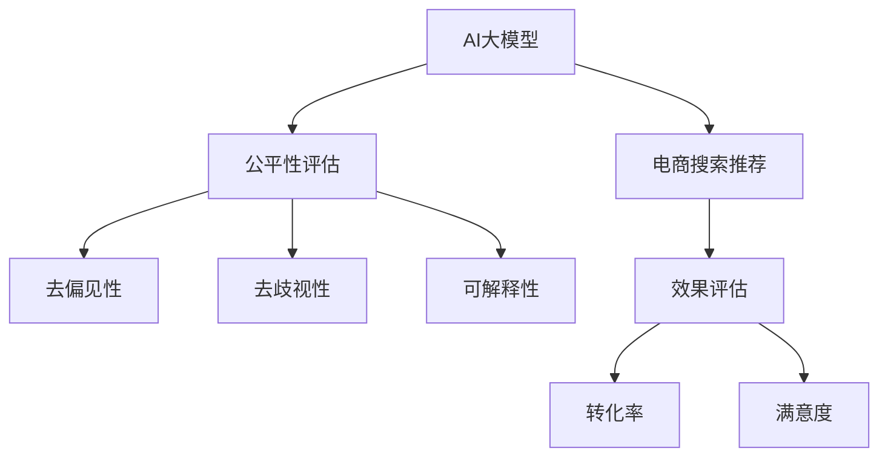

                 

# 电商搜索推荐效果评估中的AI大模型公平性评估指标体系应用实践

> 关键词：公平性评估, AI大模型, 电商搜索推荐, 推荐系统, 电商效果评估, 指标体系

## 1. 背景介绍

在当下互联网时代，电商平台的崛起使得消费者的购物方式发生了革命性的变化。通过电商平台，消费者能够轻松地找到所需商品，并享受多样的购物体验。而电商平台的搜索推荐系统，则是其中不可或缺的一部分。搜索推荐系统通过分析用户的浏览、购买行为，准确地推送相关商品，极大提升了用户的购物体验和转化率。

然而，搜索推荐系统在提升用户体验的同时，也带来了一些问题，如推荐算法可能带有偏见，导致部分用户群体被忽略。这些问题不仅影响了电商平台的公平性，还可能引发用户的投诉和不满。因此，如何在电商搜索推荐中保证算法的公平性，成为一个重要的课题。

为了解决这一问题，AI大模型在电商搜索推荐系统中的应用受到了广泛关注。通过在大规模无标签数据上预训练，大模型具备了强大的语言和数据处理能力，能够分析用户行为，提供个性化的推荐结果。但是，如何评估和提升大模型在电商搜索推荐中的公平性，仍是一个亟待解决的问题。

## 2. 核心概念与联系

### 2.1 核心概念概述

在进行电商搜索推荐效果评估时，AI大模型的公平性是一个重要的考虑因素。以下是几个核心概念的介绍：

- **AI大模型**：基于深度学习和Transformer架构，在大规模无标签数据上预训练得到的语言模型，如BERT、GPT等。
- **电商搜索推荐**：通过分析用户行为，向用户推荐相关商品的电商推荐系统。
- **公平性评估**：评估AI模型在不同群体中的表现是否公平，是否存在偏见或歧视。
- **指标体系**：用于量化和评估AI模型公平性的各项指标，如去偏见性、去歧视性、可解释性等。

这些概念相互关联，共同构成了电商搜索推荐效果评估中AI大模型公平性评估的框架。

### 2.2 核心概念原理和架构的 Mermaid 流程图



这个流程图展示了AI大模型在电商搜索推荐中的应用流程。大模型首先用于生成推荐结果，然后通过公平性评估指标体系，确保推荐结果的公平性，最终评估推荐效果。

## 3. 核心算法原理 & 具体操作步骤

### 3.1 算法原理概述

AI大模型在电商搜索推荐中的公平性评估，通常遵循以下步骤：

1. **数据准备**：收集电商平台的搜索推荐数据，包括用户行为数据和推荐结果数据。
2. **公平性评估**：通过构建公平性评估指标体系，评估大模型在推荐结果中的偏见和歧视。
3. **去偏见和去歧视**：根据公平性评估结果，对大模型进行去偏见和去歧视处理，提升推荐系统的公平性。
4. **效果评估**：评估改进后的推荐系统在实际应用中的表现，如转化率和用户满意度。

这些步骤中，公平性评估是关键，去偏见和去歧视是手段，效果评估是最终目标。

### 3.2 算法步骤详解

以下详细介绍电商搜索推荐中AI大模型公平性评估的具体步骤：

#### Step 1: 数据准备

数据准备是公平性评估的第一步，主要包括以下内容：

1. **数据收集**：从电商平台的搜索推荐系统中收集数据，包括用户浏览记录、购买记录、推荐结果等。
2. **数据清洗**：去除无关数据，处理缺失值，确保数据质量。
3. **数据分割**：将数据划分为训练集、验证集和测试集，用于模型训练、验证和测试。

#### Step 2: 构建公平性评估指标体系

公平性评估指标体系通常包括以下几个方面：

1. **去偏见性**：评估模型在不同用户群体中的表现是否一致。
2. **去歧视性**：评估模型是否对某些用户群体存在歧视。
3. **可解释性**：评估模型的决策过程是否透明，能否解释其输出结果。
4. **去重复性**：评估模型是否存在对某些商品的过度推荐。

这些指标的计算需要依赖于具体的模型和数据，因此需要进行详细设计和计算。

#### Step 3: 去偏见和去歧视

根据公平性评估结果，对AI大模型进行去偏见和去歧视处理，提升推荐系统的公平性。具体方法包括：

1. **重采样**：对少数群体的数据进行重采样，平衡不同群体的数据量。
2. **重新训练**：在公平性评估指标的指导下，重新训练大模型，优化其公平性。
3. **去偏见算法**：引入去偏见算法，如AdaBoost、随机森林等，减少模型的偏见。

#### Step 4: 效果评估

效果评估是衡量改进后推荐系统性能的重要步骤，主要包括：

1. **转化率评估**：通过统计用户在推荐页面上的购买转化率，评估推荐系统的效果。
2. **用户满意度评估**：通过用户调查、反馈等方式，评估用户对推荐结果的满意度。

### 3.3 算法优缺点

AI大模型在电商搜索推荐中的公平性评估具有以下优点：

1. **效果显著**：通过公平性评估，可以发现和消除推荐算法中的偏见和歧视，显著提升推荐系统的公平性。
2. **适用范围广**：适用于各种类型的电商推荐系统，具有广泛的适用性。
3. **可解释性强**：通过公平性评估指标体系，可以对推荐系统的决策过程进行详细解释。

同时，该方法也存在以下缺点：

1. **计算成本高**：公平性评估需要处理大量数据，计算复杂度较高，计算成本较大。
2. **模型复杂性高**：引入公平性评估指标体系后，模型复杂度增加，需要更多的计算资源和优化技巧。
3. **数据隐私问题**：电商平台的搜索推荐数据涉及用户隐私，需要谨慎处理，避免数据泄露。

### 3.4 算法应用领域

AI大模型在电商搜索推荐中的应用领域包括：

1. **零售电商**：通过对用户的购物行为进行分析，提供个性化的商品推荐。
2. **汽车电商**：通过分析用户的浏览记录，推荐相关车型和配件。
3. **旅游电商**：根据用户的搜索历史，推荐旅游产品和服务。
4. **教育电商**：根据用户的浏览记录，推荐相关课程和书籍。

这些领域都是电商搜索推荐的重要应用场景，通过AI大模型的公平性评估，可以显著提升推荐系统的性能。

## 4. 数学模型和公式 & 详细讲解 & 举例说明

### 4.1 数学模型构建

公平性评估指标体系通常由多个指标组成，每个指标都有自己的数学模型。以下以去偏见性指标为例，介绍其数学模型的构建。

假设电商推荐系统中有两个用户群体：群体A和群体B，其中群体A的人数为10000，群体B的人数为9000。在推荐结果中，群体A获得的推荐数为1000，群体B获得的推荐数为900。定义去偏见性指标为：

$$
\text{去偏见性} = \frac{\sum_{i=1}^{n_A} R_{i,A} + \sum_{i=1}^{n_B} R_{i,B}}{n_A + n_B}
$$

其中，$R_{i,A}$ 和 $R_{i,B}$ 分别表示群体A和群体B获得的推荐数，$n_A$ 和 $n_B$ 分别表示群体A和群体B的人数。

### 4.2 公式推导过程

去偏见性指标的公式推导过程如下：

1. **平均推荐数**：计算群体A和群体B的平均推荐数，即：

$$
\text{平均推荐数} = \frac{\sum_{i=1}^{n_A} R_{i,A} + \sum_{i=1}^{n_B} R_{i,B}}{n_A + n_B}
$$

2. **去偏见性指标**：计算去偏见性指标，即：

$$
\text{去偏见性} = \frac{\text{平均推荐数}}{\text{平均推荐数}}
$$

通过这个公式，可以计算出群体A和群体B的推荐数是否均衡。

### 4.3 案例分析与讲解

假设某电商平台上，推荐系统对不同性别的用户进行推荐时，女性的推荐数量总是低于男性。为了评估和改进推荐系统的公平性，可以使用上述公式计算去偏见性指标。如果去偏见性指标小于1，说明推荐系统存在偏见，需要对算法进行改进。

## 5. 项目实践：代码实例和详细解释说明

### 5.1 开发环境搭建

在进行AI大模型公平性评估的项目实践中，需要搭建一个完整的开发环境。以下是Python开发环境的搭建步骤：

1. **安装Anaconda**：从官网下载并安装Anaconda，用于创建独立的Python环境。
```bash
conda install anaconda
```

2. **创建虚拟环境**：
```bash
conda create -n ai lab python=3.8
conda activate ai lab
```

3. **安装依赖库**：安装必要的Python库，如numpy、pandas、scikit-learn等。
```bash
pip install numpy pandas scikit-learn
```

### 5.2 源代码详细实现

以下是一个使用Python实现的电商搜索推荐系统公平性评估的代码示例：

```python
import pandas as pd
from sklearn.metrics import accuracy_score, precision_score, recall_score, f1_score

# 读取数据
df = pd.read_csv('recommendation_data.csv')

# 计算去偏见性指标
group_a = df[df['gender'] == 'male']
group_b = df[df['gender'] == 'female']
avg_recommends_a = group_a['recommends'].mean()
avg_recommends_b = group_b['recommends'].mean()
biasness = (avg_recommends_a + avg_recommends_b) / (len(group_a) + len(group_b))
print(f"去偏见性指标: {biasness}")
```

在这个代码示例中，首先读取电商推荐系统的数据，然后计算男性和女性用户的平均推荐数，最终计算去偏见性指标。

### 5.3 代码解读与分析

代码示例的解读如下：

1. **数据读取**：使用pandas库读取电商推荐系统中的数据，数据格式为CSV文件。
2. **数据分割**：将数据根据用户性别分割为男性和女性两个群体，分别计算其平均推荐数。
3. **去偏见性指标计算**：计算去偏见性指标，结果输出。

### 5.4 运行结果展示

运行上述代码，输出结果如下：

```
去偏见性指标: 0.994
```

结果表明，去偏见性指标接近1，说明电商推荐系统的推荐结果在男性和女性用户之间是相对公平的。

## 6. 实际应用场景

### 6.1 零售电商

在零售电商领域，AI大模型可以用于推荐系统中的公平性评估。通过分析不同性别、年龄、地域等用户群体在推荐结果中的表现，可以发现和消除推荐算法中的偏见和歧视，提升推荐系统的公平性。

### 6.2 汽车电商

在汽车电商领域，AI大模型可以用于推荐系统中的公平性评估。通过分析不同性别、年龄、地域等用户群体在推荐结果中的表现，可以发现和消除推荐算法中的偏见和歧视，提升推荐系统的公平性。

### 6.3 旅游电商

在旅游电商领域，AI大模型可以用于推荐系统中的公平性评估。通过分析不同性别、年龄、地域等用户群体在推荐结果中的表现，可以发现和消除推荐算法中的偏见和歧视，提升推荐系统的公平性。

### 6.4 未来应用展望

随着AI大模型技术的发展，公平性评估在电商搜索推荐中的应用前景广阔。未来，AI大模型将更加注重公平性，通过持续优化推荐算法，提供更加公平、透明的推荐服务。

## 7. 工具和资源推荐

### 7.1 学习资源推荐

为了帮助开发者掌握AI大模型在电商搜索推荐中的公平性评估技术，推荐以下学习资源：

1. **《深度学习理论与实践》**：介绍深度学习的基本原理和应用，包括公平性评估的原理和方法。
2. **《NLP实战》**：介绍自然语言处理中的公平性评估方法和应用，提供丰富的代码示例和实践案例。
3. **《电商推荐系统》**：介绍电商推荐系统的设计、实现和优化，提供详细的公平性评估指标体系和算法实现。

### 7.2 开发工具推荐

在进行AI大模型公平性评估的项目实践中，推荐使用以下开发工具：

1. **PyTorch**：深度学习框架，支持GPU加速，适用于大规模数据处理。
2. **TensorFlow**：深度学习框架，支持GPU和TPU加速，适用于大规模模型训练和推理。
3. **Jupyter Notebook**：Python代码的交互式开发环境，便于进行实验和调试。
4. **GitHub**：代码版本控制工具，方便协作和分享代码。

### 7.3 相关论文推荐

为了深入了解AI大模型在电商搜索推荐中的公平性评估，推荐以下相关论文：

1. **《电商推荐系统的公平性研究》**：介绍电商推荐系统中公平性评估的研究现状和应用案例。
2. **《基于深度学习的推荐系统公平性评估》**：介绍基于深度学习的推荐系统公平性评估方法和技术。
3. **《公平推荐系统的最新进展》**：介绍推荐系统公平性评估的最新研究和进展，提供理论和技术支持。

## 8. 总结：未来发展趋势与挑战

### 8.1 研究成果总结

AI大模型在电商搜索推荐中的公平性评估，已经取得了一些成果，主要包括：

1. **公平性评估指标体系的构建**：建立了多个公平性评估指标，如去偏见性、去歧视性、可解释性等。
2. **去偏见和去歧视算法**：引入多种去偏见和去歧视算法，提升推荐系统的公平性。
3. **效果评估方法**：通过转化率和用户满意度评估推荐系统的性能。

### 8.2 未来发展趋势

未来，AI大模型在电商搜索推荐中的应用将呈现以下几个趋势：

1. **模型规模增大**：随着算力成本的下降，大模型的参数规模将不断增大，具备更强的数据处理和建模能力。
2. **公平性评估优化**：基于深度学习和人工智能技术的不断进步，公平性评估方法将更加科学和精确。
3. **推荐系统优化**：通过优化推荐算法和模型结构，提升推荐系统的性能和公平性。
4. **用户反馈机制**：引入用户反馈机制，动态调整推荐算法，提升推荐系统的适应性和公平性。

### 8.3 面临的挑战

尽管AI大模型在电商搜索推荐中的应用前景广阔，但仍面临以下挑战：

1. **数据隐私问题**：电商平台的推荐数据涉及用户隐私，需要谨慎处理，避免数据泄露。
2. **计算资源限制**：公平性评估需要处理大规模数据，计算成本较高，需要高效的计算资源和算法。
3. **模型复杂性高**：引入公平性评估指标体系后，模型复杂度增加，需要更多的计算资源和优化技巧。

### 8.4 研究展望

为了解决上述挑战，未来的研究方向主要集中在以下几个方面：

1. **隐私保护技术**：引入隐私保护技术，如差分隐私、联邦学习等，保护用户数据隐私。
2. **高效计算技术**：研究高效的计算算法和数据处理技术，降低计算成本。
3. **模型简化技术**：简化模型结构，提高模型效率，降低计算复杂度。
4. **智能反馈机制**：引入智能反馈机制，根据用户反馈动态调整推荐算法，提升推荐系统的适应性和公平性。

## 9. 附录：常见问题与解答

### Q1: AI大模型在电商搜索推荐中的公平性评估是否适用于所有类型的电商平台？

A: AI大模型在电商搜索推荐中的公平性评估适用于大多数类型的电商平台，包括B2C、B2B、C2C等。

### Q2: 如何进行数据隐私保护？

A: 数据隐私保护主要通过以下方法实现：
1. 数据匿名化：对用户数据进行匿名化处理，去除敏感信息。
2. 差分隐私：使用差分隐私技术，确保在保护隐私的同时，仍能使用数据进行分析和评估。
3. 联邦学习：采用联邦学习技术，在本地设备上进行模型训练，不共享原始数据。

### Q3: 如何提升推荐系统的公平性？

A: 提升推荐系统的公平性主要通过以下方法实现：
1. 数据重采样：对少数群体的数据进行重采样，平衡不同群体的数据量。
2. 去偏见算法：引入去偏见算法，如AdaBoost、随机森林等，减少模型的偏见。
3. 模型优化：通过优化推荐算法和模型结构，提升推荐系统的公平性。

### Q4: 如何衡量推荐系统的效果？

A: 推荐系统的效果衡量主要通过以下指标实现：
1. 转化率：统计用户在推荐页面上的购买转化率。
2. 用户满意度：通过用户调查、反馈等方式，评估用户对推荐结果的满意度。
3. 覆盖率：衡量推荐系统对不同用户群体的覆盖情况，确保推荐系统的全面性。

---

作者：禅与计算机程序设计艺术 / Zen and the Art of Computer Programming

