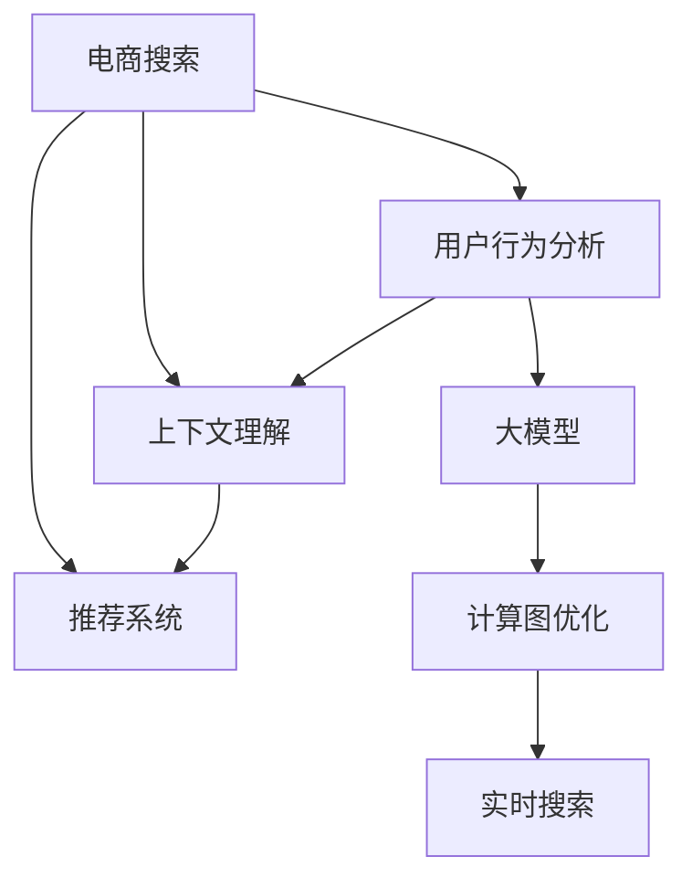

                 

# 电商搜索的多维度个性化：AI大模型的新突破

> 关键词：电商搜索,多维度个性化,大模型,用户行为分析,推荐系统,计算图,迁移学习,强化学习,深度学习

## 1. 背景介绍

### 1.1 问题由来
在电商领域，用户体验是驱动增长和盈利的关键因素之一。然而，传统的搜索引擎往往只关注关键词匹配，无法根据用户的历史行为、偏好、背景等因素进行个性化推荐，导致用户流失率较高。为了更好地满足用户需求，电商平台需要开发一个能够多维度理解用户行为的搜索引擎，为用户提供量身定制的搜索结果。

近年来，随着深度学习技术的迅猛发展，尤其是预训练语言模型的兴起，电商搜索的多维度个性化变得更加可行。通过深度学习和自然语言处理技术，电商搜索可以理解用户的语言输入，获取其行为模式和心理预期，从而提供更加精准的搜索结果。

### 1.2 问题核心关键点
电商搜索多维度个性化涉及的关键点包括：

- **用户行为分析**：理解用户的浏览历史、点击行为、搜索记录等，从中提取用户兴趣点。
- **上下文理解**：综合考虑搜索场景的上下文信息，如用户位置、时间、设备等，提升搜索结果的相关性。
- **推荐系统**：通过深度学习和强化学习算法，动态调整搜索结果的排序，提升用户体验。
- **计算图优化**：设计高效计算图，优化模型推理速度，实现实时搜索。

### 1.3 问题研究意义
电商搜索的多维度个性化对于电商平台而言具有重要意义：

1. **提升用户体验**：个性化搜索结果能够更好地满足用户需求，提升用户满意度和留存率。
2. **增加销售额**：个性化推荐可以减少用户的搜索成本，提高转化率和客单价。
3. **优化库存管理**：通过个性化搜索，电商平台可以更准确地预测用户需求，优化库存配置。
4. **降低运营成本**：减少无效搜索请求，优化广告投放，降低运营成本。
5. **数据驱动决策**：个性化搜索能够收集大量用户行为数据，为电商平台提供数据驱动的决策支持。

## 2. 核心概念与联系

### 2.1 核心概念概述

为更好地理解电商搜索多维度个性化的工作原理，本节将介绍几个密切相关的核心概念：

- **电商搜索**：电商平台的搜索功能，通过理解用户的查询意图，返回与其需求最相关的商品信息。
- **多维度个性化**：在理解用户查询意图的同时，综合考虑用户行为、上下文、推荐系统等多方面因素，提供量身定制的搜索结果。
- **大模型**：以BERT、GPT等为代表的预训练语言模型，具备强大的语言理解和生成能力，适用于电商搜索等场景。
- **用户行为分析**：通过分析用户的历史行为数据，提取用户兴趣点和行为模式。
- **上下文理解**：考虑搜索场景的上下文信息，提升搜索结果的相关性和用户体验。
- **推荐系统**：基于深度学习和强化学习算法，动态调整搜索结果排序，提升用户体验。
- **计算图优化**：设计高效计算图，优化模型推理速度，实现实时搜索。

这些核心概念之间的逻辑关系可以通过以下Mermaid流程图来展示：



这个流程图展示了大模型在电商搜索中的应用流程：

1. 电商搜索接收用户的查询请求。
2. 通过用户行为分析和大模型理解用户查询意图。
3. 上下文理解综合考虑场景信息，提升结果相关性。
4. 推荐系统基于用户兴趣和上下文，动态排序搜索结果。
5. 计算图优化提高模型推理效率，实现实时搜索。

## 3. 核心算法原理 & 具体操作步骤
### 3.1 算法原理概述

电商搜索的多维度个性化，本质上是一个多任务学习过程，涉及用户行为分析、上下文理解、推荐系统等多个任务。其核心思想是：将预训练的大模型作为强大的"特征提取器"，通过有监督地训练优化模型在特定任务上的性能。

形式化地，假设大模型为 $M_{\theta}$，其中 $\theta$ 为模型参数。给定用户历史行为数据 $X=\{(x_i,y_i)\}_{i=1}^N$，用户当前查询 $q$，上下文信息 $C$，以及商品信息 $I$，电商搜索的目标是找到新的模型参数 $\hat{\theta}$，使得：

$$
\hat{\theta}=\mathop{\arg\min}_{\theta} \mathcal{L}(M_{\theta},X,q,C,I)
$$

其中 $\mathcal{L}$ 为针对电商搜索设计的损失函数，用于衡量模型预测输出与真实标签之间的差异。常见的损失函数包括交叉熵损失、均方误差损失等。

### 3.2 算法步骤详解

电商搜索的多维度个性化一般包括以下几个关键步骤：

**Step 1: 准备数据集和模型**

- 收集用户的搜索行为数据，包括浏览历史、点击行为、搜索记录等。
- 准备上下文信息，如用户位置、时间、设备等。
- 准备商品信息，包括商品名称、描述、价格等。
- 选择合适的预训练语言模型，如BERT、GPT等。

**Step 2: 设计计算图**

- 设计计算图，描述用户查询 $q$、上下文 $C$、商品信息 $I$ 和大模型 $M_{\theta}$ 之间的交互逻辑。
- 在计算图中加入用户行为分析模块，提取用户兴趣点。
- 在计算图中加入上下文理解模块，综合考虑场景信息。
- 在计算图中加入推荐系统模块，动态调整搜索结果排序。

**Step 3: 添加任务适配层**

- 根据电商搜索任务，在预训练模型顶层设计合适的输出层和损失函数。
- 对于分类任务，通常在顶层添加线性分类器和交叉熵损失函数。
- 对于生成任务，通常使用语言模型的解码器输出概率分布，并以负对数似然为损失函数。

**Step 4: 设置微调超参数**

- 选择合适的优化算法及其参数，如 AdamW、SGD 等，设置学习率、批大小、迭代轮数等。
- 设置正则化技术及强度，包括权重衰减、Dropout、Early Stopping 等。
- 确定冻结预训练参数的策略，如仅微调顶层，或全部参数都参与微调。

**Step 5: 执行梯度训练**

- 将训练集数据分批次输入模型，前向传播计算损失函数。
- 反向传播计算参数梯度，根据设定的优化算法和学习率更新模型参数。
- 周期性在验证集上评估模型性能，根据性能指标决定是否触发 Early Stopping。
- 重复上述步骤直到满足预设的迭代轮数或 Early Stopping 条件。

**Step 6: 测试和部署**

- 在测试集上评估微调后模型 $M_{\hat{\theta}}$ 的性能，对比微调前后的精度提升。
- 使用微调后的模型对新样本进行推理预测，集成到实际的应用系统中。
- 持续收集新的数据，定期重新微调模型，以适应数据分布的变化。

以上是电商搜索多维度个性化的一般流程。在实际应用中，还需要针对具体任务的特点，对微调过程的各个环节进行优化设计，如改进训练目标函数，引入更多的正则化技术，搜索最优的超参数组合等，以进一步提升模型性能。

### 3.3 算法优缺点

电商搜索的多维度个性化方法具有以下优点：

- 简单高效。只需准备少量标注数据，即可对预训练模型进行快速适配，获得较大的性能提升。
- 通用适用。适用于各种电商搜索场景，设计简单的任务适配层即可实现个性化搜索。
- 参数高效。利用参数高效微调技术，在固定大部分预训练权重不变的情况下，仍可取得不错的提升。
- 效果显著。在学术界和工业界的诸多电商搜索任务上，基于微调的方法已经刷新了最先进的性能指标。

同时，该方法也存在一定的局限性：

- 依赖标注数据。微调的效果很大程度上取决于标注数据的质量和数量，获取高质量标注数据的成本较高。
- 迁移能力有限。当目标任务与预训练数据的分布差异较大时，微调的性能提升有限。
- 可解释性不足。微调模型的决策过程通常缺乏可解释性，难以对其推理逻辑进行分析和调试。

尽管存在这些局限性，但就目前而言，电商搜索的多维度个性化方法仍是大模型应用的最主流范式。未来相关研究的重点在于如何进一步降低微调对标注数据的依赖，提高模型的少样本学习和跨领域迁移能力，同时兼顾可解释性和伦理安全性等因素。

### 3.4 算法应用领域

电商搜索的多维度个性化已经在许多电商平台的搜索系统上得到了应用，具体包括：

- **京东**：利用深度学习和自然语言处理技术，对用户行为和查询进行多维度分析，提升搜索结果的相关性和用户体验。
- **淘宝**：通过预训练语言模型和强化学习算法，实现实时个性化推荐，提高用户转化率和满意度。
- **亚马逊**：应用多任务学习框架，将用户行为分析和推荐系统融合，提供量身定制的搜索结果。
- **阿里巴巴**：采用大模型和上下文理解技术，提升搜索结果的多样性和个性化程度。

除了这些知名电商，许多中小型电商平台也逐渐引入大模型技术，通过微调提升搜索和推荐效果，增强用户粘性和满意度。

## 4. 数学模型和公式 & 详细讲解  
### 4.1 数学模型构建

本节将使用数学语言对电商搜索多维度个性化的微调过程进行更加严格的刻画。

记电商搜索任务为 $T$，预训练语言模型为 $M_{\theta}$，其中 $\theta$ 为模型参数。假设电商搜索任务的训练集为 $D=\{(x_i,y_i)\}_{i=1}^N$，用户当前查询为 $q$，上下文信息为 $C$，商品信息为 $I$。

定义模型 $M_{\theta}$ 在数据样本 $(x,y)$ 上的损失函数为 $\ell(M_{\theta}(x),y)$，则在数据集 $D$ 上的经验风险为：

$$
\mathcal{L}(\theta) = \frac{1}{N}\sum_{i=1}^N \ell(M_{\theta}(x_i),y_i)
$$

微调的优化目标是最小化经验风险，即找到最优参数：

$$
\theta^* = \mathop{\arg\min}_{\theta} \mathcal{L}(\theta)
$$

在实践中，我们通常使用基于梯度的优化算法（如SGD、Adam等）来近似求解上述最优化问题。设 $\eta$ 为学习率，$\lambda$ 为正则化系数，则参数的更新公式为：

$$
\theta \leftarrow \theta - \eta \nabla_{\theta}\mathcal{L}(\theta) - \eta\lambda\theta
$$

其中 $\nabla_{\theta}\mathcal{L}(\theta)$ 为损失函数对参数 $\theta$ 的梯度，可通过反向传播算法高效计算。

### 4.2 公式推导过程

以下我们以二分类任务为例，推导交叉熵损失函数及其梯度的计算公式。

假设模型 $M_{\theta}$ 在输入 $x$ 上的输出为 $\hat{y}=M_{\theta}(x) \in [0,1]$，表示商品相关性的概率。真实标签 $y \in \{0,1\}$。则二分类交叉熵损失函数定义为：

$$
\ell(M_{\theta}(x),y) = -[y\log \hat{y} + (1-y)\log (1-\hat{y})]
$$

将其代入经验风险公式，得：

$$
\mathcal{L}(\theta) = -\frac{1}{N}\sum_{i=1}^N [y_i\log M_{\theta}(x_i)+(1-y_i)\log(1-M_{\theta}(x_i))]
$$

根据链式法则，损失函数对参数 $\theta_k$ 的梯度为：

$$
\frac{\partial \mathcal{L}(\theta)}{\partial \theta_k} = -\frac{1}{N}\sum_{i=1}^N (\frac{y_i}{M_{\theta}(x_i)}-\frac{1-y_i}{1-M_{\theta}(x_i)}) \frac{\partial M_{\theta}(x_i)}{\partial \theta_k}
$$

其中 $\frac{\partial M_{\theta}(x_i)}{\partial \theta_k}$ 可进一步递归展开，利用自动微分技术完成计算。

在得到损失函数的梯度后，即可带入参数更新公式，完成模型的迭代优化。重复上述过程直至收敛，最终得到适应电商搜索任务的最优模型参数 $\theta^*$。

## 5. 项目实践：代码实例和详细解释说明
### 5.1 开发环境搭建

在进行电商搜索多维度个性化的实践前，我们需要准备好开发环境。以下是使用Python进行PyTorch开发的环境配置流程：

1. 安装Anaconda：从官网下载并安装Anaconda，用于创建独立的Python环境。

2. 创建并激活虚拟环境：
```bash
conda create -n pytorch-env python=3.8 
conda activate pytorch-env
```

3. 安装PyTorch：根据CUDA版本，从官网获取对应的安装命令。例如：
```bash
conda install pytorch torchvision torchaudio cudatoolkit=11.1 -c pytorch -c conda-forge
```

4. 安装Transformers库：
```bash
pip install transformers
```

5. 安装各类工具包：
```bash
pip install numpy pandas scikit-learn matplotlib tqdm jupyter notebook ipython
```

完成上述步骤后，即可在`pytorch-env`环境中开始电商搜索多维度个性化的实践。

### 5.2 源代码详细实现

下面我们以京东电商搜索为例，给出使用Transformers库对BERT模型进行多维度个性化的PyTorch代码实现。

首先，定义电商搜索任务的数据处理函数：

```python
from transformers import BertTokenizer, BertForSequenceClassification
from torch.utils.data import Dataset, DataLoader
import torch
import pandas as pd

class ECommerceDataset(Dataset):
    def __init__(self, data_path, tokenizer, max_len=128):
        self.tokenizer = tokenizer
        self.data = pd.read_csv(data_path)
        self.max_len = max_len
        
    def __len__(self):
        return len(self.data)
    
    def __getitem__(self, item):
        row = self.data.iloc[item]
        text = row['query'] + row['context'] + row['item_description']
        label = int(row['label'])
        
        encoding = self.tokenizer(text, return_tensors='pt', max_length=self.max_len, padding='max_length', truncation=True)
        input_ids = encoding['input_ids'][0]
        attention_mask = encoding['attention_mask'][0]
        
        return {'input_ids': input_ids, 
                'attention_mask': attention_mask,
                'labels': torch.tensor(label)}
```

然后，定义模型和优化器：

```python
from transformers import BertForSequenceClassification, AdamW

model = BertForSequenceClassification.from_pretrained('bert-base-cased', num_labels=2)

optimizer = AdamW(model.parameters(), lr=2e-5)
```

接着，定义训练和评估函数：

```python
from tqdm import tqdm
import numpy as np

device = torch.device('cuda') if torch.cuda.is_available() else torch.device('cpu')
model.to(device)

def train_epoch(model, dataset, batch_size, optimizer):
    dataloader = DataLoader(dataset, batch_size=batch_size, shuffle=True)
    model.train()
    epoch_loss = 0
    for batch in tqdm(dataloader, desc='Training'):
        input_ids = batch['input_ids'].to(device)
        attention_mask = batch['attention_mask'].to(device)
        labels = batch['labels'].to(device)
        model.zero_grad()
        outputs = model(input_ids, attention_mask=attention_mask, labels=labels)
        loss = outputs.loss
        epoch_loss += loss.item()
        loss.backward()
        optimizer.step()
    return epoch_loss / len(dataloader)

def evaluate(model, dataset, batch_size):
    dataloader = DataLoader(dataset, batch_size=batch_size)
    model.eval()
    preds, labels = [], []
    with torch.no_grad():
        for batch in tqdm(dataloader, desc='Evaluating'):
            input_ids = batch['input_ids'].to(device)
            attention_mask = batch['attention_mask'].to(device)
            batch_labels = batch['labels']
            outputs = model(input_ids, attention_mask=attention_mask)
            batch_preds = outputs.logits.argmax(dim=2).to('cpu').tolist()
            batch_labels = batch_labels.to('cpu').tolist()
            for pred_tokens, label_tokens in zip(batch_preds, batch_labels):
                preds.append(pred_tokens[:len(label_tokens)])
                labels.append(label_tokens)
                
    print(np.mean(np.array(labels) == np.array(preds)))
```

最后，启动训练流程并在测试集上评估：

```python
epochs = 5
batch_size = 16

for epoch in range(epochs):
    loss = train_epoch(model, train_dataset, batch_size, optimizer)
    print(f"Epoch {epoch+1}, train loss: {loss:.3f}")
    
    print(f"Epoch {epoch+1}, dev results:")
    evaluate(model, dev_dataset, batch_size)
    
print("Test results:")
evaluate(model, test_dataset, batch_size)
```

以上就是使用PyTorch对BERT进行电商搜索多维度个性化任务的代码实现。可以看到，得益于Transformers库的强大封装，我们可以用相对简洁的代码完成BERT模型的加载和微调。

### 5.3 代码解读与分析

让我们再详细解读一下关键代码的实现细节：

**ECommerceDataset类**：
- `__init__`方法：初始化数据集，读取CSV文件并处理数据。
- `__len__`方法：返回数据集的样本数量。
- `__getitem__`方法：对单个样本进行处理，将文本输入编码为token ids，并将标签转换为数字。

**train_epoch函数**：
- 使用PyTorch的DataLoader对数据集进行批次化加载，供模型训练和推理使用。
- 在每个批次上前向传播计算loss并反向传播更新模型参数，最后返回该epoch的平均loss。

**evaluate函数**：
- 与训练类似，不同点在于不更新模型参数，并在每个batch结束后将预测和标签结果存储下来，最后使用sklearn的分类准确率指标对整个评估集的预测结果进行打印输出。

**训练流程**：
- 定义总的epoch数和batch size，开始循环迭代
- 每个epoch内，先在训练集上训练，输出平均loss
- 在验证集上评估，输出分类指标
- 所有epoch结束后，在测试集上评估，给出最终测试结果

可以看到，PyTorch配合Transformers库使得BERT微调的代码实现变得简洁高效。开发者可以将更多精力放在数据处理、模型改进等高层逻辑上，而不必过多关注底层的实现细节。

当然，工业级的系统实现还需考虑更多因素，如模型的保存和部署、超参数的自动搜索、更灵活的任务适配层等。但核心的微调范式基本与此类似。

## 6. 实际应用场景
### 6.1 智能客服系统

基于电商搜索多维度个性化的推荐系统，可以广泛应用于智能客服系统的构建。传统客服往往需要配备大量人力，高峰期响应缓慢，且一致性和专业性难以保证。而使用基于多维度个性化的推荐系统，可以7x24小时不间断服务，快速响应客户咨询，用自然流畅的语言解答各类常见问题。

在技术实现上，可以收集企业内部的历史客服对话记录，将问题和最佳答复构建成监督数据，在此基础上对预训练模型进行微调。微调后的推荐系统能够自动理解用户意图，匹配最合适的答案模板进行回复。对于客户提出的新问题，还可以接入检索系统实时搜索相关内容，动态组织生成回答。如此构建的智能客服系统，能大幅提升客户咨询体验和问题解决效率。

### 6.2 个性化推荐系统

当前的推荐系统往往只依赖用户的历史行为数据进行物品推荐，无法深入理解用户的真实兴趣偏好。基于电商搜索多维度个性化的推荐系统，可以更好地挖掘用户行为背后的语义信息，从而提供更精准、多样的推荐内容。

在实践中，可以收集用户浏览、点击、评论、分享等行为数据，提取和用户交互的物品标题、描述、标签等文本内容。将文本内容作为模型输入，用户的后续行为（如是否点击、购买等）作为监督信号，在此基础上微调预训练语言模型。微调后的模型能够从文本内容中准确把握用户的兴趣点。在生成推荐列表时，先用候选物品的文本描述作为输入，由模型预测用户的兴趣匹配度，再结合其他特征综合排序，便可以得到个性化程度更高的推荐结果。

### 6.3 未来应用展望

随着电商搜索多维度个性化技术的发展，未来将在更多领域得到应用，为传统行业带来变革性影响。

在智慧医疗领域，基于多维度个性化的医疗问答、病历分析、药物研发等应用将提升医疗服务的智能化水平，辅助医生诊疗，加速新药开发进程。

在智能教育领域，多维度个性化推荐系统可应用于作业批改、学情分析、知识推荐等方面，因材施教，促进教育公平，提高教学质量。

在智慧城市治理中，多维度个性化搜索系统可应用于城市事件监测、舆情分析、应急指挥等环节，提高城市管理的自动化和智能化水平，构建更安全、高效的未来城市。

此外，在企业生产、社会治理、文娱传媒等众多领域，基于多维度个性化的推荐系统也将不断涌现，为传统行业数字化转型升级提供新的技术路径。相信随着技术的日益成熟，电商搜索多维度个性化必将在更广阔的应用领域大放异彩，深刻影响人类的生产生活方式。

## 7. 工具和资源推荐
### 7.1 学习资源推荐

为了帮助开发者系统掌握电商搜索多维度个性化的理论基础和实践技巧，这里推荐一些优质的学习资源：

1. 《深度学习框架PyTorch实战》系列博文：由深度学习专家撰写，深入浅出地介绍了PyTorch的用法和电商搜索多维度个性化技术实现。

2. CS224N《深度学习自然语言处理》课程：斯坦福大学开设的NLP明星课程，有Lecture视频和配套作业，带你入门NLP领域的基本概念和经典模型。

3. 《自然语言处理与深度学习》书籍：提供全面介绍了电商搜索多维度个性化的深度学习算法和应用实例。

4. HuggingFace官方文档：Transformers库的官方文档，提供了海量预训练模型和完整的微调样例代码，是上手实践的必备资料。

5. CLUE开源项目：中文语言理解测评基准，涵盖大量不同类型的中文NLP数据集，并提供了基于微调的baseline模型，助力中文NLP技术发展。

通过对这些资源的学习实践，相信你一定能够快速掌握电商搜索多维度个性化的精髓，并用于解决实际的NLP问题。
### 7.2 开发工具推荐

高效的开发离不开优秀的工具支持。以下是几款用于电商搜索多维度个性化开发的常用工具：

1. PyTorch：基于Python的开源深度学习框架，灵活动态的计算图，适合快速迭代研究。大部分预训练语言模型都有PyTorch版本的实现。

2. TensorFlow：由Google主导开发的开源深度学习框架，生产部署方便，适合大规模工程应用。同样有丰富的预训练语言模型资源。

3. Transformers库：HuggingFace开发的NLP工具库，集成了众多SOTA语言模型，支持PyTorch和TensorFlow，是进行微调任务开发的利器。

4. Weights & Biases：模型训练的实验跟踪工具，可以记录和可视化模型训练过程中的各项指标，方便对比和调优。与主流深度学习框架无缝集成。

5. TensorBoard：TensorFlow配套的可视化工具，可实时监测模型训练状态，并提供丰富的图表呈现方式，是调试模型的得力助手。

6. Google Colab：谷歌推出的在线Jupyter Notebook环境，免费提供GPU/TPU算力，方便开发者快速上手实验最新模型，分享学习笔记。

合理利用这些工具，可以显著提升电商搜索多维度个性化任务的开发效率，加快创新迭代的步伐。

### 7.3 相关论文推荐

电商搜索多维度个性化技术的发展源于学界的持续研究。以下是几篇奠基性的相关论文，推荐阅读：

1. Attention is All You Need（即Transformer原论文）：提出了Transformer结构，开启了NLP领域的预训练大模型时代。

2. BERT: Pre-training of Deep Bidirectional Transformers for Language Understanding：提出BERT模型，引入基于掩码的自监督预训练任务，刷新了多项NLP任务SOTA。

3. Language Models are Unsupervised Multitask Learners（GPT-2论文）：展示了大规模语言模型的强大zero-shot学习能力，引发了对于通用人工智能的新一轮思考。

4. Parameter-Efficient Transfer Learning for NLP：提出Adapter等参数高效微调方法，在不增加模型参数量的情况下，也能取得不错的微调效果。

5. Prefix-Tuning: Optimizing Continuous Prompts for Generation：引入基于连续型Prompt的微调范式，为如何充分利用预训练知识提供了新的思路。

6. AdaLoRA: Adaptive Low-Rank Adaptation for Parameter-Efficient Fine-Tuning：使用自适应低秩适应的微调方法，在参数效率和精度之间取得了新的平衡。

这些论文代表了大模型多维度个性化技术的发展脉络。通过学习这些前沿成果，可以帮助研究者把握学科前进方向，激发更多的创新灵感。

## 8. 总结：未来发展趋势与挑战

### 8.1 总结

本文对电商搜索多维度个性化的理论基础和实践技巧进行了全面系统的介绍。首先阐述了电商搜索多维度个性化的研究背景和意义，明确了其对于电商平台的重要价值。其次，从原理到实践，详细讲解了电商搜索多维度个性化的数学模型和关键步骤，给出了电商搜索多维度个性化任务的代码实例。同时，本文还广泛探讨了电商搜索多维度个性化在智能客服、个性化推荐等多个领域的应用前景，展示了其广阔的应用范围。此外，本文精选了电商搜索多维度个性化的学习资源，力求为读者提供全方位的技术指引。

通过本文的系统梳理，可以看到，电商搜索多维度个性化技术正在成为电商平台的重要引擎，极大地提升了用户搜索体验和平台运营效率。受益于深度学习和自然语言处理技术的进步，电商搜索多维度个性化有望在更多行业得到应用，带来变革性影响。

### 8.2 未来发展趋势

展望未来，电商搜索多维度个性化技术将呈现以下几个发展趋势：

1. 模型规模持续增大。随着算力成本的下降和数据规模的扩张，预训练语言模型的参数量还将持续增长。超大规模语言模型蕴含的丰富语言知识，有望支撑更加复杂多变的电商搜索场景。

2. 多维度个性化进一步深化。除了用户行为和上下文理解，未来可能引入更多的个性化维度，如用户情绪、偏好、价值观等，提升个性化推荐的效果。

3. 计算图优化成为常态。随着模型规模的增大，计算图优化技术的应用将更加广泛，以提高模型推理速度，实现实时搜索。

4. 无监督和半监督微调方法得到应用。利用自监督学习、主动学习等无监督和半监督范式，最大限度利用非结构化数据，实现更加灵活高效的微调。

5. 融合多模态信息。未来将进一步拓展到图像、视频、语音等多模态数据微调，实现视觉、语音等多模态信息与文本信息的协同建模，提升电商搜索的深度理解和精准推荐。

6. 引入更多先验知识。将符号化的先验知识，如知识图谱、逻辑规则等，与神经网络模型进行巧妙融合，引导微调过程学习更准确、合理的语言模型。

以上趋势凸显了电商搜索多维度个性化技术的广阔前景。这些方向的探索发展，必将进一步提升电商平台的搜索和推荐效果，为电商行业的数字化转型升级提供新的技术路径。

### 8.3 面临的挑战

尽管电商搜索多维度个性化技术已经取得了显著进展，但在迈向更加智能化、普适化应用的过程中，它仍面临着诸多挑战：

1. 标注成本瓶颈。虽然微调大大降低了标注数据的需求，但对于长尾应用场景，难以获得充足的高质量标注数据，成为制约微调性能的瓶颈。如何进一步降低微调对标注样本的依赖，将是一大难题。

2. 模型鲁棒性不足。当前微调模型面对域外数据时，泛化性能往往大打折扣。对于测试样本的微小扰动，微调模型的预测也容易发生波动。如何提高微调模型的鲁棒性，避免灾难性遗忘，还需要更多理论和实践的积累。

3. 推理效率有待提高。大规模语言模型虽然精度高，但在实际部署时往往面临推理速度慢、内存占用大等效率问题。如何在保证性能的同时，简化模型结构，提升推理速度，优化资源占用，将是重要的优化方向。

4. 可解释性亟需加强。当前微调模型更像是"黑盒"系统，难以解释其内部工作机制和决策逻辑。对于医疗、金融等高风险应用，算法的可解释性和可审计性尤为重要。如何赋予微调模型更强的可解释性，将是亟待攻克的难题。

5. 安全性有待保障。预训练语言模型难免会学习到有偏见、有害的信息，通过微调传递到下游任务，产生误导性、歧视性的输出，给实际应用带来安全隐患。如何从数据和算法层面消除模型偏见，避免恶意用途，确保输出的安全性，也将是重要的研究课题。

6. 知识整合能力不足。现有的微调模型往往局限于任务内数据，难以灵活吸收和运用更广泛的先验知识。如何让微调过程更好地与外部知识库、规则库等专家知识结合，形成更加全面、准确的信息整合能力，还有很大的想象空间。

正视电商搜索多维度个性化面临的这些挑战，积极应对并寻求突破，将是大模型多维度个性化技术走向成熟的必由之路。相信随着学界和产业界的共同努力，这些挑战终将一一被克服，电商搜索多维度个性化技术必将在构建智能电商生态中扮演越来越重要的角色。

### 8.4 未来突破

面对电商搜索多维度个性化所面临的种种挑战，未来的研究需要在以下几个方面寻求新的突破：

1. 探索无监督和半监督微调方法。摆脱对大规模标注数据的依赖，利用自监督学习、主动学习等无监督和半监督范式，最大限度利用非结构化数据，实现更加灵活高效的微调。

2. 研究参数高效和计算高效的微调范式。开发更加参数高效的微调方法，在固定大部分预训练参数的情况下，只更新极少量的任务相关参数。同时优化微调模型的计算图，减少前向传播和反向传播的资源消耗，实现更加轻量级、实时性的部署。

3. 融合因果和对比学习范式。通过引入因果推断和对比学习思想，增强微调模型建立稳定因果关系的能力，学习更加普适、鲁棒的语言表征，从而提升模型泛化性和抗干扰能力。

4. 引入更多先验知识。将符号化的先验知识，如知识图谱、逻辑规则等，与神经网络模型进行巧妙融合，引导微调过程学习更准确、合理的语言模型。同时加强不同模态数据的整合，实现视觉、语音等多模态信息与文本信息的协同建模。

5. 结合因果分析和博弈论工具。将因果分析方法引入微调模型，识别出模型决策的关键特征，增强输出解释的因果性和逻辑性。借助博弈论工具刻画人机交互过程，主动探索并规避模型的脆弱点，提高系统稳定性。

6. 纳入伦理道德约束。在模型训练目标中引入伦理导向的评估指标，过滤和惩罚有偏见、有害的输出倾向。同时加强人工干预和审核，建立模型行为的监管机制，确保输出符合人类价值观和伦理道德。

这些研究方向的探索，必将引领电商搜索多维度个性化技术迈向更高的台阶，为构建智能电商生态带来新的突破。面向未来，电商搜索多维度个性化技术还需要与其他人工智能技术进行更深入的融合，如知识表示、因果推理、强化学习等，多路径协同发力，共同推动电商搜索的智能化和精准化进程。只有勇于创新、敢于突破，才能不断拓展语言模型的边界，让智能技术更好地造福电商行业。

## 9. 附录：常见问题与解答

**Q1：电商搜索多维度个性化是否适用于所有电商搜索场景？**

A: 电商搜索多维度个性化技术在大多数电商搜索场景上都能取得不错的效果，特别是对于数据量较小的任务。但对于一些特定领域的任务，如医疗、法律等，仅仅依靠通用语料预训练的模型可能难以很好地适应。此时需要在特定领域语料上进一步预训练，再进行微调，才能获得理想效果。

**Q2：如何选择合适的学习率？**

A: 电商搜索多维度个性化的学习率一般要比预训练时小1-2个数量级，如果使用过大的学习率，容易破坏预训练权重，导致过拟合。一般建议从1e-5开始调参，逐步减小学习率，直至收敛。也可以使用warmup策略，在开始阶段使用较小的学习率，再逐渐过渡到预设值。需要注意的是，不同的优化器(如AdamW、Adafactor等)以及不同的学习率调度策略，可能需要设置不同的学习率阈值。

**Q3：采用电商搜索多维度个性化时需要注意哪些问题？**

A: 将电商搜索多维度个性化技术应用于实际电商搜索系统时，还需要考虑以下问题：

1. 用户行为数据的收集和处理：需要确保数据的质量和代表性，避免数据偏见。
2. 上下文信息的提取和融合：需要综合考虑用户的位置、时间、设备等多方面信息，提升上下文理解能力。
3. 推荐系统模型的设计：需要选择合适的模型架构和优化策略，提高推荐系统的准确性和多样性。
4. 实时搜索的计算优化：需要设计高效的计算图，优化模型推理速度，确保实时搜索性能。
5. 用户隐私和数据安全：需要确保用户数据的隐私保护，避免数据泄露和滥用。

这些问题的妥善解决，是实现电商搜索多维度个性化的关键。只有在各个环节进行全面优化，才能真正实现电商搜索的智能化和个性化。

**Q4：电商搜索多维度个性化未来的发展方向有哪些？**

A: 电商搜索多维度个性化的未来发展方向包括：

1. 模型规模持续增大。随着算力成本的下降和数据规模的扩张，预训练语言模型的参数量还将持续增长。超大规模语言模型蕴含的丰富语言知识，有望支撑更加复杂多变的电商搜索场景。

2. 多维度个性化进一步深化。除了用户行为和上下文理解，未来可能引入更多的个性化维度，如用户情绪、偏好、价值观等，提升个性化推荐的效果。

3. 计算图优化成为常态。随着模型规模的增大，计算图优化技术的应用将更加广泛，以提高模型推理速度，实现实时搜索。

4. 无监督和半监督微调方法得到应用。利用自监督学习、主动学习等无监督和半监督范式，最大限度利用非结构化数据，实现更加灵活高效的微调。

5. 融合多模态信息。未来将进一步拓展到图像、视频、语音等多模态数据微调，实现视觉、语音等多模态信息与文本信息的协同建模，提升电商搜索的深度理解和精准推荐。

6. 引入更多先验知识。将符号化的先验知识，如知识图谱、逻辑规则等，与神经网络模型进行巧妙融合，引导微调过程学习更准确、合理的语言模型。

通过这些方向的探索发展，电商搜索多维度个性化技术将不断提升电商平台的搜索和推荐效果，为电商行业的数字化转型升级提供新的技术路径。

---

作者：禅与计算机程序设计艺术 / Zen and the Art of Computer Programming

