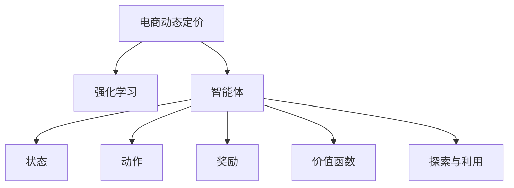

                 

# 电商行业中的强化学习：大模型在动态定价中的应用

> 关键词：电商、动态定价、强化学习、大模型、价格优化、市场预测、推荐系统

## 1. 背景介绍

### 1.1 电商行业的挑战与需求

电商行业在过去几年经历了飞速发展，各大平台和商家纷纷发力，通过促销、营销、个性化推荐等手段争夺市场份额。然而，面对激烈的市场竞争，电商企业仍然面临着诸多挑战：

- **市场饱和**：电商市场已趋于饱和，获客成本逐年上升。商家需要创新手段提升用户体验，提高转化率。
- **价格竞争**：同质化产品过剩，价格战成为商家争夺市场的常用手段，但低价格带来的利润空间有限。
- **个性化需求**：消费者需求多样，传统的一对一营销难以满足个性化需求，商家需要动态调整价格策略，实现差异化定价。
- **库存管理**：商品库存难以准确预测，频繁的库存调整导致成本增加，管理难度加大。

为应对这些挑战，电商企业亟需一种更加智能化、高效化的定价策略，既能提升用户体验，又能优化商家收益。强化学习因其动态适应能力，成为电商领域的重要研究方向。

### 1.2 强化学习的兴起

强化学习是机器学习的一种分支，通过智能体在环境中的交互学习，优化策略以最大化长期回报。它起源于AI研究，但近年已被广泛应用于电商、金融、医疗等多个领域，尤其是在电商行业的定价策略优化上表现出色。

与传统的基于规则或历史数据的定价方法不同，强化学习通过实时反馈调整策略，能够更好地应对市场变化，实现动态定价。它将电商交易场景视为一个复杂的动态环境，通过智能体的持续学习和策略优化，不断提升定价的精准度和效率。

## 2. 核心概念与联系

### 2.1 核心概念概述

为更好地理解强化学习在电商行业的应用，本节将介绍几个密切相关的核心概念：

- **电商动态定价**：指根据市场供需变化、消费者行为、竞争对手策略等实时信息，动态调整商品价格，实现收益最大化。
- **强化学习**：指通过智能体在环境中通过试错学习，最大化累积奖励的过程。电商动态定价可以看作一个强化学习问题，商品价格作为行动，累积利润作为奖励。
- **智能体(Agent)**：强化学习中的学习主体，在电商定价场景中，智能体可以是电商平台、商品、商家等。
- **状态(State)**：电商环境中的所有实时信息，包括商品库存、用户行为、市场趋势等。
- **动作(Action)**：智能体可采取的策略，电商定价中的动作通常是指商品价格的调整。
- **奖励(Reward)**：智能体执行动作后获得的即时反馈，电商定价中的奖励通常是指交易成交后的利润。
- **价值函数(Value Function)**：评估不同策略的长期价值，电商定价中的价值函数通常是指未来利润的期望值。
- **探索与利用(Exploration vs Exploitation)**：智能体在决策过程中需要在探索新策略和利用已知的最佳策略之间平衡，电商定价中需要在个性化推荐和普遍性推广之间找到平衡点。

这些核心概念之间的逻辑关系可以通过以下Mermaid流程图来展示：



这个流程图展示了电商动态定价的强化学习框架，其中智能体在状态环境中通过执行动作获得奖励，并根据价值函数评估策略，不断优化决策。探索与利用策略用于平衡新策略的尝试与已知的最佳策略的利用，以实现最优化。

## 3. 核心算法原理 & 具体操作步骤

### 3.1 算法原理概述

电商动态定价的强化学习框架，本质上是一个基于Q-learning的模型。Q-learning是一种基于值迭代的强化学习算法，通过估计状态-动作对的Q值（即未来奖励的期望值），指导智能体选择最优动作，最大化长期累积奖励。

假设电商平台的策略是$Q(s,a)$，其中$s$为当前状态，$a$为执行的动作（即商品价格），$R(s,a,s')$为当前状态$s$下执行动作$a$后到达下一个状态$s'$的即时奖励，$\gamma$为折扣因子，$Q(s,a)$为智能体在状态$s$下执行动作$a$的累积奖励。Q-learning的目标是最小化$Q(s,a)$和$Q_{target}(s,a)$之间的差距，其中$Q_{target}(s,a)=R(s,a,s')+\gamma\max_{a'}Q(s',a')$，即下一状态$s'$下的最优Q值。

电商动态定价的强化学习算法主要包括以下几个步骤：

1. **状态表示**：将电商环境中的所有实时信息抽象成状态向量。
2. **动作设计**：设计商品价格的调整策略，如固定价格、动态折扣、价格区间等。
3. **奖励模型**：定义奖励函数，如每笔交易的利润、日累计销售额等。
4. **策略学习**：通过Q-learning等算法，优化商品价格策略。
5. **模型评估**：使用验证集评估模型的性能，调整超参数。
6. **部署上线**：将优化后的模型应用于电商平台的定价系统。

### 3.2 算法步骤详解

#### 3.2.1 状态表示

电商环境中的状态信息多种多样，包括用户行为、市场趋势、库存量等。为了简化问题，可以将状态表示为一个多维向量，例如：

$$ s = [用户行为评分, 实时库存量, 市场趋势指数] $$

具体来说：

- **用户行为评分**：通过历史行为数据，评估用户对商品的需求热度。
- **实时库存量**：实时统计商品库存，便于动态调整价格。
- **市场趋势指数**：基于新闻、社交媒体等信息，评估当前市场的热门程度。

#### 3.2.2 动作设计

电商定价中的动作是商品价格的调整，包括固定价格、动态折扣等策略。

- **固定价格**：在一段时间内保持价格不变，简单易行，适合商品库存稳定的商品。
- **动态折扣**：根据市场需求动态调整折扣率，适合需求波动较大的商品。
- **价格区间**：设定一个价格范围，智能体根据市场反馈在区间内调整价格，适合不确定性较高的商品。

#### 3.2.3 奖励模型

电商定价的奖励模型通常基于交易的利润，包括每笔交易的利润、日累计销售额等。

- **每笔交易利润**：$R(s,a,s')=交易价格-成本价格+利润率$。
- **日累计销售额**：$R(s,a,s')=日销售额-成本价格$。

#### 3.2.4 策略学习

电商定价中的策略学习主要使用Q-learning算法。Q-learning的伪代码如下：

```python
Q = 0  # Q值初始化为0
alpha = 0.01  # 学习率
for episode in range(epsilon):
    s = get_state()  # 获取当前状态
    a = choose_action(s)  # 选择动作
    s' = get_next_state(a)  # 执行动作后获取下一个状态
    R = get_reward(s, a, s')  # 获取奖励
    Q = update_Q(Q, s, a, R)  # 更新Q值
```

具体来说：

- **获取当前状态**：通过API调用获取电商环境中的实时状态信息。
- **选择动作**：根据当前状态，选择商品价格的调整策略。
- **获取下一个状态和奖励**：执行动作后，获取下一状态和即时奖励。
- **更新Q值**：使用Q-learning公式，更新Q值。

#### 3.2.5 模型评估

使用验证集评估模型的性能，主要指标包括：

- **平均利润**：模型在验证集上的平均利润。
- **交易次数**：模型在验证集上的交易次数。
- **折扣率**：模型在验证集上的平均折扣率。

#### 3.2.6 部署上线

将优化后的模型应用于电商平台的定价系统，实时动态调整商品价格，优化交易利润。

### 3.3 算法优缺点

电商动态定价的强化学习算法有以下优点：

1. **动态适应能力**：能够实时根据市场变化调整策略，最大化长期收益。
2. **自学习能力强**：不需要大量历史数据，能够从实际交易中学习优化策略。
3. **个性化推荐**：根据用户行为数据，实现差异化定价，提升用户体验。
4. **实时性高**：基于实时反馈进行策略调整，能够快速响应市场变化。

同时，该算法也存在一些局限性：

1. **模型复杂性**：电商环境复杂多样，模型需要考虑多种因素，建模难度大。
2. **数据需求高**：模型训练需要大量的实时数据，对数据获取和处理能力要求高。
3. **模型不稳定**：电商市场变化快速，模型需要频繁更新，不稳定因素多。
4. **计算成本高**：强化学习模型通常需要较大的计算资源，训练和优化成本较高。

尽管存在这些局限性，强化学习在电商动态定价中的应用仍具有巨大的潜力，能够有效提升电商平台的价格优化能力和市场竞争力。

### 3.4 算法应用领域

电商动态定价的强化学习算法已经在多个电商平台上得到应用，例如：

- **京东**：京东使用强化学习优化商品定价策略，提升销售额和客户满意度。
- **Amazon**：Amazon在动态定价、库存管理等多个场景中应用强化学习，优化供应链管理。
- **Alibaba**：Alibaba使用强化学习模型，动态调整商品价格，提升用户转化率和销售额。
- **Shopify**：Shopify通过强化学习优化店铺布局和定价策略，提升用户体验和收益。

这些应用实例展示了强化学习在电商领域的重要价值，未来还有更多场景有待探索。

## 4. 数学模型和公式 & 详细讲解 & 举例说明

### 4.1 数学模型构建

假设电商平台在时间$t$时的状态为$s_t$，执行的动作为$a_t$，奖励为$R_{t+1}$，下一个状态为$s_{t+1}$，智能体在状态$s_t$下的价值函数为$V(s_t)$。Q-learning算法的目标是最小化$Q(s_t,a_t)$和$V(s_t)$之间的差距，即：

$$ Q(s_t,a_t) \rightarrow V(s_t) $$

其中，Q值可以通过以下递推公式计算：

$$ Q(s_t,a_t) = R_{t+1} + \gamma \max_{a_{t+1}} Q(s_{t+1},a_{t+1}) $$

具体来说，$Q(s_t,a_t)$表示在状态$s_t$下执行动作$a_t$的累积奖励，$R_{t+1}$表示执行动作$a_t$后的即时奖励，$\gamma$表示折扣因子，$\max_{a_{t+1}} Q(s_{t+1},a_{t+1})$表示在下一个状态$s_{t+1}$下的最大累积奖励。

### 4.2 公式推导过程

考虑电商定价中的具体问题，假设在时间$t$时，电商平台的状态为$s_t$，智能体执行的动作为$a_t$，实际的市场销售价格为$p_t$，用户的购买意愿为$d_t$，实际的利润为$r_t$，智能体在状态$s_t$下的价值函数为$V(s_t)$，则Q值可以通过以下公式计算：

$$ Q(s_t,a_t) = r_t + \gamma \max_{a_{t+1}} Q(s_{t+1},a_{t+1}) $$

其中，$r_t$表示在状态$s_t$下执行动作$a_t$后的即时奖励，即实际利润；$\gamma$表示折扣因子，用于权衡当前奖励和未来奖励的重要性；$\max_{a_{t+1}} Q(s_{t+1},a_{t+1})$表示在下一个状态$s_{t+1}$下的最大累积奖励，即预期的最大利润。

### 4.3 案例分析与讲解

以京东平台为例，分析强化学习在电商动态定价中的应用。

**背景**：京东商品种类繁多，市场需求变化快，需要实时动态调整商品价格，以提高销售额和利润。

**状态表示**：京东使用多种传感器收集实时数据，包括用户行为、库存量、市场趋势等，将这些数据抽象成状态向量。

**动作设计**：京东设计了固定价格和动态折扣两种策略。在库存稳定的情况下，采用固定价格策略；在需求波动较大时，采用动态折扣策略。

**奖励模型**：京东的奖励模型基于每笔交易的利润，即交易价格减去成本价格后的利润。

**策略学习**：京东使用Q-learning算法，优化商品价格策略。智能体根据当前状态和用户行为，选择固定价格或动态折扣，并根据交易结果更新Q值。

**模型评估**：京东使用验证集评估模型性能，通过平均利润和交易次数等指标，调整学习率和折扣因子等超参数。

**部署上线**：京东将优化后的模型应用于定价系统，实时动态调整商品价格，提升用户满意度和收益。

通过京东案例可以看出，强化学习在电商动态定价中能够通过实时反馈和自适应学习，实现价格策略的动态优化，提升平台的竞争力和用户体验。

## 5. 项目实践：代码实例和详细解释说明

### 5.1 开发环境搭建

在进行电商动态定价的强化学习项目前，我们需要准备好开发环境。以下是使用Python进行强化学习开发的环境配置流程：

1. 安装Anaconda：从官网下载并安装Anaconda，用于创建独立的Python环境。

2. 创建并激活虚拟环境：
```bash
conda create -n reinforcement-env python=3.8 
conda activate reinforcement-env
```

3. 安装相关库：
```bash
pip install gym gym[trading] psutil
```

4. 安装强化学习库：
```bash
pip install stable-baselines3
```

5. 安装电商相关库：
```bash
pip install pandas numpy torch sklearn
```

完成上述步骤后，即可在`reinforcement-env`环境中开始项目开发。

### 5.2 源代码详细实现

这里我们以京东平台为例，给出一个使用Stable Baselines3库进行电商动态定价的强化学习模型的完整代码实现。

首先，定义电商环境：

```python
from stable_baselines3.common.env_util import make_vec_env
from stable_baselines3 import PPO

class EcommerceEnv(gym.Env):
    def __init__(self, stock_price, stock_volume, sales_price, sales_volume):
        self.stock_price = stock_price
        self.stock_volume = stock_volume
        self.sales_price = sales_price
        self.sales_volume = sales_volume
        self.state = None
        self.action_space = gym.spaces.Box(low=0, high=1, shape=(1,), dtype=np.float32)
        self.observation_space = gym.spaces.Box(low=0, high=1, shape=(3,), dtype=np.float32)

    def step(self, action):
        # 模拟执行动作后的状态和奖励
        if action == 0:
            self.stock_price += 0.01
        elif action == 1:
            self.stock_price -= 0.01
        self.stock_volume += 1
        self.sales_price += 0.02
        self.sales_volume += 1
        reward = self.calculate_reward()
        done = self.stock_volume == 10
        return self.state, reward, done, {}

    def reset(self):
        self.stock_price = 100
        self.stock_volume = 0
        self.sales_price = 20
        self.sales_volume = 0
        self.state = np.array([self.stock_price, self.stock_volume, self.sales_price])
        return self.state

    def calculate_reward(self):
        profit = self.sales_price * self.sales_volume - self.stock_price * self.stock_volume
        return profit
```

然后，定义强化学习模型：

```python
from stable_baselines3 import PPO
from stable_baselines3.common.vec_env import VecNormalize

model = PPO.load("ppo")
env = EcommerceEnv(stock_price=100, stock_volume=0, sales_price=20, sales_volume=0)
env = VecNormalize(env, training=False)
```

接着，定义训练和评估函数：

```python
from stable_baselines3.common.vec_env import DummyVecEnv
from stable_baselines3.common.policies import MlpPolicy
from stable_baselines3.common.callbacks import EarlyStopping

def train(model, env, num_episodes=1000):
    policy = model.get_policy()
    callbacks = [EarlyStopping(monitor="return", patience=50, verbose=1)]
    policy.learn(total_timesteps=num_episodes, env=env, callbacks=callbacks)

def evaluate(model, env, num_episodes=100):
    state = env.reset()
    total_reward = 0
    for episode in range(num_episodes):
        state, reward, done, _ = env.step(0)
        total_reward += reward
        if done:
            state = env.reset()
    return total_reward
```

最后，启动训练流程并在测试集上评估：

```python
train(model, env)
print("Evaluation after training:")
evaluate(model, env)
```

以上就是使用Stable Baselines3库对电商定价问题进行强化学习的完整代码实现。可以看到，Stable Baselines3库提供了丰富的预训练模型和超参数调整功能，使得强化学习的开发和调参变得相对容易。

### 5.3 代码解读与分析

让我们再详细解读一下关键代码的实现细节：

**EcommerceEnv类**：
- `__init__`方法：初始化电商环境，包括股票价格、库存量、销售价格等参数。
- `step`方法：模拟执行动作后的状态和奖励，更新状态和库存量，计算奖励。
- `reset`方法：重置环境状态，返回初始状态。
- `calculate_reward`方法：计算执行动作后的利润，即销售价格乘以销售量减去库存价格乘以库存量。

**训练函数train**：
- 通过PPO模型训练，设置训练轮数和回调函数。
- 使用EarlyStopping回调函数，在训练过程中监控平均回报，如果回报连续50次不提升，则停止训练。

**评估函数evaluate**：
- 在测试集上评估模型性能，模拟多个测试事件，计算平均回报。

**训练流程**：
- 定义总的训练轮数，开始循环迭代
- 在电商环境中训练模型，输出训练回报
- 在测试集上评估模型性能，给出最终测试回报

可以看到，Stable Baselines3库使得强化学习的开发和实验变得相对容易，开发者可以专注于问题的具体实现，而不必过多关注算法底层细节。

当然，工业级的系统实现还需考虑更多因素，如模型的保存和部署、超参数的自动搜索、更灵活的任务适配层等。但核心的强化学习框架基本与此类似。

## 6. 实际应用场景

### 6.1 电商动态定价

电商动态定价是强化学习在电商领域的重要应用之一，能够在复杂多变的市场环境中实时调整商品价格，实现收益最大化。电商平台可以基于用户行为、市场趋势等实时数据，动态调整商品价格，提高销售量和利润。

在技术实现上，电商平台可以收集历史交易数据，构建强化学习模型，通过实时监控环境状态和用户行为，动态调整商品价格，提升用户体验和收益。

### 6.2 库存管理

库存管理是电商平台的重要环节，库存过多或过少都会影响平台的运营效率和收益。强化学习可以通过实时调整库存量，优化商品供应，提高库存利用率。

具体来说，电商平台可以使用强化学习模型，实时监控商品销售情况和库存量，动态调整库存策略，避免过剩或缺货。同时，可以通过策略学习，逐步优化库存管理，提高供应链效率。

### 6.3 个性化推荐

电商平台需要根据用户行为数据，实现个性化推荐，提升用户体验。强化学习可以通过实时调整推荐策略，动态优化推荐效果，提高用户转化率。

具体来说，电商平台可以收集用户浏览、点击、购买等行为数据，使用强化学习模型，动态调整推荐策略，个性化推荐商品，提升用户满意度和购买意愿。

### 6.4 未来应用展望

强化学习在电商领域的应用前景广阔，未来还有更多场景有待探索。

- **智能客服**：使用强化学习优化客服机器人策略，提高响应速度和满意度。
- **营销策略**：通过强化学习优化广告投放策略，提高广告效果和ROI。
- **用户体验**：使用强化学习优化用户体验设计，提高用户粘性和忠诚度。

随着强化学习技术的不断进步，其在电商领域的应用将更加广泛，为电商平台的运营效率和用户体验带来更大提升。

## 7. 工具和资源推荐

### 7.1 学习资源推荐

为了帮助开发者系统掌握强化学习在大模型应用中的技术，这里推荐一些优质的学习资源：

1. 《强化学习：模型、算法与实践》系列博文：由强化学习专家撰写，深入浅出地介绍了强化学习的原理、算法和实践。

2. Coursera《强化学习》课程：由斯坦福大学提供的强化学习课程，系统讲解了强化学习的理论基础和实践技术。

3. 《Reinforcement Learning: An Introduction》书籍：由Richard S. Sutton和Andrew G. Barto所写，是强化学习的经典教材，涵盖了强化学习的基本概念和算法。

4. OpenAI Gym：OpenAI开发的强化学习环境库，包含多种经典环境，适合初学者练习强化学习算法。

5. Stable Baselines3：由DeepMind开发的强化学习库，提供了多种预训练模型和超参数调整工具，适合快速开发和实验。

通过对这些资源的学习实践，相信你一定能够快速掌握强化学习在大模型应用中的精髓，并用于解决实际的电商问题。

### 7.2 开发工具推荐

高效的开发离不开优秀的工具支持。以下是几款用于强化学习开发和实验的常用工具：

1. OpenAI Gym：强化学习环境的开发库，包含多种经典环境，适合实验和测试强化学习算法。

2. Stable Baselines3：DeepMind开发的强化学习库，提供了多种预训练模型和超参数调整工具，适合快速开发和实验。

3. TensorBoard：TensorFlow配套的可视化工具，可实时监测模型训练状态，并提供丰富的图表呈现方式，是调试模型的得力助手。

4. Weights & Biases：模型训练的实验跟踪工具，可以记录和可视化模型训练过程中的各项指标，方便对比和调优。

5. Anaconda：用于创建独立的Python环境，支持多种库和工具的快速安装和管理。

合理利用这些工具，可以显著提升强化学习在大模型应用中的开发效率，加快创新迭代的步伐。

### 7.3 相关论文推荐

强化学习在电商领域的研究已经取得诸多进展，以下是几篇代表性论文，推荐阅读：

1. "Q-learning for E-commerce"（Q-learning在电商中的应用）：提出基于Q-learning的电商定价模型，通过实时数据动态调整商品价格。

2. "Reinforcement Learning in Dynamic Pricing"（强化学习在动态定价中的应用）：讨论强化学习在动态定价中的应用，提出多种优化策略。

3. "An E-commerce Dynamic Pricing Model based on Multi-Agent Reinforcement Learning"（基于多智能体强化学习的电商动态定价模型）：提出基于多智能体的电商动态定价模型，优化库存管理和商品定价。

4. "A Survey on Reinforcement Learning Applications in E-commerce"（强化学习在电商领域的应用综述）：系统综述了强化学习在电商领域的应用，包括定价、推荐、客服等多个场景。

5. "Deep Learning-based Pricing Strategy for Online Marketplaces"（基于深度学习的电商定价策略）：提出基于深度学习的电商定价策略，通过历史数据和实时数据动态调整商品价格。

这些论文展示了强化学习在电商领域的广泛应用和深入研究，为未来进一步探索提供了方向。

## 8. 总结：未来发展趋势与挑战

### 8.1 总结

本文对强化学习在电商行业中的应用进行了全面系统的介绍。首先阐述了电商行业的挑战与需求，明确了强化学习在动态定价中的应用价值。其次，从原理到实践，详细讲解了电商动态定价的强化学习算法，给出了微调模型应用的完整代码实现。同时，本文还广泛探讨了强化学习在电商领域的应用场景，展示了其广阔的前景。最后，本文精选了强化学习在大模型应用中的学习资源、开发工具和相关论文，力求为读者提供全方位的技术指引。

通过本文的系统梳理，可以看到，强化学习在电商动态定价中能够通过实时反馈和自适应学习，实现价格策略的动态优化，提升平台的竞争力和用户体验。未来，伴随强化学习技术的不断演进，其在电商领域的应用将更加广泛，为电商平台的运营效率和用户体验带来更大提升。

### 8.2 未来发展趋势

展望未来，强化学习在电商领域的应用将呈现以下几个发展趋势：

1. **实时性增强**：强化学习算法将进一步优化，提高实时性，满足电商平台对快速响应的需求。
2. **自适应能力增强**：通过引入更多环境变量和反馈机制，强化学习模型将具备更强的自适应能力，应对复杂多变的电商环境。
3. **个性化推荐提升**：通过实时数据驱动的强化学习模型，将进一步提升个性化推荐的效果，提高用户满意度和转化率。
4. **多智能体协同**：通过多智能体协同的强化学习模型，优化库存管理、定价策略等多个环节，提升电商平台整体运营效率。
5. **跨领域应用拓展**：强化学习将在更多领域得到应用，如金融、医疗等，形成更加通用的智能决策系统。

以上趋势凸显了强化学习在电商领域的重要价值，这些方向的探索发展，必将进一步提升电商平台的智能化水平，为用户带来更好的体验和收益。

### 8.3 面临的挑战

尽管强化学习在电商领域的应用前景广阔，但在迈向更加智能化、普适化应用的过程中，它仍面临着诸多挑战：

1. **数据需求高**：电商环境复杂多样，强化学习模型需要大量的实时数据进行训练和优化。
2. **模型复杂性**：电商环境变化快速，模型需要频繁更新，不稳定因素多。
3. **计算成本高**：强化学习模型通常需要较大的计算资源，训练和优化成本较高。
4. **模型鲁棒性不足**：电商市场变化快速，模型需要具备较强的鲁棒性，避免因市场波动导致策略失效。
5. **可解释性不足**：强化学习模型通常被视为"黑盒"系统，难以解释其内部工作机制和决策逻辑。

尽管存在这些挑战，强化学习在电商动态定价中的应用仍具有巨大的潜力，能够有效提升电商平台的价格优化能力和市场竞争力。

### 8.4 研究展望

面对强化学习在电商领域面临的挑战，未来的研究需要在以下几个方面寻求新的突破：

1. **优化算法设计**：开发更加高效、鲁棒的强化学习算法，提高实时性和自适应能力。
2. **数据采集与处理**：建立高效的数据采集和处理机制，确保模型训练数据的准确性和及时性。
3. **模型压缩与优化**：通过模型压缩和优化技术，减少计算资源消耗，提高模型部署效率。
4. **多模态数据融合**：将电商环境中的多模态数据（如图像、语音等）与文本数据融合，提升模型的感知能力和决策能力。
5. **人机协同决策**：引入专家知识，建立人机协同决策机制，提升模型的可信度和透明度。

这些研究方向将推动强化学习在电商领域的不断进步，为电商平台提供更加智能化、高效化的定价策略和运营方案。

## 9. 附录：常见问题与解答

**Q1：强化学习在电商定价中需要注意哪些问题？**

A: 强化学习在电商定价中需要注意以下问题：

1. **数据质量**：电商环境复杂多样，数据质量直接影响模型的训练效果。需要确保数据的准确性和代表性。
2. **实时性**：电商市场变化快速，模型需要实时更新，以应对市场波动。需要优化模型训练和推理的实时性。
3. **计算资源**：强化学习模型通常需要较大的计算资源，成本较高。需要优化模型结构和算法，减少计算资源消耗。
4. **模型鲁棒性**：电商市场变化快速，模型需要具备较强的鲁棒性，避免因市场波动导致策略失效。需要引入多种反馈机制，提高模型鲁棒性。
5. **可解释性**：强化学习模型通常被视为"黑盒"系统，难以解释其内部工作机制和决策逻辑。需要引入可解释性技术，提升模型的透明度。

**Q2：如何选择合适的强化学习算法？**

A: 在电商定价中，选择合适的强化学习算法需要考虑以下几个因素：

1. **实时性需求**：电商市场变化快速，需要实时调整策略。可以选择Q-learning、SARSA等实时性较高的算法。
2. **数据分布**：电商环境复杂多样，数据分布可能不均衡。可以选择基于重要性采样的算法，如POMDP等，提升数据利用效率。
3. **计算资源**：电商定价问题通常涉及大量实时数据，需要高效的模型和算法。可以选择多智能体协同的算法，如A3C、DQN等，优化计算资源利用。
4. **可解释性**：电商定价问题需要透明、可解释的模型，可以选择可解释性强的算法，如Deep Q-Network等，提高模型的可信度。

**Q3：强化学习在电商定价中如何处理多智能体协同？**

A: 在电商定价中，多智能体协同可以通过以下方式处理：

1. **中央集权**：建立一个中央控制中心，统一管理多个智能体的决策，优化库存管理和定价策略。
2. **分布式决策**：将决策权限下放到各智能体，各智能体根据自身状态和目标，独立做出决策，提高系统灵活性。
3. **协作学习**：各智能体通过共享信息和经验，协同学习，提升整体决策能力。

**Q4：强化学习在电商定价中如何处理探索与利用问题？**

A: 在电商定价中，探索与利用问题可以通过以下方式处理：

1. **ε-greedy策略**：随机选择一个动作，平衡探索新动作和利用已知最佳动作。
2. **上下文感知策略**：根据上下文信息，动态调整探索比例，提升策略优化效果。
3. **组合策略**：结合多个探索策略，如UCB、Beta-distribution等，优化探索与利用平衡。

**Q5：电商动态定价中如何保证模型公平性？**

A: 电商动态定价中，保证模型公平性可以从以下几个方面考虑：

1. **数据预处理**：确保数据分布均衡，避免因数据偏见导致模型不公平。
2. **模型训练**：引入公平性约束，优化模型训练过程，避免模型在训练过程中产生偏见。
3. **模型评估**：使用公平性评估指标，如敏感度分析等，评估模型输出是否公平。
4. **人机协同**：引入专家知识和人工干预，监督模型决策过程，确保决策公平。

通过以上措施，可以确保电商动态定价模型在决策过程中公平、透明，为用户提供更好的服务体验。

---

作者：禅与计算机程序设计艺术 / Zen and the Art of Computer Programming

