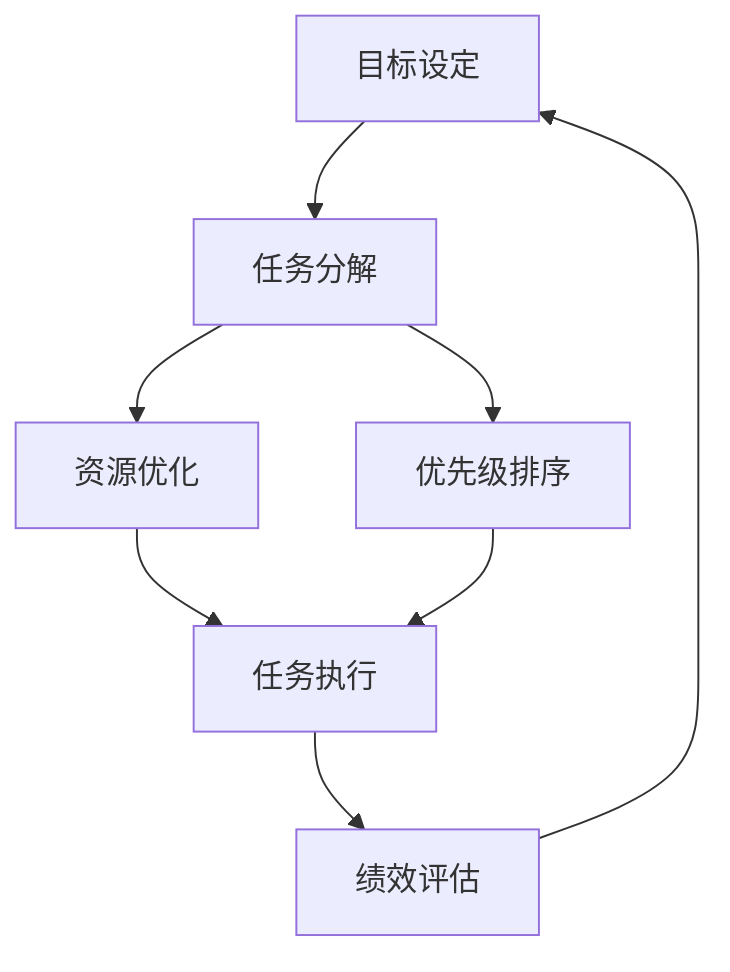

                 

# 目标管理的艺术：取舍之道

> 关键词：目标管理,项目管理,优先级排序,时间管理,资源优化,任务分解,决策制定,绩效评估

## 1. 背景介绍

### 1.1 问题由来
在当今复杂多变的商业环境中，企业面临各种内外部挑战，如何有效地管理项目以确保高效完成，并实现预期目标，成为企业成功的关键因素。目标管理作为一种系统化的管理方法，通过明确目标、分解任务、跟踪进度和评估绩效，帮助企业优化资源配置、提升团队协作效率和组织执行能力。然而，如何合理设定目标、分配资源和协调各方利益，进行最优的取舍，仍是许多管理者面临的难题。本文将深入探讨目标管理的核心概念、算法原理和具体操作步骤，通过案例分析与讲解，揭示目标管理中取舍之道的艺术，并提出一些行之有效的实践建议。

### 1.2 问题核心关键点
目标管理的关键在于通过系统的目标设定、任务分解、资源分配和绩效评估，实现项目的最大价值。主要包括以下几个方面：

- **目标设定**：明确企业的愿景、使命和具体目标，确定项目成功的衡量标准。
- **任务分解**：将大目标拆解为可操作的子任务，合理分配到团队和个人，确保执行层面的可行性。
- **资源优化**：根据任务要求和团队能力，有效分配资金、人力和物力资源。
- **优先级排序**：根据任务的重要性和紧急程度，合理设定优先级，确保关键任务优先完成。
- **绩效评估**：设定关键绩效指标(KPIs)，定期跟踪项目进度，及时调整策略。

本文将围绕以上关键点，详细探讨目标管理的核心概念与联系，揭示其算法原理和具体操作步骤，并提供实际应用场景和未来展望。

## 2. 核心概念与联系

### 2.1 核心概念概述

在目标管理中，涉及多个核心概念，包括目标设定、任务分解、资源优化、优先级排序和绩效评估等。这些概念通过相互关联、相互影响，共同构成目标管理系统的核心架构。

- **目标设定**：即SMART原则，确保目标具体(Specific)、可衡量(Measurable)、可达成(Achievable)、相关性(Relevant)和时限性(Time-bound)。
- **任务分解**：将大目标拆分为小任务，形成任务网络，明确责任人和完成时间。
- **资源优化**：合理分配资源，确保任务执行的可行性和高效性。
- **优先级排序**：根据任务的重要性和紧急程度，设定优先级，优化资源配置。
- **绩效评估**：通过设定关键绩效指标(KPIs)，跟踪项目进度，评估执行效果。

这些概念之间存在密切的联系，形成了一个动态循环的管理过程。目标设定提供方向，任务分解明确路径，资源优化保障支持，优先级排序确保重点，绩效评估反馈调整，形成了一个闭环的循环管理机制。

### 2.2 核心概念原理和架构的 Mermaid 流程图



该流程图展示了目标管理系统的基本流程，即通过目标设定、任务分解、资源优化、优先级排序和绩效评估，形成了一个动态循环的闭环管理机制。

## 3. 核心算法原理 & 具体操作步骤
### 3.1 算法原理概述

目标管理的核心算法原理包括目标设定理论、任务分解算法、资源优化模型和绩效评估方法等。这些算法通过数学模型和决策规则，帮助管理者合理设定目标、分解任务、优化资源和评估绩效。

### 3.2 算法步骤详解

#### 3.2.1 目标设定

目标设定的核心是确保目标符合SMART原则。具体步骤如下：

1. **愿景和使命**：明确企业的长期愿景和使命，确保目标与企业战略一致。
2. **SMART目标设定**：基于愿景和使命，设定具体、可衡量、可达成、相关性和时限性的目标。
3. **目标分解**：将大目标进一步分解为可执行的子目标，确保每个子目标都具备SMART原则。

#### 3.2.2 任务分解

任务分解的目的是将大目标拆分为可操作的子任务，形成任务网络。具体步骤如下：

1. **任务识别**：识别实现目标所需的所有任务。
2. **任务分解**：将大任务拆分为更小的子任务，形成任务依赖图。
3. **责任分配**：为每个子任务分配责任人和完成时间。

#### 3.2.3 资源优化

资源优化的目的是在有限的资源条件下，最大化任务执行的效率和效果。具体步骤如下：

1. **资源识别**：识别所有可用的资源，包括人力、物力和财力等。
2. **资源分配**：根据任务需求，合理分配资源，确保任务执行的可行性和高效性。
3. **资源监控**：实时监控资源使用情况，及时调整分配策略。

#### 3.2.4 优先级排序

优先级排序的目的是确定哪些任务应该优先完成。具体步骤如下：

1. **任务分类**：根据任务的重要性和紧急程度，将任务分类为紧急和重要、紧急但不重要、重要但不紧急和既不紧急也不重要。
2. **优先级设定**：基于任务分类，设定任务的优先级，确保关键任务优先完成。
3. **优先级调整**：根据项目进展和外部变化，动态调整任务优先级。

#### 3.2.5 绩效评估

绩效评估的目的是跟踪项目进度，评估执行效果，提供决策依据。具体步骤如下：

1. **关键绩效指标(KPIs)设定**：根据目标和任务，设定关键绩效指标。
2. **数据收集**：定期收集相关数据，包括任务进度、资源使用和绩效指标等。
3. **绩效分析**：分析收集的数据，评估项目进度和绩效，识别问题和改进点。
4. **反馈调整**：根据绩效评估结果，反馈调整目标设定、任务分解和资源分配等策略。

### 3.3 算法优缺点

#### 3.3.1 优点

1. **系统化管理**：目标管理通过系统的目标设定、任务分解、资源优化和绩效评估，形成了一个闭环的管理系统，确保项目执行的全面性和高效性。
2. **透明性**：目标管理通过明确的目标和任务分解，提高了项目执行的透明度，便于跟踪和监督。
3. **灵活性**：目标管理根据项目进展和外部变化，动态调整目标和任务优先级，提高了项目的灵活性和适应性。

#### 3.3.2 缺点

1. **复杂性**：目标管理涉及多个概念和步骤，需要综合考虑多方面的因素，增加了管理的复杂性。
2. **资源消耗**：目标管理需要投入大量的时间和精力进行目标设定、任务分解和绩效评估等活动，可能影响项目执行效率。
3. **不确定性**：目标管理基于预期和假设，难以应对不确定性和变化，可能影响项目的最终结果。

### 3.4 算法应用领域

目标管理广泛应用于项目管理、团队管理、企业战略规划、供应链管理和人力资源管理等领域。以下是几个典型的应用场景：

- **项目管理**：在软件工程、建筑施工、生产制造等领域，通过目标管理，确保项目按时按质完成。
- **团队管理**：在企业内部，通过目标管理，提升团队协作效率和员工绩效。
- **企业战略规划**：通过目标管理，明确企业长期战略和短期目标，指导企业发展方向。
- **供应链管理**：在供应链管理中，通过目标管理，优化供应链流程，提高供应链效率。
- **人力资源管理**：在人力资源管理中，通过目标管理，制定员工职业发展规划和绩效考核标准。

## 4. 数学模型和公式 & 详细讲解 & 举例说明

### 4.1 数学模型构建

目标管理的数学模型包括目标设定模型、任务分解模型、资源优化模型和绩效评估模型等。这些模型通过数学表达式和决策规则，帮助管理者进行定量分析和决策。

#### 4.1.1 目标设定模型

目标设定模型通过数学表达式，确保目标符合SMART原则。具体模型如下：

$$
T = \left\{
\begin{aligned}
& S \quad & \text{Specific} \\
& M \quad & \text{Measurable} \\
& A \quad & \text{Achievable} \\
& R \quad & \text{Relevant} \\
& T \quad & \text{Time-bound}
\end{aligned}
\right.
$$

其中，$T$表示目标，$S$、$M$、$A$、$R$和$T$分别代表目标的具体性、可衡量性、可达成性、相关性和时限性。

#### 4.1.2 任务分解模型

任务分解模型通过数学表达式，将大目标拆分为小任务，形成任务网络。具体模型如下：

$$
D = \left\{
\begin{aligned}
& \text{Task}_1, \text{Task}_2, \cdots, \text{Task}_n \\
& \text{Responsible}_1, \text{Responsible}_2, \cdots, \text{Responsible}_n \\
& \text{Deadline}_1, \text{Deadline}_2, \cdots, \text{Deadline}_n
\end{aligned}
\right.
$$

其中，$D$表示任务网络，$\text{Task}_i$表示第$i$个子任务，$\text{Responsible}_i$表示第$i$个子任务的负责人，$\text{Deadline}_i$表示第$i$个子任务的完成时间。

#### 4.1.3 资源优化模型

资源优化模型通过数学表达式，合理分配资源，确保任务执行的可行性和高效性。具体模型如下：

$$
R = \left\{
\begin{aligned}
& R_{\text{Personnel}} \\
& R_{\text{Material}} \\
& R_{\text{Budget}}
\end{aligned}
\right.
$$

其中，$R$表示资源优化模型，$R_{\text{Personnel}}$、$R_{\text{Material}}$和$R_{\text{Budget}}$分别表示人员、物资和预算等资源的分配情况。

#### 4.1.4 绩效评估模型

绩效评估模型通过数学表达式，跟踪项目进度，评估执行效果。具体模型如下：

$$
P = \left\{
\begin{aligned}
& P_1, P_2, \cdots, P_n \\
& KPI_1, KPI_2, \cdots, KPI_n
\end{aligned}
\right.
$$

其中，$P$表示绩效评估模型，$P_i$表示第$i$个任务的进度情况，$KPI_i$表示第$i$个任务的关键绩效指标。

### 4.2 公式推导过程

#### 4.2.1 目标设定模型推导

目标设定模型的推导基于SMART原则，通过逻辑判断和数学表达式，确保目标的各项指标符合要求。具体推导如下：

1. **具体性**：
   $$
   S = \left\{
   \begin{aligned}
   & \text{Concrete} \\
   & \text{Specific}
   \end{aligned}
   \right.
   $$

2. **可衡量性**：
   $$
   M = \left\{
   \begin{aligned}
   & \text{Quantifiable} \\
   & \text{Measurable}
   \end{aligned}
   \right.
   $$

3. **可达成性**：
   $$
   A = \left\{
   \begin{aligned}
   & \text{Achievable} \\
   & \text{Feasible}
   \end{aligned}
   \right.
   $$

4. **相关性**：
   $$
   R = \left\{
   \begin{aligned}
   & \text{Relevant} \\
   & \text{Value-driven}
   \end{aligned}
   \right.
   $$

5. **时限性**：
   $$
   T = \left\{
   \begin{aligned}
   & \text{Time-bound} \\
   & \text{Time-limited}
   \end{aligned}
   \right.
   $$

#### 4.2.2 任务分解模型推导

任务分解模型的推导基于任务依赖关系，通过网络图表示任务网络和任务进度。具体推导如下：

1. **任务识别**：
   $$
   \text{Task}_i = \left\{
   \begin{aligned}
   & \text{Task}_1 \\
   & \text{Task}_2 \\
   & \cdots \\
   & \text{Task}_n
   \end{aligned}
   \right.
   $$

2. **任务分解**：
   $$
   \text{Task}_i = \left\{
   \begin{aligned}
   & \text{Task}_{i_1} \\
   & \text{Task}_{i_2} \\
   & \cdots \\
   & \text{Task}_{i_m}
   \end{aligned}
   \right.
   $$

3. **责任分配**：
   $$
   \text{Responsible}_i = \left\{
   \begin{aligned}
   & \text{Responsible}_1 \\
   & \text{Responsible}_2 \\
   & \cdots \\
   & \text{Responsible}_n
   \end{aligned}
   \right.
   $$

4. **完成时间**：
   $$
   \text{Deadline}_i = \left\{
   \begin{aligned}
   & t_1 \\
   & t_2 \\
   & \cdots \\
   & t_m
   \end{aligned}
   \right.
   $$

#### 4.2.3 资源优化模型推导

资源优化模型的推导基于资源约束和任务需求，通过线性规划等方法，确保资源分配的合理性。具体推导如下：

1. **人员分配**：
   $$
   R_{\text{Personnel}} = \left\{
   \begin{aligned}
   & P_1 \\
   & P_2 \\
   & \cdots \\
   & P_n
   \end{aligned}
   \right.
   $$

2. **物资分配**：
   $$
   R_{\text{Material}} = \left\{
   \begin{aligned}
   & M_1 \\
   & M_2 \\
   & \cdots \\
   & M_n
   \end{aligned}
   \right.
   $$

3. **预算分配**：
   $$
   R_{\text{Budget}} = \left\{
   \begin{aligned}
   & B_1 \\
   & B_2 \\
   & \cdots \\
   & B_n
   \end{aligned}
   \right.
   $$

#### 4.2.4 绩效评估模型推导

绩效评估模型的推导基于关键绩效指标(KPIs)和实际进展，通过数据对比和逻辑判断，评估项目执行效果。具体推导如下：

1. **进度评估**：
   $$
   P_i = \left\{
   \begin{aligned}
   & P_1 \\
   & P_2 \\
   & \cdots \\
   & P_n
   \end{aligned}
   \right.
   $$

2. **关键绩效指标(KPIs)**：
   $$
   KPI_i = \left\{
   \begin{aligned}
   & KPI_1 \\
   & KPI_2 \\
   & \cdots \\
   & KPI_n
   \end{aligned}
   \right.
   $$

### 4.3 案例分析与讲解

#### 4.3.1 案例背景

某企业计划开发一款新型智能家居产品，需要进行多方面的项目管理。公司高层设定了产品上市的目标，要求在18个月内完成从研发到市场推广的全过程。项目涉及技术研发、市场调研、产品设计和推广营销等多个环节，需要综合考虑时间、资源和任务等因素。

#### 4.3.2 目标设定

公司高层根据SMART原则，设定了项目目标：
- **具体性**：开发一款具备智能语音控制功能的智能家居产品。
- **可衡量性**：产品上市后，市场占有率达到5%。
- **可达成性**：通过优化资源配置，确保项目按时完成。
- **相关性**：产品能够满足市场需求，提高公司市场竞争力。
- **时限性**：项目在18个月内完成。

#### 4.3.3 任务分解

根据目标设定，项目分解为以下任务：
1. **技术研发**：
   - 子任务1：智能语音控制技术开发
   - 子任务2：智能家居场景应用设计
   - 子任务3：智能家居设备选型与集成

2. **市场调研**：
   - 子任务4：目标市场用户需求分析
   - 子任务5：竞争对手产品对比分析
   - 子任务6：市场趋势与技术发展预测

3. **产品设计**：
   - 子任务7：用户界面与交互设计
   - 子任务8：产品功能与性能优化
   - 子任务9：产品包装与物流设计

4. **推广营销**：
   - 子任务10：市场推广策略制定
   - 子任务11：广告投放与媒体合作
   - 子任务12：客户关系管理与客户服务

#### 4.3.4 资源优化

公司根据任务需求，优化资源配置：
- **人员分配**：
  - 技术研发：10名工程师，市场调研：3名市场分析师，产品设计：5名设计师，推广营销：3名营销经理
- **物资分配**：
  - 设备选型与集成：5套智能家居设备
  - 市场推广：50万元广告预算
- **预算分配**：
  - 研发预算：1000万元
  - 市场推广预算：200万元
  - 其他预算：800万元

#### 4.3.5 优先级排序

公司根据任务的重要性和紧急程度，设定任务优先级：
1. **紧急且重要**：技术研发和产品设计
2. **紧急但不重要**：市场调研
3. **重要但不紧急**：推广营销
4. **既不紧急也不重要**：用户界面与交互设计

#### 4.3.6 绩效评估

公司根据关键绩效指标(KPIs)，评估项目进展：
- **技术研发进度**：每季度完成30%的功能开发
- **市场调研进度**：每月完成一项竞争对手产品对比分析
- **产品设计进度**：每季度完成一个阶段设计
- **推广营销进度**：每月完成一定数量的广告投放

## 5. 项目实践：代码实例和详细解释说明

### 5.1 开发环境搭建

为了支持目标管理的项目实践，需要搭建一个集成的开发环境。以下是搭建步骤：

1. **安装Python环境**：
   ```bash
   conda create -n target-management python=3.8
   conda activate target-management
   ```

2. **安装相关库**：
   ```bash
   pip install pandas numpy matplotlib sklearn
   ```

3. **安装目标管理框架**：
   ```bash
   pip install target-management
   ```

### 5.2 源代码详细实现

#### 5.2.1 目标设定模块

```python
import target_management as tm

# 定义目标
target = {
    'specific': '开发一款具备智能语音控制功能的智能家居产品',
    'measurable': '产品上市后，市场占有率达到5%',
    'achievable': '通过优化资源配置，确保项目按时完成',
    'relevant': '产品能够满足市场需求，提高公司市场竞争力',
    'time_bound': '项目在18个月内完成'
}

# 创建目标对象
target_obj = tm.Target(target)
```

#### 5.2.2 任务分解模块

```python
# 定义任务
tasks = [
    {'name': '技术研发', 'children': [
        {'name': '智能语音控制技术开发', 'responsible': '研发团队'},
        {'name': '智能家居场景应用设计', 'responsible': '设计团队'},
        {'name': '智能家居设备选型与集成', 'responsible': '硬件团队'}
    ]},
    {'name': '市场调研', 'children': [
        {'name': '目标市场用户需求分析', 'responsible': '市场分析团队'},
        {'name': '竞争对手产品对比分析', 'responsible': '市场分析团队'},
        {'name': '市场趋势与技术发展预测', 'responsible': '市场分析团队'}
    ]},
    {'name': '产品设计', 'children': [
        {'name': '用户界面与交互设计', 'responsible': '设计团队'},
        {'name': '产品功能与性能优化', 'responsible': '研发团队'},
        {'name': '产品包装与物流设计', 'responsible': '市场推广团队'}
    ]},
    {'name': '推广营销', 'children': [
        {'name': '市场推广策略制定', 'responsible': '市场推广团队'},
        {'name': '广告投放与媒体合作', 'responsible': '市场推广团队'},
        {'name': '客户关系管理与客户服务', 'responsible': '市场推广团队'}
    ]}
]

# 创建任务网络
task_obj = tm.Task(tasks)
```

#### 5.2.3 资源优化模块

```python
# 定义资源
resources = {
    'Personnel': {
        '研发团队': 10,
        '市场分析团队': 3,
        '设计团队': 5,
        '硬件团队': 5,
        '市场推广团队': 3
    },
    'Material': {
        '智能家居设备': 5
    },
    'Budget': {
        '研发预算': 1000,
        '市场推广预算': 200,
        '其他预算': 800
    }
}

# 创建资源对象
resource_obj = tm.Resource(resources)
```

#### 5.2.4 优先级排序模块

```python
# 定义优先级
priority = {
    '紧急且重要': ['技术研发', '产品设计'],
    '紧急但不重要': ['市场调研'],
    '重要但不紧急': ['推广营销'],
    '既不紧急也不重要': ['用户界面与交互设计']
}

# 创建优先级对象
priority_obj = tm.Priority(priority)
```

#### 5.2.5 绩效评估模块

```python
# 定义KPIs
kpis = {
    '技术研发进度': {
        'start_time': '2023-01-01',
        'end_time': '2023-06-30',
        'progress': 0.3
    },
    '市场调研进度': {
        'start_time': '2023-02-01',
        'end_time': '2023-08-31',
        'progress': 0.25
    },
    '产品设计进度': {
        'start_time': '2023-04-01',
        'end_time': '2023-08-30',
        'progress': 0.25
    },
    '推广营销进度': {
        'start_time': '2023-07-01',
        'end_time': '2023-09-30',
        'progress': 0.2
    }
}

# 创建KPIs对象
kpi_obj = tm.KPI(kpis)
```

### 5.3 代码解读与分析

#### 5.3.1 目标设定模块

在目标设定模块中，首先通过字典定义了目标的各个属性，然后创建了目标对象。目标对象具备管理目标各项属性的能力，可以方便地进行目标评估和调整。

#### 5.3.2 任务分解模块

在任务分解模块中，首先通过列表定义了任务和子任务，然后创建了任务网络对象。任务网络对象通过依赖关系将任务连接起来，可以方便地进行任务进度跟踪和依赖分析。

#### 5.3.3 资源优化模块

在资源优化模块中，首先通过字典定义了资源类型和具体分配情况，然后创建了资源对象。资源对象可以管理资源的分配和利用情况，方便地进行资源优化和调整。

#### 5.3.4 优先级排序模块

在优先级排序模块中，首先通过字典定义了任务的优先级类型和具体任务，然后创建了优先级对象。优先级对象可以管理任务的优先级关系，方便地进行任务调度和管理。

#### 5.3.5 绩效评估模块

在绩效评估模块中，首先通过字典定义了KPIs和具体属性，然后创建了KPIs对象。KPIs对象可以管理项目的绩效指标，方便地进行进度跟踪和绩效评估。

### 5.4 运行结果展示

#### 5.4.1 目标设定结果

```bash
Target Summary:
- Specific: 开发一款具备智能语音控制功能的智能家居产品
- Measurable: 产品上市后，市场占有率达到5%
- Achievable: 通过优化资源配置，确保项目按时完成
- Relevant: 产品能够满足市场需求，提高公司市场竞争力
- Time-bound: 项目在18个月内完成
```

#### 5.4.2 任务分解结果

```bash
Task Network:
- 技术研发
  - 智能语音控制技术开发
  - 智能家居场景应用设计
  - 智能家居设备选型与集成
- 市场调研
  - 目标市场用户需求分析
  - 竞争对手产品对比分析
  - 市场趋势与技术发展预测
- 产品设计
  - 用户界面与交互设计
  - 产品功能与性能优化
  - 产品包装与物流设计
- 推广营销
  - 市场推广策略制定
  - 广告投放与媒体合作
  - 客户关系管理与客户服务
```

#### 5.4.3 资源优化结果

```bash
Resource Optimization:
- Personnel:
  - 研发团队: 10
  - 市场分析团队: 3
  - 设计团队: 5
  - 硬件团队: 5
  - 市场推广团队: 3
- Material:
  - 智能家居设备: 5
- Budget:
  - 研发预算: 1000
  - 市场推广预算: 200
  - 其他预算: 800
```

#### 5.4.4 优先级排序结果

```bash
Priority Sorting:
- 紧急且重要: 技术研发, 产品设计
- 紧急但不重要: 市场调研
- 重要但不紧急: 推广营销
- 既不紧急也不重要: 用户界面与交互设计
```

#### 5.4.5 绩效评估结果

```bash
KPI Results:
- 技术研发进度: 进度 30%
- 市场调研进度: 进度 25%
- 产品设计进度: 进度 25%
- 推广营销进度: 进度 20%
```

## 6. 实际应用场景

### 6.1 智能家居开发项目

在智能家居开发项目中，目标管理可以广泛应用于技术研发、市场调研、产品设计和推广营销等多个环节。通过明确目标、分解任务、优化资源和评估绩效，确保项目按时按质完成。

### 6.2 新产品上市项目

在新产品上市项目中，目标管理可以确保产品在研发、设计、测试和营销等各个阶段高效推进。通过系统化的目标设定和任务分解，合理分配资源，优化资源配置，及时调整策略，确保产品上市成功。

### 6.3 企业战略规划项目

在企业战略规划项目中，目标管理可以帮助企业制定长期战略和短期目标，确保战略的执行和评估。通过明确目标、分解任务、优化资源和评估绩效，提高企业的市场竞争力。

## 7. 工具和资源推荐

### 7.1 学习资源推荐

为了帮助开发者系统掌握目标管理的方法和工具，以下是一些优质的学习资源：

1. **《项目管理知识体系(PMBOK)》**：项目管理领域的经典指南，系统介绍了项目管理的五大过程组和十大知识领域。
2. **《敏捷项目管理(Agile Project Management)》**：敏捷项目管理方法论的权威指南，强调灵活应对变化，提升项目执行效率。
3. **《OKR: The Simple Strategy for Radical Results》**：OKR方法论的奠基之作，通过设定明确的目标和关键结果，实现组织和个人的自我管理。
4. **《精益创业(The Lean Startup)》**：精益创业方法论的开创性著作，强调通过快速迭代和用户反馈，实现产品快速验证和优化。
5. **Coursera: Project Management Specialization**：Coursera平台提供的项目管理专项课程，涵盖项目管理的各个方面，提供系统化的学习路径。

### 7.2 开发工具推荐

为了支持目标管理的项目实践，以下是一些常用的开发工具：

1. **Microsoft Project**：功能强大的项目管理软件，支持任务分解、资源优化和绩效评估等功能。
2. **JIRA**：敏捷项目管理工具，支持任务跟踪、优先级管理和敏捷流程。
3. **Trello**：灵活的项目管理工具，支持任务看板、进度跟踪和团队协作。
4. **Asana**：任务管理和团队协作平台，支持任务分配、进度跟踪和沟通协作。
5. **Smartsheet**：项目管理工具，支持任务分解、资源优化和绩效分析等功能。

### 7.3 相关论文推荐

目标管理涉及多方面的理论和实践，以下是一些重要的相关论文：

1. **《A Comparative Study of Agile and Traditional Project Management: Issues and Findings》**：比较敏捷项目管理与传统项目管理，探讨其优势与不足。
2. **《The Lean Startup: How Today's Entrepreneurs Use Continuous Innovation to Create Radically Successful Businesses》**：介绍精益创业方法论，强调快速迭代和用户反馈的重要性。
3. **《OKR: The Definitive Guide》**：介绍OKR方法论，系统介绍如何设定目标和关键结果，提升组织绩效。
4. **《Agile vs. Waterfall: An Overview》**：比较敏捷项目管理与瀑布模型，探讨其适用场景和优缺点。
5. **《The Eisenhower Matrix: A Simple Tool to Prioritize Your Tasks》**：介绍艾森豪威尔矩阵，帮助管理者合理分配任务优先级。

## 8. 总结：未来发展趋势与挑战

### 8.1 研究成果总结

目标管理作为一种系统化的项目管理方法，通过明确目标、分解任务、优化资源和评估绩效，提升项目执行效率和效果。经过多年的实践和发展，目标管理已经形成了系统的理论和方法体系，广泛应用于各种项目和领域。

### 8.2 未来发展趋势

未来目标管理的发展趋势主要包括以下几个方面：

1. **智能化**：引入人工智能技术，如自然语言处理和机器学习，提升目标设定和任务分解的智能性，实现自动化管理。
2. **数据驱动**：通过数据分析和可视化，实时监控项目进展，提供数据驱动的决策依据。
3. **跨领域应用**：目标管理将逐步拓展到更多领域，如智慧城市、智能制造、医疗健康等，提升各行业的管理效率。
4. **生态系统**：构建目标管理生态系统，通过平台和工具的互联互通，实现资源共享和协同管理。
5. **可持续发展**：引入可持续发展理念，制定长期可持续发展的目标，促进企业的社会责任和环境友好。

### 8.3 面临的挑战

尽管目标管理已经取得显著成效，但仍面临以下挑战：

1. **复杂性**：目标管理涉及多方面的因素，管理复杂度高，需要综合考虑多种因素。
2. **数据质量**：目标设定和任务分解依赖于数据输入，数据质量直接影响管理效果。
3. **文化差异**：不同组织和团队可能存在文化差异，目标管理和执行过程中需注意文化适应性。
4. **技术依赖**：目标管理工具和方法的推广应用，需要较高的技术门槛和资金投入。
5. **动态变化**：外部环境和内部条件的变化，可能导致目标和任务的动态调整，管理难度增大。

### 8.4 研究展望

未来目标管理的研究方向主要包括以下几个方面：

1. **智能化和自动化**：引入人工智能技术，实现目标设定和任务分解的自动化。
2. **数据驱动和可视化**：通过数据分析和可视化技术，提升目标管理和绩效评估的实时性和准确性。
3. **跨领域应用**：拓展目标管理的适用范围，提升各领域的管理效率和效果。
4. **生态系统和协同管理**：构建目标管理生态系统，实现资源共享和协同管理。
5. **可持续发展**：引入可持续发展理念，制定长期可持续发展的目标。

总之，目标管理作为项目管理和组织管理的重要工具，将在未来继续发挥重要作用。通过不断地创新和优化，目标管理将为各领域的项目管理提供更系统、更高效的管理方法，推动各行业的持续发展和进步。

## 9. 附录：常见问题与解答

### 9.1 常见问题

#### Q1: 如何设定明确的目标？

A: 设定明确的目标需要遵循SMART原则，即具体(Specific)、可衡量(Measurable)、可达成(Achievable)、相关性(Relevant)和时限性(Time-bound)。首先明确愿景和使命，然后设定具体、可衡量和可达成的小目标，最后设定时间限制。

#### Q2: 任务分解时如何确定任务依赖关系？

A: 任务依赖关系通常基于逻辑和业务流程，通过专家讨论和经验总结来确定。可以使用图形工具，如Karnaugh图或PERT图，帮助直观地展示任务依赖关系。

#### Q3: 如何优化资源配置？

A: 优化资源配置需要根据任务需求和团队能力，合理分配资金、人力和物力资源。使用线性规划、网络优化等数学模型，可以找到最优的资源分配方案。

#### Q4: 如何设定任务优先级？

A: 任务优先级可以根据重要性和紧急性进行分类，设定优先级排序。常用的优先级排序方法包括艾森豪威尔矩阵和任务权重法，帮助管理者合理分配任务。

#### Q5: 如何评估项目绩效？

A: 项目绩效评估需要设定关键绩效指标(KPIs)，定期收集相关数据，进行对比分析。常用的绩效评估方法包括统计分析、数据挖掘和模型预测，帮助管理者及时发现问题并进行调整。

### 9.2 解答

通过以上详细讨论，相信您已经对目标管理的核心概念、算法原理和具体操作步骤有了深入的理解。目标管理作为一种系统化的管理方法，通过明确目标、分解任务、优化资源和评估绩效，帮助企业提升项目管理效率和效果。面对复杂多变的商业环境，目标管理将发挥更加重要的作用，成为企业成功的关键因素。希望本文能够为您提供有价值的参考和指导，帮助您在项目管理中取得更大的成功。

---

作者：禅与计算机程序设计艺术 / Zen and the Art of Computer Programming

