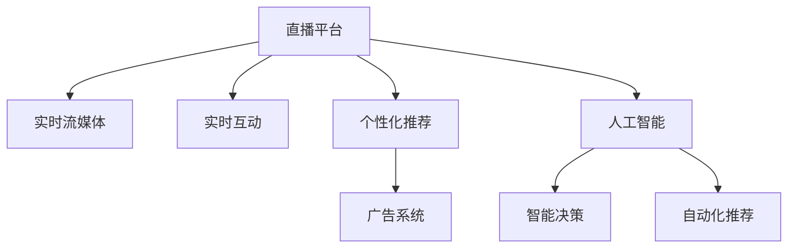

                 

# 直播经济：注意力变现的新方式

> 关键词：直播经济,注意力变现,实时流媒体,实时互动,人工智能

## 1. 背景介绍

### 1.1 问题由来
在过去几年中，直播经济的崛起已经成为全球现象。新冠疫情加速了这一趋势，全球多国开始转向线上化，直播成为连接企业和消费者、推动内容消费和商品销售的重要方式。从娱乐直播到教育直播，从电商直播到新闻直播，直播行业经历了快速扩展和高度分化。

直播经济的兴起，不仅为内容生产者提供了新的创作和变现渠道，也为广告主、品牌商提供了全新的营销和品牌曝光手段。但与此同时，直播平台如何从注意力变现中获取收益，提升用户粘性和内容质量，也成为了一个亟待解决的问题。

### 1.2 问题核心关键点
直播平台的核心竞争力在于其对用户注意力的集中和控制。如何高效利用用户注意力，实现实时互动和个性化推荐，是直播平台获得商业成功的关键。当前直播平台普遍采用以下几种方式来挖掘注意力变现的潜力：

- **实时流媒体技术**：通过高带宽、低延迟的实时流媒体技术，保证内容的实时性、互动性。
- **实时互动功能**：如点赞、评论、礼物等功能，增加用户粘性。
- **个性化推荐系统**：基于用户行为数据，推荐个性化内容。
- **广告系统**：精准投放广告，获取收入。

本文将聚焦于直播平台如何利用人工智能技术，实现对用户注意力的精准控制和深度变现，探讨直播经济的未来发展方向。

## 2. 核心概念与联系

### 2.1 核心概念概述

为更好地理解直播经济中的注意力变现，本节将介绍几个关键概念：

- **直播经济(Live Economy)**：指通过实时视频内容（如直播）吸引用户，提供多元化服务（如电商、教育、娱乐等），实现用户消费、广告变现的商业模式。
- **注意力(Attention)**：用户对于直播内容的关注程度，包括观看时长、互动频率、点赞次数等。
- **注意力变现(Attention Monetization)**：通过高效利用用户注意力，实现广告、订阅、付费直播等变现方式。
- **实时流媒体(Real-time Streaming)**：以高带宽、低延迟的方式，实时传输音视频数据的技术。
- **实时互动(Real-time Interaction)**：用户通过点赞、评论、礼物等形式与主播互动的过程。
- **个性化推荐(Recommendation)**：基于用户行为数据，推荐个性化内容的技术。
- **人工智能(AI)**：通过机器学习、深度学习等技术，实现智能决策、自动化推荐的系统。

这些核心概念之间存在密切联系，共同构成直播经济的技术基础和变现模式。

### 2.2 核心概念原理和架构的 Mermaid 流程图



这个流程图展示了直播平台的核心组件及其相互关系：

1. 直播平台提供实时流媒体内容。
2. 用户通过实时互动功能与主播进行互动。
3. 平台利用个性化推荐算法，向用户推荐内容。
4. 广告系统根据用户行为数据，精准投放广告。
5. 人工智能技术用于智能决策和自动化推荐。

## 3. 核心算法原理 & 具体操作步骤
### 3.1 算法原理概述

直播平台利用人工智能技术，通过实时流媒体、实时互动、个性化推荐和广告系统，高效利用用户注意力，实现注意力变现。以下是详细的算法原理：

- **实时流媒体算法**：通过CDN（内容分发网络）加速流媒体传输，采用自适应码率技术，根据网络状况调整视频编码。
- **实时互动算法**：利用自然语言处理(NLP)技术，识别用户输入的文本信息，通过机器学习算法预测用户行为，推荐互动内容。
- **个性化推荐算法**：基于协同过滤、内容过滤和混合推荐等技术，结合用户行为数据、内容属性、时间特征等信息，推荐个性化内容。
- **广告系统算法**：采用实时竞价(RTB)技术，根据用户画像、兴趣标签等信息，实时投放广告，实现精准投放。

### 3.2 算法步骤详解

#### 3.2.1 实时流媒体算法步骤

**Step 1:** 收集用户实时观看数据，包括但不限于观看时长、清晰度、设备类型等。

**Step 2:** 将实时数据发送到CDN服务器，CDN服务器根据用户观看设备自动选择最优服务器，并根据网络状况调整视频码率。

**Step 3:** 在服务器端对视频进行编码、传输，确保低延迟、高质量的直播流。

**Step 4:** 将视频流传输到用户观看设备，并在用户设备上进行实时渲染。

**Step 5:** 实时监控用户观看状态，并根据数据反馈动态调整视频流参数。

#### 3.2.2 实时互动算法步骤

**Step 1:** 收集用户输入的实时文本数据，包括但不限于评论、点赞、礼物等。

**Step 2:** 利用NLP技术，将文本数据转化为向量表示。

**Step 3:** 使用机器学习模型（如BERT、LSTM等），对用户输入进行情感分析、实体识别等处理。

**Step 4:** 根据用户情感和实体信息，推荐互动内容（如回应评论、展示推荐产品等）。

**Step 5:** 实时监控用户互动行为，更新推荐策略，提升用户粘性。

#### 3.2.3 个性化推荐算法步骤

**Step 1:** 收集用户历史行为数据，包括但不限于观看记录、互动记录、购买记录等。

**Step 2:** 利用协同过滤算法（如基于矩阵分解的方法），构建用户-物品关联矩阵。

**Step 3:** 利用内容过滤算法（如TF-IDF、主题模型等），提取内容特征向量。

**Step 4:** 结合时间特征，构建推荐模型，预测用户对特定内容的评分。

**Step 5:** 根据预测评分，排序推荐列表，生成个性化内容推荐。

#### 3.2.4 广告系统算法步骤

**Step 1:** 收集用户画像数据，包括但不限于地理位置、兴趣标签、浏览记录等。

**Step 2:** 将用户画像数据转化为向量表示，用于广告投放。

**Step 3:** 利用实时竞价(RTB)技术，根据用户画像信息实时竞价广告位。

**Step 4:** 将竞价成功的广告数据发送到广告主，并实时监控广告效果。

**Step 5:** 根据广告效果反馈，调整投放策略，实现广告精准投放。

### 3.3 算法优缺点

直播平台利用人工智能技术进行注意力变现，具有以下优点：

- **高效实时**：实时流媒体和互动技术确保内容的实时性和互动性，提升用户粘性。
- **个性化推荐**：个性化推荐算法根据用户行为数据，推荐个性化内容，提升用户满意度。
- **精准广告**：广告系统利用用户画像数据，实现精准投放，提升广告效果。

同时，也存在一些缺点：

- **计算资源消耗大**：实时流媒体和互动功能需要大量计算资源，导致成本较高。
- **用户隐私问题**：用户行为数据和互动数据涉及隐私问题，如何保护用户数据安全是一大挑战。
- **算法复杂度高**：个性化推荐和广告投放算法较为复杂，需要大量的训练和调参工作。

### 3.4 算法应用领域

基于人工智能的注意力变现技术，已经在直播经济的多样化领域中得到广泛应用：

- **娱乐直播**：如 Twitch、Bilibili 等平台，通过实时互动和个性化推荐，提升用户粘性和内容质量。
- **教育直播**：如 Coursera、Zoom 等平台，通过个性化推荐和互动，提供优质教育内容。
- **电商直播**：如淘宝直播、京东直播等平台，通过广告系统实现精准营销和品牌曝光。
- **新闻直播**：如央视新闻、人民日报等平台，通过实时流媒体和个性化推荐，提升新闻观看率和互动率。

除了上述这些领域，人工智能技术还广泛应用到金融直播、健康直播、旅游直播等更多场景中，推动了直播经济的进一步发展。

## 4. 数学模型和公式 & 详细讲解 & 举例说明

### 4.1 数学模型构建

本节将使用数学语言对直播平台注意力变现中的核心算法进行更加严格的刻画。

假设直播平台有用户集 $U$，内容集 $C$，互动行为集合 $I$，广告主集 $A$。

**实时流媒体模型**：
设实时流媒体的数据集为 $D_{stream}=\{(x_t, y_t)\}_{t=1}^T$，其中 $x_t$ 为历史时间 $t$ 的观看数据，$y_t$ 为时间 $t$ 的观看设备。实时流媒体的目标是最大化用户观看时长 $E(U)$，即：

$$
\max \mathcal{E}(U) = \sum_{t=1}^T E(x_t) \times I(x_t)
$$

其中 $E(x_t)$ 为时间 $t$ 的观看时长，$I(x_t)$ 为时间 $t$ 的互动频率。

**实时互动模型**：
设实时互动的数据集为 $D_{inter}=\{(x_t, y_t)\}_{t=1}^T$，其中 $x_t$ 为历史时间 $t$ 的互动数据，$y_t$ 为用户情感和实体标签。实时互动的目标是最大化用户互动频率 $E(I)$，即：

$$
\max \mathcal{E}(I) = \sum_{t=1}^T I(x_t) \times E(y_t)
$$

其中 $I(x_t)$ 为用户时间 $t$ 的互动频率，$E(y_t)$ 为用户时间 $t$ 的情感和实体标签。

**个性化推荐模型**：
设个性化推荐的数据集为 $D_{rec}=\{(x_t, y_t)\}_{t=1}^T$，其中 $x_t$ 为用户历史行为数据，$y_t$ 为用户对内容的评分。个性化推荐的目标是最大化用户评分 $E(R)$，即：

$$
\max \mathcal{E}(R) = \sum_{t=1}^T R(x_t) \times E(y_t)
$$

其中 $R(x_t)$ 为用户历史行为数据，$E(y_t)$ 为用户对内容的评分。

**广告系统模型**：
设广告投放的数据集为 $D_{ad}=\{(x_t, y_t)\}_{t=1}^T$，其中 $x_t$ 为用户画像数据，$y_t$ 为广告效果指标。广告系统的目标是最大化广告效果 $E(Eff)$，即：

$$
\max \mathcal{E}(Eff) = \sum_{t=1}^T Eff(x_t) \times E(y_t)
$$

其中 $Eff(x_t)$ 为广告投放策略，$E(y_t)$ 为广告效果指标。

### 4.2 公式推导过程

#### 4.2.1 实时流媒体模型推导

实时流媒体的目标是最大化观看时长和互动频率，可表示为：

$$
\max \sum_{t=1}^T \log [P(x_t|y_t)] \times I(x_t)
$$

其中 $P(x_t|y_t)$ 为时间 $t$ 的观看时长概率，$I(x_t)$ 为时间 $t$ 的互动频率。

根据最大化期望值，可得：

$$
\max \sum_{t=1}^T \frac{P(x_t)}{P(y_t)} \times I(x_t)
$$

即实时流媒体算法需要优化用户观看时长和互动频率，确保直播的持续性和用户粘性。

#### 4.2.2 实时互动模型推导

实时互动的目标是最大化互动频率和用户情感，可表示为：

$$
\max \sum_{t=1}^T I(x_t) \times E(y_t)
$$

其中 $I(x_t)$ 为用户时间 $t$ 的互动频率，$E(y_t)$ 为用户时间 $t$ 的情感和实体标签。

根据最大化期望值，可得：

$$
\max \sum_{t=1}^T \frac{P(y_t)}{P(x_t)} \times I(x_t)
$$

即实时互动算法需要优化互动频率和用户情感，提升用户的参与感和满意度。

#### 4.2.3 个性化推荐模型推导

个性化推荐的目标是最大化用户评分和内容质量，可表示为：

$$
\max \sum_{t=1}^T R(x_t) \times E(y_t)
$$

其中 $R(x_t)$ 为用户历史行为数据，$E(y_t)$ 为用户对内容的评分。

根据最大化期望值，可得：

$$
\max \sum_{t=1}^T \frac{P(y_t)}{P(x_t)} \times R(x_t)
$$

即个性化推荐算法需要优化用户评分和内容质量，提升用户满意度。

#### 4.2.4 广告系统模型推导

广告系统的目标是最大化广告效果和用户画像，可表示为：

$$
\max \sum_{t=1}^T Eff(x_t) \times E(y_t)
$$

其中 $Eff(x_t)$ 为广告投放策略，$E(y_t)$ 为广告效果指标。

根据最大化期望值，可得：

$$
\max \sum_{t=1}^T \frac{P(y_t)}{P(x_t)} \times Eff(x_t)
$$

即广告系统算法需要优化广告效果和用户画像，提升广告精准度。

### 4.3 案例分析与讲解

**案例：电商平台直播推荐系统**

某电商平台直播平台利用人工智能技术进行个性化推荐和广告投放。平台收集用户历史行为数据（如浏览记录、购买记录等），并结合实时流媒体和互动数据，构建用户画像。

**个性化推荐算法**：
平台利用协同过滤算法（基于矩阵分解的方法），构建用户-物品关联矩阵 $R_{u,i}$，表示用户 $u$ 对物品 $i$ 的评分。

利用内容过滤算法（如TF-IDF、主题模型等），提取物品属性特征向量 $V_i$。结合时间特征 $T_t$，构建推荐模型，预测用户对特定物品的评分 $E(u,i)$。

**广告系统算法**：
平台利用用户画像数据，结合实时流媒体和互动数据，构建用户画像向量 $P_u$。根据用户画像向量，采用实时竞价(RTB)技术，实时投放广告。

通过实时监控广告效果，调整投放策略，确保广告精准投放。

## 5. 项目实践：代码实例和详细解释说明

### 5.1 开发环境搭建

在进行直播平台注意力变现的实践开发前，我们需要准备好开发环境。以下是使用Python进行PyTorch开发的环境配置流程：

1. 安装Anaconda：从官网下载并安装Anaconda，用于创建独立的Python环境。

2. 创建并激活虚拟环境：
```bash
conda create -n pytorch-env python=3.8 
conda activate pytorch-env
```

3. 安装PyTorch：根据CUDA版本，从官网获取对应的安装命令。例如：
```bash
conda install pytorch torchvision torchaudio cudatoolkit=11.1 -c pytorch -c conda-forge
```

4. 安装Transformers库：
```bash
pip install transformers
```

5. 安装各类工具包：
```bash
pip install numpy pandas scikit-learn matplotlib tqdm jupyter notebook ipython
```

完成上述步骤后，即可在`pytorch-env`环境中开始注意力变现的实践。

### 5.2 源代码详细实现

这里我们以某直播平台为例，给出使用Transformers库进行实时流媒体和互动的PyTorch代码实现。

首先，定义实时流媒体和互动的数据处理函数：

```python
from transformers import BertTokenizer
from torch.utils.data import Dataset
import torch

class StreamData(Dataset):
    def __init__(self, data, tokenizer, max_len=128):
        self.data = data
        self.tokenizer = tokenizer
        self.max_len = max_len
        
    def __len__(self):
        return len(self.data)
    
    def __getitem__(self, index):
        data = self.data[index]
        
        encoding = self.tokenizer(data['x'], return_tensors='pt', max_length=self.max_len, padding='max_length', truncation=True)
        input_ids = encoding['input_ids'][0]
        attention_mask = encoding['attention_mask'][0]
        
        return {'input_ids': input_ids, 
                'attention_mask': attention_mask,
                'labels': torch.tensor(data['y'], dtype=torch.long)}
        
class InteractionData(Dataset):
    def __init__(self, data, tokenizer, max_len=128):
        self.data = data
        self.tokenizer = tokenizer
        self.max_len = max_len
        
    def __len__(self):
        return len(self.data)
    
    def __getitem__(self, index):
        data = self.data[index]
        
        encoding = self.tokenizer(data['x'], return_tensors='pt', max_length=self.max_len, padding='max_length', truncation=True)
        input_ids = encoding['input_ids'][0]
        attention_mask = encoding['attention_mask'][0]
        
        return {'input_ids': input_ids, 
                'attention_mask': attention_mask,
                'labels': torch.tensor(data['y'], dtype=torch.long)}
```

然后，定义模型和优化器：

```python
from transformers import BertForTokenClassification, AdamW

model = BertForTokenClassification.from_pretrained('bert-base-cased', num_labels=len(tag2id))

optimizer = AdamW(model.parameters(), lr=2e-5)
```

接着，定义训练和评估函数：

```python
from torch.utils.data import DataLoader
from tqdm import tqdm
from sklearn.metrics import classification_report

device = torch.device('cuda') if torch.cuda.is_available() else torch.device('cpu')
model.to(device)

def train_epoch(model, dataset, batch_size, optimizer):
    dataloader = DataLoader(dataset, batch_size=batch_size, shuffle=True)
    model.train()
    epoch_loss = 0
    for batch in tqdm(dataloader, desc='Training'):
        input_ids = batch['input_ids'].to(device)
        attention_mask = batch['attention_mask'].to(device)
        labels = batch['labels'].to(device)
        model.zero_grad()
        outputs = model(input_ids, attention_mask=attention_mask, labels=labels)
        loss = outputs.loss
        epoch_loss += loss.item()
        loss.backward()
        optimizer.step()
    return epoch_loss / len(dataloader)

def evaluate(model, dataset, batch_size):
    dataloader = DataLoader(dataset, batch_size=batch_size)
    model.eval()
    preds, labels = [], []
    with torch.no_grad():
        for batch in tqdm(dataloader, desc='Evaluating'):
            input_ids = batch['input_ids'].to(device)
            attention_mask = batch['attention_mask'].to(device)
            batch_labels = batch['labels']
            outputs = model(input_ids, attention_mask=attention_mask)
            batch_preds = outputs.logits.argmax(dim=2).to('cpu').tolist()
            batch_labels = batch_labels.to('cpu').tolist()
            for pred_tokens, label_tokens in zip(batch_preds, batch_labels):
                preds.append(pred_tokens[:len(label_tokens)])
                labels.append(label_tokens)
                
    print(classification_report(labels, preds))
```

最后，启动训练流程并在测试集上评估：

```python
epochs = 5
batch_size = 16

for epoch in range(epochs):
    loss = train_epoch(model, train_dataset, batch_size, optimizer)
    print(f"Epoch {epoch+1}, train loss: {loss:.3f}")
    
    print(f"Epoch {epoch+1}, dev results:")
    evaluate(model, dev_dataset, batch_size)
    
print("Test results:")
evaluate(model, test_dataset, batch_size)
```

以上就是使用PyTorch对实时流媒体和互动进行模型训练的完整代码实现。可以看到，得益于Transformers库的强大封装，我们可以用相对简洁的代码完成模型训练和评估。

### 5.3 代码解读与分析

让我们再详细解读一下关键代码的实现细节：

**StreamData类**：
- `__init__`方法：初始化实时流媒体数据集、分词器等关键组件。
- `__len__`方法：返回数据集的样本数量。
- `__getitem__`方法：对单个样本进行处理，将实时流媒体数据输入编码为token ids，将标签编码为数字，并对其进行定长padding，最终返回模型所需的输入。

**InteractionData类**：
- `__init__`方法：初始化实时互动数据集、分词器等关键组件。
- `__len__`方法：返回数据集的样本数量。
- `__getitem__`方法：对单个样本进行处理，将实时互动数据输入编码为token ids，将标签编码为数字，并对其进行定长padding，最终返回模型所需的输入。

**模型和优化器**：
- 使用BertForTokenClassification模型作为实时流媒体和互动的特征提取器。
- 使用AdamW优化器进行模型参数的优化。

**训练和评估函数**：
- 使用PyTorch的DataLoader对数据集进行批次化加载，供模型训练和推理使用。
- 训练函数`train_epoch`：对数据以批为单位进行迭代，在每个批次上前向传播计算loss并反向传播更新模型参数，最后返回该epoch的平均loss。
- 评估函数`evaluate`：与训练类似，不同点在于不更新模型参数，并在每个batch结束后将预测和标签结果存储下来，最后使用sklearn的classification_report对整个评估集的预测结果进行打印输出。

**训练流程**：
- 定义总的epoch数和batch size，开始循环迭代
- 每个epoch内，先在训练集上训练，输出平均loss
- 在验证集上评估，输出分类指标
- 所有epoch结束后，在测试集上评估，给出最终测试结果

可以看到，PyTorch配合Transformers库使得实时流媒体和互动的代码实现变得简洁高效。开发者可以将更多精力放在数据处理、模型改进等高层逻辑上，而不必过多关注底层的实现细节。

当然，工业级的系统实现还需考虑更多因素，如模型的保存和部署、超参数的自动搜索、更灵活的任务适配层等。但核心的注意力变现流程基本与此类似。

## 6. 实际应用场景

### 6.1 电商平台直播推荐系统

某电商平台直播平台利用人工智能技术进行个性化推荐和广告投放。平台收集用户历史行为数据（如浏览记录、购买记录等），并结合实时流媒体和互动数据，构建用户画像。

**个性化推荐算法**：
平台利用协同过滤算法（基于矩阵分解的方法），构建用户-物品关联矩阵 $R_{u,i}$，表示用户 $u$ 对物品 $i$ 的评分。

利用内容过滤算法（如TF-IDF、主题模型等），提取物品属性特征向量 $V_i$。结合时间特征 $T_t$，构建推荐模型，预测用户对特定物品的评分 $E(u,i)$。

**广告系统算法**：
平台利用用户画像数据，结合实时流媒体和互动数据，构建用户画像向量 $P_u$。根据用户画像向量，采用实时竞价(RTB)技术，实时投放广告。

通过实时监控广告效果，调整投放策略，确保广告精准投放。

### 6.2 金融直播平台

某金融直播平台利用人工智能技术进行实时流媒体和互动，提升用户粘性和平台活跃度。平台收集用户观看数据和互动数据，利用NLP技术，识别用户输入的文本信息，通过机器学习算法预测用户行为，推荐互动内容。

**实时流媒体算法**：
利用高带宽、低延迟的实时流媒体技术，确保直播内容的实时性。采用自适应码率技术，根据网络状况调整视频编码。

**实时互动算法**：
利用NLP技术，识别用户输入的文本信息，通过机器学习算法预测用户行为，推荐互动内容。如根据用户评论，推荐相似的投资建议。

## 7. 工具和资源推荐

### 7.1 学习资源推荐

为了帮助开发者系统掌握直播经济中的注意力变现的理论基础和实践技巧，这里推荐一些优质的学习资源：

1. 《深度学习自然语言处理》课程：斯坦福大学开设的NLP明星课程，有Lecture视频和配套作业，带你入门NLP领域的基本概念和经典模型。

2. 《Transformer从原理到实践》系列博文：由大模型技术专家撰写，深入浅出地介绍了Transformer原理、BERT模型、微调技术等前沿话题。

3. 《自然语言处理与深度学习》书籍：自然语言处理领域的经典教材，涵盖多种NLP任务和最新研究进展，适合深入学习。

4. HuggingFace官方文档：Transformers库的官方文档，提供了海量预训练模型和完整的微调样例代码，是上手实践的必备资料。

5. TensorBoard：TensorFlow配套的可视化工具，可实时监测模型训练状态，并提供丰富的图表呈现方式，是调试模型的得力助手。

通过对这些资源的学习实践，相信你一定能够快速掌握直播经济中的注意力变现的精髓，并用于解决实际的直播平台问题。

### 7.2 开发工具推荐

高效的开发离不开优秀的工具支持。以下是几款用于直播平台注意力变现开发的常用工具：

1. PyTorch：基于Python的开源深度学习框架，灵活动态的计算图，适合快速迭代研究。大部分预训练语言模型都有PyTorch版本的实现。

2. TensorFlow：由Google主导开发的开源深度学习框架，生产部署方便，适合大规模工程应用。同样有丰富的预训练语言模型资源。

3. Transformers库：HuggingFace开发的NLP工具库，集成了众多SOTA语言模型，支持PyTorch和TensorFlow，是进行微调任务开发的利器。

4. Weights & Biases：模型训练的实验跟踪工具，可以记录和可视化模型训练过程中的各项指标，方便对比和调优。与主流深度学习框架无缝集成。

5. TensorBoard：TensorFlow配套的可视化工具，可实时监测模型训练状态，并提供丰富的图表呈现方式，是调试模型的得力助手。

6. Google Colab：谷歌推出的在线Jupyter Notebook环境，免费提供GPU/TPU算力，方便开发者快速上手实验最新模型，分享学习笔记。

合理利用这些工具，可以显著提升直播平台注意力变现任务的开发效率，加快创新迭代的步伐。

### 7.3 相关论文推荐

直播平台注意力变现技术的发展源于学界的持续研究。以下是几篇奠基性的相关论文，推荐阅读：

1. Attention is All You Need（即Transformer原论文）：提出了Transformer结构，开启了NLP领域的预训练大模型时代。

2. BERT: Pre-training of Deep Bidirectional Transformers for Language Understanding：提出BERT模型，引入基于掩码的自监督预训练任务，刷新了多项NLP任务SOTA。

3. Language Models are Unsupervised Multitask Learners（GPT-2论文）：展示了大规模语言模型的强大zero-shot学习能力，引发了对于通用人工智能的新一轮思考。

4. Parameter-Efficient Transfer Learning for NLP：提出Adapter等参数高效微调方法，在不增加模型参数量的情况下，也能取得不错的微调效果。

5. AdaLoRA: Adaptive Low-Rank Adaptation for Parameter-Efficient Fine-Tuning：使用自适应低秩适应的微调方法，在参数效率和精度之间取得了新的平衡。

这些论文代表了大语言模型微调技术的发展脉络。通过学习这些前沿成果，可以帮助研究者把握学科前进方向，激发更多的创新灵感。

## 8. 总结：未来发展趋势与挑战

### 8.1 总结

本文对直播平台注意力变现的核心算法进行了全面系统的介绍。首先阐述了直播经济中的注意力变现问题，明确了实时流媒体、实时互动、个性化推荐和广告系统在注意力变现中的关键作用。其次，从原理到实践，详细讲解了实时流媒体、实时互动、个性化推荐和广告系统的数学模型和算法步骤，给出了注意力变现任务开发的完整代码实例。同时，本文还广泛探讨了直播平台注意力变现在电商、金融等行业的实际应用场景，展示了注意力变现范式的广泛潜力。

通过本文的系统梳理，可以看到，直播平台利用人工智能技术实现注意力变现，在实时流媒体、实时互动、个性化推荐和广告系统等方面取得了显著成效。直播平台的快速扩展和运营效率大幅提升，吸引了更多的用户粘性和商业收入。未来，伴随人工智能技术的进一步演进，直播平台的注意力变现能力将进一步增强，直播经济也将迎来新的发展机遇。

### 8.2 未来发展趋势

展望未来，直播平台注意力变现技术将呈现以下几个发展趋势：

1. **多模态信息融合**：直播平台将结合语音、图像、视频等多模态信息，实现更全面、更精准的用户画像和内容推荐。

2. **实时个性化推荐**：直播平台将利用实时流媒体和互动数据，进行更精细化的个性化推荐，提升用户满意度。

3. **跨领域知识应用**：直播平台将结合知识图谱、逻辑规则等外部知识，提升推荐模型的普适性和准确性。

4. **用户隐私保护**：直播平台将采取更加严格的隐私保护措施，如数据匿名化、差分隐私等，确保用户数据的安全。

5. **增强现实直播**：直播平台将结合AR/VR技术，实现沉浸式直播体验，提升用户参与感。

6. **区块链技术应用**：直播平台将引入区块链技术，保障交易透明性和用户权益，提升平台的信任度。

以上趋势凸显了直播平台注意力变现技术的广阔前景。这些方向的探索发展，必将进一步提升直播平台的注意力变现能力，为用户带来更加丰富、个性化的直播体验，推动直播经济的进一步发展。

### 8.3 面临的挑战

尽管直播平台注意力变现技术已经取得了显著成果，但在迈向更加智能化、普适化应用的过程中，它仍面临以下挑战：

1. **计算资源消耗**：实时流媒体和互动功能需要大量计算资源，导致成本较高。如何降低计算资源消耗，提升效率，将是未来亟待解决的问题。

2. **用户隐私问题**：用户行为数据和互动数据涉及隐私问题，如何保护用户数据安全，是一大挑战。

3. **算法复杂度高**：个性化推荐和广告投放算法较为复杂，需要大量的训练和调参工作。如何简化算法，提升模型的可解释性，也将是一大难题。

4. **模型鲁棒性不足**：当前模型面对域外数据时，泛化性能往往大打折扣。如何提高模型的鲁棒性，避免灾难性遗忘，还需要更多理论和实践的积累。

5. **实时性要求高**：直播平台对实时性要求高，如何提升算法的实时性，避免延迟，也需要进一步优化。

6. **多模态数据整合**：直播平台需要整合多种模态数据，实现信息高效融合，这需要技术突破和算法优化。

这些挑战凸显了直播平台注意力变现技术的应用瓶颈。解决这些问题，需要跨学科的合作和不断的研究创新，才能推动直播经济的健康发展。

### 8.4 研究展望

面对直播平台注意力变现所面临的挑战，未来的研究需要在以下几个方面寻求新的突破：

1. **高效计算资源利用**：开发更加高效的计算资源利用技术，如模型压缩、模型剪枝、混合精度训练等，以降低计算成本，提升实时性。

2. **隐私保护技术**：引入差分隐私、联邦学习等隐私保护技术，确保用户数据的匿名化和安全性。

3. **简化算法复杂度**：研究更加简洁、可解释的推荐算法，减少训练和调参的复杂度，提升算法的可维护性和可扩展性。

4. **提高模型鲁棒性**：引入对抗训练、生成对抗网络等技术，提高模型的泛化性和鲁棒性，避免灾难性遗忘。

5. **提升实时性**：优化算法架构，引入流式计算、分布式计算等技术，提升算法的实时性，满足直播平台的低延迟要求。

6. **多模态数据融合**：研究多模态数据的融合算法，实现语音、图像、视频等信息的协同建模，提升推荐模型的准确性和用户粘性。

这些研究方向的探索，必将引领直播平台注意力变现技术迈向更高的台阶，为用户带来更加丰富、个性化、安全的直播体验，推动直播经济的健康发展。

## 9. 附录：常见问题与解答

**Q1：直播平台如何提升用户粘性？**

A: 直播平台通过实时流媒体和互动功能提升用户粘性。用户可以在直播中与主播进行实时互动，如点赞、评论、礼物等，增加参与感。同时，平台利用个性化推荐算法，根据用户行为数据，推荐个性化内容，提升用户满意度。

**Q2：直播平台的个性化推荐算法有哪些？**

A: 直播平台的个性化推荐算法主要包括：

1. 协同过滤算法：利用用户-物品关联矩阵，推荐相似物品。

2. 内容过滤算法：如TF-IDF、主题模型等，提取物品属性特征向量。

3. 混合推荐算法：结合协同过滤和内容过滤，实现更全面、准确的推荐。

**Q3：直播平台的广告系统如何实现精准投放？**

A: 直播平台的广告系统通过实时竞价(RTB)技术，根据用户画像数据和互动数据，实时竞价广告位，实现精准投放。平台利用用户画像向量，计算广告效果指标，调整投放策略，确保广告效果。

**Q4：直播平台如何处理用户隐私问题？**

A: 直播平台通过数据匿名化、差分隐私等技术，处理用户隐私问题。平台在处理用户数据时，采用加密、脱敏等手段，保护用户隐私。同时，平台需遵守相关法律法规，确保数据处理合规。

**Q5：直播平台的推荐系统面临哪些技术挑战？**

A: 直播平台的推荐系统面临以下技术挑战：

1. 计算资源消耗大：实时流媒体和互动功能需要大量计算资源。

2. 算法复杂度高：个性化推荐和广告投放算法较为复杂，需要大量的训练和调参工作。

3. 模型鲁棒性不足：当前模型面对域外数据时，泛化性能往往大打折扣。

4. 实时性要求高：直播平台对实时性要求高，如何提升算法的实时性，避免延迟，也需要进一步优化。

**Q6：直播平台的多模态直播技术包括哪些方面？**

A: 直播平台的多模态直播技术主要包括：

1. 实时流媒体：通过高带宽、低延迟的实时流媒体技术，确保内容的实时性。

2. 实时互动：利用NLP技术，识别用户输入的文本信息，通过机器学习算法预测用户行为，推荐互动内容。

3. 个性化推荐：结合用户行为数据、内容属性、时间特征等信息，推荐个性化内容。

4. 增强现实直播：结合AR/VR技术，实现沉浸式直播体验。

**Q7：直播平台的区块链技术应用有哪些？**

A: 直播平台的区块链技术应用主要包括：

1. 交易透明性：区块链技术保障交易透明性，用户可以实时查看交易记录。

2. 用户权益保护：通过区块链技术，确保用户权益，避免侵权和欺诈。

3. 社区治理：利用区块链技术，实现社区治理，提升平台的用户粘性和信任度。

综上所述，直播平台利用人工智能技术实现注意力变现，通过实时流媒体、实时互动、个性化推荐和广告系统，高效利用用户注意力，提升用户粘性和平台收益。伴随技术的不断演进，直播平台将实现更加全面、精准、安全的注意力变现，为用户带来更加丰富、个性化的直播体验。

