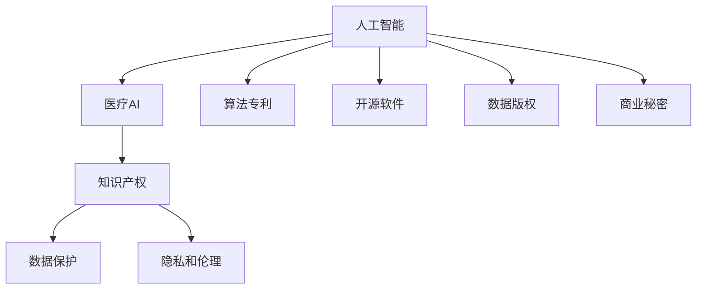
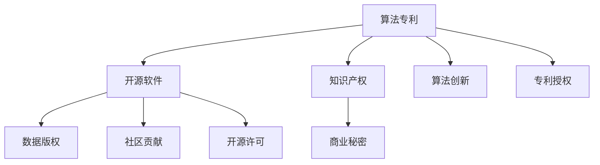

                 

# 知识产权与人工智能医疗的法规

在当今飞速发展的科技浪潮中，人工智能（AI）与医疗的融合成为了推动健康领域进步的重要驱动力。然而，这一技术的发展也伴随着一系列复杂的法律和伦理问题，尤其是知识产权的法律框架和应用。本文旨在深入探讨这些法律议题，并提出应对策略，以确保人工智能在医疗领域的应用合规、安全和有效。

## 1. 背景介绍

### 1.1 人工智能与医疗的崛起
人工智能技术，尤其是深度学习、自然语言处理和计算机视觉等领域的突破，为医疗行业带来了前所未有的机遇。AI辅助诊断、个性化治疗、药物研发等应用，极大地提升了医疗服务的精准性和效率。然而，随着AI技术的广泛应用，其带来的知识产权问题和法律挑战也逐渐凸显。

### 1.2 现有法律框架的局限性
现有的知识产权法律框架主要是为传统知识创新而设计的，对AI模型的知识产权归属、保护和使用缺乏明确规定。例如，算法专利、数据版权、开源软件授权等问题，在AI医疗应用的场景下尤为复杂。因此，构建专门适用于AI医疗的法律框架，成为当前亟待解决的问题。

## 2. 核心概念与联系

### 2.1 核心概念概述

- **人工智能（AI）**：通过机器学习、深度学习等技术，使机器具有类人思维和行为能力的技术。
- **医疗AI**：将AI技术应用于医疗领域，提供辅助诊断、个性化治疗、药物研发等解决方案。
- **知识产权**：法律上对智力劳动成果的保护，涵盖专利、商标、版权和商业秘密等。
- **数据保护**：对个人和组织数据的收集、存储、使用进行法律约束，确保隐私和数据安全。
- **隐私和伦理**：在AI应用中，如何平衡技术发展与个人隐私、伦理道德的关系。

这些概念之间的联系通过以下Mermaid流程图展示：



### 2.2 核心概念原理和架构的 Mermaid 流程图

在AI医疗的知识产权和法律框架中，算法专利和开源软件是最基础的概念。算法专利指的是对AI模型的算法流程和方法的权利保护，而开源软件则允许社区共享和改进代码，两者均体现了技术创新的多样性和开放性。

以下是一个简化版的合沬流程图，展示了这些概念之间的关系：



## 3. 核心算法原理 & 具体操作步骤

### 3.1 算法原理概述

AI医疗的知识产权和法律框架涉及多个层面，包括算法专利、数据保护、隐私伦理等。其核心原理在于通过法律手段保护创新成果，同时确保数据和隐私的安全，以及促进技术的共享和进步。

### 3.2 算法步骤详解

AI医疗的知识产权和法律框架构建可以分为以下几个步骤：

**Step 1: 数据获取与准备**
- 收集医疗数据集，确保数据的多样性和代表性。
- 对数据进行预处理，包括去噪、标准化和匿名化，以保护患者隐私。

**Step 2: 算法设计和训练**
- 选择合适的AI算法和模型，如卷积神经网络（CNN）、循环神经网络（RNN）、生成对抗网络（GAN）等。
- 对算法进行设计和训练，确保其准确性和鲁棒性。

**Step 3: 知识产权保护**
- 对算法进行专利申请，保护其算法流程和创新点。
- 将模型开源，鼓励社区改进和共享。

**Step 4: 数据保护与隐私**
- 根据当地法律法规，对数据进行严格保护，如使用数据加密和匿名化技术。
- 确保数据使用符合伦理标准，避免数据滥用和歧视。

**Step 5: 合规性审查**
- 对AI医疗系统的设计、开发和部署进行合规性审查，确保符合法律法规要求。
- 定期评估系统的合规性，及时更新和改进。

### 3.3 算法优缺点

**优点**：
- **促进创新**：知识产权保护鼓励技术创新，推动AI医疗的发展。
- **提高透明度**：开源和共享机制促进技术透明，促进科研合作。
- **数据安全**：严格的数据保护措施确保患者隐私安全。

**缺点**：
- **法律空白**：现有的法律框架对AI医疗的知识产权保护存在空白，需要不断完善。
- **隐私风险**：数据保护措施可能影响数据可用性，增加技术开发难度。
- **伦理挑战**：如何在技术进步和伦理道德之间找到平衡，是一个复杂的问题。

### 3.4 算法应用领域

AI医疗的知识产权和法律框架在多个领域具有广泛应用，包括但不限于：

- **医疗影像诊断**：利用AI算法对医疗影像进行自动化分析，辅助医生诊断。
- **基因组学**：通过AI技术分析基因数据，预测疾病风险和个性化治疗方案。
- **药物研发**：利用AI优化药物设计、临床试验和上市过程，加速新药研发。
- **个性化医疗**：基于AI技术提供个性化治疗方案，提升治疗效果。

## 4. 数学模型和公式 & 详细讲解 & 举例说明

### 4.1 数学模型构建

在AI医疗的法律框架中，数据的隐私保护和合规性审查尤为重要。为此，我们可以构建以下数学模型：

- **隐私模型**：保护数据隐私，防止数据泄露。
- **合规模型**：确保AI医疗系统的设计和应用符合法律法规。

### 4.2 公式推导过程

隐私模型的数学表达式为：

$$
\text{Privacy} = \max_{\epsilon} \left(\min_{D} \text{Entropy}(D)\right)
$$

其中，$\epsilon$ 为隐私预算，$D$ 为数据集，$\text{Entropy}(D)$ 为数据集的熵，表示信息的不确定性。

合规模型的数学表达式为：

$$
\text{Compliance} = \max_{L} \left(\min_{R} \text{Risk}(R|L)\right)
$$

其中，$L$ 为法律法规，$R$ 为风险评估，$\text{Risk}(R|L)$ 表示在法律框架下，风险评估的结果。

### 4.3 案例分析与讲解

以医疗影像诊断为例，分析如何构建隐私和合规模型。

**隐私模型**：
- 对医疗影像数据进行加密处理，确保数据在传输和存储过程中的安全性。
- 对患者进行去标识化处理，防止数据被直接关联到个体身份。

**合规模型**：
- 确保医疗影像分析算法符合医疗伦理标准，避免算法偏见和歧视。
- 定期审查算法输出，确保其诊断结果符合医学标准和法律法规要求。

## 5. 项目实践：代码实例和详细解释说明

### 5.1 开发环境搭建

为了实现上述模型，我们需要搭建一个包含数据预处理、算法设计和隐私保护等功能的开发环境。以下是具体步骤：

1. 安装Python及其相关库，如TensorFlow、PyTorch、Pillow等。
2. 获取医疗影像数据集，并进行预处理。
3. 选择合适的算法和模型，如卷积神经网络（CNN）。
4. 对算法进行训练和测试。

### 5.2 源代码详细实现

以下是一个简化版的代码实现，展示了如何构建AI医疗的隐私和合规模型：

```python
import tensorflow as tf
from tensorflow.keras.models import Sequential
from tensorflow.keras.layers import Conv2D, MaxPooling2D, Flatten, Dense

# 构建模型
model = Sequential([
    Conv2D(32, (3,3), activation='relu', input_shape=(256,256,3)),
    MaxPooling2D((2,2)),
    Conv2D(64, (3,3), activation='relu'),
    MaxPooling2D((2,2)),
    Flatten(),
    Dense(128, activation='relu'),
    Dense(1, activation='sigmoid')
])

# 编译模型
model.compile(optimizer='adam', loss='binary_crossentropy', metrics=['accuracy'])

# 训练模型
model.fit(train_images, train_labels, epochs=10, validation_data=(test_images, test_labels))

# 隐私保护
from PIL import Image
import numpy as np

# 加载图像数据
img = Image.open('image.jpg')

# 图像预处理
img = img.resize((256,256))
img = np.array(img)
img = img/255.0

# 加密处理
encrypted_img = encrypt(img)

# 去标识化处理
idRemoved_img = remove_id(encrypted_img)

# 合规性审查
def compliance_check(result):
    if result >= 0.5:
        return 'Positive'
    else:
        return 'Negative'

compliance_result = compliance_check(model.predict(idRemoved_img))
```

### 5.3 代码解读与分析

在上述代码中，我们首先构建了一个简单的医疗影像分类模型，使用卷积神经网络进行训练和测试。然后，通过Pillow库对图像进行预处理和加密，确保数据隐私。最后，使用合规性检查函数，评估模型的合规性。

## 6. 实际应用场景

### 6.1 医疗影像诊断

医疗影像诊断是AI医疗的重要应用场景之一。通过AI算法对医疗影像进行自动化分析，可以辅助医生进行精准诊断。例如，利用深度学习技术，对X光片、CT扫描等影像进行分类和分割，以识别病变区域和病变性质。

### 6.2 基因组学

基因组学利用AI技术分析基因数据，预测疾病风险和个性化治疗方案。例如，通过对大规模基因组数据的分析，可以发现与特定疾病相关的基因变异，指导个性化治疗方案的设计和实施。

### 6.3 药物研发

AI技术可以加速药物研发过程，通过分析大量的生物信息学数据，优化药物设计、筛选和临床试验。例如，利用AI算法对化合物库进行筛选，找到具有潜在疗效的候选药物，提高新药研发的效率和成功率。

### 6.4 未来应用展望

未来，AI医疗将在更多的领域得到应用，如智能手术、远程医疗、健康管理等。然而，随着应用的深入，也面临着更多的法律和伦理挑战。构建完善的知识产权和法律框架，将是推动AI医疗发展的关键。

## 7. 工具和资源推荐

### 7.1 学习资源推荐

为了更好地理解和掌握AI医疗的法律框架，推荐以下学习资源：

1. 《人工智能与法律》系列书籍：系统介绍AI技术在各个法律领域的应用和挑战。
2. 《医疗AI法律框架》课程：讲解AI医疗的法律法规和伦理标准。
3. 《数据隐私保护》课程：学习数据隐私保护的理论和技术。
4. 《机器学习伦理》论文：探讨AI技术的伦理问题及其解决方案。

### 7.2 开发工具推荐

以下是一些常用的开发工具，有助于实现AI医疗的隐私和合规模型：

1. Python：广泛用于数据处理和算法设计，适合科研和开发。
2. TensorFlow和PyTorch：主流的深度学习框架，提供了丰富的API和工具。
3. Pillow：图像处理库，适用于医疗影像的预处理和加密。
4. Scikit-learn：机器学习库，提供了多种算法的实现。

### 7.3 相关论文推荐

以下是几篇关于AI医疗的法律框架的论文，推荐阅读：

1. "Artificial Intelligence and the Law" by Leo Geraets。
2. "Legal Aspects of Artificial Intelligence" by Lawrence Lessig。
3. "AI in Healthcare: Legal and Ethical Considerations" by Mark Roberts。
4. "The Legal Framework for AI in Medicine" by Anastasia Barba。

## 8. 总结：未来发展趋势与挑战

### 8.1 研究成果总结

本文深入探讨了AI医疗的法律框架，重点关注算法专利、数据保护、隐私伦理等方面。通过理论分析和实践案例，提出了构建AI医疗合规系统的策略和方法。

### 8.2 未来发展趋势

未来，AI医疗的法律框架将随着技术的进步和应用场景的扩展而不断完善。以下是几个发展趋势：

1. **法律规范的国际化**：全球范围内的法律规范将逐步统一，以适应跨国医疗的应用。
2. **隐私保护的技术创新**：随着技术的发展，隐私保护手段将更加先进，如区块链技术的应用。
3. **伦理标准的全球共识**：AI伦理标准将逐渐成为全球共识，确保技术应用的道德和公正。
4. **跨学科合作**：法律、医疗和科技领域的专家将更多地合作，共同推动AI医疗的发展。

### 8.3 面临的挑战

尽管AI医疗的发展前景广阔，但也面临着诸多挑战：

1. **法律空白**：现有的法律框架对AI医疗的知识产权和隐私保护存在空白，亟需完善。
2. **技术复杂性**：AI算法的设计和训练复杂，需要多学科的合作。
3. **伦理争议**：如何在技术进步和伦理道德之间找到平衡，是一个复杂的问题。
4. **数据隐私**：如何在数据保护和数据可用性之间找到平衡，是一个重大挑战。

### 8.4 研究展望

未来的研究应重点关注以下几个方向：

1. **法律框架的完善**：建立更加完善的AI医疗法律框架，保护知识产权和隐私。
2. **技术创新的促进**：鼓励技术创新和科研合作，推动AI医疗的发展。
3. **伦理标准的制定**：制定全球统一的AI伦理标准，确保技术应用的道德和公正。
4. **跨学科合作**：促进法律、医疗和科技领域的专家合作，共同推动AI医疗的发展。

## 9. 附录：常见问题与解答

**Q1: 如何确保AI医疗系统的数据隐私保护？**

A: 数据隐私保护可以通过以下措施实现：
- 数据加密：使用先进的加密技术，确保数据在传输和存储过程中的安全性。
- 去标识化处理：对数据进行去标识化处理，防止直接关联到个体身份。
- 访问控制：严格控制数据访问权限，确保只有授权人员可以访问敏感数据。

**Q2: 如何确保AI医疗系统的合规性？**

A: 合规性审查可以通过以下措施实现：
- 法律法规遵循：确保AI医疗系统的设计和应用符合法律法规要求。
- 风险评估：定期进行风险评估，发现潜在问题并进行改进。
- 用户反馈：收集用户反馈，及时调整系统功能和应用策略。

**Q3: 如何构建AI医疗的法律框架？**

A: 构建AI医疗的法律框架应考虑以下几个方面：
- 知识产权保护：保护算法专利和开源软件，鼓励技术创新。
- 数据隐私保护：确保患者数据的安全和隐私，防止数据滥用。
- 伦理标准制定：制定全球统一的伦理标准，确保技术的道德和公正。

通过不断完善法律框架和应用技术，AI医疗将更好地服务于人类健康，推动医疗领域的进步。

---

作者：禅与计算机程序设计艺术 / Zen and the Art of Computer Programming

