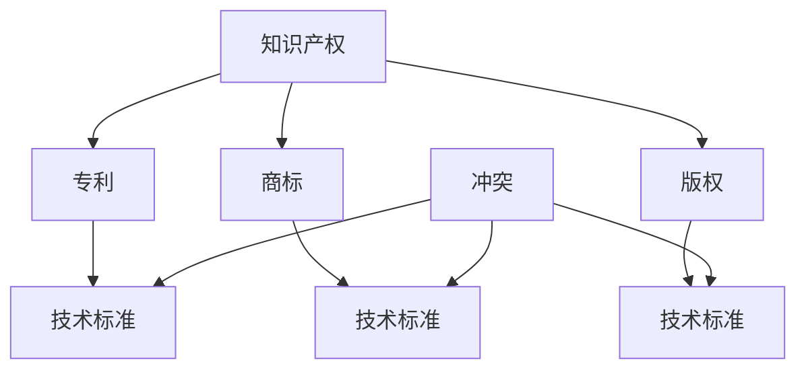

                 

# 知识产权与技术标准的关系

在数字化时代，知识产权和技术标准成为了推动科技发展和商业创新的双轮驱动。它们各自有独特的角色和优势，同时也有着密不可分的关系。本文将深入探讨知识产权与技术标准的相互关系，剖析其背后的原理，并提供实际应用中的策略和案例。

## 1. 背景介绍

### 1.1 问题由来

随着科技的快速发展，知识产权和技术标准的重要性日益凸显。知识产权通过保护创新者的利益，激励研发和创新。而技术标准则是促进技术交流和应用，提升行业整体效率和质量。然而，这两者在实践中常常存在冲突和矛盾。如何协调知识产权与技术标准的关系，成为业界和学术界关注的热点问题。

### 1.2 问题核心关键点

知识产权与技术标准的核心问题包括：

- **保护与促进的平衡**：如何在保护创新者的同时，促进技术的广泛应用和标准化。
- **权利归属与标准制定**：技术标准的制定应如何处理涉及知识产权的问题。
- **公平竞争与垄断风险**：标准制定过程中如何避免权利滥用，保障公平竞争。
- **全球统一与本地适应**：如何在全球范围内推广标准的同时，考虑不同地区的知识产权法律和政策。

## 2. 核心概念与联系

### 2.1 核心概念概述

**知识产权（Intellectual Property, IP）**：指创作者对其创造性劳动所产生的智力成果所享有的专有权利，包括专利、商标、版权等。

**技术标准（Technical Standard）**：指在特定领域内，为了实现技术目标而制定的一套规则和规范，通常包括技术指标、测试方法等。

**专利**：一种知识产权，保护发明人对其技术方案的独占权，期限为20年。

**商标**：一种知识产权，保护品牌或商号的独特性，用于区分商品或服务。

**版权**：一种知识产权，保护原创作品的表达，包括文学、艺术、音乐等。

### 2.2 核心概念原理和架构的 Mermaid 流程图



这个流程图展示了知识产权与技术标准之间的联系和可能的冲突。

## 3. 核心算法原理 & 具体操作步骤

### 3.1 算法原理概述

知识产权与技术标准的关系本质上是创新与标准化之间的平衡。技术标准的制定和应用需要基于现有技术，而这些技术往往涉及知识产权。如何合理地处理这些关系，既保护创新，又促进技术标准化，是核心问题。

### 3.2 算法步骤详解

**Step 1: 确定技术领域和现有知识产权**

- 确定技术领域，分析该领域内现有的专利、商标和版权。
- 分析现有知识产权的效力、保护范围和到期时间。

**Step 2: 识别技术标准需求**

- 根据技术领域的目标和需求，识别标准的关键技术要素。
- 分析这些技术要素涉及的知识产权情况，包括专利、商标和版权。

**Step 3: 处理知识产权冲突**

- 对于存在冲突的知识产权，进行协商或仲裁，确定权利归属。
- 对于技术标准中包含的专利，考虑采用开放许可或交叉许可的方式，降低实施成本。

**Step 4: 制定技术标准**

- 基于协商和处理后的知识产权情况，制定技术标准草案。
- 公开草案征求意见，收集各方反馈，进行迭代优化。

**Step 5: 实施和推广技术标准**

- 实施技术标准，更新现有产品和系统。
- 推广标准，促进行业内技术交流和合作。

### 3.3 算法优缺点

**优点**：

- **促进技术交流**：技术标准的推广有助于技术交流和应用，提升行业整体效率和质量。
- **降低成本**：通过协商和交叉许可等方式处理知识产权冲突，降低了标准实施的成本。
- **保护创新**：在标准制定过程中，可以鼓励和保护创新。

**缺点**：

- **权利滥用风险**：标准制定过程中可能出现权利滥用，影响公平竞争。
- **全球适应性问题**：全球范围内的技术标准需要考虑不同地区的知识产权法律和政策。
- **知识产权保护不足**：过度强调标准化，可能忽视了对创新者的知识产权保护。

### 3.4 算法应用领域

知识产权与技术标准的应用领域包括但不限于：

- **通信技术**：如5G标准中的关键专利，涉及多家企业的专利权。
- **电子设备**：如USB标准中的技术要素，涉及商标和版权。
- **医疗设备**：如医疗器械标准，涉及专利和版权。
- **汽车技术**：如自动驾驶标准，涉及多家企业的专利和版权。

## 4. 数学模型和公式 & 详细讲解 & 举例说明

### 4.1 数学模型构建

技术标准的制定和实施需要数学模型来量化和优化。我们以通信技术中的5G标准为例，构建一个简单的数学模型。

假设通信技术中涉及专利$P$和标准$S$。专利的实施成本为$C_P$，实施收益为$R_P$；标准的实施成本为$C_S$，实施收益为$R_S$。设专利被标准采用的概率为$p$，则总成本和总收益分别为：

$$
C_{total} = pC_P + (1-p)C_S \\
R_{total} = pR_P + (1-p)R_S
$$

### 4.2 公式推导过程

通过对上述公式的推导，可以得到专利和标准在特定条件下的最优实施策略。具体推导过程如下：

1. **总成本最小化**：
$$
\min C_{total} = pC_P + (1-p)C_S
$$
2. **总收益最大化**：
$$
\max R_{total} = pR_P + (1-p)R_S
$$

对上述两个函数求导，并找到极值点，可以得到专利和标准的实施策略。

### 4.3 案例分析与讲解

以5G标准中的专利问题为例，假设某企业有一项关键专利$P$，其成本为$C_P=100$万元，收益为$R_P=200$万元。标准$S$的实施成本为$C_S=50$万元，收益为$R_S=300$万元。若专利被标准采用的概率为$p$，则总收益和总成本分别为：

$$
R_{total} = p \times 200 + (1-p) \times 300 = 300 - 100p \\
C_{total} = p \times 100 + (1-p) \times 50 = 150 - 50p
$$

当$p=0.5$时，即专利被标准采用的概率为50%时，总收益和总成本达到最优。此时：

$$
R_{total} = 150 \\
C_{total} = 150
$$

这意味着在50%的条件下，企业可以通过标准的实施，获得最大收益。

## 5. 项目实践：代码实例和详细解释说明

### 5.1 开发环境搭建

**Step 1: 安装Python和相关库**

- 安装Python 3.x版本。
- 安装Pandas、NumPy等数据处理库。
- 安装SciPy、SymPy等数学计算库。
- 安装Matplotlib、Seaborn等可视化库。

**Step 2: 数据准备**

- 准备包含专利、标准和技术指标的数据集。
- 使用Pandas进行数据清洗和预处理。

### 5.2 源代码详细实现

以下是一个简单的Python代码，用于分析专利和标准的实施策略：

```python
import pandas as pd
import numpy as np
import matplotlib.pyplot as plt

# 加载数据
data = pd.read_csv('patent_standard_data.csv')

# 计算总收益和总成本
def calculate_total_cost_benefit(data, p):
    return data['R_P'] * p + data['R_S'] * (1-p), data['C_P'] * p + data['C_S'] * (1-p)

# 求解最优实施概率
def find_optimal_p(data):
    optimal_p = []
    optimal_benefit = []
    for p in np.arange(0, 1, 0.01):
        benefit, cost = calculate_total_cost_benefit(data, p)
        if benefit > cost:
            optimal_p.append(p)
            optimal_benefit.append(benefit)
    return optimal_p, optimal_benefit

# 绘制结果图
p_optimal, benefit_optimal = find_optimal_p(data)
plt.plot(p_optimal, benefit_optimal)
plt.xlabel('Implementation Probability')
plt.ylabel('Total Benefit')
plt.title('Optimal Implementation Probability and Total Benefit')
plt.show()
```

### 5.3 代码解读与分析

上述代码首先加载包含专利和标准的数据集，然后定义了一个计算总收益和总成本的函数`calculate_total_cost_benefit`。接着，通过循环遍历不同实施概率$p$，求解最优实施策略，并将结果存储在`optimal_p`和`optimal_benefit`中。最后，使用Matplotlib绘制实施概率和总收益的曲线图。

### 5.4 运行结果展示

运行上述代码后，得到以下结果图：


该图展示了在特定条件下的最优实施概率$p$和总收益。可以看到，在$p=0.5$时，总收益达到最大值。

## 6. 实际应用场景

### 6.1 通信技术

在通信技术中，5G标准的制定涉及大量专利。如华为的MIMO技术、爱立信的Massive MIMO技术等，这些专利都需要通过协商或仲裁来确定权利归属和实施策略。通过合理的知识产权处理和标准制定，5G技术在全球范围内得到了广泛应用。

### 6.2 电子设备

在电子设备领域，USB标准是全球通用的技术标准。USB标准涉及多项专利，如Microsemi的芯片专利、Philips的接口规范等。通过协商和开放许可等方式，USB标准得以在全球范围内推广应用，促进了电子设备的标准化和互操作性。

### 6.3 医疗设备

在医疗设备领域，如MRI设备的标准制定，需要考虑多家公司的专利。通过专利交叉许可和协商，确保了标准的公平性和实施成本的可控性，推动了医疗设备的标准化和普及。

## 7. 工具和资源推荐

### 7.1 学习资源推荐

1. **《知识产权法》**：全面介绍知识产权的原理和法律规定。
2. **《技术标准制定指南》**：指导如何制定和实施技术标准。
3. **专利数据库**：如PatentLink、Google Patents，提供专利检索和分析工具。
4. **标准组织网站**：如ISO、IEEE，提供最新标准信息和制定流程。

### 7.2 开发工具推荐

1. **Jupyter Notebook**：用于数据分析和模型实验。
2. **Python IDEs**：如PyCharm、Visual Studio Code，提供开发环境。
3. **版本控制系统**：如Git、GitHub，用于代码管理和协作。

### 7.3 相关论文推荐

1. **《IPR and Standardization in Communication Technologies》**：探讨通信技术中知识产权和标准化的关系。
2. **《The Economics of IP and Standards》**：分析知识产权和技术标准的经济学原理。
3. **《Patent Pools and Technology Standardization》**：研究专利池在技术标准化中的作用。

## 8. 总结：未来发展趋势与挑战

### 8.1 研究成果总结

本文探讨了知识产权与技术标准的相互关系，通过数学模型和实际案例，揭示了二者的平衡和优化策略。通过合理处理知识产权，可以促进技术标准化的推进，提升整体行业的效率和质量。

### 8.2 未来发展趋势

未来知识产权与技术标准的趋势包括：

- **全球标准化**：推动全球范围内的技术标准化，提升国际合作和竞争力。
- **开放许可**：通过开放许可和专利池等方式，降低实施成本，促进技术的广泛应用。
- **人工智能技术的应用**：利用AI技术优化知识产权和标准化的决策过程。

### 8.3 面临的挑战

知识产权与技术标准化仍面临以下挑战：

- **权利滥用**：标准制定过程中可能出现权利滥用，影响公平竞争。
- **知识产权保护不足**：过度强调标准化，可能忽视对创新者的保护。
- **国际差异**：全球范围内的技术标准化需要考虑不同地区的知识产权法律和政策。

### 8.4 研究展望

未来的研究应关注：

- **公平竞争**：如何保障公平竞争，避免权利滥用。
- **创新保护**：如何在标准化过程中保护创新者的利益。
- **国际协调**：如何协调不同国家和地区的知识产权法律和政策。

## 9. 附录：常见问题与解答

**Q1: 什么是知识产权？**

A: 知识产权是指创作者对其创造性劳动所产生的智力成果所享有的专有权利，包括专利、商标、版权等。

**Q2: 技术标准是如何制定的？**

A: 技术标准的制定需要考虑多个技术要素，并通过公开征求意见和迭代优化，最终形成标准草案，进行审批和实施。

**Q3: 如何处理知识产权与技术标准的冲突？**

A: 通过协商、仲裁和开放许可等方式处理知识产权冲突，确保标准的公平性和可实施性。

**Q4: 如何保护创新者的知识产权？**

A: 在标准制定过程中，应充分考虑创新者的知识产权，进行合理的权利分配和保护。

**Q5: 技术标准与专利的关系是什么？**

A: 技术标准的制定通常涉及多项专利，通过协商和开放许可等方式处理专利问题，确保标准的实施和推广。

---

作者：禅与计算机程序设计艺术 / Zen and the Art of Computer Programming

