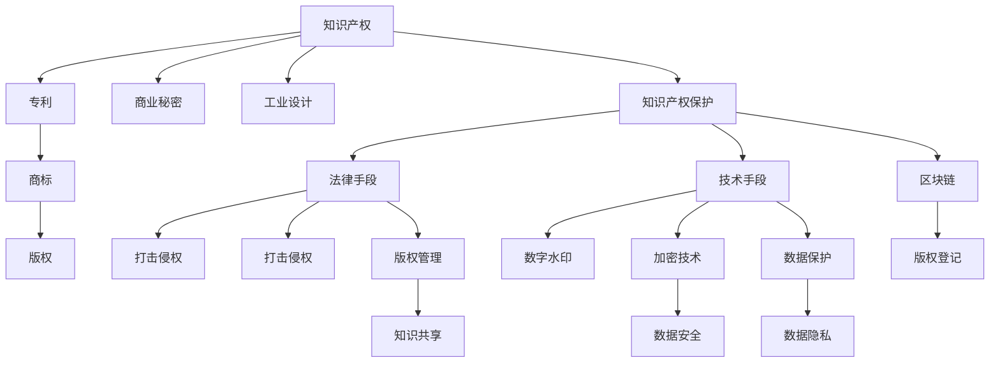

                 

## 1. 背景介绍

知识产权在数字时代面临严峻挑战，数字化技术的应用打破了传统的知识产权保护模式，对企业创新和产业发展带来了新的机遇和风险。本文将探讨数字时代知识产权的新特点、面临的挑战以及应对策略，为知识产权管理提供有益的参考。

## 2. 核心概念与联系

### 2.1 核心概念概述

- **知识产权**：包括专利、商标、版权、商业秘密、工业设计等，是企业创新能力的核心体现。
- **数字时代**：指以数字技术为核心的信息时代，包含大数据、云计算、人工智能、区块链等技术。
- **知识产权保护**：通过法律手段和技术手段，确保创新成果不被非法复制和盗用，保护创新者的利益。
- **数字侵权**：指通过数字化手段侵犯知识产权的行为，如在线盗版、数据盗用等。
- **知识共享**：在尊重版权的前提下，合理共享知识，促进技术进步和社会发展。

### 2.2 核心概念原理和架构的 Mermaid 流程图(Mermaid 流程节点中不要有括号、逗号等特殊字符)



## 3. 核心算法原理 & 具体操作步骤

### 3.1 算法原理概述

在数字时代，知识产权保护面临新的挑战，主要包括以下几个方面：

- **数据窃取和侵权**：数字化技术使得数据易被非法获取和复制。
- **网络盗版和侵权**：互联网的开放性增加了盗版和侵权的风险。
- **软件和硬件的交叉侵权**：数字技术和物理产品的融合，导致知识产权的交叉侵权问题。

### 3.2 算法步骤详解

**步骤1: 数据采集与预处理**

- **采集数据**：从互联网、社交媒体、数据库等多个渠道收集相关数据。
- **数据清洗**：去除噪声数据、异常数据，保证数据的准确性和完整性。

**步骤2: 数字水印嵌入**

- **选择算法**：根据数据类型和水印需求选择合适的数字水印算法。
- **嵌入水印**：将水印信息嵌入到原始数据中。
- **水印检测**：通过特定的算法检测水印信息。

**步骤3: 版权登记与保护**

- **版权登记**：在版权局进行版权登记，获得版权证明。
- **加密技术**：使用加密技术保护版权数据，防止非法访问和篡改。
- **区块链存储**：利用区块链技术进行版权数据的存储和传输，确保数据安全和透明。

**步骤4: 法律和政策支持**

- **制定法规**：完善知识产权法律法规，明确数字时代知识产权保护的新标准。
- **强化执法**：加强对数字侵权行为的打击，保护知识产权持有人的合法权益。
- **国际合作**：加强国际知识产权保护合作，共同应对数字侵权的挑战。

**步骤5: 技术创新与应用**

- **算法优化**：研究和优化数字水印、加密、区块链等技术，提升知识产权保护的效果。
- **平台建设**：建立知识产权保护平台，提供版权登记、监测、维权等服务。
- **知识共享**：在尊重版权的前提下，推动知识共享和开放创新，促进技术和文化的发展。

### 3.3 算法优缺点

**优点**：

- **技术手段多样化**：数字水印、加密、区块链等技术提供了多样化的知识产权保护手段。
- **实时性和动态性**：技术手段可以实时监测和保护知识产权，具有较高的动态性和灵活性。
- **跨领域应用**：数字技术和传统知识产权保护的融合，可以应用于多个领域。

**缺点**：

- **技术复杂性高**：数字水印、加密、区块链等技术需要较高的技术水平和专业知识。
- **成本高**：相关技术和平台建设需要较高的成本投入。
- **法律和政策配套不足**：现有法律法规和政策对数字时代知识产权保护的支持和配套不足。

### 3.4 算法应用领域

数字时代知识产权保护技术可以应用于多个领域，包括：

- **数字内容保护**：如音乐、电影、软件等数字内容的版权保护。
- **网络安全**：通过数字签名和加密技术保护网络数据安全。
- **电子商务**：利用区块链技术进行商品防伪和版权验证。
- **智能合约**：通过智能合约保护知识产权的合法使用和收益分配。
- **在线教育**：保护在线教育内容的版权和知识产权。

## 4. 数学模型和公式 & 详细讲解 & 举例说明

### 4.1 数学模型构建

数字水印嵌入的数学模型可以表示为：

$$
W = f_{\theta}(X)
$$

其中 $W$ 表示水印信息，$X$ 表示原始数据，$f_{\theta}$ 表示嵌入算法，$\theta$ 为算法参数。

### 4.2 公式推导过程

数字水印嵌入算法包括频域嵌入和时域嵌入。频域嵌入算法主要使用傅里叶变换和离散余弦变换，将水印信息嵌入到图像的频域系数中。时域嵌入算法主要使用像素置换和空域分割，将水印信息嵌入到图像的像素值中。

### 4.3 案例分析与讲解

以图像数字水印嵌入为例，假设原始图像为 $I$，水印信息为 $W$，嵌入算法为 $f$，嵌入后的图像为 $I'$。嵌入过程可以表示为：

$$
I' = f(I, W)
$$

其中 $f$ 可以是频域嵌入算法或时域嵌入算法。

## 5. 项目实践：代码实例和详细解释说明

### 5.1 开发环境搭建

- **Python环境**：使用Python 3.x，安装必要的库如Pillow、PIL、numpy等。
- **数字水印工具**：安装数字水印工具包如PyWizard、ImageMagick等。
- **版权登记平台**：使用版权登记平台如Copyright Office等。

### 5.2 源代码详细实现

```python
from PIL import Image
from pywizard import Watermark

def embed_watermark(image_path, watermark_text, output_path):
    # 加载图像
    image = Image.open(image_path)
    # 创建水印对象
    watermark = Watermark(watermark_text)
    # 嵌入水印
    watermarked_image = watermark.embed(image)
    # 保存水印后的图像
    watermarked_image.save(output_path)

# 调用函数嵌入水印
embed_watermark('original_image.png', 'My Watermark', 'watermarked_image.png')
```

### 5.3 代码解读与分析

代码中，首先使用PIL库加载原始图像，然后创建水印对象并嵌入到图像中，最后将水印后的图像保存到指定路径。

### 5.4 运行结果展示

运行代码后，可以看到原始图像被嵌入水印信息，水印信息在图像中清晰可见。

## 6. 实际应用场景

### 6.1 数字内容保护

在数字内容保护中，数字水印技术可以应用于音乐、电影、软件等内容的版权保护。例如，在音乐文件中嵌入数字水印，可以在购买、下载、播放过程中实时监测和验证版权信息，防止非法复制和盗用。

### 6.2 网络安全

在网络安全中，数字水印和加密技术可以应用于网络数据的保护。例如，在传输数据前，通过数字水印嵌入算法将水印信息嵌入到数据中，接收方可以通过水印检测算法验证数据的完整性和合法性，防止数据被篡改和窃取。

### 6.3 电子商务

在电子商务中，区块链技术可以用于商品防伪和版权验证。例如，通过区块链技术将商品的数字指纹和版权信息记录在区块链上，消费者可以通过区块链技术验证商品的真伪和版权信息，确保购买到正品。

### 6.4 智能合约

在智能合约中，数字水印技术可以用于知识产权的合法使用和收益分配。例如，通过数字水印嵌入算法将版权信息嵌入到智能合约中，智能合约在执行过程中可以实时监测和验证版权信息，确保版权持有人的权益不受侵害。

## 7. 工具和资源推荐

### 7.1 学习资源推荐

1. **数字水印技术**：《数字水印技术与应用》书籍，深入介绍数字水印的基本原理和应用。
2. **区块链技术**：《区块链技术基础与应用》书籍，了解区块链的基本概念和应用。
3. **加密技术**：《加密技术与安全》书籍，掌握加密技术的原理和实现方法。
4. **在线课程**：Coursera、edX等平台提供的数字水印、区块链、加密等课程，深入学习相关知识。
5. **专业论文**：选择相关领域的高质量论文进行深入阅读，了解最新的研究成果和技术趋势。

### 7.2 开发工具推荐

1. **Python环境**：使用Anaconda、Jupyter Notebook等Python环境，方便开发和调试。
2. **数字水印工具**：使用PyWizard、ImageMagick等数字水印工具，简化开发过程。
3. **区块链平台**：使用Ethereum、Hyperledger等区块链平台，进行区块链应用开发。
4. **加密库**：使用PyCrypto、Crypto等加密库，进行加密算法实现。

### 7.3 相关论文推荐

1. **数字水印技术**：《Digital Watermarking: Techniques, Algorithms, and Applications》书籍，全面介绍数字水印技术。
2. **区块链技术**：《Blockchain: Principles and Practice》书籍，详细介绍区块链技术的原理和应用。
3. **加密技术**：《Cryptography: Principles and Practice》书籍，掌握加密技术的原理和实现方法。

## 8. 总结：未来发展趋势与挑战

### 8.1 研究成果总结

数字时代知识产权保护技术取得了显著进展，包括数字水印、加密、区块链等技术的广泛应用。这些技术在保护数字内容、网络安全和电子商务等方面发挥了重要作用，提升了知识产权保护的效果。

### 8.2 未来发展趋势

- **智能化和自动化**：随着人工智能技术的发展，数字水印、加密和区块链等技术将更加智能化和自动化，提升知识产权保护的效果和效率。
- **跨领域融合**：数字技术和传统知识产权保护的深度融合，将带来更多新的应用场景和保护模式。
- **国际合作**：加强国际知识产权保护合作，共同应对数字侵权的挑战，推动全球知识产权保护的协同发展。

### 8.3 面临的挑战

- **技术复杂性和成本高**：数字水印、加密和区块链等技术需要较高的技术水平和成本投入。
- **法律和政策配套不足**：现有法律法规和政策对数字时代知识产权保护的支持和配套不足，需要进一步完善。
- **数据安全和隐私保护**：数字技术和知识产权保护需要兼顾数据安全和隐私保护，防止数据泄露和滥用。

### 8.4 研究展望

未来，数字时代知识产权保护技术的研究方向包括：

- **新型数字水印算法**：研究和开发更加高效、抗攻击的数字水印算法。
- **智能合约和区块链**：探索智能合约和区块链在知识产权保护中的应用，提高知识产权保护的安全性和透明度。
- **数据安全和隐私保护**：加强数据安全和隐私保护，确保知识产权保护的过程和结果合法、透明。

总之，数字时代知识产权保护技术面临着新的机遇和挑战，需要从技术、法律、政策等多个方面共同努力，推动知识产权保护的发展和进步。

## 9. 附录：常见问题与解答

**Q1: 什么是数字水印？**

A: 数字水印是一种通过嵌入特定信息到数字内容中，实现内容验证和追踪的技术。数字水印可以用于版权保护、防篡改、隐秘通信等场景。

**Q2: 数字水印技术如何实现？**

A: 数字水印技术的实现主要包括以下步骤：水印嵌入、水印检测、水印提取。水印嵌入将水印信息嵌入到原始数据中，水印检测通过特定的算法检测水印信息，水印提取从原始数据中提取水印信息。

**Q3: 数字水印有哪些分类？**

A: 数字水印可以分为可见水印和不可见水印。可见水印是指嵌入到数字内容中，可以直接观察到的水印。不可见水印是指嵌入到数字内容中，不易被观察到的水印。

**Q4: 数字水印技术在数字时代的应用场景有哪些？**

A: 数字水印技术可以应用于数字内容保护、网络安全、电子商务、智能合约等领域。在数字内容保护中，数字水印技术可以防止盗版和非法复制。在网络安全中，数字水印技术可以防止数据被篡改和窃取。在电子商务中，数字水印技术可以用于商品防伪和版权验证。

**Q5: 数字时代知识产权保护面临哪些挑战？**

A: 数字时代知识产权保护面临的挑战包括数据窃取和侵权、网络盗版和侵权、软件和硬件的交叉侵权等。

**Q6: 数字时代知识产权保护技术的发展趋势是什么？**

A: 数字时代知识产权保护技术的发展趋势包括智能化和自动化、跨领域融合、国际合作等。未来，随着人工智能技术的发展，数字水印、加密和区块链等技术将更加智能化和自动化。数字技术和传统知识产权保护的深度融合，将带来更多新的应用场景和保护模式。加强国际知识产权保护合作，共同应对数字侵权的挑战，推动全球知识产权保护的协同发展。

综上所述，知识产权在数字时代面临新的挑战，数字时代知识产权保护技术需要不断创新和发展，以应对新的挑战和需求。

