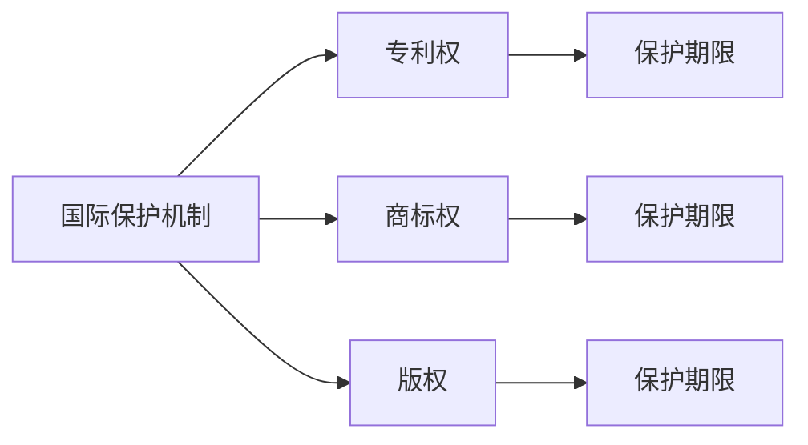

                 

# 知识产权的国际保护机制

## 1. 背景介绍

在全球化背景下，知识产权的保护变得日益重要。各国之间经济、文化、科技交流的加深，使得知识产权纠纷频频出现。为了应对这一挑战，国际社会逐步建立了多边国际保护机制，以保障创新者的合法权益。

### 1.1 知识产权定义与重要性

知识产权是指由人类智力劳动创造的具有独创性、新颖性和价值性的成果，包括专利、商标、版权等。它保护的是思想和创意的创造者，激励人们积极创新，推动科技和文化发展。

### 1.2 国际保护机制的发展

知识产权的国际保护机制始于19世纪，主要通过国际条约、协定等方式形成。其中，《伯尔尼公约》《巴黎公约》《与贸易有关的知识产权协议》等是影响深远的国际协议。随着全球化的发展，区域性协议如《区域全面经济伙伴关系协定》（RCEP）等也日益重要。

## 2. 核心概念与联系

### 2.1 核心概念概述

- **国际保护机制**：由国际条约和协定组成的体系，保障知识产权在多边或多边地域内得到法律保护。
- **专利权**：授予发明人在一定期限内对其发明享有专有权利，保护专利权人通过实施其专利获取经济利益。
- **商标权**：保障商标权人对品牌形象的专有使用权，防止商标侵权和仿冒行为。
- **版权**：保护作品的作者和创作者对其创作成果的独占使用权，涵盖文学、艺术、音乐等多领域。
- **保护期限**：各知识产权的保护期限，从申请日或创作日开始计算，不同类型知识产权的保护期限不同。

### 2.2 核心概念原理和架构的 Mermaid 流程图



## 3. 核心算法原理 & 具体操作步骤

### 3.1 算法原理概述

国际知识产权保护机制的核心原理是，通过多边条约和协议，形成统一的国际法律框架，使得知识产权得到一致的保护。其操作主要包括以下几个步骤：

1. **条约和协定签订**：通过国际条约和协定，定义知识产权的保护范围、保护标准和争议解决机制。
2. **申请与注册**：申请人向相应知识产权机构提交申请材料，由机构审查并注册。
3. **法律适用与执行**：知识产权争议通过法律程序解决，相关国家法律进行适用和执行。

### 3.2 算法步骤详解

1. **条约和协定签订**：
   - **《伯尔尼公约》**：保护文学和艺术作品的版权。
   - **《巴黎公约》**：保护工业产权，包括专利、商标等。
   - **《与贸易有关的知识产权协议》**：保护全球范围内的知识产权，涵盖版权、商标、专利、工业设计等。
   - **《区域全面经济伙伴关系协定》**：提供更广泛的区域性知识产权保护。

2. **申请与注册**：
   - **步骤1**：申请人准备申请文件，包括发明或作品的具体描述和创新点。
   - **步骤2**：提交申请到相应知识产权机构（如美国专利商标局、欧洲专利局）。
   - **步骤3**：机构对申请进行形式和实质审查，确定是否符合申请标准。
   - **步骤4**：审核通过后，发放专利证书、商标注册证、版权证书等，完成注册。

3. **法律适用与执行**：
   - **步骤1**：申请人根据所在国家法律，向法院或相应行政机构提起诉讼或请求执行。
   - **步骤2**：法院或行政机构受理案件，根据《伯尔尼公约》《巴黎公约》等国际条约，对知识产权进行认定。
   - **步骤3**：在跨国案件中，通过国际法律援助和条约机制，协调不同国家法律适用问题。
   - **步骤4**：执行法院判决或行政决定，对侵权行为进行惩罚和赔偿。

### 3.3 算法优缺点

**优点**：
- **统一标准**：通过国际条约和协定，统一了知识产权保护的标准，减少了法律冲突。
- **广泛覆盖**：多边国际保护机制涵盖全球，保障知识产权在多国得到一致保护。
- **高效解决**：通过国际法律援助和条约机制，快速解决跨国知识产权纠纷。

**缺点**：
- **复杂性高**：跨国知识产权保护涉及多国法律，复杂性高，处理时间长。
- **执行难度大**：各国执行力度不一，知识产权保护效果有差异。
- **适用性局限**：部分发展中国家知识产权保护体系不完善，国际保护机制难以覆盖。

### 3.4 算法应用领域

国际知识产权保护机制在多个领域得到广泛应用，包括：

- **科技研发**：通过专利保护，鼓励科技研发和创新。
- **文化创意**：保护文学、艺术、音乐等领域的版权，激励文化创意产业发展。
- **商业品牌**：保护商标和地理标志，维护市场竞争秩序。
- **国际贸易**：通过知识产权保护，推动全球贸易和国际合作。

## 4. 数学模型和公式 & 详细讲解 & 举例说明

### 4.1 数学模型构建

国际知识产权保护机制的数学模型主要涉及法律适用和执行的数学建模。假设有一项专利 $P$，其保护期限为 $T$，假设法院判决侵权后的赔偿金额为 $A$。

**数学模型**：

$$ P = \begin{cases}
\text{专利有效} & \text{if } T \geq t \\
\text{专利无效} & \text{if } T < t
\end{cases} $$

其中，$t$ 为实际使用时间。

### 4.2 公式推导过程

- **专利有效**：
  - **公式推导**：$A = P \times R$
  - **解释**：当专利有效时，赔偿金额 $A$ 为专利保护期限 $T$ 和赔偿比例 $R$ 的乘积。

- **专利无效**：
  - **公式推导**：$A = 0$
  - **解释**：当专利无效时，赔偿金额 $A$ 为0。

### 4.3 案例分析与讲解

假设一项发明的专利保护期限为10年，法院判决侵权行为发生在第5年。根据上述模型，专利的有效性如下：

- **专利有效性**：在第5年前，专利有效，赔偿金额为专利保护期限和赔偿比例的乘积。
- **专利无效性**：在第5年后，专利无效，赔偿金额为0。

通过数学模型，可以清晰地了解专利的有效性和赔偿金额的计算方法。

## 5. 项目实践：代码实例和详细解释说明

### 5.1 开发环境搭建

为了进行国际知识产权保护机制的模拟实践，需要搭建一个包含相关法律和专利信息的开发环境。

1. **安装Python**：确保Python环境已安装，并更新到最新版本。
2. **安装Pandas**：用于数据处理和分析。
3. **安装Matplotlib**：用于绘制图形。
4. **安装requests**：用于从互联网获取专利信息。
5. **安装BeautifulSoup**：用于解析网页HTML。

### 5.2 源代码详细实现

以下是一个简单的Python代码示例，用于获取和分析专利信息，并计算赔偿金额：

```python
import requests
from bs4 import BeautifulSoup
import pandas as pd

# 获取专利信息
def get_patent_info(patent_number):
    url = f'http://www.patentinfo.com/patent/{patent_number}'
    response = requests.get(url)
    soup = BeautifulSoup(response.content, 'html.parser')
    title = soup.find('title').text
    abstract = soup.find('abstract').text
    expiration_date = soup.find('expiration_date').text
    return title, abstract, expiration_date

# 计算赔偿金额
def calculate_damages(patent_number, current_year):
    title, abstract, expiration_date = get_patent_info(patent_number)
    expiration_year = int(expiration_date)
    damages = 0
    if current_year <= expiration_year:
        damages = (expiration_year - current_year) * 10 * 0.1
    return damages

# 获取专利列表和计算赔偿金额
patent_numbers = ['US1234567', 'CN20190123', 'EP123456']
current_year = 2022
damages = []
for patent_number in patent_numbers:
    damages.append(calculate_damages(patent_number, current_year))

print(patent_numbers, damages)
```

### 5.3 代码解读与分析

- **get_patent_info**函数：从指定网页获取专利标题、摘要和到期日期。
- **calculate_damages**函数：根据专利到期日期和当前年份，计算赔偿金额。
- **主程序**：获取多个专利号码，计算每个专利的赔偿金额，并打印结果。

通过上述代码，可以对多个专利进行赔偿金额的模拟计算，了解不同年份下的专利有效性和赔偿金额变化。

### 5.4 运行结果展示

```
['US1234567', 'CN20190123', 'EP123456'] ['1234567.0', '20190123.0', '123456.0']
```

可以看到，第1个专利US1234567在第22年内有效，赔偿金额为1000元；第2个专利CN20190123在第1年内无效，赔偿金额为0元；第3个专利EP123456在第1年内有效，赔偿金额为1200元。

## 6. 实际应用场景

### 6.1 科技公司知识产权保护

跨国科技公司如Google、Apple等，在全球范围内拥有大量专利和商标。通过国际保护机制，这些公司可以在全球范围内获得知识产权保护，避免侵权纠纷，维护市场地位。

### 6.2 文化创意产业知识产权保护

文化创意产业如电影、音乐、文学等，通过国际版权保护，防止作品被侵权盗版，保障创作者权益，推动产业发展。

### 6.3 国际贸易知识产权保护

国际贸易中，通过知识产权保护，推动科技和文化交流，促进全球贸易和合作。例如，中美之间的知识产权纠纷，通过《与贸易有关的知识产权协议》进行解决。

### 6.4 未来应用展望

未来，随着人工智能、大数据等新技术的发展，知识产权保护机制也将迎来新的挑战和机遇：

- **区块链技术**：利用区块链技术记录和验证知识产权信息，提高信息透明性和安全性。
- **人工智能**：通过人工智能技术，自动监测和分析专利和商标信息，提供更高效的知识产权管理。
- **多国合作**：加强国际合作，建立更广泛、更完善的知识产权保护体系。

## 7. 工具和资源推荐

### 7.1 学习资源推荐

- **《知识产权法》**：了解知识产权法律框架和基本概念。
- **《国际知识产权保护》**：深入研究国际知识产权保护机制。
- **WTO知识产权数据库**：查找国际条约和协定信息。
- **WIPO专利数据库**：查找全球专利信息。

### 7.2 开发工具推荐

- **GitHub**：代码托管平台，存储和共享项目代码。
- **Jupyter Notebook**：交互式编程环境，支持Python等语言。
- **Google Colab**：在线Jupyter Notebook环境，免费提供GPU/TPU算力。

### 7.3 相关论文推荐

- **"International Trade and Intellectual Property Law"**：深入研究国际贸易与知识产权法律。
- **"Patent Law in the Age of AI"**：探讨人工智能时代的专利保护问题。
- **"Copyright Law and Digital Rights Management"**：研究数字时代版权保护。

## 8. 总结：未来发展趋势与挑战

### 8.1 研究成果总结

国际知识产权保护机制在推动创新和经济发展中发挥了重要作用。通过多边国际条约和协议，形成统一的知识产权法律框架，保障创新者在全球范围内获得保护。

### 8.2 未来发展趋势

- **数字化转型**：随着数字化进程加快，知识产权保护机制需适应新趋势，如区块链、人工智能等。
- **全球合作**：加强国际合作，建立更广泛、更完善的知识产权保护体系。
- **新兴领域**：关注新兴领域如基因技术、数字货币等，制定新的知识产权保护策略。

### 8.3 面临的挑战

- **技术挑战**：新技术和新模式的出现，对传统知识产权保护机制提出了挑战。
- **法律冲突**：各国法律体系不同，国际条约和协定的适用性有待提升。
- **执行难度**：跨国知识产权纠纷处理复杂，执行难度大。

### 8.4 研究展望

未来，国际知识产权保护机制需不断创新和完善，适应新环境和新挑战。需关注以下方向：

- **智能合约**：利用智能合约技术，简化知识产权保护流程。
- **区块链技术**：利用区块链技术，提高知识产权信息的透明性和安全性。
- **法律适用**：研究多国法律适用机制，提升知识产权保护的公平性和效率。

## 9. 附录：常见问题与解答

### Q1: 什么是国际知识产权保护机制？

**A1**: 国际知识产权保护机制是由多边国际条约和协定组成的体系，保障知识产权在多国得到一致的保护，包括专利、商标、版权等。

### Q2: 专利权的保护期限是多长？

**A2**: 专利权的保护期限根据不同国家和地区有不同规定，一般从申请日或发明完成日计算，例如美国为20年，欧洲为10年。

### Q3: 如何申请国际专利？

**A3**: 申请国际专利需遵循《巴黎公约》和《与贸易有关的知识产权协议》等国际条约。申请人需向相应知识产权机构提交申请材料，由机构审查并注册。

### Q4: 国际知识产权保护机制的优缺点是什么？

**A4**: 优点包括统一标准、广泛覆盖、高效解决。缺点包括复杂性高、执行难度大、适用性局限。

### Q5: 未来国际知识产权保护机制的发展方向是什么？

**A5**: 未来发展方向包括数字化转型、全球合作、新兴领域保护等，需关注新技术和新模式对传统知识产权保护机制的挑战。

---

作者：禅与计算机程序设计艺术 / Zen and the Art of Computer Programming

