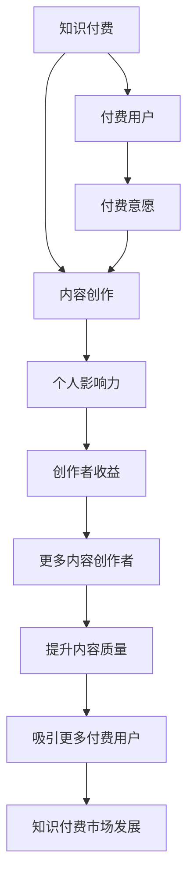

                 

## 1. 背景介绍

### 1.1 问题由来

在互联网高速发展的时代，信息过载已经成为困扰人们的普遍问题。如何从海量的信息中快速获取有价值的知识，成为了一个重要的课题。知识付费由此应运而生，通过付费订阅方式，让专家分享高质量的原创内容，帮助用户高效获取知识，提升专业水平。

近年来，知识付费市场迅速发展，各大平台如得到、知乎live、喜马拉雅等纷纷推出各种付费课程和讲座，受到广泛欢迎。知识付费不仅提供了便捷的知识获取渠道，还促进了知识内容的创造与传播。

然而，知识付费市场同样面临着诸多挑战。内容质量参差不齐、用户注意力分散、付费意愿下降等问题，限制了知识付费市场的进一步发展。如何提升知识付费的内容质量，增强用户粘性，成为当下亟需解决的问题。

### 1.2 问题核心关键点

知识付费市场存在以下关键问题：

1. 内容质量不稳定：由于平台审核机制、作者资源限制等，部分付费内容质量参差不齐，难以满足用户需求。
2. 用户注意力分散：信息过载环境下，用户注意力难以集中，付费内容的吸引力逐渐下降。
3. 付费意愿下降：用户对内容价值感降低，部分用户选择免费获取替代内容。
4. 用户获取知识的需求快速增长：随着社会进步，用户对高质量知识的渴求愈发迫切。

这些核心问题制约了知识付费市场的发展，需要通过创新方法解决。

## 2. 核心概念与联系

### 2.1 核心概念概述

为更好地理解知识付费与个人影响力提升的双向促进，本节将介绍几个密切相关的核心概念：

1. **知识付费**：指用户通过付费获取专业知识的平台或服务，通常以订阅、购买等形式进行。知识付费内容形式多样，包括文章、视频、音频、课程等。

2. **个人影响力**：指个体在特定领域或社交网络中对他人行为、观点、决策等产生的影响力。个人影响力可以通过网络传播、内容创作、社交互动等方式提升。

3. **双向促进**：指知识付费平台通过提升内容质量、丰富内容形式、增强用户互动等方式，增强用户粘性，吸引更多用户付费。同时，通过提供优质内容，提升个人影响力，促进更多内容创作者入驻，形成良性循环。

4. **内容创作者**：指通过知识付费平台创作、分享内容的个体或机构，包括专家、学者、意见领袖等。内容创作者通过优质的内容吸引付费用户，提升自身影响力。

5. **付费用户**：指通过知识付费平台获取知识的个体，是知识付费市场的重要用户群体。付费用户通过付费内容获取有价值的信息，提升专业水平。

这些核心概念之间的逻辑关系可以通过以下Mermaid流程图来展示：



这个流程图展示了大语言模型的核心概念及其之间的关系：

1. 知识付费平台通过内容创作吸引付费用户。
2. 内容创作者通过付费用户获取收益，提升自身影响力。
3. 用户通过优质内容获得知识提升，形成付费意愿。
4. 通过提升内容质量和用户互动，吸引更多用户付费。
5. 知识付费市场不断发展和扩大，促进更多内容创作者入驻。

## 3. 核心算法原理 & 具体操作步骤
### 3.1 算法原理概述

知识付费与个人影响力提升的双向促进，本质上是一种基于用户反馈和内容推荐的协同优化机制。其核心思想是：通过精准推荐和优质内容，提升用户满意度和付费意愿，同时激励内容创作者持续输出高质量内容，提升自身影响力。

形式化地，假设知识付费平台为 $P$，内容创作为 $C$，付费用户为 $U$，推荐算法为 $A$。则双向促进的目标是找到最优推荐算法 $A$，使得：

$$
\max_{A} \mathbb{E}[\sum_{i=1}^N \log(A(x_i) + 1)] - \lambda \mathbb{E}[C(x_i) - 1]
$$

其中，$N$ 为内容数量，$x_i$ 为第 $i$ 个内容，$A(x_i)$ 为内容推荐度，$C(x_i)$ 为内容创作度，$\lambda$ 为创作者收益权重。

通过最大化推荐度和创作度的乘积，同时最小化创作者收益损失，即实现了知识付费与个人影响力提升的双向促进。

### 3.2 算法步骤详解

知识付费平台的双向促进一般包括以下几个关键步骤：

**Step 1: 用户画像建立**

- 收集用户行为数据，如浏览记录、购买历史、评价反馈等。
- 利用聚类、分类等技术，建立用户画像，识别用户兴趣和偏好。

**Step 2: 内容推荐算法优化**

- 设计推荐算法，如协同过滤、基于深度学习的推荐系统等，提升推荐精准度。
- 引入多样性控制和新颖性探索机制，丰富推荐结果，避免推荐同质化。
- 应用对抗训练和公平性评估，确保推荐结果的公正性和多样性。

**Step 3: 创作者激励机制设计**

- 设计创作者收益模型，如按点击付费、按订阅付费、按内容热度付费等。
- 引入创作者收益排序和展示机制，激励创作者输出高质量内容。
- 引入创作者反馈和激励机制，如评论区互动、粉丝打赏等，提升创作者活跃度。

**Step 4: 内容质量控制**

- 设计内容质量评价标准，如点击率、用户反馈、专家评估等。
- 引入内容审核机制，剔除低质量、低价值内容，保证内容质量。
- 设计内容分层次推荐机制，优先推荐高质量内容。

**Step 5: 用户体验优化**

- 优化平台界面和功能，提升用户体验。
- 应用A/B测试等方法，不断迭代优化推荐算法和用户界面。
- 引入社群和互动机制，增强用户粘性，促进内容传播。

**Step 6: 数据驱动决策**

- 定期分析用户和内容数据，调整推荐算法和创作者激励机制。
- 引入机器学习技术，实时分析用户行为，动态调整推荐策略。

以上是知识付费平台的双向促进一般流程。在实际应用中，还需要针对具体平台特点和用户需求，对各个环节进行优化设计，如改进推荐算法，引入更多创作者激励机制等。

### 3.3 算法优缺点

基于推荐系统的双向促进方法具有以下优点：

1. 提升内容质量：通过精准推荐，筛选高质量内容，提升用户体验，吸引更多付费用户。
2. 增强用户粘性：个性化推荐和互动机制，增强用户粘性，提升用户留存率。
3. 激励内容创作：通过创作者收益和激励机制，激励更多高质量内容输出。
4. 促进市场发展：通过优质内容吸引付费用户，促进知识付费市场的健康发展。

同时，该方法也存在一定的局限性：

1. 数据隐私问题：平台需要收集大量用户数据，涉及隐私保护问题。
2. 推荐系统偏见：推荐算法可能存在偏见，导致推荐结果不公平。
3. 创作者收益分配：创作者收益分配机制需要合理设计，避免不公。
4. 算法复杂度：推荐系统需要复杂的算法设计和大量计算资源。

尽管存在这些局限性，但就目前而言，基于推荐系统的双向促进方法仍是目前知识付费平台的主要发展方向。未来相关研究的重点在于如何进一步优化推荐算法，提高创作者激励，降低推荐系统偏见，保护用户隐私。

### 3.4 算法应用领域

基于推荐系统的双向促进方法，在知识付费平台、在线教育、社交媒体等多个领域都有广泛应用。以下是几个典型的应用场景：

1. **知识付费平台**：通过推荐算法优化，提升内容质量，吸引更多付费用户，促进创作者收益。如得到、知乎live等平台。
2. **在线教育平台**：通过个性化推荐和互动，提升学习体验，促进更多高质量课程制作。如Coursera、Udemy等平台。
3. **社交媒体平台**：通过推荐系统和创作者激励，增强用户粘性，丰富平台内容。如微博、微信公众号等平台。
4. **新闻推荐平台**：通过推荐算法，提升新闻质量，吸引更多用户。如今日头条、网易新闻等平台。

除了上述这些经典场景外，推荐系统还被创新性地应用到更多场景中，如电商推荐、视频推荐等，为这些行业带来了新的发展机遇。

## 4. 数学模型和公式 & 详细讲解  
### 4.1 数学模型构建

本节将使用数学语言对基于推荐系统的知识付费与个人影响力提升的双向促进机制进行更加严格的刻画。

假设知识付费平台为 $P$，内容创作为 $C$，付费用户为 $U$，推荐算法为 $A$。设 $C(x)$ 为内容 $x$ 的创作度，$A(x)$ 为内容 $x$ 的推荐度，$U(x)$ 为内容 $x$ 的用户关注度。则双向促进的目标是最大化推荐度和创作度的乘积，同时最小化创作者收益损失：

$$
\max_{A} \mathbb{E}[\sum_{i=1}^N \log(A(x_i) + 1)] - \lambda \mathbb{E}[C(x_i) - 1]
$$

在实践中，我们通常使用基于梯度的优化算法（如SGD、Adam等）来近似求解上述最优化问题。设 $\eta$ 为学习率，$\lambda$ 为创作者收益权重，则创作者收益的梯度更新公式为：

$$
\frac{\partial C(x_i)}{\partial \eta} = -\eta \frac{\partial \mathbb{E}[\log(A(x_i) + 1)]}{\partial \eta} + \eta \lambda
$$

其中 $\frac{\partial \mathbb{E}[\log(A(x_i) + 1)]}{\partial \eta}$ 为推荐度的梯度，可通过反向传播算法高效计算。

### 4.2 公式推导过程

以下我们以协同过滤推荐算法为例，推导推荐度的计算公式。

假设推荐系统包含 $M$ 个用户和 $N$ 个内容，每个用户对每个内容有一个评分 $r_{ui}$。则协同过滤的目标是最小化用户和内容的评分误差，即：

$$
\min_{A} \sum_{i=1}^M \sum_{j=1}^N (r_{ij} - A(x_j))^2
$$

利用矩阵分解方法，将用户评分矩阵 $R$ 分解为两个低维矩阵 $U$ 和 $V$，每个矩阵的维度为 $M \times K$ 和 $N \times K$，其中 $K$ 为隐向量维度。则推荐度的计算公式为：

$$
A(x_j) = \mathbb{E}[V_j \cdot U_i] = \sum_{k=1}^K V_{jk} \cdot U_{ik}
$$

其中 $V_j$ 和 $U_i$ 分别表示第 $j$ 个内容和第 $i$ 个用户对应的隐向量。在实际应用中，为了提高计算效率，通常采用矩阵分解的近似方法，如奇异值分解(SVD)和随机梯度下降方法，对推荐系统进行优化。

## 5. 项目实践：代码实例和详细解释说明
### 5.1 开发环境搭建

在进行推荐系统实践前，我们需要准备好开发环境。以下是使用Python进行TensorFlow开发的环境配置流程：

1. 安装Anaconda：从官网下载并安装Anaconda，用于创建独立的Python环境。

2. 创建并激活虚拟环境：
```bash
conda create -n tf-env python=3.8 
conda activate tf-env
```

3. 安装TensorFlow：根据CUDA版本，从官网获取对应的安装命令。例如：
```bash
conda install tensorflow tensorflow-gpu==2.6.0
```

4. 安装NumPy、Pandas、scikit-learn等库：
```bash
pip install numpy pandas scikit-learn tqdm jupyter notebook ipython
```

完成上述步骤后，即可在`tf-env`环境中开始推荐系统实践。

### 5.2 源代码详细实现

下面我们以协同过滤推荐算法为例，给出使用TensorFlow实现协同过滤推荐系统的Python代码实现。

首先，定义协同过滤推荐系统的类：

```python
import tensorflow as tf
import numpy as np

class CollaborativeFiltering:
    def __init__(self, M, N, K):
        self.M = M
        self.N = N
        self.K = K
        self.U = None
        self.V = None
        self.R_hat = None
        self.R = None
        self.error = None
    
    def init(self):
        # 初始化用户矩阵U和内容矩阵V
        self.U = tf.Variable(tf.random.normal([self.M, self.K]))
        self.V = tf.Variable(tf.random.normal([self.N, self.K]))
        self.R_hat = tf.matmul(tf.matmul(self.U, self.V, transpose_b=True))
    
    def train(self, R, alpha=0.001, epochs=1000):
        # 定义损失函数和优化器
        loss_fn = tf.keras.losses.MeanSquaredError()
        optimizer = tf.keras.optimizers.Adam(learning_rate=alpha)
        
        # 训练过程
        for epoch in range(epochs):
            with tf.GradientTape() as tape:
                preds = tf.matmul(tf.matmul(self.U, self.V, transpose_b=True)
                loss = loss_fn(R, preds)
            grads = tape.gradient(loss, [self.U, self.V])
            optimizer.apply_gradients(zip(grads, [self.U, self.V]))
            if (epoch + 1) % 100 == 0:
                self.error = loss.numpy()
                print("Epoch:", epoch+1, "Loss:", self.error)
    
    def predict(self, x):
        preds = tf.matmul(tf.matmul(self.U, self.V, transpose_b=True), tf.expand_dims(x, 0))
        return preds.numpy()
```

然后，定义推荐系统数据和用户行为数据：

```python
R = np.array([[5, 4, 0, 0], 
              [0, 0, 4, 5], 
              [0, 0, 3, 5], 
              [4, 0, 3, 0]])
```

接着，初始化推荐系统并训练：

```python
model = CollaborativeFiltering(M=4, N=4, K=2)
model.init()
model.train(R_hat, alpha=0.01, epochs=1000)
```

最后，在测试集上评估推荐效果：

```python
R_test = np.array([[0, 0, 5, 0],
                   [0, 5, 0, 0],
                   [0, 0, 0, 5],
                   [0, 0, 0, 0]])
preds = model.predict(R_test)
print("Preds:", preds)
```

以上就是使用TensorFlow对协同过滤推荐系统进行实现的完整代码。可以看到，TensorFlow的Keras框架使得推荐系统的构建和训练变得简单易用。

### 5.3 代码解读与分析

让我们再详细解读一下关键代码的实现细节：

**CollaborativeFiltering类**：
- `__init__`方法：初始化推荐系统的参数。
- `init`方法：初始化用户矩阵U和内容矩阵V。
- `train`方法：定义损失函数和优化器，通过反向传播更新矩阵U和V。
- `predict`方法：根据U和V计算推荐度。

**R数组**：
- 定义了一个4x4的评分矩阵R，表示用户对内容的评分。

**初始化与训练**：
- 实例化CollaborativeFiltering类，并调用`init`方法初始化矩阵U和V。
- 调用`train`方法，通过最小化均方误差损失函数，优化推荐系统的矩阵参数。

**测试与评估**：
- 定义测试集R_test，计算推荐系统对新内容的推荐度。
- 打印推荐结果preds。

通过这段代码，我们实现了基本的协同过滤推荐系统。在实际应用中，还可以进一步改进算法，如引入稀疏矩阵优化、并行计算等，提升推荐系统的性能。

## 6. 实际应用场景
### 6.1 智能推荐系统

智能推荐系统在电子商务、在线视频、社交媒体等多个领域都有广泛应用。通过精准推荐，提升用户购物体验和观看体验，促进更多用户消费和互动。

在技术实现上，可以采用协同过滤、基于深度学习的推荐系统等方法，根据用户行为数据，推荐用户可能感兴趣的商品、视频、文章等内容。通过个性化推荐，增加用户粘性，促进更多用户消费。

### 6.2 个性化学习平台

个性化学习平台通过推荐系统，为每个用户提供个性化的学习资源。通过精准推荐，提升学习体验和效果，促进更多用户参与学习。

在技术实现上，可以采用协同过滤、基于内容的推荐系统等方法，根据用户学习历史和兴趣偏好，推荐相关的课程、视频、练习等内容。通过个性化推荐，增加用户粘性，提升学习效果。

### 6.3 在线视频平台

在线视频平台通过推荐系统，为用户推荐感兴趣的视频内容。通过精准推荐，提升用户观看体验，增加用户粘性。

在技术实现上，可以采用协同过滤、基于深度学习的推荐系统等方法，根据用户观看历史和行为数据，推荐相关的视频内容。通过个性化推荐，增加用户粘性，提升观看体验。

### 6.4 未来应用展望

随着推荐系统的发展，未来的智能推荐技术将呈现以下几个发展趋势：

1. 推荐系统的智能化：通过引入更多用户行为数据和背景信息，提升推荐系统的智能水平，实现更精准的推荐。
2. 推荐系统的个性化：通过用户画像和兴趣分析，实现更加个性化的推荐，提升用户粘性和满意度。
3. 推荐系统的多样性：引入多样性控制和新颖性探索机制，丰富推荐结果，避免推荐同质化。
4. 推荐系统的公平性：引入公平性评估和优化机制，确保推荐结果的公正性，避免算法偏见。
5. 推荐系统的实时性：通过实时数据分析和推荐，提升推荐系统的响应速度，满足用户即时需求。

以上趋势将进一步推动推荐系统的发展，为知识付费平台、在线教育、社交媒体等平台提供更加优质的推荐服务，提升用户体验和平台价值。

## 7. 工具和资源推荐
### 7.1 学习资源推荐

为了帮助开发者系统掌握推荐系统的理论基础和实践技巧，这里推荐一些优质的学习资源：

1. **《推荐系统实践》**：吴恩达、李宏毅等人所著的推荐系统经典教材，涵盖了推荐系统的各个方面，包括协同过滤、基于深度学习的推荐系统等。
2. **Kaggle竞赛**：Kaggle上推荐的推荐系统竞赛项目，通过实践项目，掌握推荐系统的具体实现技巧。
3. **推荐系统论文阅读**：推荐系统领域的经典论文，如《Top-N推荐系统》、《深度学习在推荐系统中的应用》等，掌握最新的研究进展和算法技术。
4. **Coursera课程**：Coursera上的推荐系统课程，由斯坦福大学和MIT等名校教授讲授，涵盖推荐系统的各个方面。

通过这些资源的学习实践，相信你一定能够快速掌握推荐系统的精髓，并用于解决实际的推荐问题。

### 7.2 开发工具推荐

高效的开发离不开优秀的工具支持。以下是几款用于推荐系统开发的常用工具：

1. **TensorFlow**：由Google主导开发的深度学习框架，生产部署方便，适合大规模工程应用。支持高效的推荐系统开发。
2. **PyTorch**：由Facebook主导开发的深度学习框架，灵活高效，适合研究性项目开发。支持推荐系统的高效实现。
3. **Scikit-learn**：基于Python的机器学习库，包含多种推荐算法实现，适合快速迭代和实验。
4. **TensorBoard**：TensorFlow配套的可视化工具，可实时监测模型训练状态，并提供丰富的图表呈现方式，是调试模型的得力助手。
5. **DataFrame**：基于Python的DataFrame库，如Pandas，方便数据的处理和分析。

合理利用这些工具，可以显著提升推荐系统的开发效率，加快创新迭代的步伐。

### 7.3 相关论文推荐

推荐系统的发展源于学界的持续研究。以下是几篇奠基性的相关论文，推荐阅读：

1. **《Top-N推荐系统》**：Jamali和Konstan的综述论文，介绍了推荐系统的经典算法和技术。
2. **《协同过滤推荐系统》**：Sarwar等人提出的协同过滤推荐算法，是推荐系统的基础算法之一。
3. **《基于深度学习的推荐系统》**：He等人提出的基于深度学习的推荐系统，展示了深度学习在推荐系统中的潜力。
4. **《推荐系统的公平性》**：Li等人提出的公平性优化方法，展示了推荐系统公平性的重要性。

这些论文代表了大推荐系统的发展脉络。通过学习这些前沿成果，可以帮助研究者把握学科前进方向，激发更多的创新灵感。

## 8. 总结：未来发展趋势与挑战

### 8.1 总结

本文对基于推荐系统的知识付费与个人影响力提升的双向促进方法进行了全面系统的介绍。首先阐述了知识付费与个人影响力提升的双向促进背景和意义，明确了推荐系统在提升内容质量和用户粘性方面的独特价值。其次，从原理到实践，详细讲解了推荐系统的数学原理和关键步骤，给出了推荐系统任务开发的完整代码实例。同时，本文还广泛探讨了推荐系统在智能推荐、个性化学习、在线视频等多个领域的应用前景，展示了推荐系统范式的巨大潜力。此外，本文精选了推荐系统的各类学习资源，力求为读者提供全方位的技术指引。

通过本文的系统梳理，可以看到，基于推荐系统的知识付费范式正在成为知识付费平台的主要发展方向，极大地拓展了推荐系统的应用边界，催生了更多的落地场景。受益于推荐系统的不断演进，知识付费平台可以提供更加精准、个性化的内容推荐，提升用户满意度和付费意愿，同时激励更多高质量内容创作者入驻，形成良性循环。未来，伴随推荐系统技术的持续发展，知识付费市场必将在更广阔的应用领域大放异彩，深刻影响人类的生产生活方式。

### 8.2 未来发展趋势

展望未来，基于推荐系统的知识付费范式将呈现以下几个发展趋势：

1. 推荐系统的智能化：通过引入更多用户行为数据和背景信息，提升推荐系统的智能水平，实现更精准的推荐。
2. 推荐系统的个性化：通过用户画像和兴趣分析，实现更加个性化的推荐，提升用户粘性和满意度。
3. 推荐系统的多样性：引入多样性控制和新颖性探索机制，丰富推荐结果，避免推荐同质化。
4. 推荐系统的公平性：引入公平性评估和优化机制，确保推荐结果的公正性，避免算法偏见。
5. 推荐系统的实时性：通过实时数据分析和推荐，提升推荐系统的响应速度，满足用户即时需求。

以上趋势将进一步推动推荐系统的发展，为知识付费平台、在线教育、社交媒体等平台提供更加优质的推荐服务，提升用户体验和平台价值。

### 8.3 面临的挑战

尽管基于推荐系统的知识付费范式已经取得了显著成效，但在迈向更加智能化、普适化应用的过程中，仍面临着诸多挑战：

1. 推荐系统偏见：推荐算法可能存在偏见，导致推荐结果不公平。需要进一步优化算法，引入公平性评估机制。
2. 推荐系统复杂度：推荐系统需要复杂的算法设计和大量计算资源。需要进一步优化算法，提高计算效率。
3. 用户数据隐私：平台需要收集大量用户数据，涉及隐私保护问题。需要进一步保护用户隐私，确保数据安全。
4. 创作者收益分配：创作者收益分配机制需要合理设计，避免不公。需要进一步优化分配机制，提升创作者积极性。
5. 推荐系统实时性：推荐系统需要实时数据分析和推荐，满足用户即时需求。需要进一步优化算法，提高实时性。

正视推荐系统面临的这些挑战，积极应对并寻求突破，将是在线教育、智能推荐等新兴领域迈向成熟的必由之路。相信随着学界和产业界的共同努力，这些挑战终将一一被克服，推荐系统必将在构建人机协同的智能时代中扮演越来越重要的角色。

### 8.4 研究展望

面对推荐系统面临的诸多挑战，未来的研究需要在以下几个方面寻求新的突破：

1. 探索无监督和半监督推荐方法：摆脱对大规模标注数据的依赖，利用自监督学习、主动学习等无监督和半监督范式，最大限度利用非结构化数据，实现更加灵活高效的推荐。
2. 研究参数高效和计算高效的推荐范式：开发更加参数高效的推荐方法，在固定大部分推荐参数的同时，只更新极少量的任务相关参数。同时优化推荐模型的计算图，减少前向传播和反向传播的资源消耗，实现更加轻量级、实时性的部署。
3. 引入因果分析和博弈论工具：将因果分析方法引入推荐系统，识别出推荐决策的关键特征，增强输出解释的因果性和逻辑性。借助博弈论工具刻画人机交互过程，主动探索并规避推荐系统的脆弱点，提高系统稳定性。
4. 纳入伦理道德约束：在推荐系统训练目标中引入伦理导向的评估指标，过滤和惩罚有偏见、有害的输出倾向。同时加强人工干预和审核，建立推荐系统的监管机制，确保输出符合人类价值观和伦理道德。

这些研究方向的探索，必将引领推荐系统技术迈向更高的台阶，为构建安全、可靠、可解释、可控的智能系统铺平道路。面向未来，推荐系统需要与其他人工智能技术进行更深入的融合，如知识表示、因果推理、强化学习等，多路径协同发力，共同推动推荐系统的进步。只有勇于创新、敢于突破，才能不断拓展推荐系统的边界，让推荐系统更好地服务于人类社会。

## 9. 附录：常见问题与解答

**Q1：推荐系统如何提升内容质量？**

A: 推荐系统通过精准推荐，筛选高质量内容，提升用户体验，吸引更多付费用户。推荐算法根据用户行为数据和兴趣偏好，将优质内容推荐给用户，提升内容曝光度和用户粘性，从而提升内容质量。

**Q2：如何设计推荐系统的创作者收益机制？**

A: 推荐系统的创作者收益机制需要合理设计，激励创作者输出高质量内容。常见的收益机制包括按点击付费、按订阅付费、按内容热度付费等。同时，可以引入创作者反馈和激励机制，如评论区互动、粉丝打赏等，提升创作者活跃度。

**Q3：推荐系统在实际部署中需要注意哪些问题？**

A: 推荐系统在实际部署中，需要注意以下问题：
1. 数据隐私问题：平台需要收集大量用户数据，涉及隐私保护问题。需要合理设计数据收集和使用策略，确保用户隐私。
2. 推荐系统偏见：推荐算法可能存在偏见，导致推荐结果不公平。需要引入公平性评估和优化机制，确保推荐结果的公正性。
3. 推荐系统复杂度：推荐系统需要复杂的算法设计和大量计算资源。需要进一步优化算法，提高计算效率。
4. 创作者收益分配：创作者收益分配机制需要合理设计，避免不公。需要进一步优化分配机制，提升创作者积极性。
5. 推荐系统实时性：推荐系统需要实时数据分析和推荐，满足用户即时需求。需要进一步优化算法，提高实时性。

这些问题的解决将进一步提升推荐系统的性能和用户满意度，推动知识付费市场的健康发展。

---

作者：禅与计算机程序设计艺术 / Zen and the Art of Computer Programming

