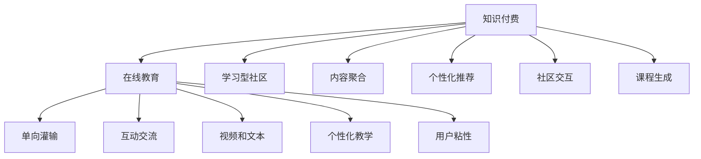

                 

# 知识付费与在线教育相结合的学习型社区模式

> 关键词：知识付费,在线教育,学习型社区,内容聚合,个性化推荐,社区交互,课程生成

## 1. 背景介绍

### 1.1 问题由来
随着互联网的普及和信息技术的发展，在线教育逐步成为知识传播的主要形式。特别是在新冠疫情的冲击下，线上教学和远程学习变得更加普遍。然而，传统的在线教育模式存在诸多问题：
- **缺乏互动**：在线课程多为单向灌输，缺乏师生互动和社区交流，难以形成良好的学习氛围。
- **内容单一**：课程内容主要以视频和文本为主，形式单一，难以满足多样化学习需求。
- **学习效率低下**：个性化学习计划和作业反馈机制缺失，难以针对学习者的特点进行个性化教学。
- **用户粘性不足**：缺乏有效的社区互动和奖励机制，难以维持用户长期参与。

为解决上述问题，知识付费与在线教育相结合的模式应运而生。通过构建学习型社区，将在线教育与知识付费有机结合，形成以内容为核心，以社区为支撑，以付费为驱动的全新学习生态。

## 2. 核心概念与联系

### 2.1 核心概念概述

为更好地理解知识付费与在线教育相结合的学习型社区模式，本节将介绍几个密切相关的核心概念：

- **知识付费**：指通过付费购买课程、订阅专栏等形式，获取高质量知识资源的服务。
- **在线教育**：利用互联网技术，将教学过程数字化、网络化，使学习者随时随地进行学习。
- **学习型社区**：基于互联网平台构建的社区，学习者可以在其中互动交流、共同进步。
- **内容聚合**：通过算法推荐和社区筛选，将优质课程和资源集中展示，提高学习效率。
- **个性化推荐**：根据学习者的兴趣和行为数据，推荐个性化的课程和内容，满足多样化学习需求。
- **社区交互**：通过社交网络和论坛等形式，实现学习者之间的互动交流和知识共享。
- **课程生成**：动态生成个性化课程和作业，适配不同学习者的需求，提升学习效果。

这些概念之间的逻辑关系可以通过以下Mermaid流程图来展示：



这个流程图展示了几者之间的关键关系：

1. 知识付费是推动在线教育和社区发展的关键驱动力。
2. 在线教育为知识付费提供高质量的课程资源，促进社区的互动交流。
3. 学习型社区提供互动平台，增强学习者的参与感和归属感。
4. 内容聚合和个性化推荐优化学习体验，提高学习效率。
5. 社区交互和课程生成增强互动和个性化，提升学习效果。

## 3. 核心算法原理 & 具体操作步骤
### 3.1 算法原理概述

知识付费与在线教育相结合的学习型社区模式，本质上是一个以内容为核心，以社区为支撑的复合型知识服务平台。其核心思想是：通过知识付费机制，吸引优质内容创作者入驻社区，并提供丰富的互动交流和学习资源，形成良性循环，提升学习者的学习效果和参与度。

形式化地，假设社区内有 $N$ 名内容创作者，每名创作者提供 $M$ 门课程，课程内容由 $C$ 个知识点组成，学习者从中选择 $K$ 个知识点进行学习，学习效果由 $L$ 个指标（如考试成绩、作业评分等）综合评估。社区的运行机制可以抽象为以下几个步骤：

1. 内容创作者上传课程，社区平台进行内容聚合和筛选，形成课程库。
2. 学习者通过付费购买或免费试听课程，选择感兴趣的知识点进行学习。
3. 社区平台利用个性化推荐算法，为学习者推荐适合的内容。
4. 学习者在社区内互动交流，进行答疑解惑和经验分享。
5. 社区平台根据学习者的学习效果和反馈，动态调整课程内容和难度。
6. 内容创作者根据学习者的反馈，持续优化课程内容，吸引更多学习者。

通过以上步骤，知识付费与在线教育相结合的模式实现了内容的持续优化和社区的良性发展。

### 3.2 算法步骤详解

知识付费与在线教育相结合的学习型社区模式的实现步骤包括：

**Step 1: 内容聚合与筛选**
- 收集社区内所有内容创作者上传的课程，并根据课程质量和用户评价进行筛选。
- 通过自然语言处理技术对课程内容进行分类和标注，形成结构化课程库。
- 利用关键词匹配和相似度计算，将相关课程进行聚合展示。

**Step 2: 个性化推荐**
- 收集学习者的兴趣、历史行为数据，如浏览记录、购买记录、作业成绩等。
- 利用协同过滤、基于内容的推荐等算法，为学习者推荐个性化的课程和内容。
- 定期更新推荐模型，确保推荐结果的时效性和准确性。

**Step 3: 社区交互与知识共享**
- 构建社区论坛、问答区等互动平台，促进学习者之间的交流和协作。
- 利用社交网络和好友推荐机制，增加社区的凝聚力和互动性。
- 定期举办线上活动和讲座，丰富社区的文化氛围。

**Step 4: 课程生成与动态调整**
- 根据学习者的学习效果和反馈，动态调整课程内容和难度。
- 利用机器学习技术，自动生成个性化课程和学习计划。
- 引入讲师和内容创作者，实时解答学习者的疑问和困惑。

### 3.3 算法优缺点

知识付费与在线教育相结合的学习型社区模式具有以下优点：
1. **高质量内容**：内容创作者通过付费激励，提供高质量的课程和资源。
2. **个性化学习**：根据学习者的兴趣和需求，推荐个性化的课程和内容，提升学习效率。
3. **社区互动**：通过社区交流平台，促进学习者之间的互动和协作，形成良好学习氛围。
4. **动态调整**：根据学习者的反馈和行为数据，动态优化课程内容和难度，满足多样化学习需求。

同时，该模式也存在以下局限性：
1. **创作者门槛高**：需要具备专业知识和优质内容创作能力，门槛较高。
2. **运营成本高**：需要持续投入人力和技术资源，维护社区和平台的正常运营。
3. **数据隐私问题**：收集和分析学习者的行为数据，可能引发隐私和安全问题。
4. **依赖技术**：高度依赖算法推荐和数据处理技术，需要持续优化和维护。

尽管存在这些局限性，但就目前而言，知识付费与在线教育相结合的模式仍是提升在线学习体验和效果的重要手段。未来相关研究的重点在于如何进一步降低运营成本，保护用户隐私，优化推荐算法，从而实现更加高效、安全的学习型社区平台。

### 3.4 算法应用领域

知识付费与在线教育相结合的学习型社区模式，在多个领域中得到了广泛应用：

- **在线教育平台**：如Coursera、edX等，通过课程聚合、个性化推荐、社区互动等方式，提供高质量的在线教育服务。
- **K12教育**：通过知识付费机制，吸引优秀教师入驻，提供个性化辅导和作业批改服务。
- **职业培训**：为职场人士提供技能培训和职业发展课程，通过社区交流和讲师答疑，提高学习效果。
- **语言学习**：为学习者提供多语种课程，通过互动交流和作业反馈，提升语言学习效果。
- **兴趣爱好**：为不同兴趣爱好的学习者提供丰富课程，通过社区交流和内容创作，共同进步。

除了上述这些经典应用外，知识付费与在线教育相结合的模式也被创新性地应用到更多场景中，如企业培训、学术研究、健康管理等，为各行各业带来新的学习模式和知识传播方式。

## 4. 数学模型和公式 & 详细讲解 & 举例说明
### 4.1 数学模型构建

本节将使用数学语言对知识付费与在线教育相结合的学习型社区模式进行更加严格的刻画。

假设社区内有 $N$ 名内容创作者，每名创作者提供 $M$ 门课程，课程内容由 $C$ 个知识点组成，学习者从中选择 $K$ 个知识点进行学习，学习效果由 $L$ 个指标（如考试成绩、作业评分等）综合评估。

定义课程内容的平均评分函数为 $R(C)$，学习者的平均学习效果函数为 $L$，社区的平均互动度函数为 $I$。社区平台的收益函数为 $B$，运营成本函数为 $C$。则社区的整体效益函数 $E$ 可以表示为：

$$
E = B(R(C),L,I) - C
$$

其中 $B$ 为社区平台的收益函数，$R$、$L$、$I$ 分别为课程评分、学习效果和互动度。

### 4.2 公式推导过程

以下我们以学习者行为分析为例，推导社区运营效率的数学模型。

假设学习者 $i$ 在课程 $j$ 上花费的时间为 $t_{ij}$，完成的作业量为 $w_{ij}$，互动度为 $s_{ij}$，则学习者的总学习效果可以表示为：

$$
L_i = \sum_{j=1}^M \alpha_j t_{ij} + \beta_j w_{ij} + \gamma_j s_{ij}
$$

其中 $\alpha_j, \beta_j, \gamma_j$ 为课程 $j$ 的权重系数。

根据学习效果 $L_i$，可以计算学习者 $i$ 的平均学习效果 $L$：

$$
L = \frac{1}{N} \sum_{i=1}^N L_i
$$

同理，可以计算社区的平均互动度 $I$：

$$
I = \frac{1}{N} \sum_{i=1}^N \frac{1}{M} \sum_{j=1}^M s_{ij}
$$

定义社区平台的收益函数 $B(R(C),L,I)$ 为课程评分 $R(C)$、学习效果 $L$ 和互动度 $I$ 的函数，假设收益与评分呈正比，与学习效果和互动度呈线性关系，则有：

$$
B(R(C),L,I) = \lambda R(C) + \mu L + \nu I
$$

其中 $\lambda, \mu, \nu$ 为收益函数的权重系数。

将 $R(C)$、$L$、$I$ 代入整体效益函数 $E$，得：

$$
E = \lambda R(C) + \mu L + \nu I - C
$$

在实际应用中，需要通过实验和优化算法调整 $\lambda, \mu, \nu$ 的值，以最大化社区的整体效益。

### 4.3 案例分析与讲解

为了更直观地理解上述模型，以下给出两个具体案例的分析：

**案例1：个性化推荐算法优化**
假设社区平台有 $N=100$ 名创作者，每名创作者提供 $M=5$ 门课程，课程内容由 $C=50$ 个知识点组成，学习者从中选择 $K=3$ 个知识点进行学习，课程评分 $R(C)=4.5$，学习效果 $L=80$，互动度 $I=0.5$。

平台通过协同过滤算法，为每个学习者推荐 3 门课程，学习者完成推荐课程的平均时间为 10 小时，平均作业量为 5，平均互动度为 0.3。则平台的收益函数 $B$ 可以表示为：

$$
B = \lambda \cdot 4.5 + \mu \cdot 80 + \nu \cdot 0.5
$$

通过实验和优化，可以调整 $\lambda, \mu, \nu$ 的值，最大化平台收益。

**案例2：课程生成与动态调整**
假设社区平台有 $N=200$ 名创作者，每名创作者提供 $M=10$ 门课程，课程内容由 $C=100$ 个知识点组成，学习者从中选择 $K=2$ 个知识点进行学习，课程评分 $R(C)=4.0$，学习效果 $L=70$，互动度 $I=0.6$。

平台通过机器学习技术，自动生成个性化课程和学习计划，学习者完成个性化课程的平均时间为 8 小时，平均作业量为 4，平均互动度为 0.4。则平台的收益函数 $B$ 可以表示为：

$$
B = \lambda \cdot 4.0 + \mu \cdot 70 + \nu \cdot 0.6
$$

通过优化算法，可以调整 $\lambda, \mu, \nu$ 的值，最大化平台收益。

## 5. 项目实践：代码实例和详细解释说明
### 5.1 开发环境搭建

在进行知识付费与在线教育相结合的学习型社区模式的开发前，我们需要准备好开发环境。以下是使用Python进行Django开发的环境配置流程：

1. 安装Anaconda：从官网下载并安装Anaconda，用于创建独立的Python环境。

2. 创建并激活虚拟环境：
```bash
conda create -n django-env python=3.8 
conda activate django-env
```

3. 安装Django：从官网获取对应的安装命令。例如：
```bash
pip install django
```

4. 安装其他必要的Python库：
```bash
pip install numpy pandas scikit-learn djangorestframework django-crispy-forms django-axes security-headers
```

5. 安装SQLite数据库：
```bash
pip install pysqlite3
```

完成上述步骤后，即可在`django-env`环境中开始开发实践。

### 5.2 源代码详细实现

下面我们以知识付费与在线教育相结合的学习型社区模式为例，给出使用Django框架开发的代码实现。

首先，定义用户模型：

```python
from django.contrib.auth.models import AbstractUser
from django.db import models

class User(AbstractUser):
    pass
```

然后，定义课程模型：

```python
from django.db import models
from django.contrib.auth.models import User

class Course(models.Model):
    title = models.CharField(max_length=100)
    description = models.TextField()
    creator = models.ForeignKey(User, on_delete=models.CASCADE)
    pub_date = models.DateTimeField(auto_now_add=True)
    score = models.DecimalField(max_digits=4, decimal_places=2)

    def __str__(self):
        return self.title
```

接着，定义用户与课程的关联：

```python
from django.db import models
from django.contrib.auth.models import User
from .models import Course

class Enrollment(models.Model):
    user = models.ForeignKey(User, on_delete=models.CASCADE)
    course = models.ForeignKey(Course, on_delete=models.CASCADE)
    enrollment_date = models.DateTimeField(auto_now_add=True)
    study_time = models.DecimalField(max_digits=4, decimal_places=2)
    completion_score = models.DecimalField(max_digits=4, decimal_places=2)

    def __str__(self):
        return f'{self.user.username} - {self.course.title}'
```

然后，定义社区交互功能：

```python
from django.db import models
from django.contrib.auth.models import User
from .models import Course

class Comment(models.Model):
    user = models.ForeignKey(User, on_delete=models.CASCADE)
    course = models.ForeignKey(Course, on_delete=models.CASCADE)
    content = models.TextField()
    pub_date = models.DateTimeField(auto_now_add=True)

    def __str__(self):
        return f'{self.user.username} - {self.course.title}'
```

最后，定义学习效果评估函数：

```python
from django.db import models
from django.contrib.auth.models import User
from .models import Course

def calculate_learning_effect(user, course):
    # 根据用户的学习行为计算学习效果
    study_time = Enrollment.objects.filter(user=user, course=course).aggregate(total_study_time=models.Agg(models.Max('study_time')))
    completion_score = Enrollment.objects.filter(user=user, course=course).aggregate(completion_score=models.Avg('completion_score'))
    interaction_score = Comment.objects.filter(course=course).aggregate(total_interaction_score=models.Agg(models.Sum('score')))
    
    # 计算平均学习效果
    average_learning_effect = (completion_score['completion_score'] or 0) + study_time['total_study_time'] / 100 + interaction_score['total_interaction_score'] / 100
    
    return average_learning_effect
```

完成上述步骤后，即可在`django-env`环境中开始开发实践。

### 5.3 代码解读与分析

让我们再详细解读一下关键代码的实现细节：

**用户模型**：
- 通过继承Django内置的`AbstractUser`模型，扩展了用户的基本属性和行为。

**课程模型**：
- 包含课程的标题、描述、创作者、发布时间、评分等属性。
- 创建了与用户和课程的关联模型`Enrollment`，记录学习者的课程注册和成绩数据。

**用户与课程关联**：
- 通过`Enrollment`模型，实现了用户与课程的一对多关联，记录了学习者的学习时间和成绩。

**社区交互功能**：
- 通过`Comment`模型，记录了社区内的评论数据，用于评估社区的互动度。

**学习效果评估函数**：
- 通过计算学习者的学习时间、成绩和互动度，计算出平均学习效果，用于社区平台的收益计算。

## 6. 实际应用场景
### 6.1 智能教育

知识付费与在线教育相结合的学习型社区模式，在智能教育领域具有广泛的应用前景。通过构建学习型社区，可以为学习者提供丰富的课程资源和互动平台，提升学习效果和参与度。

例如，在学校中，可以为学生提供个性化的学习方案和在线作业批改服务，通过社区交流平台，促进学生之间的协作和知识共享。在企业培训中，可以为员工提供技能提升和职业发展课程，通过社区互动和课程生成，提高培训效果。

### 6.2 远程办公

在远程办公场景中，知识付费与在线教育相结合的模式同样适用。通过构建学习型社区，可以为远程办公人员提供丰富的在线学习资源和互动平台，提升工作效率和技能水平。

例如，在公司内部，可以为员工提供在线课程和培训，通过社区交流平台，促进团队协作和知识传播。在自由职业者社区中，可以为成员提供技能提升和项目合作的机会，通过社区互动和课程生成，增强团队的凝聚力和协作能力。

### 6.3 在线医疗

在在线医疗领域，知识付费与在线教育相结合的模式也有广泛应用。通过构建学习型社区，可以为医生和患者提供丰富的医学知识和互动平台，提升医疗服务质量。

例如，在医疗机构中，可以为医生提供在线课程和培训，通过社区交流平台，促进医学知识的传播和实践。在患者社区中，可以为患者提供在线咨询和健康管理课程，通过社区互动和课程生成，提升患者的健康水平和自我管理能力。

### 6.4 未来应用展望

随着知识付费与在线教育相结合的模式不断发展，未来将有更多的应用场景涌现：

- **智能家居**：通过知识付费与在线教育相结合的模式，为智能家居用户提供个性化推荐和互动平台，提升家居体验。
- **智慧旅游**：为旅游爱好者提供丰富的旅行知识和互动平台，提升旅行体验和安全性。
- **金融投资**：为投资者提供个性化的财经课程和互动平台，提升投资决策能力。
- **环境保护**：为环保人士提供丰富的环保知识和互动平台，提升环保意识和实践能力。

未来，随着技术的不断进步和应用场景的不断拓展，知识付费与在线教育相结合的模式将为更多行业带来变革，为人类生活带来更多便利和价值。

## 7. 工具和资源推荐
### 7.1 学习资源推荐

为了帮助开发者系统掌握知识付费与在线教育相结合的学习型社区模式，这里推荐一些优质的学习资源：

1. Coursera《Data Science and Machine Learning Specialization》课程：由Johns Hopkins大学开设，涵盖数据科学和机器学习的核心知识，适合初学者和进阶者。
2. Udacity《Machine Learning Engineer Nanodegree》课程：涵盖机器学习工程师的核心技能，包括模型选择、优化、部署等。
3. PyTorch官方文档：详细介绍了PyTorch框架的使用方法和代码实践，适合Python开发者。
4. TensorFlow官方文档：详细介绍了TensorFlow框架的使用方法和代码实践，适合TensorFlow开发者。
5. Django官方文档：详细介绍了Django框架的使用方法和代码实践，适合Web开发者。
6. Kaggle平台：提供丰富的数据集和竞赛任务，适合数据科学家和机器学习工程师。

通过对这些资源的学习实践，相信你一定能够系统掌握知识付费与在线教育相结合的学习型社区模式，并将其应用到实际项目中。

### 7.2 开发工具推荐

高效的开发离不开优秀的工具支持。以下是几款用于知识付费与在线教育相结合的学习型社区模式开发的常用工具：

1. PyTorch：基于Python的开源深度学习框架，灵活动态的计算图，适合快速迭代研究。
2. TensorFlow：由Google主导开发的开源深度学习框架，生产部署方便，适合大规模工程应用。
3. Django：由Python社区开发的Web框架，适合快速构建Web应用和API。
4. PostgreSQL：功能强大的开源数据库，支持复杂的数据存储和查询。
5. Redis：高性能的内存数据库，适合缓存和实时数据处理。
6. FastAPI：基于Starlette和Pydantic的Web框架，适合快速构建高性能API。

合理利用这些工具，可以显著提升知识付费与在线教育相结合的学习型社区模式的开发效率，加快创新迭代的步伐。

### 7.3 相关论文推荐

知识付费与在线教育相结合的学习型社区模式的研究源于学界的持续研究。以下是几篇奠基性的相关论文，推荐阅读：

1. "A Survey on Knowledge Management in Online Learning Environments"：文章详细介绍了在线学习环境中的知识管理策略，适合了解基础概念和应用场景。
2. "Personalized Recommendation in Online Education"：文章探讨了在线教育中的个性化推荐算法，适合了解推荐系统的基础原理和实践方法。
3. "Community Interaction in Online Education"：文章研究了在线教育中的社区互动机制，适合了解社区构建和互动管理的方法。
4. "Generative Adversarial Networks for Content Creation in Online Education"：文章讨论了利用生成对抗网络进行内容生成的方法，适合了解深度学习在内容生成中的应用。
5. "Evaluation of Online Learning Outcomes Using Artificial Intelligence"：文章探讨了利用人工智能评估在线学习效果的方法，适合了解AI在教育评估中的应用。

这些论文代表了大语言模型微调技术的发展脉络。通过学习这些前沿成果，可以帮助研究者把握学科前进方向，激发更多的创新灵感。

## 8. 总结：未来发展趋势与挑战
### 8.1 总结

本文对知识付费与在线教育相结合的学习型社区模式进行了全面系统的介绍。首先阐述了知识付费与在线教育相结合的背景和意义，明确了学习型社区的核心价值。其次，从原理到实践，详细讲解了学习型社区的数学模型和算法步骤，给出了完整的代码实例。同时，本文还探讨了学习型社区在多个领域的应用前景，展示了其在推动教育、办公、医疗等领域变革的潜力。最后，本文提供了丰富的学习资源和开发工具推荐，助力开发者系统掌握学习型社区模式，推动其应用实践。

通过本文的系统梳理，可以看到，知识付费与在线教育相结合的学习型社区模式正成为推动在线教育和知识传播的重要手段，其对各行业的影响也将日益显著。未来，随着技术的不断进步和应用场景的不断拓展，学习型社区模式将为更多领域带来变革，为人类生活带来更多便利和价值。

### 8.2 未来发展趋势

展望未来，知识付费与在线教育相结合的学习型社区模式将呈现以下几个发展趋势：

1. **技术融合**：随着人工智能、大数据等技术的发展，学习型社区将进一步与这些技术融合，提供更加智能化、个性化的学习体验。
2. **多渠道融合**：学习型社区将拓展到更多的渠道，如移动端、VR/AR等，提升学习者的互动和参与感。
3. **跨平台整合**：学习型社区将实现不同平台和系统的整合，提供无缝化的学习体验。
4. **持续学习**：学习型社区将支持持续学习机制，学习者可以随时随地进行学习，保持知识更新。
5. **跨领域融合**：学习型社区将拓展到更多的领域，如农业、艺术等，提供多领域的知识传播和互动平台。

这些趋势凸显了知识付费与在线教育相结合的学习型社区模式的广阔前景。这些方向的探索发展，必将进一步提升学习型社区的效率和效果，为更多人带来高质量的知识传播和服务。

### 8.3 面临的挑战

尽管知识付费与在线教育相结合的学习型社区模式已经取得了显著成效，但在迈向更加智能化、普适化应用的过程中，它仍面临诸多挑战：

1. **用户隐私保护**：学习型社区需要收集和分析用户数据，保护用户隐私成为重要课题。
2. **数据质量问题**：学习型社区需要高质量的数据进行训练和推荐，数据质量直接影响用户体验。
3. **内容创作激励**：如何激励优质内容创作者加入社区，是实现高质量内容供给的关键。
4. **技术复杂性**：构建学习型社区需要整合多种技术和平台，技术复杂性较高，需要持续投入资源。
5. **用户体验优化**：如何提升学习者的体验，满足不同用户的需求，是社区持续发展的关键。

尽管存在这些挑战，但随着技术的不断进步和应用的不断成熟，知识付费与在线教育相结合的学习型社区模式将不断优化和完善，为人类知识传播带来更多创新和突破。

### 8.4 研究展望

面向未来，知识付费与在线教育相结合的学习型社区模式的研究需要在以下几个方面寻求新的突破：

1. **数据隐私保护**：研究如何保护用户隐私，建立数据安全机制，保障用户数据安全。
2. **数据质量提升**：研究如何提高数据质量，利用先进的数据清洗和标注技术，提供高质量的推荐结果。
3. **内容创作激励**：研究如何激励优质内容创作者，建立内容评价和激励机制，促进高质量内容供给。
4. **技术整合优化**：研究如何整合多种技术和平台，实现无缝化的学习和互动体验。
5. **用户体验优化**：研究如何提升学习者的体验，满足不同用户的需求，提升社区的用户粘性。

这些研究方向的探索，必将引领知识付费与在线教育相结合的学习型社区模式迈向更高的台阶，为人类知识传播带来更多创新和突破。面向未来，学习型社区模式将与其他人工智能技术进行更深入的融合，共同推动自然语言理解和智能交互系统的进步，为人类的学习和生活带来更多便利和价值。

## 9. 附录：常见问题与解答

**Q1：知识付费与在线教育相结合的模式是否适用于所有类型的学习者？**

A: 知识付费与在线教育相结合的模式可以适应不同层次和背景的学习者。通过个性化的推荐和灵活的学习计划，能够满足不同学习者的需求。但需要注意的是，学习者的学习习惯和需求可能存在较大差异，需要针对不同群体进行差异化的设计和优化。

**Q2：如何评估知识付费与在线教育相结合的社区效果？**

A: 知识付费与在线教育相结合的社区效果的评估可以从多个维度进行，包括课程完成率、学习效果、互动度等。通过定期的问卷调查和数据分析，可以评估学习者的满意度、社区的活跃度和内容的受欢迎程度。同时，可以利用A/B测试等方法，对比不同策略和算法的效果，持续优化社区的运营和体验。

**Q3：知识付费与在线教育相结合的模式是否适合企业培训？**

A: 知识付费与在线教育相结合的模式非常适合企业培训。通过构建企业内部的学习型社区，可以为员工提供个性化的培训课程和互动平台，提升员工的技能水平和工作效率。企业可以利用社区平台进行员工培训需求调研、课程推荐和反馈收集，实现培训效果的最大化。

**Q4：知识付费与在线教育相结合的模式如何平衡付费与免费内容的比例？**

A: 知识付费与在线教育相结合的模式需要平衡付费与免费内容的比例，以吸引和留住更多的用户。一般来说，免费内容可以提供基础的课程和资源，吸引用户注册和使用。付费内容可以提供更加优质和专业的课程，提升用户的满意度和忠诚度。通过动态调整付费内容的价格和质量，可以实现付费内容与免费内容的有机结合，满足不同用户的需求。

**Q5：如何提高知识付费与在线教育相结合社区的互动度？**

A: 提高知识付费与在线教育相结合社区的互动度可以通过多种方式实现。例如，设计高质量的互动活动，如线上讲座、直播课程、问答环节等，激发学习者的参与热情。利用社区论坛和讨论区，鼓励学习者进行话题讨论和知识分享。通过社交网络和好友推荐机制，增强学习者之间的互动和交流。利用游戏化设计，如积分系统、排行榜等，激励学习者积极参与社区互动。

这些问题的解答，为知识付费与在线教育相结合的学习型社区模式提供了实际应用中的参考和指导，帮助开发者和教育者更好地理解和应用这一模式。

