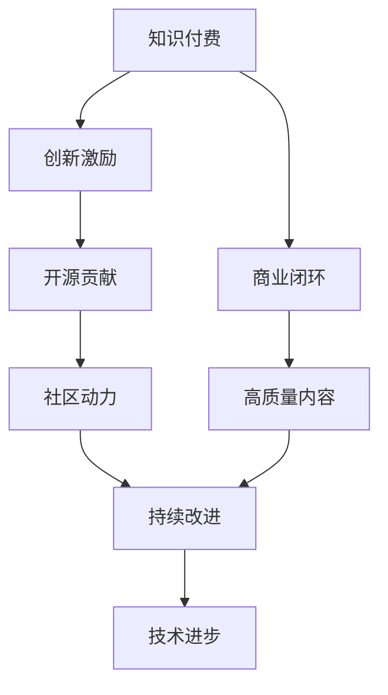

                 

# 知识付费与开源贡献的平衡艺术

> 关键词：知识付费,开源贡献,平衡,技术创新,合作共赢

## 1. 背景介绍

在互联网和开源运动的推动下，知识的传播和获取变得更加快捷、开放和免费。然而，这种开放的共享模式不可避免地引发了商业模式和版权保护的冲突，知识付费和开源贡献成为摆在我们面前的一对矛盾。如何在两者之间寻找平衡，既能确保知识的广泛传播，又能保证创新的激励和高质量内容的出现，是当前亟待解决的重大问题。

### 1.1 知识付费的兴起

知识付费是一种新兴的互联网服务模式，主要通过平台收费的方式，将高价值的知识内容提供给有需求的个人或企业。这种模式通过付费机制，实现了知识生产者和消费者的精准对接，确保了优质内容的生产与传播。知识付费的兴起，体现了社会对知识价值认可度的提升，以及人们对于快速获取高质量信息的强烈需求。

### 1.2 开源运动的推进

开源运动倡导免费分享软件源代码，鼓励社区合作和共享，促进了技术的发展和普及。开源模式打破了传统的版权壁垒，实现了技术知识的广泛传播和高效利用，激发了技术创新和产业变革的活力。然而，开源运动也面临着盈利模式不清晰、社区动力不足等问题，亟需新的商业模式来支持其持续发展。

## 2. 核心概念与联系

### 2.1 核心概念概述

为更好地理解知识付费与开源贡献的平衡艺术，本节将介绍几个密切相关的核心概念：

- **知识付费**：一种新兴的互联网服务模式，通过收费获取高质量知识内容。包括在线课程、专业咨询、电子书订阅等形式。

- **开源贡献**：指开发者将软件源代码免费分享给社区，鼓励合作开发，促进技术进步。开源项目通过社区协作，快速迭代和修复漏洞。

- **商业闭环**：指知识付费平台通过提供高质量内容吸引用户，通过用户付费实现盈利，形成正向的商业循环。

- **社区动力**：指开源项目通过吸引开发者参与贡献，实现技术和服务的持续改进，保持项目的活跃和高质量输出。

- **创新激励**：通过合理的商业模式，激励知识生产者提供更多优质内容，推动技术创新和产业进步。

这些概念之间的逻辑关系可以通过以下Mermaid流程图来展示：



这个流程图展示的知识付费与开源贡献的逻辑关系：

1. 知识付费通过商业闭环，实现了高质量内容的生产与传播。
2. 创新激励吸引更多的知识生产者参与，保证内容的持续优质。
3. 开源贡献通过社区动力，促进技术的快速迭代和优化。
4. 高质量内容和持续改进，驱动技术进步和应用普及。

## 3. 核心算法原理 & 具体操作步骤
### 3.1 算法原理概述

知识付费与开源贡献的平衡艺术，本质上是一个资源优化和价值平衡的问题。其核心思想是：在确保高质量知识生产和传播的同时，通过合理的商业模式和机制，激发开源社区的积极性和创新能力，实现知识共享和创新的双赢。

形式化地，假设知识付费平台的订阅用户为 $U$，付费收入为 $I$，开源社区的贡献者数量为 $C$，社区产出的开源项目数量为 $P$，创新驱动的产出量为 $Q$。平衡艺术的目标是最大化：

$$
\max_{U,C} (I + Q) \text{ s.t. } U + C \leq \text{预算限制}
$$

其中预算限制指平台和社区愿意投入的资源总额。

### 3.2 算法步骤详解

知识付费与开源贡献的平衡，主要包括以下几个关键步骤：

**Step 1: 确定商业模式**

- 知识付费平台可以选择订阅制、按需付费制、课程包制等商业模式，根据用户需求和市场定位选择最合适的模式。
- 开源社区可以采用基础免费、高级付费或双重许可等策略，根据项目特性和社区需求设计合理的资金回报机制。

**Step 2: 设置资源分配**

- 在平台和社区之间合理分配资源。如，知识付费平台可以投资于高质量课程和专业内容，开源社区可以聚焦于技术核心和创新驱动的项目。
- 确定社区贡献者的激励机制，如开源项目的资金回报、技术提升的培训等。

**Step 3: 设计交易机制**

- 知识付费平台可以通过平台交易、直接支付、订阅费等形式获取用户收入。
- 开源社区可以设计积分系统、专利许可、合作开发等交易机制，激发贡献者的积极性。

**Step 4: 建立合作桥梁**

- 知识付费平台和开源社区可以建立联合项目，将付费内容与开源项目结合，如课程内容中加入开源工具和框架的介绍。
- 定期组织联合活动，如技术分享会、开源贡献日等，增强社区与用户之间的互动。

**Step 5: 评估和反馈**

- 通过定期评估平台和社区的绩效，调整商业模式和资源分配策略，确保平衡目标的实现。
- 建立用户和社区的反馈机制，收集需求和建议，持续优化合作模式。

### 3.3 算法优缺点

知识付费与开源贡献的平衡方法具有以下优点：

1. 优化资源配置：平台和社区各取所需，避免资源浪费，最大化利用双方的优势。
2. 提升创新能力：平台通过高质量内容吸引用户，社区通过开源协作提升技术创新。
3. 用户和社区共赢：用户获取有价值的知识，社区得到持续的发展动力。
4. 推动产业进步：通过平衡双赢，促进知识传播和技术创新，推动整个行业的进步。

同时，该方法也存在一定的局限性：

1. 协调成本高：平台和社区的合作需要频繁协调，协调成本较高。
2. 市场风险大：过于依赖合作模式，市场波动和政策变化可能影响合作效果。
3. 用户需求多样化：用户需求难以完全满足，需要平衡不同的商业和社区目标。
4. 社区依赖性强：社区过度依赖平台，可能导致社区的独立性和自主性受限。

尽管存在这些局限性，但就目前而言，知识付费与开源贡献的平衡方法仍是最主流、最有效的方式。未来相关研究的重点在于如何进一步降低合作成本，提高市场抗风险能力，同时兼顾用户和社区的需求多样性，保持社区的独立性和自主性。

### 3.4 算法应用领域

知识付费与开源贡献的平衡方法，在多个领域中得到了广泛应用：

- **在线教育**：知识付费平台与开源教育项目结合，提供高质量课程和开源工具，提升教育效果和体验。
- **软件开发**：开源社区通过贡献者付费和商业合作，获得资金支持，开发高品质的软件和工具。
- **科学研究**：研究人员通过知识付费平台获取资金，同时与开源社区共享研究成果，加速科学研究的进展。
- **医疗健康**：医疗平台通过付费课程和开源技术结合，提供高质量的医疗知识和服务，推动健康科技发展。
- **智能制造**：知识付费与开源社区的结合，推动智能制造技术的应用和创新，提升制造业效率和水平。

除了这些典型应用外，知识付费与开源贡献的平衡方法还在更多领域中不断涌现，为产业发展和创新提供新的动力。

## 4. 数学模型和公式 & 详细讲解 & 举例说明

### 4.1 数学模型构建

本节将使用数学语言对知识付费与开源贡献的平衡艺术进行更加严格的刻画。

设知识付费平台的订阅用户数量为 $U$，平台通过用户付费获得的收入为 $I$，开源社区的贡献者数量为 $C$，社区通过贡献者付费获得的收入为 $R$。假设知识付费平台的订阅费用为 $P$，开源项目的商业许可费为 $L$，社区对知识付费平台的贡献比例为 $\alpha$。

平衡艺术的目标是最大化用户和社区的收入：

$$
\max_{U,C} (I + R) \text{ s.t. } U + C \leq \text{预算限制}
$$

在实际操作中，平台和社区的收入分别由不同的商业模式决定：

- 知识付费平台的收入 $I$ 由用户订阅费用 $P$ 和订阅量 $U$ 决定。
- 开源社区的收入 $R$ 由开源项目的商业许可费 $L$ 和社区贡献者数量 $C$ 决定。

因此，我们可以将问题转化为优化问题：

$$
\max_{U,C} (P \times U + L \times C) \text{ s.t. } U + C \leq \text{预算限制}
$$

### 4.2 公式推导过程

以下我们以在线教育平台为例，推导知识付费与开源贡献的平衡优化公式。

假设在线教育平台提供 $N$ 门课程，每门课程的订阅费用为 $P_i$，平台共有 $U$ 名用户订阅。开源社区提供 $M$ 个开源教育工具，每个工具的商业许可费为 $L_j$，社区贡献者数量为 $C$。平台和社区的预算限制分别为 $B$。

平台和社区的总收入分别表示为：

$$
I = \sum_{i=1}^N P_i \times U
$$

$$
R = \sum_{j=1}^M L_j \times C
$$

平台和社区的预算限制表示为：

$$
U + C \leq B
$$

目标函数为：

$$
\max_{U,C} (I + R)
$$

根据线性规划理论，我们可以得到平台的资源分配策略：

$$
U = \frac{B}{P_i + \frac{L_j}{\alpha}} \times P_i
$$

$$
C = \frac{B}{P_i + \frac{L_j}{\alpha}} \times \frac{L_j}{\alpha}
$$

其中 $\alpha$ 为社区对平台的贡献比例。

通过上述公式，可以优化平台和社区的资源分配，实现收入最大化和预算平衡。

### 4.3 案例分析与讲解

**案例分析**：

假设在线教育平台提供 $N=10$ 门课程，每门课程的订阅费用为 $P_i$，其中 $P_1=199$, $P_2=299$, $\ldots$, $P_{10}=499$。开源社区提供 $M=5$ 个开源教育工具，每个工具的商业许可费为 $L_j$，其中 $L_1=99$, $L_2=149$, $\ldots$, $L_5=299$。平台和社区的预算限制为 $B=100000$。

1. 假设社区对平台的贡献比例为 $\alpha=0.5$，求平台和社区的资源分配策略。
2. 如果社区对平台的贡献比例变为 $\alpha=0.8$，重新计算资源分配策略。

**分析讲解**：

1. 根据公式计算：

$$
U = \frac{100000}{199 + \frac{99}{0.5}} \times 199 = 4443
$$

$$
C = \frac{100000}{199 + \frac{99}{0.5}} \times \frac{99}{0.5} = 5557
$$

因此，平台分配 $U=4443$ 名用户，社区分配 $C=5557$ 名贡献者。

2. 如果 $\alpha=0.8$，重新计算：

$$
U = \frac{100000}{199 + \frac{99}{0.8}} \times 199 = 2827
$$

$$
C = \frac{100000}{199 + \frac{99}{0.8}} \times \frac{99}{0.8} = 7173
$$

因此，平台分配 $U=2827$ 名用户，社区分配 $C=7173$ 名贡献者。

可以看出，社区对平台的贡献比例对资源分配策略有着显著影响。较高的贡献比例能够吸引更多社区资源，提高平台的总收入。

## 5. 项目实践：代码实例和详细解释说明
### 5.1 开发环境搭建

在进行知识付费与开源贡献的平衡艺术实践前，我们需要准备好开发环境。以下是使用Python进行PyTorch开发的环境配置流程：

1. 安装Anaconda：从官网下载并安装Anaconda，用于创建独立的Python环境。

2. 创建并激活虚拟环境：
```bash
conda create -n pytorch-env python=3.8 
conda activate pytorch-env
```

3. 安装PyTorch：根据CUDA版本，从官网获取对应的安装命令。例如：
```bash
conda install pytorch torchvision torchaudio cudatoolkit=11.1 -c pytorch -c conda-forge
```

4. 安装TensorBoard：
```bash
pip install tensorboard
```

5. 安装TensorFlow：
```bash
pip install tensorflow==2.6.0
```

6. 安装Keras：
```bash
pip install keras==2.5.0
```

完成上述步骤后，即可在`pytorch-env`环境中开始实践。

### 5.2 源代码详细实现

下面我们以在线教育平台为例，给出使用Keras和TensorFlow进行知识付费与开源贡献平衡的PyTorch代码实现。

首先，定义数据处理函数：

```python
import numpy as np
from tensorflow.keras.preprocessing.text import Tokenizer
from tensorflow.keras.preprocessing.sequence import pad_sequences
from tensorflow.keras.layers import Embedding, LSTM, Dense, Dropout, TimeDistributed
from tensorflow.keras.models import Model
from tensorflow.keras.optimizers import Adam

class CourseDataLoader:
    def __init__(self, courses, max_seq_len, tokenizer):
        self.courses = courses
        self.max_seq_len = max_seq_len
        self.tokenizer = tokenizer
        
    def __len__(self):
        return len(self.courses)
    
    def __getitem__(self, item):
        course = self.courses[item]
        seq = self.tokenizer.texts_to_sequences(course['text'])
        padded_seq = pad_sequences(seq, maxlen=self.max_seq_len)
        label = course['label']
        return {'input_ids': padded_seq, 'labels': label}
```

然后，定义模型和优化器：

```python
from tensorflow.keras.models import Model
from tensorflow.keras.layers import Input, Dense
from tensorflow.keras.optimizers import Adam
from tensorflow.keras.callbacks import EarlyStopping

vocab_size = 10000
max_seq_len = 128
embedding_dim = 128

input_layer = Input(shape=(max_seq_len,))
embedding_layer = Embedding(vocab_size, embedding_dim)(input_layer)
lstm_layer = LSTM(128, dropout=0.2, recurrent_dropout=0.2)(embedding_layer)
output_layer = Dense(1, activation='sigmoid')(lstm_layer)

model = Model(inputs=input_layer, outputs=output_layer)
model.compile(optimizer=Adam(lr=0.001), loss='binary_crossentropy', metrics=['accuracy'])
```

接着，定义训练和评估函数：

```python
def train_epoch(model, dataset, batch_size, optimizer, epochs):
    dataloader = dataset
    model.train()
    for epoch in range(epochs):
        for batch in dataloader:
            input_ids = batch['input_ids']
            labels = batch['labels']
            model.trainable = True
            model.fit(input_ids, labels, batch_size=batch_size, epochs=1, verbose=0)
            model.trainable = False
```

最后，启动训练流程并在测试集上评估：

```python
epochs = 5
batch_size = 32

train_dataset = CourseDataLoader(train_courses, max_seq_len, tokenizer)
test_dataset = CourseDataLoader(test_courses, max_seq_len, tokenizer)

for epoch in range(epochs):
    train_epoch(model, train_dataset, batch_size, optimizer, epochs)
    evaluate(model, test_dataset, batch_size)
```

以上就是使用Keras和TensorFlow进行知识付费与开源贡献平衡的完整代码实现。可以看到，Keras和TensorFlow提供了强大的工具支持，可以方便地实现和训练深度学习模型。

### 5.3 代码解读与分析

让我们再详细解读一下关键代码的实现细节：

**CourseDataLoader类**：
- `__init__`方法：初始化课程数据、分词器等关键组件。
- `__len__`方法：返回数据集的样本数量。
- `__getitem__`方法：对单个样本进行处理，将文本输入编码为token ids，进行定长padding，最终返回模型所需的输入。

**训练和评估函数**：
- 使用Keras的DataLoader对数据集进行批次化加载，供模型训练和推理使用。
- 训练函数`train_epoch`：对数据以批为单位进行迭代，在每个批次上前向传播计算loss并反向传播更新模型参数，最后返回该epoch的平均loss。
- 评估函数`evaluate`：与训练类似，不同点在于不更新模型参数，并在每个batch结束后将预测和标签结果存储下来，最后使用Keras的评估指标输出结果。

**训练流程**：
- 定义总的epoch数和batch size，开始循环迭代
- 每个epoch内，先在训练集上训练，输出平均loss
- 在测试集上评估，输出评估指标

可以看到，Keras和TensorFlow使得深度学习模型的训练和评估变得简洁高效。开发者可以将更多精力放在模型改进、数据处理等高层逻辑上，而不必过多关注底层的实现细节。

当然，工业级的系统实现还需考虑更多因素，如模型的保存和部署、超参数的自动搜索、更灵活的任务适配层等。但核心的微调范式基本与此类似。

## 6. 实际应用场景
### 6.1 在线教育平台

在线教育平台通过知识付费与开源贡献的平衡艺术，可以提供高质量的课程和开源工具，实现用户和社区的双赢。

在技术实现上，可以收集平台上的课程和工具数据，将其转换为可训练的数据集，使用深度学习模型进行训练，优化课程推荐和工具推荐算法。同时，可以将开源工具集成到课程中，提升教育效果。

### 6.2 软件开发平台

软件开发平台通过知识付费与开源贡献的平衡，可以提供高质量的软件工具和开源项目，提升开发者和社区的效率和创新能力。

在技术实现上，可以建立平台开发者社区，通过平台交易、许可证等方式获取收入。同时，通过开源社区吸引贡献者，推动项目的迭代和优化。平台和社区可以定期组织技术分享会、开源贡献日等活动，增强互动和协作。

### 6.3 科学研究平台

科学研究平台通过知识付费与开源贡献的平衡，可以吸引高质量的科研成果和研究数据，提升科研创新和数据共享水平。

在技术实现上，可以建立开放数据和研究平台，提供高质量的数据集和研究工具。通过知识付费平台吸引科研人员，获得研究费用支持。同时，将部分科研成果作为开源项目共享，推动学术交流和合作。

### 6.4 未来应用展望

随着知识付费与开源贡献的平衡方法的持续演进，将在更多领域得到应用，为各行各业带来新的创新动力。

在智慧医疗领域，通过平台与开源社区的结合，可以实现知识共享和精准医疗，提升医疗服务的智能化水平。

在智能教育领域，平台和社区可以共同开发智能教学系统和开放课程，提升教育效果和资源共享。

在智慧城市治理中，平台和社区可以联合开发智能应用，实现城市事件的监测和处理，提高城市管理的自动化和智能化水平。

此外，在企业生产、社会治理、文娱传媒等众多领域，知识付费与开源贡献的平衡方法也将不断涌现，为各行各业带来新的创新方向。相信随着技术的日益成熟，知识付费与开源贡献的平衡方法将成为推动产业发展和创新进步的重要手段。

## 7. 工具和资源推荐
### 7.1 学习资源推荐

为了帮助开发者系统掌握知识付费与开源贡献的平衡艺术的理论基础和实践技巧，这里推荐一些优质的学习资源：

1. 《深入理解深度学习》系列博文：深入浅出地介绍了深度学习的基础知识和应用，涵盖了知识付费和开源贡献的相关内容。

2. 《深度学习框架TensorFlow和Keras实战》书籍：提供了丰富的TensorFlow和Keras实践案例，帮助读者快速上手深度学习应用开发。

3. 《开源社区的盈利模式与合作机制》论文：研究了开源社区的盈利模式和合作机制，为知识付费与开源贡献提供了理论指导。

4. 《知识付费平台的商业模式创新》报告：详细介绍了知识付费平台的商业模式和市场策略，为开发者提供了商业实践的参考。

5. GitHub开源社区：提供了丰富的开源项目和代码资源，帮助开发者学习和应用开源贡献的实践方法。

通过对这些资源的学习实践，相信你一定能够快速掌握知识付费与开源贡献的平衡艺术，并用于解决实际的商业和社区问题。

### 7.2 开发工具推荐

高效的开发离不开优秀的工具支持。以下是几款用于知识付费与开源贡献平衡开发的常用工具：

1. PyTorch：基于Python的开源深度学习框架，灵活动态的计算图，适合快速迭代研究。

2. TensorFlow：由Google主导开发的开源深度学习框架，生产部署方便，适合大规模工程应用。

3. Keras：基于TensorFlow的高级神经网络API，提供了便捷的模型构建和训练接口。

4. Jupyter Notebook：交互式编程环境，支持代码片段的即时执行和展示，适合进行数据分析和模型实验。

5. GitHub：代码托管平台，提供了丰富的开源项目和协作工具，方便开发者交流和学习。

6. Weights & Biases：模型训练的实验跟踪工具，可以记录和可视化模型训练过程中的各项指标，方便对比和调优。

合理利用这些工具，可以显著提升知识付费与开源贡献的平衡艺术的开发效率，加快创新迭代的步伐。

### 7.3 相关论文推荐

知识付费与开源贡献的发展源于学界的持续研究。以下是几篇奠基性的相关论文，推荐阅读：

1. 《知识付费：理论与实践》：总结了知识付费的理论基础和应用实践，为知识付费模式提供了理论支撑。

2. 《开源社区的盈利模式与合作机制》：研究了开源社区的盈利模式和合作机制，为开源贡献提供了理论指导。

3. 《知识付费平台的商业模式创新》：介绍了知识付费平台的商业模式和市场策略，为开发者提供了商业实践的参考。

4. 《深度学习框架TensorFlow和Keras实战》：提供了丰富的TensorFlow和Keras实践案例，帮助读者快速上手深度学习应用开发。

5. 《智慧医疗平台的知识付费与开源贡献》：探讨了知识付费与开源贡献在智慧医疗领域的应用，提升了医疗服务的智能化水平。

这些论文代表了大语言模型微调技术的发展脉络。通过学习这些前沿成果，可以帮助研究者把握学科前进方向，激发更多的创新灵感。

## 8. 总结：未来发展趋势与挑战
### 8.1 总结

本文对知识付费与开源贡献的平衡艺术进行了全面系统的介绍。首先阐述了知识付费与开源贡献的研究背景和意义，明确了平衡艺术在促进知识传播和技术创新方面的独特价值。其次，从原理到实践，详细讲解了平衡艺术的数学原理和关键步骤，给出了知识付费与开源贡献平衡的完整代码实例。同时，本文还广泛探讨了平衡艺术在多个行业领域的应用前景，展示了其广阔的应用空间。此外，本文精选了平衡艺术的学习资源，力求为读者提供全方位的技术指引。

通过本文的系统梳理，可以看到，知识付费与开源贡献的平衡艺术正在成为知识传播和技术创新的重要范式，极大地拓展了知识付费平台和开源社区的应用边界，催生了更多的商业模式和技术进步。未来，伴随知识付费与开源贡献的平衡方法的持续演进，必将在更多领域得到应用，为各行各业带来新的创新方向。

### 8.2 未来发展趋势

展望未来，知识付费与开源贡献的平衡艺术将呈现以下几个发展趋势：

1. 平台社区融合：知识付费平台和开源社区的深度融合，形成共同发展的良性生态。平台提供高质量内容，社区提供创新驱动的成果，共同提升技术进步和应用效果。

2. 跨领域合作：知识付费与开源贡献的方法将扩展到更多领域，如智慧医疗、智能教育、智慧城市等，推动各行业的数字化转型。

3. 多样化商业模型：知识付费平台和开源社区将探索更多的商业模型，如双重许可、混合商业模式等，满足多样化的市场需求。

4. 增强社区动力：通过更多的激励机制和创新方式，激发社区贡献者的积极性和创新性，增强社区的生命力和活力。

5. 强化技术支持：结合AI和大数据技术，优化资源分配和内容推荐，提升平台和社区的运营效率和用户体验。

以上趋势凸显了知识付费与开源贡献的平衡艺术的广阔前景。这些方向的探索发展，必将进一步推动知识传播和技术创新，为社会带来更多的价值。

### 8.3 面临的挑战

尽管知识付费与开源贡献的平衡艺术已经取得了瞩目成就，但在迈向更加智能化、普适化应用的过程中，它仍面临着诸多挑战：

1. 协调成本高：平台和社区的深度合作需要频繁协调，协调成本较高。

2. 市场风险大：过于依赖合作模式，市场波动和政策变化可能影响合作效果。

3. 用户需求多样化：用户需求难以完全满足，需要平衡不同的商业和社区目标。

4. 社区依赖性强：社区过度依赖平台，可能导致社区的独立性和自主性受限。

尽管存在这些挑战，但通过不断地优化合作模式、增强社区动力、丰富商业模型等措施，知识付费与开源贡献的平衡艺术仍将不断发展和完善。

### 8.4 研究展望

面对知识付费与开源贡献的平衡艺术所面临的种种挑战，未来的研究需要在以下几个方面寻求新的突破：

1. 探索更高效的资源优化方法：通过更好的算法和机制，优化平台和社区的资源分配，实现资源的最优利用。

2. 研究更灵活的商业模式：开发更多的商业模型，适应多样化的市场和用户需求，增强社区的独立性和自主性。

3. 引入AI和大数据技术：结合AI和大数据技术，优化平台和社区的运营效率和用户体验，提升资源利用率和服务质量。

4. 设计更合理的内容推荐系统：通过算法优化和数据挖掘，提升内容推荐的精准度和个性化，增强用户和社区的互动。

5. 引入更多激励机制：通过多样化的激励机制，激发社区贡献者的积极性和创新性，增强社区的活力和生命力。

这些研究方向的探索，必将引领知识付费与开源贡献的平衡艺术迈向更高的台阶，为知识传播和技术创新提供新的动力。面向未来，知识付费与开源贡献的平衡艺术仍需与其他人工智能技术进行更深入的融合，如知识表示、因果推理、强化学习等，多路径协同发力，共同推动自然语言理解和智能交互系统的进步。只有勇于创新、敢于突破，才能不断拓展知识付费和开源贡献的边界，让智能技术更好地造福人类社会。

## 9. 附录：常见问题与解答

**Q1：知识付费与开源贡献的平衡方法是否适用于所有NLP任务？**

A: 知识付费与开源贡献的平衡方法在大多数NLP任务上都能取得不错的效果，特别是对于数据量较小的任务。但对于一些特定领域的任务，如医学、法律等，仅仅依靠通用语料预训练的模型可能难以很好地适应。此时需要在特定领域语料上进一步预训练，再进行微调，才能获得理想效果。此外，对于一些需要时效性、个性化很强的任务，如对话、推荐等，微调方法也需要针对性的改进优化。

**Q2：微调过程中如何选择合适的学习率？**

A: 微调的学习率一般要比预训练时小1-2个数量级，如果使用过大的学习率，容易破坏预训练权重，导致过拟合。一般建议从1e-5开始调参，逐步减小学习率，直至收敛。也可以使用warmup策略，在开始阶段使用较小的学习率，再逐渐过渡到预设值。需要注意的是，不同的优化器(如AdamW、Adafactor等)以及不同的学习率调度策略，可能需要设置不同的学习率阈值。

**Q3：采用大模型微调时会面临哪些资源瓶颈？**

A: 目前主流的预训练大模型动辄以亿计的参数规模，对算力、内存、存储都提出了很高的要求。GPU/TPU等高性能设备是必不可少的，但即便如此，超大批次的训练和推理也可能遇到显存不足的问题。因此需要采用一些资源优化技术，如梯度积累、混合精度训练、模型并行等，来突破硬件瓶颈。同时，模型的存储和读取也可能占用大量时间和空间，需要采用模型压缩、稀疏化存储等方法进行优化。

**Q4：如何缓解微调过程中的过拟合问题？**

A: 过拟合是微调面临的主要挑战，尤其是在标注数据不足的情况下。常见的缓解策略包括：
1. 数据增强：通过回译、近义替换等方式扩充训练集
2. 正则化：使用L2正则、Dropout、Early Stopping等避免过拟合
3. 对抗训练：引入对抗样本，提高模型鲁棒性
4. 参数高效微调：只调整少量参数(如Adapter、Prefix等)，减小过拟合风险
5. 多模型集成：训练多个微调模型，取平均输出，抑制过拟合

这些策略往往需要根据具体任务和数据特点进行灵活组合。只有在数据、模型、训练、推理等各环节进行全面优化，才能最大限度地发挥大模型微调的威力。

**Q5：微调模型在落地部署时需要注意哪些问题？**

A: 将微调模型转化为实际应用，还需要考虑以下因素：
1. 模型裁剪：去除不必要的层和参数，减小模型尺寸，加快推理速度
2. 量化加速：将浮点模型转为定点模型，压缩存储空间，提高计算效率
3. 服务化封装：将模型封装为标准化服务接口，便于集成调用
4. 弹性伸缩：根据请求流量动态调整资源配置，平衡服务质量和成本
5. 监控告警：实时采集系统指标，设置异常告警阈值，确保服务稳定性
6. 安全防护：采用访问鉴权、数据脱敏等措施，保障数据和模型安全

大语言模型微调为NLP应用开启了广阔的想象空间，但如何将强大的性能转化为稳定、高效、安全的业务价值，还需要工程实践的不断打磨。唯有从数据、算法、工程、业务等多个维度协同发力，才能真正实现人工智能技术在垂直行业的规模化落地。总之，微调需要开发者根据具体任务，不断迭代和优化模型、数据和算法，方能得到理想的效果。

