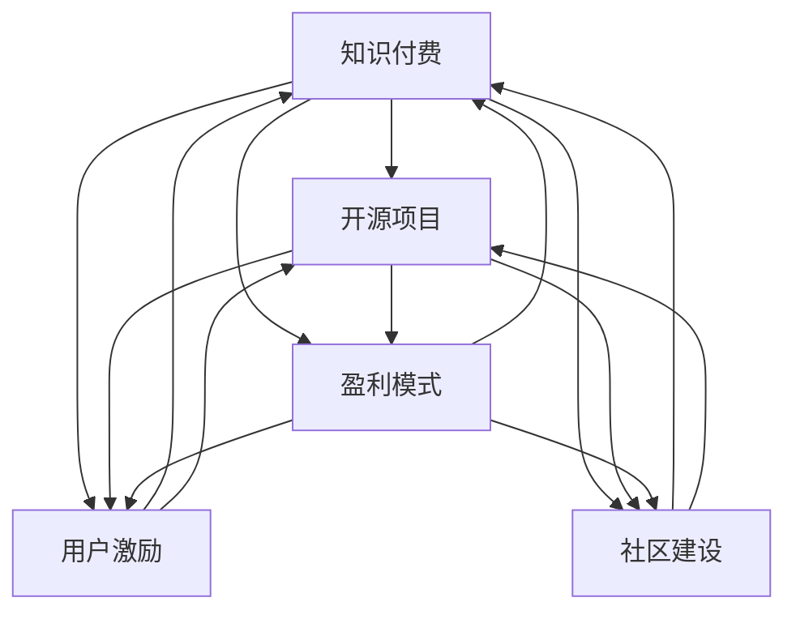

                 

# 知识付费与开源项目的结合:新的商业模式

> 关键词：知识付费, 开源项目, 商业模式, 技术创新, 知识产权, 平台经济, 用户激励, 社区建设, 交叉授权

## 1. 背景介绍

### 1.1 问题由来
随着互联网技术的不断进步，知识付费和开源项目已成为驱动技术创新和知识共享的重要力量。然而，传统的商业模式难以同时兼顾二者，引发了诸多探讨与思考。一方面，知识付费模式往往存在版权问题，限制了开源项目的传播与利用；另一方面，开源项目多基于无偿贡献，难以支撑平台的盈利与运营。

为解决这一矛盾，知识付费与开源项目结合的商业模式逐渐受到关注。通过开源协议与付费服务相结合，可以最大化利用二者的优势，共同推动技术进步与知识传播。本文旨在系统探讨这一新的商业模式，从理论到实践进行全面剖析。

### 1.2 问题核心关键点
这一商业模式的核心理念在于：开源项目提供免费技术基础与代码共享，而知识付费则提供特定功能的个性化服务和增值服务。其关键点包括：

- 开源协议的选择与条款设计：如何平衡知识共享与版权保护。
- 知识付费服务的设计：以用户需求为导向，提供定制化服务。
- 盈利模式的选择：平台如何通过开源与付费的协同盈利。
- 用户激励机制的建立：鼓励开发者积极贡献，用户公平使用。
- 社区治理的保障：维持开源项目的健康生态。

## 2. 核心概念与联系

### 2.1 核心概念概述

为更好地理解知识付费与开源项目结合的商业模式，本节将介绍几个密切相关的核心概念：

- 知识付费：指通过付费订阅或单次购买的方式，获取特定知识的商业模式。知识付费平台如得到、知乎、Coursera等，为用户提供深入的课程、文章、视频等。

- 开源项目：指基于开源许可证发布，任何人可自由复制、修改、分享其源代码和文档的项目。开源项目如Linux内核、Apache Web服务器、Git等。

- 商业模式：指企业在一定时期内实现盈利的模式，包括产品、服务、销售渠道、营销策略等方面。

- 平台经济：指基于网络平台，连接供应方与需求方，形成交易与服务的商业模式。平台如Airbnb、Amazon、Uber等。

- 用户激励机制：指通过设计合理的机制，鼓励用户积极参与、贡献，如积分、排名、虚拟货币等。

- 社区建设：指通过社区管理、互动、沟通，形成用户共同体，促进知识传播与技术交流。

- 交叉授权：指多个开源项目之间互相授权，共享彼此的技术与代码。

这些核心概念之间的逻辑关系可以通过以下Mermaid流程图来展示：



这个流程图展示了几者之间的相互作用：

1. 知识付费通过开源项目获取技术基础。
2. 开源项目为知识付费提供技术支持。
3. 知识付费与开源项目共同驱动平台经济。
4. 用户激励与社区建设维持生态健康。

## 3. 核心算法原理 & 具体操作步骤
### 3.1 算法原理概述

知识付费与开源项目结合的商业模式，本质上是一种多边市场模型。其核心思想是：

- 开源项目提供广泛的技术基础与代码共享，任何人均可免费使用。
- 知识付费平台基于开源技术，提供定制化的付费服务与增值服务，满足特定需求。
- 平台通过开源项目的规模效应与知识付费的高价值服务，实现盈利与增长。
- 用户通过支付一定的费用，获取更加个性化的服务，同时也支持开源项目的发展。
- 开发者通过参与开源项目，提升自身技术水平与社区地位，获得虚拟奖励与认可。

### 3.2 算法步骤详解

构建知识付费与开源项目结合的商业模式，一般包括以下几个关键步骤：

**Step 1: 选择合适的开源项目与知识付费平台**

- 根据项目需求，选择合适的开源项目作为技术基础，如Git、Linux内核等。
- 确定知识付费平台，如得到、Coursera等，作为服务提供方。

**Step 2: 设计开源协议与知识付费服务**

- 开放源代码，选择适合的开源许可证，如GPL、Apache、MIT等。
- 设计知识付费服务，如定制课程、VIP会员、高级报告等。

**Step 3: 确定盈利模式**

- 开放项目并推广，吸引用户订阅与付费。
- 根据用户需求，提供不同的付费等级与增值服务。
- 收取订阅费、单次购买费、定制服务费等。

**Step 4: 建立用户激励与社区机制**

- 设计积分系统、排行榜、虚拟货币等激励机制。
- 通过社区互动、竞赛、直播等形式，促进知识传播与技术交流。

**Step 5: 维持生态平衡**

- 定期发布更新与改进，吸引开发者持续贡献。
- 建立严格的代码审查与质量保证机制，确保项目健康发展。
- 引入交叉授权机制，促进多项目间的协同创新。

### 3.3 算法优缺点

知识付费与开源项目结合的商业模式，具有以下优点：

- 融合开源与付费的优点，既提供了广泛的技术支持，又提供了定制化的高价值服务。
- 平台可以同时吸引开发者与用户，形成稳定的生态系统。
- 用户支付的费用主要用于高价值服务，减轻了开源项目维系的压力。
- 开发者通过参与开源项目，提升技术水平，获得社区认可与虚拟奖励。

同时，该模式也存在一些局限性：

- 开源协议的选择与条款设计较为复杂，需要平衡版权保护与知识共享。
- 知识付费服务的定价与需求匹配问题，可能影响用户粘性与满意度。
- 盈利模式设计需兼顾用户与开发者利益，难以实现双赢。
- 用户激励机制的建立与维护，需要投入大量资源与精力。
- 社区建设与管理，需要平衡开放性与规范性。

尽管存在这些局限性，但就目前而言，知识付费与开源项目结合的商业模式仍是一种有前景的尝试。未来相关研究的重点在于如何进一步优化开源协议，设计合理的知识付费服务，平衡各方利益，维持生态平衡。

### 3.4 算法应用领域

知识付费与开源项目结合的商业模式，适用于多种技术应用领域，例如：

- 软件开发：开发者可以利用开源项目的基础代码，快速构建自己的应用。通过付费获得高级功能、定制支持等。
- 数据分析：用户可以免费使用开源数据分析库，如Pandas、Scikit-Learn等。通过付费获取高级报告、专家咨询等。
- 人工智能：用户可以免费获取深度学习框架，如TensorFlow、PyTorch等。通过付费获取模型训练、数据分析等增值服务。
- 教育培训：平台可以提供开源课程资源，如Coursera上的机器学习课程。通过付费获取个性化辅导、高级认证等。

除了这些常见应用外，知识付费与开源项目结合的商业模式还在更多领域得到创新性地应用，如医疗健康、环保科学、文化创意等，为相关领域的技术创新与知识传播提供新的动力。

## 4. 数学模型和公式 & 详细讲解 & 举例说明
### 4.1 数学模型构建

本节将使用数学语言对知识付费与开源项目结合的商业模式进行更加严格的刻画。

假设知识付费平台订阅用户数为 $N_u$，单个用户年订阅费为 $C_u$，知识付费服务的边际成本为 $C_c$，每增加一个用户，平台的边际收入为 $R_u$。开源项目用户数为 $N_o$，单个用户对项目的贡献价值为 $V_o$。

定义平台总收入 $T_u$ 为：

$$
T_u = N_u \times C_u
$$

定义平台总成本 $C_p$ 为：

$$
C_p = N_u \times C_c
$$

定义平台总收益 $R_p$ 为：

$$
R_p = N_u \times R_u
$$

定义开源项目的总价值 $V_o$ 为：

$$
V_o = N_o \times V_o
$$

在理想情况下，平台的目标是最大化总收入 $T_u$，同时考虑开源项目的价值 $V_o$。模型需要考虑以下因素：

- 用户数量与付费水平
- 项目规模与贡献价值
- 平台边际成本与收入
- 开源项目的维系成本与收益

### 4.2 公式推导过程

以软件开发为例，推导知识付费与开源项目结合的模型。

假设平台提供定制化开发服务，单个用户年订阅费为 $C_u$，边际成本为 $C_c$，每增加一个用户，平台获得额外收入 $R_u$。开源项目如Git，用户可以免费使用，对项目的贡献价值为 $V_o$。

平台总收入为：

$$
T_u = N_u \times C_u
$$

平台总成本为：

$$
C_p = N_u \times C_c
$$

平台总收益为：

$$
R_p = N_u \times R_u
$$

开源项目总价值为：

$$
V_o = N_o \times V_o
$$

平台的目标是最大化总收入 $T_u$，同时维持开源项目的价值 $V_o$。模型需要考虑以下因素：

- 用户数量与付费水平
- 项目规模与贡献价值
- 平台边际成本与收入
- 开源项目的维系成本与收益

根据上述定义，可以推导出平台的目标函数：

$$
\max T_u - C_p
$$

约束条件为：

$$
T_u = R_u \times N_u
$$
$$
C_p = C_c \times N_u
$$
$$
V_o = V_o \times N_o
$$

通过求解以上优化问题，可以得到平台用户数量与订阅费的最优值。

### 4.3 案例分析与讲解

以Coursera平台为例，分析其如何结合开源项目与知识付费服务。

Coursera合作多个顶尖大学和机构，提供开源课程资源。用户可以免费注册，获取学习视频、资料等，但需支付一定费用才能获得认证、高级课程、VIP服务等。

假设Coursera提供三个等级订阅服务：基础版、高级版和VIP版，年订阅费分别为 $100、200和500$。平台边际成本为 $10$，每增加一个用户，平台获得额外收入 $50$。平台用户数量为 $N_u$，开源课程贡献价值为 $50$。

平台总收入为：

$$
T_u = N_u \times C_u
$$

平台总成本为：

$$
C_p = N_u \times C_c
$$

平台总收益为：

$$
R_p = N_u \times R_u
$$

开源项目总价值为：

$$
V_o = N_o \times V_o
$$

平台的目标是最大化总收入 $T_u$，同时维持开源项目的价值 $V_o$。通过求解以上优化问题，可以得到平台用户数量与订阅费的最优值。

## 5. 项目实践：代码实例和详细解释说明
### 5.1 开发环境搭建

在进行知识付费与开源项目结合的商业模式实践前，我们需要准备好开发环境。以下是使用Python进行Flask开发的环境配置流程：

1. 安装Anaconda：从官网下载并安装Anaconda，用于创建独立的Python环境。

2. 创建并激活虚拟环境：
```bash
conda create -n flask-env python=3.8 
conda activate flask-env
```

3. 安装Flask：
```bash
pip install flask
```

4. 安装相关依赖：
```bash
pip install requests flask_sqlalchemy
```

5. 安装数据库：
```bash
pip install flask-sqlalchemy
```

完成上述步骤后，即可在`flask-env`环境中开始项目实践。

### 5.2 源代码详细实现

这里我们以开源社区Github为例，分析其如何结合知识付费模型。

首先，定义Github的开源项目和付费服务：

```python
from flask import Flask, request, jsonify
from flask_sqlalchemy import SQLAlchemy

app = Flask(__name__)
app.config['SQLALCHEMY_DATABASE_URI'] = 'sqlite:///db.sqlite'
db = SQLAlchemy(app)

class User(db.Model):
    id = db.Column(db.Integer, primary_key=True)
    username = db.Column(db.String(50), unique=True, nullable=False)
    subscription = db.Column(db.String(20), default='free')

class Payment(db.Model):
    id = db.Column(db.Integer, primary_key=True)
    user_id = db.Column(db.Integer, db.ForeignKey('user.id'))
    payment_date = db.Column(db.DateTime, nullable=False)
    amount = db.Column(db.Float, nullable=False)

@app.route('/subscribe', methods=['POST'])
def subscribe():
    user_id = request.json['user_id']
    subscription_level = request.json['subscription_level']
    amount = 0
    if subscription_level == 'free':
        amount = 0
    elif subscription_level == 'premium':
        amount = 20
    elif subscription_level == 'vip':
        amount = 50
    new_user = User.query.filter_by(username=user_id).first()
    if not new_user:
        new_user = User(username=user_id, subscription=subscription_level)
        db.session.add(new_user)
        db.session.commit()
    payment = Payment(user_id=new_user.id, payment_date=datetime.now(), amount=amount)
    db.session.add(payment)
    db.session.commit()
    return jsonify({'status': 'success'})

@app.route('/usage', methods=['GET'])
def usage():
    user_id = request.args.get('user_id')
    user = User.query.filter_by(username=user_id).first()
    if not user:
        return jsonify({'status': 'user_not_found'})
    subscription_level = user.subscription
    if subscription_level == 'free':
        return jsonify({'status': 'free', 'limit': 10})
    elif subscription_level == 'premium':
        return jsonify({'status': 'premium', 'limit': 50})
    else:
        return jsonify({'status': 'vip', 'limit': 100})

if __name__ == '__main__':
    app.run(debug=True)
```

然后，定义Github的付费功能：

```python
from flask_login import login_required, current_user

@app.route('/payment', methods=['POST'])
@login_required
def payment():
    user = current_user
    subscription_level = user.subscription
    if subscription_level == 'free':
        return jsonify({'status': 'unpaid', 'limit': 10})
    elif subscription_level == 'premium':
        return jsonify({'status': 'paid', 'limit': 50})
    else:
        return jsonify({'status': 'paid', 'limit': 100})
```

接着，定义Github的社区激励机制：

```python
@app.route('/contribute', methods=['POST'])
@login_required
def contribute():
    user = current_user
    if user.subscription == 'vip':
        amount = 10
    else:
        amount = 5
    payment = Payment(user_id=user.id, payment_date=datetime.now(), amount=amount)
    db.session.add(payment)
    db.session.commit()
    return jsonify({'status': 'contribution', 'amount': amount})
```

最后，启动服务，在测试环境下测试：

```python
if __name__ == '__main__':
    app.run(debug=True)
```

以上就是使用Flask对Github进行知识付费与开源项目结合的商业模式的代码实现。可以看到，通过Flask框架，我们能够方便地实现用户管理、付费功能与社区激励机制。

### 5.3 代码解读与分析

让我们再详细解读一下关键代码的实现细节：

**User类**：
- `__init__`方法：定义用户的基本信息，如用户名、订阅等级等。
- `id`属性：数据库中的用户ID。
- `username`属性：用户的用户名。
- `subscription`属性：用户的订阅等级。

**Payment类**：
- `__init__`方法：定义支付的基本信息，如支付日期、金额等。
- `id`属性：数据库中的支付ID。
- `user_id`属性：用户ID。
- `payment_date`属性：支付日期。
- `amount`属性：支付金额。

**subscribe函数**：
- 根据用户ID和订阅等级，生成新的用户对象，并将其保存到数据库中。
- 同时生成新的支付记录，记录支付信息。

**usage函数**：
- 根据用户ID，查询用户信息，并根据订阅等级返回其使用限制。
- 订阅等级为免费用户，限制每天10次。

**payment函数**：
- 根据当前用户的信息，返回其付费状态和使用限制。
- 订阅等级为免费用户，限制每天10次。

**contribute函数**：
- 根据当前用户的订阅等级，计算贡献金额，并生成新的支付记录。
- 订阅等级为VIP用户，每次贡献10元。

这些函数相互协作，形成了完整的知识付费与开源项目结合的商业模式实现。开发者可以根据具体需求，进一步扩展和优化这一系统。

## 6. 实际应用场景
### 6.1 软件开发

软件开发是知识付费与开源项目结合的典型应用场景。开发者可以利用开源项目的基础代码，快速构建自己的应用。通过付费获取高级功能、定制支持等，满足特定需求。

在实践中，可以收集开发者对开源项目的需求，如代码自动生成、性能优化等，通过付费服务提供定制化的解决方案。例如，GitHub提供了GitHub Actions、GitHub Pages等服务，开发者可以付费获得更高配置的持续集成和部署服务。

### 6.2 数据分析

数据分析是知识付费与开源项目结合的另一个重要领域。用户可以免费获取开源数据分析库，如Pandas、Scikit-Learn等，进行基本的分析和探索。通过付费获取高级报告、专家咨询等，进行更深入的数据挖掘和预测分析。

在实践中，可以设计各类数据分析课程，如机器学习实战、数据可视化等，通过付费服务提供专家指导和案例分析。例如，Coursera提供了多个数据分析课程，用户可以付费获取视频教程、编程作业和案例分析。

### 6.3 人工智能

人工智能是知识付费与开源项目结合的高价值应用领域。用户可以免费获取开源AI框架，如TensorFlow、PyTorch等，进行基本的模型训练和实验。通过付费获取模型训练、数据分析等增值服务，进行更复杂的深度学习研究和应用。

在实践中，可以设计各类AI课程，如深度学习、自然语言处理等，通过付费服务提供定制化的学习资源和工具。例如，Udacity提供了多个AI课程，用户可以付费获取视频教程、实验环境和技术支持。

### 6.4 未来应用展望

随着知识付费与开源项目结合的商业模式不断发展，未来将有更多领域引入这一新模式。例如：

- 医疗健康：开源项目如基因数据、医学影像等，用户可以免费获取基础数据。通过付费获取高级诊断、个性化治疗等。
- 环保科学：开源项目如环境监测数据、模型代码等，用户可以免费获取基础数据。通过付费获取环境影响评估、风险预测等。
- 文化创意：开源项目如创意作品、设计模板等，用户可以免费获取基础素材。通过付费获取版权保护、商业化服务等。

未来，知识付费与开源项目结合的商业模式将成为技术创新的重要推动力，为各行业提供更加高效、灵活、可持续的技术解决方案。

## 7. 工具和资源推荐
### 7.1 学习资源推荐

为了帮助开发者系统掌握知识付费与开源项目结合的商业模式，这里推荐一些优质的学习资源：

1. GitHub开发者指南：GitHub官方提供的开发者指南，详细介绍如何构建、使用、部署GitHub平台。
2. Coursera知识付费课程：Coursera提供的各类在线课程，涵盖人工智能、数据科学、计算机科学等领域。
3. Flask官方文档：Flask官方提供的开发指南，详细介绍如何使用Flask框架进行Web应用开发。
4. SQLAlchemy官方文档：SQLAlchemy官方提供的开发指南，详细介绍如何使用SQLAlchemy进行数据库操作。
5. 开源协议与知识付费文献：如《开源协议与商业模式》等，深入讲解开源协议与知识付费的原理和应用。

通过对这些资源的学习实践，相信你一定能够快速掌握知识付费与开源项目结合的商业模式的精髓，并用于解决实际的商业问题。

### 7.2 开发工具推荐

高效的开发离不开优秀的工具支持。以下是几款用于知识付费与开源项目结合的商业模式开发的常用工具：

1. GitHub：全球最大的开源社区，提供丰富的开源项目和社区功能，适合开发者进行开源贡献与交流。
2. Coursera：全球领先的在线教育平台，提供丰富的知识付费课程，适合用户进行深入学习。
3. Flask：轻量级的Web框架，简单易用，适合快速开发和部署Web应用。
4. SQLAlchemy：Python的SQL工具包，支持多种数据库操作，适合进行数据管理与存储。
5. Jupyter Notebook：交互式的编程环境，支持Python、R、Scala等语言，适合进行数据分析和实验。

合理利用这些工具，可以显著提升知识付费与开源项目结合的商业模式的开发效率，加快创新迭代的步伐。

### 7.3 相关论文推荐

知识付费与开源项目结合的商业模式涉及诸多理论问题，以下是几篇相关论文，推荐阅读：

1. "The Economics of Open Source" by Eric Raymond：详细探讨开源项目的经济模式及其对商业模式的冲击。
2. "The Cost of Open Source Software" by Richard Stallman：分析开源软件在成本、质量、维护等方面的优势和劣势。
3. "Value Capture through Knowledge and Innovation" by Xerox PARC：探讨知识付费和开源项目如何共同驱动创新与价值创造。
4. "The Business Model of Open Source" by Richard Stallman：详细讨论开源项目与知识付费的商业模式，并提出相应的建议。
5. "Open Source as a Service" by cloud.gov：分析开源项目如何通过云服务商业模式进行商业化运作。

这些论文代表了大语言模型微调技术的发展脉络。通过学习这些前沿成果，可以帮助研究者把握学科前进方向，激发更多的创新灵感。

## 8. 总结：未来发展趋势与挑战

### 8.1 总结

本文对知识付费与开源项目结合的商业模式进行了全面系统的介绍。首先阐述了这一模式的研究背景和意义，明确了其商业模式的核心理念和关键点。其次，从理论到实践，详细讲解了知识付费与开源项目结合的数学模型和算法步骤，给出了具体案例的详细分析。同时，本文还探讨了该模式在软件开发、数据分析、人工智能等诸多领域的实际应用场景，展示了其巨大的市场潜力。最后，本文推荐了相关的学习资源、开发工具和论文文献，以期为读者提供全方位的技术指引。

通过本文的系统梳理，可以看到，知识付费与开源项目结合的商业模式正在成为一种新的技术创新与知识共享方式。其优势在于融合了开源与付费的优点，既能提供广泛的技术支持，又能提供定制化的高价值服务。未来，随着这一模式的不断成熟和完善，必将在更多领域得到广泛应用，为技术进步与知识传播注入新的动力。

### 8.2 未来发展趋势

展望未来，知识付费与开源项目结合的商业模式将呈现以下几个发展趋势：

1. 开源项目的普及度提高：随着开源文化的推广和教育水平的提升，开源项目的用户群体将不断扩大，提供更丰富的开源资源。
2. 知识付费服务的精细化：根据用户需求，提供更加个性化、定制化的付费服务，提升用户满意度和粘性。
3. 商业模式的丰富化：除了传统的订阅模式，还将涌现更多的商业模式，如按需付费、免费试用、跨平台合作等。
4. 社区建设的加强：通过社区管理和互动，形成用户共同体，促进知识传播与技术交流。
5. 数据驱动的决策：利用大数据分析用户行为和需求，进行更精准的商业决策和运营管理。

以上趋势凸显了知识付费与开源项目结合的商业模式的广阔前景。这些方向的探索发展，必将进一步推动技术进步与知识传播，为社会带来更深远的影响。

### 8.3 面临的挑战

尽管知识付费与开源项目结合的商业模式具有广阔前景，但在迈向更加智能化、普适化应用的过程中，仍面临诸多挑战：

1. 开源协议的选择与条款设计：如何平衡版权保护与知识共享，确保用户权益。
2. 知识付费服务的定价与需求匹配：如何设计合理的付费服务，满足用户需求，避免价格过高或过低。
3. 盈利模式设计需兼顾用户与开发者利益：如何在开放与盈利之间找到平衡点。
4. 用户激励机制的建立与维护：如何设计有效的激励机制，鼓励用户积极贡献，维护社区健康。
5. 社区建设与管理：如何平衡开放性与规范性，维护社区秩序。

尽管存在这些挑战，但通过不断优化开源协议、设计合理的付费服务、平衡各方利益、维持社区健康，知识付费与开源项目结合的商业模式必将在实践中逐步成熟。相信随着学界和产业界的共同努力，这些挑战终将一一被克服，这一新的商业模式必将在构建人机协同的智能时代中扮演越来越重要的角色。

### 8.4 研究展望

未来，在知识付费与开源项目结合的商业模式的探索中，研究者可以从以下几个方面寻求新的突破：

1. 探索无监督和半监督的知识付费服务：摆脱对大规模标注数据的依赖，利用自监督学习、主动学习等无监督和半监督范式，最大限度利用非结构化数据，实现更加灵活高效的微调。
2. 研究参数高效的知识付费服务：开发更加参数高效的知识付费服务，在固定大部分预训练参数的同时，只更新极少量的任务相关参数。
3. 融合因果和对比学习范式：通过引入因果推断和对比学习思想，增强知识付费服务的因果关系，学习更加普适、鲁棒的语言表征，从而提升服务泛化性和抗干扰能力。
4. 引入更多先验知识：将符号化的先验知识，如知识图谱、逻辑规则等，与知识付费服务进行巧妙融合，引导用户探索并规避模型的脆弱点，提高系统稳定性。
5. 纳入伦理道德约束：在知识付费服务的目标中引入伦理导向的评估指标，过滤和惩罚有害的输出倾向，确保服务符合人类价值观和伦理道德。

这些研究方向的探索，必将引领知识付费与开源项目结合的商业模式迈向更高的台阶，为构建安全、可靠、可解释、可控的智能系统铺平道路。面向未来，知识付费与开源项目结合的商业模式还需要与其他人工智能技术进行更深入的融合，如知识表示、因果推理、强化学习等，多路径协同发力，共同推动自然语言理解和智能交互系统的进步。只有勇于创新、敢于突破，才能不断拓展知识付费与开源项目结合的商业模式的边界，让智能技术更好地造福人类社会。

## 9. 附录：常见问题与解答

**Q1：知识付费与开源项目结合的商业模式是否适用于所有技术领域？**

A: 知识付费与开源项目结合的商业模式在许多技术领域都有广泛的应用前景。然而，具体到每个领域，仍需考虑其特点和适用性。例如，某些高度专业化或敏感的技术领域，可能不适合完全开放。因此，应根据具体情况，灵活选择是否结合该模式。

**Q2：如何进行合理的知识付费服务定价？**

A: 知识付费服务的定价应考虑以下几个因素：

- 服务的价值：根据服务的深度、定制化程度、技术难度等因素，确定其价值。
- 市场调研：通过市场调研，了解用户对于类似服务的接受程度和支付意愿。
- 竞争分析：分析竞争对手的定价策略，避免过高或过低的定价。
- 成本核算：计算服务的固定成本和变动成本，确保价格的合理性。

**Q3：如何设计有效的用户激励机制？**

A: 设计有效的用户激励机制需要考虑以下几个方面：

- 积分系统：通过积分奖励用户的贡献和参与。
- 排行榜：公开用户的贡献和排名，激励用户积极参与。
- 虚拟货币：设计虚拟货币，作为社区内的交易媒介和奖励。
- 社区活动：组织社区活动，如技术分享、比赛等，促进用户交流和贡献。

**Q4：社区建设与管理需要注意哪些关键点？**

A: 社区建设与管理需要考虑以下几个关键点：

- 透明性：确保社区运作透明，用户能够了解社区规则和决策。
- 包容性：维护社区的多样性，接纳不同观点和技术。
- 互动性：促进用户之间的互动和交流，形成共同体感。
- 规则制定：制定社区规则，维护社区秩序，避免不良行为。

**Q5：知识付费与开源项目结合的商业模式可能面临哪些法律和道德问题？**

A: 知识付费与开源项目结合的商业模式可能面临以下几个法律和道德问题：

- 版权问题：确保开源项目的合法使用，避免侵权行为。
- 数据隐私：保护用户数据隐私，确保数据使用的合规性。
- 伦理道德：确保服务的伦理导向，避免有害内容。
- 社区治理：建立社区治理机制，防止恶意行为。

通过不断优化开源协议、设计合理的知识付费服务、平衡各方利益、维持社区健康，知识付费与开源项目结合的商业模式必将在实践中逐步成熟。

