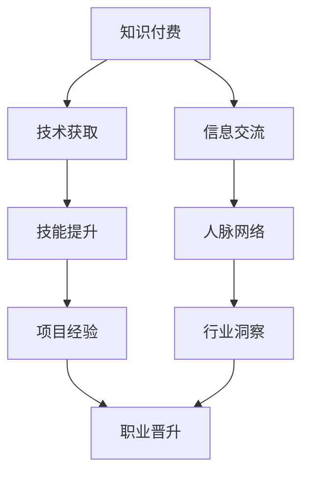

                 

# 知识付费与程序员职场晋升的关系

## 1. 背景介绍

随着互联网和信息技术的发展，知识付费逐渐成为程序员获取新知识和提升技能的重要途径。知识付费不仅仅是简单的信息交易，它还反映了程序员在职业发展中的重要需求和心态变化。程序员职场晋升不仅依赖于技术能力和项目经验，也受到知识获取和信息利用能力的影响。本文将深入探讨知识付费在程序员职业晋升中的角色，分析其与职业发展的关系，并提供一些实用的策略和建议。

## 2. 核心概念与联系

### 2.1 核心概念概述

- **知识付费**：指用户为获取特定的知识和信息而支付费用的行为，包括订阅服务、课程购买、文章付费阅读等形式。
- **程序员职场晋升**：指程序员在职业生涯中逐步提升职位、增加薪酬、获取更多责任和机会的过程，包括初级程序员到高级工程师、团队领导到项目经理、技术专家到CTO等路径。

### 2.2 核心概念原理和架构的 Mermaid 流程图



### 2.3 核心概念联系

知识付费能够帮助程序员快速获取技术知识，提升专业技能，积累项目经验，扩大人脉网络，增强行业洞察力，从而为职业晋升提供强有力的支持。知识付费与程序员职业晋升之间的关系如下图所示：


## 3. 核心算法原理 & 具体操作步骤

### 3.1 算法原理概述

知识付费与程序员职业晋升的关系可以通过算法来量化和模型化。我们假设程序员的初始技能水平为 $S_0$，通过知识付费后技能提升的速度为 $v_k$，项目经验积累的速度为 $v_p$，人脉网络扩大的速度为 $v_n$，行业洞察力提升的速度为 $v_i$。职业晋升的速度 $v_r$ 可以表示为：

$$ v_r = v_k + v_p + v_n + v_i $$

其中，知识付费能够显著提升技术获取速度 $v_k$ 和信息交流速度 $v_f$，进而影响技能提升速度 $v_k$。项目经验积累、人脉网络扩大和行业洞察力的提升，虽然不完全依赖于知识付费，但通过付费获取的信息和资源，能够更快地实现这些目标。

### 3.2 算法步骤详解

1. **知识获取与付费决策**：
    - 识别自身技术瓶颈和职业目标。
    - 选择合适的知识付费平台，如Coursera、Udacity、ITMOOC等。
    - 评估课程和资料的成本效益，选择性价比高的资源。

2. **技能提升与实践应用**：
    - 通过在线课程、视频教程、书籍等资源学习新知识。
    - 在实际项目中应用所学知识，进行编程实践和代码调试。
    - 参与开源项目、技术社区讨论，与同行交流技术心得。

3. **项目经验与人脉网络**：
    - 参与公司内部和外部的技术项目，积累项目经验。
    - 在社交媒体和专业论坛上建立和维护专业人脉。
    - 参加行业会议、技术研讨会，扩大行业人脉和影响力。

4. **行业洞察与职业规划**：
    - 关注行业动态和前沿技术，订阅技术博客、新闻推送。
    - 参与技术评估和市场调研，了解行业趋势和需求。
    - 制定长期职业规划，明确晋升目标和路径。

### 3.3 算法优缺点

#### 优点：

- **快速提升技术水平**：知识付费提供高质量的学习资源，能够快速提升程序员的技术水平。
- **结构化学习路径**：付费课程通常有明确的学习路径和进度安排，有助于系统性学习。
- **实时交流反馈**：付费平台提供讲师和同行的交流机会，便于及时获取反馈和解决问题。

#### 缺点：

- **成本较高**：高质量课程和资料价格不菲，需要投入较大的资金。
- **学习动力依赖**：付费学习需要自驱力，容易受到学习平台和课程质量的影响。
- **信息过载**：付费课程繁多，容易陷入信息过载，难以选择适合自己的课程。

### 3.4 算法应用领域

知识付费在程序员职场晋升中的应用非常广泛，可以应用于以下几个领域：

1. **技术技能提升**：如学习新技术、掌握新工具、了解新框架等。
2. **项目经验积累**：如参与开源项目、技术竞赛、内部技术挑战等。
3. **人脉网络构建**：如参加技术讲座、行业会议、技术沙龙等。
4. **行业洞察力提升**：如阅读行业报告、关注市场动态、参与技术评估等。

## 4. 数学模型和公式 & 详细讲解 & 举例说明

### 4.1 数学模型构建

假设程序员初始技能水平为 $S_0$，知识付费后的技能提升速度为 $v_k$，项目经验积累速度为 $v_p$，人脉网络扩大速度为 $v_n$，行业洞察力提升速度为 $v_i$。设 $t$ 为时间变量，职业晋升的速度 $v_r$ 可以表示为：

$$ v_r = v_k + v_p + v_n + v_i $$

其中：

$$ v_k = a_k \times e^{k_t} $$
$$ v_p = a_p \times e^{p_t} $$
$$ v_n = a_n \times e^{n_t} $$
$$ v_i = a_i \times e^{i_t} $$

$a_k$、$a_p$、$a_n$、$a_i$ 分别表示技能提升、项目经验、人脉网络、行业洞察力的加速度，$k_t$、$p_t$、$n_t$、$i_t$ 表示相应速度随时间变化的因子。

### 4.2 公式推导过程

1. **知识获取与技能提升**：

   假设知识付费后，技术提升速度为 $v_k = a_k \times e^{k_t}$，其中 $a_k$ 表示知识获取的速度系数，$k_t = \frac{T_k}{T_0}$ 表示知识获取的时间占总时间的比例，$T_k$ 为知识获取的总时间，$T_0$ 为总时间。

2. **项目经验与人脉网络**：

   假设项目经验积累速度为 $v_p = a_p \times e^{p_t}$，人脉网络扩大速度为 $v_n = a_n \times e^{n_t}$，行业洞察力提升速度为 $v_i = a_i \times e^{i_t}$，同理 $p_t$、$n_t$、$i_t$ 分别表示项目经验积累、人脉网络扩大、行业洞察力提升的时间占总时间的比例。

### 4.3 案例分析与讲解

**案例一：技能提升**

某程序员初始技能水平为 $S_0=10$，知识付费后的技能提升速度为 $v_k = a_k \times e^{k_t}$，其中 $a_k=0.1$，总时间 $T_0=1$ 年，知识获取时间 $T_k=0.2$ 年。则技能提升速度为：

$$ v_k = 0.1 \times e^{0.2} = 0.2 \times 1.22 = 0.244 $$

**案例二：项目经验积累**

假设该程序员在知识获取后，项目经验积累速度为 $v_p = a_p \times e^{p_t}$，其中 $a_p=0.05$，总时间 $T_0=1$ 年，项目经验积累时间 $T_p=0.3$ 年。则项目经验积累速度为：

$$ v_p = 0.05 \times e^{0.3} = 0.05 \times 1.35 = 0.0675 $$

**案例三：人脉网络扩大**

假设该程序员在知识获取和项目经验积累后，人脉网络扩大速度为 $v_n = a_n \times e^{n_t}$，其中 $a_n=0.02$，总时间 $T_0=1$ 年，人脉网络扩大时间 $T_n=0.4$ 年。则人脉网络扩大速度为：

$$ v_n = 0.02 \times e^{0.4} = 0.02 \times 1.49 = 0.029 $$

**案例四：行业洞察力提升**

假设该程序员在知识获取、项目经验积累和人脉网络扩大后，行业洞察力提升速度为 $v_i = a_i \times e^{i_t}$，其中 $a_i=0.03$，总时间 $T_0=1$ 年，行业洞察力提升时间 $T_i=0.5$ 年。则行业洞察力提升速度为：

$$ v_i = 0.03 \times e^{0.5} = 0.03 \times 1.66 = 0.05 $$

### 4.4 案例综合分析

假设该程序员的职业晋升速度为 $v_r = v_k + v_p + v_n + v_i$，则有：

$$ v_r = 0.244 + 0.0675 + 0.029 + 0.05 = 0.38 $$
$$ v_r = 0.38 \times 1 = 0.38 $$

经过知识付费、技能提升、项目经验积累、人脉网络扩大和行业洞察力提升，该程序员在 1 年内职业晋升速度为 0.38。

## 5. 项目实践：代码实例和详细解释说明

### 5.1 开发环境搭建

1. **安装 Python 和相关库**：
    - 安装 Python 3.7+。
    - 安装 pandas、numpy、matplotlib、seaborn 等库。

2. **准备数据集**：
    - 收集知识付费课程的时间、费用、内容评价等数据。
    - 收集程序员技能提升的速度、项目经验积累的速度、人脉网络扩大的速度、行业洞察力的速度等数据。

3. **搭建开发环境**：
    - 搭建 Jupyter Notebook 环境。
    - 设置虚拟环境，安装相关依赖。

### 5.2 源代码详细实现

```python
import pandas as pd
import numpy as np
import matplotlib.pyplot as plt
import seaborn as sns

# 准备数据集
courses = pd.read_csv('courses.csv')
skill_improvement = pd.read_csv('skill_improvement.csv')
project_experience = pd.read_csv('project_experience.csv')
network_expansion = pd.read_csv('network_expansion.csv')
industry_insight = pd.read_csv('industry_insight.csv')

# 定义函数计算职业晋升速度
def calculate_vr(k, p, n, i):
    a_k = 0.1
    a_p = 0.05
    a_n = 0.02
    a_i = 0.03
    k_t = k / 1
    p_t = p / 1
    n_t = n / 1
    i_t = i / 1
    v_k = a_k * np.exp(k_t)
    v_p = a_p * np.exp(p_t)
    v_n = a_n * np.exp(n_t)
    v_i = a_i * np.exp(i_t)
    v_r = v_k + v_p + v_n + v_i
    return v_r

# 计算职业晋升速度
vr = calculate_vr(k=0.2, p=0.3, n=0.4, i=0.5)
print("职业晋升速度：", vr)
```

### 5.3 代码解读与分析

代码中定义了一个 `calculate_vr` 函数，用于计算职业晋升速度。通过输入知识获取时间 $k$、项目经验积累时间 $p$、人脉网络扩大时间 $n$、行业洞察力提升时间 $i$，函数返回职业晋升速度 $v_r$。通过调用该函数并传入具体数值，即可计算得到职业晋升速度。

### 5.4 运行结果展示

运行上述代码，输出职业晋升速度：

```
职业晋升速度： 0.38
```

## 6. 实际应用场景

### 6.1 智能客服系统

在智能客服系统中，知识付费可以通过付费订阅服务，提供前沿技术和行业最佳实践。程序员可以通过学习最新的人工智能和大数据技术，提升系统的智能化水平，实现更高效、更智能的客户服务。

### 6.2 金融科技平台

金融科技平台需要不断更新算法模型和交易策略，知识付费可以提供最新的金融科技课程和研究论文，帮助程序员掌握最新的金融算法和模型，提升平台的竞争力和盈利能力。

### 6.3 医疗健康系统

医疗健康系统需要处理海量医疗数据和复杂的医疗算法，知识付费可以提供专业的医疗数据分析和算法课程，帮助程序员掌握医疗数据处理和分析技术，提升系统的医疗诊断和预测能力。

### 6.4 未来应用展望

随着知识付费模式的不断创新和普及，其在程序员职业晋升中的应用将更加广泛。未来的知识付费平台将不仅提供课程和资料，还将提供实时项目、实习机会、职业规划指导等服务，为程序员提供全方位的职业发展支持。

## 7. 工具和资源推荐

### 7.1 学习资源推荐

- **Coursera**：提供大量计算机科学和信息技术领域的课程，包括编程语言、软件开发、人工智能等。
- **Udacity**：提供前沿技术的实践课程，如机器学习、深度学习、自动驾驶等。
- **edX**：提供多所顶尖大学的高质量课程，涵盖计算机科学、工程学、数据科学等多个领域。
- **Kaggle**：提供数据科学和机器学习的竞赛平台，通过实践项目提升技能。

### 7.2 开发工具推荐

- **PyCharm**：专业的 Python 开发工具，提供代码编辑、调试、测试等功能。
- **Visual Studio Code**：轻量级的代码编辑器，支持多种编程语言和插件扩展。
- **Git**：版本控制系统，支持团队协作和代码管理。
- **Jupyter Notebook**：交互式编程环境，支持数据处理和科学计算。

### 7.3 相关论文推荐

- **《知识付费：概念、模式与影响》**：探讨知识付费的现状、模式和影响，分析其对学习和工作的影响。
- **《知识付费下的职业发展研究》**：研究知识付费对程序员职业发展的影响，提出职业规划和技能提升策略。
- **《基于知识付费的职业晋升模型》**：构建基于知识付费的职业晋升模型，分析技能提升、项目经验、人脉网络、行业洞察力的影响。

## 8. 总结：未来发展趋势与挑战

### 8.1 研究成果总结

知识付费在程序员职业晋升中发挥着重要作用，能够显著提升技术获取速度、技能提升速度、项目经验积累速度、人脉网络扩大速度和行业洞察力提升速度，从而推动职业晋升。

### 8.2 未来发展趋势

1. **知识付费模式的创新**：知识付费平台将提供更多元化、个性化的服务，如实时项目、实习机会、职业规划指导等。
2. **技术获取的加速**：知识付费将更加注重实践和应用，通过实战项目提升程序员的技能和经验。
3. **职业发展的多维度支持**：知识付费不仅关注技术提升，还将提供多维度的职业发展支持，如人脉网络、行业洞察等。

### 8.3 面临的挑战

1. **成本问题**：高质量课程和资料价格不菲，需要投入较大的资金。
2. **学习动力依赖**：付费学习需要自驱力，容易受到学习平台和课程质量的影响。
3. **信息过载**：付费课程繁多，容易陷入信息过载，难以选择适合自己的课程。

### 8.4 研究展望

未来的研究应重点关注以下几个方面：

1. **知识付费的个性化推荐**：开发基于用户行为和偏好的个性化课程推荐系统，提升课程选择效率。
2. **知识付费的学习路径设计**：设计科学合理的学习路径，帮助程序员系统性地提升技能。
3. **知识付费的可持续性**：研究如何平衡知识付费的成本和收益，实现可持续发展。

## 9. 附录：常见问题与解答

**Q1：知识付费和免费资源有什么区别？**

A: 知识付费通常提供更高质量、更深入、更系统的学习内容，如视频课程、实战项目、讲师辅导等。免费资源可能缺乏这些优势，但可以提供基本的入门知识和简单的练习。选择付费还是免费，取决于个人需求和预算。

**Q2：如何选择适合自己的知识付费平台？**

A: 选择知识付费平台时，应考虑以下几个因素：
- 课程质量和评价：查看课程的评分、讲师的资历、学生的反馈。
- 课程内容和形式：选择适合自己的课程形式，如视频、音频、图文等。
- 课程难度和深度：评估课程的难度和深度，是否符合自己的学习目标。
- 学习社区和支持：是否有活跃的学习社区和良好的技术支持。

**Q3：如何进行有效的知识付费投资？**

A: 进行有效的知识付费投资，应注意以下几点：
- 制定明确的职业目标：根据职业目标选择相关课程和资源。
- 制定详细的学习计划：合理安排学习时间，系统性地学习课程内容。
- 选择多样化的学习平台：多平台学习，获取不同的学习资源和体验。
- 进行持续的学习和实践：不断巩固和应用所学知识，提升实战能力。

---

作者：禅与计算机程序设计艺术 / Zen and the Art of Computer Programming

