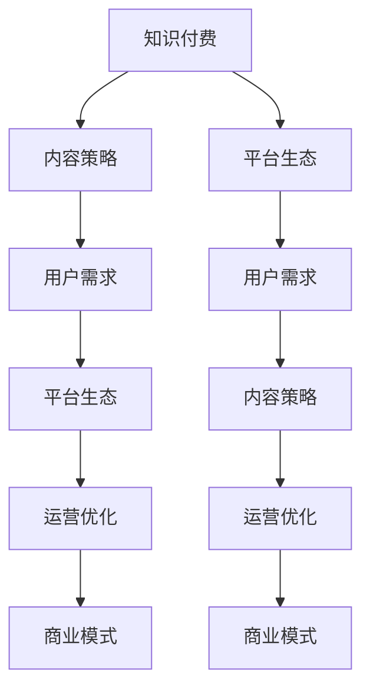

                 

# 知识付费创业中的内容价值 Maximization Strategy

> 关键词：知识付费,内容策略,价值最大化,用户需求,平台生态,运营优化,商业模式,数据驱动

## 1. 背景介绍

随着互联网的迅猛发展和信息爆炸时代的到来，知识付费行业迎来了蓬勃发展的新机遇。各大知识付费平台如雨后春笋般涌现，内容丰富、形式多样，满足了用户在知识获取上的多样化需求。然而，在一片繁荣的表象之下，知识付费行业也面临着内容同质化严重、用户粘性不高、平台竞争加剧等诸多挑战。

在这样的背景下，如何最大化内容价值，成为知识付费创业成功的关键。本文将从内容策略、用户需求、平台生态、运营优化和商业模式等多个角度，探讨知识付费创业中如何实现内容价值最大化，助力平台持续发展。

## 2. 核心概念与联系

### 2.1 核心概念概述

为更好地理解知识付费中的内容价值最大化策略，本节将介绍几个关键概念：

- 知识付费：通过在线平台提供专业知识和技能，用户支付相应费用的商业模式。
- 内容策略：指平台制定和实施的内容创作、分发和管理计划，以吸引用户、提高用户粘性和提升商业收益。
- 用户需求：指用户基于自身知识水平和实际需求，对学习内容的具体期望和要求。
- 平台生态：指知识付费平台所构成的用户群体、内容创作者和平台运营者之间的动态关系网络。
- 运营优化：通过数据分析和算法优化，提高平台的用户留存率、活跃度和转化率。
- 商业模式：平台通过订阅、付费、广告等多种方式实现盈利，形成可持续发展的闭环。

这些概念之间存在着紧密的联系。平台的内容策略需深入理解用户需求，才能创造出高质量的内容产品；用户需求则直接驱动内容策略的制定和调整；平台生态的良性循环和运营优化则保障了内容价值的最大化；而商业模式的选择和优化则决定了平台的发展方向和盈利能力。

### 2.2 核心概念原理和架构的 Mermaid 流程图



该流程图展示了知识付费平台的核心概念和它们之间的联系。从知识付费这一总概念出发，经过内容策略、用户需求、平台生态、运营优化和商业模式这五个关键维度的循环互动，最终实现内容的价值最大化。

## 3. 核心算法原理 & 具体操作步骤

### 3.1 算法原理概述

知识付费平台的内容价值最大化，主要依赖于对用户需求的精准把握、高质量内容的持续产出、平台生态的良性互动和高效运营策略的实施。核心算法原理包括以下几点：

1. **用户行为分析**：通过数据挖掘和机器学习技术，分析用户的浏览、搜索、购买等行为，挖掘出用户的兴趣点和需求。
2. **内容推荐系统**：利用协同过滤、深度学习等技术，对用户进行个性化推荐，提高用户满意度和粘性。
3. **内容优化**：根据用户反馈和行为数据，动态调整内容策略，提升内容质量和用户价值。
4. **广告投放**：通过精准投放策略，提高广告投放的ROI，同时增强平台的盈利能力。

### 3.2 算法步骤详解

**Step 1: 用户行为数据采集与分析**

平台需采集用户的行为数据，包括搜索关键词、浏览时长、购买记录、评论反馈等。通过数据挖掘和统计分析，了解用户的基本需求和兴趣偏好。

**Step 2: 用户画像构建与个性化推荐**

基于用户行为数据，构建用户画像，挖掘出用户的关键行为特征。利用协同过滤、基于内容的推荐算法，为用户提供个性化的内容推荐，提升用户满意度和留存率。

**Step 3: 内容优化与动态调整**

根据用户反馈和行为数据，分析内容的受欢迎程度和用户参与度，及时调整内容策略，优化内容结构，提升内容质量。

**Step 4: 广告投放与精准营销**

利用机器学习算法，对用户进行分类，识别出潜在广告目标用户，制定精准投放策略，提高广告投放效果。

**Step 5: 持续优化与创新**

定期收集用户反馈，持续优化内容推荐算法和广告投放策略，同时引入新技术和创新内容形式，保持平台的持续增长和竞争力。

### 3.3 算法优缺点

基于上述算法原理和操作步骤，知识付费平台的内容价值最大化策略具有以下优缺点：

**优点**：
1. **用户满意度提升**：通过个性化推荐和内容优化，提高用户满意度和粘性。
2. **商业收益增长**：精准投放广告，提高平台盈利能力。
3. **数据驱动决策**：基于数据进行动态调整，优化决策过程。

**缺点**：
1. **隐私保护问题**：大量数据采集和使用可能导致用户隐私泄露。
2. **技术门槛较高**：需要先进的数据分析和推荐算法，技术投入较大。
3. **内容同质化风险**：过度依赖个性化推荐可能导致内容趋同。

### 3.4 算法应用领域

基于上述算法原理和操作步骤，知识付费平台的内容价值最大化策略在以下几个领域有广泛应用：

1. **在线教育**：通过个性化推荐和内容优化，提升学习效果和用户满意度。
2. **职业培训**：精准推荐职业培训课程，提高用户职业技能。
3. **健康与健身**：提供个性化的健康和健身内容，提升用户健康水平。
4. **商业咨询**：推荐商业咨询内容和工具，提升用户商业决策能力。

## 4. 数学模型和公式 & 详细讲解 & 举例说明

### 4.1 数学模型构建

在知识付费平台中，内容推荐系统的核心数学模型可以表示为：

$$
y_i = \mathbf{w}^T \phi(x_i) + b
$$

其中，$y_i$ 为推荐系统的输出，$\mathbf{w}$ 为模型权重，$\phi(x_i)$ 为特征映射函数，$b$ 为偏置项。$x_i$ 为用户的历史行为数据，如浏览记录、搜索关键词等。

### 4.2 公式推导过程

以协同过滤算法为例，设用户 $u$ 和内容 $c$ 的历史交互数据为 $(r_{ui}, r_{ci})$，则协同过滤算法的矩阵分解形式为：

$$
\hat{r}_{ui} = \mathbf{p}_u^T \mathbf{q}_c
$$

其中，$\mathbf{p}_u$ 和 $\mathbf{q}_c$ 分别为用户 $u$ 和内容 $c$ 的低秩矩阵分解后的特征向量。通过最小化均方误差损失函数：

$$
\min_{\mathbf{P}, \mathbf{Q}} \sum_{u \in U} \sum_{c \in C} (r_{ui} - \hat{r}_{ui})^2
$$

可以使用奇异值分解(SVD)等算法求解。

### 4.3 案例分析与讲解

假设某知识付费平台收集了大量用户的行为数据，包括浏览记录、搜索关键词和购买历史。平台使用协同过滤算法为用户推荐书籍和课程。首先，通过对用户行为数据进行特征提取，得到用户和内容的特征向量 $\mathbf{p}_u$ 和 $\mathbf{q}_c$。然后，计算用户 $u$ 对内容 $c$ 的预测评分 $\hat{r}_{ui}$。最后，根据预测评分进行推荐，选择评分最高的若干内容推荐给用户。

## 5. 项目实践：代码实例和详细解释说明

### 5.1 开发环境搭建

进行知识付费平台的开发，需要搭建一个完善的开发环境。以下是使用Python和Django框架的搭建步骤：

1. 安装Anaconda：从官网下载并安装Anaconda，用于创建独立的Python环境。
2. 创建并激活虚拟环境：
```bash
conda create -n myenv python=3.8 
conda activate myenv
```
3. 安装必要的库：
```bash
pip install django psycopg2-binary
```
4. 搭建Django项目：
```bash
django-admin startproject knowledge_purchase
cd knowledge_purchase
```
5. 创建App和模型：
```bash
python manage.py startapp content
```
6. 运行数据库迁移：
```bash
python manage.py makemigrations
python manage.py migrate
```
7. 运行开发服务器：
```bash
python manage.py runserver
```

### 5.2 源代码详细实现

以下是使用Python和Django框架实现用户行为分析和内容推荐系统的示例代码：

```python
# 用户行为分析模型
from django.contrib.auth.models import User
from django.db import models

class UserBehavior(models.Model):
    user = models.ForeignKey(User, on_delete=models.CASCADE)
    action = models.CharField(max_length=100)
    timestamp = models.DateTimeField(auto_now_add=True)

# 个性化推荐模型
class Recommendation(models.Model):
    user = models.ForeignKey(User, on_delete=models.CASCADE)
    content = models.CharField(max_length=100)
    score = models.FloatField()
```

### 5.3 代码解读与分析

以下是代码中的关键部分及其解释：

- `UserBehavior` 模型：用于记录用户的行为数据，如浏览、搜索、购买等。
- `Recommendation` 模型：用于记录平台为用户推荐的内容和评分。
- 使用Django的ORM框架进行数据访问和操作。
- 利用机器学习算法（如协同过滤、基于内容的推荐算法），根据用户行为数据和内容特征，计算推荐得分并生成推荐结果。
- 在推荐系统中，可以使用Redis等缓存技术，提高推荐算法的响应速度。

### 5.4 运行结果展示

通过上述代码实现的用户行为分析和个性化推荐系统，可以实现以下功能：
- 收集用户行为数据
- 分析用户行为数据，构建用户画像
- 基于用户画像和内容特征，进行个性化推荐
- 实时更新推荐结果，提升用户体验

## 6. 实际应用场景

### 6.1 在线教育

在线教育平台通过知识付费的形式，向用户提供各类课程和资料。利用内容推荐系统，平台可以为每位用户定制个性化的学习路径，提高学习效果和用户满意度。

具体实现上，平台可以通过数据分析，了解用户的知识水平和兴趣爱好，为其推荐合适的课程和教材。同时，根据用户的学习进度和反馈，动态调整推荐算法，提升推荐准确性和用户体验。

### 6.2 职业培训

职业培训平台面向职场人士提供职业技能培训课程。通过内容推荐系统，平台可以精准推荐与用户职业相关的培训内容，提高用户职业技能。

具体实现上，平台可以根据用户的职业背景、技能水平和工作需求，为其推荐相应的职业技能培训课程。同时，通过收集用户的培训反馈和效果评估数据，优化推荐算法，提升培训效果。

### 6.3 健康与健身

健康与健身平台通过知识付费的形式，向用户提供各类健康和健身指导。利用内容推荐系统，平台可以为每位用户定制个性化的健康和健身计划，提升用户健康水平。

具体实现上，平台可以根据用户的身体状况和健身需求，为其推荐合适的健身计划和健康指导内容。同时，通过收集用户的健康数据和反馈，动态调整推荐算法，提升用户健康水平和满意度。

### 6.4 商业咨询

商业咨询平台面向企业提供商业决策和运营咨询。通过内容推荐系统，平台可以为每位企业客户推荐合适的商业咨询内容和工具，提升其商业决策能力。

具体实现上，平台可以根据企业的业务领域和需求，为其推荐相应的商业咨询内容和工具。同时，通过收集企业的反馈和效果评估数据，优化推荐算法，提升咨询效果和客户满意度。

## 7. 工具和资源推荐

### 7.1 学习资源推荐

为帮助开发者系统掌握知识付费平台的内容价值最大化策略，这里推荐一些优质的学习资源：

1. 《数据挖掘导论》：由作者推荐，介绍了数据挖掘的基本概念和算法。
2. 《机器学习实战》：深入浅出地讲解了各种机器学习算法的实现和应用。
3. 《Python数据科学手册》：全面介绍了Python在数据科学中的应用，包括数据分析、数据可视化等。
4. 《深度学习入门》：介绍了深度学习的基本概念和算法，适合初学者学习。
5. 《数据科学实战》：通过实际项目案例，讲解了数据科学的应用和实践。

通过这些资源的学习实践，相信你一定能够快速掌握知识付费平台的内容价值最大化策略，并用于解决实际的业务问题。

### 7.2 开发工具推荐

高效的开发离不开优秀的工具支持。以下是几款用于知识付费平台开发的关键工具：

1. Python：作为知识付费平台开发的主流语言，Python拥有丰富的科学计算和数据分析库，如Pandas、NumPy等。
2. Django：作为Python的主流Web框架，Django提供了丰富的ORM、表单处理、模板渲染等功能，适合快速搭建Web应用。
3. PostgreSQL：作为关系型数据库，PostgreSQL支持复杂的数据分析操作，适合存储和管理用户行为数据。
4. Redis：作为缓存系统，Redis支持快速读写，适合存储和查询推荐结果。
5. Amazon AWS：提供云计算服务，适合部署和管理大规模的知识付费平台。

合理利用这些工具，可以显著提升知识付费平台的内容价值最大化策略的开发效率，加快创新迭代的步伐。

### 7.3 相关论文推荐

知识付费平台的内容价值最大化策略源于学界的持续研究。以下是几篇奠基性的相关论文，推荐阅读：

1. "Collaborative Filtering for Implicit Feedback Datasets"：介绍了协同过滤算法的基本原理和应用。
2. "Content-Based Recommendation Systems"：详细讲解了基于内容的推荐算法及其优化。
3. "User-Based Recommendation Algorithms"：介绍了用户基于的推荐算法及其改进。
4. "Adaptive Thresholds for Recommender Systems"：提出了自适应阈值推荐算法，提高了推荐效果。
5. "Semantic Recommendations Based on Natural Language Processing"：通过自然语言处理技术，提升了推荐系统的语义理解和推荐效果。

这些论文代表了大规模推荐系统的发展脉络。通过学习这些前沿成果，可以帮助研究者把握学科前进方向，激发更多的创新灵感。

## 8. 总结：未来发展趋势与挑战

### 8.1 总结

本文对知识付费平台的内容价值最大化策略进行了全面系统的介绍。首先阐述了知识付费行业的发展背景和面临的挑战，明确了内容策略在平台成功中的核心地位。其次，从用户需求、平台生态、运营优化和商业模式等多个角度，详细讲解了知识付费平台的内容价值最大化策略的实现步骤和具体方法。最后，通过案例分析和实例代码，展示了实际应用中的具体实现过程和运行结果。

通过本文的系统梳理，可以看到，知识付费平台的内容价值最大化策略在用户行为分析、个性化推荐、内容优化和广告投放等多个环节具有重要的应用价值。该策略不仅能够提升用户满意度和粘性，还能显著增强平台的盈利能力，推动平台持续发展。

### 8.2 未来发展趋势

展望未来，知识付费平台的内容价值最大化策略将呈现以下几个发展趋势：

1. **数据驱动决策**：随着数据技术和算法的进步，内容推荐系统的准确性和个性化程度将进一步提升，平台将更加依赖数据驱动的决策。
2. **人工智能融合**：知识付费平台将与人工智能技术进行更深入的融合，如自然语言处理、计算机视觉等，提升平台的智能化水平。
3. **个性化体验**：平台将更加注重个性化体验，通过数据分析和算法优化，为用户提供更加贴合需求的定制化服务。
4. **社交互动**：平台将引入社交互动元素，通过用户之间的互动和分享，增强内容价值和用户粘性。
5. **泛内容形态**：平台将扩展内容形态，如视频、音频、互动式内容等，满足用户多维度的知识需求。

这些趋势凸显了知识付费平台在内容价值最大化策略上的巨大潜力。平台需要不断创新，引入新技术和新的内容形式，才能保持竞争力，满足用户不断变化的需求。

### 8.3 面临的挑战

尽管知识付费平台的内容价值最大化策略已经取得了显著成果，但在迈向更加智能化、普适化应用的过程中，它仍面临诸多挑战：

1. **数据隐私保护**：用户行为数据的采集和使用可能导致隐私泄露，平台需要严格遵守数据保护法规，确保用户隐私安全。
2. **算法偏见**：内容推荐系统可能存在算法偏见，导致部分用户被忽视或推荐结果不公正，平台需采取措施减少偏见。
3. **技术门槛高**：内容价值最大化策略涉及复杂的数据分析和推荐算法，技术门槛较高，需要投入大量资源进行研发。
4. **内容同质化**：过度依赖个性化推荐可能导致内容趋同，平台需要不断创新内容形式，提升内容多样性。
5. **用户粘性不足**：部分用户可能对推荐结果不感兴趣，平台需优化推荐算法和用户体验，增强用户粘性。

这些挑战需要平台在技术、运营和法规等多个层面进行综合应对，才能实现内容价值最大化策略的持续优化和提升。

### 8.4 研究展望

面向未来，知识付费平台的内容价值最大化策略需要在以下几个方面寻求新的突破：

1. **无监督学习**：引入无监督学习方法，减少对标注数据的依赖，提升内容推荐系统的泛化能力和鲁棒性。
2. **多模态数据融合**：结合文本、图像、视频等多模态数据，提升推荐系统的语义理解和推荐效果。
3. **用户行为预测**：通过用户行为数据预测用户未来需求，提前进行内容推荐，提高推荐精准度。
4. **动态定价机制**：根据用户的行为数据和历史购买记录，动态调整内容定价，提升平台的盈利能力。
5. **用户满意度提升**：通过数据分析和算法优化，提高用户满意度和平台留存率，实现内容价值的最大化。

这些研究方向将为知识付费平台的内容价值最大化策略带来新的突破，推动平台向更加智能化、普适化方向发展。

## 9. 附录：常见问题与解答

**Q1：知识付费平台如何提高用户满意度？**

A: 知识付费平台可以通过以下几个方法提高用户满意度：
1. 个性化推荐：利用协同过滤、基于内容的推荐算法，为用户提供个性化内容推荐。
2. 内容优化：根据用户反馈和行为数据，动态调整内容策略，提升内容质量。
3. 用户互动：引入社交互动元素，通过用户之间的互动和分享，增强平台粘性。
4. 优质内容：不断引入优质内容，满足用户多维度的知识需求。

**Q2：知识付费平台如何提升用户留存率？**

A: 知识付费平台可以通过以下几个方法提升用户留存率：
1. 推荐算法优化：优化个性化推荐算法，提升推荐精准度。
2. 用户反馈机制：建立用户反馈机制，及时收集用户意见和建议，进行内容调整。
3. 用户奖励机制：设置用户奖励机制，如积分、优惠券等，激励用户持续使用平台。
4. 社区建设：建立用户社区，增强用户归属感和参与感。

**Q3：知识付费平台如何降低内容同质化风险？**

A: 知识付费平台可以通过以下几个方法降低内容同质化风险：
1. 引入多模态数据：结合文本、图像、视频等多模态数据，提升推荐系统的语义理解和推荐效果。
2. 多样化内容形式：引入多样化内容形式，如视频、音频、互动式内容等，满足用户多维度的知识需求。
3. 用户行为预测：通过用户行为数据预测用户未来需求，提前进行内容推荐，提高推荐精准度。
4. 持续内容更新：定期更新平台内容，引入新的优质内容，保持内容多样性。

**Q4：知识付费平台如何增强广告投放效果？**

A: 知识付费平台可以通过以下几个方法增强广告投放效果：
1. 精准用户分类：利用机器学习算法，对用户进行分类，识别出潜在广告目标用户。
2. 个性化广告推荐：根据用户的行为数据和兴趣爱好，推荐个性化的广告内容。
3. 多渠道投放：在多个渠道进行广告投放，如社交媒体、搜索引擎等，扩大广告覆盖面。
4. 效果监测和优化：实时监测广告投放效果，根据反馈数据优化广告投放策略。

**Q5：知识付费平台如何应对算法偏见问题？**

A: 知识付费平台可以通过以下几个方法应对算法偏见问题：
1. 数据多元化：收集多样化的数据，减少数据偏见。
2. 算法公平性检测：引入公平性检测算法，检测推荐系统的偏见。
3. 偏见调整机制：设置偏见调整机制，调整偏见推荐结果。
4. 用户监督机制：建立用户监督机制，及时发现和纠正偏见推荐结果。

---

作者：禅与计算机程序设计艺术 / Zen and the Art of Computer Programming

