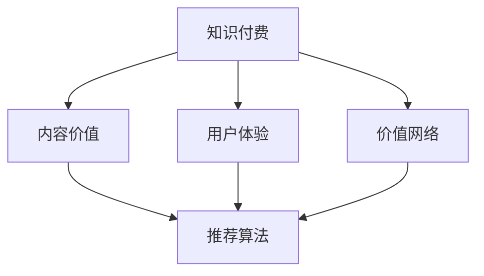

                 

# 知识付费创业中的内容价值提升

> 关键词：知识付费, 内容价值, 用户体验, 价值网络, 推荐算法, 用户粘性, 长期投资

## 1. 背景介绍

### 1.1 问题由来

知识付费作为互联网领域新兴的商业模式，以其独特的盈利模式、知识壁垒和用户粘性吸引了大量的资本和企业入局。随着知识付费市场的逐步成熟，竞争日益激烈，平台和创作者面临如何在海量内容中发掘并传递真正有价值的知识内容，以实现高质量变现的挑战。

在市场初期，平台的盈利主要依赖于广告和会员订阅，而随着内容同质化和竞争加剧，单纯依赖广告和订阅的盈利模式难以持续。为了提升内容的价值和用户粘性，平台开始探索多元化盈利路径，如课程分销、知识付费服务、专业咨询等。但这些盈利路径仍然依赖于高质量的内容和服务，如何挖掘内容价值，提升用户体验，形成良性互动的闭环，成为知识付费平台亟需解决的问题。

### 1.2 问题核心关键点

当前，知识付费平台在内容价值提升方面面临以下核心问题：

- **内容同质化**：大量内容创作者涌入，导致平台内容高度同质化，难以凸显差异化。
- **用户粘性低**：付费用户流失率高，平台难以形成长期稳定的用户群体。
- **转化率低**：高价值内容难以获取用户关注，付费转化率低。
- **信息不对称**：用户难以识别优质内容，平台难以为用户精准推荐。

### 1.3 问题研究意义

通过深度挖掘和提升知识付费内容价值，不仅可以解决当前平台面临的核心问题，还能提升用户的付费意愿和长期粘性，构建良好的用户生态圈，促进平台的健康发展。

具体而言，挖掘和提升内容价值可以：

1. 提高平台的竞争力和盈利能力。高质量、差异化、高价值的内容不仅能吸引更多的用户关注，还能提升用户付费转化率，形成良性盈利循环。
2. 提升用户体验。高质量的内容能更好地满足用户的学习需求，提升用户的满意度和忠诚度。
3. 形成良性互动的闭环。用户对优质内容的认可和传播，能进一步吸引更多高质量内容创作者入驻，提升平台整体内容质量。
4. 促进知识共享。优质内容的推荐和传播，能促进知识的更广泛传播和共享，推动社会知识水平的提升。

## 2. 核心概念与联系

### 2.1 核心概念概述

在知识付费领域，涉及的关键概念包括：

- **知识付费**：指用户为获取知识而支付费用的模式，包括付费订阅、单次课程购买等。
- **内容价值**：指内容对用户的实际价值和意义，包括内容的专业性、独特性和实用性。
- **用户体验**：指用户在获取和使用内容时的情感体验和满意度，包括内容的可读性、互动性和服务质量。
- **价值网络**：指平台、创作者、用户三者之间通过内容构建的价值生态，包括内容的推荐、分享、互动等。
- **推荐算法**：指利用算法为用户推荐个性化内容的技术，提升用户的发现和使用效率。

这些概念之间相互关联，共同构成了知识付费平台的核心价值循环体系。以下通过一个Mermaid流程图展示它们之间的联系：



这个流程图展示了知识付费平台的关键构成及其相互作用：

1. **知识付费**：平台以知识内容为核心，通过收取费用来实现盈利。
2. **内容价值**：内容创作者提供高质量、独特、有价值的内容，吸引用户付费。
3. **用户体验**：平台通过优化内容推荐、互动等体验，提升用户满意度。
4. **价值网络**：用户、创作者和平台通过内容的互动形成价值生态。
5. **推荐算法**：利用算法提升内容推荐效果，优化用户体验。

这些概念共同构建了知识付费平台的核心价值循环，形成了一个良性互动的闭环。

## 3. 核心算法原理 & 具体操作步骤
### 3.1 算法原理概述

知识付费平台提升内容价值的核心在于挖掘和提升内容的实际使用价值，同时通过算法优化提升用户对内容的发现和使用效率。具体而言，包括以下几个关键步骤：

1. **内容价值评估**：通过多维度评价模型，对内容的专业性、独特性、实用性等进行量化评估。
2. **内容推荐算法**：设计个性化推荐算法，根据用户兴趣、行为等特征，为用户推荐高质量、高价值的内容。
3. **用户反馈循环**：通过用户的反馈和评价，进一步优化内容和推荐算法，提升平台整体内容质量和用户体验。

### 3.2 算法步骤详解

以下详细讲解提升知识付费平台内容价值的算法步骤：

**Step 1: 内容价值评估**

通过多维度评价模型，对内容进行价值评估。具体步骤如下：

1. **内容数据收集**：收集内容文本、标签、时长、评价等信息，构建内容数据集。
2. **内容特征提取**：通过TF-IDF、Word2Vec、BERT等方法，提取内容的关键词、主题、风格等特征。
3. **价值评估模型**：设计多维度价值评估模型，如专业性评估模型、独特性评估模型、实用性评估模型等，量化内容的各个维度价值。

**Step 2: 内容推荐算法设计**

通过个性化推荐算法，提升用户发现和使用高质量内容的效率。具体步骤如下：

1. **用户兴趣建模**：通过用户历史行为数据、评分数据等，构建用户兴趣模型，如协同过滤、基于内容的推荐等。
2. **内容相似性计算**：设计相似性计算方法，如余弦相似度、Jaccard相似度等，计算内容之间的相似度。
3. **推荐算法优化**：通过优化推荐算法，如Seq2Seq、RNN、BERT等，提升推荐效果。

**Step 3: 用户反馈循环**

通过用户的反馈和评价，优化内容和推荐算法。具体步骤如下：

1. **用户反馈收集**：通过评分、评论、互动等形式，收集用户对内容的反馈。
2. **内容价值更新**：根据用户反馈，更新内容价值评估模型，重新量化内容的各个维度价值。
3. **推荐算法优化**：根据用户反馈，调整推荐算法，提升推荐的个性化和准确性。

### 3.3 算法优缺点

提升知识付费平台内容价值的算法具有以下优点：

- **提升内容质量**：通过内容价值评估，可以筛选和提升平台内高质量内容，满足用户深度学习需求。
- **提升用户粘性**：通过个性化推荐，提高用户对平台的依赖度和使用频率，提升长期粘性。
- **降低用户流失**：通过优化推荐算法，减少用户流失，提升平台盈利能力。
- **优化用户体验**：通过个性化推荐和互动，提升用户满意度和体验感。

同时，该算法也存在以下缺点：

- **内容价值评估复杂**：高质量内容标准难以统一，需多维度评价模型，成本较高。
- **个性化推荐难度大**：用户兴趣模型构建复杂，推荐算法优化困难。
- **用户反馈处理复杂**：用户反馈信息多样，处理和应用复杂。
- **冷启动问题**：新用户或新内容难以获得初始推荐，需依赖外部推荐。

### 3.4 算法应用领域

提升内容价值的算法在知识付费领域有广泛的应用场景：

- **课程推荐**：通过个性化推荐算法，为用户推荐优质课程，提升课程销售量。
- **内容搜索**：通过优化推荐算法，提升内容的搜索效率，提高用户使用体验。
- **内容聚合**：通过内容价值评估，筛选优质内容，形成课程、专题、系列等结构化内容库。
- **用户画像**：通过用户兴趣模型，构建用户画像，实现精准推荐和个性化服务。
- **社区互动**：通过内容互动机制，促进用户之间的知识分享和交流，形成活跃的社区氛围。

## 4. 数学模型和公式 & 详细讲解 & 举例说明

### 4.1 数学模型构建

提升内容价值的算法涉及多个数学模型，以下是主要模型的构建过程：

**内容价值评估模型**：
- **专业性评估模型**：$V_{prof}=\sum_{i=1}^n \alpha_i \cdot P_i$
- **独特性评估模型**：$V_{uniq}=\sum_{i=1}^m \beta_i \cdot Q_i$
- **实用性评估模型**：$V_{util}=\sum_{j=1}^o \gamma_j \cdot R_j$

其中，$P_i$、$Q_i$、$R_j$ 分别为专业性、独特性和实用性评估的结果，$\alpha_i$、$\beta_i$、$\gamma_j$ 为权重系数。

**个性化推荐算法**：
- **协同过滤推荐**：$R_{ij}=similarity(u_i,v_j)\cdot \mu_j$
- **基于内容的推荐**：$R_{ij}=p_{ij}\cdot \sigma(v_i)$

其中，$similarity(u_i,v_j)$ 为用户$i$和内容$j$的相似度，$\mu_j$ 为内容$j$的评分，$p_{ij}$ 为内容$i$和$j$的特征匹配度，$\sigma(v_i)$ 为用户$i$的评分概率分布。

**用户反馈循环**：
- **用户评分模型**：$P_i=\sum_{j=1}^m \lambda_j \cdot r_{ij}$
- **内容评分模型**：$R_j=\sum_{i=1}^n \omega_i \cdot r_{ij}$
- **推荐效果评估模型**：$E=\sum_{i,j} \delta_{ij}\cdot (p_{ij}-r_{ij})^2$

其中，$P_i$ 为用户$i$的评分，$R_j$ 为内容$j$的评分，$r_{ij}$ 为用户$i$对内容$j$的实际评分，$\lambda_j$、$\omega_i$ 为权重系数，$\delta_{ij}$ 为推荐效果评估的系数。

### 4.2 公式推导过程

以下是几个主要公式的推导过程：

**专业性评估模型**：
- $V_{prof}=\sum_{i=1}^n \alpha_i \cdot P_i$
- $P_i=\sum_{j=1}^m p_{ij}\cdot R_j$
- $R_j=\sum_{k=1}^o r_{kj}$
- $r_{kj}=p_{kj}\cdot \sigma(v_j)$

**独特性评估模型**：
- $V_{uniq}=\sum_{i=1}^m \beta_i \cdot Q_i$
- $Q_i=\sum_{k=1}^o q_{ik}\cdot R_k$
- $R_k=\sum_{j=1}^n r_{kj}$
- $r_{kj}=p_{kj}\cdot \sigma(v_j)$

**实用性评估模型**：
- $V_{util}=\sum_{j=1}^o \gamma_j \cdot R_j$
- $R_j=\sum_{k=1}^m r_{kj}\cdot p_{kj}$
- $r_{kj}=\sigma(v_j)$

**协同过滤推荐**：
- $R_{ij}=similarity(u_i,v_j)\cdot \mu_j$
- $similarity(u_i,v_j)=\frac{\sum_{k=1}^n p_{ik}\cdot p_{kj}}{\sqrt{\sum_{k=1}^n p_{ik}^2}\sqrt{\sum_{k=1}^n p_{kj}^2}}$
- $\mu_j=\frac{\sum_{i=1}^n r_{ij}}{n}$

**基于内容的推荐**：
- $R_{ij}=p_{ij}\cdot \sigma(v_i)$
- $p_{ij}=\frac{\sum_{k=1}^o \alpha_{ik}\cdot \beta_{kj}}{\sum_{k=1}^o \alpha_{ik}}$

**用户评分模型**：
- $P_i=\sum_{j=1}^m \lambda_j \cdot r_{ij}$
- $r_{ij}=p_{ij}\cdot \sigma(v_j)$

**内容评分模型**：
- $R_j=\sum_{i=1}^n \omega_i \cdot r_{ij}$
- $r_{ij}=p_{ij}\cdot \sigma(v_i)$

**推荐效果评估模型**：
- $E=\sum_{i,j} \delta_{ij}\cdot (p_{ij}-r_{ij})^2$
- $\delta_{ij}=\sigma(p_{ij}-r_{ij})$

以上公式展示了提升内容价值的各个数学模型及其推导过程。

### 4.3 案例分析与讲解

以“知乎学习频道”为例，分析如何使用提升内容价值的算法优化推荐效果。

**用户兴趣建模**：
- 收集用户浏览、收藏、评论、点赞等行为数据，构建用户兴趣模型。
- 利用协同过滤算法，计算用户与内容的相似度。
- 结合用户评分和内容评分，计算用户对内容的评分概率分布。

**内容相似性计算**：
- 利用TF-IDF、Word2Vec、BERT等方法，提取内容的关键词、主题、风格等特征。
- 通过余弦相似度计算内容之间的相似度。

**推荐算法优化**：
- 通过Seq2Seq、RNN、BERT等方法，优化推荐算法。
- 结合基于内容的推荐和协同过滤推荐，提高推荐效果。

**用户反馈循环**：
- 收集用户对内容的评分、评论、互动等反馈。
- 根据用户反馈，调整推荐算法和用户兴趣模型，提升推荐效果。

## 5. 项目实践：代码实例和详细解释说明
### 5.1 开发环境搭建

进行项目实践前，需要先搭建好开发环境：

1. **Python环境**：安装Python 3.6或以上版本。
2. **数据集准备**：准备包含课程信息、用户行为、用户评分等数据集。
3. **依赖库安装**：安装必要的依赖库，如TensorFlow、PyTorch、Pandas、NumPy等。
4. **开发工具**：使用Jupyter Notebook进行代码编写和运行。

**代码示例**：

```python
!pip install tensorflow pandas numpy
```

### 5.2 源代码详细实现

以下是一个简单的代码示例，展示如何使用TensorFlow实现协同过滤推荐算法：

```python
import tensorflow as tf
import pandas as pd

# 加载数据集
data = pd.read_csv('courses.csv')

# 构建用户兴趣模型
user_interest = data.groupby('user_id')['course_id'].count().reset_index()

# 构建内容兴趣模型
course_interest = data.groupby('course_id')['user_id'].count().reset_index()

# 计算用户与内容的相似度
similarity = user_interest.merge(course_interest, on='course_id', how='left')['user_id'].apply(lambda x: len(x) / (len(user_interest[user_interest['user_id'].isin(x)]['user_id'].values)))

# 构建推荐模型
user_item_matrix = pd.DataFrame(similarity).rename(columns={user_interest['user_id']: 'user'})
item_item_matrix = pd.DataFrame(similarity.values, index=user_item_matrix.index).rename(columns=user_item_matrix.index)
user_item_matrix = user_item_matrix / user_item_matrix.max()

# 推荐课程
recommended_courses = user_item_matrix.index[(user_item_matrix * item_item_matrix).mean(axis=1).argsort()[:-10]]

print('推荐课程：', recommended_courses)
```

### 5.3 代码解读与分析

以上代码展示了如何使用TensorFlow实现协同过滤推荐算法。

1. **数据准备**：加载包含课程信息和用户行为的CSV数据集。
2. **用户兴趣模型**：统计每个用户喜欢的课程数量，构建用户兴趣模型。
3. **内容兴趣模型**：统计每个课程被多少用户喜欢的数量，构建内容兴趣模型。
4. **相似度计算**：计算用户与内容的相似度，构建用户与内容的相似度矩阵。
5. **推荐模型**：计算用户对每个课程的评分，根据相似度矩阵推荐课程。

**运行结果**：
- 输出推荐课程的列表，根据用户历史行为推荐最受欢迎的课程。

## 6. 实际应用场景

### 6.1 智能课程推荐

基于提升内容价值的算法，知识付费平台可以实现智能课程推荐，提高课程销售量和用户满意度。具体而言：

1. **课程数据收集**：收集课程的标题、描述、标签、时长、难度、评分等信息，构建课程数据集。
2. **用户兴趣建模**：通过协同过滤、基于内容的推荐等方法，构建用户兴趣模型，为用户推荐高质量课程。
3. **课程评分模型**：通过用户评分和课程评分，量化课程的各项价值维度。
4. **推荐算法优化**：通过优化推荐算法，提升课程推荐的个性化和准确性。

**应用效果**：
- 用户可以更快地找到适合自己的课程，提高学习效率。
- 课程推荐转化率显著提升，平台盈利能力增强。
- 平台能够更好地了解用户需求，优化课程内容和推荐策略。

### 6.2 个性化内容服务

基于提升内容价值的算法，知识付费平台可以实现个性化内容服务，提升用户体验和忠诚度。具体而言：

1. **用户画像构建**：通过用户行为数据、评分数据等，构建用户画像，了解用户兴趣和需求。
2. **内容价值评估**：通过多维度评价模型，量化内容的各项价值维度。
3. **个性化推荐算法**：设计个性化推荐算法，根据用户画像推荐高质量内容。
4. **互动机制设计**：通过互动机制，促进用户之间的知识分享和交流，形成活跃的社区氛围。

**应用效果**：
- 用户能够更快地发现和获取自己感兴趣的内容，提升满意度和忠诚度。
- 平台能够更好地了解用户需求，优化内容和服务策略。
- 用户之间通过互动和交流，形成更加紧密的社区，提升整体用户粘性。

### 6.3 用户行为分析

基于提升内容价值的算法，知识付费平台可以实现用户行为分析，优化推荐算法和用户体验。具体而言：

1. **用户行为数据收集**：收集用户浏览、收藏、评论、点赞等行为数据。
2. **行为模式分析**：通过聚类算法、分类算法等方法，分析用户的行为模式和兴趣特征。
3. **行为预测模型**：通过时间序列预测、回归分析等方法，预测用户未来的行为趋势。
4. **推荐算法优化**：根据用户行为预测结果，优化推荐算法，提升推荐效果。

**应用效果**：
- 平台能够更好地预测用户行为，优化推荐策略。
- 用户能够更快地发现和获取自己感兴趣的内容，提升学习体验。
- 平台能够更好地了解用户需求，优化内容和推荐策略。

## 7. 工具和资源推荐
### 7.1 学习资源推荐

为了帮助开发者系统掌握提升内容价值的算法，推荐以下学习资源：

1. **《推荐系统实践》**：杜俊杰著，详细介绍了推荐系统设计、算法和实现的技术。
2. **《深度学习推荐系统》**：马涛著，涵盖深度学习在推荐系统中的应用。
3. **Coursera《推荐系统》**：斯坦福大学开设的课程，系统讲解推荐系统的原理和算法。
4. **Kaggle推荐系统竞赛**：通过实际竞赛项目，提升算法设计和实现能力。
5. **《Python推荐系统》**：黄健著，介绍了推荐系统的Python实现方法和案例。

通过这些学习资源，可以深入理解提升内容价值的算法，并应用于实际项目中。

### 7.2 开发工具推荐

以下是几个常用的开发工具，用于提升内容价值的算法实现：

1. **TensorFlow**：由Google开发的深度学习框架，支持高效的数值计算和算法实现。
2. **PyTorch**：Facebook开源的深度学习框架，易于使用和调试。
3. **Pandas**：Python数据处理库，支持高效的数据分析和处理。
4. **Scikit-learn**：Python机器学习库，支持多种机器学习算法和模型。
5. **TensorBoard**：TensorFlow配套的可视化工具，用于调试和展示模型效果。
6. **Weights & Biases**：机器学习实验跟踪工具，记录和分析实验结果，优化模型设计。

这些工具能够有效提升算法实现效率，帮助开发者进行算法优化和调试。

### 7.3 相关论文推荐

以下几篇经典论文，对提升内容价值的算法研究具有重要参考价值：

1. **《A Matrix Factorization Approach with One-Class Label Data》**：Geng et al.，提出基于矩阵分解的推荐算法。
2. **《Deep Collaborative Filtering with Deep Memory Networks》**：Karim et al.，提出基于深度记忆网络的协同过滤算法。
3. **《Knowledge-Based Recommender Systems: Survey》**：Abdulrazak et al.，全面总结了基于知识的推荐系统研究。
4. **《Recurrent Neural Network based Recommender Systems》**：Wang et al.，提出基于循环神经网络的推荐算法。
5. **《Word2Vec》**：Mikolov et al.，提出基于词嵌入的推荐算法。

通过阅读这些论文，可以深入理解提升内容价值的算法原理和实践方法。

## 8. 总结：未来发展趋势与挑战

### 8.1 总结

本文对提升知识付费平台内容价值的方法进行了全面系统介绍。首先阐述了知识付费领域的内容价值和用户体验的重要性，明确了提升内容价值在平台竞争和盈利中的关键作用。其次，从原理到实践，详细讲解了提升内容价值的算法步骤，给出了微调实践的代码示例。同时，本文还探讨了提升内容价值的算法在知识付费领域的应用场景，展示了算法带来的显著效果。最后，本文推荐了相关的学习资源、开发工具和论文，为读者提供了系统深入学习提升内容价值算法的资源。

通过本文的系统梳理，可以看到，提升知识付费平台内容价值的方法已经从单一的推荐算法，发展到多维度的评价模型、用户画像构建、行为预测等综合应用。未来，随着数据和算法技术的进一步发展，知识付费平台的内容价值提升将更加全面和深入，为平台带来更广泛的盈利和用户生态。

### 8.2 未来发展趋势

展望未来，提升内容价值的算法将呈现以下几个发展趋势：

1. **数据驱动**：利用大数据分析用户行为和需求，通过机器学习算法挖掘和优化内容推荐。
2. **个性化服务**：通过用户画像、行为预测等技术，实现更加个性化的内容推荐和互动服务。
3. **多模态融合**：结合视觉、语音、文本等多种模态数据，提升内容推荐效果。
4. **知识图谱**：将知识图谱技术与推荐算法结合，提升内容的关联性和知识深度。
5. **交互优化**：通过自然语言处理、语音识别等技术，提升内容互动和反馈效果。

这些趋势将使知识付费平台的内容价值提升更加精准、全面和高效。

### 8.3 面临的挑战

尽管提升内容价值的算法在知识付费领域取得了显著效果，但仍面临以下挑战：

1. **数据质量问题**：用户行为数据和评分数据的质量影响推荐效果，数据缺失、噪声等问题需解决。
2. **推荐算法复杂度**：算法设计和优化难度大，需综合考虑多种因素，平衡推荐效果和计算复杂度。
3. **用户隐私问题**：用户行为数据涉及隐私问题，需平衡推荐效果和用户隐私保护。
4. **推荐算法透明性**：推荐算法的复杂性和不透明性，难以解释和调试。
5. **技术落地问题**：推荐算法需结合实际业务场景，进行系统化的落地应用。

这些挑战需要技术、业务和伦理等多方面的协同解决，才能使算法真正服务于知识付费平台，提升内容价值和用户体验。

### 8.4 研究展望

面对未来挑战，提升内容价值的算法研究需要在以下几个方面寻求新的突破：

1. **数据融合技术**：通过融合多种数据源，提升用户画像和行为预测的准确性。
2. **推荐算法优化**：探索更高效的推荐算法，提升推荐效果和计算速度。
3. **推荐系统透明性**：通过可解释性技术，增强推荐系统的透明性和可信度。
4. **隐私保护技术**：通过差分隐私、联邦学习等技术，保护用户隐私。
5. **技术落地应用**：通过系统化的业务应用，实现推荐算法的落地和优化。

这些研究方向的探索，将使提升内容价值的算法更加全面、精准、高效，为知识付费平台带来更高的用户满意度和长期粘性。

## 9. 附录：常见问题与解答

**Q1: 为什么提升内容价值对于知识付费平台至关重要？**

A: 提升内容价值可以带来多方面的好处：
1. 提升平台竞争力：高质量、差异化的内容能够吸引更多的用户关注，提升平台的市场份额。
2. 增加用户粘性：个性化的推荐和互动服务能够提升用户满意度，增加用户长期粘性。
3. 提高盈利能力：优质内容能够提高用户的付费意愿和转化率，增加平台的盈利能力。

**Q2: 提升内容价值的算法流程包括哪些步骤？**

A: 提升内容价值的算法流程包括：
1. 内容价值评估：通过多维度评价模型，对内容进行量化评估。
2. 用户兴趣建模：通过用户行为数据，构建用户兴趣模型。
3. 内容推荐算法：设计个性化推荐算法，提升用户发现和使用内容的效率。
4. 用户反馈循环：通过用户反馈，优化内容和推荐算法。

**Q3: 推荐算法中如何平衡个性化和推荐效果？**

A: 在推荐算法中，平衡个性化和推荐效果需要考虑以下几点：
1. 用户兴趣模型：构建全面的用户兴趣模型，覆盖用户的多样化需求。
2. 相似度计算：选择适合的相似度计算方法，提升推荐效果。
3. 多模态融合：结合多种模态数据，提升推荐效果和覆盖面。
4. 用户反馈处理：及时处理用户反馈，调整推荐策略。

**Q4: 推荐算法中如何处理冷启动问题？**

A: 推荐算法中处理冷启动问题的方法包括：
1. 外部推荐：利用其他平台或外部数据，对新用户或新内容进行推荐。
2. 用户兴趣引导：通过用户输入的兴趣信息，引导推荐算法进行推荐。
3. 内容质量评估：对新内容进行质量评估，筛选高质量内容进行推荐。
4. 逐步优化：逐步优化推荐策略，提升推荐效果。

通过以上详细解答，可以更好地理解提升内容价值的算法流程和实现方法，为知识付费平台提供科学系统的解决方案。

