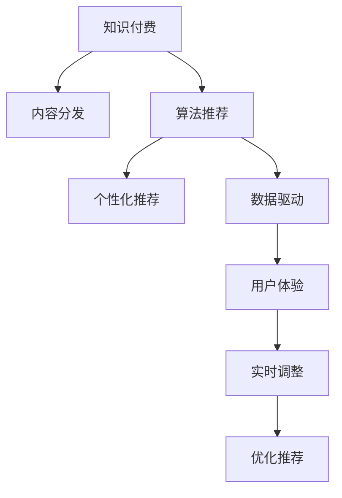

                 

# 知识付费创业中的内容分发策略

> 关键词：知识付费,内容分发,算法推荐,个性化推荐,数据驱动,用户体验

## 1. 背景介绍

### 1.1 问题由来

近年来，随着互联网的发展和普及，人们对于知识的获取方式和使用习惯发生了显著变化。传统的书籍、报纸等单向传播的媒介逐渐被互联网上的内容平台所取代。特别是在移动互联网时代，碎片化、快速化、个性化的知识获取方式成为主流。在这样的背景下，知识付费作为一种新兴的教育消费模式应运而生，为知识创作者提供了新的盈利渠道，同时也为知识消费者提供了更丰富、更优质的学习资源。

然而，在知识付费领域的创业过程中，内容分发策略的选择至关重要。合理的分发策略不仅可以提升用户满意度，增加用户粘性，还可以帮助内容创作者最大化收益。本文将详细探讨知识付费创业中的内容分发策略，包括算法推荐系统（Algorithmic Recommendation System）在内容分发中的应用，以及如何通过数据驱动的个性化推荐实现更精准、高效的内容分发。

### 1.2 问题核心关键点

知识付费创业中的内容分发策略主要包括：
- 算法推荐系统的原理与应用
- 个性化推荐算法的基本思路
- 数据驱动的用户行为分析
- 基于用户行为的推荐模型构建
- 用户反馈的循环优化机制
- 推荐系统的实时调整与优化

这些关键点共同构成了知识付费领域内容分发的核心框架，在提升用户体验、优化内容分发、提高运营效率等方面具有重要意义。

## 2. 核心概念与联系

### 2.1 核心概念概述

为更好地理解知识付费创业中的内容分发策略，本节将介绍几个密切相关的核心概念：

- **知识付费（Knowledge Payment）**：指用户为获取知识或信息而支付费用的行为。知识付费平台通过订阅、单次购买等方式为用户提供专业知识、技能培训、职业指导等内容服务。

- **内容分发（Content Distribution）**：指将内容精准地推送给目标用户的过程。内容分发策略的好坏直接影响到用户的获取体验和满意度。

- **算法推荐系统（Algorithmic Recommendation System, ARS）**：利用机器学习技术，通过对用户行为数据的分析和处理，自动推荐相关内容，提高用户满意度和平台营收。

- **个性化推荐算法（Personalized Recommendation Algorithm）**：根据用户的历史行为、兴趣偏好等数据，量身定制推荐策略，以提升推荐精准度和用户粘性。

- **数据驱动（Data-Driven）**：以数据为基础的决策模式，通过对用户行为数据和反馈信息的分析，不断优化内容分发策略。

- **用户体验（User Experience, UX）**：用户在使用内容平台时的感受和体验，包括界面设计、功能使用、内容推荐等多个方面。

这些核心概念之间的逻辑关系可以通过以下Mermaid流程图来展示：



这个流程图展示了一系列关键概念及其相互关系：

1. 知识付费为内容分发提供了基础商业模式。
2. 算法推荐系统为内容分发提供技术支持，提升推荐精准度。
3. 个性化推荐算法根据用户数据进行推荐，优化用户体验。
4. 数据驱动机制分析用户行为，持续优化内容分发策略。
5. 用户体验是内容分发的最终目标，实时调整和优化是提升体验的关键。

## 3. 核心算法原理 & 具体操作步骤

### 3.1 算法原理概述

知识付费创业中的内容分发策略，本质上是一个数据驱动的个性化推荐过程。其核心思想是：通过分析用户的历史行为数据，建立用户兴趣模型，将用户与相关内容进行匹配，从而实现精准、高效的内容推荐。

形式化地，假设用户集为 $U$，内容集为 $C$，用户的兴趣模型为 $M$，内容的相关性模型为 $R$。内容分发的目标是通过推荐算法，最大化用户满意度，即：

$$
\max_{M, R} \sum_{u \in U} \sum_{c \in C} M_u \cdot R_{uc}
$$

其中，$M_u$ 表示用户 $u$ 对内容 $c$ 的兴趣度，$R_{uc}$ 表示内容 $c$ 的相关性评分。

推荐算法通过不断更新用户兴趣模型 $M$ 和内容相关性模型 $R$，使得推荐的精准度和用户体验不断提升。

### 3.2 算法步骤详解

基于数据驱动的个性化推荐系统，一般包括以下几个关键步骤：

**Step 1: 数据收集与预处理**
- 收集用户的历史行为数据，如浏览记录、购买记录、评分反馈等。
- 对原始数据进行清洗和标准化处理，去除异常值，填充缺失值，确保数据的准确性和完整性。

**Step 2: 用户兴趣模型建立**
- 使用协同过滤、基于内容的推荐、矩阵分解等方法，建立用户兴趣模型。
- 协同过滤算法基于用户间的相似度计算，通过相似用户的历史行为预测用户兴趣。
- 基于内容的推荐算法通过分析内容属性，预测用户对内容的兴趣度。
- 矩阵分解方法将用户-内容矩阵分解为低维向量，捕捉用户和内容的潜在相似性。

**Step 3: 内容相关性模型建立**
- 使用协同过滤、文本挖掘、图像识别等技术，建立内容相关性模型。
- 协同过滤算法通过内容间的相似度计算，预测内容的相关性评分。
- 文本挖掘技术通过分析内容文本，提取关键词、主题等信息，用于计算内容的相关性评分。
- 图像识别技术通过分析内容图片，提取视觉特征，用于计算内容的相关性评分。

**Step 4: 推荐引擎设计**
- 根据用户兴趣模型和内容相关性模型，设计推荐引擎，实现内容推荐。
- 推荐引擎可以采用基于排序的推荐、基于排序的召回等方式，对候选内容进行排序和选择。

**Step 5: 用户反馈循环优化**
- 收集用户的反馈数据，如点击、播放、评分等，用于更新用户兴趣模型和内容相关性模型。
- 根据用户反馈，采用在线学习、增量学习等技术，实时优化推荐策略。

**Step 6: 实时调整与优化**
- 根据用户行为数据和推荐效果，实时调整推荐策略。
- 引入多臂老虎机（Multi-Armed Bandit）等模型，优化推荐算法，提升推荐效果。

以上是基于数据驱动的个性化推荐系统的一般流程。在实际应用中，还需要针对具体业务需求，对各个环节进行优化设计，如改进用户兴趣模型构建算法、引入更多上下文信息、优化推荐算法等，以进一步提升推荐效果。

### 3.3 算法优缺点

数据驱动的个性化推荐系统具有以下优点：
1. 精准度高。通过分析用户历史行为数据，能够实现对用户兴趣的精准预测。
2. 用户粘性高。个性化的推荐内容能够满足用户的多样化需求，提高用户满意度。
3. 运营效率高。自动化的推荐过程减少了人工干预，降低了运营成本。

同时，该系统也存在一定的局限性：
1. 冷启动问题。新用户缺乏历史行为数据，难以进行个性化推荐。
2. 数据隐私。用户数据隐私问题，如数据泄露、数据滥用等，需要谨慎处理。
3. 推荐多样性不足。过度个性化可能导致推荐内容单一，降低用户探索新内容的机会。
4. 模型复杂度。复杂模型需要大量计算资源和时间成本，可能不适合小型平台。

尽管存在这些局限性，但就目前而言，数据驱动的个性化推荐系统仍然是大规模知识付费平台内容分发的核心技术手段。未来相关研究的重点在于如何进一步降低冷启动问题，提高推荐系统的多样性和公平性，同时兼顾用户隐私和模型效率。

### 3.4 算法应用领域

基于个性化推荐的内容分发技术，已经在知识付费领域得到了广泛的应用，覆盖了几乎所有常见内容推荐场景，例如：

- 课程推荐：为用户推荐感兴趣的课程，涵盖各专业领域的课程内容。
- 文章推荐：为用户推荐相关领域的文章，扩展用户知识面。
- 专家推荐：为用户推荐相关领域的专家，增加学术交流机会。
- 图书推荐：为用户推荐感兴趣或相关的图书，拓展阅读范围。
- 视频推荐：为用户推荐相关领域的视频内容，增加视觉体验。

除了上述这些经典推荐场景外，个性化推荐技术还被创新性地应用于更多场景中，如知识图谱、个性化搜索结果、智能客服等，为知识付费平台带来了新的发展方向。

## 4. 数学模型和公式 & 详细讲解 & 举例说明

### 4.1 数学模型构建

本节将使用数学语言对数据驱动的个性化推荐系统进行更加严格的刻画。

记用户集为 $U$，内容集为 $C$，用户的兴趣模型为 $M \in \mathbb{R}^n$，内容的相关性模型为 $R \in \mathbb{R}^{n \times m}$，其中 $n$ 为用户数量，$m$ 为内容数量。

用户兴趣模型 $M$ 通过协同过滤、基于内容的推荐等方法训练得到，表示用户对每个内容的兴趣度。内容相关性模型 $R$ 通过文本挖掘、图像识别等技术得到，表示内容与用户兴趣的相关性评分。

推荐引擎的推荐策略可以表示为：

$$
\hat{c} = \arg\max_{c \in C} M \cdot R_c
$$

其中 $\hat{c}$ 表示用户最感兴趣的内容，$M \cdot R_c$ 表示用户对内容 $c$ 的兴趣评分。

### 4.2 公式推导过程

以下我们以基于协同过滤的用户兴趣模型为例，推导推荐引擎的推荐公式。

协同过滤算法基于用户间的相似度计算，通过相似用户的历史行为预测用户兴趣。假设用户集 $U$ 和内容集 $C$ 的相似度矩阵为 $S$，用户 $u$ 对内容 $c$ 的兴趣度为 $M_u$，内容 $c$ 的相关性评分 $R_{uc}$。推荐引擎的推荐策略可以表示为：

$$
\hat{c} = \arg\max_{c \in C} \sum_{v \in U} M_u \cdot S_{uv} \cdot R_{vc}
$$

其中 $S_{uv}$ 表示用户 $u$ 和用户 $v$ 的相似度，$M_u \cdot S_{uv} \cdot R_{vc}$ 表示用户 $u$ 对内容 $c$ 的兴趣评分。

在得到推荐策略后，可以采用基于排序的推荐方法，对候选内容进行排序和选择。例如，可以使用 Top-k 排序算法，选择前 k 个推荐内容，如：

$$
\hat{C} = \{c \in C \mid M_u \cdot R_c \geq \max_{c' \in C} M_u \cdot R_{c'} \} \cap \{c \in C \mid c \notin \hat{C}'
$$

其中 $\hat{C}'$ 表示已推荐内容集合，$\cap$ 表示集合交集。

### 4.3 案例分析与讲解

为了更好地理解推荐系统的实现过程，以下以一个简单的协同过滤推荐系统为例，进行案例分析。

假设用户 $u$ 的兴趣模型为 $M_u = [0.5, 0.3, 0.7, 0.2]$，内容集 $C$ 的相关性模型为 $R = \begin{bmatrix} 0.2 & 0.3 & 0.5 & 0.4 \\ 0.3 & 0.5 & 0.2 & 0.3 \\ 0.5 & 0.2 & 0.3 & 0.4 \\ 0.4 & 0.3 & 0.5 & 0.2 \end{bmatrix}$，用户 $u$ 和用户 $v$ 的相似度矩阵为 $S = \begin{bmatrix} 0.8 & 0.6 & 0.5 & 0.4 \\ 0.6 & 0.9 & 0.7 & 0.6 \\ 0.5 & 0.7 & 0.9 & 0.5 \\ 0.4 & 0.6 & 0.5 & 0.8 \end{bmatrix}$。

首先，计算用户 $u$ 对每个内容的兴趣评分，如：

$$
\begin{aligned}
& M_u \cdot R_{1} = 0.5 \times 0.2 + 0.3 \times 0.3 + 0.7 \times 0.5 + 0.2 \times 0.4 = 0.45 \\
& M_u \cdot R_{2} = 0.5 \times 0.3 + 0.3 \times 0.5 + 0.7 \times 0.2 + 0.2 \times 0.3 = 0.41 \\
& M_u \cdot R_{3} = 0.5 \times 0.5 + 0.3 \times 0.2 + 0.7 \times 0.3 + 0.2 \times 0.4 = 0.45 \\
& M_u \cdot R_{4} = 0.5 \times 0.4 + 0.3 \times 0.3 + 0.7 \times 0.5 + 0.2 \times 0.2 = 0.43
\end{aligned}
$$

然后，计算用户 $u$ 对每个内容的推荐评分，如：

$$
\begin{aligned}
& M_u \cdot R_{1} \times S_{u1} = 0.45 \times 0.8 = 0.36 \\
& M_u \cdot R_{2} \times S_{u2} = 0.41 \times 0.6 = 0.246 \\
& M_u \cdot R_{3} \times S_{u3} = 0.45 \times 0.5 = 0.225 \\
& M_u \cdot R_{4} \times S_{u4} = 0.43 \times 0.4 = 0.172
\end{aligned}
$$

最后，选择推荐得分最高的内容 $c_1$ 作为用户 $u$ 的推荐结果。

## 5. 项目实践：代码实例和详细解释说明

### 5.1 开发环境搭建

在进行推荐系统实践前，我们需要准备好开发环境。以下是使用Python进行PyTorch开发的环境配置流程：

1. 安装Anaconda：从官网下载并安装Anaconda，用于创建独立的Python环境。

2. 创建并激活虚拟环境：
```bash
conda create -n pytorch-env python=3.8 
conda activate pytorch-env
```

3. 安装PyTorch：根据CUDA版本，从官网获取对应的安装命令。例如：
```bash
conda install pytorch torchvision torchaudio cudatoolkit=11.1 -c pytorch -c conda-forge
```

4. 安装TensorFlow：
```bash
conda install tensorflow==2.6
```

5. 安装各类工具包：
```bash
pip install numpy pandas scikit-learn matplotlib tqdm jupyter notebook ipython
```

完成上述步骤后，即可在`pytorch-env`环境中开始推荐系统开发。

### 5.2 源代码详细实现

这里我们以基于协同过滤的推荐系统为例，给出使用PyTorch实现的推荐系统代码实现。

首先，定义协同过滤算法：

```python
import torch
import torch.nn as nn
import torch.optim as optim

class CollaborativeFiltering(nn.Module):
    def __init__(self, num_users, num_contents, embedding_dim):
        super(CollaborativeFiltering, self).__init__()
        self.user_embedding = nn.Embedding(num_users, embedding_dim)
        self.content_embedding = nn.Embedding(num_contents, embedding_dim)
        self.scorer = nn.Linear(embedding_dim * 2, 1)
        
    def forward(self, user_ids, content_ids):
        user_embeddings = self.user_embedding(user_ids)
        content_embeddings = self.content_embedding(content_ids)
        scores = self.scorer(torch.cat([user_embeddings, content_embeddings], dim=1))
        return scores
```

然后，定义推荐函数：

```python
def recommend_top_k(user_ids, content_ids, num_top_k, model, user_embeddings, content_embeddings):
    with torch.no_grad():
        scores = model(user_ids, content_ids)
        top_k_scores, top_k_content_ids = scores.topk(num_top_k)
    return top_k_content_ids
```

接着，定义训练函数：

```python
def train_model(model, user_embeddings, content_embeddings, num_epochs, batch_size, learning_rate):
    optimizer = optim.Adam(model.parameters(), lr=learning_rate)
    loss_fn = nn.MSELoss()
    
    for epoch in range(num_epochs):
        for user_id, content_id in zip(user_ids, content_ids):
            optimizer.zero_grad()
            prediction = model(user_id, content_id)
            loss = loss_fn(prediction, target)
            loss.backward()
            optimizer.step()
        
    return model
```

最后，启动推荐系统：

```python
# 生成随机数据
num_users = 100
num_contents = 200
embedding_dim = 128
user_embeddings = torch.randn(num_users, embedding_dim)
content_embeddings = torch.randn(num_contents, embedding_dim)

# 构建模型和数据
model = CollaborativeFiltering(num_users, num_contents, embedding_dim)
num_top_k = 5
train_user_ids = torch.randint(0, num_users, size=1000)
train_content_ids = torch.randint(0, num_contents, size=1000)
test_user_ids = torch.randint(0, num_users, size=100)
test_content_ids = torch.randint(0, num_contents, size=100)

# 训练模型
model = train_model(model, user_embeddings, content_embeddings, 10, 32, 0.01)

# 推荐内容
top_k_content_ids = recommend_top_k(train_user_ids, train_content_ids, num_top_k, model, user_embeddings, content_embeddings)
print(top_k_content_ids)
```

以上就是使用PyTorch实现协同过滤推荐系统的完整代码实现。可以看到，使用PyTorch的模块化设计，代码实现变得简洁高效。开发者可以将更多精力放在模型设计和训练上，而不必过多关注底层的实现细节。

### 5.3 代码解读与分析

让我们再详细解读一下关键代码的实现细节：

**CollaborativeFiltering类**：
- `__init__`方法：初始化用户嵌入层、内容嵌入层和评分器等关键组件。
- `forward`方法：前向传播计算用户和内容嵌入层的加权和，通过评分器输出推荐评分。

**train_model函数**：
- `optimizer`和`loss_fn`：定义优化器和损失函数。
- `for`循环：迭代训练过程，对每个样本进行前向传播、计算损失、反向传播和参数更新。

**recommend_top_k函数**：
- `with torch.no_grad()`：开启计算图非训练模式，加速推荐计算。
- `topk`方法：选择推荐得分为最高的内容ID。

**train_model函数**：
- `for`循环：迭代训练过程，对每个样本进行前向传播、计算损失、反向传播和参数更新。

**启动推荐系统**：
- 生成随机数据：生成用户ID和内容ID，作为训练和测试数据。
- 训练模型：调用训练函数，迭代更新模型参数。
- 推荐内容：调用推荐函数，对测试用户ID和内容ID进行推荐。

可以看到，使用PyTorch实现推荐系统，可以大大简化模型构建和训练过程，提高开发效率。

当然，工业级的系统实现还需考虑更多因素，如模型的保存和部署、超参数的自动搜索、更灵活的任务适配层等。但核心的推荐范式基本与此类似。

## 6. 实际应用场景

### 6.1 智能课程推荐

基于协同过滤推荐系统的智能课程推荐系统，可以为用户提供个性化的课程推荐，帮助用户更好地选择学习资源。

在技术实现上，可以收集用户的浏览记录、购买记录、评分反馈等数据，建立用户兴趣模型和课程相关性模型，在此基础上对用户进行推荐。推荐算法可以根据用户的历史行为预测其兴趣，推荐用户可能感兴趣的课程，并提供相关课程的教学视频、学习材料、学习进度跟踪等功能。

### 6.2 个性化阅读推荐

个性化阅读推荐系统可以为用户推荐相关领域的文章，扩展其阅读范围，提升学习效率。

在技术实现上，可以收集用户的阅读记录、评论反馈等数据，建立用户兴趣模型和文章相关性模型，在此基础上对用户进行推荐。推荐算法可以根据用户的历史行为预测其兴趣，推荐用户可能感兴趣的文章，并提供文章的摘要、作者信息、相关文章等功能。

### 6.3 专家和书籍推荐

专家和书籍推荐系统可以为用户推荐相关领域的专家和书籍，增加学术交流机会，拓展知识面。

在技术实现上，可以收集用户的阅读记录、评论反馈等数据，建立用户兴趣模型和专家/书籍相关性模型，在此基础上对用户进行推荐。推荐算法可以根据用户的历史行为预测其兴趣，推荐用户可能感兴趣的专家和书籍，并提供专家介绍、书籍摘要、相关书籍等功能。

### 6.4 未来应用展望

随着推荐系统的发展，未来的智能推荐技术将进一步拓展应用场景，提升用户体验。

在智慧教育领域，智能推荐系统可以为用户提供个性化的学习资源推荐，帮助其更高效地学习知识，提升学习效果。

在智慧医疗领域，智能推荐系统可以根据用户的健康数据和历史行为，推荐个性化的健康管理方案，提高用户的生活质量。

在智慧金融领域，智能推荐系统可以为用户推荐个性化的投资建议，提升其投资收益。

在智慧出行领域，智能推荐系统可以根据用户的出行数据，推荐个性化的出行方案，提高用户的出行体验。

此外，在更多领域，智能推荐技术都将得到广泛应用，为各行各业带来新的增长点和创新机会。相信随着技术的不断进步，推荐系统必将在更多场景中发挥重要作用，提升用户的生活质量和效率。

## 7. 工具和资源推荐

### 7.1 学习资源推荐

为了帮助开发者系统掌握推荐系统的理论基础和实践技巧，这里推荐一些优质的学习资源：

1. 《推荐系统》（Adaptive Collaborative Filtering）：李航教授的经典教材，详细介绍了推荐系统的基础算法和最新进展。

2. 《推荐系统实践》：杨晓华、王一川所著的实战指南，通过实际案例讲解推荐系统的开发和应用。

3. 《深度学习与推荐系统》（Deep Learning and Recommendation Systems）：由深度学习大牛Geoffrey Hinton、Andrew Ng等人合著，涵盖推荐系统的深度学习范式。

4. 《机器学习实战》（Python Machine Learning）：Peter Harrington的实战教程，通过Python语言实现推荐系统的案例。

5. Kaggle竞赛平台：Kaggle是全球最大的数据科学竞赛平台，通过参与竞赛，可以学习推荐系统的前沿技术和实际应用。

通过对这些资源的学习实践，相信你一定能够快速掌握推荐系统的精髓，并用于解决实际的推荐问题。

### 7.2 开发工具推荐

高效的开发离不开优秀的工具支持。以下是几款用于推荐系统开发的常用工具：

1. PyTorch：基于Python的开源深度学习框架，灵活动态的计算图，适合快速迭代研究。大部分推荐系统都有PyTorch版本的实现。

2. TensorFlow：由Google主导开发的开源深度学习框架，生产部署方便，适合大规模工程应用。同样有丰富的推荐系统资源。

3. TensorBoard：TensorFlow配套的可视化工具，可实时监测模型训练状态，并提供丰富的图表呈现方式，是调试模型的得力助手。

4. Weights & Biases：模型训练的实验跟踪工具，可以记录和可视化模型训练过程中的各项指标，方便对比和调优。与主流深度学习框架无缝集成。

5. Scikit-learn：基于Python的科学计算库，包含多种机器学习算法和数据处理工具，适合快速原型开发和模型评估。

合理利用这些工具，可以显著提升推荐系统的开发效率，加快创新迭代的步伐。

### 7.3 相关论文推荐

推荐系统的研究源于学界的持续研究。以下是几篇奠基性的相关论文，推荐阅读：

1. The BellKor@RecSys Challenge：展示了大规模协同过滤推荐系统的实用性和高效性。

2. Global Matrix Factorization：提出全局矩阵分解方法，提升协同过滤推荐系统的性能。

3. Collective Matrix Factorization：提出协作矩阵分解方法，进一步提升推荐系统的准确性。

4. Multi-Armed Bandit Recommendation Systems：提出多臂老虎机算法，优化推荐系统的效果和效率。

5. Recommender Systems with Deep Learning：介绍深度学习在推荐系统中的应用，涵盖神经网络、注意力机制、强化学习等前沿技术。

这些论文代表了大规模推荐系统的技术进展。通过学习这些前沿成果，可以帮助研究者把握学科前进方向，激发更多的创新灵感。

## 8. 总结：未来发展趋势与挑战

### 8.1 总结

本文对知识付费创业中的内容分发策略进行了全面系统的介绍。首先阐述了知识付费创业的商业模式和内容分发策略的重要性，明确了推荐系统在提升用户体验和平台营收方面的独特价值。其次，从原理到实践，详细讲解了推荐系统的数学模型和核心算法，给出了推荐系统开发的完整代码实现。同时，本文还广泛探讨了推荐系统在知识付费领域的应用场景，展示了推荐系统技术的广阔前景。

通过本文的系统梳理，可以看到，基于数据驱动的个性化推荐系统在知识付费领域的应用，对于提升用户满意度、优化内容分发、提高运营效率等方面具有重要意义。推荐系统将逐渐成为知识付费平台的核心竞争力，助力平台实现商业价值的最大化。

### 8.2 未来发展趋势

展望未来，推荐系统的发展将呈现以下几个趋势：

1. 智能化程度提升。基于深度学习、强化学习等技术，推荐系统将具备更强的自适应能力和决策能力，能够更好地理解用户需求和行为。

2. 多模态推荐系统普及。推荐系统将结合文本、图像、音频等多模态数据，提供更加丰富、多样化的推荐内容。

3. 跨平台推荐系统应用。推荐系统将打破平台壁垒，实现跨平台、跨领域的推荐，提高用户粘性和平台协同效应。

4. 实时推荐引擎优化。基于在线学习、增量学习等技术，推荐系统能够实时更新模型参数，提升推荐效果。

5. 社会化推荐系统拓展。推荐系统将引入社会网络关系、用户评价等信息，提升推荐结果的可信度和多样性。

6. 推荐系统道德和安全保障。推荐系统将加强数据隐私保护和内容安全监管，防止有害信息传播，提升系统公平性。

以上趋势凸显了推荐系统技术的广阔前景。这些方向的探索发展，必将进一步提升推荐系统的效果和用户体验，拓展应用边界，为知识付费领域带来新的发展机遇。

### 8.3 面临的挑战

尽管推荐系统在知识付费领域得到了广泛应用，但在迈向更加智能化、普适化应用的过程中，它仍面临诸多挑战：

1. 数据隐私问题。用户数据隐私问题，如数据泄露、数据滥用等，需要谨慎处理。

2. 冷启动问题。新用户缺乏历史行为数据，难以进行个性化推荐。

3. 推荐多样性不足。过度个性化可能导致推荐内容单一，降低用户探索新内容的机会。

4. 模型复杂度。复杂模型需要大量计算资源和时间成本，可能不适合小型平台。

5. 推荐系统公平性。不同用户群体可能面临推荐偏差，导致平台不公平现象。

6. 推荐系统道德和安全保障。推荐系统需加强数据隐私保护和内容安全监管，防止有害信息传播。

尽管存在这些挑战，但随着推荐系统技术的不断进步，上述问题将逐步得到解决。未来，我们需要不断优化推荐算法，提升推荐系统的性能和用户体验，推动推荐系统技术的进一步发展。

### 8.4 研究展望

未来的推荐系统研究将在以下几个方面进行深入探索：

1. 探索更高效的推荐算法。开发更高效的协同过滤算法、深度学习算法、多臂老虎机算法等，提升推荐系统的性能和效率。

2. 研究推荐系统的跨领域适应性。探索推荐系统在不同领域的应用，提升跨领域的推荐效果和用户体验。

3. 结合因果分析和博弈论工具。将因果分析方法引入推荐系统，识别出推荐结果的关键特征，增强推荐结果的因果性和逻辑性。

4. 加强用户隐私保护和数据安全。研究推荐系统的数据隐私保护技术，防止数据泄露和滥用。

5. 提升推荐系统的公平性和多样性。开发推荐系统的公平性评估指标，优化算法，提升推荐结果的多样性和公平性。

6. 融合多模态数据。研究多模态数据融合技术，提升推荐系统的准确性和用户体验。

这些研究方向将为推荐系统技术带来新的突破，推动推荐系统技术的进一步发展，为知识付费领域的创新和应用提供更多可能性。

## 9. 附录：常见问题与解答

**Q1：推荐系统如何降低冷启动问题？**

A: 冷启动问题是推荐系统面临的常见挑战，对于新用户，由于缺乏历史行为数据，推荐系统难以进行个性化推荐。以下是一些解决冷启动问题的方法：

1. 引入多模态数据：通过用户画像、社交网络、文本评论等多模态数据，弥补单一行为数据的不足。

2. 采用协同过滤算法：利用与新用户相似的其他用户的历史行为数据，进行推荐。

3. 使用用户基线模型：建立基于用户的全局兴趣模型，为新用户提供基础推荐。

4. 采用内容基线模型：利用内容的通用特征，为新用户提供内容推荐。

5. 引入用户反馈机制：通过新用户反馈，逐步优化推荐模型，提升推荐效果。

**Q2：推荐系统如何提升推荐多样性？**

A: 推荐系统面临的另一个挑战是推荐多样性不足，过度个性化可能导致推荐内容单一，降低用户探索新内容的机会。以下是一些提升推荐多样性的方法：

1. 采用多样性损失函数：在推荐目标函数中引入多样性损失，鼓励推荐系统输出多样化的内容。

2. 引入上下文信息：通过分析用户当前环境、上下文信息等，推荐多样化的内容。

3. 多臂老虎机算法：引入多臂老虎机算法，优化推荐策略，提升推荐多样性。

4. 随机推荐策略：在推荐结果中引入随机元素，提高推荐多样性。

5. 引入推荐竞争机制：通过推荐竞争机制，鼓励用户探索不同推荐内容。

**Q3：推荐系统如何提升推荐效果？**

A: 提升推荐效果是推荐系统研究的永恒主题。以下是一些提升推荐效果的方法：

1. 采用深度学习算法：使用神经网络、卷积神经网络、注意力机制等深度学习算法，提升推荐效果。

2. 引入多模态数据：通过融合文本、图像、音频等多模态数据，提升推荐效果。

3. 引入社交网络信息：利用社交网络关系，提升推荐效果。

4. 结合因果分析：通过因果分析方法，提升推荐结果的可解释性和准确性。

5. 引入博弈论工具：通过博弈论工具，优化推荐策略，提升推荐效果。

**Q4：推荐系统如何提升推荐系统的公平性？**

A: 推荐系统的公平性问题，即不同用户群体可能面临推荐偏差，导致平台不公平现象。以下是一些提升推荐系统公平性的方法：

1. 引入公平性评估指标：建立公平性评估指标，评估推荐系统在不同用户群体上的表现。

2. 采用公平性优化算法：开发公平性优化算法，提升推荐系统在不同用户群体上的公平性。

3. 引入用户画像：通过分析用户画像，优化推荐策略，提升推荐系统公平性。

4. 引入多样性损失函数：在推荐目标函数中引入多样性损失，提升推荐系统公平性。

5. 引入推荐竞争机制：通过推荐竞争机制，提升推荐系统公平性。

**Q5：推荐系统如何保障数据隐私和安全？**

A: 推荐系统的数据隐私和安全问题，即数据泄露、滥用等，需要谨慎处理。以下是一些保障数据隐私和安全的方法：

1. 采用数据加密技术：对用户数据进行加密处理，防止数据泄露。

2. 采用数据脱敏技术：对用户数据进行脱敏处理，防止数据滥用。

3. 采用联邦学习：在分布式环境中，通过联邦学习技术，保护用户隐私。

4. 采用差分隐私：通过差分隐私技术，保护用户数据隐私。

5. 采用安全推荐算法：开发安全推荐算法，防止推荐系统被恶意攻击。

这些方法将为推荐系统技术带来新的突破，推动推荐系统技术的进一步发展，为知识付费领域的创新和应用提供更多可能性。

---

作者：禅与计算机程序设计艺术 / Zen and the Art of Computer Programming

