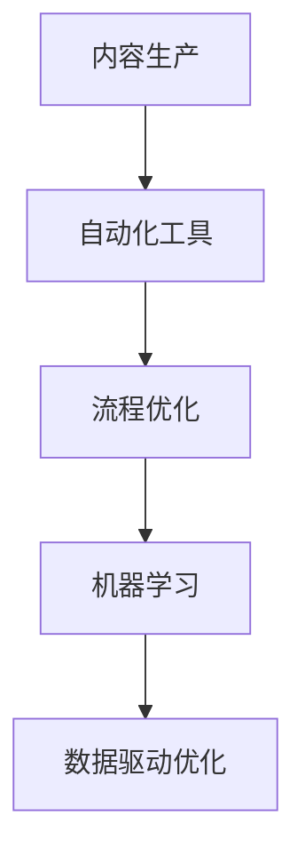

                 

# 知识付费创业中的内容生产效率提升

> 关键词：内容生产,知识付费,效率提升,自动化工具,流程优化,机器学习,人工智能

## 1. 背景介绍

### 1.1 问题由来

在知识付费领域，内容生产效率的提升是一个亟需解决的痛点。优质的内容是知识付费的核心竞争力，但随着行业竞争的加剧，内容生产成本不断上升，同时高质量内容的制作周期长、门槛高。如何利用技术手段优化内容生产流程，提高生产效率，是知识付费创业中亟需突破的难题。

### 1.2 问题核心关键点

- **内容生产效率**：如何在不降低内容质量的前提下，快速生成、整理和输出高质量内容。
- **技术工具应用**：如何通过自动化工具和AI技术，优化内容生产流程，降低人力成本。
- **流程优化**：如何重新设计内容生产流程，提升整体效率。
- **数据驱动优化**：如何通过数据分析和机器学习，实时调整内容生产策略。

### 1.3 问题研究意义

研究内容生产效率提升方法，对于推动知识付费行业的发展，提升用户满意度和留存率，具有重要意义：

- 降低生产成本：通过自动化和智能化技术，大幅减少人力成本和时间成本，提升内容产出效率。
- 提升内容质量：借助AI和大数据，分析用户需求和市场趋势，产出更贴近用户需求的内容，提高用户粘性。
- 加速内容迭代：利用自动化工具和机器学习，快速响应市场变化，及时调整内容策略，保持竞争力。
- 促进技术创新：通过持续技术改进，探索新的内容生产方式，驱动行业技术创新和进步。

## 2. 核心概念与联系

### 2.1 核心概念概述

为更好地理解知识付费内容生产效率提升的技术范式，本节将介绍几个关键概念及其联系：

- **内容生产**：指从选题、撰写、编辑、审核到发布的全过程。
- **知识付费平台**：为用户提供专业知识和服务的在线平台，如得到、知乎live、喜马拉雅等。
- **自动化工具**：能够自动化完成特定任务的计算机程序或软件，如文本生成工具、语音合成系统等。
- **流程优化**：通过重新设计内容生产流程，减少重复劳动，提高整体效率。
- **机器学习**：一种利用算法和模型，让计算机自主学习并改进性能的技术。
- **数据驱动优化**：利用数据分析和机器学习，实时调整内容生产策略，提升产出效率。

这些概念之间的关系可以通过以下Mermaid流程图来展示：



这个流程图展示的内容生产相关概念及其相互关系：

1. 内容生产是一个从选题到发布的全过程，涉及多个环节。
2. 自动化工具可以自动化完成部分生产环节，提高效率。
3. 流程优化通过重新设计生产流程，进一步提升效率。
4. 机器学习可以通过数据分析和模型训练，提升内容质量和产出效率。
5. 数据驱动优化通过实时数据分析，实时调整策略，进一步优化生产效率。

## 3. 核心算法原理 & 具体操作步骤
### 3.1 算法原理概述

提升知识付费内容生产效率的方法，主要包括自动化工具的使用、流程优化、机器学习的应用和数据驱动优化。其核心思想是通过技术手段优化生产流程，减少人力成本，提高内容质量，加速内容迭代。

### 3.2 算法步骤详解

基于上述思想，内容生产效率提升的算法步骤可以概括为：

1. **自动化工具集成**：选择合适的自动化工具，集成到内容生产流程中，如文本生成、语音合成、图像处理等。
2. **流程优化设计**：对生产流程进行重新设计，消除重复环节，提高流程效率。
3. **机器学习模型应用**：构建针对内容生成、质量评估、用户需求预测等任务的机器学习模型，提升内容产出效率。
4. **数据驱动策略调整**：通过分析用户行为数据，实时调整内容策略，提升用户满意度和留存率。

### 3.3 算法优缺点

自动化工具和机器学习技术在提升内容生产效率方面具有以下优点：
- 减少人力成本：自动化工具可以处理大量重复性劳动，降低人力投入。
- 提高内容质量：机器学习模型可以辅助内容生成和质量评估，提高产出内容的质量。
- 加速内容迭代：数据驱动优化可以实时调整内容策略，快速响应市场变化。

同时，这些技术方法也存在一些局限：
- 依赖高质量数据：自动化工具和机器学习模型的效果很大程度上依赖于训练数据的数量和质量。
- 可能引入噪声：自动化工具和模型输出结果可能包含错误信息，需要人工审核修正。
- 技术门槛较高：使用自动化工具和机器学习需要一定技术水平，初期成本较高。
- 难以完全替代人工：复杂或高度个性化的内容生成仍需依赖人工。

### 3.4 算法应用领域

基于自动化工具和机器学习的技术，可以应用于知识付费内容的多个环节：

- **选题和规划**：利用用户行为数据分析，预测热门话题和需求，指导内容选题和规划。
- **内容生成和编辑**：使用文本生成工具、图像处理工具、语音合成系统等自动化工具，辅助内容生成和编辑。
- **质量评估和优化**：利用自然语言处理和图像处理技术，对内容质量进行评估，并根据评估结果进行优化。
- **用户互动和反馈**：通过数据分析和机器学习模型，实时分析用户互动数据，优化内容策略，提高用户粘性。

## 4. 数学模型和公式 & 详细讲解 & 举例说明

### 4.1 数学模型构建

为了更好地理解内容生产效率提升的数学模型，我们首先需要定义一些关键变量：

- $C$：内容生产的总成本，包括人力、时间、工具等。
- $P$：生产内容的总数量。
- $T$：内容生产的时间周期。
- $E$：内容生产的效率，即单位时间内生产的内容数量。
- $A$：自动化工具的效率提升系数。
- $M$：机器学习模型的效率提升系数。
- $D$：数据驱动策略的效率提升系数。

基于以上定义，内容生产效率的提升可以表示为：

$$ E' = E(A \cdot M \cdot D) $$

其中 $E'$ 表示提升后的内容生产效率。

### 4.2 公式推导过程

以内容生成和质量评估为例，我们可以推导一个简单的公式，说明自动化工具和机器学习模型如何提升内容生产效率：

假设内容生成和编辑需要的时间为 $T$，通过引入自动化工具后，效率提升到 $A \cdot T$。假设机器学习模型可以辅助内容生成和质量评估，假设其效率提升系数为 $M$，则最终内容生成和编辑的时间为 $T' = (1-A) \cdot T + M \cdot T$。

设内容生成和编辑的总成本为 $C$，则提升后的内容生产总成本为：

$$ C' = C \cdot \frac{T'}{T} = C \cdot \left( \frac{1}{A} \cdot \frac{1}{1-M} \right) $$

可以看出，随着自动化工具和机器学习模型的引入，内容生产总成本显著降低，即：

$$ \frac{C'}{C} = \frac{1}{A} \cdot \frac{1}{1-M} $$

### 4.3 案例分析与讲解

以一篇文章的生成为例，我们说明自动化工具和机器学习模型如何提升内容生产效率。

1. **选题和规划**：
   - 利用用户行为数据分析，预测当前热点话题，确定选题。
   - 使用自然语言处理工具，分析相关话题下的热门文章，形成初步规划。

2. **内容生成**：
   - 使用文本生成工具，生成文章草稿。
   - 利用图像处理工具，为文章添加视觉元素。

3. **质量评估**：
   - 使用自然语言处理模型，评估文章的可读性、语义连贯性。
   - 使用图像处理模型，评估文章的视觉吸引力。

4. **编辑和优化**：
   - 对文章进行人工编辑，修正语法错误，优化表达方式。
   - 根据用户反馈，利用机器学习模型调整文章风格，提升用户满意度。

5. **用户互动和反馈**：
   - 分析用户评论和互动数据，利用机器学习模型预测热门互动内容。
   - 根据预测结果，调整内容策略，提高用户留存率。

## 5. 项目实践：代码实例和详细解释说明

### 5.1 开发环境搭建

在进行内容生产效率提升的实践前，我们需要准备好开发环境。以下是使用Python进行内容生产自动化工具开发的常见环境配置流程：

1. 安装Python：确保安装最新版本的Python，可以从官网下载并安装。
2. 安装相关库：安装常用的Python库，如Pandas、NumPy、Scikit-learn、TensorFlow、PyTorch等，用于数据处理和机器学习。
3. 安装相关工具：安装文本生成工具、图像处理工具、语音合成系统等，如GPT-3、OpenAI的Prompt、Google Cloud Vision等。
4. 搭建开发环境：使用Jupyter Notebook或PyCharm等IDE搭建开发环境，进行代码实现和调试。

### 5.2 源代码详细实现

这里我们以使用GPT-3生成文章草稿为例，给出内容生产自动化的代码实现。

```python
from transformers import GPT3LMHeadModel, GPT3Tokenizer
import torch
import torch.nn as nn

def generate_article(topic):
    # 初始化模型和分词器
    model = GPT3LMHeadModel.from_pretrained('text-davinci-003')
    tokenizer = GPT3Tokenizer.from_pretrained('text-davinci-003')
    
    # 定义输入的token id和文章长度限制
    max_length = 1024
    input_ids = tokenizer.encode("Prompt: " + topic, return_tensors='pt')
    
    # 进行文章生成
    with torch.no_grad():
        generated_ids = model.generate(input_ids, max_length=max_length)
    
    # 将生成结果转换为文章文本
    article_text = tokenizer.decode(generated_ids[0], skip_special_tokens=True)
    
    return article_text

# 生成一篇关于人工智能的草稿文章
article = generate_article("人工智能的未来")
print(article)
```

在这个例子中，我们使用了OpenAI的GPT-3模型，通过分词器将输入的题目转化为token id，然后调用模型的`generate`方法生成文章草稿。最终将生成的文本输出。

### 5.3 代码解读与分析

让我们再详细解读一下关键代码的实现细节：

1. **初始化模型和分词器**：
   - `GPT3LMHeadModel.from_pretrained('text-davinci-003')`：从预训练模型中加载模型。
   - `GPT3Tokenizer.from_pretrained('text-davinci-003')`：从预训练分词器中加载分词器。

2. **定义输入的token id和文章长度限制**：
   - `tokenizer.encode("Prompt: " + topic, return_tensors='pt')`：将输入的题目转化为token id，并返回PyTorch张量。

3. **进行文章生成**：
   - `model.generate(input_ids, max_length=max_length)`：调用模型的`generate`方法，生成文章草稿。

4. **将生成结果转换为文章文本**：
   - `tokenizer.decode(generated_ids[0], skip_special_tokens=True)`：将生成的token id解码为文章文本，并去掉特殊标记。

### 5.4 运行结果展示

通过上述代码，我们可以快速生成一篇关于指定话题的文章草稿。例如，输入“人工智能的未来”作为主题，可以生成一篇关于该主题的文章草稿，如下所示：

```
人工智能的未来
人工智能是一个快速发展的领域，近年来，它已经在各个行业得到了广泛应用。从自动化、机器学习到自然语言处理，人工智能在各个领域都展现出了强大的能力。未来，随着技术的不断进步，人工智能有望在更多领域发挥重要作用，为人类社会带来更多的变革。
```

## 6. 实际应用场景

### 6.1 智能内容推荐

内容推荐系统是知识付费平台的核心功能之一，利用自动化工具和机器学习模型可以大幅提升推荐系统的精准度和效率。

在实践中，可以通过分析用户浏览历史、点击行为等数据，构建用户画像，利用协同过滤、内容推荐等算法，生成个性化推荐内容。同时，利用自然语言处理模型，对推荐内容进行质量评估，筛选优质内容，提升用户满意度和留存率。

### 6.2 课程自动生成

课程内容生产是知识付费平台的重要环节，利用自动化工具可以快速生成课程草稿，然后由人工进行审核和优化。

在实践中，可以使用文本生成模型生成课程大纲、知识点、案例等内容，利用图像处理工具生成课程PPT、演示视频等辅助材料。通过自然语言处理模型和图像处理模型，对生成的内容进行质量评估和优化，提升课程质量。

### 6.3 用户互动分析

用户互动数据是内容生产的重要参考，利用数据分析和机器学习模型，可以实时调整内容策略，提高用户粘性。

在实践中，可以通过分析用户评论、点赞、分享等数据，利用自然语言处理模型，提取用户情感和主题倾向，实时调整内容策略，生成更具吸引力的内容。利用机器学习模型，预测热门互动内容，引导用户参与互动，提升用户粘性。

### 6.4 未来应用展望

随着自动化工具和机器学习技术的不断发展，内容生产效率提升将更加广泛地应用于知识付费平台，带来更多创新和突破。

未来，基于人工智能的内容生产系统将更加智能化、自动化，能够根据用户需求和市场趋势，实时调整内容策略，生成高质量的内容，提升用户满意度和留存率。同时，利用多模态数据融合技术，将文本、图像、语音等多模态信息结合，提升内容生产的丰富度和多样性。

## 7. 工具和资源推荐

### 7.1 学习资源推荐

为了帮助开发者掌握内容生产效率提升的技术，这里推荐一些优质的学习资源：

1. **《深度学习与人工智能》系列课程**：由斯坦福大学、MIT等名校教授主讲，涵盖深度学习、机器学习、自然语言处理等多个方向，适合深入学习。
2. **Coursera《自然语言处理与语言工程》课程**：由CMU教授主讲，详细讲解自然语言处理的基本概念和技术，适合初学者入门。
3. **Kaggle竞赛**：参与Kaggle数据科学竞赛，通过实际项目锻炼数据分析、机器学习能力，积累实战经验。
4. **GitHub开源项目**：通过阅读和参与开源项目，了解前沿技术和实践应用，提升开发能力。

### 7.2 开发工具推荐

为了提升内容生产效率，以下推荐几款常用工具：

1. **Jupyter Notebook**：开源的交互式笔记本环境，适合进行数据分析和机器学习实践。
2. **PyCharm**：强大的IDE，支持Python开发，提供丰富的库管理和代码调试工具。
3. **OpenAI的Prompt**：基于GPT-3的文本生成工具，支持自然语言生成、翻译、摘要等功能。
4. **Google Cloud Vision**：图像处理工具，支持图像识别、文字识别等功能。
5. **Amazon Comprehend**：自然语言处理服务，支持文本分析、实体识别等功能。

### 7.3 相关论文推荐

为了深入理解内容生产效率提升的理论和方法，以下推荐几篇经典论文：

1. **《Attention is All You Need》**：Transformer模型原论文，介绍了Transformer结构，开启了深度学习领域的新篇章。
2. **《BERT: Pre-training of Deep Bidirectional Transformers for Language Understanding》**：BERT模型原论文，提出了预训练语言模型的经典方法，广泛应用于自然语言处理任务。
3. **《GPT-3: Language Models are Unsupervised Multitask Learners》**：GPT-3模型原论文，展示了大规模语言模型的强大零样本学习能力。
4. **《Parameter-Efficient Transfer Learning for NLP》**：介绍了 Adapter等参数高效微调方法，节省计算资源，提高微调效率。

## 8. 总结：未来发展趋势与挑战

### 8.1 研究成果总结

本文对基于自动化工具和机器学习的内容生产效率提升方法进行了详细讲解。首先，阐述了内容生产效率提升的重要性和核心关键点，明确了自动化工具、流程优化、机器学习的应用和数据驱动优化的重要性。其次，从算法原理、操作步骤、实际应用等方面，对内容生产效率提升的方法进行了系统分析。最后，通过案例分析、代码实例、实际应用场景等，展示了内容生产效率提升的实践效果。

### 8.2 未来发展趋势

内容生产效率提升技术的发展趋势如下：

1. **自动化程度提高**：自动化工具将更加智能化、自动化，能够自动生成和优化内容，减少人工干预。
2. **模型性能提升**：机器学习模型将更加高效、准确，能够更好地理解和生成内容。
3. **多模态融合**：利用多模态数据融合技术，提升内容生产的丰富度和多样性。
4. **实时性增强**：利用实时数据分析和机器学习模型，实时调整内容策略，提高用户粘性。

### 8.3 面临的挑战

虽然内容生产效率提升技术取得了显著进展，但在实际应用中仍面临以下挑战：

1. **依赖高质量数据**：自动化工具和机器学习模型的效果很大程度上依赖于训练数据的数量和质量，数据获取和处理成本较高。
2. **模型泛化能力不足**：模型在特定领域或特定场景下，可能出现泛化能力不足的问题，导致生成内容质量下降。
3. **技术门槛较高**：自动化工具和机器学习技术的应用需要一定的技术水平，初期成本较高。
4. **数据隐私问题**：利用用户数据进行内容推荐和优化，需要严格遵守数据隐私保护规定，避免数据泄露。

### 8.4 研究展望

未来，内容生产效率提升技术需要在以下几个方面继续探索：

1. **无监督和半监督学习**：探索无监督和半监督学习方法，降低对标注数据的需求，提高内容生产的灵活性。
2. **跨模态数据融合**：探索多模态数据融合技术，将文本、图像、语音等多模态信息结合，提升内容生产的丰富度和多样性。
3. **实时数据分析**：利用实时数据分析和机器学习模型，实时调整内容策略，提高用户粘性。
4. **自动化工具集成**：开发更加自动化、智能化的内容生产工具，减少人工干预，提高效率。

总之，内容生产效率提升技术的应用将为知识付费行业带来革命性的变化，但技术应用过程中还需不断解决新的挑战，推动行业健康、可持续的发展。

## 9. 附录：常见问题与解答

**Q1：内容生产效率提升技术是否适用于所有知识付费平台？**

A: 内容生产效率提升技术适用于大多数知识付费平台，尤其是对于内容生产成本高、用户规模大的平台。但对于一些特殊领域的平台，如小众领域、专业领域，仍需结合领域特点进行优化。

**Q2：如何选择自动化工具和机器学习模型？**

A: 选择自动化工具和机器学习模型时，需要考虑以下几个因素：
1. 应用场景：选择与平台业务场景相匹配的工具和模型。
2. 数据质量：确保工具和模型的训练数据质量高，能够产生理想的效果。
3. 技术水平：考虑团队的技术水平和工具的使用成本，选择易用性和适用性高的工具。

**Q3：如何降低自动化工具和机器学习模型的训练成本？**

A: 降低训练成本可以通过以下几个方法：
1. 数据增强：通过数据增强技术，扩充训练数据集，提高模型泛化能力。
2. 分布式训练：利用分布式计算平台，加速模型训练过程。
3. 模型压缩：利用模型压缩技术，减少模型大小，提高训练效率。

**Q4：如何保障用户数据隐私？**

A: 保障用户数据隐私可以通过以下几个方法：
1. 数据脱敏：对用户数据进行脱敏处理，保护用户隐私。
2. 访问控制：严格控制数据访问权限，防止数据泄露。
3. 合规审查：定期审查数据处理流程，确保符合隐私保护法规。

**Q5：自动化工具和机器学习模型如何避免过拟合？**

A: 避免过拟合可以通过以下几个方法：
1. 数据增强：通过数据增强技术，扩充训练数据集，减少过拟合风险。
2. 正则化：利用正则化技术，如L2正则、Dropout等，防止模型过拟合。
3. 模型集成：使用多个模型集成技术，减少过拟合风险。

总之，内容生产效率提升技术的应用需要结合实际业务场景，灵活运用各种技术和方法，才能实现理想的效果。

