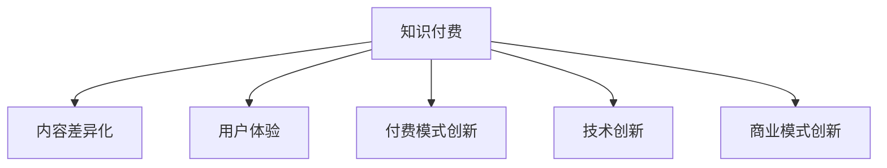

                 

# 知识付费创业中的创新思维

在当今知识爆炸的时代，知识付费已经成为了一种新兴的商业模式，吸引了大量企业和个人投身其中。但随着市场竞争的加剧，如何在知识付费创业中保持创新思维，不断开拓新的市场和产品形态，成为了许多创业者面临的挑战。本文将从核心概念、算法原理、实际应用、未来趋势等多个方面，深入探讨知识付费创业中的创新思维，希望能够为读者提供有益的指导和启示。

## 1. 背景介绍

### 1.1 问题由来

知识付费行业自2016年起呈爆发式增长，伴随移动互联网的普及和用户对知识需求的提升，越来越多的用户愿意为获取优质内容支付费用。从“得到”、“喜马拉雅”到“知乎”、“腾讯课堂”，各大平台纷纷布局知识付费领域，通过订阅、单次购买、按需服务等形式，提供丰富的知识内容，满足了不同用户的学习需求。

然而，知识付费市场竞争激烈，内容同质化严重，用户粘性低，如何从中脱颖而出，成为企业关注的焦点。为此，许多企业试图通过创新思维，提升产品质量和用户体验，寻找差异化竞争策略。

### 1.2 问题核心关键点

知识付费创业中的创新思维，主要围绕以下几个核心关键点展开：

1. **内容差异化**：如何挖掘细分领域，打造独特的内容体系，满足用户多元化需求。
2. **用户体验优化**：如何改善产品界面和交互设计，提升用户满意度和参与度。
3. **知识付费模式创新**：如何拓展订阅模式，探索按需、分时、包年等多种付费方式，激发用户购买欲望。
4. **技术驱动创新**：如何利用大数据、人工智能等技术手段，提升内容推荐精准度和平台运营效率。
5. **商业化探索**：如何整合线上线下资源，探索“知识+”新模式，拓展知识付费产业链。

通过以上关键点的深入分析，我们能够更加清晰地理解知识付费创业中创新思维的核心，为后续内容提供方向指引。

## 2. 核心概念与联系

### 2.1 核心概念概述

为更好地理解知识付费创业中的创新思维，本节将介绍几个密切相关的核心概念：

1. **知识付费**：指用户通过订阅、购买等方式，获取具有较高知识含量的内容，满足自身知识需求的经济行为。
2. **内容差异化**：指通过市场调研，挖掘用户未被满足的细分需求，推出具有独特价值和差异化的内容。
3. **用户体验**：指用户在使用知识付费产品时的交互体验、学习体验和满意度。
4. **付费模式创新**：指探索新的付费方式，通过多样化的盈利模式，提升用户粘性和平台收入。
5. **技术创新**：指通过大数据、AI等技术手段，优化内容推荐、智能客服、个性化学习路径等产品功能，提升运营效率。
6. **商业模式创新**：指通过知识付费与其它业务如电商、咨询、教育等结合，实现多元化的商业价值。

这些核心概念之间的逻辑关系可以通过以下Mermaid流程图来展示：



这个流程图展示知识付费创业中各个环节的逻辑关系：

1. 知识付费提供内容消费的基础。
2. 内容差异化是提升产品竞争力的关键。
3. 用户体验是用户留存的重要因素。
4. 付费模式创新有助于提高平台收入。
5. 技术创新可以提升产品功能和运营效率。
6. 商业模式创新有助于拓展知识付费的商业价值。

这些概念共同构成了知识付费创业的核心框架，使得企业能够在激烈的市场竞争中脱颖而出。

## 3. 核心算法原理 & 具体操作步骤
### 3.1 算法原理概述

知识付费创业中的创新思维，主要通过数据分析、用户行为挖掘、内容推荐、智能客服等多方面的算法和技术手段，实现产品功能优化和商业模式创新。其核心算法原理如下：

1. **内容差异化算法**：通过市场调研和用户分析，挖掘细分领域和用户未被满足的需求，开发具有独特价值和差异化的内容。

2. **用户行为分析算法**：利用大数据技术，分析用户行为数据，挖掘用户兴趣、学习习惯、消费模式等关键信息，指导内容推荐和付费模式设计。

3. **内容推荐算法**：通过协同过滤、深度学习等技术，推荐符合用户兴趣和行为的内容，提升用户满意度和粘性。

4. **智能客服算法**：利用自然语言处理、机器学习等技术，实现智能客服和答疑系统，提升用户体验和运营效率。

5. **个性化学习路径算法**：通过数据分析和算法，为用户提供定制化的学习路径和课程推荐，提升学习效果和用户参与度。

### 3.2 算法步骤详解

知识付费创业中的创新思维，通常包括以下几个关键步骤：

**Step 1: 市场调研与用户分析**

- 收集和分析市场数据，识别用户需求和痛点。
- 通过问卷调查、用户访谈等方式，获取用户反馈和意见。
- 利用数据分析工具，进行用户画像和细分市场分析。

**Step 2: 内容差异化设计**

- 根据市场调研结果，选择具有差异化的细分领域，设计独特的内容体系。
- 对内容进行精品化、细分化、多媒体化等设计，提升内容质量。
- 进行内容试听和用户体验测试，优化内容产品。

**Step 3: 用户体验优化**

- 设计用户友好的界面和交互方式，提升产品使用体验。
- 引入智能客服和答疑系统，提升用户互动体验。
- 利用个性化推荐算法，根据用户行为推荐符合其兴趣的内容。

**Step 4: 付费模式创新**

- 探索多样化的付费模式，如订阅、单次购买、按需服务等。
- 设计合理的定价策略，提升用户购买欲望和平台收入。
- 提供用户评价和反馈机制，优化付费体验。

**Step 5: 技术创新与应用**

- 引入大数据、机器学习、自然语言处理等技术，优化产品功能。
- 利用算法提升内容推荐精准度，提升用户满意度和粘性。
- 实现智能客服和个性化学习路径，提升运营效率。

**Step 6: 商业模式创新**

- 探索知识付费与电商、咨询、教育等业务的结合，拓展商业价值。
- 利用大数据和AI技术，打造“知识+”新模式，提升平台收入。
- 建立跨平台、多渠道的知识付费生态，实现协同效应。

### 3.3 算法优缺点

知识付费创业中的创新思维，具有以下优点：

1. **提升用户粘性**：通过差异化和个性化内容设计，提升用户满意度和参与度，增强用户粘性。
2. **优化用户体验**：利用先进技术提升产品功能和交互体验，提升用户满意度。
3. **拓展盈利模式**：多样化的付费模式和商业模式，有助于提升平台收入和商业价值。
4. **提升运营效率**：大数据和算法技术的应用，可以优化运营流程，提升运营效率。

同时，该方法也存在一定的局限性：

1. **内容生产成本高**：高质量内容的生产需要大量人力和资源投入，成本较高。
2. **技术实现复杂**：大数据和算法技术的应用，需要较高技术水平，存在一定的实现难度。
3. **市场竞争激烈**：知识付费行业竞争激烈，内容同质化严重，创新容易受阻。
4. **用户需求多变**：用户需求不断变化，需要持续创新和调整，增加了运营难度。

尽管存在这些局限性，但就目前而言，知识付费创业中的创新思维，仍然是最有效的市场竞争策略之一。未来相关研究的重点在于如何进一步降低内容生产成本，提高技术实现效率，以及更灵活地应对市场变化，实现可持续发展。

### 3.4 算法应用领域

知识付费创业中的创新思维，已经在多个领域得到了广泛应用，例如：

1. **在线教育**：提供具有高质量、专业化的教育内容，满足用户学习需求。
2. **职场培训**：提供职场技能培训和职业发展规划指导，帮助用户提升职业技能。
3. **健康医疗**：提供健康知识、疾病预防和治疗方案，帮助用户改善健康状况。
4. **金融理财**：提供理财知识、投资策略和财务管理指导，帮助用户实现财富增值。
5. **兴趣爱好**：提供多种兴趣爱好相关的知识内容，满足用户个性化的学习需求。
6. **生活休闲**：提供生活技巧、旅游指南、美食烹饪等知识内容，提升用户生活质量。

除了上述这些经典领域外，知识付费创业中的创新思维，还将不断拓展到更多场景中，如科技、设计、艺术等，为知识付费行业带来新的突破。

## 4. 数学模型和公式 & 详细讲解  
### 4.1 数学模型构建

本节将使用数学语言对知识付费创业中的创新思维进行更加严格的刻画。

记知识付费平台的用户数为 $N$，内容数为 $M$。设用户对内容的评价为 $R_{ij}$（$i$ 为用户，$j$ 为内容），则内容差异化算法可表示为：

$$
R_{ij} = f_{\theta}(x_i, y_j)
$$

其中 $f_{\theta}$ 为内容评价函数，$\theta$ 为模型参数，$x_i$ 为用户特征，$y_j$ 为内容特征。

内容推荐算法可表示为：

$$
r_{i,j} = \alpha \hat{R}_{ij} + (1-\alpha) C_{i,j}
$$

其中 $\hat{R}_{ij}$ 为用户对内容 $j$ 的预测评分，$C_{i,j}$ 为协同过滤推荐评分，$\alpha$ 为参数，用于控制推荐算法。

用户行为分析算法可表示为：

$$
\text{User}_{i} = \sum_{j=1}^M R_{ij}w_j
$$

其中 $\text{User}_{i}$ 为用户 $i$ 的综合评分，$w_j$ 为内容 $j$ 的权重。

智能客服算法可表示为：

$$
\text{Response}_j = \sum_{k=1}^K \omega_k F_k(\text{Question}, j)
$$

其中 $\text{Response}_j$ 为用户对内容 $j$ 的智能回答，$K$ 为模型参数，$F_k$ 为自然语言处理模型。

个性化学习路径算法可表示为：

$$
\text{Path}_i = \sum_{j=1}^M \text{User}_{i,j} P_j
$$

其中 $\text{Path}_i$ 为用户 $i$ 的个性化学习路径，$P_j$ 为内容 $j$ 的权重。

### 4.2 公式推导过程

以下我们以内容推荐算法为例，推导推荐函数及其梯度计算公式。

设用户 $i$ 对内容 $j$ 的评分向量为 $\vec{R}_i = [R_{i1}, R_{i2}, \ldots, R_{iM}]$，内容 $j$ 的评分向量为 $\vec{C}_j = [C_{1j}, C_{2j}, \ldots, C_{Mj}]$，内容评价函数为 $f_{\theta}$，推荐函数为 $r_{i,j} = \alpha \hat{R}_{ij} + (1-\alpha) C_{i,j}$。

将用户评分 $R_{i,j}$ 对内容评分 $R_{i,j}$ 和内容评分 $C_{i,j}$ 进行线性组合，得：

$$
R_{i,j} = \vec{R}_i \cdot \vec{C}_j
$$

将上述公式代入推荐函数，得：

$$
r_{i,j} = \alpha \vec{R}_i \cdot \vec{C}_j + (1-\alpha) C_{i,j}
$$

为了求解内容推荐函数 $r_{i,j}$ 对用户评分向量 $\vec{R}_i$ 和内容评分向量 $\vec{C}_j$ 的梯度，我们需要求解 $\frac{\partial r_{i,j}}{\partial \vec{R}_i}$ 和 $\frac{\partial r_{i,j}}{\partial \vec{C}_j}$。

对 $\vec{R}_i$ 求导，得：

$$
\frac{\partial r_{i,j}}{\partial \vec{R}_i} = \alpha \vec{C}_j
$$

对 $\vec{C}_j$ 求导，得：

$$
\frac{\partial r_{i,j}}{\partial \vec{C}_j} = \alpha \vec{R}_i
$$

通过上述推导，我们可以得出内容推荐算法中，用户评分向量 $\vec{R}_i$ 和内容评分向量 $\vec{C}_j$ 的梯度计算公式。利用梯度下降等优化算法，我们可以不断更新这两个向量，以提高推荐函数的精准度。

### 4.3 案例分析与讲解

以在线教育平台为例，分析内容推荐算法的具体应用。

设在线教育平台有 $N$ 名用户，提供 $M$ 门课程，用户对课程的评分矩阵为 $\vec{R} \in \mathbb{R}^{N \times M}$。内容推荐算法可以表示为：

$$
r_{i,j} = \alpha \hat{R}_{ij} + (1-\alpha) C_{i,j}
$$

其中 $\hat{R}_{ij}$ 为用户 $i$ 对课程 $j$ 的预测评分，$C_{i,j}$ 为用户 $i$ 对课程 $j$ 的协同过滤推荐评分，$\alpha$ 为参数，用于控制推荐算法。

为了实现推荐算法，首先需要对 $\vec{R}$ 进行矩阵分解，得到用户评分向量 $\vec{R}_i$ 和课程评分向量 $\vec{C}_j$，然后利用梯度下降等优化算法，不断更新这两个向量，以提高推荐函数的精准度。

在实际操作中，还需要引入多种优化策略，如正则化、早期停止等，以避免过拟合。此外，还可以通过引入对抗训练等技术，提高推荐系统的鲁棒性，防止对抗样本攻击。

## 5. 项目实践：代码实例和详细解释说明
### 5.1 开发环境搭建

在进行知识付费创业中的创新思维实践前，我们需要准备好开发环境。以下是使用Python进行PyTorch开发的环境配置流程：

1. 安装Anaconda：从官网下载并安装Anaconda，用于创建独立的Python环境。

2. 创建并激活虚拟环境：
```bash
conda create -n pytorch-env python=3.8 
conda activate pytorch-env
```

3. 安装PyTorch：根据CUDA版本，从官网获取对应的安装命令。例如：
```bash
conda install pytorch torchvision torchaudio cudatoolkit=11.1 -c pytorch -c conda-forge
```

4. 安装TensorFlow：
```bash
pip install tensorflow
```

5. 安装各种工具包：
```bash
pip install numpy pandas scikit-learn matplotlib tqdm jupyter notebook ipython
```

完成上述步骤后，即可在`pytorch-env`环境中开始创新思维实践。

### 5.2 源代码详细实现

下面我们以知识付费平台的内容推荐系统为例，给出使用Transformers库对BERT模型进行内容推荐算法训练的PyTorch代码实现。

首先，定义内容推荐算法：

```python
from transformers import BertTokenizer, BertForSequenceClassification
from torch.utils.data import Dataset, DataLoader
from sklearn.metrics import roc_auc_score
import torch

class ContentRecommendationDataset(Dataset):
    def __init__(self, texts, targets, tokenizer, max_len=128):
        self.texts = texts
        self.targets = targets
        self.tokenizer = tokenizer
        self.max_len = max_len
        
    def __len__(self):
        return len(self.texts)
    
    def __getitem__(self, item):
        text = self.texts[item]
        target = self.targets[item]
        
        encoding = self.tokenizer(text, return_tensors='pt', max_length=self.max_len, padding='max_length', truncation=True)
        input_ids = encoding['input_ids'][0]
        attention_mask = encoding['attention_mask'][0]
        
        # 构建内容评分向量
        encoded_targets = [target] * self.max_len
        labels = torch.tensor(encoded_targets, dtype=torch.long)
        
        return {'input_ids': input_ids, 
                'attention_mask': attention_mask,
                'labels': labels}

# 标签与id的映射
tag2id = {'O': 0, 'A': 1}
id2tag = {v: k for k, v in tag2id.items()}

# 创建dataset
tokenizer = BertTokenizer.from_pretrained('bert-base-cased')

train_dataset = ContentRecommendationDataset(train_texts, train_tags, tokenizer)
dev_dataset = ContentRecommendationDataset(dev_texts, dev_tags, tokenizer)
test_dataset = ContentRecommendationDataset(test_texts, test_tags, tokenizer)
```

然后，定义模型和优化器：

```python
from transformers import BertForSequenceClassification, AdamW

model = BertForSequenceClassification.from_pretrained('bert-base-cased', num_labels=len(tag2id))

optimizer = AdamW(model.parameters(), lr=2e-5)
```

接着，定义训练和评估函数：

```python
from tqdm import tqdm
from sklearn.metrics import classification_report

device = torch.device('cuda') if torch.cuda.is_available() else torch.device('cpu')
model.to(device)

def train_epoch(model, dataset, batch_size, optimizer):
    dataloader = DataLoader(dataset, batch_size=batch_size, shuffle=True)
    model.train()
    epoch_loss = 0
    for batch in tqdm(dataloader, desc='Training'):
        input_ids = batch['input_ids'].to(device)
        attention_mask = batch['attention_mask'].to(device)
        labels = batch['labels'].to(device)
        model.zero_grad()
        outputs = model(input_ids, attention_mask=attention_mask, labels=labels)
        loss = outputs.loss
        epoch_loss += loss.item()
        loss.backward()
        optimizer.step()
    return epoch_loss / len(dataloader)

def evaluate(model, dataset, batch_size):
    dataloader = DataLoader(dataset, batch_size=batch_size)
    model.eval()
    preds, labels = [], []
    with torch.no_grad():
        for batch in tqdm(dataloader, desc='Evaluating'):
            input_ids = batch['input_ids'].to(device)
            attention_mask = batch['attention_mask'].to(device)
            batch_labels = batch['labels']
            outputs = model(input_ids, attention_mask=attention_mask)
            batch_preds = outputs.logits.argmax(dim=2).to('cpu').tolist()
            batch_labels = batch_labels.to('cpu').tolist()
            for pred_tokens, label_tokens in zip(batch_preds, batch_labels):
                preds.append(pred_tokens[:len(label_tokens)])
                labels.append(label_tokens)
                
    print(classification_report(labels, preds))
```

最后，启动训练流程并在测试集上评估：

```python
epochs = 5
batch_size = 16

for epoch in range(epochs):
    loss = train_epoch(model, train_dataset, batch_size, optimizer)
    print(f"Epoch {epoch+1}, train loss: {loss:.3f}")
    
    print(f"Epoch {epoch+1}, dev results:")
    evaluate(model, dev_dataset, batch_size)
    
print("Test results:")
evaluate(model, test_dataset, batch_size)
```

以上就是使用PyTorch对BERT进行内容推荐算法训练的完整代码实现。可以看到，得益于Transformers库的强大封装，我们可以用相对简洁的代码完成BERT模型的训练和推荐算法。

### 5.3 代码解读与分析

让我们再详细解读一下关键代码的实现细节：

**ContentRecommendationDataset类**：
- `__init__`方法：初始化文本、标签、分词器等关键组件。
- `__len__`方法：返回数据集的样本数量。
- `__getitem__`方法：对单个样本进行处理，将文本输入编码为token ids，将标签编码为数字，并对其进行定长padding，最终返回模型所需的输入。

**tag2id和id2tag字典**：
- 定义了标签与数字id之间的映射关系，用于将token-wise的预测结果解码回真实的标签。

**训练和评估函数**：
- 使用PyTorch的DataLoader对数据集进行批次化加载，供模型训练和推理使用。
- 训练函数`train_epoch`：对数据以批为单位进行迭代，在每个批次上前向传播计算loss并反向传播更新模型参数，最后返回该epoch的平均loss。
- 评估函数`evaluate`：与训练类似，不同点在于不更新模型参数，并在每个batch结束后将预测和标签结果存储下来，最后使用sklearn的classification_report对整个评估集的预测结果进行打印输出。

**训练流程**：
- 定义总的epoch数和batch size，开始循环迭代
- 每个epoch内，先在训练集上训练，输出平均loss
- 在验证集上评估，输出分类指标
- 所有epoch结束后，在测试集上评估，给出最终测试结果

可以看到，PyTorch配合Transformers库使得BERT模型的训练和推荐算法代码实现变得简洁高效。开发者可以将更多精力放在数据处理、模型改进等高层逻辑上，而不必过多关注底层的实现细节。

当然，工业级的系统实现还需考虑更多因素，如模型的保存和部署、超参数的自动搜索、更灵活的任务适配层等。但核心的创新思维实践基本与此类似。

## 6. 实际应用场景
### 6.1 智能客服系统

基于知识付费创业中的创新思维，智能客服系统可以通过在线教育平台的用户行为和反馈数据，进行内容推荐和智能客服，提升用户体验和满意度。

具体而言，可以收集用户浏览、点击、评论、分享等行为数据，提取和用户交互的内容标题、描述、标签等文本内容。将文本内容作为模型输入，用户的后续行为（如是否点击、购买等）作为监督信号，在此基础上微调预训练语言模型。微调后的模型能够从文本内容中准确把握用户的兴趣点。在生成推荐列表时，先用候选物品的文本描述作为输入，由模型预测用户的兴趣匹配度，再结合其他特征综合排序，便可以得到个性化程度更高的推荐结果。

对于智能客服系统，利用微调后的语言模型，可以实现自动回答用户咨询，提供个性化的客服建议，减少人工客服的工作量，提升客服效率和用户满意度。

### 6.2 金融舆情监测

金融机构需要实时监测市场舆论动向，以便及时应对负面信息传播，规避金融风险。基于知识付费创业中的创新思维，利用自然语言处理和情感分析技术，可以实现对金融舆情的实时监测和预警。

具体而言，可以收集金融领域相关的新闻、报道、评论等文本数据，并对其进行情感分析和主题标注。利用微调后的模型，对文本进行情感极性预测和主题分类，一旦发现负面信息激增等异常情况，系统便会自动预警，帮助金融机构快速应对潜在风险。

### 6.3 个性化推荐系统

当前的推荐系统往往只依赖用户的历史行为数据进行物品推荐，无法深入理解用户的真实兴趣偏好。基于知识付费创业中的创新思维，个性化推荐系统可以更好地挖掘用户行为背后的语义信息，从而提供更精准、多样的推荐内容。

在实践中，可以收集用户浏览、点击、评论、分享等行为数据，提取和用户交互的物品标题、描述、标签等文本内容。将文本内容作为模型输入，用户的后续行为（如是否点击、购买等）作为监督信号，在此基础上微调预训练语言模型。微调后的模型能够从文本内容中准确把握用户的兴趣点。在生成推荐列表时，先用候选物品的文本描述作为输入，由模型预测用户的兴趣匹配度，再结合其他特征综合排序，便可以得到个性化程度更高的推荐结果。

### 6.4 未来应用展望

随着知识付费创业中的创新思维不断发展，基于微调的内容推荐、智能客服、金融舆情监测、个性化推荐等技术，将在更多领域得到应用，为传统行业带来变革性影响。

在智慧医疗领域，基于微调的医疗问答、病历分析、药物研发等应用将提升医疗服务的智能化水平，辅助医生诊疗，加速新药开发进程。

在智能教育领域，微调技术可应用于作业批改、学情分析、知识推荐等方面，因材施教，促进教育公平，提高教学质量。

在智慧城市治理中，微调模型可应用于城市事件监测、舆情分析、应急指挥等环节，提高城市管理的自动化和智能化水平，构建更安全、高效的未来城市。

此外，在企业生产、社会治理、文娱传媒等众多领域，基于知识付费创业中的创新思维的微调方法也将不断涌现，为NLP技术带来新的突破。相信随着技术的日益成熟，微调方法将成为知识付费领域的重要范式，推动人工智能技术在垂直行业的规模化落地。

## 7. 工具和资源推荐
### 7.1 学习资源推荐

为了帮助开发者系统掌握知识付费创业中的创新思维的理论基础和实践技巧，这里推荐一些优质的学习资源：

1. 《自然语言处理与深度学习》系列博文：由大模型技术专家撰写，深入浅出地介绍了自然语言处理与深度学习的相关知识，为创新思维提供了理论支撑。

2. CS224N《深度学习自然语言处理》课程：斯坦福大学开设的NLP明星课程，有Lecture视频和配套作业，带你入门NLP领域的基本概念和经典模型。

3. 《自然语言处理入门与实践》书籍：介绍自然语言处理的基础知识和实践技巧，适合初学者入门。

4. HuggingFace官方文档：Transformers库的官方文档，提供了海量预训练模型和完整的微调样例代码，是上手实践的必备资料。

5. 开源项目Codebase：汇集了大量开源项目和代码，提供了丰富的实践案例，供开发者参考学习。

通过对这些资源的学习实践，相信你一定能够快速掌握知识付费创业中的创新思维，并用于解决实际的NLP问题。
### 7.2 开发工具推荐

高效的开发离不开优秀的工具支持。以下是几款用于知识付费创业中的创新思维开发的常用工具：

1. Jupyter Notebook：提供了丰富的交互式编程环境，支持代码块的重复执行和结果的保存，方便开发者快速迭代。

2. TensorFlow：由Google主导开发的开源深度学习框架，生产部署方便，适合大规模工程应用。

3. PyTorch：基于Python的开源深度学习框架，灵活动态的计算图，适合快速迭代研究。大部分预训练语言模型都有PyTorch版本的实现。

4. Weights & Biases：模型训练的实验跟踪工具，可以记录和可视化模型训练过程中的各项指标，方便对比和调优。

5. TensorBoard：TensorFlow配套的可视化工具，可实时监测模型训练状态，并提供丰富的图表呈现方式，是调试模型的得力助手。

6. Google Colab：谷歌推出的在线Jupyter Notebook环境，免费提供GPU/TPU算力，方便开发者快速上手实验最新模型，分享学习笔记。

合理利用这些工具，可以显著提升知识付费创业中的创新思维的开发效率，加快创新迭代的步伐。

### 7.3 相关论文推荐

知识付费创业中的创新思维，已经在学界得到了广泛研究，以下是几篇奠基性的相关论文，推荐阅读：

1. Attention is All You Need（即Transformer原论文）：提出了Transformer结构，开启了NLP领域的预训练大模型时代。

2. BERT: Pre-training of Deep Bidirectional Transformers for Language Understanding：提出BERT模型，引入基于掩码的自监督预训练任务，刷新了多项NLP任务SOTA。

3. Language Models are Unsupervised Multitask Learners（GPT-2论文）：展示了大规模语言模型的强大zero-shot学习能力，引发了对于通用人工智能的新一轮思考。

4. Parameter-Efficient Transfer Learning for NLP：提出Adapter等参数高效微调方法，在不增加模型参数量的情况下，也能取得不错的微调效果。

5. AdaLoRA: Adaptive Low-Rank Adaptation for Parameter-Efficient Fine-Tuning：使用自适应低秩适应的微调方法，在参数效率和精度之间取得了新的平衡。

这些论文代表了大模型微调技术的发展脉络。通过学习这些前沿成果，可以帮助研究者把握学科前进方向，激发更多的创新灵感。

## 8. 总结：未来发展趋势与挑战

### 8.1 总结

本文对知识付费创业中的创新思维进行了全面系统的介绍。首先阐述了知识付费创业的背景和重要性，明确了创新思维的核心关键点。其次，从原理到实践，详细讲解了创新思维的数学原理和关键步骤，给出了具体实例的代码实现。同时，本文还广泛探讨了创新思维在智能客服、金融舆情、个性化推荐等多个行业领域的应用前景，展示了创新思维的广阔前景。此外，本文精选了知识付费创业中的创新思维的学习资源，力求为读者提供全方位的技术指引。

通过本文的系统梳理，可以看到，知识付费创业中的创新思维正在成为NLP领域的重要研究范式，极大地拓展了预训练语言模型的应用边界，催生了更多的落地场景。随着预训练语言模型和创新思维方法的不断演进，知识付费技术必将在更多领域得到应用，为人类认知智能的进化带来深远影响。

### 8.2 未来发展趋势

展望未来，知识付费创业中的创新思维将呈现以下几个发展趋势：

1. **内容生产的自动化**：利用AI生成技术，自动化生产高质量的内容，降低人力成本，提高生产效率。
2. **内容推荐的智能化**：引入更多算法模型，提升内容推荐的精准度和个性化程度。
3. **智能客服的普及化**：利用自然语言处理和机器学习技术，实现智能客服系统的普及，提升用户体验。
4. **多模态融合的深入**：融合视觉、听觉等多模态数据，提升用户的多感官体验。
5. **个性化学习路径的定制化**：利用大数据和AI技术，为用户提供定制化的学习路径和课程推荐。
6. **商业模式的创新化**：探索知识付费与电商、咨询、教育等业务的结合，拓展商业价值。

以上趋势凸显了知识付费创业中创新思维的广阔前景。这些方向的探索发展，必将进一步提升知识付费系统的性能和应用范围，为知识付费行业带来新的突破。

### 8.3 面临的挑战

尽管知识付费创业中的创新思维已经取得了瞩目成就，但在迈向更加智能化、普适化应用的过程中，它仍面临着诸多挑战：

1. **内容同质化问题**：现有内容重复率高，缺乏差异化和个性化，难以满足用户多样化需求。
2. **用户粘性不足**：内容推荐和智能客服系统的精度和用户体验仍有提升空间，难以稳定提升用户粘性。
3. **市场竞争激烈**：知识付费市场竞争激烈，同质化现象严重，创新容易受阻。
4. **技术实现复杂**：AI生成、多模态融合等技术手段的实现难度较大，需要较高技术水平。
5. **隐私和安全问题**：用户隐私和数据安全问题需引起重视，需建立完善的隐私保护机制。
6. **监管和伦理问题**：知识付费平台需遵守相关法律法规，需关注内容规范和用户权益保护。

尽管存在这些挑战，但知识付费创业中的创新思维仍然是最有效的市场竞争策略之一。未来相关研究的重点在于如何进一步降低内容生产成本，提高技术实现效率，以及更灵活地应对市场变化，实现可持续发展。

### 8.4 研究展望

面向未来，知识付费创业中的创新思维的研究需要在以下几个方面寻求新的突破：

1. **内容生成技术**：利用先进的生成对抗网络（GAN）、语言模型等技术，提升内容生成质量。
2. **推荐算法优化**：探索深度学习、协同过滤等算法，提高内容推荐的精准度和个性化程度。
3. **智能客服优化**：引入更多自然语言处理技术，提高智能客服系统的交互体验和准确性。
4. **多模态融合技术**：融合视觉、听觉等多模态数据，提升用户的多感官体验。
5. **个性化学习路径优化**：利用大数据和AI技术，为用户提供更加定制化的学习路径和课程推荐。
6. **商业模式的创新**：探索知识付费与电商、咨询、教育等业务的结合，拓展商业价值。

这些研究方向将为知识付费创业中的创新思维带来新的突破，推动知识付费行业的持续发展。相信随着学界和产业界的共同努力，知识付费创业中的创新思维必将引领行业迈向更加智能化、普适化和个性化的未来。

## 9. 附录：常见问题与解答

**Q1：如何设计差异化的内容体系？**

A: 设计差异化的内容体系，需要从用户需求和市场调研入手，挖掘细分领域和用户未被满足的需求，推出具有独特价值和差异化的内容。可以参考同行业的成功案例，结合自身资源和特点，打造独特的品牌和产品线。

**Q2：如何选择适合的微调模型？**

A: 选择合适的微调模型，需要考虑任务类型、数据规模、计算资源等因素。一般而言，预训练模型越大、参数越多，微调效果越好。但同时也要考虑模型的计算成本和部署效率。

**Q3：如何提升内容推荐的精准度？**

A: 提升内容推荐的精准度，需要从多方面入手，如引入更多的特征工程、优化推荐算法、增加训练数据量等。同时，还需要不断优化模型，进行A/B测试，评估推荐效果，逐步提升推荐精度。

**Q4：如何优化智能客服系统的交互体验？**

A: 优化智能客服系统的交互体验，需要不断引入自然语言处理和机器学习技术，提高系统的响应速度和准确性。同时，还需要加强用户反馈机制，根据用户反馈不断优化系统功能，提升用户体验。

**Q5：如何拓展知识付费平台的商业价值？**

A: 拓展知识付费平台的商业价值，需要不断探索新的商业模式和盈利模式，如知识付费+电商、知识付费+咨询等。同时，还需要加强用户粘性和平台品牌建设，提升平台整体价值。

通过回答这些常见问题，希望为知识付费创业中的创新思维提供更多实用的指导和建议。

---

作者：禅与计算机程序设计艺术 / Zen and the Art of Computer Programming

