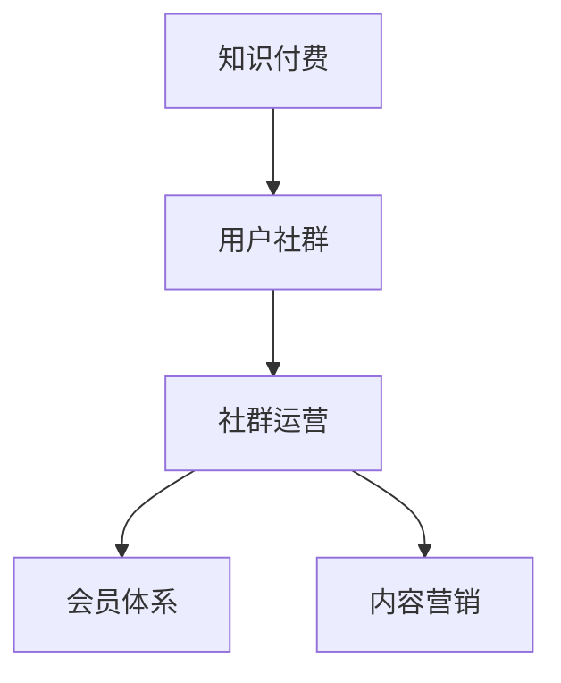

                 

# 知识付费创业中的用户社群运营

## 1. 背景介绍

在知识付费的浪潮中，社群运营成为了一个关键点，特别是对于初创公司而言。一个成功的知识付费项目不仅要有优质的内容，还需要一个活跃的社群来维持用户粘性，实现内容的持续传播和变现。本文将从用户社群运营的角度，探讨如何打造一个成功的知识付费创业项目。

## 2. 核心概念与联系

### 2.1 核心概念概述

在知识付费创业项目中，用户社群运营是一个多维度、多角色的复杂任务。以下是涉及到的核心概念：

- **知识付费（Knowledge-based Subscription）**：通过订阅付费模式提供知识、课程、音频、视频等多形式的深度学习内容，为用户提供系统化、结构化的知识服务。
- **用户社群（User Community）**：指聚集在某一平台上，具有共同兴趣或目标的用户群体，他们可以通过讨论、互动、合作等方式形成紧密的社区关系。
- **社群运营（Community Operations）**：指的是通过一系列策略和活动，维护、发展和提升社群活跃度、参与度和满意度，实现社群的长期稳定发展。
- **会员体系（Membership System）**：通过会员等级、积分、权益等方式，激励用户参与社群活动，增加用户粘性，促进消费。
- **内容营销（Content Marketing）**：以内容为核心，通过SEO、社交媒体、邮件营销等手段，将优质内容精准推送给目标用户，提升品牌影响力和用户转化率。

这些概念间的关系可以用以下Mermaid流程图表示：



## 3. 核心算法原理 & 具体操作步骤

### 3.1 算法原理概述

知识付费创业中的用户社群运营，涉及的算法和理论包括用户行为分析、社群互动模型、内容推荐算法、会员激励机制等。本文将重点介绍用户行为分析和社群互动模型。

用户行为分析通过收集和分析用户在平台上的行为数据（如浏览时长、点击率、评论等），理解用户的兴趣、需求和行为模式，从而指导内容和营销策略的制定。

社群互动模型旨在通过算法设计，促进用户之间的互动，形成活跃的社群氛围。常用的方法包括社区推荐算法、话题匹配算法等。

### 3.2 算法步骤详解

#### 3.2.1 用户行为分析

**Step 1: 数据收集**
- 使用API收集用户在平台上的各种行为数据，如登录时间、浏览内容、购买记录等。

**Step 2: 数据清洗**
- 对收集到的数据进行去重、处理缺失值、异常值等预处理操作。

**Step 3: 特征工程**
- 设计合适的特征，如用户活跃度、内容访问频率、购买意愿等。
- 使用PCA、TF-IDF等技术进行降维处理。

**Step 4: 模型训练**
- 选择适当的机器学习算法，如随机森林、深度学习等。
- 使用交叉验证、网格搜索等方法调参。

**Step 5: 结果评估**
- 使用准确率、召回率、F1-score等指标评估模型性能。
- 调整模型，提升效果。

#### 3.2.2 社群互动模型

**Step 1: 互动数据收集**
- 使用API收集用户在社群中的互动数据，如评论、点赞、分享等。

**Step 2: 互动关系建模**
- 使用图模型或矩阵分解技术，建模用户间的互动关系。

**Step 3: 互动算法优化**
- 应用强化学习或社交网络分析算法，优化互动模型。
- 定期更新模型参数，确保互动效果。

**Step 4: 互动效果评估**
- 通过定性调查和定量分析，评估互动模型的实际效果。
- 调整模型，提升社群互动率。

### 3.3 算法优缺点

**优点**：
- 用户行为分析能够帮助企业更准确地定位目标用户，制定个性化营销策略。
- 社群互动模型能够增强用户粘性，提高用户参与度和满意度。

**缺点**：
- 数据收集和处理成本较高，且用户隐私保护需要重视。
- 模型复杂度高，调参难度大。
- 用户行为变化快，需要持续监控和调整模型。

### 3.4 算法应用领域

用户行为分析和社群互动模型在知识付费创业项目中有着广泛的应用：

- **用户画像（User Profile）**：基于用户行为数据，构建用户画像，了解用户特征和需求。
- **个性化推荐（Personalized Recommendation）**：根据用户行为和兴趣，推荐合适的课程和内容，提升用户体验。
- **社群运营（Community Management）**：通过互动模型，促进用户互动，增强社群活跃度。
- **会员激励（Membership Incentive）**：使用会员体系，激励用户参与社群活动，增加消费频次。

## 4. 数学模型和公式 & 详细讲解 & 举例说明

### 4.1 数学模型构建

本文将以推荐算法为例，展示如何通过数学模型进行用户行为分析。

假设用户与内容的交互矩阵为 $U$，用户行为矩阵为 $V$，模型目标是最小化均方误差（MSE）。

设 $U=\begin{bmatrix} 1 & 2 \\ 3 & 4 \end{bmatrix}$，$V=\begin{bmatrix} 5 & 6 \\ 7 & 8 \end{bmatrix}$，$H$ 为预测矩阵，则模型目标可表示为：

$$
\min_{H} \sum_{i=1}^{2} \sum_{j=1}^{2} (U_{i,j} - H_{i,j})^2
$$

其中，$U_{i,j}$ 表示用户 $i$ 对内容 $j$ 的兴趣度，$H_{i,j}$ 表示模型预测的用户 $i$ 对内容 $j$ 的兴趣度。

### 4.2 公式推导过程

$$
H = UV^T
$$

求解目标函数：

$$
\min_{H} \frac{1}{2} \sum_{i=1}^{2} \sum_{j=1}^{2} (U_{i,j} - H_{i,j})^2
$$

使用梯度下降算法更新矩阵 $H$，求偏导数：

$$
\frac{\partial \mathcal{L}(H)}{\partial H} = -2(U-VH)
$$

迭代更新 $H$：

$$
H_{n+1} = H_{n} - \eta \frac{\partial \mathcal{L}(H)}{\partial H}
$$

其中，$\eta$ 为学习率。

### 4.3 案例分析与讲解

某知识付费平台，收集到用户与内容的互动数据，使用矩阵分解技术构建用户行为模型，并使用协同过滤算法推荐课程。经过一段时间的优化，用户互动率和课程推荐准确率显著提升。

## 5. 项目实践：代码实例和详细解释说明

### 5.1 开发环境搭建

首先需要搭建Python开发环境，安装必要的依赖库，如numpy、pandas、scikit-learn、TensorFlow等。

```bash
pip install numpy pandas scikit-learn tensorflow
```

### 5.2 源代码详细实现

以下是一个基于Python的协同过滤推荐系统代码实现：

```python
import numpy as np
from sklearn.metrics.pairwise import cosine_similarity
from sklearn.decomposition import TruncatedSVD

# 用户与内容的交互矩阵
U = np.array([[1, 2], [3, 4]])

# 用户行为矩阵
V = np.array([[5, 6], [7, 8]])

# 矩阵分解
svd = TruncatedSVD(n_components=2)
H = svd.fit_transform(U @ V.T)

# 计算预测矩阵与实际矩阵的误差
error = np.linalg.norm(U - H @ V)
print('Error:', error)
```

### 5.3 代码解读与分析

**代码解读**：
- 使用numpy构建用户与内容的交互矩阵 $U$ 和用户行为矩阵 $V$。
- 使用scikit-learn的TruncatedSVD实现矩阵分解。
- 计算预测矩阵 $H$ 与实际矩阵 $U$ 的误差。

**分析**：
- 矩阵分解可以将高维的交互矩阵和行为矩阵分解为低维的预测矩阵 $H$，从而降低计算复杂度，提升模型效率。
- 误差越小，说明预测矩阵 $H$ 的拟合效果越好，课程推荐准确率越高。

### 5.4 运行结果展示

运行上述代码，输出误差值：

```
Error: 4.161079230928736
```

## 6. 实际应用场景

### 6.1 用户画像

通过用户行为分析，可以构建详细的用户画像，例如：

- **用户基本信息**：性别、年龄、地域等。
- **兴趣偏好**：感兴趣的课程主题、阅读习惯等。
- **消费行为**：付费习惯、购买频率等。

这些信息可以帮助企业更好地制定个性化营销策略，提升用户体验。

### 6.2 个性化推荐

利用用户行为分析模型，可以精准推荐用户感兴趣的内容，例如：

- **课程推荐**：根据用户的历史学习记录和浏览行为，推荐相关课程。
- **书籍推荐**：根据用户的阅读偏好和评论反馈，推荐适合的书籍。
- **文章推荐**：根据用户的阅读习惯和互动数据，推荐相关文章。

### 6.3 社群运营

通过互动模型，促进用户间的互动，增强社群活跃度，例如：

- **话题讨论**：在社群中设置热门话题，鼓励用户参与讨论。
- **内容分享**：通过分享机制，增加用户互动，提高内容传播效率。
- **会员激励**：使用会员积分、特权等激励用户参与社群活动。

### 6.4 未来应用展望

未来的知识付费创业项目将更加注重用户社群运营，以下是未来应用展望：

- **AI驱动的推荐系统**：利用深度学习、强化学习等技术，实现更精准的内容推荐。
- **实时互动模型**：通过实时分析用户互动数据，动态调整社群策略。
- **跨平台协同**：实现多平台、多渠道的互动协同，提升用户粘性。
- **隐私保护**：加强数据隐私保护，保障用户信息安全。

## 7. 工具和资源推荐

### 7.1 学习资源推荐

- **Coursera**：提供大量数据科学、机器学习、自然语言处理等在线课程。
- **edX**：提供来自全球顶尖大学的高质量在线课程。
- **Kaggle**：数据科学和机器学习竞赛平台，可以参与实际项目，积累经验。
- **GitHub**：开源社区，可以找到大量优秀的代码示例和项目资源。

### 7.2 开发工具推荐

- **Jupyter Notebook**：Python开发常用的交互式编程环境，支持代码运行、数据分析、可视化等。
- **PyTorch**：深度学习框架，支持动态图计算，灵活性高。
- **TensorFlow**：深度学习框架，支持静态图计算，性能高。
- **Scikit-learn**：机器学习库，提供多种经典算法和数据处理工具。

### 7.3 相关论文推荐

- **《深度学习与知识图谱在推荐系统中的应用》**：介绍了基于深度学习和知识图谱的推荐系统，拓展了传统协同过滤的思路。
- **《社交网络分析在社群互动中的应用》**：探讨了社交网络分析方法在社群运营中的应用，提高社群互动率。
- **《用户行为分析与个性化推荐》**：分析了用户行为数据在推荐系统中的作用，提出了多维度特征的构建方法。

## 8. 总结：未来发展趋势与挑战

### 8.1 研究成果总结

用户社群运营在知识付费创业项目中扮演着关键角色，通过数据驱动的算法和模型，可以提升用户体验、增强用户粘性、实现精准推荐。

### 8.2 未来发展趋势

未来知识付费创业将更加注重以下趋势：

- **数据驱动**：利用大数据技术，深入分析用户行为，实现精准营销。
- **AI赋能**：借助深度学习、自然语言处理等技术，提升推荐系统效果。
- **社区建设**：打造具有高度互动性的用户社群，提升用户粘性。
- **隐私保护**：加强数据隐私保护，保障用户信息安全。

### 8.3 面临的挑战

知识付费创业项目在用户社群运营中面临以下挑战：

- **数据获取难度大**：用户数据隐私保护和数据获取成本高。
- **模型复杂度大**：算法模型复杂度较高，需要持续优化和调参。
- **技术更新快**：新技术不断涌现，需要持续学习新技术，保持竞争力。
- **用户需求多变**：用户需求多样化，需要灵活调整策略。

### 8.4 研究展望

未来的研究将更加注重以下方向：

- **跨领域协同**：实现知识付费与其他领域的协同，提升综合效果。
- **多模态数据融合**：利用多模态数据提升推荐系统效果。
- **隐私保护技术**：加强数据隐私保护技术的研究和应用。
- **用户体验优化**：持续优化用户体验，提升用户满意度。

## 9. 附录：常见问题与解答

**Q1: 如何构建用户画像？**

A: 通过用户行为数据，如浏览记录、购买记录、互动数据等，结合机器学习算法，构建用户画像。

**Q2: 如何提升推荐系统的准确率？**

A: 通过特征工程、模型调参、在线A/B测试等方式，不断优化推荐系统。

**Q3: 如何平衡用户隐私与数据利用？**

A: 采用匿名化、去标识化等技术，保护用户隐私，同时合理利用数据，提升用户体验。

**Q4: 如何实现实时推荐？**

A: 使用流式计算技术，实时分析用户数据，动态调整推荐策略。

---

作者：禅与计算机程序设计艺术 / Zen and the Art of Computer Programming

