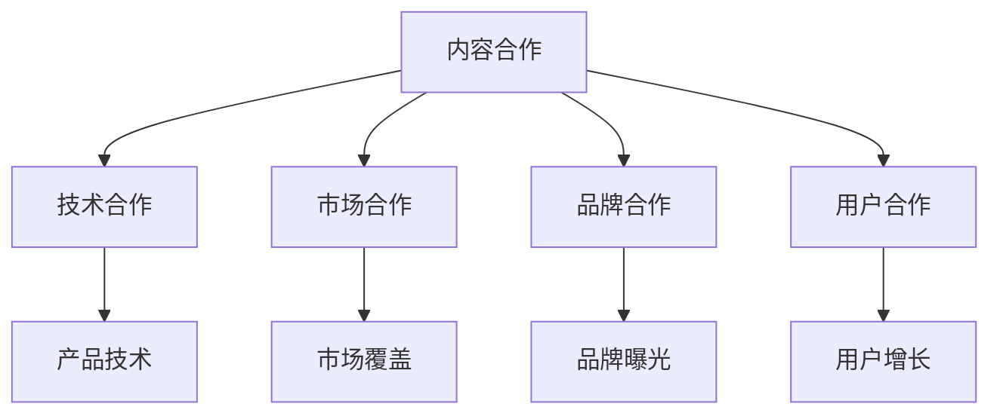
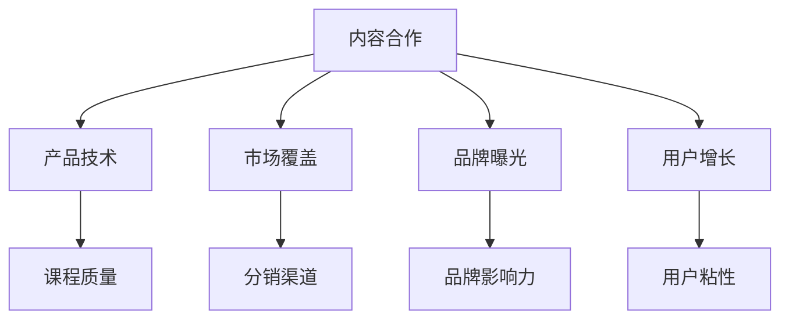

                 

# 知识付费创业中的跨界合作机会

## 1. 背景介绍

### 1.1 问题由来

随着互联网的迅猛发展和移动设备的普及，知识付费市场迎来了爆发式增长。从在线教育、技术培训到心理健康咨询，再到各类生活技能分享，知识付费成为满足人们终身学习需求的重要方式。然而，尽管知识付费市场潜力巨大，但当前仍面临诸多挑战，如内容质量参差不齐、用户体验有待提升、运营成本高企等。

### 1.2 问题核心关键点

为了应对上述挑战，知识付费创业企业需要寻找有效的跨界合作机会，充分利用外部资源和力量，提升产品和服务质量，降低运营成本，提高用户粘性和满意度。本文将探讨在知识付费创业中，常见的跨界合作机会，并给出具体的合作案例，以期为同行提供有价值的参考。

## 2. 核心概念与联系

### 2.1 核心概念概述

在知识付费创业中，常见的跨界合作机会包括：

- **内容合作**：与内容生产者、机构合作，提供优质课程和教材。
- **技术合作**：与技术供应商、平台合作，提升产品技术含量和用户体验。
- **市场合作**：与分销商、代理商合作，拓展市场覆盖面，提高销售效率。
- **品牌合作**：与知名品牌、自媒体合作，提高品牌曝光度和吸引力。
- **用户合作**：与教育机构、企业合作，扩大用户群体，实现业务协同。

这些概念之间的关系可以通过以下Mermaid流程图来展示：



### 2.2 核心概念原理和架构的 Mermaid 流程图(Mermaid 流程节点中不要有括号、逗号等特殊字符)



## 3. 核心算法原理 & 具体操作步骤

### 3.1 算法原理概述

在知识付费创业中，跨界合作的目标是通过整合各方资源，提升产品竞争力和市场影响力，实现双赢。具体来说，可以采用如下算法原理：

1. **内容合作算法**：选择内容质量高、受众广的生产者进行合作，共同开发和提供优质课程。
2. **技术合作算法**：引入先进的技术解决方案，如AI辅助的个性化推荐、大数据分析等，提升产品功能。
3. **市场合作算法**：与分销商、代理商建立紧密合作关系，通过他们的渠道和资源快速拓展市场。
4. **品牌合作算法**：利用知名品牌的影响力和流量，增加产品曝光度。
5. **用户合作算法**：与教育机构、企业等建立合作关系，扩大用户群体，提升品牌声誉。

### 3.2 算法步骤详解

#### 3.2.1 内容合作算法步骤

1. **需求分析**：明确自身产品目标用户群体和需求，寻找与之匹配的内容合作伙伴。
2. **评估筛选**：对潜在内容合作伙伴进行评估筛选，考虑其内容质量、用户反馈、市场影响力等因素。
3. **洽谈合作**：与选中内容合作伙伴洽谈合作细节，包括内容提供方式、版权归属、收益分配等。
4. **产品整合**：将合作内容与自身产品整合，确保用户体验一致，同时提升课程质量。

#### 3.2.2 技术合作算法步骤

1. **需求评估**：明确产品功能需求，确定需要引入的技术解决方案。
2. **技术调研**：对市场上可用的技术供应商、平台进行调研，选择最适合的合作对象。
3. **技术引入**：与技术合作方洽谈合作条款，引入所需技术。
4. **技术集成**：将引入的技术集成到产品中，优化用户体验，提升产品竞争力。

#### 3.2.3 市场合作算法步骤

1. **市场调研**：对目标市场进行调研，了解市场特点和竞争状况。
2. **选择合作伙伴**：根据市场调研结果，选择分销商、代理商等合作伙伴。
3. **合作洽谈**：与选中合作伙伴进行洽谈，确定合作模式、价格、促销政策等。
4. **市场拓展**：借助合作伙伴的渠道和资源，快速拓展市场，提高销售效率。

#### 3.2.4 品牌合作算法步骤

1. **品牌调研**：选择具有强大品牌影响力和市场号召力的合作伙伴。
2. **品牌联合营销**：与合作伙伴制定联合营销计划，如共同推广、联合举办活动等。
3. **品牌曝光提升**：利用合作伙伴的品牌资源，提升自身产品的曝光度和吸引力。

#### 3.2.5 用户合作算法步骤

1. **用户资源评估**：明确自身产品的目标用户群体，评估与教育机构、企业等潜在合作对象的用户资源。
2. **合作洽谈**：与选中用户合作方进行洽谈，确定合作内容、方式和收益分配。
3. **用户转化**：借助合作方的用户资源，吸引目标用户注册、购买和参与，提升用户粘性。

### 3.3 算法优缺点

#### 3.3.1 内容合作算法

**优点**：
- 提升课程质量，增加用户粘性。
- 快速获取优质内容，降低内容生产成本。

**缺点**：
- 需要协调多方利益，合作难度较大。
- 可能存在版权问题，处理不当会引发法律风险。

#### 3.3.2 技术合作算法

**优点**：
- 提升产品功能，优化用户体验。
- 引入先进技术，提高市场竞争力。

**缺点**：
- 技术供应商选择难度大，合作成本高。
- 技术集成复杂，可能影响产品稳定性。

#### 3.3.3 市场合作算法

**优点**：
- 快速拓展市场，提高销售效率。
- 借助合作伙伴资源，降低市场推广成本。

**缺点**：
- 合作伙伴选择难度大，合作风险高。
- 需要协调多方利益，合作复杂。

#### 3.3.4 品牌合作算法

**优点**：
- 提高品牌曝光度，增加用户信任度。
- 借助合作伙伴资源，提升市场影响力。

**缺点**：
- 品牌联合营销难度大，需要协调多方利益。
- 可能存在品牌冲突，处理不当会引发负面影响。

#### 3.3.5 用户合作算法

**优点**：
- 快速获取目标用户，提升用户粘性。
- 借助合作伙伴资源，降低获客成本。

**缺点**：
- 用户资源整合难度大，需要协调多方利益。
- 可能存在用户信息泄露风险，需严格管理。

## 4. 数学模型和公式 & 详细讲解 & 举例说明

### 4.1 数学模型构建

在知识付费创业中，跨界合作的评估和选择可以通过数学模型进行量化分析。以下是常见的数学模型：

1. **内容合作评估模型**：
   $$
   \text{评估指标} = \frac{\text{课程质量评分} + \text{用户反馈评分} + \text{市场影响力评分}}{3}
   $$

2. **技术合作评估模型**：
   $$
   \text{评估指标} = \text{技术成熟度} + \text{集成难度} + \text{成本效益}
   $$

3. **市场合作评估模型**：
   $$
   \text{评估指标} = \frac{\text{市场规模} + \text{分销渠道数量} + \text{合作成本}}{3}
   $$

4. **品牌合作评估模型**：
   $$
   \text{评估指标} = \text{品牌影响力} + \text{市场覆盖率} + \text{联合营销成本}
   $$

5. **用户合作评估模型**：
   $$
   \text{评估指标} = \frac{\text{目标用户规模} + \text{合作资源数量} + \text{用户转化率}}{3}
   $$

### 4.2 公式推导过程

以内容合作评估模型为例，推导其公式：

1. **课程质量评分**：可以通过用户评分、专家评估等方式获得。
2. **用户反馈评分**：可以通过用户评论、评分等获得。
3. **市场影响力评分**：可以通过合作伙伴的市场份额、品牌知名度等方式获得。

因此，内容合作的综合评估指标为：
$$
\text{评估指标} = \frac{\text{课程质量评分} + \text{用户反馈评分} + \text{市场影响力评分}}{3}
$$

### 4.3 案例分析与讲解

**案例1：与知名大学合作**

某知识付费创业企业与某知名大学合作，共同开发职场技能培训课程。该大学提供高质量的教学内容和丰富的案例分析，企业提供平台技术支持，双方共同推广课程，最终实现了互惠共赢。

**案例2：引入先进技术平台**

某知识付费创业企业引入先进的AI推荐系统，通过分析用户行为和偏好，实现个性化课程推荐。该技术平台提供成熟的算法和数据支持，显著提升了用户体验，企业也通过技术合作提高了产品竞争力。

**案例3：与分销商合作**

某知识付费创业企业与多家知名分销商合作，利用他们的渠道和资源快速拓展市场。分销商负责销售和推广，企业提供优质课程和平台支持，双方通过利益分成机制实现共赢。

**案例4：联合品牌推广**

某知识付费创业企业与知名品牌合作，共同推出品牌联合课程。品牌利用其影响力和号召力，吸引了大量用户注册，企业通过联合推广提升了品牌曝光度，用户通过品牌认证提升了信任度。

**案例5：与教育机构合作**

某知识付费创业企业与多所教育机构合作，借助其学生资源和课程体系，快速获取大量用户。教育机构提供优质课程和教师资源，企业提供平台技术支持，双方通过合作实现了用户快速增长和平台流量提升。

## 5. 项目实践：代码实例和详细解释说明

### 5.1 开发环境搭建

在知识付费创业中，跨界合作涉及多个第三方系统，需要搭建一个开放、灵活、高效的平台环境。以下是开发环境搭建的步骤：

1. **选择合适的云服务提供商**：如AWS、阿里云、腾讯云等，根据自身需求选择适合的云资源。
2. **搭建数据库系统**：如MySQL、PostgreSQL等，用于存储用户数据、课程信息等。
3. **搭建Web服务系统**：如Django、Flask等，提供平台功能，如课程浏览、购买、学习等。
4. **引入第三方技术和服务**：如第三方支付平台、视频流媒体服务、AI推荐系统等。

### 5.2 源代码详细实现

以与技术供应商合作的AI推荐系统为例，以下是实现步骤：

1. **引入第三方技术API**：
   ```python
   from third_party.api import RecommendationSystemAPI
   ```

2. **创建推荐系统实例**：
   ```python
   recommendation_system = RecommendationSystemAPI(api_key='YOUR_API_KEY')
   ```

3. **获取用户推荐**：
   ```python
   user_id = 'USER_ID'
   courses = recommendation_system.get_recommendations(user_id=user_id, course_count=5)
   ```

4. **整合推荐到平台**：
   ```python
   from app.models import Course
   courses = [Course.objects.get(id=course_id) for course_id in courses]
   ```

5. **展示推荐给用户**：
   ```python
   def recommendations(request):
       user_id = request.user.id
       courses = recommendation_system.get_recommendations(user_id=user_id, course_count=5)
       return render(request, 'courses.html', {'courses': courses})
   ```

### 5.3 代码解读与分析

在实际开发中，跨界合作涉及多个第三方系统和API，需要特别注意接口调用和数据处理的安全性、可靠性和效率。以下是关键代码的解读与分析：

1. **引入第三方技术API**：
   - 代码使用第三方技术API，需要确保API的安全性和可靠性，避免数据泄露和API滥用。

2. **创建推荐系统实例**：
   - 代码创建推荐系统实例，需要设置合适的API密钥和超时时间，避免API调用超时和错误。

3. **获取用户推荐**：
   - 代码使用API获取用户推荐，需要处理API调用失败和数据解析错误等情况，确保推荐结果的准确性。

4. **整合推荐到平台**：
   - 代码整合推荐到平台，需要考虑数据一致性和更新频率，确保推荐结果的时效性。

5. **展示推荐给用户**：
   - 代码展示推荐给用户，需要考虑用户体验和系统响应时间，确保推荐展示的流畅性和高效性。

### 5.4 运行结果展示

以下是一个简化的示例，展示API调用和数据处理的结果：

**示例1：推荐结果展示**

用户ID：123456
推荐课程：
1. 课程A
2. 课程B
3. 课程C
4. 课程D
5. 课程E

**示例2：整合推荐到平台**

在课程浏览页面，展示推荐课程列表，供用户选择。

**示例3：用户反馈**

用户在课程页面留下评价和反馈，平台根据评价调整推荐算法，优化推荐结果。

## 6. 实际应用场景

### 6.1 智能教育

在智能教育领域，知识付费创业企业可以与学校、培训机构、教师等合作，提供优质课程和教学资源。借助AI技术和数据分析，个性化推荐课程，提升教育质量和效果。

**场景1：AI辅助教学**

某知识付费创业企业与某小学合作，开发AI辅助数学教学系统。该系统通过分析学生作业和课堂表现，自动生成个性化学习计划，帮助教师提升教学效果。

**场景2：数据分析**

某知识付费创业企业与某大学合作，利用大数据分析学生学习行为和成绩，提供课程优化建议，提升课程质量和学生满意度。

### 6.2 企业培训

在企业培训领域，知识付费创业企业可以与企业HR部门、培训公司等合作，提供职业培训、技能提升课程。借助跨界合作，提升课程质量和培训效果，降低培训成本。

**场景1：定制化培训**

某知识付费创业企业与某大厂合作，开发定制化职业培训课程。该课程涵盖编程、管理、技术等多个领域，满足不同岗位的需求。

**场景2：实时反馈**

某知识付费创业企业与某咨询公司合作，开发实时反馈平台。平台通过数据分析，实时反馈课程效果，帮助企业调整培训方案，提升培训效果。

### 6.3 在线学习

在在线学习领域，知识付费创业企业可以与内容创作者、技术供应商等合作，提供优质课程和平台功能。借助跨界合作，提升平台的用户体验和竞争力。

**场景1：内容合作**

某知识付费创业企业与知名作者合作，开发高质量的在线课程。课程涵盖文学、历史、心理学等多个领域，满足用户不同需求。

**场景2：技术优化**

某知识付费创业企业与技术供应商合作，开发流畅、高效的学习平台。平台提供个性化推荐、互动讨论等功能，提升用户体验。

## 7. 工具和资源推荐

### 7.1 学习资源推荐

为了帮助开发者系统掌握知识付费创业中的跨界合作原理和实践技巧，这里推荐一些优质的学习资源：

1. **《跨界合作的艺术》系列博文**：由知识付费创业领域专家撰写，深入浅出地介绍了内容合作、技术合作、市场合作等跨界合作的原理和实践技巧。

2. **CS221《机器学习》课程**：斯坦福大学开设的机器学习经典课程，有Lecture视频和配套作业，帮助你理解和掌握机器学习的基本概念和算法。

3. **《知识付费创业指南》书籍**：详细介绍了知识付费创业的商业模式、运营策略、技术实现等内容，涵盖内容合作、技术合作、市场合作等多个方面。

4. **Udacity《商业分析》课程**：帮助你理解数据驱动的商业决策过程，掌握数据分析和商业分析的基本技能。

5. **Kaggle竞赛平台**：提供丰富的数据集和竞赛挑战，帮助你提升数据处理和分析能力，为知识付费创业提供数据支持。

通过对这些资源的学习实践，相信你一定能够系统掌握知识付费创业中的跨界合作技术，提升自身企业的竞争力和市场影响力。

### 7.2 开发工具推荐

高效的开发离不开优秀的工具支持。以下是几款用于知识付费创业中跨界合作开发的常用工具：

1. **Jupyter Notebook**：用于数据探索和分析，提供可视化和交互式计算环境。

2. **GitLab**：用于版本控制和协作开发，提供代码托管、CI/CD等功能。

3. **Django**：用于Web应用开发，提供高效的数据管理和用户认证等功能。

4. **Flask**：用于Web应用开发，灵活轻量，易于快速搭建平台。

5. **AWS SageMaker**：提供强大的云机器学习服务，支持模型训练和部署，提供丰富的API和工具支持。

6. **TensorFlow**：用于机器学习和深度学习开发，提供丰富的模型库和工具支持。

合理利用这些工具，可以显著提升知识付费创业中的跨界合作开发效率，加速创新迭代的步伐。

### 7.3 相关论文推荐

知识付费创业中的跨界合作技术不断发展，以下是几篇奠基性的相关论文，推荐阅读：

1. **《跨界合作中的数据整合与分析》**：介绍了跨界合作中数据整合与分析的基本方法和技术。

2. **《知识付费创业的商业模式与运营策略》**：详细介绍了知识付费创业的商业模式和运营策略，探讨了内容合作、技术合作等多个方向。

3. **《智能教育中的数据驱动学习分析》**：介绍了智能教育中的数据驱动学习分析和个性化推荐的基本方法和技术。

4. **《企业培训中的在线学习平台设计与实现》**：介绍了企业培训中的在线学习平台设计和实现的基本方法和技术。

5. **《知识付费创业中的市场拓展策略》**：介绍了知识付费创业中的市场拓展策略，探讨了市场合作、品牌合作等多个方向。

这些论文代表了大语言模型微调技术的发展脉络。通过学习这些前沿成果，可以帮助研究者把握学科前进方向，激发更多的创新灵感。

## 8. 总结：未来发展趋势与挑战

### 8.1 研究成果总结

本文对知识付费创业中的跨界合作机会进行了全面系统的介绍。首先阐述了知识付费创业中的常见跨界合作机会，包括内容合作、技术合作、市场合作、品牌合作、用户合作等。其次，从原理到实践，详细讲解了跨界合作的数学模型和具体操作步骤，给出了详细的代码实例和解释分析。同时，本文还探讨了跨界合作在智能教育、企业培训、在线学习等多个行业领域的应用前景，展示了其广阔的发展潜力。最后，本文精选了跨界合作相关的学习资源、开发工具和论文推荐，力求为读者提供全方位的技术指引。

通过本文的系统梳理，可以看到，跨界合作在知识付费创业中发挥了重要作用，通过整合多方资源，提升产品竞争力和市场影响力，实现双赢。

### 8.2 未来发展趋势

展望未来，知识付费创业中的跨界合作将呈现以下几个发展趋势：

1. **智能化趋势**：借助AI和大数据技术，实现课程推荐、学习分析、智能答疑等智能化功能，提升用户体验和平台效果。

2. **个性化趋势**：利用个性化推荐算法，提供个性化课程推荐和定制化学习计划，满足用户多样化需求。

3. **平台化趋势**：构建知识付费创业平台，整合内容、技术、市场等多种资源，实现一站式的知识服务。

4. **社区化趋势**：建立用户社区和交流平台，提升用户粘性和互动性，促进知识分享和传播。

5. **国际化趋势**：拓展国际市场，与全球知名的教育机构和品牌合作，提升品牌影响力和用户覆盖面。

以上趋势凸显了知识付费创业中跨界合作的发展方向。这些方向的探索发展，必将进一步提升知识付费创业的竞争力和市场影响力，为行业带来新的突破。

### 8.3 面临的挑战

尽管跨界合作在知识付费创业中发挥了重要作用，但在迈向更加智能化、个性化、平台化的过程中，它仍面临诸多挑战：

1. **合作协调难度**：多方合作的协调和利益分配是一个复杂问题，需要花费大量时间和精力。

2. **数据安全和隐私**：跨界合作涉及大量用户数据和隐私信息，需要严格管理，避免数据泄露和滥用。

3. **技术适配性**：不同的技术平台和API需要兼容和适配，技术整合复杂，可能导致系统不稳定性。

4. **市场竞争激烈**：知识付费市场竞争激烈，需要不断创新和优化，才能保持市场领先地位。

5. **用户体验差异**：跨界合作需要考虑用户体验的一致性和连贯性，避免不同平台间的用户粘性下降。

6. **法律和政策风险**：跨界合作涉及多方利益，需要遵守法律法规，避免法律风险和政策限制。

这些挑战需要跨界合作双方共同面对和解决，才能实现共赢。

### 8.4 研究展望

面向未来，跨界合作技术的发展方向包括：

1. **技术创新**：引入更先进的技术，如区块链、智能合约、分布式计算等，提升合作效率和系统安全性。

2. **数据融合**：实现跨平台、跨领域的用户数据融合和分析，提供更全面、准确的用户画像和行为分析。

3. **用户体验优化**：通过个性化推荐、智能答疑等技术，提升用户体验，增加用户粘性和满意度。

4. **市场拓展**：利用社交媒体、直播平台等新兴渠道，拓展市场覆盖面，提升品牌影响力和用户规模。

5. **国际合作**：拓展国际市场，与全球知名的教育机构和品牌合作，提升品牌影响力和用户覆盖面。

这些研究方向的探索发展，必将引领知识付费创业中的跨界合作技术迈向更高的台阶，为知识付费创业带来更多的创新和突破。

## 9. 附录：常见问题与解答

**Q1：如何选择合适的跨界合作对象？**

A: 选择合适的跨界合作对象需要考虑多个因素，如合作伙伴的品牌影响力、市场规模、技术能力、用户资源等。可以通过评估指标和模型，综合评估各个合作对象，选择最适合的合作伙伴。

**Q2：跨界合作中如何管理用户数据？**

A: 跨界合作中需要严格管理用户数据，避免数据泄露和滥用。可以采用数据加密、访问控制、数据脱敏等技术，确保用户数据的安全性和隐私性。

**Q3：跨界合作中如何协调多方利益？**

A: 跨界合作中需要建立多方的利益分配机制，确保各方利益均衡。可以通过签订合作协议、利益分成机制等方式，明确各方的责任和权利。

**Q4：跨界合作中如何实现技术整合？**

A: 跨界合作中需要解决技术整合的复杂问题，可以通过API集成、微服务架构等方式，实现不同技术平台的兼容和适配。

**Q5：跨界合作中如何提升用户体验？**

A: 跨界合作中需要提升用户体验，可以通过个性化推荐、智能答疑等技术，实现课程和服务的智能化，提升用户粘性和满意度。

作者：禅与计算机程序设计艺术 / Zen and the Art of Computer Programming

