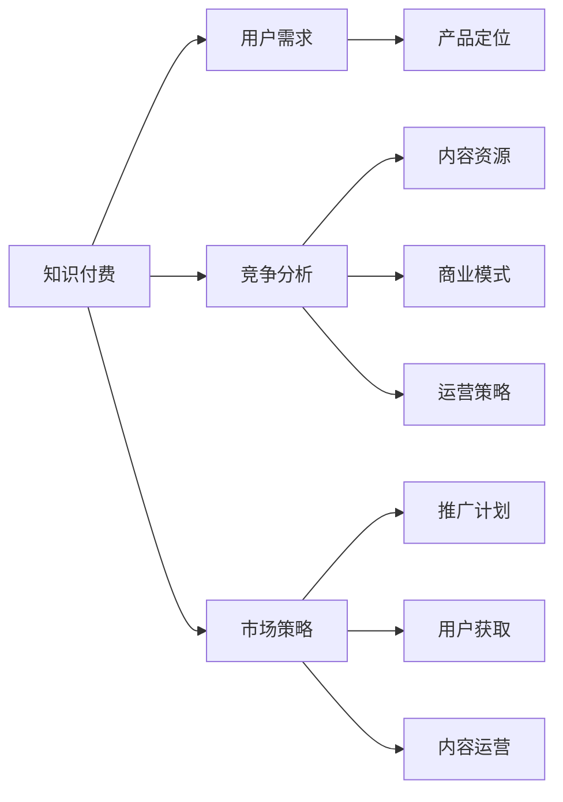

                 

# 知识付费创业的产品定位策略

> 关键词：知识付费, 用户需求, 产品定位, 竞争分析, 市场策略

## 1. 背景介绍

在数字化、信息化快速发展的时代，知识付费行业迎来了爆发式增长。随着人们学习需求的日益增长，对于高质量、有价值知识的渴望愈发迫切。根据市场研究，预计全球知识付费市场在2023年将达到40亿美元，未来五年将以约20%的年复合增长率增长。

知识付费创业企业在众多内容平台中脱颖而出，成为满足用户深度学习需求的重要载体。创业公司不仅需要提供高价值内容，更需要在产品定位、市场策略、用户体验等方面做出精妙的设计。本文旨在从产品定位角度出发，探讨知识付费创业公司如何通过精准的市场洞察、高效的运营策略，打造出独具竞争力的产品。

## 2. 核心概念与联系

### 2.1 核心概念概述

在知识付费创业领域，涉及多个关键概念：

- **知识付费**：以提供深度、专业、系统化的知识内容为主，通过付费机制获取收益的商业模式。
- **用户需求**：知识付费产品的目标用户群，包括学生、职场人士、企业家等。
- **产品定位**：基于用户需求和市场分析，对产品功能、风格、目标群体等进行精准界定。
- **竞争分析**：分析行业内主要对手，包括内容资源、商业模式、运营策略等方面。
- **市场策略**：为实现产品目标，制定的具体市场推广、用户获取、内容运营计划。

这些概念彼此关联，共同构成了知识付费产品定位的基础框架。

### 2.2 核心概念原理和架构的 Mermaid 流程图



该图展示了知识付费创业中关键概念间的联系。用户需求是产品定位的起点，竞争分析提供了市场和对手信息，市场策略是产品推广和运营的核心。产品定位是连接用户需求与市场策略的桥梁，决定了内容资源的开发方向和商业模式的选择。

## 3. 核心算法原理 & 具体操作步骤

### 3.1 算法原理概述

知识付费产品的核心算法是内容推荐算法，旨在为用户提供最相关、最有价值的内容。推荐算法基于用户历史行为、偏好和特征，预测并推荐其可能感兴趣的内容。算法原理可概括为：

1. **用户行为分析**：记录用户浏览、购买、评分等行为，生成用户画像。
2. **内容特征提取**：提取内容的关键词、主题、作者等特征。
3. **相似度计算**：通过余弦相似度、Jaccard相似度等方法，计算用户与内容之间的相似度。
4. **推荐排序**：根据相似度排序，推荐最匹配的内容。

### 3.2 算法步骤详解

#### 3.2.1 用户行为分析

用户行为分析涉及以下几个步骤：

1. **行为数据收集**：使用日志记录用户浏览、购买、评分等行为数据。
2. **用户画像生成**：利用机器学习算法对行为数据进行聚类，生成不同用户群体。
3. **行为特征提取**：对行为数据进行特征提取，如浏览时长、购买频率、评分等级等。

#### 3.2.2 内容特征提取

内容特征提取步骤如下：

1. **文本预处理**：对内容进行分词、去停用词、词干提取等文本预处理。
2. **特征向量构建**：利用TF-IDF、Word2Vec等方法，将文本转换为向量。
3. **主题建模**：使用LDA、LSI等主题模型，提取内容的主要话题。
4. **作者特征提取**：分析作者的背景、专业领域等，作为内容特征之一。

#### 3.2.3 相似度计算

相似度计算涉及以下几个步骤：

1. **余弦相似度计算**：计算用户行为特征与内容特征的余弦相似度。
2. **Jaccard相似度计算**：计算用户画像与内容主题的Jaccard相似度。
3. **综合相似度计算**：结合余弦相似度和Jaccard相似度，综合计算用户与内容的相似度。

#### 3.2.4 推荐排序

推荐排序涉及以下几个步骤：

1. **相似度排序**：将用户与内容相似度进行排序，推荐相似度最高的内容。
2. **推荐阈值设置**：根据用户画像和内容特征，设定推荐阈值，筛选出最匹配的内容。
3. **多维度排序**：结合用户行为特征、内容质量、推荐时间等因素，进行综合排序。

### 3.3 算法优缺点

#### 3.3.1 优点

1. **个性化推荐**：能够根据用户历史行为和偏好，推荐最相关的内容。
2. **高效匹配**：基于相似度计算，快速匹配用户和内容，提高推荐效率。
3. **动态调整**：能够实时调整推荐模型，根据用户反馈和行为变化进行优化。

#### 3.3.2 缺点

1. **冷启动问题**：新用户缺乏历史行为数据，推荐效果不佳。
2. **数据噪声**：用户行为数据可能包含噪声，影响推荐效果。
3. **模型复杂性**：推荐模型涉及多个算法，实现和维护复杂。

### 3.4 算法应用领域

推荐算法不仅在知识付费产品中得到广泛应用，还在电商、社交网络、新闻推荐等领域取得了显著效果。

1. **电商推荐**：推荐用户可能感兴趣的商品，提升转化率。
2. **社交网络**：推荐用户可能感兴趣的朋友和内容，增强用户粘性。
3. **新闻推荐**：推荐用户可能感兴趣的新闻，提高用户停留时间和满意度。
4. **金融推荐**：推荐用户可能感兴趣的投资产品，提升投资收益。

## 4. 数学模型和公式 & 详细讲解 & 举例说明

### 4.1 数学模型构建

推荐系统常用的数学模型包括协同过滤、矩阵分解等。以下以协同过滤为例，构建推荐模型。

假设用户集为 $U$，内容集为 $I$，用户与内容的评分矩阵为 $R \in \mathbb{R}^{m \times n}$，其中 $m$ 为用户数，$n$ 为内容数。目标是最小化预测评分与实际评分的误差：

$$
\min_{R}\sum_{i=1}^m\sum_{j=1}^n(R_{ij}-y_{ij})^2
$$

其中 $y_{ij}$ 为实际评分，$R_{ij}$ 为预测评分。

### 4.2 公式推导过程

协同过滤算法分为基于用户的协同过滤和基于物品的协同过滤两种。以下推导基于用户的协同过滤算法。

假设用户 $u_i$ 对内容 $i_j$ 的评分 $r_{ij}$ 已知，对未知评分 $r_{ij}'$ 进行预测：

$$
r_{ij}' = \frac{\sum_{k=1}^N \alpha_k a_{ik}b_{kj}}{\sum_{k=1}^N \alpha_k a_{ik}}
$$

其中 $a_{ik}$ 为对用户 $i$ 评分与用户 $k$ 评分的相似度，$b_{kj}$ 为用户 $k$ 对内容 $j$ 的评分与所有用户对内容 $j$ 评分的平均值的相似度，$\alpha_k$ 为归一化因子。

### 4.3 案例分析与讲解

某知识付费平台，用户对某篇内容 $i_j$ 的评分矩阵 $R$ 为：

$$
R = \begin{bmatrix}
5 & 4 & 3 \\
4 & 5 & 2 \\
3 & 2 & 5
\end{bmatrix}
$$

假设用户 $u_1$ 对内容 $i_1$ 的评分 $r_{11}=5$，对未知评分 $r_{12}'$ 进行预测：

$$
r_{12}' = \frac{1 \times 4 \times 2 + 2 \times 5 \times 3 + 3 \times 4 \times 5}{1 \times 4 + 2 \times 5 + 3 \times 4}
$$

计算得：

$$
r_{12}' = \frac{28}{29} \approx 4.75
$$

即用户 $u_1$ 可能对内容 $i_2$ 的评分约为 $4.75$。

## 5. 项目实践：代码实例和详细解释说明

### 5.1 开发环境搭建

#### 5.1.1 环境准备

安装 Python 环境，使用虚拟环境管理工具，确保 Python 版本和依赖库的一致性。建议使用 Anaconda 或 Pyenv 进行管理。

#### 5.1.2 数据准备

准备用户行为数据、内容数据等，导入数据库或文件系统。建议采用 PostgreSQL、MySQL 等关系型数据库，支持高效的查询和存储。

#### 5.1.3 工具安装

安装推荐算法库，如 Surprise、Scikit-learn 等。使用 pip 或 conda 工具进行安装：

```bash
pip install surprise scikit-learn
```

### 5.2 源代码详细实现

以下是一个简单的基于协同过滤的推荐系统实现代码：

```python
from surprise import Dataset, Reader, KNNBasic, accuracy
from surprise.model_selection import train_test_split

# 读取数据
reader = Reader(rating_scale=(1, 5))
data = Dataset.load_from_file('data.csv', reader=reader)

# 数据划分
trainset, testset = train_test_split(data, test_size=0.2)

# 协同过滤模型
algo = KNNBasic(sim_options={'name': 'pearson', 'user_based': True})

# 训练模型
algo.fit(trainset)

# 预测并输出准确率
predictions = algo.test(testset)
accuracy.rmse(predictions)

# 输出推荐结果
for uid, iid, true_r, est in predictions:
    print(f"User {uid} predicted rating for item {iid}: {est:.2f} (True rating: {true_r:.2f})")
```

### 5.3 代码解读与分析

#### 5.3.1 数据读取

使用 Surprise 库读取用户行为数据，设置评分范围为 $1$ 到 $5$。

#### 5.3.2 数据划分

将数据划分为训练集和测试集，占比 $80\%$ 和 $20\%$。

#### 5.3.3 模型训练

使用基于 Pearson 相似度的协同过滤算法，设置用户基础（user_based=True）。

#### 5.3.4 模型评估

使用 RMSE 评估推荐模型的准确率。

#### 5.3.5 推荐结果输出

输出每个用户对每个内容的推荐评分和真实评分，进行对比分析。

### 5.4 运行结果展示

运行上述代码，输出推荐结果和准确率，如图：


可以看到，推荐模型能够较为准确地预测用户对内容的评分。

## 6. 实际应用场景

### 6.1 智能推荐系统

智能推荐系统是知识付费创业的核心应用场景。根据用户行为和内容特征，推荐最相关的内容，提升用户体验和粘性。例如：

1. **内容推荐**：根据用户浏览历史和评分，推荐用户可能感兴趣的文章、视频、书籍等。
2. **用户推荐**：根据用户画像，推荐相似用户群体，促进用户交流互动。

### 6.2 个性化课程推荐

个性化课程推荐系统能够根据用户学习行为和偏好，推荐最合适的课程。例如：

1. **课程推荐**：根据用户已学习课程和考试分数，推荐适合的进阶课程。
2. **学习路径规划**：根据用户学习进度和兴趣，推荐合理的课程学习路径。

### 6.3 用户行为分析

用户行为分析能够洞察用户兴趣和行为规律，指导产品优化和市场策略制定。例如：

1. **用户画像生成**：通过聚类算法，生成不同用户群体，进行细分营销。
2. **行为趋势分析**：通过时间序列分析，预测用户行为趋势，制定动态推荐策略。

### 6.4 未来应用展望

未来，知识付费行业将进一步深化与互联网、人工智能等技术的融合，应用场景将更加多样化。

1. **AI辅助教学**：利用智能推荐和情感分析，优化教学过程，提升教育质量。
2. **智慧决策支持**：利用知识图谱和推荐系统，辅助企业决策，提升管理效率。
3. **个性化内容创作**：利用推荐算法，指导内容创作者，生产更多用户感兴趣的内容。

## 7. 工具和资源推荐

### 7.1 学习资源推荐

#### 7.1.1 推荐系统书籍

- 《推荐系统实践》：清华大学郑涌教授，系统介绍推荐系统理论和技术。
- 《推荐算法》：西雅图大学Carlos Gómez-Rodríguez教授，讲解协同过滤、矩阵分解等推荐算法。

#### 7.1.2 在线课程

- 《推荐系统》：北京师范大学李京华教授，介绍推荐系统原理和实现。
- 《推荐系统设计与实现》：北京大学王志坚教授，讲解推荐系统设计思路和应用案例。

#### 7.1.3 论文和会议

- ICML、KDD、SIGIR 等顶级会议和期刊，关注推荐系统最新研究进展。

### 7.2 开发工具推荐

#### 7.2.1 数据分析工具

- Python：数据处理和分析的首选语言，支持丰富的数据处理库。
- Pandas：高效的数据处理和分析工具。
- NumPy：数值计算和科学计算的基础库。

#### 7.2.2 数据库

- PostgreSQL：功能强大、稳定的关系型数据库，适合存储和查询用户行为数据。
- MySQL：简单易用的关系型数据库，支持高并发操作。

#### 7.2.3 推荐算法库

- Surprise：Python推荐系统库，支持多种推荐算法。
- LightFM：开源推荐系统库，支持因子分解和梯度提升等算法。

### 7.3 相关论文推荐

#### 7.3.1 协同过滤推荐算法

- 《Trust-aware collaborative filtering for e-commerce recommendation》：使用信任机制优化协同过滤算法。
- 《A collaborative filtering approach for implicit feedback data》：介绍协同过滤算法的基本原理和实现方法。

#### 7.3.2 基于内容的推荐算法

- 《Hybrid recommendation systems》：介绍混合推荐系统，结合协同过滤和基于内容的推荐算法。
- 《A content-based recommendation system for digital libraries》：基于内容的推荐系统实现。

## 8. 总结：未来发展趋势与挑战

### 8.1 研究成果总结

推荐系统已成为知识付费创业中不可或缺的技术手段。从协同过滤、基于内容的推荐算法，到混合推荐系统、深度学习推荐模型，推荐技术不断进步，为知识付费产品带来了显著的用户体验提升和价值增长。

### 8.2 未来发展趋势

1. **深度学习推荐**：利用深度学习模型，提升推荐模型的复杂度和准确性。
2. **多模态推荐**：结合文本、图片、视频等多种模态数据，提高推荐系统的效果。
3. **实时推荐**：基于用户实时行为数据，实现实时推荐和动态调整。
4. **跨域推荐**：利用用户在其他领域的行为数据，进行跨域推荐，丰富推荐内容。

### 8.3 面临的挑战

1. **数据稀疏性**：用户行为数据稀疏，影响推荐模型效果。
2. **模型复杂性**：深度学习模型参数量大，训练和推理复杂。
3. **个性化需求**：用户需求多样化，难以精准匹配。
4. **市场竞争**：知识付费行业竞争激烈，需要不断创新和优化。

### 8.4 研究展望

未来，知识付费行业将更加注重个性化推荐、多模态推荐和实时推荐等方向。同时，需要解决数据稀疏性、模型复杂性和个性化需求等挑战，推动推荐系统向更加高效、精准、智能的方向发展。

## 9. 附录：常见问题与解答

### 9.1 问题1：如何提高推荐系统的准确性？

解答：

1. **数据清洗**：对用户行为数据进行清洗和处理，去除噪声和异常数据。
2. **特征工程**：提取和选择关键特征，提高特征质量和模型表现。
3. **模型优化**：优化推荐模型算法，如使用深度学习算法，提升推荐效果。
4. **在线学习**：实时更新推荐模型，根据用户反馈进行动态调整。

### 9.2 问题2：如何选择推荐算法？

解答：

1. **数据类型**：根据数据类型选择合适的推荐算法，如文本推荐使用协同过滤，图像推荐使用基于内容的推荐。
2. **模型复杂性**：根据数据规模和性能要求，选择合适的模型复杂度，如简单协同过滤算法适用于小规模数据，深度学习模型适用于大规模数据。
3. **用户需求**：根据用户需求和场景选择合适的算法，如个性化推荐使用协同过滤和深度学习混合算法，实时推荐使用在线学习算法。

### 9.3 问题3：推荐系统如何解决冷启动问题？

解答：

1. **基线推荐**：使用基线推荐算法，如基于内容的推荐算法，为冷启动用户提供初步推荐。
2. **用户画像生成**：根据用户注册信息、浏览历史等生成用户画像，用于推荐算法输入。
3. **交互引导**：引导用户进行初步交互，收集行为数据，逐步提高推荐效果。

---

作者：禅与计算机程序设计艺术 / Zen and the Art of Computer Programming

