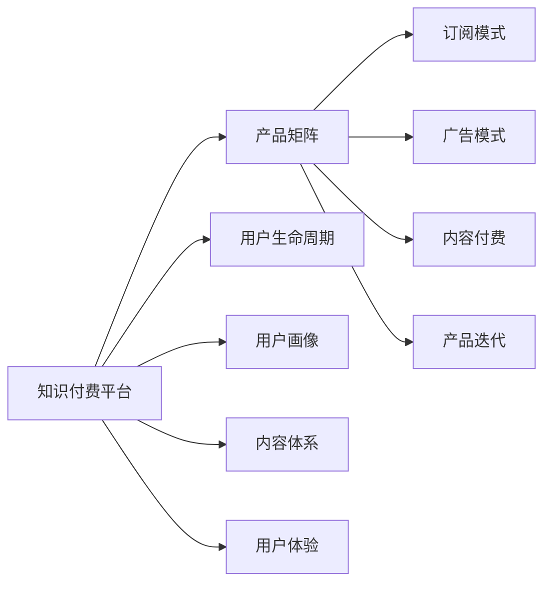

                 

# 知识付费创业的产品矩阵构建

> 关键词：知识付费, 产品矩阵, 用户生命周期, 用户画像, 订阅模式, 广告模式, 内容付费, 产品迭代

## 1. 背景介绍

### 1.1 问题由来

随着互联网技术的发展和知识经济时代的到来，知识付费成为了一个热门话题。传统教育模式难以满足个性化、高效率的需求，人们开始探索新的学习方式，希望通过付费获取更有价值、更精准的知识。在这样的背景下，知识付费平台应运而生，成为连接知识和用户的重要桥梁。然而，由于知识付费领域竞争激烈、市场多变，众多创业公司在探索自己的产品定位时面临着许多困惑：如何精准定位目标用户群体，如何打造有效的内容体系，如何提升用户留存和转化率，如何实现可持续的商业模式。这些问题都亟需一个全面而系统的解决方案。

## 2. 核心概念与联系

### 2.1 核心概念概述

1. **知识付费**：用户为获取特定知识、技能或信息支付费用的行为。知识付费的本质是知识传播的付费化，而知识付费平台则是知识生产和消费的中介。

2. **产品矩阵**：一种策略性产品组合，包含多个相关产品，旨在满足不同用户群体的需求，提升整体用户满意度和企业收益。

3. **用户生命周期**：用户从首次接触产品到最终停止使用的全过程，包括意识期、考虑期、决定期、体验期和忠诚期。

4. **用户画像**：基于用户属性、行为等数据构建的用户特征模型，用于指导产品设计和用户运营。

5. **订阅模式**：用户定期支付费用获取内容和服务的一种模式。

6. **广告模式**：通过展示广告获得收入，主要依赖于平台的用户流量和广告主的需求。

7. **内容付费**：用户为获取高质量、专业化的内容付费。

8. **产品迭代**：基于用户反馈和市场变化不断优化产品功能和服务，提升用户体验和市场竞争力。

### 2.2 核心概念原理和架构的 Mermaid 流程图



这个流程图展示了知识付费平台与核心概念之间的联系：

- 产品矩阵通过订阅、广告、内容付费等多种模式构建，用于满足不同用户需求。
- 用户生命周期和用户画像指导产品矩阵的设计和运营，提升用户体验。
- 内容体系是产品矩阵的核心，通过内容付费、订阅等模式保证其持续性。
- 产品迭代基于用户反馈和市场变化，不断优化产品功能，提升市场竞争力。

## 3. 核心算法原理 & 具体操作步骤

### 3.1 算法原理概述

知识付费创业的产品矩阵构建，本质上是一个多目标优化问题，旨在最大化用户满意度和企业收益。核心算法原理包括以下几个方面：

1. **用户需求匹配算法**：通过用户画像和行为数据，匹配最合适的产品，提升用户满意度和留存率。

2. **用户生命周期价值模型**：基于用户生命周期理论，构建用户价值模型，预测用户未来的消费行为和价值贡献。

3. **定价策略优化**：通过定价模型，确定订阅、广告等不同模式的最优价格，以最大化企业收益。

4. **内容推荐算法**：通过机器学习技术，推荐高质量、相关性强的内容，提升用户粘性和转化率。

5. **用户行为分析**：通过数据分析工具，识别用户行为模式，指导产品迭代和优化。

### 3.2 算法步骤详解

1. **用户画像构建**：收集用户基本信息、行为数据等，构建用户画像，识别不同用户群体的特征。

2. **产品矩阵设计**：基于用户画像，设计多种产品，满足不同用户的需求，如基础版、专业版、企业版等。

3. **定价策略确定**：通过市场调研和用户反馈，确定不同产品的定价策略，确保价格合理，提升用户购买意愿。

4. **内容体系构建**：精选高质量内容，形成丰富多样的内容库，为产品矩阵提供支撑。

5. **用户价值预测**：基于用户行为和特征，预测用户生命周期价值，指导产品运营和优化。

6. **产品迭代优化**：根据用户反馈和市场变化，不断优化产品功能和服务，提升用户体验和市场竞争力。

### 3.3 算法优缺点

#### 优点：

1. **满足多样需求**：通过设计多种产品，满足不同用户群体的需求，提升整体用户满意度。

2. **提高用户粘性**：通过个性化的内容推荐和优质的用户体验，提升用户留存率。

3. **优化收益结构**：通过合理的定价策略和产品矩阵设计，最大化企业收益。

4. **快速响应市场变化**：通过用户行为分析和产品迭代，快速调整产品策略，适应市场变化。

#### 缺点：

1. **初期成本高**：构建用户画像和内容体系需要大量时间和资源，初期投入较大。

2. **数据隐私问题**：收集和分析用户数据时，需注意数据隐私和安全问题，避免法律风险。

3. **用户个性化需求难以预测**：用户需求和行为不断变化，个性化需求难以完全预测和满足。

4. **竞争激烈**：知识付费市场竞争激烈，需不断创新和优化，才能在竞争中脱颖而出。

### 3.4 算法应用领域

1. **教育培训**：通过构建多层次课程体系，满足不同学习者的需求。

2. **职业发展**：提供职业规划、技能培训等内容，帮助用户提升职业竞争力。

3. **个人兴趣**：提供文学、艺术、科技等领域的丰富内容，满足用户的个性化兴趣需求。

4. **生活健康**：提供健康生活、心理辅导等内容，提升用户的生活质量。

## 4. 数学模型和公式 & 详细讲解 & 举例说明

### 4.1 数学模型构建

1. **用户画像模型**：
   $$
   \text{User Profile} = ( demographics, behaviors, interactions )
   $$

2. **用户价值模型**：
   $$
   \text{User Value} = \sum_{i=1}^{n} C_i \times W_i
   $$
   其中，$C_i$为不同阶段用户的行为数据，$W_i$为不同阶段的权重。

3. **内容推荐模型**：
   $$
   \text{推荐结果} = \text{Content} \times \text{User Profile} \times \text{特征权重}
   $$

4. **定价策略模型**：
   $$
   \text{最优价格} = \text{需求曲线} \times \text{成本曲线}^{-1}
   $$

### 4.2 公式推导过程

1. **用户画像模型推导**：
   假设用户的基本信息为$d$，行为数据为$b$，与平台的互动数据为$i$，则用户画像可以表示为：
   $$
   \text{User Profile} = f(d, b, i)
   $$

2. **用户价值模型推导**：
   设用户在不同阶段的消费数据为$C_1, C_2, ..., C_n$，不同阶段的权重为$W_1, W_2, ..., W_n$，则用户价值模型可以表示为：
   $$
   \text{User Value} = \sum_{i=1}^{n} C_i \times W_i
   $$

3. **内容推荐模型推导**：
   设推荐内容为$Content$，用户画像为$User Profile$，特征权重为$weights$，则推荐结果可以表示为：
   $$
   \text{推荐结果} = Content \times User Profile \times weights
   $$

4. **定价策略模型推导**：
   设市场需求曲线为$D(p)$，成本曲线为$C(p)$，则最优价格$P^*$可以通过以下公式求解：
   $$
   P^* = \frac{D(p)}{C'(p)}
   $$

### 4.3 案例分析与讲解

以某知识付费平台为例，该平台通过分析用户行为数据，构建了基于性别、年龄、职业、学习时长等特征的用户画像。基于用户画像，设计了基础版、专业版、企业版等多种产品。通过市场调研，确定了不同产品的定价策略，并精选高质量内容，构建了丰富多样的内容体系。在实际运营中，通过用户行为分析和个性化推荐，提升了用户留存率和转化率，实现了企业收益的最大化。

## 5. 项目实践：代码实例和详细解释说明

### 5.1 开发环境搭建

1. **环境配置**：安装Python 3.x、Django、Flask等开发框架，搭建开发环境。

2. **数据库配置**：选择MySQL、PostgreSQL等数据库，配置开发和测试环境。

3. **云计算配置**：使用AWS、阿里云、腾讯云等云服务，部署开发和测试环境。

4. **安全性配置**：设置防火墙、SSL证书、用户认证等安全措施。

### 5.2 源代码详细实现

1. **用户画像模型**：
   ```python
   class UserProfile:
       def __init__(self, demographics, behaviors, interactions):
           self.demographics = demographics
           self.behaviors = behaviors
           self.interactions = interactions
   
       def get_feature(self):
           # 获取特征向量
           pass
   ```

2. **用户价值模型**：
   ```python
   class UserValue:
       def __init__(self, user_profile):
           self.user_profile = user_profile
           self.user_value = 0
   
       def update_value(self):
           # 根据用户行为数据更新用户价值
           pass
   ```

3. **内容推荐模型**：
   ```python
   class ContentRecommendation:
       def __init__(self, content, user_profile, weights):
           self.content = content
           self.user_profile = user_profile
           self.weights = weights
   
       def get_recommendation(self):
           # 根据用户画像和特征权重推荐内容
           pass
   ```

4. **定价策略模型**：
   ```python
   class PricingStrategy:
       def __init__(self, demand_curve, cost_curve):
           self.demand_curve = demand_curve
           self.cost_curve = cost_curve
   
       def get_price(self):
           # 根据需求曲线和成本曲线计算最优价格
           pass
   ```

### 5.3 代码解读与分析

1. **用户画像模型**：通过收集用户基本信息、行为数据和互动数据，构建用户画像模型，用于指导产品设计和用户运营。

2. **用户价值模型**：通过用户行为数据，预测用户未来的消费行为和价值贡献，指导定价策略和产品优化。

3. **内容推荐模型**：通过内容特征和用户画像，实现个性化推荐，提升用户体验和内容转化率。

4. **定价策略模型**：通过市场需求曲线和成本曲线，计算最优价格，实现企业收益的最大化。

### 5.4 运行结果展示

通过以上模型和代码实现，可以实现以下效果：

- **用户画像**：生成精准的用户画像，用于指导产品设计和用户运营。
- **用户价值**：预测用户未来的消费行为和价值，指导产品定价和优化。
- **内容推荐**：实现个性化推荐，提升用户体验和内容转化率。
- **定价策略**：计算最优价格，实现企业收益的最大化。

## 6. 实际应用场景

### 6.1 教育培训

某在线教育平台通过用户画像分析，设计了多种课程体系，满足不同学习者的需求。基于用户价值模型，该平台制定了合理的订阅价格策略，并提供了丰富的学习资源，提升用户留存率和转化率，实现了企业的可持续发展。

### 6.2 职业发展

某职业培训平台通过用户行为分析，为用户推荐高质量的技能培训课程，帮助用户提升职业竞争力。基于内容推荐模型，该平台实现了个性化推荐，提升了用户满意度和平台收益。

### 6.3 个人兴趣

某兴趣学习平台通过用户画像分析，设计了多种兴趣课程，满足不同用户的个性化需求。基于用户价值模型，该平台制定了合理的定价策略，并提供了丰富的兴趣内容，提升用户留存率和转化率，实现了企业的可持续发展。

## 7. 工具和资源推荐

### 7.1 学习资源推荐

1. **《知识付费产品矩阵设计与运营》**：系统介绍知识付费产品矩阵的设计和运营方法，适合创业者和产品经理参考。

2. **《用户行为分析与产品优化》**：详细讲解用户行为数据分析方法，指导产品设计和迭代。

3. **《机器学习与推荐系统》**：介绍机器学习算法和推荐系统原理，帮助开发者实现个性化推荐。

### 7.2 开发工具推荐

1. **Django**：简单易用的Web框架，适合快速开发知识付费平台后端系统。

2. **Flask**：轻量级的Web框架，适合快速开发API接口和微服务。

3. **AWS**：全球领先的云服务平台，提供丰富的计算、存储和数据库服务，适合知识付费平台的部署和扩展。

4. **TensorFlow**：开源的机器学习框架，适合实现内容推荐和用户价值预测算法。

5. **MySQL**：稳定可靠的关系型数据库，适合知识付费平台的数据存储和管理。

### 7.3 相关论文推荐

1. **《知识付费平台的用户需求匹配与推荐算法研究》**：探讨知识付费平台的用户需求匹配和推荐算法，适用于产品设计和优化。

2. **《基于用户画像和行为分析的产品矩阵构建》**：介绍基于用户画像和行为分析的产品矩阵构建方法，适合创业者和产品经理参考。

3. **《知识付费平台的用户生命周期与价值预测》**：详细讲解知识付费平台的用户生命周期与价值预测方法，指导产品定价和优化。

## 8. 总结：未来发展趋势与挑战

### 8.1 研究成果总结

本文系统介绍了知识付费创业的产品矩阵构建方法，包括用户画像、用户价值模型、定价策略、内容推荐算法等核心概念，并结合实际案例进行了详细讲解。通过产品矩阵构建，可以满足不同用户需求，提升用户满意度和留存率，实现企业的可持续发展。

### 8.2 未来发展趋势

1. **个性化推荐**：通过深度学习和人工智能技术，实现更精准的内容推荐，提升用户体验和平台收益。

2. **大数据与云计算**：利用大数据和云计算技术，优化用户行为分析和内容推荐，提升平台效率和扩展性。

3. **跨平台整合**：通过API接口和微服务架构，实现知识付费平台跨平台整合，提升用户粘性和平台收益。

4. **用户情感分析**：通过自然语言处理技术，分析用户情感反馈，指导产品设计和优化，提升用户满意度和平台口碑。

5. **社会化学习**：通过社交网络和知识社区，促进用户交流和协作，提升知识共享和平台收益。

### 8.3 面临的挑战

1. **用户需求多样性**：用户需求不断变化，如何精准匹配和满足用户需求，是知识付费平台面临的重要挑战。

2. **内容质量与供给**：高质量内容的获取和生产，需要大量时间和资源，如何保持内容质量和供给是关键。

3. **数据隐私与安全**：用户数据隐私和平台安全问题，需制定严格的数据保护措施，避免法律风险。

4. **市场竞争**：知识付费市场竞争激烈，如何创新和优化产品，提升市场竞争力，是知识付费平台的重要课题。

### 8.4 研究展望

1. **用户需求预测**：通过机器学习和深度学习技术，提高用户需求预测的准确性，指导产品设计和运营。

2. **内容自动化生产**：通过自动化内容生成技术，快速生成高质量内容，提升平台内容供给能力。

3. **用户行为分析**：通过大数据和人工智能技术，深入分析用户行为和反馈，指导产品优化和用户体验提升。

4. **平台整合与协作**：通过API接口和微服务架构，实现知识付费平台跨平台整合，提升用户粘性和平台收益。

5. **社会化学习与协作**：通过社交网络和知识社区，促进用户交流和协作，提升知识共享和平台收益。

## 9. 附录：常见问题与解答

### Q1: 什么是知识付费？

A: 知识付费是指用户为获取特定知识、技能或信息支付费用的行为。知识付费的本质是知识传播的付费化，而知识付费平台则是知识生产和消费的中介。

### Q2: 如何构建用户画像？

A: 构建用户画像需要收集用户基本信息、行为数据和互动数据，通过数据分析和建模，生成用户特征模型。

### Q3: 如何实现个性化推荐？

A: 个性化推荐需要根据用户画像和行为数据，使用机器学习和推荐算法，推荐高质量、相关性强的内容。

### Q4: 如何确定订阅价格？

A: 确定订阅价格需要基于用户行为数据和市场需求曲线，通过模型计算最优价格，确保价格合理，提升用户购买意愿。

### Q5: 如何提升用户粘性？

A: 提升用户粘性需要设计多样化的产品，提供高质量的内容和服务，通过个性化推荐和良好的用户体验，提升用户满意度和留存率。

---

作者：禅与计算机程序设计艺术 / Zen and the Art of Computer Programming

