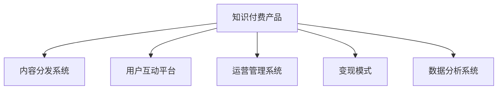

                 

# 知识付费创业的产品矩阵构建

## 1. 背景介绍

### 1.1 问题由来

随着互联网的普及和技术的进步，知识付费成为越来越多人获取新知的重要途径。知识付费平台通过提供高质量的课程、文章、音频等资源，满足用户终身学习的需求。但在知识付费赛道中，如何构建完善的产品矩阵，构建用户粘性，提高营收效率，成为摆在创业团队面前的重要问题。

### 1.2 问题核心关键点

知识付费产品的核心在于提供优质的内容和精准匹配的用户需求。一个成功的产品矩阵应该包含高质量的课程资源、丰富的内容形式、互动的社群平台等模块，以形成一个完整的知识学习生态。以下是构建产品矩阵的几个关键点：

1. **内容多样性**：课程资源应该涵盖不同领域的知识，满足不同用户的学习需求。
2. **用户互动性**：通过社区、论坛等形式，增强用户之间的互动交流，提升平台粘性。
3. **运营效率**：保证内容生产、运营管理的可控性和高效性，确保平台持续稳定运营。
4. **变现模式**：通过课程销售、广告、会员订阅等多种方式，实现商业变现。
5. **数据驱动**：利用数据分析和用户行为研究，优化产品设计和运营策略。

本文将从产品矩阵的构建思路、内容资源的获取与分发、用户互动与社区建设、运营策略与变现模式等角度，深入探讨知识付费创业的产品矩阵构建。

## 2. 核心概念与联系

### 2.1 核心概念概述

为更好地理解知识付费创业的产品矩阵构建方法，本节将介绍几个密切相关的核心概念：

- **知识付费产品**：提供高质量知识内容的在线平台，主要包括课程、文章、音频等多种形式的内容资源。
- **内容分发系统**：负责将课程资源高效地分发给用户，包括推荐算法、流量管理等技术。
- **用户互动平台**：通过论坛、社区、直播等方式，促进用户之间的互动交流，提升平台粘性。
- **运营管理系统**：涵盖内容管理、用户管理、流量监控等多个方面，确保平台运营的稳定性。
- **变现模式**：通过课程销售、广告、会员订阅等形式，实现商业变现。
- **数据分析系统**：利用用户行为数据，进行业务分析和策略优化，提升产品体验和运营效率。

这些核心概念之间的逻辑关系可以通过以下Mermaid流程图来展示：



这个流程图展示的知识付费创业核心概念及其之间的关系：

1. 知识付费产品是整个矩阵的核心，提供高质量的内容资源。
2. 内容分发系统负责将内容资源高效地分发给用户。
3. 用户互动平台促进用户之间的交流，提升平台粘性。
4. 运营管理系统保证平台稳定运营。
5. 变现模式实现商业变现。
6. 数据分析系统优化产品设计和运营策略。

这些核心概念共同构成了知识付费创业的产品矩阵，帮助平台实现高质量内容分发、增强用户粘性、提高运营效率和商业变现。

## 3. 核心算法原理 & 具体操作步骤

### 3.1 算法原理概述

知识付费产品的核心算法原理在于通过数据驱动和机器学习，实现高质量内容的推荐和精准分发，同时增强用户之间的互动，优化运营管理，实现商业变现。

形式化地，设知识付费产品矩阵为 $M=\{C,D,U,S,P\}$，其中 $C$ 为课程资源，$D$ 为内容分发系统，$U$ 为用户互动平台，$S$ 为运营管理系统，$P$ 为变现模式。算法目标为：

$$
\min_{M} \mathcal{L}(C,D,U,S,P) = \frac{1}{N}\sum_{i=1}^N [\ell_D(d_i) + \ell_U(u_i) + \ell_S(s_i) + \ell_P(p_i)]
$$

其中 $\mathcal{L}$ 为整体系统的损失函数，$N$ 为用户总数，$\ell_D$、$\ell_U$、$\ell_S$、$\ell_P$ 分别为内容分发、用户互动、运营管理和变现模式的损失函数。

### 3.2 算法步骤详解

知识付费创业的产品矩阵构建主要包括以下几个关键步骤：

**Step 1: 数据收集与处理**

- 收集高质量的课程内容、用户行为数据、流量数据等。
- 清洗和预处理数据，去除噪声和异常值。
- 数据标注和划分，便于后续训练和评估。

**Step 2: 模型设计与训练**

- 选择合适的推荐算法和互动算法，如协同过滤、矩阵分解、神经网络等。
- 设计训练数据集和验证集，使用交叉验证等方法优化模型。
- 使用深度学习框架如TensorFlow、PyTorch等实现模型训练和优化。

**Step 3: 内容分发与推荐**

- 将课程内容分为课程、文章、音频等多种形式，便于用户选择。
- 使用推荐算法根据用户兴趣和行为数据，推荐个性化内容。
- 使用流量管理系统对不同内容进行流量分配，提升用户体验。

**Step 4: 用户互动与社区建设**

- 设计论坛、社区、直播等互动模块，促进用户交流。
- 使用用户行为数据分析，优化互动模块的设计和功能。
- 引入激励机制，提升用户参与度和粘性。

**Step 5: 运营管理与变现**

- 使用运营管理系统监控流量、用户行为等指标，确保平台稳定运营。
- 设计合理的变现模式，通过课程销售、广告、会员订阅等形式实现商业变现。
- 数据分析系统实时监控运营数据，进行业务分析和优化。

**Step 6: 数据分析与优化**

- 利用用户行为数据和流量数据，进行业务分析和用户画像构建。
- 使用机器学习模型预测用户需求和行为，优化推荐算法和互动策略。
- 不断迭代和优化产品矩阵，提升用户体验和运营效率。

### 3.3 算法优缺点

知识付费创业的产品矩阵构建方法具有以下优点：

1. **高效性**：通过数据驱动和机器学习，实现高效的内容推荐和分发，提升用户体验。
2. **灵活性**：通过灵活的运营和管理策略，提升平台粘性和用户留存率。
3. **可扩展性**：可以根据用户需求和市场变化，灵活调整内容形式和互动策略。

同时，该方法也存在一定的局限性：

1. **高成本**：数据收集和处理、模型训练和优化等环节成本较高。
2. **数据依赖**：算法效果依赖于高质量的数据，数据获取和标注成本较高。
3. **模型风险**：推荐算法和互动策略的准确性依赖于模型设计和训练效果。

尽管存在这些局限性，但就目前而言，数据驱动和机器学习的方法仍是最主流的产品矩阵构建范式。未来相关研究的重点在于如何进一步降低数据依赖，提高模型的鲁棒性和准确性，同时兼顾成本和效益。

### 3.4 算法应用领域

知识付费创业的产品矩阵构建方法已经在多个领域得到应用，包括在线教育、知识共享、职业培训等。例如：

- 在线教育平台如Coursera、Udemy等，通过课程推荐和互动模块，提升用户学习体验和平台粘性。
- 知识共享社区如知乎、Medium等，通过社区讨论和知识分享，促进用户之间的交流和知识传播。
- 职业培训平台如网易云课堂、腾讯课堂等，通过定制化的课程推荐和互动平台，提升用户的学习效果和职业发展。

除了这些典型应用外，知识付费产品矩阵构建方法还将被创新性地应用到更多场景中，如智能推荐系统、内容聚合平台、专业社群等，为知识传播和用户学习提供新的解决方案。

## 4. 数学模型和公式 & 详细讲解 & 举例说明

### 4.1 数学模型构建

本节将使用数学语言对知识付费创业的产品矩阵构建过程进行更加严格的刻画。

设知识付费产品矩阵为 $M=\{C,D,U,S,P\}$，其中 $C$ 为课程资源，$D$ 为内容分发系统，$U$ 为用户互动平台，$S$ 为运营管理系统，$P$ 为变现模式。定义 $M$ 的整体损失函数为：

$$
\mathcal{L}(M) = \mathcal{L}_D + \mathcal{L}_U + \mathcal{L}_S + \mathcal{L}_P
$$

其中 $\mathcal{L}_D$、$\mathcal{L}_U$、$\mathcal{L}_S$、$\mathcal{L}_P$ 分别为内容分发、用户互动、运营管理和变现模式的损失函数。

### 4.2 公式推导过程

以内容分发系统为例，设用户 $i$ 对课程 $j$ 的评分 $r_{ij}$，内容分发系统的目标是最大化用户满意度和平台收益。假设课程推荐模型的输入为 $x_{ij}$，输出为预测评分 $\hat{r}_{ij}$，则内容分发系统的损失函数为：

$$
\mathcal{L}_D = \frac{1}{N}\sum_{i=1}^N \sum_{j=1}^M [r_{ij} - \hat{r}_{ij}]^2
$$

对于用户互动平台，假设用户 $i$ 在论坛 $k$ 的互动频率 $u_{ik}$，用户互动系统的目标是最小化用户流失率和提升活跃度。设互动模型为 $x_{ik}$ 到用户流失率 $\hat{u}_{ik}$ 的映射，则用户互动系统的损失函数为：

$$
\mathcal{L}_U = \frac{1}{N}\sum_{i=1}^N \sum_{k=1}^K [u_{ik} - \hat{u}_{ik}]^2
$$

对于运营管理系统，假设系统 $s$ 的性能指标为 $p_s$，运营管理系统的目标是最大化系统稳定性和效率。设运营管理模型为 $x_s$ 到性能指标 $\hat{p}_s$ 的映射，则运营管理系统的损失函数为：

$$
\mathcal{L}_S = \frac{1}{S}\sum_{s=1}^S [p_s - \hat{p}_s]^2
$$

对于变现模式，假设平台通过课程销售、广告、会员订阅等形式获得收入 $p_P$，变现模式的损失函数为：

$$
\mathcal{L}_P = \frac{1}{P}\sum_{P=1}^P [p_P - \hat{p}_P]^2
$$

将上述损失函数代入整体系统损失函数，得：

$$
\mathcal{L}(M) = \frac{1}{N}\sum_{i=1}^N \sum_{j=1}^M [r_{ij} - \hat{r}_{ij}]^2 + \frac{1}{N}\sum_{i=1}^N \sum_{k=1}^K [u_{ik} - \hat{u}_{ik}]^2 + \frac{1}{S}\sum_{s=1}^S [p_s - \hat{p}_s]^2 + \frac{1}{P}\sum_{P=1}^P [p_P - \hat{p}_P]^2
$$

### 4.3 案例分析与讲解

以Coursera平台为例，分析其产品矩阵构建过程。

Coursera平台通过大规模的课程资源库和智能推荐系统，实现了高质量课程的精准分发。其推荐算法使用协同过滤和矩阵分解等方法，通过用户历史行为数据，为用户推荐个性化课程。此外，Coursera平台还通过社区讨论和在线答疑，增强用户互动和粘性。运营管理系统通过监控流量和用户行为，确保平台稳定运营。变现模式通过课程销售和广告投放，实现商业变现。

通过Coursera平台的案例分析，可以看出知识付费创业的产品矩阵构建方法的核心在于通过数据驱动和机器学习，实现高质量内容的推荐和精准分发，同时增强用户互动，优化运营管理，实现商业变现。

## 5. 项目实践：代码实例和详细解释说明

### 5.1 开发环境搭建

在进行知识付费创业的产品矩阵构建实践前，我们需要准备好开发环境。以下是使用Python进行Flask开发的环境配置流程：

1. 安装Anaconda：从官网下载并安装Anaconda，用于创建独立的Python环境。

2. 创建并激活虚拟环境：
```bash
conda create -n flask-env python=3.8 
conda activate flask-env
```

3. 安装Flask：
```bash
pip install flask
```

4. 安装SQLAlchemy：
```bash
pip install sqlalchemy
```

5. 安装Flask-SQLAlchemy：
```bash
pip install flask-sqlalchemy
```

6. 安装Flask-WTF：
```bash
pip install flask-wtf
```

完成上述步骤后，即可在`flask-env`环境中开始产品矩阵构建实践。

### 5.2 源代码详细实现

我们以一个简单的知识付费社区平台为例，给出使用Flask框架实现内容分发和用户互动的代码实现。

首先，定义数据模型：

```python
from flask_sqlalchemy import SQLAlchemy

db = SQLAlchemy()

class User(db.Model):
    id = db.Column(db.Integer, primary_key=True)
    name = db.Column(db.String(50), nullable=False)
    email = db.Column(db.String(120), unique=True, nullable=False)
    courses = db.relationship('Course', backref='user', lazy=True)

class Course(db.Model):
    id = db.Column(db.Integer, primary_key=True)
    title = db.Column(db.String(100), nullable=False)
    content = db.Column(db.Text, nullable=False)
    user_id = db.Column(db.Integer, db.ForeignKey('user.id'), nullable=False)
    comments = db.relationship('Comment', backref='course', lazy=True)

class Comment(db.Model):
    id = db.Column(db.Integer, primary_key=True)
    content = db.Column(db.Text, nullable=False)
    user_id = db.Column(db.Integer, db.ForeignKey('user.id'), nullable=False)
    course_id = db.Column(db.Integer, db.ForeignKey('course.id'), nullable=False)
```

然后，定义API路由：

```python
from flask import Flask, render_template, request, jsonify

app = Flask(__name__)

@app.route('/')
def index():
    courses = Course.query.all()
    return render_template('index.html', courses=courses)

@app.route('/api/courses', methods=['POST'])
def add_course():
    data = request.get_json()
    course = Course(title=data['title'], content=data['content'], user_id=data['user_id'])
    db.session.add(course)
    db.session.commit()
    return jsonify({'message': 'Course added successfully'}), 201

@app.route('/api/comments', methods=['POST'])
def add_comment():
    data = request.get_json()
    comment = Comment(content=data['content'], user_id=data['user_id'], course_id=data['course_id'])
    db.session.add(comment)
    db.session.commit()
    return jsonify({'message': 'Comment added successfully'}), 201
```

最后，启动Flask应用：

```python
if __name__ == '__main__':
    app.run(debug=True)
```

以上是一个简单的知识付费社区平台的Flask应用实现。可以看到，通过Flask框架和SQLAlchemy库，可以轻松构建数据模型和API路由，实现知识付费产品的核心功能。

### 5.3 代码解读与分析

让我们再详细解读一下关键代码的实现细节：

**数据模型定义**：
- 使用Flask-SQLAlchemy库定义了用户、课程、评论三个数据模型，通过ORM技术将数据库操作封装为Python对象操作。
- 用户和课程之间是多对多关系，课程和评论之间是一对多关系，通过外键实现。

**API路由定义**：
- 定义了两个API路由，分别用于添加课程和评论。
- 使用Flask的请求解析功能，从JSON格式的请求中提取数据，并保存到数据库中。
- 使用Flask的JSON返回功能，将操作结果以JSON格式返回客户端。

**Flask应用启动**：
- 使用Flask的应用启动函数 `run()` ，启动服务器。
- 通过 `debug=True` 参数，开启调试模式，实时查看日志和错误信息。

可以看出，使用Flask框架进行知识付费产品开发，可以快速构建前后端一体化的Web应用，同时支持实时数据存储和处理。

## 6. 实际应用场景

### 6.1 智能教育

智能教育是知识付费产品矩阵构建的重要应用场景。通过智能推荐系统，学习平台能够根据用户的学习记录和兴趣，推荐最适合的课程资源，提升学习效果。

以Coursera平台为例，其智能推荐系统通过协同过滤和矩阵分解等方法，根据用户的历史学习行为和课程特征，实时推荐个性化课程。此外，Coursera平台还通过社区讨论和在线答疑，增强用户互动和粘性，提升学习体验。

### 6.2 知识共享

知识共享平台通过社区讨论和知识分享，促进用户之间的交流和知识传播，为用户提供丰富的学习资源。

以知乎平台为例，其知识共享平台通过高质量的文章、回答和讨论，吸引了大量用户参与。通过智能推荐系统，知乎能够根据用户的阅读行为和兴趣，推荐相关的内容，提升平台活跃度和用户粘性。

### 6.3 职业培训

职业培训平台通过定制化的课程推荐和互动平台，提升用户的学习效果和职业发展。

以网易云课堂平台为例，其职业培训平台通过智能推荐系统，根据用户的学习历史和职业需求，推荐最合适的课程资源。通过社区讨论和在线答疑，网易云课堂平台增强用户互动和粘性，提升用户的学习效果和职业发展。

### 6.4 未来应用展望

随着知识付费市场的发展，知识付费创业的产品矩阵构建将面临更多新的挑战和机遇。未来，知识付费产品矩阵构建将呈现以下几个发展趋势：

1. **内容多样化**：平台将提供更多形式和类型的内容资源，如视频、音频、直播等，满足用户多样化的学习需求。
2. **互动个性化**：通过智能推荐系统和社区模块，提升用户互动体验和粘性。
3. **运营智能化**：利用大数据和机器学习技术，优化平台运营管理和变现模式。
4. **技术前沿化**：引入最新的人工智能和云计算技术，提升平台的技术实力和用户体验。

基于这些趋势，知识付费创业的产品矩阵构建将朝着更加智能、高效、多样化的方向发展，为用户的终身学习提供更加优质的服务。

## 7. 工具和资源推荐

### 7.1 学习资源推荐

为了帮助开发者系统掌握知识付费创业的产品矩阵构建的理论基础和实践技巧，这里推荐一些优质的学习资源：

1. **《知识付费市场研究报告》**：深度分析知识付费市场的现状和趋势，提供丰富的案例和数据支持。
2. **《数据驱动的产品设计》**：讲解数据驱动的产品设计方法和实践案例，帮助开发者提升产品设计和运营能力。
3. **《知识付费用户行为分析》**：分析用户行为数据，提供科学的用户画像和推荐策略。
4. **《智能推荐系统实战》**：讲解推荐算法和系统设计，提供真实的推荐系统搭建案例。
5. **《人工智能在教育中的应用》**：讲解人工智能在教育中的应用场景和实战案例，提供丰富的教学资源。

通过对这些资源的学习实践，相信你一定能够快速掌握知识付费创业的产品矩阵构建的精髓，并用于解决实际的产品问题。

### 7.2 开发工具推荐

高效的开发离不开优秀的工具支持。以下是几款用于知识付费产品开发的工具：

1. **Flask**：轻量级的Web框架，适合快速开发知识付费平台的前端和后端。
2. **SQLAlchemy**：ORM框架，方便进行数据库操作和模型定义。
3. **Gunicorn**：Python Web应用服务器，支持Flask应用部署和负载均衡。
4. **Docker**：容器化工具，方便进行应用程序的打包和部署。
5. **Prometheus**：监控系统，实时监控应用程序的性能和状态。

合理利用这些工具，可以显著提升知识付费产品矩阵构建的开发效率，加快创新迭代的步伐。

### 7.3 相关论文推荐

知识付费创业的产品矩阵构建技术的发展源于学界的持续研究。以下是几篇奠基性的相关论文，推荐阅读：

1. **《知识付费平台的智能推荐系统》**：介绍智能推荐系统在知识付费平台中的应用，提供推荐算法的实现和评估方法。
2. **《知识付费平台的社区建设》**：分析社区建设在知识付费平台中的作用，提供社区模块的设计和实现方法。
3. **《知识付费平台的运营管理》**：讲解知识付费平台的运营管理和变现模式，提供平台优化策略和案例。
4. **《知识付费平台的数据驱动设计》**：讲解数据驱动的产品设计和运营方法，提供实证研究支持。

这些论文代表了大语言模型微调技术的发展脉络。通过学习这些前沿成果，可以帮助研究者把握学科前进方向，激发更多的创新灵感。

## 8. 总结：未来发展趋势与挑战

### 8.1 总结

本文对知识付费创业的产品矩阵构建方法进行了全面系统的介绍。首先阐述了知识付费创业的背景和意义，明确了产品矩阵在提供优质内容、增强用户互动、优化运营管理等方面的核心价值。其次，从原理到实践，详细讲解了推荐算法、用户互动、运营管理等关键技术，给出了知识付费产品的完整代码实例。同时，本文还广泛探讨了知识付费产品矩阵构建在教育、知识共享、职业培训等多个领域的应用前景，展示了其巨大的市场潜力。此外，本文精选了知识付费创业的产品矩阵构建所需的学习资源，力求为读者提供全方位的技术指引。

通过本文的系统梳理，可以看出，知识付费创业的产品矩阵构建方法在知识传播和用户学习方面具有重要意义。构建高质量的内容资源、增强用户互动、优化运营管理、实现商业变现，这些关键环节的协同发力，将推动知识付费产品向更加智能、高效、多样化的方向发展。未来，伴随技术的持续演进和市场需求的不断变化，知识付费创业的产品矩阵构建也将迎来更多新的突破和创新。

### 8.2 未来发展趋势

展望未来，知识付费创业的产品矩阵构建将呈现以下几个发展趋势：

1. **内容智能化**：平台将通过人工智能技术，实现内容的自动生成和智能化推荐，提升用户的学习体验。
2. **互动社交化**：通过社区、论坛等社交模块，增强用户之间的互动交流，提升平台的粘性。
3. **运营数据化**：利用大数据和机器学习技术，优化平台运营管理和变现模式，提升平台的稳定性和效率。
4. **技术前沿化**：引入最新的人工智能和云计算技术，提升平台的技术实力和用户体验。
5. **跨界融合化**：与其他行业进行深度融合，提供更丰富的应用场景和功能。

以上趋势凸显了知识付费创业的产品矩阵构建技术的广阔前景。这些方向的探索发展，必将进一步提升平台的创新力和竞争力，为知识传播和用户学习提供更优质的服务。

### 8.3 面临的挑战

尽管知识付费创业的产品矩阵构建技术已经取得了不少成就，但在迈向更加智能化、普适化应用的过程中，它仍面临着诸多挑战：

1. **数据获取成本高**：高质量的数据获取和标注成本较高，限制了平台的扩展和优化。
2. **算法复杂度高**：推荐算法和互动策略的实现较为复杂，需要高水平的技术团队支持。
3. **用户体验不稳定**：平台的用户体验提升需要持续优化，面临技术瓶颈和用户反馈的挑战。
4. **商业模式单一**：目前知识付费平台的变现模式较为单一，难以满足用户的多样化需求。
5. **技术壁垒高**：平台的技术门槛较高，需要跨领域的技术专家团队协同合作。

正视知识付费创业的产品矩阵构建所面临的这些挑战，积极应对并寻求突破，将是大语言模型微调走向成熟的必由之路。相信随着学界和产业界的共同努力，这些挑战终将一一被克服，知识付费创业的产品矩阵构建必将在构建人机协同的智能时代中扮演越来越重要的角色。

### 8.4 研究展望

面对知识付费创业的产品矩阵构建所面临的挑战，未来的研究需要在以下几个方面寻求新的突破：

1. **数据获取优化**：探索更加高效的数据获取和标注方法，降低平台的数据依赖成本。
2. **算法模型简化**：开发更加简洁高效的推荐算法和互动策略，提升平台的技术实现效率。
3. **用户体验优化**：引入最新的人工智能和用户体验设计方法，提升平台的用户体验和粘性。
4. **商业模式多样化**：引入多样化的商业变现模式，满足用户的多样化需求，提升平台的可持续性。
5. **技术协同合作**：加强跨领域的技术协同合作，提升平台的技术实力和竞争力。

这些研究方向的探索，必将引领知识付费创业的产品矩阵构建技术迈向更高的台阶，为知识传播和用户学习提供更优质的服务。面向未来，知识付费创业的产品矩阵构建需要与人工智能、云计算、大数据等技术深度融合，共同推动知识付费产品向更加智能、高效、多样化的方向发展。只有勇于创新、敢于突破，才能不断拓展知识付费产品的边界，让智能技术更好地造福人类社会。

## 9. 附录：常见问题与解答

**Q1：如何构建知识付费产品的推荐系统？**

A: 知识付费产品的推荐系统可以通过协同过滤、矩阵分解、神经网络等多种算法实现。具体步骤如下：
1. 收集用户历史行为数据，如浏览记录、评分等。
2. 定义推荐算法的输入和输出，如用户ID、课程ID、评分等。
3. 训练推荐模型，使用交叉验证等方法评估模型效果。
4. 部署推荐模型，实现实时推荐。

**Q2：知识付费产品的互动模块如何设计？**

A: 知识付费产品的互动模块可以通过社区、论坛、直播等多种形式实现。具体步骤如下：
1. 设计互动模块的功能和界面，如评论、点赞、分享等。
2. 引入激励机制，如积分、徽章等，提升用户参与度和粘性。
3. 利用用户行为数据，优化互动模块的设计和功能。
4. 进行持续优化，提升用户互动体验。

**Q3：知识付费产品的变现模式有哪些？**

A: 知识付费产品的变现模式主要包括课程销售、广告、会员订阅等。具体实现步骤如下：
1. 设计课程销售、广告、会员订阅等变现模式。
2. 利用数据分析系统，实时监控变现效果。
3. 不断优化变现策略，提升商业变现能力。

通过以上常见问题的解答，可以更好地理解知识付费创业的产品矩阵构建技术，提升产品设计和运营能力。

---

作者：禅与计算机程序设计艺术 / Zen and the Art of Computer Programming

