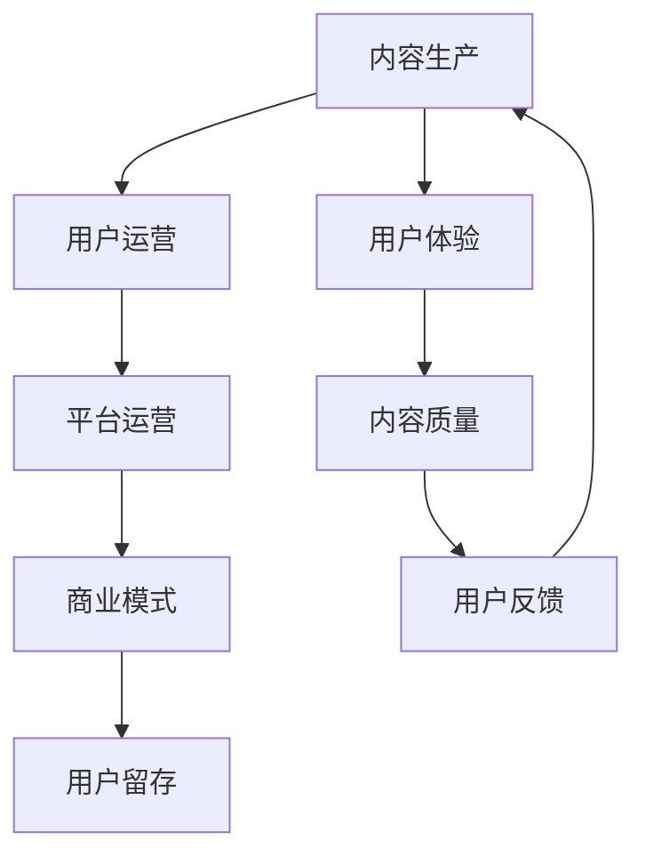

                 

# 知识付费创业的核心原理解析

## 1. 背景介绍

### 1.1 问题由来

随着互联网技术的发展，知识付费成为了一个快速增长的市场。根据中国互联网络信息中心（CNNIC）发布的第49次《中国互联网络发展状况统计报告》，截至2022年6月，中国知识付费用户规模达2.87亿，年消费规模达282.1亿元。知识付费产品的形式也日益多样化，从在线教育、电子图书，到音频课程、视频讲座，应有尽有。

但与此同时，知识付费行业也面临着诸多挑战。如市场竞争激烈，用户留存率低，内容同质化严重等。要想在激烈的竞争中脱颖而出，知识付费创业必须深入挖掘和理解其核心原理和商业模式，找准定位，提升产品竞争力。

### 1.2 问题核心关键点

1. **核心驱动力**：知识付费的根本驱动力在于用户对高质量知识的需求。高质量的内容能够解决用户实际问题，提升生活或工作的效率和质量，从而获得用户的认可和付费意愿。
2. **运营模式**：知识付费通常采用订阅制或单次付费模式，通过提供持续优质的内容和服务，吸引用户长期付费。
3. **用户获取**：高效的引流和转化是知识付费创业成功的关键。需要精细化的用户画像定位和精准的营销策略。
4. **内容生产**：优质内容的持续输出是知识付费产品吸引用户的关键。内容需要有深度、有系统性、有实践价值。
5. **平台运营**：良好的用户体验、高效的内容管理和数据驱动的决策是知识付费平台运营的关键。

### 1.3 问题研究意义

1. **理解用户需求**：知识付费创业需要深入理解用户需求，设计精准的用户画像，提供有价值的内容，从而提升用户粘性和付费意愿。
2. **优化商业模式**：优化知识付费产品的商业模式，制定科学合理的价格策略，实现可持续发展。
3. **提升运营效率**：通过技术手段提升内容生产、用户引流、平台运营等各个环节的效率，降低成本，提高收益。
4. **创造更多价值**：通过知识付费产品，帮助用户实现个人或职业成长，创造更大的社会价值。

## 2. 核心概念与联系

### 2.1 核心概念概述

为更好地理解知识付费创业的核心原理，本节将介绍几个密切相关的核心概念：

- **知识付费**：基于知识的商品化过程，通过提供高质量的、具有实践价值的知识，帮助用户解决问题，提升效率。
- **内容生产**：知识付费的核心是优质内容的输出。内容需要有深度、有系统性，同时要有实践价值，能够帮助用户解决实际问题。
- **平台运营**：知识付费平台作为内容提供者和用户的中间桥梁，需要高效的内容管理和用户体验优化，同时需要数据驱动的决策支持。
- **用户运营**：高效的引流和转化是知识付费创业成功的关键。需要精细化的用户画像定位和精准的营销策略。
- **商业模式**：知识付费产品通常采用订阅制或单次付费模式，通过提供持续优质的内容和服务，吸引用户长期付费。

这些核心概念之间有着密切的联系。内容生产是知识付费的基础，用户运营和平台运营是成功的保障，而商业模式则是持续发展的驱动力。

### 2.2 核心概念原理和架构的 Mermaid 流程图(Mermaid 流程节点中不要有括号、逗号等特殊字符)



这个流程图展示了大语言模型的核心概念及其之间的关系：

1. 内容生产是知识付费的基础，通过提供高质量的内容吸引用户。
2. 用户运营是知识付费成功的保障，通过精细化的用户画像定位和精准的营销策略，提升用户粘性和付费意愿。
3. 平台运营是知识付费产品能够持续运营的关键，通过高效的内容管理和用户体验优化，提升用户满意度。
4. 商业模式是知识付费产品持续发展的驱动力，通过合理的定价策略和收入模式，实现可持续运营。
5. 用户体验和内容质量是用户留存的关键，通过不断优化用户体验和内容质量，保持用户的长期活跃。
6. 用户反馈对内容生产有指导作用，通过用户反馈，不断提升内容质量，实现良性循环。

## 3. 核心算法原理 & 具体操作步骤
### 3.1 算法原理概述

知识付费创业的核心在于内容生产和用户运营。以下是知识付费产品的核心算法原理：

**用户画像**：通过用户基本信息、行为数据、反馈评价等，构建用户画像。了解用户需求和偏好，提供精准的内容推荐和个性化的服务。

**内容推荐算法**：结合用户画像和内容特征，采用协同过滤、内容过滤、混合推荐等算法，为用户提供有价值的内容推荐，提升用户满意度。

**个性化服务**：根据用户行为和反馈，不断优化个性化服务。如推荐个性化的学习路径、提供定制化的课程和书籍等。

**用户互动**：通过论坛、社区、问答等形式，提升用户互动，增强用户粘性和社区感。

**数据驱动运营**：通过数据分析，了解用户行为和市场趋势，指导内容生产、营销策略、产品迭代等运营环节。

**用户生命周期管理**：设计用户生命周期，从引流、转化、留存到流失，进行全生命周期的管理，提升用户价值。

### 3.2 算法步骤详解

知识付费创业的核心算法步骤如下：

**Step 1: 用户画像构建**
- 收集用户基本信息，如年龄、性别、职业等。
- 收集用户行为数据，如浏览历史、购买记录、学习时长等。
- 收集用户反馈，如评价、评论、课程评分等。
- 使用聚类算法、协同过滤等方法，构建用户画像。

**Step 2: 内容推荐**
- 收集内容特征，如课程名称、作者、大纲、目录等。
- 使用协同过滤、内容过滤、混合推荐等算法，生成推荐列表。
- 动态更新推荐算法模型，优化推荐效果。

**Step 3: 个性化服务**
- 根据用户画像和行为数据，定制个性化的学习路径。
- 推荐个性化的课程、书籍、导师等。
- 提供个性化的课程安排、学习提醒、学习反馈等。

**Step 4: 用户互动**
- 搭建社区、论坛、问答等平台，提升用户互动。
- 设计互动奖励机制，如积分、徽章等。
- 定期举办线上线下活动，增强用户粘性。

**Step 5: 数据驱动运营**
- 收集用户行为数据，如浏览时间、购买次数、学习时间等。
- 进行数据分析，了解用户需求和行为特征。
- 指导内容生产、营销策略、产品迭代等运营环节。

**Step 6: 用户生命周期管理**
- 设计用户生命周期模型，从引流、转化、留存到流失。
- 进行各个环节的管理，如漏斗分析、流失预警等。
- 提升用户价值，增加用户生命周期价值。

### 3.3 算法优缺点

知识付费创业的算法有以下优点：

1. **提高用户满意度**：通过内容推荐和个性化服务，提高用户满意度和粘性，提升用户留存率。
2. **优化用户体验**：通过数据驱动的运营，不断优化用户体验，提升用户满意度。
3. **提升转化率**：通过精准的用户画像和营销策略，提升引流和转化率。
4. **增强用户互动**：通过社区、论坛、问答等形式，增强用户互动，提升社区感。

但这些算法也存在一定的局限性：

1. **数据依赖性高**：算法的准确性高度依赖于数据质量和数据的完整性。
2. **算法复杂度**：算法的复杂度高，需要大量计算资源。
3. **模型过拟合**：算法模型可能对特定用户或内容过拟合，导致推荐效果不佳。
4. **用户隐私保护**：收集和分析用户数据可能涉及隐私问题，需严格遵守相关法规。

### 3.4 算法应用领域

知识付费创业的算法在以下领域有广泛应用：

- **在线教育**：通过推荐算法和个性化服务，提升课程完成率和用户满意度。
- **电子书阅读**：推荐算法和个性化服务，提升用户阅读体验和书籍销量。
- **在线讲座和课程**：个性化推荐和互动，提升用户参与度和满意度。
- **知识问答社区**：互动机制和个性化服务，提升用户粘性和社区感。
- **职业培训**：个性化课程推荐和职业路径规划，提升用户职业成长和满意度。

## 4. 数学模型和公式 & 详细讲解 & 举例说明

### 4.1 数学模型构建

知识付费创业的数学模型主要包括用户画像构建、内容推荐、个性化服务、用户互动等。以下以内容推荐为例，展示数学模型的构建。

假设用户集合为 $U=\{u_1,u_2,\cdots,u_n\}$，内容集合为 $V=\{v_1,v_2,\cdots,v_m\}$。用户的特征向量表示为 $U=\{x_u\}_{u=1}^n$，内容的特征向量表示为 $V=\{x_v\}_{v=1}^m$。用户对内容的评分矩阵表示为 $R\in \mathbb{R}^{n\times m}$。

内容推荐模型的目标是最小化预测误差 $e$，即：

$$
\min_{\theta} \sum_{u=1}^n \sum_{v=1}^m \ell(R_{uv},\hat{R}_{uv})
$$

其中 $\ell$ 为损失函数，$\hat{R}_{uv}$ 为模型的预测评分。

### 4.2 公式推导过程

常用的内容推荐算法包括协同过滤、内容过滤、混合推荐等。以下以协同过滤为例，展示推荐模型的推导过程。

协同过滤算法基于用户行为数据，通过计算用户和内容的相似度，推荐相似用户喜欢的内容。假设用户 $u$ 对内容 $v$ 的评分表示为 $R_{uv}$，用户 $u$ 对内容 $v$ 的预测评分表示为 $\hat{R}_{uv}$。则协同过滤模型的目标是最小化预测误差 $e$，即：

$$
\min_{\theta} \sum_{u=1}^n \sum_{v=1}^m \ell(R_{uv},\hat{R}_{uv})
$$

其中 $\ell$ 为损失函数，$\hat{R}_{uv}$ 为模型的预测评分。

协同过滤算法通常采用矩阵分解的方法，将用户行为数据 $R$ 分解为两个低秩矩阵的乘积 $U\times V$，即：

$$
R \approx U\times V
$$

其中 $U\in \mathbb{R}^{n\times k}$ 为用户矩阵，$V\in \mathbb{R}^{k\times m}$ 为内容矩阵。$k$ 为分解的秩。

模型的预测评分 $\hat{R}_{uv}$ 可以通过用户矩阵和内容矩阵计算得到：

$$
\hat{R}_{uv}=\sum_{i=1}^k U_{ui} V_{iv}
$$

其中 $U_{ui}$ 和 $V_{iv}$ 分别为用户矩阵和内容矩阵的第 $u$ 行和第 $v$ 列。

### 4.3 案例分析与讲解

以某在线教育平台为例，分析其内容推荐算法的应用。

假设该平台有10000个用户，5000门课程。每个用户有50门课程的浏览历史。平台通过收集用户浏览记录，构建用户行为矩阵 $R\in \mathbb{R}^{10000\times 5000}$。

通过矩阵分解的方法，将 $R$ 分解为两个低秩矩阵 $U\in \mathbb{R}^{10000\times 100}$ 和 $V\in \mathbb{R}^{100\times 5000}$。其中 $U$ 为用户矩阵，$V$ 为内容矩阵。

平台根据用户行为数据，动态更新矩阵 $U$ 和 $V$。用户 $u$ 对内容 $v$ 的预测评分 $\hat{R}_{uv}$ 可以通过计算得到：

$$
\hat{R}_{uv}=\sum_{i=1}^{100} U_{ui} V_{iv}
$$

其中 $U_{ui}$ 和 $V_{iv}$ 分别为用户矩阵和内容矩阵的第 $u$ 行和第 $v$ 列。

通过比较预测评分 $\hat{R}_{uv}$ 和用户实际评分 $R_{uv}$，平台可以计算出预测误差 $e$，并不断优化矩阵 $U$ 和 $V$，提升推荐效果。

## 5. 项目实践：代码实例和详细解释说明

### 5.1 开发环境搭建

要进行知识付费产品的开发和运营，需要搭建开发和运行环境。以下是使用Python进行知识付费产品开发的环境配置流程：

1. 安装Anaconda：从官网下载并安装Anaconda，用于创建独立的Python环境。

2. 创建并激活虚拟环境：
```bash
conda create -n kf-env python=3.8 
conda activate kf-env
```

3. 安装PyTorch：根据CUDA版本，从官网获取对应的安装命令。例如：
```bash
conda install pytorch torchvision torchaudio cudatoolkit=11.1 -c pytorch -c conda-forge
```

4. 安装TensorFlow：由Google主导开发的开源深度学习框架，生产部署方便，适合大规模工程应用。同样有丰富的预训练语言模型资源。

5. 安装Flask：用于搭建知识付费平台的前端开发框架。

6. 安装SQLite：用于存储用户数据和内容信息的数据库。

完成上述步骤后，即可在`kf-env`环境中开始知识付费产品的开发。

### 5.2 源代码详细实现

下面我们以在线教育平台为例，给出使用PyTorch和Flask进行内容推荐系统开发的PyTorch代码实现。

首先，定义数据处理函数：

```python
import pandas as pd
import numpy as np
from sklearn.decomposition import TruncatedSVD

def load_data(file_path):
    data = pd.read_csv(file_path)
    return data['user_id'].values, data['course_id'].values

def save_matrix(file_path, matrix, shape):
    np.save(file_path, matrix.reshape(shape))
    
def load_matrix(file_path, shape):
    return np.load(file_path).reshape(shape)
```

然后，定义推荐系统模型：

```python
from sklearn.metrics.pairwise import cosine_similarity
from sklearn.decomposition import TruncatedSVD

class RecommendationSystem:
    def __init__(self, num_users, num_courses, num_factors=100):
        self.num_users = num_users
        self.num_courses = num_courses
        self.num_factors = num_factors
        self.user_matrix = None
        self.course_matrix = None
        
    def train(self, user_ratings, num_epochs=10, learning_rate=0.01):
        self.user_matrix = TruncatedSVD(self.num_factors).fit(user_ratings)
        self.course_matrix = TruncatedSVD(self.num_factors).fit(user_ratings.T)
        
    def predict(self, user, course):
        return cosine_similarity(self.user_matrix[user], self.course_matrix[course]).ravel()[0]
        
    def recommend(self, user, top_n=5):
        user_idx = np.where(self.user_matrix==user)[0][0]
        similarities = cosine_similarity(self.user_matrix[user_idx], self.course_matrix.T)
        recommendations = np.argsort(-similarities)[1:top_n+1]
        return recommendations
```

接着，定义前端页面和API接口：

```python
from flask import Flask, render_template, request, jsonify

app = Flask(__name__)

@app.route('/')
def index():
    return render_template('index.html')

@app.route('/recommend', methods=['POST'])
def recommend():
    user = request.json['user']
    recommendations = recommendation_system.recommend(user)
    return jsonify(recommendations)
    
if __name__ == '__main__':
    app.run(debug=True)
```

最后，启动推荐系统，并测试其功能：

```bash
python recommendation.py
```

在浏览器中访问 `http://localhost:5000`，即可在推荐系统中查看推荐结果。

### 5.3 代码解读与分析

让我们再详细解读一下关键代码的实现细节：

**load_data函数**：
- 加载用户行为数据，返回用户ID和课程ID。

**save_matrix和load_matrix函数**：
- 将用户行为矩阵保存为Numpy数组，方便后续计算。

**RecommendationSystem类**：
- 初始化时，定义用户数、课程数、分解因子的数量。
- 训练函数：使用TruncatedSVD进行矩阵分解，构建用户矩阵和课程矩阵。
- 预测函数：计算用户对课程的相似度。
- 推荐函数：根据用户对课程的相似度，推荐用户最感兴趣的课程。

**Flask应用**：
- 定义主页和推荐API接口。
- 接收前端请求，调用推荐系统API，返回推荐结果。

可以看到，通过Python和Flask，我们可以便捷地搭建知识付费平台，实现内容推荐等功能。

当然，工业级的系统实现还需考虑更多因素，如用户管理、订单管理、支付接口等。但核心的推荐算法基本与此类似。

## 6. 实际应用场景

### 6.1 智能推荐系统

智能推荐系统是知识付费产品的重要组成部分，能够提升用户体验和用户留存率。通过智能推荐系统，平台能够根据用户的行为数据，动态调整推荐策略，提供个性化的内容推荐。

智能推荐系统不仅能够提升用户满意度，还能促进内容的传播和变现。例如，某在线教育平台通过智能推荐系统，实现了课程的精准推荐，提升了用户的课程完成率和续费率，从而实现了业绩的大幅增长。

### 6.2 个性化课程推荐

个性化课程推荐能够根据用户的学习行为和需求，推荐最适合用户学习的课程，提升用户的学习效果和满意度。平台可以通过学习用户的浏览历史、学习时间、学习进度等行为数据，构建用户画像，并推荐相应的课程。

例如，某在线教育平台通过个性化课程推荐，提升了用户的学习效果，降低了退费率，实现了用户满意度和平台收益的双赢。

### 6.3 用户互动社区

用户互动社区能够增强用户粘性和社区感，提升平台的活跃度。平台可以通过社区、论坛、问答等形式，让用户参与到内容创作和交流中，增强用户互动。

例如，某在线教育平台通过搭建学习社区，鼓励用户分享学习心得，互相交流学习经验，提升了平台的活跃度和用户粘性。

### 6.4 用户生命周期管理

用户生命周期管理能够帮助平台了解用户在不同生命周期阶段的需求和行为特征，进行针对性的运营和转化。平台可以通过漏斗分析、流失预警等手段，提升用户生命周期价值。

例如，某在线教育平台通过用户生命周期管理，实现了从引流、转化、留存到流失的全面运营，提升了用户生命周期价值和平台收益。

## 7. 工具和资源推荐

### 7.1 学习资源推荐

为了帮助开发者系统掌握知识付费产品的理论基础和实践技巧，这里推荐一些优质的学习资源：

1. **《深度学习实战》**：由李沐等著，详细介绍了深度学习在NLP、计算机视觉、推荐系统等领域的应用，包括知识付费产品中常用的协同过滤算法。
2. **《推荐系统实战》**：由王逵等著，详细介绍了推荐系统中的协同过滤、内容过滤、混合推荐等算法，并提供了丰富的代码实现。
3. **Coursera推荐系统课程**：由斯坦福大学开设的推荐系统课程，深入浅出地介绍了推荐系统中的各种算法和应用。
4. **Kaggle推荐系统竞赛**：Kaggle推荐系统竞赛提供了大量真实数据集和比赛任务，供开发者实践和提升。
5. **PyTorch官方文档**：PyTorch官方文档提供了丰富的资源和样例代码，帮助开发者快速上手深度学习开发。

通过对这些资源的学习实践，相信你一定能够快速掌握知识付费产品的核心原理和实践技巧，并用于解决实际的NLP问题。

### 7.2 开发工具推荐

高效的开发离不开优秀的工具支持。以下是几款用于知识付费产品开发的常用工具：

1. **PyTorch**：基于Python的开源深度学习框架，灵活动态的计算图，适合快速迭代研究。大部分预训练语言模型都有PyTorch版本的实现。
2. **TensorFlow**：由Google主导开发的开源深度学习框架，生产部署方便，适合大规模工程应用。同样有丰富的预训练语言模型资源。
3. **Flask**：用于搭建知识付费平台的前端开发框架，便捷的API接口设计和模板引擎，适合快速开发Web应用。
4. **SQLite**：轻量级数据库，支持Python、Java等多种编程语言，适合存储用户数据和内容信息。
5. **Jupyter Notebook**：交互式编程环境，支持Python、R等多种编程语言，适合数据处理和算法验证。

合理利用这些工具，可以显著提升知识付费产品的开发效率，加快创新迭代的步伐。

### 7.3 相关论文推荐

知识付费产品的发展离不开学界的持续研究。以下是几篇奠基性的相关论文，推荐阅读：

1. **《协同过滤推荐系统综述》**：综述了协同过滤推荐系统的发展历程、算法原理和应用实践。
2. **《基于内容的推荐系统》**：介绍了基于内容的推荐系统的算法原理和应用实践。
3. **《混合推荐系统》**：介绍了混合推荐系统中的协同过滤、内容过滤、混合推荐等算法，并提供了丰富的实验结果和分析。
4. **《深度学习在推荐系统中的应用》**：介绍了深度学习在推荐系统中的应用，包括协同过滤、内容过滤、混合推荐等算法。
5. **《推荐系统中的用户建模》**：介绍了用户建模的方法和应用，包括协同过滤、深度学习等。

这些论文代表了大语言模型微调技术的发展脉络。通过学习这些前沿成果，可以帮助研究者把握学科前进方向，激发更多的创新灵感。

## 8. 总结：未来发展趋势与挑战

### 8.1 总结

本文对知识付费创业的核心原理进行了全面系统的介绍。首先阐述了知识付费创业的背景和核心关键点，明确了用户画像、内容推荐、个性化服务、用户互动等核心算法。其次，从原理到实践，详细讲解了知识付费产品的数学模型和算法步骤，给出了知识付费平台开发的完整代码实例。同时，本文还广泛探讨了知识付费产品在手机应用、智能推荐、个性化课程推荐、用户互动社区等多个领域的应用前景，展示了知识付费产品发展的广阔前景。

通过本文的系统梳理，可以看到，知识付费创业需要深入理解用户需求和行为特征，设计精准的用户画像，提供有价值的内容，从而提升用户粘性和付费意愿。同时，优化知识付费产品的商业模式，制定科学合理的价格策略，实现可持续发展。最后，通过技术手段提升内容生产、用户引流、平台运营等各个环节的效率，降低成本，提高收益。

### 8.2 未来发展趋势

展望未来，知识付费产品的发展将呈现以下几个趋势：

1. **个性化推荐提升**：通过更加精准的用户画像和推荐算法，提升推荐效果，实现更精准的内容推荐。
2. **多模态数据融合**：将视频、音频等多模态数据与文本数据进行融合，提升推荐系统的表现力。
3. **深度学习算法应用**：通过深度学习算法，提升推荐系统的准确性和泛化能力。
4. **数据驱动运营**：通过数据驱动的运营，不断优化用户体验，提升用户满意度和留存率。
5. **用户生命周期管理**：通过精细化的用户生命周期管理，提升用户价值和平台收益。

这些趋势将进一步提升知识付费产品的性能和用户体验，推动知识付费产品的发展。

### 8.3 面临的挑战

尽管知识付费产品的发展前景广阔，但也面临着诸多挑战：

1. **数据质量**：数据质量直接影响推荐系统的准确性和用户满意度。平台需要投入大量资源，收集和清洗高质量的数据。
2. **算法复杂度**：推荐系统涉及多种复杂的算法，如协同过滤、内容过滤、混合推荐等，算法复杂度高，需要大量计算资源。
3. **用户隐私保护**：平台需要严格遵守相关法规，保护用户隐私，确保数据安全和用户权益。
4. **用户行为多样性**：用户行为多样性大，不同用户有不同的需求和偏好，需要个性化推荐算法能够适应多样化的需求。

这些挑战需要在未来的实践中不断克服和改进，才能实现知识付费产品的可持续发展。

### 8.4 研究展望

面向未来，知识付费产品需要在以下几个方面进行进一步的研究：

1. **深度学习算法**：通过深度学习算法，提升推荐系统的准确性和泛化能力。
2. **多模态数据融合**：将视频、音频等多模态数据与文本数据进行融合，提升推荐系统的表现力。
3. **用户行为分析**：深入分析用户行为数据，构建更加精准的用户画像，提升推荐效果。
4. **个性化推荐**：通过个性化推荐算法，提升用户满意度，实现更精准的内容推荐。
5. **用户生命周期管理**：通过精细化的用户生命周期管理，提升用户价值和平台收益。

这些研究方向将引领知识付费产品的进一步发展，推动知识付费产品的智能化和个性化，实现更高的用户体验和平台收益。

## 9. 附录：常见问题与解答

**Q1：知识付费创业的核心是什么？**

A: 知识付费创业的核心在于内容生产和用户运营。通过高质量的内容吸引用户，提升用户满意度和粘性，从而实现盈利。

**Q2：如何提高知识付费产品的用户满意度？**

A: 通过个性化的推荐算法和高质量的内容，提升用户满意度。了解用户需求和行为特征，设计精准的用户画像，提供有价值的内容推荐。

**Q3：如何优化知识付费产品的商业模式？**

A: 制定科学合理的价格策略，通过优质内容和精准推荐，提升用户满意度和留存率，实现可持续的盈利。

**Q4：如何进行用户生命周期管理？**

A: 设计用户生命周期模型，从引流、转化、留存到流失，进行全生命周期的管理，提升用户价值和平台收益。

**Q5：知识付费产品面临哪些挑战？**

A: 数据质量、算法复杂度、用户隐私保护、用户行为多样性等。需要在未来的实践中不断克服和改进，才能实现知识付费产品的可持续发展。

---

作者：禅与计算机程序设计艺术 / Zen and the Art of Computer Programming

