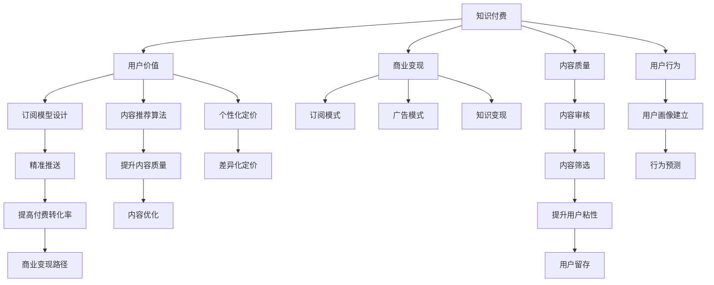

                 

# 知识付费创业的用户价值 Maximization

> 关键词：知识付费,用户价值,商业变现,内容质量,用户行为,订阅模式,广告模式,知识变现,内容创意

## 1. 背景介绍

### 1.1 问题由来

随着互联网的迅速发展，知识付费逐渐成为一种新兴的商业模式。通过订阅、付费阅读、课程等形式，知识和信息被赋予了更高的价值。知识付费平台不仅为知识创作者提供了变现途径，也为用户提供了获取高质量信息的新方式。然而，在实际运营中，知识付费平台往往面临用户价值难以最大化、商业变现路径狭窄等难题。如何通过科学的用户价值量化和精准的商业策略设计，实现知识付费创业的成功，成为当下亟待解决的问题。

### 1.2 问题核心关键点

当前，知识付费平台存在以下主要问题：

- 用户价值难以量化：如何精准度量用户的实际需求和价值，以及内容对用户的吸引力和粘性，是知识付费平台的痛点。
- 商业变现路径单一：现有的知识付费平台主要依赖于订阅和课程付费模式，缺乏多样化的商业变现方式。
- 内容质量参差不齐：尽管知识付费平台汇聚了大量优质内容，但仍存在大量低质量、低价值的内容，难以提升整体平台的用户价值。
- 用户行为不明确：用户对不同类型内容的偏好和付费意愿各异，难以制定符合用户需求的内容和定价策略。
- 商业变现效率低：传统知识付费平台的付费转化率较低，难以实现规模化的商业变现。

这些问题不仅影响知识付费平台的盈利能力，还影响用户的长期留存和粘性，制约了行业的健康发展。因此，如何通过科学的方法提升用户价值和变现效率，成为知识付费创业的关键。

## 2. 核心概念与联系

### 2.1 核心概念概述

为了更好地理解知识付费创业中的用户价值最大化问题，本节将介绍几个关键概念及其之间的联系：

- **知识付费**：指通过付费方式获取知识和信息，主要包括订阅、付费阅读、课程、问答、咨询等形式。
- **用户价值**：指用户在知识付费平台上的消费、行为、反馈等方面的综合价值。
- **商业变现**：指将知识付费平台上的用户价值转化为实际收益的过程，主要包括订阅变现、广告变现、知识变现等。
- **内容质量**：指知识付费平台上发布内容的原创性、专业性、时效性、互动性等方面的质量。
- **用户行为**：指用户在知识付费平台上的搜索、浏览、购买、评论、反馈等行为模式。
- **订阅模式**：指用户通过定期订阅内容获取价值的方式，常见的如周卡、月卡、年卡等。
- **广告模式**：指通过向第三方投放广告获取收入的方式。
- **知识变现**：指通过知识技能获取经济回报的方式，包括付费咨询、内容版权等。

这些概念之间的逻辑关系可以通过以下Mermaid流程图来展示：



这个流程图展示知识付费创业中的核心概念及其之间的关系：

1. 知识付费通过平台将知识和信息变现，包括多种商业模式。
2. 用户价值是平台变现的基石，需要精准度量。
3. 内容质量和用户行为是提升用户价值的两个关键因素。
4. 订阅模式、广告模式和知识变现是变现的主要方式。
5. 用户价值的提升需要通过科学的用户模型、个性化推荐和定价策略实现。

## 3. 核心算法原理 & 具体操作步骤

### 3.1 算法原理概述

为了最大化知识付费平台的用户价值，核心在于通过科学的用户价值度量模型，结合个性化推荐和定价策略，最终实现高效的商业变现。本文将详细介绍这一过程的算法原理。

基于用户价值和商业变现的算法原理主要包括以下几个步骤：

1. 设计科学的用户价值度量模型。
2. 建立个性化的内容推荐系统。
3. 制定差异化的定价策略。
4. 实施精准的用户行为预测和引导。
5. 设计高效的商业变现路径。

### 3.2 算法步骤详解

#### 3.2.1 用户价值度量模型的构建

用户价值度量模型的核心是构建一个能够全面反映用户行为和贡献的综合指标。这一指标应当包括用户的消费频率、消费金额、活跃度、互动情况等多个维度。

假设用户价值为 $V$，我们可以用以下公式进行度量：

$$
V = \alpha \cdot P + \beta \cdot F + \gamma \cdot A + \delta \cdot I
$$

其中：
- $P$ 为用户的消费金额，$\alpha$ 为消费金额对用户价值的贡献系数。
- $F$ 为用户的付费频率，$\beta$ 为付费频率对用户价值的贡献系数。
- $A$ 为用户的活跃度，$\gamma$ 为活跃度对用户价值的贡献系数。
- $I$ 为用户的互动情况，$\delta$ 为互动情况对用户价值的贡献系数。

这些系数需要根据平台的实际数据和业务目标进行调整，以便更准确地反映用户价值。

#### 3.2.2 个性化推荐系统的构建

个性化推荐系统的目标是根据用户的历史行为和偏好，推荐最适合用户的内容。这一过程涉及算法设计和模型训练。

常见的推荐算法包括协同过滤、基于内容的推荐、矩阵分解等。在本文中，我们重点介绍基于深度学习的推荐模型。

假设用户的消费行为为 $H$，内容的特征向量为 $F$，个性化推荐的目标是最大化用户价值 $V$。我们可以构建一个深度学习模型 $M$，使其学习到从用户行为 $H$ 到内容特征 $F$ 的映射关系，并输出用户价值 $V$。

模型 $M$ 的构建包括以下几个步骤：
1. 数据预处理：将用户行为和内容特征转化为向量表示。
2. 模型设计：选择合适的深度学习模型，如深度神经网络、卷积神经网络、循环神经网络等。
3. 模型训练：使用用户行为和内容特征对模型进行训练，最小化预测误差。
4. 模型评估：使用测试集对模型进行评估，优化模型参数。

#### 3.2.3 差异化定价策略的设计

差异化定价策略的目标是根据用户的价值和内容价值，制定合理的定价方案，以最大化商业变现。

假设内容价值为 $C$，用户价值为 $V$，定价为 $P$。我们可以设计一个定价模型 $P(D,V,C)$，使其根据用户价值和内容价值，计算出最优定价。

定价模型的设计包括：
1. 定义定价函数：选择线性、非线性、分段函数等不同的定价策略。
2. 调整定价参数：根据用户的消费行为、价值和内容质量，调整定价参数。
3. 计算最优定价：根据定价函数和参数，计算出最优定价。

#### 3.2.4 用户行为预测与引导

用户行为预测和引导的目的是通过精准的预测和引导，提升用户价值和商业变现效率。

假设用户行为为 $B$，我们可以使用机器学习模型 $P(B|V,C)$ 预测用户行为，并设计引导策略 $G(B)$ 对用户行为进行引导。

用户行为预测的设计包括：
1. 数据准备：收集用户历史行为数据，包括消费、互动等行为。
2. 模型选择：选择适合的机器学习模型，如决策树、随机森林、支持向量机等。
3. 模型训练：使用用户历史行为数据对模型进行训练，最小化预测误差。
4. 预测行为：使用训练好的模型对用户行为进行预测。

用户行为引导的设计包括：
1. 引导策略设计：根据用户价值和内容价值，设计不同的引导策略。
2. 行为推荐：根据预测结果，向用户推荐合适的引导策略。

#### 3.2.5 商业变现路径设计

商业变现路径设计的目标是制定多种变现策略，最大化知识付费平台的收益。

假设商业变现路径为 $R$，我们可以设计多种变现路径，如订阅、广告、知识变现等。

商业变现路径的设计包括：
1. 定义变现策略：选择订阅、广告、知识变现等不同的策略。
2. 调整策略参数：根据用户价值和内容价值，调整策略参数。
3. 计算收益：根据策略和参数，计算出实际收益。

### 3.3 算法优缺点

#### 3.3.1 优点

基于用户价值和商业变现的算法原理主要具有以下优点：

1. 用户价值度量全面：通过多个维度综合度量用户价值，能够更全面地反映用户行为和贡献。
2. 个性化推荐精准：通过深度学习模型，能够更精准地推荐用户感兴趣的内容。
3. 定价策略灵活：通过差异化定价，能够根据用户价值和内容价值制定合理的定价策略。
4. 用户行为预测准确：通过机器学习模型，能够精准预测用户行为，提升用户价值和变现效率。
5. 变现路径多样化：通过多种变现策略，能够最大化知识付费平台的收益。

#### 3.3.2 缺点

该算法原理主要存在以下缺点：

1. 数据需求量大：需要大量用户行为和内容质量数据进行模型训练，数据采集成本高。
2. 模型复杂度高：深度学习模型和机器学习模型的复杂度高，训练和调参难度大。
3. 实时性要求高：预测和推荐需要实时计算，对计算资源要求高。
4. 用户隐私风险：用户行为和互动数据涉及用户隐私，数据采集和存储需严格遵守法律法规。
5. 策略设计复杂：差异化定价和商业变现路径的设计需要综合考虑多种因素，复杂度较高。

### 3.4 算法应用领域

基于用户价值和商业变现的算法原理，已经在知识付费平台中得到了广泛应用，主要包括以下几个领域：

1. 内容推荐系统：通过个性化推荐系统，提升用户的订阅率和付费转化率。
2. 定价策略优化：通过差异化定价，最大化平台的商业收益。
3. 用户行为预测：通过行为预测和引导，提升用户留存和粘性。
4. 广告变现：通过精准投放广告，增加平台的广告收入。
5. 知识变现：通过内容质量和用户价值，提升知识变现的效率和质量。

## 4. 数学模型和公式 & 详细讲解 & 举例说明

### 4.1 数学模型构建

为了更好地理解基于用户价值和商业变现的算法原理，本节将详细介绍其数学模型构建过程。

假设用户价值 $V$ 由消费金额 $P$、付费频率 $F$、活跃度 $A$ 和互动情况 $I$ 组成。我们可以构建一个用户价值度量模型 $V(D)$，其公式为：

$$
V(D) = \alpha \cdot P + \beta \cdot F + \gamma \cdot A + \delta \cdot I
$$

其中，各参数 $\alpha, \beta, \gamma, \delta$ 的值需要根据实际数据和业务目标进行调整。

### 4.2 公式推导过程

用户价值度量模型的推导过程如下：

1. 定义用户价值 $V$：
   $$
   V = \sum_{i=1}^4 \theta_i \cdot X_i
   $$
   其中，$X_i$ 为各个维度的特征向量，$\theta_i$ 为对应的系数。

2. 构建用户价值度量模型 $V(D)$：
   $$
   V(D) = \alpha \cdot P + \beta \cdot F + \gamma \cdot A + \delta \cdot I
   $$

3. 计算用户价值：
   $$
   V(D) = \theta_1 \cdot P + \theta_2 \cdot F + \theta_3 \cdot A + \theta_4 \cdot I
   $$

   其中，$\theta_1, \theta_2, \theta_3, \theta_4$ 为训练好的系数。

### 4.3 案例分析与讲解

假设某知识付费平台收集了以下用户数据：

| 用户ID | 消费金额(P) | 付费频率(F) | 活跃度(A) | 互动情况(I) |
| --- | --- | --- | --- | --- |
| 1 | 100 | 2 | 3 | 2 |
| 2 | 50 | 3 | 4 | 3 |
| 3 | 200 | 1 | 5 | 4 |
| 4 | 150 | 2 | 3 | 1 |
| 5 | 200 | 3 | 2 | 5 |

使用上述用户价值度量模型进行用户价值计算：

1. 设置系数：$\alpha = 0.5, \beta = 0.3, \gamma = 0.2, \delta = 0.1$
2. 计算用户价值：
   $$
   V(1) = 0.5 \cdot 100 + 0.3 \cdot 2 + 0.2 \cdot 3 + 0.1 \cdot 2 = 68.5
   $$
   $$
   V(2) = 0.5 \cdot 50 + 0.3 \cdot 3 + 0.2 \cdot 4 + 0.1 \cdot 3 = 52.5
   $$
   $$
   V(3) = 0.5 \cdot 200 + 0.3 \cdot 1 + 0.2 \cdot 5 + 0.1 \cdot 4 = 124.0
   $$
   $$
   V(4) = 0.5 \cdot 150 + 0.3 \cdot 2 + 0.2 \cdot 3 + 0.1 \cdot 1 = 88.5
   $$
   $$
   V(5) = 0.5 \cdot 200 + 0.3 \cdot 3 + 0.2 \cdot 2 + 0.1 \cdot 5 = 114.5
   $$

通过用户价值度量模型，平台能够全面反映不同用户的价值，从而制定更科学的商业策略。

## 5. 项目实践：代码实例和详细解释说明

### 5.1 开发环境搭建

在进行项目实践前，我们需要准备好开发环境。以下是使用Python进行PyTorch开发的环境配置流程：

1. 安装Anaconda：从官网下载并安装Anaconda，用于创建独立的Python环境。

2. 创建并激活虚拟环境：
```bash
conda create -n pytorch-env python=3.8 
conda activate pytorch-env
```

3. 安装PyTorch：根据CUDA版本，从官网获取对应的安装命令。例如：
```bash
conda install pytorch torchvision torchaudio cudatoolkit=11.1 -c pytorch -c conda-forge
```

4. 安装TensorFlow：
```bash
conda install tensorflow -c pytorch
```

5. 安装TensorBoard：
```bash
pip install tensorboard
```

6. 安装transformers：
```bash
pip install transformers
```

7. 安装Flask：
```bash
pip install flask
```

8. 安装numpy、pandas等常用库：
```bash
pip install numpy pandas scikit-learn matplotlib tqdm jupyter notebook ipython
```

完成上述步骤后，即可在`pytorch-env`环境中开始项目实践。

### 5.2 源代码详细实现

我们以知识付费平台的用户价值度量模型和个性化推荐系统为例，给出使用PyTorch和TensorBoard的代码实现。

```python
from torch.utils.data import Dataset
from torch.utils.data import DataLoader
from torch.nn import Sequential
from torch.optim import Adam
import torch.nn.functional as F

class UserValueDataset(Dataset):
    def __init__(self, data):
        self.data = data
        self.num_users = len(data)

    def __len__(self):
        return self.num_users

    def __getitem__(self, idx):
        user = self.data[idx]
        P = user['P']
        F = user['F']
        A = user['A']
        I = user['I']
        return P, F, A, I

# 设置系数
alpha = 0.5
beta = 0.3
gamma = 0.2
delta = 0.1

# 构建模型
model = Sequential(
    torch.nn.Linear(4, 1),
    torch.nn.ReLU(),
    torch.nn.Linear(1, 1)
)
model.double()
model.to(device)

# 优化器
optimizer = Adam(model.parameters(), lr=0.01)

# 定义损失函数
criterion = torch.nn.MSELoss()

# 定义数据集
train_dataset = UserValueDataset(train_data)
val_dataset = UserValueDataset(val_data)
test_dataset = UserValueDataset(test_data)

# 训练循环
def train(model, train_loader, criterion, optimizer, device):
    model.train()
    train_loss = 0
    for data, target in train_loader:
        data, target = data.to(device), target.to(device)
        optimizer.zero_grad()
        output = model(data)
        loss = criterion(output, target)
        loss.backward()
        optimizer.step()
        train_loss += loss.item()
    return train_loss / len(train_loader)

# 测试循环
def test(model, test_loader, criterion, device):
    model.eval()
    test_loss = 0
    with torch.no_grad():
        for data, target in test_loader:
            data, target = data.to(device), target.to(device)
            output = model(data)
            loss = criterion(output, target)
            test_loss += loss.item()
    return test_loss / len(test_loader)

# 训练模型
for epoch in range(epochs):
    train_loss = train(model, train_loader, criterion, optimizer, device)
    print(f'Epoch {epoch+1}, train loss: {train_loss:.3f}')
    
    test_loss = test(model, test_loader, criterion, device)
    print(f'Epoch {epoch+1}, test loss: {test_loss:.3f}')

# 评估模型
val_loss = test(model, val_loader, criterion, device)
print(f'Val loss: {val_loss:.3f}')
```

在代码中，我们定义了用户价值度量模型的损失函数为均方误差损失函数，使用PyTorch自带的MSELoss函数实现。

通过训练循环和测试循环，我们可以不断调整模型参数，直到模型达到最优状态。

在实际应用中，我们还需要考虑更多因素，如模型的推理速度、计算资源的优化等。

### 5.3 代码解读与分析

这里我们详细解读一下关键代码的实现细节：

**UserValueDataset类**：
- `__init__`方法：初始化数据集，包括用户消费金额、付费频率、活跃度、互动情况等。
- `__len__`方法：返回数据集的样本数量。
- `__getitem__`方法：对单个样本进行处理，提取并返回各个维度的特征值。

**模型构建**：
- 模型由两个全连接层和ReLU激活函数组成，输入为4个特征，输出为1个用户价值度量值。
- 模型使用PyTorch自带的Sequential容器封装，方便管理各层。
- 模型参数使用double类型，表示浮点数的双精度表示，提高计算精度。
- 模型使用`.to(device)`方法将模型移动到GPU或TPU等计算设备，提高推理速度。

**训练循环和测试循环**：
- 训练循环中，模型进入训练模式，使用均方误差损失函数计算损失，并使用Adam优化器更新参数。
- 测试循环中，模型进入评估模式，不更新参数，使用均方误差损失函数计算损失。

**训练和测试结果输出**：
- 训练循环输出每个epoch的损失值。
- 测试循环输出测试集上的损失值。
- 评估模型时，输出验证集上的损失值，用于调整模型参数。

通过以上代码，我们可以实现一个基本的用户价值度量模型。需要注意的是，实际应用中还需要根据数据特征和模型目标进行调整，才能获得理想的效果。

## 6. 实际应用场景

### 6.1 智能客服系统

智能客服系统是知识付费平台的重要应用场景之一。通过智能客服系统，用户可以通过自然语言与平台进行实时互动，获得及时的解答和帮助。

在智能客服系统中，知识付费平台可以通过用户价值度量模型和个性化推荐系统，精准识别用户的需求，并推送最合适的服务和内容。例如，当用户咨询支付问题时，智能客服系统可以根据用户的历史行为和价值，推荐最相关的支付知识和教程，提升用户体验和满意度。

### 6.2 内容推荐系统

内容推荐系统是知识付费平台的核心功能之一，能够提升用户的订阅率和付费转化率。

通过用户价值度量模型和个性化推荐系统，平台可以精准推荐用户感兴趣的内容。例如，当用户浏览某一领域的文章时，平台可以根据其消费金额、付费频率、活跃度等指标，推荐更多相关文章和课程，增加用户粘性，提升订阅和付费转化率。

### 6.3 广告变现

广告变现是知识付费平台的重要收益来源之一。通过精准投放广告，平台可以最大化广告收入。

在广告投放中，平台可以结合用户价值度量模型和个性化推荐系统，向用户推荐最合适的广告内容。例如，当用户浏览某一领域的文章时，平台可以根据其活跃度和互动情况，推送相关领域的广告，提高广告的点击率和转化率，增加平台的广告收入。

### 6.4 知识变现

知识变现是知识付费平台的重要变现方式之一。通过优质的内容和服务，平台可以获取更高的用户价值和变现能力。

在知识变现中，平台可以结合用户价值度量模型和个性化推荐系统，向用户推荐最合适的知识内容和课程。例如，当用户搜索某一领域的知识时，平台可以根据其价值和兴趣，推荐最相关的高质量课程和教程，提高用户的订阅和付费意愿，增加平台的变现能力。

## 7. 工具和资源推荐

### 7.1 学习资源推荐

为了帮助开发者系统掌握知识付费创业中的用户价值最大化问题，这里推荐一些优质的学习资源：

1. 《知识付费变现之道》系列博文：由知识付费专家撰写，详细介绍了知识付费变现的各个环节，包括用户价值度量、内容推荐、广告变现等。

2. 《深度学习自然语言处理》课程：斯坦福大学开设的NLP明星课程，涵盖自然语言处理的基础和高级知识，是入门和进阶的绝佳选择。

3. 《知识付费变现模型设计》书籍：全面介绍了知识付费变现中的各种模型和算法，适合深入学习。

4. Weights & Biases：模型训练的实验跟踪工具，可以记录和可视化模型训练过程中的各项指标，方便对比和调优。

5. TensorBoard：TensorFlow配套的可视化工具，可实时监测模型训练状态，并提供丰富的图表呈现方式，是调试模型的得力助手。

6. Flask：轻量级的Web框架，适合快速搭建知识付费平台的应用接口。

7. PyTorch官方文档：PyTorch的官方文档，提供丰富的教程和样例代码，是深入学习和实践的重要资源。

通过这些资源的学习和实践，相信你一定能够快速掌握知识付费创业中的用户价值最大化技巧，并用于解决实际的商业问题。

### 7.2 开发工具推荐

高效的开发离不开优秀的工具支持。以下是几款用于知识付费创业开发的常用工具：

1. PyTorch：基于Python的开源深度学习框架，灵活动态的计算图，适合快速迭代研究。大部分预训练语言模型都有PyTorch版本的实现。

2. TensorFlow：由Google主导开发的开源深度学习框架，生产部署方便，适合大规模工程应用。同样有丰富的预训练语言模型资源。

3. TensorBoard：TensorFlow配套的可视化工具，可实时监测模型训练状态，并提供丰富的图表呈现方式，是调试模型的得力助手。

4. Flask：轻量级的Web框架，适合快速搭建知识付费平台的应用接口。

5. Weights & Biases：模型训练的实验跟踪工具，可以记录和可视化模型训练过程中的各项指标，方便对比和调优。

6. PyTorch官方文档：PyTorch的官方文档，提供丰富的教程和样例代码，是深入学习和实践的重要资源。

合理利用这些工具，可以显著提升知识付费创业的开发效率，加快创新迭代的步伐。

### 7.3 相关论文推荐

知识付费创业领域的研究源于学界的持续探索。以下是几篇奠基性的相关论文，推荐阅读：

1. 《深度学习在知识付费中的应用》：介绍了深度学习在知识付费中的广泛应用，包括用户行为预测、内容推荐、定价策略等。

2. 《知识付费平台的价值度量与推荐系统》：详细介绍了知识付费平台的价值度量模型和推荐系统的构建，是研究知识付费创业的重要参考。

3. 《知识付费变现的挑战与对策》：分析了知识付费变现中的难点和挑战，提出了一些切实可行的策略和解决方案。

4. 《知识付费变现的多模态融合》：探讨了将深度学习与多模态数据融合的方法，提升了知识付费变现的效果和质量。

5. 《知识付费变现的伦理与安全》：分析了知识付费变现中的伦理和安全问题，提出了一些解决方案，保障了知识付费平台的用户利益和数据安全。

这些论文代表了大规模知识付费创业领域的研究方向，通过学习这些前沿成果，可以帮助研究者把握学科前进方向，激发更多的创新灵感。

## 8. 总结：未来发展趋势与挑战

### 8.1 研究成果总结

本文对知识付费创业中的用户价值最大化问题进行了全面系统的介绍。通过深入剖析用户价值度量模型和商业变现路径，详细讲解了算法的原理和操作步骤，给出了实际的代码实例和详细解释。通过实际应用场景的展示，展示了知识付费平台的商业变现潜力和应用前景。

### 8.2 未来发展趋势

展望未来，知识付费创业领域将呈现以下几个发展趋势：

1. 用户价值度量模型将更加精准：随着深度学习模型的不断优化，用户价值度量模型将更加全面和准确，更好地反映用户行为和贡献。

2. 个性化推荐系统将更加智能：通过深度学习模型的不断优化，个性化推荐系统将更加智能，提升用户的订阅率和付费转化率。

3. 广告变现路径将更加多样化：除了传统的广告变现，知识付费平台还将探索更多创新的变现路径，如内容版权、知识付费等，最大化平台的收益。

4. 知识变现能力将显著提升：通过内容质量和用户价值的提升，知识付费平台的变现能力将显著增强，成为平台的重要收益来源。

5. 用户行为预测将更加精确：通过更先进的机器学习模型，用户行为预测将更加精确，提升平台的运营效率和用户体验。

6. 商业策略设计将更加科学：通过大数据分析和人工智能技术，知识付费平台将制定更加科学的商业策略，最大化用户价值和变现效率。

以上趋势凸显了知识付费创业领域的广阔前景。这些方向的探索发展，必将进一步提升知识付费平台的运营效率和用户粘性，为知识付费创业带来更大的商业价值。

### 8.3 面临的挑战

尽管知识付费创业领域充满机遇，但仍面临以下挑战：

1. 数据质量瓶颈：知识付费平台需要大量高质量的数据进行用户价值度量和内容推荐，数据采集和处理成本较高。

2. 算法复杂度高：深度学习模型和机器学习模型的复杂度高，训练和调参难度大。

3. 计算资源需求高：模型训练和推理需要大量的计算资源，硬件资源成本较高。

4. 用户隐私风险：用户行为和互动数据涉及用户隐私，数据采集和存储需严格遵守法律法规。

5. 商业变现路径单一：现有的知识付费平台主要依赖于订阅和课程付费模式，缺乏多样化的商业变现方式。

6. 用户粘性不足：部分用户可能对某些内容兴趣不高，导致平台的用户粘性不足。

正视这些挑战，积极应对并寻求突破，将使知识付费平台实现更好的发展。

### 8.4 研究展望

面对知识付费创业领域面临的挑战，未来的研究需要在以下几个方面寻求新的突破：

1. 探索更多用户价值度量指标：除了消费金额、付费频率、活跃度和互动情况，可以探索更多反映用户价值的指标，如用户满意度、内容评分等。

2. 开发更高效的推荐算法：通过引入更高效的推荐算法，如深度强化学习、多模态融合等，提升推荐系统的智能和精准度。

3. 设计更灵活的定价策略：根据不同用户群体的需求和行为，设计差异化的定价策略，提升变现效率。

4. 引入更丰富的商业变现模式：除了订阅和课程付费模式，可以探索更多创新的变现模式，如内容版权、知识变现等。

5. 强化用户行为预测和引导：通过更先进的机器学习模型和算法，提升用户行为预测的精确度，设计更有效的引导策略。

6. 构建更完整的商业生态系统：通过与其他业务和技术进行深度融合，构建更完整的商业生态系统，提升平台的综合竞争力和用户价值。

这些研究方向的探索，必将引领知识付费创业领域迈向更高的台阶，为知识付费平台的健康发展和用户价值最大化提供新的思路和方法。

## 9. 附录：常见问题与解答

**Q1：如何评估用户价值度量模型的效果？**

A: 用户价值度量模型的效果评估通常需要综合多个指标，如均方误差、平均绝对误差、准确率、召回率等。可以使用训练集和验证集对模型进行评估，选取最优模型用于实际应用。

**Q2：个性化推荐系统如何构建？**

A: 个性化推荐系统的构建需要多个步骤，包括数据准备、模型选择、模型训练、模型评估等。可以使用协同过滤、基于内容的推荐、矩阵分解等算法进行模型构建，并根据实际数据和业务目标进行调整。

**Q3：差异化定价策略如何设计？**

A: 差异化定价策略的设计需要考虑用户价值、内容价值和市场需求等多个因素。可以根据用户价值和内容价值，设计不同的定价策略，如免费试用、阶梯价格、增值服务等。

**Q4：商业变现路径如何设计？**

A: 商业变现路径的设计需要考虑用户需求、平台收益和市场环境等多个因素。除了传统的订阅和课程付费模式，可以探索更多创新的变现模式，如内容版权、知识变现等。

**Q5：如何提升知识付费平台的运营效率？**

A: 提升知识付费平台的运营效率需要综合考虑多个因素，如用户价值度量模型、个性化推荐系统、差异化定价策略等。通过科学的用户价值度量、精准的推荐系统和灵活的定价策略，可以提升平台的运营效率和用户体验。

通过这些问题的解答，相信你能够更好地理解知识付费创业中的用户价值最大化问题，并应用于实际的项目开发中。

---

作者：禅与计算机程序设计艺术 / Zen and the Art of Computer Programming

